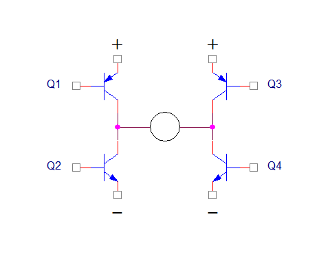
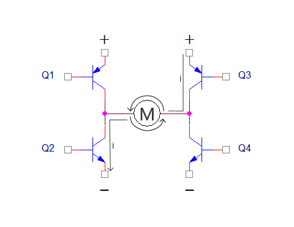

.. vim: syntax=rst

直流有刷电机
==========================================

直流有刷电机（Brushed DC motor）具有结构简单、易于控制、成本低等特点，
在一些功能简单的应用场合，或者说在能够满足必要的性能、低成本和足够的可靠性的前提下，
直流有刷电机往往是一个很好的选择。例如便宜的电子玩具、各种风扇和汽车的电动座椅等。
基本的直流有刷电机在电源和电机之间只需要两根电缆，这样就可以节省配线和连接器所需的空间，
并降低电缆和连接器的成本。此外，还可以使用MOSFET/IGBT开关对直流有刷电机进行控制，
给电机提供足够好的性能的同时，整个电机控制系统也会比较便宜。

直流有刷电机转速快、扭矩小，在某些应用中可能无法满足要求。这种情况就需要做一些改进来降低转速，并提高力矩。
直流减速电机就是这样一种电机，实物图如下图所示。

.. image:: ../media/dc_gear_motor.jpg
   :align: center
   :alt: 减速电机实物图

这种电机通常也叫齿轮减速电机，它是在普通直流有刷电机的基础上增加了一套齿轮减速箱，
用来提供更大的力矩和更低的转速。齿轮减速箱可以通过配置不同的减速比，提供各种不同的转速和力矩。
在实际使用中减速电机使用的最为广泛，所以本章节将主要介绍直流有刷减速电机。

本章节将介绍直流有刷电机的工作原理、电机参数和驱动电路，最后通过实验来实现电机运动的简单控制。

直流有刷电机工作原理
------------------------------------------

在分析原理前我们先复习一下左手定则。

左手定则是判断通电导体处于磁场中时，所受安培力 F (或运动)的方向、
磁感应强度B的方向以及通电导体棒的电流 I 三者方向之间的关系的定律。
通过左手定则可以知道通电导体在磁场中的受力方向，如下图所示。

判断方法是：伸开左手，使拇指与其他四指垂直且在一个平面内，让磁感线从手心流入，
四指指向电流方向，大拇指指向的就是安培力方向（即导体受力方向）。

有刷直流电机在其电枢上绕有大量的线圈，所产生强大的磁场与外部磁场相互作用产生旋转运动。
磁极方向的跳转是通过移动固定位置的接触点来完成的，该接触点在电机转子上与电触点相对连接。
这种固定触点通常由石墨制成，与铜或其他金属相比，在大电流短路或断路/起动过程中石墨不会熔断或者与旋转触点焊接到一起，
并且这个触点通常是弹簧承载的，所以能够获得持续的接触压力，保证向线圈供应电力。
在这里我们将通过其中一组线圈和一对磁极来分析其工作原理，如下图所示。

.. image:: ../media/motor_working_principle.png
   :align: center
   :alt: 有刷电机工作原理图

图中C和D两片半圆周的铜片构成换向器，两个弹性铜片靠在换向器两侧的A和B是电刷，电源通过电刷向导线框供电，
线框中就有电流通过，在线框两侧放一对磁极N和S，形成磁场，磁力线由N到S。线框通有电流时，
两侧导线就会受到磁场的作用力，方向依左手定则判断，红色和蓝色线框部分分别会受到力F\ :sub:`1`\和F\ :sub:`2`\，
这两个力的方向相反，这使得线框会转动，当线框转过90°时，换向器改变了线框电流的方向，产生的安培力方向不变，
于是导线框会连续旋转下去，这就是直流电动机的工作原理。

直流有刷减速电机几个重要参数
------------------------------------------

- 空载转速：正常工作电压下电机不带任何负载的转速（单位为r/min（转/分））。
  空载转速由于没有反向力矩，所以输出功率和堵转情况不一样，该参数只是提供一个电机在规定电压下最大转速的参考。
- 空载电流：正常工作电压下电机不带任何负载的工作电流（单位mA（毫安））。越好的电机，在空载时，该值越小。
- 负载转速：正常工作电压下电机带负载的转速。
- 负载力矩：正常工作电压下电机带负载的力矩 （N·m（牛米））。
- 负载电流：负载电流是指电机拖动负载时实际检测到的定子电流数值。
- 堵转力矩：在电机受反向外力使其停止转动时的力矩。如果电机堵转现象经常出现，
  则会损坏电机，或烧坏驱动芯片。所以大家选电机时，这是除转速外要考虑的参数。
  堵转时间一长，电机温度上升的很快，这个值也会下降的很厉害。
- 堵转电流：在电机受反向外力使其停止转动时的电流，此时电流非常大，时间稍微就可能会烧毁电机，
  在实际使用时应尽量避免。
- 减速比：是指没有减速齿轮时转速与有减速齿轮时转速之比。
- 功率：般指的是它的额定功率（单位W（瓦）），即在额定电压下能够长期正常运转的最大功率，
  也是指电动机在制造厂所规定的额定情况下运行时, 其输出端的机械功率。

直流有刷电机驱动设计与分析
------------------------------------------

我们先来想一个问题，假设你手里现在有一个直流电机和一节电池，
当你把电机的两根电源线和电池的电源连接在一起时，这时电机可以正常旋转，
当想要电机反向旋转时，只需要把两根电源线交换一下就可以了。
但是当在实际应用中要实现正转和反转的控制也通过交换电源线实现吗？
显然这样的方法是不可行的。这时候我们可以用一个叫做“H桥电路”来驱动电机。

控制电路原理设计与分析
^^^^^^^^^^^^^^^^^^^^^^^^^^^^^^^^^

如下图所示，是使用4个三极管搭建的H桥电路。

上图中，H桥式电机驱动电路包括4个三极管和一个电机。要使电机运转，必须导通对角线上的一对三极管。
根据不同三极管对的导通情况，电流可能会从左至右或从右至左流过电机，从而控制电机的转向。

.. image:: ../media/H-bridge_circuit_CW.png
   :align: center
   :alt: 三极管搭建H桥顺时针转动

上图中，当Q\ :sub:`1`\和Q\ :sub:`4`\导通时，电流将经过Q\ :sub:`1`\从左往右流过电机，
在经过Q\ :sub:`4`\流到电源负极，这时图中电机可以顺时针转动。

上图中，当Q\ :sub:`3`\和Q\ :sub:`2`\导通时，电流将经过Q\ :sub:`3`\从右往左流过电机，
在经过Q\ :sub:`2`\流到电源负极，这时图中电机可以逆时针转动。

特别地，当同一侧的Q\ :sub:`1`\和Q\ :sub:`2`\同时导通时，电流将从电源先后经过Q\ :sub:`1`\和Q\ :sub:`2`\，然后直接流到电源负极，
在这个回路中除了三极管以外就没有其他负载（没有经过电机），这时电流可能会达到最大值，此时可能会烧毁三极管，
同理，当Q\ :sub:`3`\和Q\ :sub:`4`\同时导通时，也会出现相同的状况。这样的情况肯定是不能发生的，
但是我们写程序又是三分写代码七分在调试，这就难免会有写错代码将同一测得三极管导通的情况，
为此我们就需要从硬件上来避免这个问题。下面电路图是改进后的驱动电路图。

与改进前的电路相比，在上面的改进电路中新增加了两个非门和4个与门，经过这样的组合就可以实现一个信号控制两个同一侧的三极管，
并且可以保证在同一侧中两个三级管不会同时导通，在同一时刻只会有一个三极管是导通的。

我们来分析一下电信号的变化：在ENABLE脚接入高电平，在IN1脚接入高电平，在经过第一个非门后，AND1的2脚就是低电平，
此时与门AND1的输出（3脚）就是低电平，所以Q1截止。而AND2的1脚和2脚都是高电平，所以AND2的3脚也是高电平，
这样Q2就导通了。在IN2接入低电平，同理分析可得，Q3导通Q4截止。在IN1和IN2处分别接入低电平和高电平，
则Q1和Q4导通，Q3和Q2截止。当IN1和IN2都接入高电平或者高电平时都只会同时导通上面或者下面的两个三极管，
不会出现同一侧的三极管同时导通的情况。

驱动芯片分析
^^^^^^^^^^^^^^^^^^^^^^^^^^^^^^^^^

通常在驱动电机的时候我们会选择集成H桥的IC，因为H桥使用分立元件搭建比较麻烦，增加了硬件设计难度，
当然如果集成IC无法满足我们的功率要求时，还是需要我们自己使用MOS管、三极管等元件来搭建H桥电路，
这样的分立元件搭建的H桥一般驱动能力都会比集成IC要高。当我们在选择集成IC时，
我们需要考虑集成IC是否能满足电机的驱动电压要求，是否能承受电机工作时的电流等情况。

L298N驱动芯片
"""""""""""""""""

L298N是ST公司的产品，内部包含4通道逻辑驱动电路，是一种二相和四相电机的专门驱动芯片，
即内含两个H桥的高电压大电流双桥式驱动器，接收标准的TTL逻辑电平信号，可驱动4.5V~46V、
2A以下的电机，电流峰值输出可达3A，其内部结构如下图所示。

其工作原理与上面的讲解的H桥原理一样，这里不再赘述。L298N引脚图如下图所示。

L298N逻辑功能表。

===  ===  ===  ========
IN1  IN2  ENA  电机状态
===  ===  ===  ========
×    ×    0    电机停止
1    0    1    电机正转
0    1    1    电机反转
0    0    1    电机停止
1    1    1    电机停止
===  ===  ===  ========

IN3，IN4的逻辑图与上表相同。由上表可知ENA为低电平时，INx输入电平对电机控制不起作用，
当ENA为高电平，输入电平为一高一低，电机正或反转。同为低电平电机停止，同为高电平电机停止。
L298N的应用电路图将在后面硬件设计小节讲解。

直流有刷减速电机控制实现
-----------------------------------

速度控制原理
^^^^^^^^^^^^^^^^^^^^^^^^^^^^^^^^^

脉冲宽度调制（Pulse width modulation，PWM）信号，即PWM是一种按一定的规则对各脉冲的宽度进行调制，
既可改变电路输出电压的大小，也可改变输出频率。PWM通过一定的频率来改变通电和断电的时间，
从而控制电路输出功率，在电机的控制周期中,通电时间决定了它的转速。其中，
通电时间/(通断时间+断电时间)=占空比，即，高电平占整个周期的百分比，如下图所示：

.. image:: ../media/pwm_explain.png
   :align: center
   :alt: PWM详解

上图中：T\ :sub:`1`\为高电平时间，T\ :sub:`2`\为低电平时间，T是周期。

D(占空比) = T\ :sub:`1`\/T*100%

设电机的速度为V，最大速度为V\ :sub:`max`\。

则：V=V\ :sub:`max`\*D

当占空比D（0≤D≤1）的大小改变时，速度V也会改变，所以只要改变占空比就能达到控制的目的。

硬件设计
^^^^^^^^^^^^^^^^^^^^^^^^^^^^^^^^^

主控有刷电机接口原理图如下图所示，有刷电机接口与无刷接口使用的是同一个接口，舍去了其中一些多余的接口，
用到了两个定时器通道，编码器、两路ADC采集通道（后续章节讲解）。本节实验只用到了TIM1的CH1和CH2，
即PA8和PA9来输出PWM信号来控制电机，注意主控板需要和电机驱动板供地。

.. image:: ../media/bldcm_interface_circuit.png
   :align: center
   :alt: 主板接口

L298N
""""""""""""""""""""""""

驱动板可以支持12-42V的宽电压供电，并且带输入电压转5V的电压芯片，所以驱动板只需要一个电源输入。
具体需要多大电压需要根据电机来选择。电路图见下图所示。

在下图电机控制接口中，ENABLEA和ENABLEB是使能输入脚，ENABLEA用于控制A桥，可以接到单片机的引脚控制，
也是直接使用跳冒连接到5V，ENABLEB用于控制B桥，控制方式与ENABLE一样。
INPUT1和INPUT2是A桥的控制信号，INPUT1和INPUT2是B桥的控制信号，可以接PWM控制电机。
OUTPUT1和OUTPUT2是A桥的输出接口，OUTPUT3和OUTPUT4是B桥的输出接口。

上图中8个二极管用于防止电机的反电动势损坏L298N，当E点反电势为正，超过电源+0.7V时，
上端二极管导通，这样输出线就被限位在电源电压+0.7V上，不会超过这个数值；
当E点反电势为负，低于-0.7V时，下端二极管导通，这样输出线就被限位在-0.7V上，
不会低于-0.7V了。这两个二极管是作为钳位使用，使得输出线上电压（或叫电位）
被箝位在-0.7V~+Vcc+0.7V之间。其他二极管作用于E点这两个一样。

电机与L298N驱动板连接见下表所示。

.. list-table:: 电机与L298N驱动板连接
    :widths: 40 40
    :header-rows: 1

    * - 电机
      - L298N驱动板
    * - M+
      - 电机输出：1
    * - M-
      - 电机输出：2

L298N驱动板与主控板连接见下表所示。

.. list-table:: L298N驱动板与主控板连接
    :widths: 40 40
    :header-rows: 1

    * - L298N驱动板
      - 主控板
    * - PWM1
      - PA9
    * - PWM2
      - PA8
    * - GND
      - GND
    * - ENA
      - PG12

在L298N驱动板与主控板连接中，ENA可以不接PG12，使用跳冒连接到5V。

野火直流有刷电机驱动板-MOS管搭建板
"""""""""""""""""""""""""""""""""""""

野火有刷电机驱动板是使用MOS管搭建的大功率H桥电机驱动板，实物图如下图所示。

.. image:: ../media/yh_dc_brush_motor_mos_h.png
   :align: center
   :alt: 野火有刷电机驱动板

驱动板可支持12V~70V的宽电压输入，10A过电流保护电路，超过10A可自动禁用电机控制信号，最高功率支持700W。
实际使用输入电压需要根据电机进行选择，同时还具有电流采样电路、编码器接口和电源电压检测电路等等，
本小节主要讲解电机驱动部分电路，其他功能将在后续章节中讲解。

野火使用MOS管搭建的直流有刷驱动板做到了信号完全隔离，其他驱动板基本都只是使用光耦隔离了控制信号，
并没有对ADC采样电路进行隔离，野火不仅使用光耦对控制信号进行了隔离，
还使用AMC1200SDUBR隔离运放对ADC采样电路进行了隔离。

PWM控制信号使用了TLP2362高速光耦进行了隔离，SD控制信号使用了EL357N光耦进行了隔离，如下图所示。

.. image:: ../media/有刷-光耦-与门-隔离.png
   :align: center
   :alt: 光耦隔离部分

与门的作用是可以使单片机和过流保护电路共同控制SD脚，过流保护电路将在电流电压采集章节讲解，
与门输入输出与MOS管状态真值表如下表所示。

.. list-table:: 与门输入输出与MOS管状态真值表
    :widths: 15 15 15 60
    :header-rows: 1

    * - A
      - B
      - Y
      - MOS
    * - H
      - H
      - H
      - 可导通
    * - H
      - L
      - L
      - 关断（过流保护）
    * - L
      - H
      - L
      - 关断（单片机控制关断）
    * - L
      - L
      - L
      - 关断（单片机控制关断，过流保护）

下图是使用MOS管搭建的H桥电路，使用两个EG2104驱动四个MOS管。

EG2104S主要功能有逻辑信号输入处理、死区时间控制、电平转换功能、悬浮自举电源结构和上下桥图腾柱式输出。
逻辑信号输入端高电平阀值为 2.5V 以上，低电平阀值为 1.0V 以下，要求逻辑信号的输出电流小，
可以使MCU输出逻辑信号直接连接到EG2104S的输入通道上。EG2104S芯片有一个shutdown引脚，
逻辑输入控制信号低电平有效，控制强行使LO、HO输出低电平。这样可以直接使用这个引脚做软件控制电机的旋转与停止，
还可以实现硬件的限流保护（后续章节分析保护电路），输入信号和输出信号逻辑真值表如下表所示。

.. list-table:: EG2104S输入信号和输出信号逻辑真值表
    :widths: 10 10 20 20
    :header-rows: 1

    * - IN（引脚2）
      - SD（引脚3）
      - HO（引脚7）
      - LO（引脚5）
    * - L
      - L
      - L
      - L
    * - H
      - L
      - L
      - L
    * - L
      - H
      - L
      - H
    * - H
      - H
      - H
      - L

从真值表可知，在输入逻辑信号SD为“L”时，不管IN为“H”或者“L”情况下，驱动器控制输出HO、LO同时为“L”，
上、下功率管同时关断；当输入逻辑信号SD为“H”、IN为“L”时，HO输出为“L”，LO输出为“H”；
当输入逻辑信号SD为“H”、IN 为“H”时，HO输出为“H”，LO输出为“L”。

EG2104S内部集成了死区时控制电路，死区时间波形图如下图所示，其中死区时间DT的典型值为640ns。

.. image:: ../media/EG2104S_dead-time.png
   :align: center
   :alt: 死区控制电路

EG2104S采用自举悬浮驱动电源结构大大简化了驱动电源设计，
只用一路电源电压VCC即可完成高端N沟道MOS管和低端N沟道MOS管两个功率开关器件的驱动，给实际应用带来极大的方便。
EG2104S自举电路结构如下图所示，EG2104S可以使用外接一个自举二极管和一个自举电容自动完成自举升压功能，
假定在下管开通、上管关断期间VC自举电容已充到足够的电压（Vc=VCC），当HO输出高电平时上管开通、下管关断时，
VC自举电容上的电压将等效一个电压源作为内部驱动器VB和VS的电源，完成高端N沟道MOS管的驱动。

电机与MOS管搭建驱动板连接见下表所示。

.. list-table:: 电机与MOS管搭建驱动板连接
    :widths: 20 20
    :header-rows: 1

    * - 电机
      - MOS管搭建驱动板
    * - M+
      - M+
    * - M-
      - M-

MOS管搭建驱动板与主控板连接见下表所示。

.. list-table:: MOS管搭建驱动板与主控板连接
    :widths: 20 20
    :header-rows: 1

    * - MOS管搭建驱动板
      - 主控板
    * - PWM1
      - PA9
    * - PWM2
      - PA8
    * - SD
      - PG12
    * - 电源输入：5V
      - 5V
    * - 电源输入：GND
      - GND

推荐使用配套的牛角排线直接连接驱动板和主控板。

软件设计
^^^^^^^^^^^^^^^^^^^^^^^^^^^^^^^^^

这里只讲解核心的部分代码，有些变量的设置，头文件的包含等并没有涉及到，完整的代码请参考本章配套的工程。
我们创建了四个文件：bsp_general_tim.c、bsp_general_tim.h、bsp_motor_control.c和bsp_motor_control.h
文件用来存定时器驱动和电机控制程序及相关宏定义。

编程要点
"""""""""""""""""

(1) 定时器 IO 配置

(2) 定时器时基结构体TIM_TimeBaseInitTypeDef配置

(3) 定时器输出比较结构体TIM_OCInitTypeDef配置

(4) 根据定时器定义电机控制相关函数

.. code-block:: c
   :caption: bsp_general_tim.h-宏定义
   :linenos:

    /*宏定义*/
    #define PWM_TIM                        	TIM1
    #define PWM_TIM_GPIO_AF                 GPIO_AF1_TIM1
    #define PWM_TIM_CLK_ENABLE()  					__TIM1_CLK_ENABLE()

    #define PWM_CHANNEL_1                   TIM_CHANNEL_1
    #define PWM_CHANNEL_2                   TIM_CHANNEL_2

    /* 累计 TIM_Period个后产生一个更新或者中断*/
    /* 当定时器从0计数到PWM_PERIOD_COUNT，即为PWM_PERIOD_COUNT+1次，为一个定时周期 */
    #define PWM_PERIOD_COUNT     (1000)

    /* 通用控制定时器时钟源TIMxCLK = HCLK=168MHz */
    /* 设定定时器频率为=TIMxCLK/(PWM_PRESCALER_COUNT+1) */
    #define PWM_PRESCALER_COUNT     (9)

    /*PWM引脚*/
    #define PWM_TIM_CH1_GPIO_PORT           GPIOA
    #define PWM_TIM_CH1_PIN                 GPIO_PIN_8

    #define PWM_TIM_CH2_GPIO_PORT           GPIOA
    #define PWM_TIM_CH2_PIN                 GPIO_PIN_9

    #define PWM_TIM_CH3_GPIO_PORT           GPIOA
    #define PWM_TIM_CH3_PIN                 GPIO_PIN_10

使用宏定义非常方便程序升级、移植。如果使用不同的定时器IO，修改这些宏即可。

定时器复用功能引脚初始化

.. code-block:: c
   :caption: 定时器复用功能引脚初始化
   :linenos:

    static void TIMx_GPIO_Config(void)
    {
    GPIO_InitTypeDef GPIO_InitStruct;

      /* 定时器通道功能引脚端口时钟使能 */

      __HAL_RCC_GPIOA_CLK_ENABLE();
      __HAL_RCC_GPIOA_CLK_ENABLE();

      /* 定时器通道1功能引脚IO初始化 */
      /*设置输出类型*/
      GPIO_InitStruct.Mode = GPIO_MODE_AF_PP;
      /*设置引脚速率 */
      GPIO_InitStruct.Speed = GPIO_SPEED_FREQ_HIGH;
      /*设置复用*/
      GPIO_InitStruct.Alternate = PWM_TIM_GPIO_AF;

      /*选择要控制的GPIO引脚*/
      GPIO_InitStruct.Pin = PWM_TIM_CH1_PIN;
      /*调用库函数，使用上面配置的GPIO_InitStructure初始化GPIO*/
      HAL_GPIO_Init(PWM_TIM_CH1_GPIO_PORT, &GPIO_InitStruct);
      GPIO_InitStruct.Pin = PWM_TIM_CH2_PIN;	
      HAL_GPIO_Init(PWM_TIM_CH2_GPIO_PORT, &GPIO_InitStruct);
    }

定时器通道引脚使用之前必须设定相关参数，这选择复用功能，并指定到对应的定时器。
使用GPIO之前都必须开启相应端口时钟。

.. code-block:: c
   :caption: 定时器模式配置
   :linenos:

    TIM_HandleTypeDef  TIM_TimeBaseStructure;
    static void TIM_PWMOUTPUT_Config(void)
    {
      TIM_OC_InitTypeDef  TIM_OCInitStructure;

      /*使能定时器*/
      PWM_TIM_CLK_ENABLE();

      TIM_TimeBaseStructure.Instance = PWM_TIM;
      /* 累计 TIM_Period个后产生一个更新或者中断*/
      //当定时器从0计数到PWM_PERIOD_COUNT，即为PWM_PERIOD_COUNT+1次，为一个定时周期
      TIM_TimeBaseStructure.Init.Period = PWM_PERIOD_COUNT - 1;
      // 通用控制定时器时钟源TIMxCLK = HCLK/2=84MHz
      // 设定定时器频率为=TIMxCLK/(PWM_PRESCALER_COUNT+1)
      TIM_TimeBaseStructure.Init.Prescaler = PWM_PRESCALER_COUNT - 1;	
      
      /*计数方式*/
      TIM_TimeBaseStructure.Init.CounterMode = TIM_COUNTERMODE_UP;
      /*采样时钟分频*/
      TIM_TimeBaseStructure.Init.ClockDivision=TIM_CLOCKDIVISION_DIV1;
      /*初始化定时器*/
      HAL_TIM_PWM_Init(&TIM_TimeBaseStructure);

    	/*PWM模式配置*/
      TIM_OCInitStructure.OCMode = TIM_OCMODE_PWM1;
    	TIM_OCInitStructure.Pulse = 0;
    	TIM_OCInitStructure.OCPolarity = TIM_OCPOLARITY_HIGH;
    	TIM_OCInitStructure.OCNPolarity = TIM_OCPOLARITY_HIGH;
    	TIM_OCInitStructure.OCIdleState = TIM_OCIDLESTATE_SET;
    	TIM_OCInitStructure.OCNIdleState = TIM_OCNIDLESTATE_RESET;
      TIM_OCInitStructure.OCFastMode = TIM_OCFAST_DISABLE;
    	
    	/*配置PWM通道*/
      HAL_TIM_PWM_ConfigChannel(&TIM_TimeBaseStructure, &TIM_OCInitStructure, PWM_CHANNEL_1);
    	/*开始输出PWM*/
    	HAL_TIM_PWM_Start(&TIM_TimeBaseStructure,PWM_CHANNEL_1);
    	
    	/*配置脉宽*/
      TIM_OCInitStructure.Pulse = 0;    // 默认占空比为50%
    	/*配置PWM通道*/
      HAL_TIM_PWM_ConfigChannel(&TIM_TimeBaseStructure, &TIM_OCInitStructure, PWM_CHANNEL_2);
    	/*开始输出PWM*/
    	HAL_TIM_PWM_Start(&TIM_TimeBaseStructure,PWM_CHANNEL_2);
    }

首先定义两个定时器初始化结构体，定时器模式配置函数主要就是对这两个结构体的成员进行初始化，
然后通过相应的初始化函数把这些参数写入定时器的寄存器中。有关结构体的成员介绍请参考定时器详解章节。

不同的定时器可能对应不同的APB总线，在使能定时器时钟是必须特别注意。通用控制定时器属于APB1，
定时器内部时钟是84MHz。

在时基结构体中我们设置定时器周期参数为PWM_PERIOD_COUNT（5599），频率为15KHz，使用向上计数方式。
因为我们使用的是内部时钟，所以外部时钟采样分频成员不需要设置，重复计数器我们没用到，也不需要设置。

在输出比较结构体中，设置输出模式为PWM1模式，通道输出高电平有效，设置脉宽为ChannelPulse，
ChannelPulse是我们定义的一个无符号16位整形的全局变量，用来指定占空比大小，
实际上脉宽就是设定比较寄存器CCR的值，用于跟计数器CNT的值比较。

最后使用HAL_TIM_PWM_Start函数让计数器开始计数和通道输出。

.. code-block:: c
   :caption: bsp_motor_control.h-电机方向控制枚举
   :linenos:

    /* 电机方向控制枚举 */
    typedef enum
    {
      MOTOR_FWD = 0,
      MOTOR_REV,
    }motor_dir_t;

在这里枚举了两个变量，用于控制电机的正转与反转。**注意**：在这里并不规定什么方向是正转与反转，
这个是你自己定义的。

.. code-block:: c
   :caption: 变量定义
   :linenos:

    /* 私有变量 */
    static motor_dir_t direction  = MOTOR_FWD;     // 记录方向
    static uint16_t    dutyfactor = 0;             // 记录占空比

定义两个私有变量，direction用于记录电机旋转方向，dutyfactor用于记录当前设置的占空比。

.. code-block:: c
   :caption: 定时器到电机控制的宏接口
   :linenos:

    /* 设置速度（占空比） */
    #define SET_FWD_COMPAER(ChannelPulse)     TIM1_SetPWM_pulse(PWM_CHANNEL_1,ChannelPulse)    // 设置比较寄存器的值
    #define SET_REV_COMPAER(ChannelPulse)     TIM1_SetPWM_pulse(PWM_CHANNEL_2,ChannelPulse)    // 设置比较寄存器的值

    /* 使能输出 */
    #define MOTOR_FWD_ENABLE()      HAL_TIM_PWM_Start(&TIM_TimeBaseStructure,PWM_CHANNEL_1);    // 使能 PWM 通道 1
    #define MOTOR_REV_ENABLE()      HAL_TIM_PWM_Start(&TIM_TimeBaseStructure,PWM_CHANNEL_2);    // 使能 PWM 通道 2

    /* 禁用输出 */
    #define MOTOR_FWD_DISABLE()     HAL_TIM_PWM_Stop(&TIM_TimeBaseStructure,PWM_CHANNEL_1);     // 禁用 PWM 通道 1
    #define MOTOR_REV_DISABLE()     HAL_TIM_PWM_Stop(&TIM_TimeBaseStructure,PWM_CHANNEL_2);     // 禁用 PWM 通道 2

使用宏定义非常方便程序升级、移植。如果使用不同的定时器IO，修改这些宏即可。

.. code-block:: c
   :caption: 设置电机速度
   :linenos:

    void set_motor_speed(uint16_t v)
    {
      dutyfactor = v;

      if (direction == MOTOR_FWD)
      {
        SET_FWD_COMPAER(dutyfactor);     // 设置速度
      }
      else
      {
        SET_REV_COMPAER(dutyfactor);     // 设置速度
      }
    }

根据电机的旋转方向来设置电机的速度（占空比），并记录下设置的占空比，方便在切换旋转
方向时设置另一路为相同的占空比。

.. code-block:: c
   :caption: 设置电机方向
   :linenos:

    void set_motor_direction(motor_dir_t dir)
    {
      direction = dir;

      if (direction == MOTOR_FWD)
      {
        SET_FWD_COMPAER(dutyfactor);     // 设置速度
        SET_REV_COMPAER(0);              // 设置占空比为 0
      }
      
      else
      {
        SET_FWD_COMPAER(0);              // 设置速度
        SET_REV_COMPAER(dutyfactor);     // 设置占空比为 0
      }
    }

将一路PWM的占空比设置为0，另一路用于设置速度。

.. code-block:: c
   :caption: main
   :linenos:
	
	  /**
	    * @brief  主函数
	    * @param  无
	    * @retval 无
	    */
	  int main(void) 
	  {
	  	__IO uint16_t ChannelPulse = PWM_MAX_PERIOD_COUNT/2;
	  	uint8_t i = 0;
	  
	  	/* 初始化系统时钟为168MHz */
	  	SystemClock_Config();
	  
	  	/* 初始化按键GPIO */
	  	Key_GPIO_Config();
	  
	  	/* 电机初始化 */
	  	motor_init();
	  
	  	set_motor_disable();
	  	set_motor_speed(ChannelPulse);
	  	
	  	while(1)
	  	{
	      /* 扫描KEY1 */
	      if( Key_Scan(KEY1_GPIO_PORT, KEY1_PIN) == KEY_ON)
	      {
	        /* 使能电机 */
	        set_motor_enable();
	      }
	      
	      /* 扫描KEY2 */
	      if( Key_Scan(KEY2_GPIO_PORT, KEY2_PIN) == KEY_ON)
	      {
	        set_motor_disable();
	      }
	      
	      /* 扫描KEY3 */
	      if( Key_Scan(KEY3_GPIO_PORT, KEY3_PIN) == KEY_ON)
	      {
	        /* 增大占空比 */
	        ChannelPulse += PWM_MAX_PERIOD_COUNT/10;
	        
	        if(ChannelPulse > PWM_MAX_PERIOD_COUNT)
	          ChannelPulse = PWM_MAX_PERIOD_COUNT;
	        
	        set_motor_speed(ChannelPulse);
	      }
	      
	      /* 扫描KEY4 */
	      if( Key_Scan(KEY4_GPIO_PORT, KEY4_PIN) == KEY_ON)
	      {
	        if(ChannelPulse < PWM_MAX_PERIOD_COUNT/10)
	          ChannelPulse = 0;
	        else
	          ChannelPulse -= PWM_MAX_PERIOD_COUNT/10;
	        
	        set_motor_speed(ChannelPulse);
	      }
	      
	      /* 扫描KEY5 */
	      if( Key_Scan(KEY5_GPIO_PORT, KEY5_PIN) == KEY_ON)
	      {
	        /* 转换方向 */
	        set_motor_direction( (++i % 2) ? MOTOR_FWD : MOTOR_REV);
	      }
	  	}
	  }

首先初始化系统时钟，然后初始化定时器和按键，将占空比设置为50%。
在死循环里面扫描按键，KEY1按下使能电机驱动板，KEY2按下失能电机驱动板，KEY3按键按下增加速度（占空比），KEY4按键按下减少速度（占空比），
KEY5按键按下切换电机旋转方向。

下载验证
^^^^^^^^^^^^^^^^^^^^^^^^^^^^^^^^^

如果有条件的话，这里我们先不连接电机，先通过示波器连接到开发板的PWM输出引脚上，通过示波器来观察PWM
的变化情况:

- 使用DAP连接开发板到电脑；
- 使用示波器的CH1连接到PA15，CH2连接到PB3，注意示波器要与开发板共地；
- 给开发板供电，编译下载配套源码，复位开发板。

上电后我们通过示波器可以观察到两个通道都是低电平，当按下KEY1后，使能PWM输出，按KEY3可以增加CH1通道的占空比，
，按KEY4可以减小占空比，按KEY5可以交换PWM输出，如下图所示。

.. image:: ../media/dc_motor_duty_cycle1.jpg
   :align: center
   :alt: 示波器观察PWM输出情况

在上图中黄色波形为CH1通道，蓝色波形为CH2通道，按下一次KEY1后，能使PWM输出。此时可以通过计算示波器上显示的波形在占空比和频率，
通过波形计算也与理论相符，这说明我们的PWM的配置是正确的，其中CH2通道的波形
一直为低电平。当CH1和CH2都为低电平时，电机停止转动。当CH1上的平均电压大于电机的启动电压后电机就
可以转动了，电源电压为12V，占空比为D,则平均电压为：12V*D。当按下KEY5后两通道输出相反，CH1一直为
低电平，CH2为PWM波，电机反向转动。

在确定PWM输出正确后我们就可以接上电机进行验证我们的程序了。

**按键操作：**

- KEY1:使能电机
- KEY2:禁用电机
- KEY3:加速
- KEY4:减速比
- KEY5:换向

可以通过按键来操作来观察电机的执行效果
