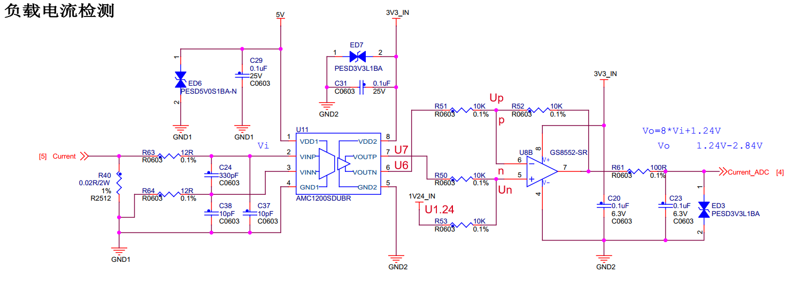
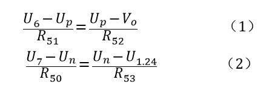
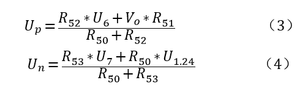
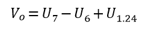
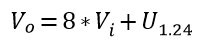
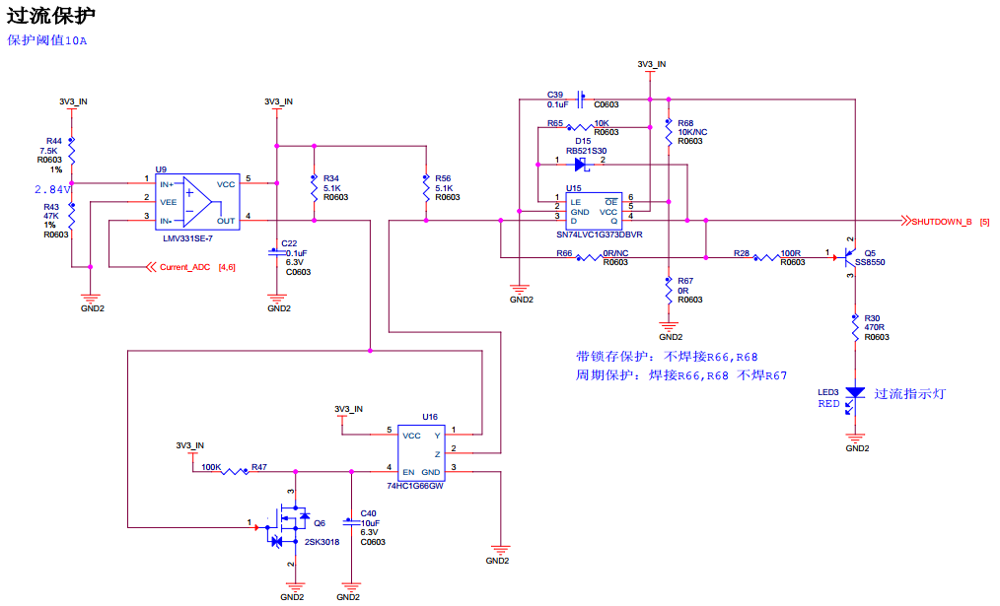
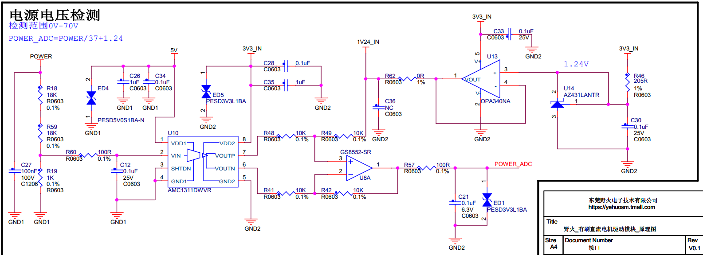

.. vim: syntax=rst

直流有刷驱动板电流电压采集
==========================================

野火使用MOS管搭建的直流有刷驱动板做到了信号完全隔离，其他驱动板基本都只是使用光耦隔离了控制信号，
并没有对ADC采样电路进行隔离，野火不仅使用光耦对控制信号进行了隔离，
还使用AMC1200SDUBR隔离运放对ADC采样电路进行了隔离。

电流采样电路
------------------------------------------

如下图所示是电流采样电路，在电机驱动电路中串入一个0.02Ω、2W的采样电阻，将电流信号转换成电压信号，
再经过隔离运放放大8倍后差分输出，使用普通运放将差分输出转换成单端输出给STM32的ADC采样通道。

从上图中我们可以知道是一个负反馈电路，那么根据虚短和虚短可以知道U\ :sub:`p`\=U\ :sub:`n`\，
p点和n点没有电流到运放的5脚和6脚，可以得：

将（1）式和（2）式整理可得：

因为U\ :sub:`p`\=U\ :sub:`n`\，所以有：

.. image:: ../media/有刷电机驱动运放公式合并.png
   :align: center
   :alt: 差分转单端输出合并

其中R\ :sub:`52`\=R\ :sub:`51`\=R\ :sub:`53`\=R\ :sub:`50`\=10KΩ，
将R\ :sub:`52`\、R\ :sub:`51`\、R\ :sub:`53`\和R\ :sub:`50`\阻值带入上式化简可得：

因为隔离运放将V\ :sub:`i`\放大8倍后输出，所以有U\ :sub:`7`\-U\ :sub:`6`\=8*V\ :sub:`i`\，
带入上式可得：

在下图中使用电压比较器LMV331SE实现10A过流保护电路，Vip经过隔离运放和普通运放后输入到比较器的IN-，
当IN-的电压超过IN+时比较器的OUT将输出低电平到与门。

光耦隔离部分电路图如下图所示。

.. image:: ../media/有刷-光耦-与门-隔离.png
   :align: center
   :alt: 光耦隔离部分

与门输入输出与MOS管状态真值表如下表所示。

.. list-table:: 与门输入输出与MOS管状态真值表
    :widths: 15 15 15 60
    :header-rows: 1

    * - A
      - B
      - Y
      - MOS
    * - H
      - H
      - H
      - 可导通
    * - H
      - L
      - L
      - 关断（过流保护）
    * - L
      - H
      - L
      - 关断（单片机控制关断）
    * - L
      - L
      - L
      - 关断（单片机控制关断，过流保护）

电压采样电路
------------------------------------------

如下图所示是电源电压采样电路，在电源电压上并联R18和R19的串联电阻，R19两端的电压作为隔离运放的输入，
再经过隔离运放放大8倍后差分输出，使用普通运放将差分输出转换成单端输出，连接到STM32的ADC采样通道。
隔离运放的输入电压为Vi，则有:Vi/R19=POWER/(R18+R19)，带入电阻值可得：Vi=POWER/500，
通过上一节中电流采样电流的计算方法可以计算得到POWER_ADC=POWER/500*8+0.5。

