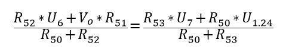
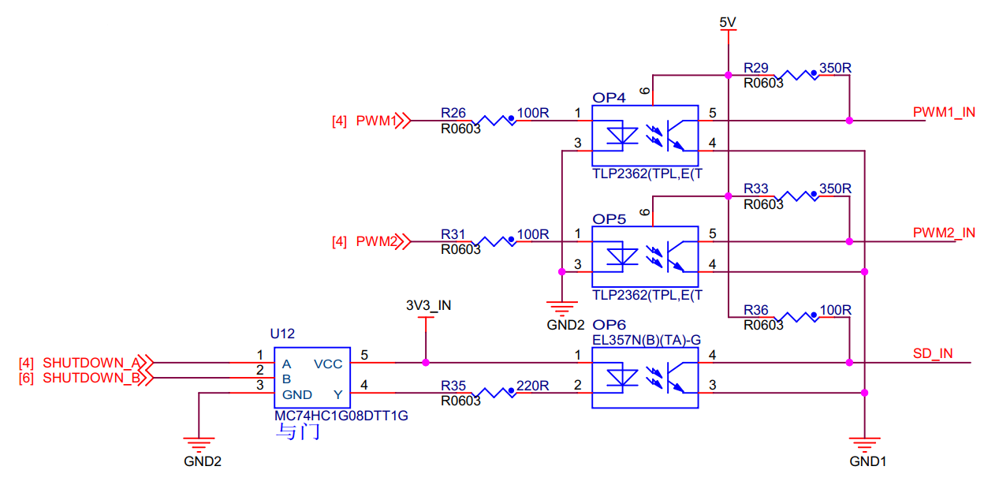

.. vim: syntax=rst

直流有刷驱动板电流电压采集
==========================================

野火使用MOS管搭建的直流有刷驱动板做到了信号完全隔离，其他驱动板基本都只是使用光耦隔离了控制信号，
并没有对ADC采样电路进行隔离，野火不仅使用光耦对控制信号进行了隔离，
还使用AMC1200SDUBR隔离运放对ADC采样电路进行了隔离。

电流采样电路
------------------------------------------

如下图所示是电流采样电路，在电机驱动电路中串入一个0.02Ω、2W的采样电阻，将电流信号转换成电压信号，
再经过隔离运放放大8倍后差分输出，使用普通运放将差分输出转换成单端输出给STM32的ADC采样通道。

.. image:: ../media/current_sampling_circuit.png
   :align: center
   :alt: 电流采样电路
   :name: 电流采样电路

从上图中我们可以知道是一个负反馈电路，那么根据虚短和虚断可以知道U\ :sub:`p`\=U\ :sub:`n`\，
p点和n点没有电流到运放的5脚和6脚，可以得：

.. image:: ../media/有刷电机驱动运放公式1和2.png
   :align: center
   :alt: 差分转单端输出

R61与后面的电容组成RC滤波电路，R61上流过的电流很小，压降也小，可以忽略不计，Vo等于V\ :sub:`current_adc`\。

将（1）式和（2）式整理可得：

.. image:: ../media/有刷电机驱动运放公式3和4.png
   :align: center
   :alt: 差分转单端输出整理

因为U\ :sub:`p`\=U\ :sub:`n`\，所以有：

其中R\ :sub:`52`\=R\ :sub:`51`\=R\ :sub:`53`\=R\ :sub:`50`\=10KΩ，
将R\ :sub:`52`\、R\ :sub:`51`\、R\ :sub:`53`\和R\ :sub:`50`\阻值带入上式化简可得：

.. image:: ../media/有刷电机驱动运放公式化简.png
   :align: center
   :alt: 差分转单端输出化简

因为隔离运放将V\ :sub:`i`\放大8倍后输出，所以有U\ :sub:`7`\-U\ :sub:`6`\=8*V\ :sub:`i`\，
带入上式可得：

.. image:: ../media/有刷电机驱动运放公式结果.png
   :align: center
   :alt: 差分转单端输出结果
   :name: 差分转单端输出结果

在下图中使用电压比较器LMV331SE实现10A过流保护电路，电流采样电路中V\ :sub:`i`\经过隔离运放和普通运放后变成V\ :sub:`current_adc`\输入到下图比较器的IN-，
当IN-的电压超过IN+时比较器的OUT将输出低电平到锁存器中,锁存器对输入信号进行锁存并输出到与门。

.. image:: ../media/voltage_comparator.png
   :align: center
   :alt: 电压比较器

光耦隔离部分电路图如下图所示。

与门输入输出与MOS管状态真值表如下表所示。

.. list-table:: 与门输入输出与MOS管状态真值表
    :widths: 15 15 15 60
    :header-rows: 1

    * - A
      - B
      - Y
      - MOS
    * - H
      - H
      - H
      - 可导通
    * - H
      - L
      - L
      - 关断（过流保护）
    * - L
      - H
      - L
      - 关断（单片机控制关断）
    * - L
      - L
      - L
      - 关断（单片机控制关断，过流保护）

电压采样电路
------------------------------------------

如下图所示是电源电压采样电路，在电源电压上并联R18和R19的串联电阻，R19两端的电压作为隔离运放的输入，
再经过隔离运放放大8倍后差分输出，使用普通运放将差分输出转换成单端输出，连接到STM32的ADC采样通道。
隔离运放的输入电压为Vi，则有:Vi/R19=POWER/(R18+R59+R19)，带入电阻值可得：Vi=POWER/37，
通过上一节中电流采样电流的计算方法可以计算得到POWER_ADC=POWER/37+1.24，不同的是，电压检测部分的隔离运放是没有放大的。

.. image:: ../media/有刷电源电压采集.png
   :align: center
   :alt: 有刷电源电压采集电路图

硬件连接
--------------

本章实验需要连接开发板和驱动板，这里给出接线表。

MOS管搭建驱动板
^^^^^^^^^^^^^^^^^^^^^^^^^^^^^^^^^

电机与MOS管搭建驱动板连接见下表所示。

.. list-table:: 电机与MOS管搭建驱动板连接
    :widths: 20 20
    :header-rows: 1

    * - 电机
      - MOS管搭建驱动板
    * - M+
      - M+
    * - 5V
      - 编码器电源：+
    * - GND
      - 编码器电源：-
    * - A
      - A
    * - B
      - B
    * - M-
      - M-

MOS管搭建驱动板与主控板连接见下表所示。

.. list-table:: MOS管搭建驱动板与主控板连接
    :widths: 20 20
    :header-rows: 1

    * - MOS管搭建驱动板
      - 主控板
    * - PWM1
      - PA9
    * - PWM2
      - PA8
    * - SD
      - PG12
    * - A
      - PC6
    * - B
      - PC7
    * - 电源输入：5V
      - 5V
    * - 电源输入：GND
      - GND

推荐使用配套的牛角排线直接连接驱动板和主控板，如使用牛角排线，注意缺口方向。连接开发板的那端，请连接在“无刷电机驱动接口1”上。

在STM32中实现电流电压采集
------------------------------------------

从第一节电流采样电路中，我们可以知道，想要对电流进行采集，需要将电流信号转换为电压信号。我们通过硬件部分完成了对该信号转换、放大处理，这样一来就可以很方便的在STM32使用ADC外设对该信号进行采集。在STM32中采集到了数据，最终再通过的一些数据的处理，我们就可以得到所需的电流值。当然同理可得，我对电压信号的采集也是类似地，下面我们看代码如何进行这部分的处理。

软件设计
^^^^^^^^^^^^^^^^^^^^^
配套代码在下面目录中可以找到:

.. code-block::
   :caption: 代码目录
   :linenos:

   basis_part\F407\直流有刷减速电机-电流电压读取-MOS管搭建板

编程要点
"""""""""""""""""

(1) 初始化ADC并使用DMA进行数据的获取
(2) 编写函数对采集得到的数据进行处理
(3) 编写获取最终电流值的函数
(4) 测试代码

软件分析
^^^^^^^^^^^^^^^^^^^^^

时钟等其他相关的初始化与前面工程相同，这里不过多赘述，我们直接看ADC初始化的代码，看ADC初始化结构体各个参数的配置，如果对ADC配置有疑问，请看《野火STM32库开发实战指南》，有针对ADC外设的细致讲解。

ADC初始化
"""""""""""""""""""""""""""

ADC_Init()函数
*****************

.. code-block:: c
   :name: ADC_Init(void)
   :caption: ADC_Init()函数
   :linenos:

   /**
   * @brief  电流采集初始化
   * @param  无
   * @retval 无
   */
   void ADC_Init(void)
   {
      ADC_GPIO_Config();
      adc_dma_init();
      ADC_Mode_Config();
   }

在ADC_Init()函数中，我们对ADC采集涉及到的相关GPIO进行了初始化，对DMA获取数据进行了配置，也配置了ADC采集的模式，再具体看每一个函数的实现。

ADC_GPIO_Config()函数
**********************************

.. code-block:: c
   :name: ADC_GPIO_Config(void)
   :caption: ADC_GPIO_Config()函数
   :linenos:

   /**
   * @brief  ADC 通道引脚初始化
   * @param  无
   * @retval 无
   */
   static void ADC_GPIO_Config(void)
   {
      GPIO_InitTypeDef GPIO_InitStructure;
      // 使能 GPIO 时钟
      CURR_ADC_GPIO_CLK_ENABLE();
      VBUS_GPIO_CLK_ENABLE();
      // 配置 IO
      GPIO_InitStructure.Pin = CURR_ADC_GPIO_PIN;
      GPIO_InitStructure.Mode = GPIO_MODE_ANALOG;	    
      GPIO_InitStructure.Pull = GPIO_NOPULL ; //不上拉不下拉
      HAL_GPIO_Init(CURR_ADC_GPIO_PORT, &GPIO_InitStructure);	

      GPIO_InitStructure.Pin = VBUS_GPIO_PIN;
      HAL_GPIO_Init(VBUS_GPIO_PORT, &GPIO_InitStructure);	
   }

ADC_GPIO_Config()中的部分配置使用了宏定义，具体定义内容到工程中查看。

adc_dma_init()函数
**********************************

.. code-block:: c
   :name: adc_dma_init(void)
   :caption: adc_dma_init()函数
   :linenos:

   void adc_dma_init(void)
   {
      // ------------------DMA Init 结构体参数 初始化--------------------------
      // ADC1使用DMA2，数据流0，通道0，这个是手册固定死的
      // 开启DMA时钟
      CURR_ADC_DMA_CLK_ENABLE();
      // 数据传输通道
      DMA_Init_Handle.Instance = CURR_ADC_DMA_STREAM;
      // 数据传输方向为外设到存储器	
      DMA_Init_Handle.Init.Direction = DMA_PERIPH_TO_MEMORY;
      // 外设寄存器只有一个，地址不用递增
      DMA_Init_Handle.Init.PeriphInc = DMA_PINC_DISABLE;
      // 存储器地址固定
      DMA_Init_Handle.Init.MemInc = DMA_MINC_ENABLE;
      // 外设数据大小为半字，即两个字节
      DMA_Init_Handle.Init.PeriphDataAlignment = DMA_PDATAALIGN_HALFWORD;
      //	存储器数据大小也为半字，跟外设数据大小相同
      DMA_Init_Handle.Init.MemDataAlignment = DMA_MDATAALIGN_HALFWORD;	
      // 循环传输模式
      DMA_Init_Handle.Init.Mode = DMA_CIRCULAR;
      // DMA 传输通道优先级为高，当使用一个DMA通道时，优先级设置不影响
      DMA_Init_Handle.Init.Priority = DMA_PRIORITY_HIGH;
      // 禁止DMA FIFO	，使用直连模式
      DMA_Init_Handle.Init.FIFOMode = DMA_FIFOMODE_DISABLE;  
      // FIFO 大小，FIFO模式禁止时，这个不用配置
      DMA_Init_Handle.Init.FIFOThreshold = DMA_FIFO_THRESHOLD_HALFFULL;
      DMA_Init_Handle.Init.MemBurst = DMA_MBURST_SINGLE;
      DMA_Init_Handle.Init.PeriphBurst = DMA_PBURST_SINGLE;  
      // 选择 DMA 通道，通道存在于流中
      DMA_Init_Handle.Init.Channel = CURR_ADC_DMA_CHANNEL; 
      //初始化DMA流，流相当于一个大的管道，管道里面有很多通道
      HAL_DMA_Init(&DMA_Init_Handle); 

      __HAL_LINKDMA(&ADC_Handle,DMA_Handle,DMA_Init_Handle);
   }

adc_dma_init()配置为半字传输，方向配置为从ADC外设搬运数据到内存中，最后初始化DMA。

ADC_Mode_Config()函数
**********************************

.. code-block:: c
   :name: ADC_Mode_Config(void)
   :caption: ADC_Mode_Config()函数
   :linenos:

   /**
   * @brief  ADC 和 DMA 初始化
   * @param  无
   * @retval 无
   */
   static void ADC_Mode_Config(void)
   {
      // 开启ADC时钟
      CURR_ADC_CLK_ENABLE();
      // -------------------ADC Init 结构体 参数 初始化------------------------
      // ADC1
      ADC_Handle.Instance = CURR_ADC;
      // 时钟为fpclk 4分频	
      ADC_Handle.Init.ClockPrescaler = ADC_CLOCKPRESCALER_PCLK_DIV4;
      // ADC 分辨率
      ADC_Handle.Init.Resolution = ADC_RESOLUTION_12B;
      // 禁止扫描模式，多通道采集才需要	
      ADC_Handle.Init.ScanConvMode = ENABLE; 
      // 连续转换	
      ADC_Handle.Init.ContinuousConvMode = ENABLE;
      // 非连续转换	
      ADC_Handle.Init.DiscontinuousConvMode = DISABLE;
      // 非连续转换个数
      ADC_Handle.Init.NbrOfDiscConversion   = 0;
      //禁止外部边沿触发    
      ADC_Handle.Init.ExternalTrigConvEdge = ADC_EXTERNALTRIGCONVEDGE_NONE;
      //使用软件触发
      ADC_Handle.Init.ExternalTrigConv = ADC_SOFTWARE_START;
      //数据左对齐
      ADC_Handle.Init.DataAlign = ADC_DATAALIGN_LEFT;
      //转换通道 2个
      ADC_Handle.Init.NbrOfConversion = 2;
      //使能连续转换请求
      ADC_Handle.Init.DMAContinuousRequests = ENABLE;
      //转换完成标志
      ADC_Handle.Init.EOCSelection          = ADC_EOC_SINGLE_CONV;    
      // 初始化ADC	                          
      HAL_ADC_Init(&ADC_Handle);
      
      //---------------------------------------------------------------------------
      ADC_ChannelConfTypeDef ADC_Config;
      
      ADC_Config.Channel      = CURR_ADC_CHANNEL;
      ADC_Config.Rank         = 1;
      // 采样时间间隔	
      ADC_Config.SamplingTime = ADC_SAMPLETIME_3CYCLES;
      ADC_Config.Offset       = 0;
      // 配置 ADC 通道转换顺序为1，第一个转换，采样时间为3个时钟周期
      HAL_ADC_ConfigChannel(&ADC_Handle, &ADC_Config);
      
      /** Configure for the selected ADC regular channel its corresponding rank in the sequencer and its sample time. 
      */
      ADC_Config.Channel = VBUS_ADC_CHANNEL;
      ADC_Config.Rank = 2;
      // 采样时间间隔	
      ADC_Config.SamplingTime = ADC_SAMPLETIME_3CYCLES;
      ADC_Config.Offset       = 0;
      if (HAL_ADC_ConfigChannel(&ADC_Handle, &ADC_Config) != HAL_OK)
      {
         while(1);
      }
      
      // 外设中断优先级配置和使能中断配置
      HAL_NVIC_SetPriority(ADC_DMA_IRQ, 1, 1);
      HAL_NVIC_EnableIRQ(ADC_DMA_IRQ);

      HAL_ADC_Start_DMA(&ADC_Handle, (uint32_t*)&adc_buff, ADC_NUM_MAX);
   }

ADC_Mode_Config()函数对ADC进行了配置，具体看代码中各个参数的注释。将ADC配置为循环采集，因实际工程中也进行了电压采集，所以配置了两个转换通道，最后分别配置两个通道参数，就完成了ADC的配置。再配置的最后，使用HAL_ADC_Start_DMA使能DMA传输，就可以开始采集数据了，但是我们还需要对数据进行更多的处理，才能使数据稳定可靠。

数据处理部分
"""""""""""""""""

HAL_ADC_ConvCpltCallback()函数
********************************

.. code-block:: c
   :name: HAL_ADC_ConvCpltCallback
   :caption: HAL_ADC_ConvCpltCallback()函数
   :linenos:

   /**
   * @brief  常规转换在非阻塞模式下完成回调
   * @param  hadc: ADC  句柄.
   * @retval 无
   */
   void HAL_ADC_ConvCpltCallback(ADC_HandleTypeDef* hadc)
   {
   int32_t adc_mean = 0;

   HAL_ADC_Stop_DMA(hadc);       // 停止 ADC 采样，处理完一次数据在继续采样
   
   /* 计算电流通道采样的平均值 */
   for(uint32_t count = 0; count < ADC_NUM_MAX; count+=2)
   {
      adc_mean += (int32_t)adc_buff[count];
   }
   
   adc_mean_sum += adc_mean / (ADC_NUM_MAX / 2);    // 累加电压
   adc_mean_count++;
   
   #if 1
   
   adc_mean = 0;
   
   /* 计算电压通道采样的平均值 */
   for(uint32_t count = 1; count < ADC_NUM_MAX; count+=2)
   {
      adc_mean += (int32_t)adc_buff[count];
   }
   
   vbus_adc_mean = adc_mean / (ADC_NUM_MAX / 2);    // 保存平均值
   
   #else
   vbus_adc_mean = adc_buff[1];
   #endif
   
   HAL_ADC_Start_DMA(&ADC_Handle, (uint32_t*)&adc_buff, ADC_NUM_MAX);    // 开始 ADC 采样
   }

当DMA搬运ADC_NUM_MAX个数据后，我们预设的BUF已经被填满了ADC采集得到的数据，这时DMA会产生一个中断，最终回调HAL_ADC_ConvCpltCallback通知用户，一轮ADC的采集已经完成。这时我们就可以先使用HAL_ADC_Stop_DMA停止DMA和ADC的工作，进行对数据的处理，当数据处理完成，我们再开启ADC的采集。

在HAL_ADC_ConvCpltCallback()回调函数中，我们对电流采集的原始数据进行 **累加** 给赋值adc_mean，再将adc_mean除以采集数据的个数(ADC_NUM_MAX/2)，以获得采集数据的原始数据平均值。将其 **累加** 赋值给adc_mean_sum，并对adc_mean_count+1，记录采集次数。完成这些操作后，再重新调用HAL_ADC_Start_DMA以开启新一轮的采集。

在电流数据处理下面，我们可以看到对电压也进行了同样的采集操作，并且添加了宏定义#if，因为同时采集电流电压较为耗时。我们实验时可以将#if置为0，方便我们观察实验现象。

get_curr_val()函数
********************************

前面我们通过回调函数获得了采集的原始数据，现在我们对采集得到的原始数据进行处理，以得到真实的电流值。

.. code-block:: c
   :name: get_curr_val
   :caption: get_curr_val()函数
   :linenos:

   /**
   * @brief  获取电流值
   * @param  无
   * @retval 转换得到的电流值
   */
   int32_t get_curr_val(void)
   {
   static uint8_t flag = 0;
   static uint32_t adc_offset = 0;    // 偏置电压
   int16_t curr_adc_mean = 0;         // 电流 ACD 采样结果平均值
   
   curr_adc_mean = adc_mean_sum / adc_mean_count;    // 保存平均值
   

      adc_mean_count = 0;
      adc_mean_sum = 0;
      
      if (flag < 17)
      {
         adc_offset = curr_adc_mean;    // 多次记录偏置电压，待系统稳定偏置电压才为有效值
         flag += 1;
      }
      if(curr_adc_mean>=adc_offset)
      {
         curr_adc_mean -= adc_offset;                     // 减去偏置电压
      }else
      {
         curr_adc_mean=0;
      }

      float vdc = GET_ADC_VDC_VAL(curr_adc_mean);      // 获取电压值
      
      return GET_ADC_CURR_VAL(vdc);
      }

在get_curr_val()中，我们对采集得到的原始数据累加的和(adc_mean_sum)除以累加次数(adc_mean_count)来求平均值，进行滤波操作，保证数据的稳定性。然后我们将以前的累加次数清零，为后面采集的数据做重新开始累加、滤波的准备。在实际情况中，每采集10次数据做一次滤波，得到的电流数据比较稳定，但是在程序设定时间内可能无法达到每采集10次做一次滤波操作，所以用户可以根据实际的实际需求来设定采集次数，采集间隔等。

必须注意的是，在硬件设计中，并不是以0v为起始电压而是加了1.24v的偏置，具体看图 差分转单端输出结果_ 中的V\ :sub:`1.24`\。所以我们程序中，使用flag，在开发板上电后电机没有启动时，就先采集17次偏置电压数据(实测中采集17次后的偏执电压较为准确，这个次数和电路达到稳定状态的时间有关)，然后将偏置电压保存起来，这里使用static定义adc_offset。最后在每次获取电流值计算时，都会将偏置电压减去，保证数据是正确的。

在得到有效的电流转换电压的采集值后，我们对该电压值进行转换操作，将其转换回电流，调用GET_ADC_CURR_VAL。

.. code-block:: c
   :name: GET_ADC_VDC_VAL
   :caption: GET_ADC_VDC_VAL()函数
   :linenos:

   #define VREF                            3.3f     // 参考电压，理论上是3.3，可通过实际测量得3.258
   #define GET_ADC_VDC_VAL(val)            ((float)val/(float)65536.0*VREF)          // 得到电压值
   #define GET_ADC_CURR_VAL(val)           (((float)val)/(float)8.0/(float)0.02*(float)1000.0)          // 得到电流值，电压放大8倍，0.02是采样电阻，单位mA。

只是简单宏定义即可实现。

主函数
"""""""""""""""""

.. code-block:: c
   :name: main
   :caption: main()函数
   :linenos:

   /**
   * @brief  主函数
   * @param  无
   * @retval 无
   */
   int main(void) 
   {
   __IO uint16_t ChannelPulse = PWM_MAX_PERIOD_COUNT*0.5;
   uint8_t i = 0;
   uint8_t flag = 0;

   HAL_Init();
   
      /* 初始化系统时钟为168MHz */
      SystemClock_Config();
   
      /* 初始化按键GPIO */
      Key_GPIO_Config();
   
   /* 初始化 LED */
   LED_GPIO_Config();

   /* 电机初始化 */
   motor_init();
   
   /* 串口初始化 */
   DEBUG_USART_Config();
   
   /* ADC 始化 */
   ADC_Init();
   
   set_motor_speed(ChannelPulse);
   set_motor_disable();    // 禁用电机
   
   printf("野火直流有刷电机电流读取实验\r\n");
      
      while(1)
      {
      /* 扫描KEY1 */
      if( Key_Scan(KEY1_GPIO_PORT, KEY1_PIN) == KEY_ON)
      {
         /* 使能电机 */
         set_motor_enable(); 
      }
      
      /* 扫描KEY2 */
      if( Key_Scan(KEY2_GPIO_PORT, KEY2_PIN) == KEY_ON)
      {
         /* 禁用电机 */
         set_motor_disable();
      }
      
      /* 扫描KEY3 */
      if( Key_Scan(KEY3_GPIO_PORT, KEY3_PIN) == KEY_ON)
      {
         /* 增大占空比 */
         ChannelPulse += PWM_MAX_PERIOD_COUNT/10;
         
         if(ChannelPulse > PWM_MAX_PERIOD_COUNT)
         ChannelPulse = PWM_MAX_PERIOD_COUNT;
         
         set_motor_speed(ChannelPulse);
      }
      
      /* 扫描KEY4 */
      if( Key_Scan(KEY4_GPIO_PORT, KEY4_PIN) == KEY_ON)
      {
         if(ChannelPulse < PWM_MAX_PERIOD_COUNT/10)
         ChannelPulse = 0;
         else
         ChannelPulse -= PWM_MAX_PERIOD_COUNT/10;
         
         set_motor_speed(ChannelPulse);
      }
      
      /* 扫描KEY5 */
      if( Key_Scan(KEY5_GPIO_PORT, KEY5_PIN) == KEY_ON)
      {
         /* 转换方向 */
         set_motor_direction( (++i % 2) ? MOTOR_FWD : MOTOR_REV);
      }
      
      if (HAL_GetTick()%50 == 0 && flag == 0)    // 每50毫秒读取一次电流、电压
      {
         flag = 1;
         int32_t current = get_curr_val();
         
      #if 0//defined(PID_ASSISTANT_EN)
         set_computer_value(SEED_FACT_CMD, CURVES_CH1, &current, 1);
      #else
         printf("电源电压：%.2fV，电流：%dmA\r\n", get_vbus_val(), current); 
      #endif
         
      }
      else if (HAL_GetTick()%50 != 0 && flag == 1)
      {
         flag = 0;
      }
      }
   }

我们通过主函数打印，就可以检测电压电流获取的情况如何了。

下载验证
^^^^^^^^^^^^^^^^^^^^^

在STM32中实现限电流-过压-欠压保护
------------------------------------------

在前面我们通过软件获取了电路的工作状态，现在我们就可以通过获取到的工作状态来设计一些应用，例如在实际的使用场景里，我们常常需要关注电路工作时的状态是否正常，如果发生故障，应当即可进行处理，否则很容以损坏设备，下面我们通过编写软件来实现电路的一些保护功能。

软件设计
^^^^^^^^^^^^^^^^^^^^^

配套代码在下面目录中可以找到:

.. code-block::
   :caption: 代码目录
   :linenos:

   basis_part\F407\直流有刷减速电机-限电流-过压-欠压保护-MOS管搭建板

编程要点
"""""""""""""""""

(1) 实现ADC看门狗，设定过压欠压保护，异常时处理。
(2) 监控电流状态，异常时停机
(3) 测试代码

软件分析
^^^^^^^^^^^^^^^^^^^^^

ADC_Init函数
"""""""""""""""""

与前面电流采集的ADC_Init()函数除了ADC模式配置有区别外，其他初始化部分相同，下面我们来看不同的部分:

.. code-block:: c
   :name: 欠压ADC_Mode_Config
   :caption: 欠压ADC_Mode_Config
   :linenos:

   /**
   * @brief  ADC 和 DMA 初始化
   * @param  无
   * @retval 无
   */
   static void ADC_Mode_Config(void)
   {
      /*************************************************************************/
      /********************************前面代码部分相同,省略********************************/
      /*************************************************************************/
      /** Configure the analog watchdog 
      */
      ADC_AnalogWDGConfTypeDef AnalogWDGConfig = {0};
      
      AnalogWDGConfig.WatchdogMode = ADC_ANALOGWATCHDOG_SINGLE_REG;
      AnalogWDGConfig.HighThreshold = VBUS_HEX_MAX;
      AnalogWDGConfig.LowThreshold = VBUS_HEX_MIN;
      AnalogWDGConfig.Channel = VBUS_ADC_CHANNEL;
      AnalogWDGConfig.ITMode = ENABLE;
      if (HAL_ADC_AnalogWDGConfig(&ADC_Handle, &AnalogWDGConfig) != HAL_OK)
      {
         while(1);
      }
      
      /** Configure for the selected ADC regular channel its corresponding rank in the sequencer and its sample time. 
      */
      ADC_Config.Channel = VBUS_ADC_CHANNEL;
      ADC_Config.Rank = 2;
      // 采样时间间隔	
      ADC_Config.SamplingTime = ADC_SAMPLETIME_3CYCLES;
      ADC_Config.Offset       = 0;
      if (HAL_ADC_ConfigChannel(&ADC_Handle, &ADC_Config) != HAL_OK)
      {
         while(1);
      }
      
      // 外设中断优先级配置和使能中断配置
      HAL_NVIC_SetPriority(ADC_DMA_IRQ, 1, 1);
      HAL_NVIC_EnableIRQ(ADC_DMA_IRQ);
      
      HAL_NVIC_SetPriority(ADC_VBUS_IRQ, 0, 1);
      HAL_NVIC_EnableIRQ(ADC_VBUS_IRQ);

      HAL_ADC_Start_DMA(&ADC_Handle, (uint32_t*)&adc_buff, ADC_NUM_MAX);
   }

在上图中，我们可以看到多了一个ADC_AnalogWDGConfTypeDef结构体的配置，这就时ADC模拟看门狗。ADC模拟看门狗的功能与STM32的看门狗外设功能大致相同，如果对看门狗不了解，请看《野火STM32库开发实战指南》看门狗章节。配置好了ADC模拟看门狗的溢出上下限，使能中断，我们就可以使用ADC模拟看门狗外设对电路电压进行异常检测了。当电路异常时，看门狗会触发中断回调，我们通过编写中断回调函数就可以对异常进行一定处理。

ADC模拟看门狗溢出回调函数
""""""""""""""""""""""""""""""""""

.. code-block:: c
   :name: HAL_ADC_LevelOutOfWindowCallback
   :caption: HAL_ADC_LevelOutOfWindowCallback
   :linenos:

   /**
   * @brief  在非阻塞模式模拟看门狗回调
   * @param  hadc: ADC  句柄.
   * @retval 无
   */
   void HAL_ADC_LevelOutOfWindowCallback(ADC_HandleTypeDef* hadc)
   {
      flag_num++;     // 电源电压超过阈值电压
      
      if (vbus_adc_mean > VBUS_HEX_MIN && vbus_adc_mean < VBUS_HEX_MAX)
         flag_num = 0;
      
      if (flag_num > ADC_NUM_MAX)      // 电源电压超过阈值电压10次
      {
         set_motor_disable();
         flag_num = 0;
         LED1_ON;
         printf("电源电压超过限制！请检查原因，复位开发板在试！\r\n");
         while(1);
      }
   }

当看门狗检测到溢出时，会触发此中断回调函数。在函数中，我们使用了flag_num来记录触发异常的次数，如果flag_num超过阈值，我们则认为电路异常了，这时采取电机停机、LED灯显示提示、串口打印等来提示用户电路异常的情况，在实际应用中，我们则根据实际需要来调整这部分代码。

主函数
""""""""""""""""""""""""""""""""""

在上面我们配置了ADC模拟看门狗来做电压保护，我们现在用另一种方式，来处理限制电流的情况，就是在主函数中轮询。

.. code-block:: c
   :name: 限电流main函数
   :caption: 限电流main函数
   :linenos:

   /**
   * @brief  主函数
   * @param  无
   * @retval 无
   */
   int main(void) 
   {
   __IO uint16_t ChannelPulse = PWM_MAX_PERIOD_COUNT*0.5;
   uint8_t curr_max_count = 0;
   uint8_t flag = 0;
   uint8_t dir = 0;

   HAL_Init();

   /* 初始化系统时钟为168MHz */
   SystemClock_Config();

   /* 初始化按键GPIO */
   Key_GPIO_Config();

   /* 初始化 LED */
   LED_GPIO_Config();

   /* 电机初始化 */
   motor_init();
   
   /* 串口初始化 */
   DEBUG_USART_Config();
   
   /* ADC 始化 */
   ADC_Init();
   
   set_motor_speed(ChannelPulse);
   set_motor_disable();    // 禁用电机
   
   printf("野火直流有刷电机-限流-过压-欠压保护实验\r\n");
      
      while(1)
      {
      /* 扫描KEY1 */
      if( Key_Scan(KEY1_GPIO_PORT, KEY1_PIN) == KEY_ON)
      {
         /* 使能电机 */
         set_motor_enable(); 
      }
      
      /* 扫描KEY2 */
      if( Key_Scan(KEY2_GPIO_PORT, KEY2_PIN) == KEY_ON)
      {
         /* 禁用电机 */
         set_motor_disable();
      }
      
      /* 扫描KEY3 */
      if( Key_Scan(KEY3_GPIO_PORT, KEY3_PIN) == KEY_ON)
      {
         /* 增大占空比 */
         ChannelPulse += PWM_MAX_PERIOD_COUNT/10;
         
         if(ChannelPulse > PWM_MAX_PERIOD_COUNT)
         ChannelPulse = PWM_MAX_PERIOD_COUNT;
         
         set_motor_speed(ChannelPulse);
      }
      
      /* 扫描KEY4 */
      if( Key_Scan(KEY4_GPIO_PORT, KEY4_PIN) == KEY_ON)
      {
         if(ChannelPulse < PWM_MAX_PERIOD_COUNT/10)
         ChannelPulse = 0;
         else
         ChannelPulse -= PWM_MAX_PERIOD_COUNT/10;
         
         set_motor_speed(ChannelPulse);
      }
      
      /* 扫描KEY5 */
      if( Key_Scan(KEY5_GPIO_PORT, KEY5_PIN) == KEY_ON)
      {
         /* 转换方向 */
         set_motor_direction( (++dir % 2) ? MOTOR_FWD : MOTOR_REV);
      }
      
      if (HAL_GetTick()%50 == 0 && flag == 0)    // 每50毫秒读取一次电流、电压
      {
         flag = 1;
         int32_t current = get_curr_val();

      #if 0//defined(PID_ASSISTANT_EN)
         set_computer_value(SEED_FACT_CMD, CURVES_CH1, &current, 1);
      #else
         printf("电源电压：%.2fV，电流：%dmA\r\n", get_vbus_val(), current); 
      #endif
         
         if (current > CURR_MAX)    // 判断是不是超过限定的值
         {
         if (curr_max_count++ > 5)    // 连续5次超过
         {
            LED2_ON;
            set_motor_disable();
            curr_max_count = 0;
            printf("电流超过限制！请检查原因，复位开发板在试！\r\n");
            while(1);
         }
         }
         
      }
      else if (HAL_GetTick()%50 != 0 && flag == 1)
      {
         flag = 0;
      }
      }
   }

同样地，我们在主函数中通过不断轮询电压值是否超过预设值，来记录超限的次数，如果电流超过限制次数到达预设数，则认为电路可能发生故障，提示用户处理。

下载验证
^^^^^^^^^^^^^^^^^^^^^

将对应程序下载到开发板上运行，启动电机后，串口正常打印电压电流信息，当用手捏电机时，电机电流增大，超过预设值，发生报警并停机如下图所示。

