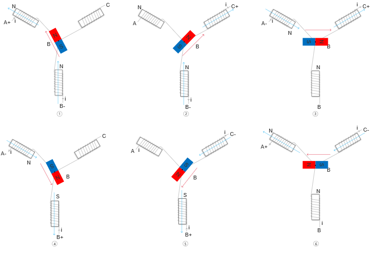
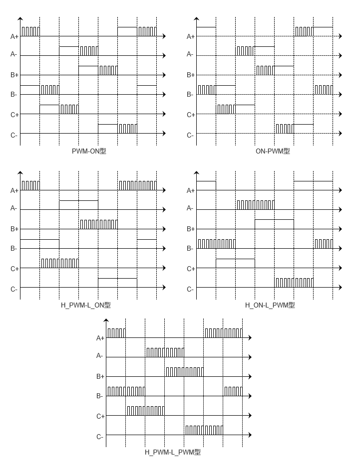

.. vim: syntax=rst

直流无刷电机
==========================================

无刷直流电机（Brushless Direct Current Motor，简称BLDCM）由电动机主体和驱动器组成，
是一种典型的机电一体化产品。 无刷电机是指无电刷和换向器
（或集电环）的电机，又称无换向器电机。这是模界中除了有刷电机以外用的最多的一种电机，
无刷直流电机不使用机械的电刷装置，采用方波自控式永磁同步电机，与有刷相比将转子和定子交换，
即无刷中使用电枢绕组作为定子，使用钕铁硼的永磁材料作为转子，以霍尔传感器取代碳刷换向器，
性能上相较一般的传统直流电机有很大优势。具有高效率、低能耗、低噪音、超长寿命、高可靠性、
可伺服控制、无级变频调速等优点，至于缺点是比有刷的贵、不好维护，广泛应用于航模、高速车模和船模。

不过，单个的无刷电机不是一套完整的动力系统，无刷基本必须通过无刷控制器才能实现连续不断的运转。
普通的碳刷电机旋转的是绕组，而无刷电机不论是外转子结构还是内转子结构旋转的都是磁铁。
所以任何一个电机都是由定子和转子共同构成的。

无刷电机的定子是产生旋转磁场的部分，能够支撑转子进行旋转，主要由硅钢片、漆包线、轴承、
支撑件构成；而转子则是黏贴钕铁硼磁铁，在定子旋转磁场的作用进行旋转的部件，主要由转轴、
磁铁、支持件构成。除此之外，定子与转子组成的磁极对数还影响着电机的转速与扭力。

直流无刷减速电机几个重要参数
------------------------------------------

直流无刷电机工作原理
------------------------------------------

在学习工作原理前我们先来学习一下安培定则，安培定则，也叫右手螺旋定则，是表示电流和电流激发
磁场的磁感线方向间关系的定则。通电直导线中的安培定则（安培定则一）：用右手握住通电直导线，
让大拇指指向电流的方向，那么四指指向就是磁感线的环绕方向；通电螺线管中的安培定则（安培定则二）：
用右手握住通电螺线管，让四指指向电流的方向，那么大拇指所指的那一端是通电螺线管的N极，如下图所示。

我们知道在磁极中同名相吸，异名相斥，及N极与S极相互吸引，N极与N极和S极与S极相互排斥，
下面我们来看看一个直流模型，如下图所示。

.. image:: ../media/dc_magnet_rotation_model.png
   :align: center
   :alt: 直流旋转模型

当两边的线圈通上电后，由右手螺旋定则可知两个线圈中将会产生方向向右的磁场，而中间的转子会尽量使
自己内部的磁感线方向与外磁感线方向保持一致，以形成一个最短闭合磁力线回路，N极与S极相互吸引，
这样内转子就会按顺时针方向旋转了。当转子旋转到如图所示的水平位置时转子将不会受到作用力。

.. image:: ../media/dc_magnet_rotation_model_2.png
   :align: center
   :alt: 直流旋转模型2

但是由于惯性的作用转子将会继续旋转，当转子旋转至水平位置时，交换两个线圈中的电流方向，
这时转子就会继续向顺时针方向转动了。当转子再次旋转至水平位置时，再次交换两个线圈中的电流方向，
这样转子就可以一直旋转了。

有了上面的基础，我们再来看下面的“三相星形联结的二二导通方式”。 

在A端上电源正极，在B端接电源负极，那么可以在线圈A和B中可以产生如图所示的磁场，因为磁场强度是矢量，
所以由磁场B\ :sub:`B`\和B\ :sub:`A`\可以得到合成磁场B。此时转子就会保持在图中方向。

想要转子转动就需要接入不同的电压，我们来分析一下图中的6个过程。

1. 在A端接入正电压，B端接入负电压，C端悬空，转子将会旋转至图中1的位置。
2. 在1的基础上，C端接入正电压，B端接入负电压，A端悬空，转子将会从1的位置旋转至图中2的位置。
3. 在2的基础上，C端接入正电压，A端接入负电压，B端悬空，转子将会从2的位置旋转至图中3的位置。
4. 在3的基础上，B端接入正电压，A端接入负电压，C端悬空，转子将会从3的位置旋转至图中4的位置。
5. 在4的基础上，B端接入正电压，C端接入负电压，A端悬空，转子将会从4的位置旋转至图中5的位置。
6. 在5的基础上，A端接入正电压，C端接入负电压，B端悬空，转子将会从5的位置旋转至图中6的位置。

当转子旋转到位置6时，在重复1的供电状态，转子将会从6的位置旋转到1的位置。
在经过上面的6个过程后转子正好转了一圈，我们将这种驱动方法称为6拍工作方式，
每次电压的变化称为换相。想要电机持续的旋转我们只要按上面转子相应的位置接入相应的电压即可。

直流无刷电机驱动设计与分析
------------------------------------------

控制电路原理设计与分析
^^^^^^^^^^^^^^^^^^^^^^^^^^^^^^^^^

有了上面的原理分析，我们知道了怎么导通就可以让无刷电机转起来，因为单片机的引脚驱动能力有限，
所以在这里我们使用一个叫做三相六臂全桥驱动电路来驱动无刷电机，原理图如下图所示。

在上图中导通Q\ :sub:`1`\和Q\ :sub:`4`\，其他都不导通，那么电流将从Q\ :sub:`1`\流经U相绕组，
再从V相绕组流到Q\ :sub:`4`\。这样也就完成了上一节中的第一步，同理，依次导通Q\ :sub:`5`\Q\ :sub:`4`\、
Q\ :sub:`5`\Q\ :sub:`2`\、Q\ :sub:`3`\Q\ :sub:`2`\、Q\ :sub:`3`\Q\ :sub:`6`\和Q\ :sub:`1`\Q\ :sub:`6`\，
这也就完成了6拍工作方式。但是，单片机的引脚直接驱动MOS管还是不行的，所以这里需要使用专用的IC来驱动MOS管。

我们在来思考一个问题，在上面的MOS管导通时，是需要知道上一步导通的是那两个MOS管，
而且第一步中MOS管导通时转子的位置是我们自己规定，但是在实际使用中启动时转子的位置是未知的，
因此，我们并不知道第一步应该导通哪两个MOS管，所以这里我们需要知道转子的位置信息。
但并不需要连续的位置信息，值需要知道换相点的位置即可。
获取转子位置一般有两种方法，一种是使用霍尔传感器，一种是不使用传感器。

霍尔传感器模式
"""""""""""""""""

霍尔传感器是根据霍尔效应制作的一种磁场传感器。霍尔效应：当电流垂直于外磁场通过半导体时，
载流子发生偏转，垂直于电流和磁场的方向会产生一附加电场，从而在半导体的两端产生电势差，
这一现象就是霍尔效应，这个电势差也被称为霍尔电势差。

在BLDC中一般采用3个开关型霍尔传感器测量转子的位置，由其输出的3位二进制编码去控制三相六臂全桥中的6
个MOS管的导通实现换相。如果将一只霍尔传感器安装在靠近转子的位置，当N极逐渐靠近霍尔传感器即磁感器达到一定值时，
其输出是导通状态；当N极逐渐离开霍尔传感器、磁感应逐渐小时，其输出仍然保持导通状态；
只有磁场转变为S极便达到一定值时，其输出才翻转为截止状态。在S和N交替变化下传感器输出波形占高、
低电平各占50%。如果转子是一对极，则电机旋转一周霍尔传感器输出一个周期的电压波形，如果转子是两对极，
则输出两个周期的波形。

在直流无刷电机中一般把3个霍尔传感器按间隔120度或60度的圆周分布来安装，如果按间隔120度来安装，
则3个霍尔传感器输出波形相差120度电度角，输出信号中高、低电平各占180度电度角。
如果规定输出信号高电平用“1”表示，低电平用“0”表示，则输出的三个信号可以用三位二进制码表示，
如下图所示。

转子每旋转一周可以输出6个不同的信号，这样正好可以满足我们条件。只要我们根据霍尔传感器输出的值来导通MOS管即可。
通常厂家也会给出真值表。假设某厂家给出的真值表如下。

=====  =====  =====  ====  ====  ====  ====  ====  ====
霍尔a  霍尔b  霍尔c   A+    A-    B+    B-    C+    C-
=====  =====  =====  ====  ====  ====  ====  ====  ====
1      1      0      导通  ×     ×     导通  ×     ×
1      0      0      ×     ×     ×     导通  导通  ×
1      0      1      ×     导通  ×     ×     导通  ×
0      0      1      ×     导通  导通  ×     ×     ×
0      1      1      ×     ×     导通  ×     ×     导通
0      1      0      导通  ×     ×     ×     ×     导通
=====  =====  =====  ====  ====  ====  ====  ====  ====

上表的意思是：当检测到的3个霍尔传感器的值，则导通对应值的MOS管。例如，检测到霍尔a、
霍尔b和霍尔c分别为1、1和0，则导通A+和B-对应的MOS管，其他MOS管都要处于截止状态。
当导通对应的MOS管后电机就会旋转一个角度，旋转到下一个霍尔值改变为100，这时在关闭A+和B-，
导通C+和B-，这样电机有将会旋转一个角度直到下一个霍尔值改变，
只要我们按表中的霍尔值导通对应的MOS管电机就可按一定的方向旋转。电机的真值表一个般有两个，
一个是对应顺时针旋转，另一个对应的是逆时针旋转。

在对MOS管的控制有中两个特殊情况需要注意一下：

1. 当按真值表中对应霍尔值导通MOS管后，就保持导通状态不变时，此时电机就会旋转到对应位置保持不变，
   此时电路中的电能将只能转换为热能，不能转换为机械能，而我们的电机绕组时候的是漆包铜线，
   其内阻非常的小，电流就会非常的大，这将会产生大量的热而导致电源或者电机被烧毁。
2. 在上面的三相六臂全桥驱动电路原理图中如果同时导通Q\ :sub:`1`\和Q\ :sub:`2`\，或者导通
   Q\ :sub:`3`\和Q\ :sub:`4`\，或者导通Q\ :sub:`5`\和Q\ :sub:`6`\，只要导通以上对应的两个MOS管，
   都会导致电路中的电机不能正常工作，而MOS管直接将电源的正负极接通，这无疑将会烧毁电源。

以上两个情况是我们电路设计和编程控制需要特别注意的，必须要避免以上情况的发生。

驱动芯片与驱动电机设计与分析
^^^^^^^^^^^^^^^^^^^^^^^^^^^^^^^^^
**根据我们配套驱动器来讲解**

直流无刷减速电机控制实现
-----------------------------------

速度控制原理
^^^^^^^^^^^^^^^^^^^^^^^^^^^^^^^^^

通常我们使用电机不仅仅只是让电机旋转这么简单，更多的时候需要对速度进行控制，
按照以下无刷直流电机转速计算公式可知，影响电机转速的三个参量分别是电枢回路的总电阻Ra,
调整电枢绕组的供电电压Ua或者调整励磁磁通φ。也就是说，想要改变电机的转速，
必须对以上三个参量进行调整。

V=(Ua-IaRa)/CEφ

- Ua——电机定子绕组的实际电压大小
- Ia——电机绕组内通过的实际电流大小
- Ra——电路系统中包含电机的回路电阻大小
- CE——电势系数
- φ——励磁磁通

在现实情况下，在已确定无刷直流电机选型及电机参数的情况下，改变系统总的电阻值Ra和电机的励磁磁通值
难度是比较大的，因此，在一般情况下，我们可以对无刷直流电机的供电电压所处适当调整，
从而降低线圈绕组通过电流大小，以期达到控制电机转速的目的，同前面讲到的直流有刷减速电机一样，
直流无刷电机也可以使用脉宽调制信号（PWM）来进行速度控制，通常使用的PWM频率为十几或者几十千赫兹
（不得超过MOS管的开关频率），这样把需要通电的MOS管使用PWM来控制就可以实现速度的控制。

使用PWM控制直流无刷电机的策略包括PWM-ON、ON-PWM、H_PWM-L_ON、H_ON-L_PWM和H_PWM-L_PWM。
这5种控制策略，均是电机处于120°运行方式下进行的。如下图所示。

这5种调制方式为：

1. PWM-ON型。在120°导通区间，各开关管前60°采用PWM调制，后60°则恒通。
2. ON-PWM型。在120°导通区间，各开关管前60°恒通，后60°则采用PWM调制。
3. H_PWM-L_ON型。在120°导通区间，上桥臂开关管采用PWM调制，下桥臂恒通。
4. H_ON-L_PWM型。在120°导通区间，上桥臂开关管恒通，下桥臂采用PWM调制。
5. H_PWM-L_PWM型。在120°导通区间，上、下桥臂均采用PWM调制。

那么我们选择那种控制方式更好呢？其实并没有那种方式是最好的，因为的不同的应用场所下各种控制的效果是不同的，
所以在实际应用中我们可以尝试多种方式，然后再选择控制效果最佳的方式。

硬件设计
^^^^^^^^^^^^^^^^^^^^^^^^^^^^^^^^^

软件设计
^^^^^^^^^^^^^^^^^^^^^^^^^^^^^^^^^

下载验证
^^^^^^^^^^^^^^^^^^^^^^^^^^^^^^^^^

