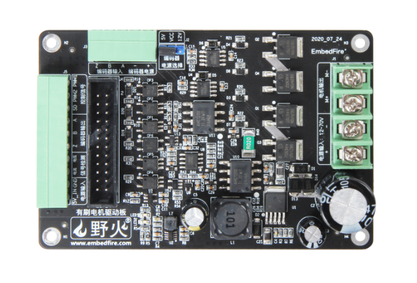

.. vim: syntax=rst

无刷直流电机
==========================================

无刷直流电机（Brushless Direct Current Motor，简称BLDCM）由电动机主体和驱动器组成，
是一种典型的机电一体化产品。 无刷电机是指无电刷和换向器
（或集电环）的电机，又称无换向器电机。这是模型中除了有刷电机以外用的最多的一种电机，
无刷直流电机不使用机械的电刷装置，采用方波自控式永磁同步电机，与有刷电机相比，它将转子和定子交换，
即无刷电机中使用电枢绕组作为定子，使用钕铁硼的永磁材料作为转子，以霍尔传感器取代碳刷换向器，
性能上相较一般的传统直流电机有很大优势。具有高效率、低能耗、低噪音、超长寿命、高可靠性、
可伺服控制、无级变频调速等优点，而缺点则是比有刷的贵、不好维护，广泛应用于航模、高速车模和船模。

不过，单个的无刷电机不是一套完整的动力系统，无刷电机基本必须通过无刷控制器才能实现连续不断的运转。
普通的碳刷电机旋转的是绕组，而无刷电机不论是外转子结构还是内转子结构旋转的都是磁铁。

无刷电机的定子是产生旋转磁场的部分，能够支撑转子进行旋转，主要由硅钢片、漆包线、轴承、
支撑件构成；而转子则是黏贴了钕铁硼磁铁、在定子旋转磁场的作用进行旋转的部件，主要由转轴、
磁铁、支持件构成。除此之外，定子与转子组成的磁极对数还影响着电机的转速与扭力。

直流无刷减速电机几个重要参数
------------------------------------------

直流无刷电机工作原理
------------------------------------------

在学习工作原理前我们先来学习一下安培定则，安培定则，也叫右手螺旋定则，是表示电流和电流激发
磁场的磁感线方向间关系的定则。通电直导线中的安培定则（安培定则一）：用右手握住通电直导线，
让大拇指指向电流的方向，那么四指指向就是磁感线的环绕方向；通电螺线管中的安培定则（安培定则二）：
用右手握住通电螺线管，让四指指向电流的方向，那么大拇指所指的那一端是通电螺线管的N极，如下图所示。

.. image:: ../media/right-hand_screw_rule.jpg
   :align: center
   :alt: 右手螺旋定则

我们知道在磁极中同名相吸，异名相斥，及N极与S极相互吸引，N极与N极和S极与S极相互排斥，
下面我们来看看一个直流模型，如下图所示。

当两边的线圈通上电后，由右手螺旋定则可知两个线圈中将会产生方向向右的磁场，而中间的转子会尽量使
自己内部的磁感线方向与外磁感线方向保持一致，以形成一个最短闭合磁力线回路，N极与S极相互吸引，
这样内转子就会按顺时针方向旋转了。当转子旋转到如图所示的水平位置时转子将不会受到作用力。

但是由于惯性的作用转子将会继续旋转，当转子旋转至水平位置时，交换两个线圈中的电流方向，
这时转子就会继续向顺时针方向转动了。当转子再次旋转至水平位置时，再次交换两个线圈中的电流方向，
这样转子就可以一直旋转了。

有了上面的基础，我们再来看下面的“三相星形联结的二二导通方式”。 

.. image:: ../media/synthesis_of_magnetic_field.png
   :align: center
   :alt: 磁场合成

在A端上电源正极，在B端接电源负极，那么可以在线圈A和B中可以产生如图所示的磁场，因为磁场强度是矢量，
所以由磁场B\ :sub:`B`\和B\ :sub:`A`\可以得到合成磁场B。此时转子就会保持在图中方向。

.. image:: ../media/brushless_motor_working_process.png
   :align: center
   :alt: 无刷电机工作过程

想要转子转动就需要接入不同的电压，我们来分析一下图中的6个过程。

1. 在A端接入正电压，B端接入负电压，C端悬空，转子将会旋转至图中1的位置。
2. 在1的基础上，C端接入正电压，B端接入负电压，A端悬空，转子将会从1的位置旋转至图中2的位置。
3. 在2的基础上，C端接入正电压，A端接入负电压，B端悬空，转子将会从2的位置旋转至图中3的位置。
4. 在3的基础上，B端接入正电压，A端接入负电压，C端悬空，转子将会从3的位置旋转至图中4的位置。
5. 在4的基础上，B端接入正电压，C端接入负电压，A端悬空，转子将会从4的位置旋转至图中5的位置。
6. 在5的基础上，A端接入正电压，C端接入负电压，B端悬空，转子将会从5的位置旋转至图中6的位置。

当转子旋转到位置6时，在重复1的供电状态，转子将会从6的位置旋转到1的位置。
在经过上面的6个过程后转子正好转了一圈，我们将这种驱动方法称为6拍工作方式，
每次电压的变化称为换相。想要电机持续的旋转我们只要按上面转子相应的位置接入相应的电压即可。

直流无刷电机驱动设计与分析
------------------------------------------

控制电路原理设计与分析
^^^^^^^^^^^^^^^^^^^^^^^^^^^^^^^^^

有了上面的原理分析，我们知道了怎么导通就可以让无刷电机转起来，因为单片机的引脚驱动能力有限，
所以在这里我们使用一个叫做三相六臂全桥驱动电路来驱动无刷电机，原理图如下图所示。

.. image:: ../media/three-phase_full-bridge.png
   :align: center
   :alt: 三相六臂全桥驱动电路原理

在上图中导通Q\ :sub:`1`\和Q\ :sub:`4`\，其他都不导通，那么电流将从Q\ :sub:`1`\流经U相绕组，
再从V相绕组流到Q\ :sub:`4`\。这样也就完成了上一节中的第一步，同理，依次导通Q\ :sub:`5`\Q\ :sub:`4`\、
Q\ :sub:`5`\Q\ :sub:`2`\、Q\ :sub:`3`\Q\ :sub:`2`\、Q\ :sub:`3`\Q\ :sub:`6`\和Q\ :sub:`1`\Q\ :sub:`6`\，
这也就完成了6拍工作方式。但是，单片机的引脚直接驱动MOS管还是不行的，所以这里需要使用专用的IC来驱动MOS管。

我们再来思考一个问题，在上面的MOS管导通时，是需要知道上一步导通的是哪两个MOS管，
而且第一步中MOS管导通时转子的位置是我们自己规定，但是在实际使用中启动时转子的位置是未知的，
因此，我们并不知道第一步应该导通哪两个MOS管，所以这里我们需要知道转子的位置信息。
但并不需要连续的位置信息，值需要知道换相点的位置即可。
获取转子位置一般有两种方法，一种是使用霍尔传感器，一种是不使用传感器。

霍尔传感器模式
"""""""""""""""""

霍尔传感器是根据霍尔效应制作的一种磁场传感器。霍尔效应：当电流垂直于外磁场通过半导体时，
载流子发生偏转，垂直于电流和磁场的方向会产生一附加电场，从而在半导体的两端产生电势差，
这一现象就是霍尔效应，这个电势差也被称为霍尔电势差。

在BLDC中一般采用3个开关型霍尔传感器测量转子的位置，由其输出的3位二进制编码去控制三相六臂全桥中的6
个MOS管的导通实现换相。如果将一只霍尔传感器安装在靠近转子的位置，当N极逐渐靠近霍尔传感器即磁感器达到一定值时，
其输出是导通状态；当N极逐渐离开霍尔传感器、磁感应逐渐小时，其输出仍然保持导通状态；
只有磁场转变为S极便达到一定值时，其输出才翻转为截止状态。在S和N交替变化下传感器输出波形占高、
低电平各占50%。如果转子是一对极，则电机旋转一周霍尔传感器输出一个周期的电压波形，如果转子是两对极，
则输出两个周期的波形。

在直流无刷电机中一般把3个霍尔传感器按间隔120度或60度的圆周分布来安装，如果按间隔120度来安装，
则3个霍尔传感器输出波形相差120度电度角，输出信号中高、低电平各占180度电度角。
如果规定输出信号高电平用“1”表示，低电平用“0”表示，则输出的三个信号可以用三位二进制码表示，
如下图所示。

.. image:: ../media/hall_mounting_position.png
   :align: center
   :alt: 霍尔传感器安装位置

转子每旋转一周可以输出6个不同的信号，这样正好可以满足我们条件。只要我们根据霍尔传感器输出的值来导通MOS管即可。
通常厂家也会给出真值表。配套电机的真值表如下。

=====  =====  =====  ====  ====  ====  ====  ====  ====
霍尔a  霍尔b  霍尔c   A+    A-    B+    B-    C+    C-
=====  =====  =====  ====  ====  ====  ====  ====  ====
1      1      0      导通  ×     ×     导通  ×     ×
1      0      0      ×     ×     ×     导通  导通  ×
1      0      1      ×     导通  ×     ×     导通  ×
0      0      1      ×     导通  导通  ×     ×     ×
0      1      1      ×     ×     导通  ×     ×     导通
0      1      0      导通  ×     ×     ×     ×     导通
=====  =====  =====  ====  ====  ====  ====  ====  ====

上表的意思是：当检测到的3个霍尔传感器的值，则导通对应值的MOS管。例如，检测到霍尔a、
霍尔b和霍尔c分别为1、1和0，则导通A+和B-对应的MOS管，其他MOS管都要处于截止状态。
当导通对应的MOS管后电机就会旋转一个角度，旋转到下一个霍尔值改变为100，这时在关闭A+和B-，
导通C+和B-，这样电机有将会旋转一个角度直到下一个霍尔值改变，
只要我们按表中的霍尔值导通对应的MOS管电机就可按一定的方向旋转。电机的真值表一个般有两个，
一个是对应顺时针旋转，另一个对应的是逆时针旋转。

在对MOS管的控制有中两个特殊情况需要注意一下：

1. 当按真值表中对应霍尔值导通MOS管后，就保持导通状态不变时，此时电机就会旋转到对应位置保持不变，
   此时电路中的电能将只能转换为热能，不能转换为机械能，而我们的电机绕组时候的是漆包铜线，
   其内阻非常的小，电流就会非常的大，这将会产生大量的热而导致电源或者电机被烧毁。
2. 在上面的三相六臂全桥驱动电路原理图中如果同时导通Q\ :sub:`1`\和Q\ :sub:`2`\，或者导通
   Q\ :sub:`3`\和Q\ :sub:`4`\，或者导通Q\ :sub:`5`\和Q\ :sub:`6`\，只要导通以上对应的两个MOS管，
   都会导致电路中的电机不能正常工作，而MOS管直接将电源的正负极接通，这无疑将会烧毁电源或者MOS管。

以上两个情况是我们电路设计和编程控制需要特别注意的，必须要避免以上情况的发生。

驱动芯片与驱动电机设计与分析
^^^^^^^^^^^^^^^^^^^^^^^^^^^^^^^^^
野火无刷电机驱动板是使用MOS管搭建的大功率无刷电机驱动板，实物图如下图所示。

驱动板可支持12V~70V的宽电压输入，10A过电流保护电路，超过10A可自动禁用电机控制信号，最高功率支持700W。
实际使用输入电压需要根据电机进行选择，同时还具有3相电流和反电动势采样电路、编码器（霍尔）接口和电源电压检测电路等等，
本小节主要讲解电机驱动部分电路，其他功能将在后续章节中讲解。

野火使用MOS管搭建的直流有刷驱动板做到了信号完全隔离，其他驱动板基本都只是使用光耦隔离了控制信号，
并没有对ADC采样电路进行隔离，野火不仅使用光耦对控制信号进行了隔离，
还使用AMC1200SDUBR隔离运放对ADC采样电路进行了隔离。

PWM控制信号使用了TLP2362高速光耦进行了隔离，SD控制信号使用了EL357N光耦进行了隔离，如下图所示。

为了防止出现同一侧高端MOS管和低端MOS管同时导通的情况，我们在电路里面增加了异或门和与门，
这样不管控制信号如果都不会存在同一侧高端MOS管和低端MOS管同时导通的情况。
下面我们来分析是怎么做到的，这只看U相，如下图所示：

- 当U+和U-同时为高时，则异或门3脚的输出为低电平，那么与门U24A的2脚就是低电平，所以与门输出低电平，即Motor_U+_IN为低电平。
- 当U+和U-同时为低时，则异或门3脚的输出为低电平，那么与门U24A的2脚就是低电平，所以与门输出低电平，即Motor_U+_IN为低电平。
- 当U+和U-任意一高一低时，则异或门3脚的输出为高电平，那么与门U24A的2脚就是高电平，所以与门U24A的3脚输出将与输入的引脚1电平是一样的。

U相PWM信号隔离部分完整的输入输出真值表如下表所示：

.. list-table:: PWM信号输入输出真值表
    :widths: 40 40 40 40
    :header-rows: 1
    :align: center

    * - 输入
      - \-
      - 输出
      - \-
    * - Motor_U+
      - Motor_U-
      - Motor_U+_IN
      - Motor_U-_IN
    * - H
      - H
      - L
      - L
    * - H
      - L
      - H
      - L
    * - L
      - H
      - L
      - H
    * - L
      - L
      - H
      - H

最下方的与门的作用是可以使单片机和过流保护电路共同控制SD脚，与门输入输出与MOS管状态真值表如下表所示。

下图是使用MOS管搭建的U相半桥电路：

IR2110S主要功能有逻辑信号输入处理、电平转换功能和悬浮自举电源结构等。
可以使MCU输出逻辑信号直接连接到IR2110S的输入通道上。IR2110S芯片有一个shutdown引脚，
逻辑输入控制信号高电平有效，控制强行使LO、HO输出低电平。这样可以直接使用这个引脚做软件控制电机的旋转与停止，
还可以实现硬件的限流保护（后续章节分析保护电路），输入信号和输出信号逻辑真值表如下表所示。

.. list-table:: IR2110S输入信号和输出信号逻辑真值表
    :widths: 10 10 10 10 10
    :header-rows: 1
    :align: center

    * - SD
      - HIN
      - LIN
      - HO
      - LO
    * - H
      - \*
      - \*
      - L
      - L
    * - L
      - L
      - L
      - L
      - L
    * - L
      - H
      - L
      - H
      - L
    * - L
      - L
      - H
      - L
      - H
    * - L
      - H
      - H
      - H
      - H

其中*号表示不管输入为何种信号，输出都是固定的。

从真值表可知，在输入逻辑信号SD为“H”时，不管IN为“H”或者“L”情况下，驱动器控制输出HO、LO同时为“L”，
上、下功率管同时关断；当输入逻辑信号SD为“L”，HO跟随HIN变化，LO跟随LIN变化。

电机主控板与无刷电机驱动板连接见下表所示。

.. list-table:: 电机与无刷电机驱动板连接
    :widths: 20 20
    :header-rows: 1
    :align: center

    * - 电机
      - 无刷电机驱动板
    * - 粗黄
      - U
    * - 粗绿
      - V
    * - 粗蓝
      - W
    * - 细红
      - +（编码器电源）
    * - 细黑
      - -（编码器电源）
    * - 细黄
      - HIU
    * - 细绿
      - HIV
    * - 细蓝
      - HIW

无刷电机驱动板与主控板连接见下表所示。

.. list-table:: 无刷电机驱动板与主控板连接
    :widths: 20 20
    :header-rows: 1
    :align: center

    * - 无刷电机驱动板
      - 主控板
    * - 5V_IN
      - 5V
    * - GND
      - GND
    * - U+
      - PI5
    * - U-
      - PH13
    * - V+
      - PI6
    * - V-
      - PH14
    * - W+
      - PI7
    * - W-
      - PH15
    * - HU
      - PH10
    * - HV
      - PH11
    * - HW
      - PH12
    * - SD
      - PE6

推荐使用配套的牛角排线直接连接驱动板和主控板。连接开发板的那端，请连接在“无刷电机驱动接口2”上。

直流无刷减速电机控制实现
-----------------------------------

速度控制原理
^^^^^^^^^^^^^^^^^^^^^^^^^^^^^^^^^

通常我们使用电机不仅仅只是让电机旋转这么简单，更多的时候需要对速度进行控制，
按照以下无刷直流电机转速计算公式可知，影响电机转速的三个参量分别是电枢回路的总电阻Ra,
调整电枢绕组的供电电压Ua或者调整励磁磁通φ。也就是说，想要改变电机的转速，
必须对以上三个参量进行调整。

V=(Ua-IaRa)/CEφ

- Ua——电机定子绕组的实际电压大小
- Ia——电机绕组内通过的实际电流大小
- Ra——电路系统中包含电机的回路电阻大小
- CE——电势系数
- φ——励磁磁通

在现实情况下，在已确定无刷直流电机选型及电机参数的情况下，改变系统总的电阻值Ra和电机的励磁磁通值
难度是比较大的，因此，在一般情况下，我们可以对无刷直流电机的供电电压所处适当调整，
从而降低线圈绕组通过电流大小，以期达到控制电机转速的目的，同前面讲到的直流有刷减速电机一样，
直流无刷电机也可以使用脉宽调制信号（PWM）来进行速度控制，通常使用的PWM频率为十几或者几十千赫兹
（不得超过MOS管的开关频率），这样把需要通电的MOS管使用PWM来控制就可以实现速度的控制。

使用PWM控制直流无刷电机的策略包括PWM-ON、ON-PWM、H_PWM-L_ON、H_ON-L_PWM和H_PWM-L_PWM。
这5种控制策略，均是电机处于120°运行方式下进行的。如下图所示。

.. image:: ../media/PWM_mode.png
   :align: center
   :alt: PWM5种调制方式

这5种调制方式为：

1. PWM-ON型。在120°导通区间，各开关管前60°采用PWM调制，后60°则恒通。
2. ON-PWM型。在120°导通区间，各开关管前60°恒通，后60°则采用PWM调制。
3. H_PWM-L_ON型。在120°导通区间，上桥臂开关管采用PWM调制，下桥臂恒通。
4. H_ON-L_PWM型。在120°导通区间，上桥臂开关管恒通，下桥臂采用PWM调制。
5. H_PWM-L_PWM型。在120°导通区间，上、下桥臂均采用PWM调制。

那么我们选择那种控制方式更好呢？其实并没有那种方式是最好的，因为的不同的应用场所下各种控制的效果是不同的，
所以在实际应用中我们可以尝试多种方式，然后再选择控制效果最佳的方式。

硬件设计
^^^^^^^^^^^^^^^^^^^^^^^^^^^^^^^^^

软件设计
^^^^^^^^^^^^^^^^^^^^^^^^^^^^^^^^^
这里只讲解核心的部分代码，有些变量的设置，头文件的包含等并没有涉及到，完整的代码请
参考本章配套的工程。我们创建了四个文件：bsp_motor_tim.c、bsp_motor_tim.h、
bsp_bldcm_control.c和bsp_bldcmr_control.h文件用来存定时器驱动和电机控制程序及相关宏定义。
本章代码在野火电机驱动例程中:\\base_code\\basis_part\\F407\\直流无刷电机-按键控制目录下。

编程要点
"""""""""""""""""

(1) 高级定时器 IO 配置

(2) 定时器时基结构体TIM_HandleTypeDef配置

(3) 定时器输出比较结构体TIM_OC_InitTypeDef配置

(4) 根据电机的换相表编写换相中断回调函数

(5) 根据定时器定义电机控制相关函数

.. code-block:: c
   :caption: bsp_motor_tim.h-宏定义
   :linenos:

   /* 电机控制定时器 */
   #define MOTOR_TIM           				      TIM8
   #define MOTOR_TIM_CLK_ENABLE()  			    __TIM8_CLK_ENABLE()
   extern TIM_HandleTypeDef  htimx_bldcm;

   /* 累计 TIM_Period个后产生一个更新或者中断		
      当定时器从0计数到5599，即为5600次，为一个定时周期 */
   #define PWM_PERIOD_COUNT     (5600)

   #define PWM_MAX_PERIOD_COUNT    (PWM_PERIOD_COUNT - 100)

   /* 高级控制定时器时钟源TIMxCLK = HCLK = 168MHz 
      设定定时器频率为=TIMxCLK/(PWM_PRESCALER_COUNT+1)/PWM_PERIOD_COUNT = 15KHz*/
   #define PWM_PRESCALER_COUNT     (2)

   /* TIM8通道1输出引脚 */
   #define MOTOR_OCPWM1_PIN           		    GPIO_PIN_5
   #define MOTOR_OCPWM1_GPIO_PORT     		    GPIOI
   #define MOTOR_OCPWM1_GPIO_CLK_ENABLE() 	  __GPIOI_CLK_ENABLE()
   #define MOTOR_OCPWM1_AF					          GPIO_AF3_TIM8

   /* TIM8通道2输出引脚 */
   #define MOTOR_OCPWM2_PIN           		    GPIO_PIN_6
   #define MOTOR_OCPWM2_GPIO_PORT     		    GPIOI
   #define MOTOR_OCPWM2_GPIO_CLK_ENABLE() 	  __GPIOI_CLK_ENABLE()
   #define MOTOR_OCPWM2_AF					          GPIO_AF3_TIM8

   /* TIM8通道3输出引脚 */
   #define MOTOR_OCPWM3_PIN           		    GPIO_PIN_7
   #define MOTOR_OCPWM3_GPIO_PORT     		    GPIOI
   #define MOTOR_OCPWM3_GPIO_CLK_ENABLE() 	  __GPIOI_CLK_ENABLE()
   #define MOTOR_OCPWM3_AF					          GPIO_AF3_TIM8

   /* TIM8通道1互补输出引脚 */
   #define MOTOR_OCNPWM1_PIN            		  GPIO_PIN_13
   #define MOTOR_OCNPWM1_GPIO_PORT      		  GPIOH
   #define MOTOR_OCNPWM1_GPIO_CLK_ENABLE()	  __GPIOH_CLK_ENABLE()
   #define MOTOR_OCNPWM1_AF					        GPIO_AF3_TIM8

   /* TIM8通道2互补输出引脚 */
   #define MOTOR_OCNPWM2_PIN            		  GPIO_PIN_14
   #define MOTOR_OCNPWM2_GPIO_PORT      		  GPIOH
   #define MOTOR_OCNPWM2_GPIO_CLK_ENABLE()	  __GPIOH_CLK_ENABLE()
   #define MOTOR_OCNPWM2_AF					        GPIO_AF3_TIM8

   /* TIM8通道3互补输出引脚 */
   #define MOTOR_OCNPWM3_PIN            		  GPIO_PIN_15
   #define MOTOR_OCNPWM3_GPIO_PORT      		  GPIOH
   #define MOTOR_OCNPWM3_GPIO_CLK_ENABLE()	  __GPIOH_CLK_ENABLE()
   #define MOTOR_OCNPWM3_AF					        GPIO_AF3_TIM8

   #define TIM_COM_TS_ITRx                   TIM_TS_ITR3    // 内部触发配置(TIM8->ITR3->TIM5)

   /* 霍尔传感器定时器 */
   #define HALL_TIM           				      TIM5
   #define HALL_TIM_CLK_ENABLE()  			    __TIM5_CLK_ENABLE()

   extern TIM_HandleTypeDef htimx_hall;

   /* 累计 TIM_Period个后产生一个更新或者中断		
      当定时器从0计数到4999，即为5000次，为一个定时周期 */
   #define HALL_PERIOD_COUNT     (0xFFFF)

   /* 高级控制定时器时钟源TIMxCLK = HCLK / 2 = 84MHz
      设定定时器频率为 = TIMxCLK / (PWM_PRESCALER_COUNT + 1) / PWM_PERIOD_COUNT = 10.01Hz
      周期 T = 100ms */
   #define HALL_PRESCALER_COUNT     (128)

   /* TIM5 通道 1 引脚 */
   #define HALL_INPUTU_PIN           		    GPIO_PIN_10
   #define HALL_INPUTU_GPIO_PORT     		    GPIOH
   #define HALL_INPUTU_GPIO_CLK_ENABLE() 	  __GPIOH_CLK_ENABLE()
   #define HALL_INPUTU_AF					          GPIO_AF2_TIM5

   /* TIM5 通道 2 引脚 */
   #define HALL_INPUTV_PIN           		    GPIO_PIN_11
   #define HALL_INPUTV_GPIO_PORT     		    GPIOH
   #define HALL_INPUTV_GPIO_CLK_ENABLE() 	  __GPIOH_CLK_ENABLE()
   #define HALL_INPUTV_AF					          GPIO_AF2_TIM5

   /* TIM5 通道 3 引脚 */
   #define HALL_INPUTW_PIN           		    GPIO_PIN_12
   #define HALL_INPUTW_GPIO_PORT     		    GPIOH
   #define HALL_INPUTW_GPIO_CLK_ENABLE() 	  __GPIOH_CLK_ENABLE()
   #define HALL_INPUTW_AF					          GPIO_AF2_TIM5

   #define HALL_TIM_IRQn                    TIM5_IRQn
   #define HALL_TIM_IRQHandler              TIM5_IRQHandler

使用宏定义非常方便程序升级、移植。如果使用不同的定时器IO，修改这些宏即可。

定时器复用功能引脚初始化

.. code-block:: c
   :caption: 定时器复用功能引脚初始化
   :linenos:

   static void TIMx_GPIO_Config(void) 
   {
      /*定义一个GPIO_InitTypeDef类型的结构体*/
      GPIO_InitTypeDef GPIO_InitStructure;

      /*开启定时器相关的GPIO外设时钟*/
      MOTOR_OCPWM1_GPIO_CLK_ENABLE();
      MOTOR_OCNPWM1_GPIO_CLK_ENABLE();
      MOTOR_OCPWM2_GPIO_CLK_ENABLE();
      MOTOR_OCNPWM2_GPIO_CLK_ENABLE();
      MOTOR_OCPWM3_GPIO_CLK_ENABLE();
      MOTOR_OCNPWM3_GPIO_CLK_ENABLE();

      /* 定时器功能引脚初始化 */															   
      GPIO_InitStructure.Pull = GPIO_NOPULL;
      GPIO_InitStructure.Speed = GPIO_SPEED_HIGH;
      GPIO_InitStructure.Mode = GPIO_MODE_OUTPUT_PP;   // 推挽输出模式

      GPIO_InitStructure.Pin = MOTOR_OCNPWM1_PIN;
      HAL_GPIO_Init(MOTOR_OCNPWM1_GPIO_PORT, &GPIO_InitStructure);	

      GPIO_InitStructure.Pin = MOTOR_OCNPWM2_PIN;	
      HAL_GPIO_Init(MOTOR_OCNPWM2_GPIO_PORT, &GPIO_InitStructure);

      GPIO_InitStructure.Pin = MOTOR_OCNPWM3_PIN;	
      HAL_GPIO_Init(MOTOR_OCNPWM3_GPIO_PORT, &GPIO_InitStructure);	

      /* 通道 2 */
      GPIO_InitStructure.Mode = GPIO_MODE_AF_PP;  

      GPIO_InitStructure.Pin = MOTOR_OCPWM1_PIN;
      GPIO_InitStructure.Alternate = MOTOR_OCPWM1_AF;	
      HAL_GPIO_Init(MOTOR_OCPWM1_GPIO_PORT, &GPIO_InitStructure);

      GPIO_InitStructure.Pin = MOTOR_OCPWM2_PIN;	
      GPIO_InitStructure.Alternate = MOTOR_OCPWM2_AF;	
      HAL_GPIO_Init(MOTOR_OCPWM2_GPIO_PORT, &GPIO_InitStructure);

      /* 通道 3 */
      GPIO_InitStructure.Pin = MOTOR_OCPWM3_PIN;	
      GPIO_InitStructure.Alternate = MOTOR_OCPWM3_AF;	
      HAL_GPIO_Init(MOTOR_OCPWM3_GPIO_PORT, &GPIO_InitStructure);
   }

定时器通道引脚使用之前必须设定相关参数，这选择复用功能，并指定到对应的定时器。
使用GPIO之前都必须开启相应端口时钟。在上面我们将TIM1的CH1、CH2和CH3配置为PWM模式，
我对其对应的互补输出通道配置为推挽输出模式，所以在三相六臂驱动电路中，对于下桥臂是始终开启的，
即这里我们使用的是H_PWM-L_ON调制方式。

.. code-block:: c
   :caption: 电机控制定时器模式配置
   :linenos:

   static void TIM_Mode_Config(void)
   {
      // 开启TIMx_CLK,x[1,8] 
      MOTOR_TIM_CLK_ENABLE(); 
      /* 定义定时器的句柄即确定定时器寄存器的基地址*/
      htimx_bldcm.Instance = MOTOR_TIM;
      /* 累计 TIM_Period个后产生一个更新或者中断*/		
      //当定时器从0计数到999，即为1000次，为一个定时周期
      htimx_bldcm.Init.Period = PWM_PERIOD_COUNT - 1;
      // 高级控制定时器时钟源TIMxCLK = HCLK=216MHz 
      // 设定定时器频率为=TIMxCLK/(TIM_Prescaler+1)=1MHz
      htimx_bldcm.Init.Prescaler = PWM_PRESCALER_COUNT - 1;	
      // 采样时钟分频
      htimx_bldcm.Init.ClockDivision=TIM_CLOCKDIVISION_DIV1;
      // 计数方式
      htimx_bldcm.Init.CounterMode=TIM_COUNTERMODE_UP;
      // 重复计数器
      htimx_bldcm.Init.RepetitionCounter=0;	
      // 初始化定时器TIMx, x[1,8]
      HAL_TIM_PWM_Init(&htimx_bldcm);

      /*PWM模式配置*/
      //配置为PWM模式1
      TIM_OCInitStructure.OCMode = TIM_OCMODE_PWM1;
      TIM_OCInitStructure.Pulse = 0;                         // 默认必须要初始为0
      TIM_OCInitStructure.OCPolarity = TIM_OCPOLARITY_HIGH;
      TIM_OCInitStructure.OCNPolarity = TIM_OCNPOLARITY_HIGH;
      TIM_OCInitStructure.OCIdleState = TIM_OCIDLESTATE_SET;
      TIM_OCInitStructure.OCNIdleState = TIM_OCNIDLESTATE_RESET;

      HAL_TIM_PWM_ConfigChannel(&htimx_bldcm,&TIM_OCInitStructure,TIM_CHANNEL_1);    // 初始化通道 1 输出 PWM 
      HAL_TIM_PWM_ConfigChannel(&htimx_bldcm,&TIM_OCInitStructure,TIM_CHANNEL_2);    // 初始化通道 2 输出 PWM
      HAL_TIM_PWM_ConfigChannel(&htimx_bldcm,&TIM_OCInitStructure,TIM_CHANNEL_3);    // 初始化通道 3 输出 PWM
      
      /* 配置触发源 */
      HAL_TIMEx_ConfigCommutationEvent(&htimx_bldcm, TIM_COM_TS_ITRx, TIM_COMMUTATION_SOFTWARE);

      /* 开启定时器通道1输出PWM */
      HAL_TIM_PWM_Start(&htimx_bldcm,TIM_CHANNEL_1);

      /* 开启定时器通道2输出PWM */
      HAL_TIM_PWM_Start(&htimx_bldcm,TIM_CHANNEL_2);

      /* 开启定时器通道3输出PWM */
      HAL_TIM_PWM_Start(&htimx_bldcm,TIM_CHANNEL_3);
   }

首先定义两个定时器初始化结构体，定时器模式配置函数主要就是对这两个结构体的成员进行初始化，然后通过相
应的初始化函数把这些参数写入定时器的寄存器中。有关结构体的成员介绍请参考定时器详解章节。

不同的定时器可能对应不同的APB总线，在使能定时器时钟是必须特别注意。高级控制定时器属于APB2，
定时器内部时钟是168MHz。

在时基结构体中我们设置定时器周期参数为PWM_PERIOD_COUNT（5600）-1，时钟预分频器设置为
PWM_PRESCALER_COUNT（2） - 1，频率为：168MHz/PWM_PERIOD_COUNT/PWM_PRESCALER_COUNT=15KHz，
使用向上计数方式。

在输出比较结构体中，设置输出模式为PWM1模式，通道输出高电平有效，设置脉宽为0。

触发源配置为软件触发。

最后使用HAL_TIM_PWM_Start函数开启计数器，使能PWM输出。

.. code-block:: c
   :caption: 霍尔传感器定时器模式配置
   :linenos:

   static void hall_tim_init(void)
   {
      TIM_HallSensor_InitTypeDef  hall_sensor_onfig;  
      
      /* 基本定时器外设时钟使能 */
      HALL_TIM_CLK_ENABLE();
      
      /* 定时器基本功能配置 */
      htimx_hall.Instance = HALL_TIM;
      htimx_hall.Init.Prescaler = HALL_PRESCALER_COUNT - 1;       // 预分频
      htimx_hall.Init.CounterMode = TIM_COUNTERMODE_UP;           // 向上计数
      htimx_hall.Init.Period = HALL_PERIOD_COUNT - 1;             // 计数周期
      htimx_hall.Init.ClockDivision = TIM_CLOCKDIVISION_DIV1;     // 时钟分频
      
      hall_sensor_onfig.IC1Prescaler = TIM_ICPSC_DIV1;            // 输入捕获分频
      hall_sensor_onfig.IC1Polarity = TIM_ICPOLARITY_BOTHEDGE;    // 输入捕获极性
      hall_sensor_onfig.IC1Filter = 10;                           // 输入滤波
      hall_sensor_onfig.Commutation_Delay = 0U;                   // 不使用延迟触发
      HAL_TIMEx_HallSensor_Init(&htimx_hall,&hall_sensor_onfig);
      
      HAL_NVIC_SetPriority(HALL_TIM_IRQn, 0, 0);    // 设置中断优先级
      HAL_NVIC_EnableIRQ(HALL_TIM_IRQn);            // 使能中断
   }

关于霍尔传感器引脚的初始化代码这里不在讲解，具体代码请参考配套工程代码。
高级控制定时器属于APB1，定时器内部时钟是84MHz。
在时基结构体中我们设置定时器周期参数为PWM_PERIOD_COUNT（0xFFFF）-1，时钟预分频器设置为
PWM_PRESCALER_COUNT（128） - 1，频率为：84MHz/PWM_PERIOD_COUNT/PWM_PRESCALER_COUNT≈10Hz，
，计数器的溢出周期为100毫秒，这个时间要设置到电机正常旋转时足够一路霍尔传感器产生变化，
这样能方便后续速度控制时的计时功能，使用向上计数方式。因为任何一相霍尔传感器发生变化都需要换相，
所以输入捕获极性设置为双边沿触发。借助 TIMx_CR2 寄存器中的 TI1S 位，
可将通道1的输入滤波器连接到异或门的输出，从而将CH1、CH2和CH3这三个输入引脚组合在一起，如下图所示。
因此霍尔传感器必须使用定时器的CH1、CH2和CH3这3个通道，这样只要任意一相霍尔传感器状态发生变化都可以触发中断进行换相。
配置定时器的中断优先级，并使能全局定时器中断。

.. code-block:: c
   :caption: 霍尔传感器使能
   :linenos:

   void hall_enable(void)
   {
      /* 使能霍尔传感器接口 */
      __HAL_TIM_ENABLE_IT(&htimx_hall, TIM_IT_TRIGGER);
      __HAL_TIM_ENABLE_IT(&htimx_hall, TIM_IT_UPDATE);
      
      HAL_TIMEx_HallSensor_Start(&htimx_hall);

      LED1_OFF;
      
      HAL_TIM_TriggerCallback(&htimx_hall);   // 执行一次换相
   }

开启触发中断，开启更新中断，启动霍尔传感器，关闭LED1，LED1将用于电机堵转超时的指示灯，
所以在开启电机前好确保该指示灯是灭的。最后执行了一次换相，在HAL_TIM_TriggerCallback这个函数里面执行一次换相，
这是因为需要根据当前霍尔传感器的位置让电机旋转到下一个位置，同时时霍尔传感器状态也发生了变化，
这时才会到HAL_TIM_TriggerCallback中断回调函数里面执行换相，否则电机将有可能不能正常启动。

.. code-block:: c
   :caption: 霍尔传感器触发换相
   :linenos:

   void HAL_TIM_TriggerCallback(TIM_HandleTypeDef *htim)
   {
      /* 获取霍尔传感器引脚状态,作为换相的依据 */
      uint8_t step = 0;
      step = get_hall_state();

      if(get_bldcm_direction() != MOTOR_FWD)
      {
         step = 7 - step;        // 根据方向：REV = 7 - FWD;
      }

      switch(step)
      {
         case 1:    /* W+ U- */
            __HAL_TIM_SET_COMPARE(&htimx_bldcm, TIM_CHANNEL_2, 0);                            // 通道 2 配置为 0
            HAL_GPIO_WritePin(MOTOR_OCNPWM2_GPIO_PORT, MOTOR_OCNPWM2_PIN, GPIO_PIN_RESET);    // 关闭下桥臂
         
            __HAL_TIM_SET_COMPARE(&htimx_bldcm, TIM_CHANNEL_3, bldcm_pulse);                  // 通道 3 配置的占空比
            HAL_GPIO_WritePin(MOTOR_OCNPWM1_GPIO_PORT, MOTOR_OCNPWM1_PIN, GPIO_PIN_SET);      // 开启下桥臂
            break;
         
         case 2:    /* U+  V -*/
            __HAL_TIM_SET_COMPARE(&htimx_bldcm, TIM_CHANNEL_3, 0);                            // 通道 3 配置为 0
            HAL_GPIO_WritePin(MOTOR_OCNPWM3_GPIO_PORT, MOTOR_OCNPWM3_PIN, GPIO_PIN_RESET);    // 关闭下桥臂
         
            __HAL_TIM_SET_COMPARE(&htimx_bldcm, TIM_CHANNEL_1, bldcm_pulse);                  // 通道 1 配置的占空比
            HAL_GPIO_WritePin(MOTOR_OCNPWM2_GPIO_PORT, MOTOR_OCNPWM2_PIN, GPIO_PIN_SET);      // 开启下桥臂
            break;
         
         case 3:    /* W+ V- */
            __HAL_TIM_SET_COMPARE(&htimx_bldcm, TIM_CHANNEL_1, 0);                            // 通道 1 配置为 0
            HAL_GPIO_WritePin(MOTOR_OCNPWM1_GPIO_PORT, MOTOR_OCNPWM1_PIN, GPIO_PIN_RESET);    // 关闭下桥臂
      
            __HAL_TIM_SET_COMPARE(&htimx_bldcm, TIM_CHANNEL_3, bldcm_pulse);                  // 通道 3 配置的占空比
            HAL_GPIO_WritePin(MOTOR_OCNPWM2_GPIO_PORT, MOTOR_OCNPWM2_PIN, GPIO_PIN_SET);      // 开启下桥臂
            break;
         
         case 4:    /* V+ W- */
            __HAL_TIM_SET_COMPARE(&htimx_bldcm, TIM_CHANNEL_1, 0);                            // 通道 1 配置为 0
            HAL_GPIO_WritePin(MOTOR_OCNPWM1_GPIO_PORT, MOTOR_OCNPWM1_PIN, GPIO_PIN_RESET);    // 关闭下桥臂
            
            __HAL_TIM_SET_COMPARE(&htimx_bldcm, TIM_CHANNEL_2, bldcm_pulse);                  // 通道 2 配置的占空比
            HAL_GPIO_WritePin(MOTOR_OCNPWM3_GPIO_PORT, MOTOR_OCNPWM3_PIN, GPIO_PIN_SET);      // 开启下桥臂
            break;
         
         case 5:    /* V+ U- */
            __HAL_TIM_SET_COMPARE(&htimx_bldcm, TIM_CHANNEL_3, 0);                            // 通道 3 配置为 0
            HAL_GPIO_WritePin(MOTOR_OCNPWM3_GPIO_PORT, MOTOR_OCNPWM3_PIN, GPIO_PIN_RESET);    // 关闭下桥臂

            __HAL_TIM_SET_COMPARE(&htimx_bldcm, TIM_CHANNEL_2, bldcm_pulse);                  // 通道 2 配置的占空比
            HAL_GPIO_WritePin(MOTOR_OCNPWM1_GPIO_PORT, MOTOR_OCNPWM1_PIN, GPIO_PIN_SET);      // 开启下桥臂
            break;
         
         case 6:    /* U+ W- */
            __HAL_TIM_SET_COMPARE(&htimx_bldcm, TIM_CHANNEL_2, 0);                            // 通道 2 配置为 0
            HAL_GPIO_WritePin(MOTOR_OCNPWM2_GPIO_PORT, MOTOR_OCNPWM2_PIN, GPIO_PIN_RESET);    // 关闭下桥臂

            __HAL_TIM_SET_COMPARE(&htimx_bldcm, TIM_CHANNEL_1, bldcm_pulse);                  // 通道 1 配置的占空比
            HAL_GPIO_WritePin(MOTOR_OCNPWM3_GPIO_PORT, MOTOR_OCNPWM3_PIN, GPIO_PIN_SET);      // 开启下桥臂
            break;
      }
      
      HAL_TIM_GenerateEvent(&htimx_bldcm, TIM_EVENTSOURCE_COM);    // 软件产生换相事件，此时才将配置写入

      update = 0;
   }

获取霍尔传感器引脚状态，根据厂家给出的真值表进行换相。将上桥臂采用PWM输出，下桥臂直接输出高电平。
即为H_PWM-L_ON模式。将变量update设置为0，最好生成COM事件触发换相事件，将配置写入。

.. code-block:: c
   :caption: 霍尔传感器更新回调
   :linenos:

   void HAL_TIM_PeriodElapsedCallback(TIM_HandleTypeDef *htim)
   {
      if (update++ > 1)    // 有一次在产生更新中断前霍尔传感器没有捕获到值
      {
         printf("堵转超时\r\n");
         update = 0;
         
         LED1_ON;     // 点亮LED1表示堵转超时停止
         
         /* 堵转超时停止 PWM 输出 */
         hall_disable();       // 禁用霍尔传感器接口
         stop_pwm_output();    // 停止 PWM 输出
      }
   }

因为霍尔传感器没变化一次都会进HAL_TIM_TriggerCallback函数将update设置为0，并且会产生更新中断进入
HAL_TIM_PeriodElapsedCallback函数将update加一，那么如果update大于1就说明没有进入HAL_TIM_TriggerCallback
函数，直接进入HAL_TIM_PeriodElapsedCallback函数，这就说明电机是堵转了，并且已经至少堵转了100毫秒，
这里我们认为堵转超时停止PWM的输出和禁用霍尔传感器。

.. code-block:: c
   :caption: main函数
   :linenos:

   int main(void) 
   {
      __IO uint16_t ChannelPulse = PWM_MAX_PERIOD_COUNT/10;
      uint8_t i = 0;
   
      /* 此处省略其他初始化函数 */

      /* 电机初始化 */
      bldcm_init();
      
      while(1)
      {
         /* 扫描KEY1 */
         if( Key_Scan(KEY1_GPIO_PORT, KEY1_PIN) == KEY_ON)
         {
            /* 使能电机 */
            set_bldcm_speed(ChannelPulse);
            set_bldcm_enable();
         }
         
         /* 扫描KEY2 */
         if( Key_Scan(KEY2_GPIO_PORT, KEY2_PIN) == KEY_ON)
         {
            /* 停止电机 */
            set_bldcm_disable();
         }
         
         /* 扫描KEY3 */
         if( Key_Scan(KEY3_GPIO_PORT, KEY3_PIN) == KEY_ON)
         {
            /* 增大占空比 */
            ChannelPulse += PWM_MAX_PERIOD_COUNT/10;
            
            if(ChannelPulse > PWM_MAX_PERIOD_COUNT)
            ChannelPulse = PWM_MAX_PERIOD_COUNT;
            
            set_bldcm_speed(ChannelPulse);
         }
         
         /* 扫描KEY4 */
         if( Key_Scan(KEY4_GPIO_PORT, KEY4_PIN) == KEY_ON)
         {
            if(ChannelPulse < PWM_MAX_PERIOD_COUNT/10)
            ChannelPulse = 0;
            else
            ChannelPulse -= PWM_MAX_PERIOD_COUNT/10;

            set_bldcm_speed(ChannelPulse);
         }
         
         /* 扫描KEY4 */
         if( Key_Scan(KEY5_GPIO_PORT, KEY5_PIN) == KEY_ON)
         {
            /* 转换方向 */
            set_bldcm_direction( (++i % 2) ? MOTOR_FWD : MOTOR_REV);
         }
      }
   }
在main函数中首先初始化了各种外设，在死循环中检测按键的变化，按KEY1可以启动电机；按KEY2可以增大PWM占空比，增加电机旋转速度；
按KEY3可以减小PWM占空比，减小电机旋转速度；按KEY4可以使电机旋转方向改变；按KEY4可以停止电机旋转；

下载验证
^^^^^^^^^^^^^^^^^^^^^^^^^^^^^^^^^

按照要求电机和控制板连接好，可以按下KEY1、2、3、4、5对电机进行控制，当PWM减小到一定值时，电机会停止旋转，
当堵转超时后LED1会亮起，并且停止PWM的输出，关闭电机防止长时间的大电流烧毁电机。 

在确定PWM输出正确后我们就可以接上电机进行验证我们的程序了。
