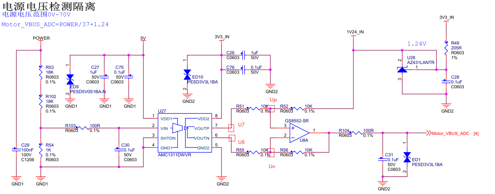
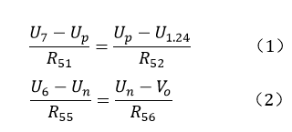
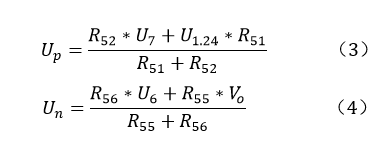
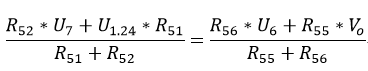
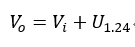
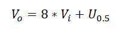
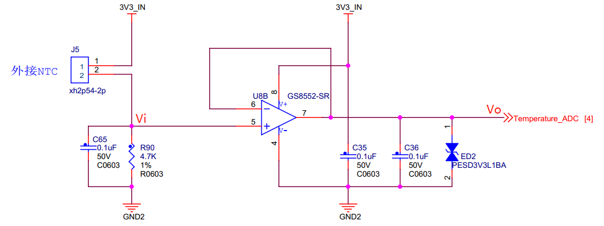
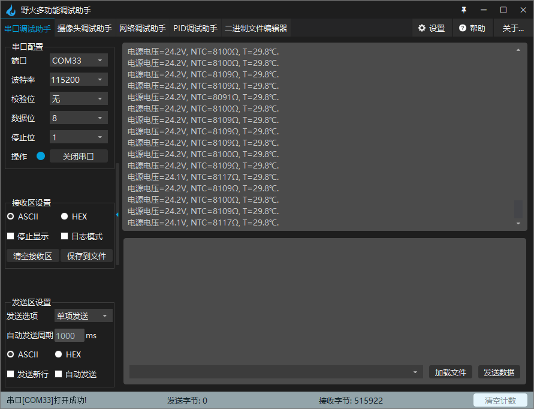

.. vim: syntax=rst

直流无刷驱动板温度电压电压采集
==========================================

野火使用MOS管搭建的直流无刷驱动板做到了信号完全隔离，其他驱动板基本都只是使用光耦隔离了控制信号，
并没有对ADC采样电路进行隔离，野火不仅使用光耦对控制信号进行了隔离，
还使用AMC1200SDUBR隔离运放对ADC采样电路进行了隔离。

电源电压采样电路
------------------------------------------

如下图所示是电源电压采样电路，在电源电压上并联R53和R54的串联电阻，R54两端的电压作为隔离运放的输入，
再经过隔离运放放大8倍后差分输出，使用普通运放将差分输出转换成单端输出，连接到STM32的ADC采样通道。

从上图中我们可以知道是一个负反馈电路，那么根据虚短和虚断可以知道U\ :sub:`p`\=U\ :sub:`n`\，
p点和n点没有电流到运放的2脚和3脚，可以得：

将（1）式和（2）式整理可得：

因为U\ :sub:`p`\=U\ :sub:`n`\，所以有：

其中R\ :sub:`55`\=R\ :sub:`56`\=R\ :sub:`51`\=R\ :sub:`52`\=10KΩ，
将R\ :sub:`55`\、R\ :sub:`56`\、R\ :sub:`51`\和R\ :sub:`52`\阻值带入上式化简可得：

因为隔离运放将V\ :sub:`i`\放大8倍后输出，所以有U\ :sub:`7`\-U\ :sub:`6`\=8*V\ :sub:`i`\，
带入上式可得：

温度采样电路
------------------------------------------

使用时需要外接NTC热敏采样电阻，将NTC电阻贴在电机表面，采集电机温度。
热敏电阻器是利用金属氧化物半导体具有较大温度系数的特性，对温度敏感的电阻器。
其电阻值的温度依赖性为:

.. code-block::
   :caption: 电阻值的温度依赖性
   :linenos:

   Rt=R25 exp[B(1/T-1/T25)]

- Rt：温度T时阻值
- R25：温度T25时阻值
- T25：标准温度298.15 K(25℃)
- B:热敏电阻常数

B的计算公式如下：

.. code-block::
   :caption: B值计算公式
   :linenos:

   B=ln(Rt/R25)/(1/T-1/T25)

由上式可解得：

.. code-block::
   :caption: 温度计算公式
   :linenos:

   T=B*R25/(B+T25*ln(Rt/R25))    （1）

上式结果单位为开尔文（K）。

如下图所示是电机温度采样电路，

由上图可知其中运放是一个电压跟随器，其中运放的5脚和7脚电压相等。

所以，Rt=(3.3-Temperature_ADC)/(Temperature_ADC/4700.0)。
将Rt带入上面的（1）式计算温度。配套的NTC温度传感器B为3950。

硬件连接
--------------

本章实验需要连接开发板和驱动板，这里给出接线表。

MOS管搭建驱动板
^^^^^^^^^^^^^^^^^^^^^^^^^^^^^^^^^

电机主控板与无刷电机驱动板连接见下表所示。

.. list-table:: 电机与无刷电机驱动板连接
    :widths: 20 20
    :header-rows: 1
    :align: center

    * - 电机
      - 无刷电机驱动板
    * - 粗黄
      - U
    * - 粗绿
      - V
    * - 粗蓝
      - W
    * - 细红
      - +（编码器电源）
    * - 细黑
      - -（编码器电源）
    * - 细黄
      - HIU
    * - 细绿
      - HIV
    * - 细蓝
      - HIW

无刷电机驱动板与主控板连接见下表所示。

.. list-table:: 无刷电机驱动板与主控板连接
    :widths: 20 20
    :header-rows: 1
    :align: center

    * - 无刷电机驱动板
      - 主控板
    * - 5V_IN
      - 5V
    * - GND
      - GND
    * - U+
      - PI5
    * - U-
      - PH13
    * - V+
      - PI6
    * - V-
      - PH14
    * - W+
      - PI7
    * - W-
      - PH15
    * - HU
      - PH10
    * - HV
      - PH11
    * - HW
      - PH12
    * - SD
      - PE6
    * - TEMP
      - PF10
    * - VBUS
      - PF9

推荐使用配套的牛角排线直接连接驱动板和主控板。连接开发板的那端，请连接在“无刷电机驱动接口2”上。

在NTC接口上插入NTC采样电阻，并将另一头贴于电机表面。

在STM32中实现温度和电源电压采集
------------------------------------------

从前面两节中我们知道了温度和电源电压计算方法，下面我们看代码如何实现部分的处理。

软件设计
^^^^^^^^^^^^^^^^^^^^^
配套代码在下面目录中可以找到:

.. code-block::
   :caption: 代码目录
   :linenos:

   \base_code\basis_part\F407\直流无刷电机-温度-电源电压读取

编程要点
"""""""""""""""""

(1) 初始化ADC并使用DMA进行数据的获取
(2) 编写函数对采集得到的数据进行处理
(3) 编写获取最终温度的函数
(4) 测试代码

软件分析
^^^^^^^^^^^^^^^^^^^^^

时钟等其他相关的初始化与前面工程相同，这里不过多赘述，我们直接看ADC初始化的代码，
看ADC初始化结构体各个参数的配置，如果对ADC配置有疑问，请看《野火STM32库开发实战指南》，
有针对ADC外设的细致讲解。

ADC初始化
"""""""""""""""""""""""""""

ADC_Init()函数
*****************

.. code-block:: c
   :name: ADC_Init(void)
   :caption: ADC_Init()函数
   :linenos:

   /**
   * @brief  ADC 采集初始化
   * @param  无
   * @retval 无
   */
   void ADC_Init(void)
   {
      ADC_GPIO_Config();
      adc_dma_init();
      ADC_Mode_Config();
   }

在ADC_Init()函数中，我们对ADC采集涉及到的相关GPIO进行了初始化，对DMA获取数据进行了配置，也配置了ADC采集的模式，再具体看每一个函数的实现。

ADC_GPIO_Config()函数
**********************************

.. code-block:: c
   :name: ADC_GPIO_Config(void)
   :caption: ADC_GPIO_Config()函数
   :linenos:

   /**
   * @brief  ADC 通道引脚初始化
   * @param  无
   * @retval 无
   */
   static void ADC_GPIO_Config(void)
   {
      GPIO_InitTypeDef GPIO_InitStructure;
      // 使能 GPIO 时钟
      TEMP_ADC_GPIO_CLK_ENABLE();
      VBUS_GPIO_CLK_ENABLE();
      // 配置 IO
      GPIO_InitStructure.Pin = TEMP_ADC_GPIO_PIN;
      GPIO_InitStructure.Mode = GPIO_MODE_ANALOG;	    
      GPIO_InitStructure.Pull = GPIO_NOPULL ; //不上拉不下拉
      HAL_GPIO_Init(TEMP_ADC_GPIO_PORT, &GPIO_InitStructure);	

      GPIO_InitStructure.Pin = VBUS_GPIO_PIN;
      HAL_GPIO_Init(VBUS_GPIO_PORT, &GPIO_InitStructure);	
   }

ADC_GPIO_Config()中的部分配置使用了宏定义，具体定义内容到工程中查看。

adc_dma_init()函数
**********************************

.. code-block:: c
   :name: adc_dma_init(void)
   :caption: adc_dma_init()函数
   :linenos:

   void adc_dma_init(void)
   {
      // ------------------DMA Init 结构体参数 初始化--------------------------
      // ADC1使用DMA2，数据流0，通道0，这个是手册固定死的
      // 开启DMA时钟
      CURR_ADC_DMA_CLK_ENABLE();
      // 数据传输通道
      DMA_Init_Handle.Instance = CURR_ADC_DMA_STREAM;
      // 数据传输方向为外设到存储器	
      DMA_Init_Handle.Init.Direction = DMA_PERIPH_TO_MEMORY;
      // 外设寄存器只有一个，地址不用递增
      DMA_Init_Handle.Init.PeriphInc = DMA_PINC_DISABLE;
      // 存储器地址固定
      DMA_Init_Handle.Init.MemInc = DMA_MINC_ENABLE;
      // 外设数据大小为半字，即两个字节
      DMA_Init_Handle.Init.PeriphDataAlignment = DMA_PDATAALIGN_HALFWORD;
      //	存储器数据大小也为半字，跟外设数据大小相同
      DMA_Init_Handle.Init.MemDataAlignment = DMA_MDATAALIGN_HALFWORD;	
      // 循环传输模式
      DMA_Init_Handle.Init.Mode = DMA_CIRCULAR;
      // DMA 传输通道优先级为高，当使用一个DMA通道时，优先级设置不影响
      DMA_Init_Handle.Init.Priority = DMA_PRIORITY_HIGH;
      // 禁止DMA FIFO	，使用直连模式
      DMA_Init_Handle.Init.FIFOMode = DMA_FIFOMODE_DISABLE;  
      // FIFO 大小，FIFO模式禁止时，这个不用配置
      DMA_Init_Handle.Init.FIFOThreshold = DMA_FIFO_THRESHOLD_HALFFULL;
      DMA_Init_Handle.Init.MemBurst = DMA_MBURST_SINGLE;
      DMA_Init_Handle.Init.PeriphBurst = DMA_PBURST_SINGLE;  
      // 选择 DMA 通道，通道存在于流中
      DMA_Init_Handle.Init.Channel = CURR_ADC_DMA_CHANNEL; 
      //初始化DMA流，流相当于一个大的管道，管道里面有很多通道
      HAL_DMA_Init(&DMA_Init_Handle); 

      __HAL_LINKDMA(&ADC_Handle,DMA_Handle,DMA_Init_Handle);
   }

adc_dma_init()配置为半字传输，方向配置为从ADC外设搬运数据到内存中，最后初始化DMA。

ADC_Mode_Config()函数
**********************************

.. code-block:: c
   :name: ADC_Mode_Config(void)
   :caption: ADC_Mode_Config()函数
   :linenos:

   /**
   * @brief  ADC 和 DMA 初始化
   * @param  无
   * @retval 无
   */
   static void ADC_Mode_Config(void)
   {
      // 开启ADC时钟
      TEMP_ADC_CLK_ENABLE();
      // -------------------ADC Init 结构体 参数 初始化------------------------
      // ADC1
      ADC_Handle.Instance = TEMP_ADC;
      // 时钟为fpclk 4分频	
      ADC_Handle.Init.ClockPrescaler = ADC_CLOCKPRESCALER_PCLK_DIV4;
      // ADC 分辨率
      ADC_Handle.Init.Resolution = ADC_RESOLUTION_12B;
      // 禁止扫描模式，多通道采集才需要	
      ADC_Handle.Init.ScanConvMode = ENABLE; 
      // 连续转换	
      ADC_Handle.Init.ContinuousConvMode = ENABLE;
      // 非连续转换	
      ADC_Handle.Init.DiscontinuousConvMode = DISABLE;
      // 非连续转换个数
      ADC_Handle.Init.NbrOfDiscConversion   = 0;
      //禁止外部边沿触发    
      ADC_Handle.Init.ExternalTrigConvEdge = ADC_EXTERNALTRIGCONVEDGE_NONE;
      //使用软件触发
      ADC_Handle.Init.ExternalTrigConv = ADC_SOFTWARE_START;
      //数据右对齐	
      ADC_Handle.Init.DataAlign = ADC_DATAALIGN_RIGHT;
      //转换通道 2个
      ADC_Handle.Init.NbrOfConversion = 2;
      //使能连续转换请求
      ADC_Handle.Init.DMAContinuousRequests = ENABLE;
      //转换完成标志
      ADC_Handle.Init.EOCSelection          = ADC_EOC_SINGLE_CONV;    
      // 初始化ADC	                          
      HAL_ADC_Init(&ADC_Handle);
      
      //---------------------------------------------------------------------------
      ADC_ChannelConfTypeDef ADC_Config;
      
      ADC_Config.Channel      = TEMP_ADC_CHANNEL;
      ADC_Config.Rank         = 1;
      // 采样时间间隔	
      ADC_Config.SamplingTime = ADC_SAMPLETIME_3CYCLES;
      ADC_Config.Offset       = 0;
      // 配置 ADC 通道转换顺序为1，第一个转换，采样时间为3个时钟周期
      HAL_ADC_ConfigChannel(&ADC_Handle, &ADC_Config);
      
      /** Configure for the selected ADC regular channel its corresponding rank in the sequencer and its sample time. 
      */
      ADC_Config.Channel = VBUS_ADC_CHANNEL;
      ADC_Config.Rank = 2;
      // 采样时间间隔	
      ADC_Config.SamplingTime = ADC_SAMPLETIME_3CYCLES;
      ADC_Config.Offset       = 0;
      if (HAL_ADC_ConfigChannel(&ADC_Handle, &ADC_Config) != HAL_OK)
      {
         while(1);
      }
      
      // 外设中断优先级配置和使能中断配置
      HAL_NVIC_SetPriority(ADC_DMA_IRQ, 1, 1);
      HAL_NVIC_EnableIRQ(ADC_DMA_IRQ);

      HAL_ADC_Start_DMA(&ADC_Handle, (uint32_t*)&adc_buff, ADC_NUM_MAX);
   }

ADC_Mode_Config()函数对ADC进行了配置，具体看代码中各个参数的注释。将ADC配置为循环采集，
因实际工程中也进行了电压采集，所以配置了两个转换通道，最后分别配置两个通道参数，
就完成了ADC的配置。再配置的最后，使用HAL_ADC_Start_DMA使能DMA传输，
就可以开始采集数据了，但是我们还需要对数据进行更多的处理，才能使数据稳定可靠。

数据处理部分
"""""""""""""""""

HAL_ADC_ConvCpltCallback()函数
********************************

.. code-block:: c
   :name: HAL_ADC_ConvCpltCallback
   :caption: HAL_ADC_ConvCpltCallback()函数
   :linenos:

   /**
   * @brief  常规转换在非阻塞模式下完成回调
   * @param  hadc: ADC  句柄.
   * @retval 无
   */
   void HAL_ADC_ConvCpltCallback(ADC_HandleTypeDef* hadc)
   {
      int32_t adc_mean = 0;

      HAL_ADC_Stop_DMA(hadc);       // 停止 ADC 采样，处理完一次数据在继续采样
      
      /* 计算温度通道采样的平均值 */
      for(uint32_t count = 0; count < ADC_NUM_MAX; count+=2)
      {
         adc_mean += (int32_t)adc_buff[count];
      }
      
      adc_mean_t = adc_mean / (ADC_NUM_MAX / 2);    // 保存平均值
      
      #if 1
      
      adc_mean = 0;
      
      /* 计算电压通道采样的平均值 */
      for(uint32_t count = 1; count < ADC_NUM_MAX; count+=2)
      {
         adc_mean += (int32_t)adc_buff[count];
      }
      
      vbus_adc_mean = adc_mean / (ADC_NUM_MAX / 2);    // 保存平均值
      
      #else
      vbus_adc_mean = adc_buff[1];
      #endif
      
      HAL_ADC_Start_DMA(&ADC_Handle, (uint32_t*)&adc_buff, ADC_NUM_MAX);    // 开始 ADC 采样
   }

当DMA搬运ADC_NUM_MAX个数据后，我们预设的BUF已经被填满了ADC采集得到的数据，这时DMA会产生一个中断，
最终回调HAL_ADC_ConvCpltCallback通知用户，一轮ADC的采集已经完成。
这时我们就可以先使用HAL_ADC_Stop_DMA停止DMA和ADC的工作，进行对数据的处理，当数据处理完成，
我们再开启ADC的采集。

在HAL_ADC_ConvCpltCallback()回调函数中，我们对温度采集的原始数据进行 **累加** 给赋值adc_mean，
再将adc_mean除以采集数据的个数(ADC_NUM_MAX/2)，以获得采集数据的原始数据平均值。完成这些操作后，
再重新调用HAL_ADC_Start_DMA以开启新一轮的采集。

在温度数据处理下面，我们可以看到对电压也进行了同样的采集操作。

get_curr_val()函数
********************************

前面我们通过回调函数获得了采集的原始数据，现在我们对采集得到的原始数据进行处理，以得到真实的温度。

.. code-block:: c
   :name: get_curr_val
   :caption: get_curr_val()函数
   :linenos:

   /**
   * @brief  获取温度传感器的温度
   * @param  无
   * @retval 转换得到的温度，单位：（℃）
   */
   float get_ntc_t_val(void)
   {
      float t = 0;             // 测量温度
      float Rt = 0;            // 测量电阻
      float Ka = 273.15;       // 0℃ 时对应的温度（开尔文）
      float R25 = 10000.0;     // 25℃ 电阻值
      float T25 = Ka + 25;     // 25℃ 时对应的温度（开尔文）
      float B = 3950.0;        /* B-常数：B = ln(R25 / Rt) / (1 / T – 1 / T25)，
                                 其中 T = 25 + 273.15 */

      Rt = get_ntc_r_val();    // 获取当前电阻值

      t = B * T25 / (B + log(Rt / R25) * T25) - Ka ;    // 使用公式计算

      return t;
   }

在上面函数中通过get_ntc_r_val()函数得到了温度传感器的当前值，然后使用**温度采样电路**小节中的公式（1）计算得到温度值。
在公式中我们使用了**ln**对数函数，在C语言中与之对应的是**log**函数。

.. code-block:: c
   :name: GET_ADC_VDC_VAL
   :caption: GET_ADC_VDC_VAL()函数
   :linenos:

   #define VREF                            3.3f     // 参考电压，理论上是3.3，可通过实际测量得3.258
   #define GET_ADC_VDC_VAL(val)            ((float)val/(float)4096.0*VREF)          // 得到电压值

只是简单宏定义即可实现。

主函数
"""""""""""""""""

.. code-block:: c
   :name: main
   :caption: main()函数
   :linenos:

   /**
   * @brief  主函数
   * @param  无
   * @retval 无
   */
   int main(void) 
   {
      __IO uint16_t ChannelPulse = PWM_MAX_PERIOD_COUNT/10;
      uint8_t i = 0;
      uint8_t flag = 0;
      
      /* 初始化系统时钟为168MHz */
      SystemClock_Config();
      
      /* HAL 初始化 */
      HAL_Init();
   
      /* 初始化按键GPIO */
      Key_GPIO_Config();
      
      /* LED 灯初始化 */
      LED_GPIO_Config();
      
      /* 调试串口初始化 */
      DEBUG_USART_Config();
      
      /* ADC 初始化 */
      ADC_Init();
      
      printf("野火直流无刷电机按键控制例程\r\n");

      /* 电机初始化 */
      bldcm_init();
         
      while(1)
      {
         /* 扫描KEY1 */
         if( Key_Scan(KEY1_GPIO_PORT, KEY1_PIN) == KEY_ON)
         {
            /* 使能电机 */
            set_bldcm_speed(ChannelPulse);
            set_bldcm_enable();
         }
         
         /* 扫描KEY2 */
         if( Key_Scan(KEY2_GPIO_PORT, KEY2_PIN) == KEY_ON)
         {
            /* 停止电机 */
            set_bldcm_disable();
         }
         
         /* 扫描KEY3 */
         if( Key_Scan(KEY3_GPIO_PORT, KEY3_PIN) == KEY_ON)
         {
            /* 增大占空比 */
            ChannelPulse += PWM_MAX_PERIOD_COUNT/10;
            
            if(ChannelPulse > PWM_MAX_PERIOD_COUNT)
            ChannelPulse = PWM_MAX_PERIOD_COUNT;
            
            set_bldcm_speed(ChannelPulse);
         }
         
         /* 扫描KEY4 */
         if( Key_Scan(KEY4_GPIO_PORT, KEY4_PIN) == KEY_ON)
         {
            if(ChannelPulse < PWM_MAX_PERIOD_COUNT/10)
            ChannelPulse = 0;
            else
            ChannelPulse -= PWM_MAX_PERIOD_COUNT/10;

            set_bldcm_speed(ChannelPulse);
         }
         
         /* 扫描KEY4 */
         if( Key_Scan(KEY5_GPIO_PORT, KEY5_PIN) == KEY_ON)
         {
            /* 转换方向 */
            set_bldcm_direction( (++i % 2) ? MOTOR_FWD : MOTOR_REV);
         }
         
         if (HAL_GetTick()%50 == 0 && flag == 0)    // 每50毫秒读取一次温度、电压
         {
            flag = 1;

            printf("电源电压=%0.1fV, NTC=%0.0fΩ, T=%0.1f℃.\r\n", 
                  get_vbus_val(), get_ntc_r_val(), get_ntc_t_val());
         }
         else if (HAL_GetTick()%50 != 0 && flag == 1)
         {
            flag = 0;
         }
      }
   }

我们通过主函数打印，就可以检测电压温度获取的情况如何了。

下载验证
^^^^^^^^^^^^^^^^^^^^^

在STM32中实现温度-过压-欠压保护
------------------------------------------

在前面我们通过软件获取了电路的工作状态，现在我们就可以通过获取到的工作状态来设计一些应用，
例如在实际的使用场景里，我们常常需要关注电路工作时的状态是否正常，如果发生故障，
应当即可进行处理，否则很容以损坏设备，下面我们通过编写软件来实现电路的一些保护功能。

软件设计
^^^^^^^^^^^^^^^^^^^^^

配套代码在下面目录中可以找到:

.. code-block::
   :caption: 代码目录
   :linenos:

   base_code\basis_part\F407\直流无刷电机-温度电压保护

编程要点
"""""""""""""""""

(1) 实现ADC看门狗，设定过压欠压保护，异常时处理。
(2) 监控温度状态，异常时停机
(3) 测试代码

软件分析
^^^^^^^^^^^^^^^^^^^^^

ADC_Init函数
"""""""""""""""""

与前面电流采集的ADC_Init()函数除了ADC模式配置有区别外，其他初始化部分相同，下面我们来看不同的部分:

.. code-block:: c
   :name: 欠压ADC_Mode_Config
   :caption: 欠压ADC_Mode_Config
   :linenos:

   /**
   * @brief  ADC 和 DMA 初始化
   * @param  无
   * @retval 无
   */
   static void ADC_Mode_Config(void)
   {
      /*************************************************************************/
      /********************************前面代码部分相同,省略********************************/
      /*************************************************************************/
      /** Configure the analog watchdog 
      */
      ADC_AnalogWDGConfTypeDef AnalogWDGConfig = {0};
      
      AnalogWDGConfig.WatchdogMode = ADC_ANALOGWATCHDOG_SINGLE_REG;
      AnalogWDGConfig.HighThreshold = VBUS_HEX_MAX;
      AnalogWDGConfig.LowThreshold = VBUS_HEX_MIN;
      AnalogWDGConfig.Channel = VBUS_ADC_CHANNEL;
      AnalogWDGConfig.ITMode = ENABLE;
      if (HAL_ADC_AnalogWDGConfig(&ADC_Handle, &AnalogWDGConfig) != HAL_OK)
      {
         while(1);
      }
      
      /** Configure for the selected ADC regular channel its corresponding rank in the sequencer and its sample time. 
      */
      ADC_Config.Channel = VBUS_ADC_CHANNEL;
      ADC_Config.Rank = 2;
      // 采样时间间隔	
      ADC_Config.SamplingTime = ADC_SAMPLETIME_3CYCLES;
      ADC_Config.Offset       = 0;
      if (HAL_ADC_ConfigChannel(&ADC_Handle, &ADC_Config) != HAL_OK)
      {
         while(1);
      }
      
      // 外设中断优先级配置和使能中断配置
      HAL_NVIC_SetPriority(ADC_DMA_IRQ, 1, 1);
      HAL_NVIC_EnableIRQ(ADC_DMA_IRQ);
      
      HAL_NVIC_SetPriority(ADC_VBUS_IRQ, 0, 1);
      HAL_NVIC_EnableIRQ(ADC_VBUS_IRQ);

      HAL_ADC_Start_DMA(&ADC_Handle, (uint32_t*)&adc_buff, ADC_NUM_MAX);
   }

在上图中，我们可以看到多了一个ADC_AnalogWDGConfTypeDef结构体的配置，这就时ADC模拟看门狗。ADC模拟看门狗的功能与STM32的看门狗外设功能大致相同，如果对看门狗不了解，请看《野火STM32库开发实战指南》看门狗章节。配置好了ADC模拟看门狗的溢出上下限，使能中断，我们就可以使用ADC模拟看门狗外设对电路电压进行异常检测了。当电路异常时，看门狗会触发中断回调，我们通过编写中断回调函数就可以对异常进行一定处理。

ADC模拟看门狗溢出回调函数
""""""""""""""""""""""""""""""""""

.. code-block:: c
   :name: HAL_ADC_LevelOutOfWindowCallback
   :caption: HAL_ADC_LevelOutOfWindowCallback
   :linenos:

   /**
   * @brief  在非阻塞模式模拟看门狗回调
   * @param  hadc: ADC  句柄.
   * @retval 无
   */
   void HAL_ADC_LevelOutOfWindowCallback(ADC_HandleTypeDef* hadc)
   {
      flag_num++;     // 电源电压超过阈值电压
      
      if (vbus_adc_mean > VBUS_HEX_MIN && vbus_adc_mean < VBUS_HEX_MAX)
         flag_num = 0;
      
      if (flag_num > ADC_NUM_MAX)      // 电源电压超过阈值电压10次
      {
         set_motor_disable();
         flag_num = 0;
         LED1_ON;
         printf("电源电压超过限制！请检查原因，复位开发板在试！\r\n");
         while(1);
      }
   }

当看门狗检测到溢出时，会触发此中断回调函数。在函数中，我们使用了flag_num来记录触发异常的次数，如果flag_num超过阈值，
我们则认为电路异常了，这时采取电机停机、LED灯显示提示、串口打印等来提示用户电路异常的情况，
在实际应用中，我们则根据实际需要来调整这部分代码。

主函数
""""""""""""""""""""""""""""""""""

在上面我们配置了ADC模拟看门狗来做电压保护，我们现在用另一种方式，来处理限制电流的情况，就是在主函数中轮询。

.. code-block:: c
   :name: 限电流main函数
   :caption: 限电流main函数
   :linenos:

   #define TEMP_MAX    80    // 温度最大值
   #define TEMP_MIN    10    // 温度最小值

   /**
   * @brief  主函数
   * @param  无
   * @retval 无
   */
   int main(void) 
   {
      __IO uint16_t ChannelPulse = PWM_MAX_PERIOD_COUNT/10;
      uint8_t i = 0;
      uint8_t flag = 0;
      uint8_t t_max_count = 0;
      
         /* 初始化系统时钟为168MHz */
         SystemClock_Config();
      
      /* HAL 初始化 */
      HAL_Init();
      
         /* 初始化按键GPIO */
         Key_GPIO_Config();
      
      /* LED 灯初始化 */
      LED_GPIO_Config();
      
      /* 调试串口初始化 */
      DEBUG_USART_Config();
      
      /* ADC 初始化 */
      ADC_Init();
      
      printf("野火直流无刷电机按键控制例程\r\n");

      /* 电机初始化 */
      bldcm_init();
         
      while(1)
      {
         /* 扫描KEY1 */
         if( Key_Scan(KEY1_GPIO_PORT, KEY1_PIN) == KEY_ON)
         {
            /* 使能电机 */
            set_bldcm_speed(ChannelPulse);
            set_bldcm_enable();
         }
         
         /* 扫描KEY2 */
         if( Key_Scan(KEY2_GPIO_PORT, KEY2_PIN) == KEY_ON)
         {
            /* 停止电机 */
            set_bldcm_disable();
         }
         
         /* 扫描KEY3 */
         if( Key_Scan(KEY3_GPIO_PORT, KEY3_PIN) == KEY_ON)
         {
            /* 增大占空比 */
            ChannelPulse += PWM_MAX_PERIOD_COUNT/10;
            
            if(ChannelPulse > PWM_MAX_PERIOD_COUNT)
            ChannelPulse = PWM_MAX_PERIOD_COUNT;
            
            set_bldcm_speed(ChannelPulse);
         }
         
         /* 扫描KEY4 */
         if( Key_Scan(KEY4_GPIO_PORT, KEY4_PIN) == KEY_ON)
         {
            if(ChannelPulse < PWM_MAX_PERIOD_COUNT/10)
            ChannelPulse = 0;
            else
            ChannelPulse -= PWM_MAX_PERIOD_COUNT/10;

            set_bldcm_speed(ChannelPulse);
         }
         
         /* 扫描KEY4 */
         if( Key_Scan(KEY5_GPIO_PORT, KEY5_PIN) == KEY_ON)
         {
            /* 转换方向 */
            set_bldcm_direction( (++i % 2) ? MOTOR_FWD : MOTOR_REV);
         }
         
         if (HAL_GetTick()%50 == 0 && flag == 0)    // 每50毫秒读取一次温度、电压
         {
            flag = 1;
            float temp = 0;
            temp = get_ntc_t_val();

            printf("电源电压=%0.1fV, NTC=%0.0fΩ, T=%0.1f℃.\r\n", 
                  get_vbus_val(), get_ntc_r_val(), temp);
            
            if (temp < TEMP_MIN || temp > TEMP_MAX)    // 判断是不是超过限定的值
            {
               if (t_max_count++ > 5)    // 连续5次超过
               {
                  LED2_ON;
                  set_bldcm_disable();
                  t_max_count = 0;
                  printf("温度超过限制！请检查原因，复位开发板在试！\r\n");
                  while(1);
               }
            }
         }
         else if (HAL_GetTick()%50 != 0 && flag == 1)
         {
            flag = 0;
         }
      }
   }

同样地，我们在主函数中通过不断轮询温度值是否超过预设值，来记录超限的次数，如果温度超过限制次数到达预设数，
则认为电路可能发生故障，提示用户处理。

下载验证
^^^^^^^^^^^^^^^^^^^^^

将对应程序下载到开发板上运行，启动电机后，串口正常打印电温度信息，当电压或者温度超过设定值后电机就会停止工作。
