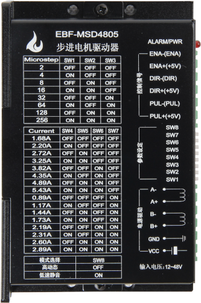

.. vim: syntax=rst

驱动器的分类
==========================================

有刷电机驱动器
~~~~~~~~~~~~~~~~~~~
直流有刷电机的驱动方法在之前已经详细的讲解过，这里就不再赘述了。其实本质上是使用H桥电路进行驱动，核心电路H桥加上一些必要的外围电路，
共同组成直流有刷电机的驱动器。H桥本身可作为集成电路使用，也可由分立元件构成。集成电路形式的H桥一般用于中小功率需求的应用，
或者是对电路面积有要求的场合。分立元件形式的H桥通常用于大功率或者超大功率需求的应用，主要由MOSFET或IGBT晶体管组成。
不过MCU的引脚是无法直接驱动MOS管等元件的，需要加上专用的MOS管驱动芯片。下图是一款经典的直流有刷电机驱动芯片L298N，其内部集成了两个H桥。

图8-1 经典直流有刷电机驱动芯片L298N

无刷电机驱动器
~~~~~~~~~~~~~~~~~~~
无刷电机也是使用H桥电路进行驱动的，只不过是电机的每一相都用一个半桥电路驱动，一个三相无刷电机总共需要三个半桥，而不像直流有刷电机驱动那种使用全桥电路。
跟直流有刷电机电机一样，无刷电机驱动器也分集成电路形式和分立元件形式，但因为无刷电机需要换相操作，就算是分立元件形式也只是把半桥电路给独立了出来。
类似于下图这样的，就是一款无刷电机驱动器。

图8-2 直流无刷电机驱动器

步进电机驱动器
~~~~~~~~~~~~~~~~~~~
步进电机不能直接接到直流或交流电源上工作，必须接入专用的驱动器才能正常使用。控制器将步进脉冲和方向信号发送到步进电机驱动器，
驱动器将控制器发来的步进脉冲信号转换为激励步进电动机旋转所需的功率信号。步进电机驱动器通常都带有细分功能，可以对步距角和电流进行细分，
从而实现更请准的控制和更低的噪声震动。

图8-3 步进电机驱动器

伺服电机驱动器
~~~~~~~~~~~~~~~~~~~
伺服电机驱动器（servo drives），是一种用来驱动和控制伺服电机的控制器，属于伺服系统的一部分。伺服电机驱动器接收和放大来自控制系统的命令信号，
并将电流传输给伺服电机，以产生与命令信号成比例的运动。这些命令信号通常对伺服电机的位置、速度和力矩等参数进行控制，实现高精度的传动系统定位。
附在伺服电机上的传感器将电机的实际状态反馈给伺服驱动器，驱动器将实际电机状态与来自控制系统的命令状态进行比较。然后驱动器改变传给电机的电压、
频率或脉冲宽度，以纠正任何偏离命令的状态。下图是一款伺服电器驱动器，在实际应用中通常把伺服电机和驱动器作为一个整体使用。

.. image:: ../media/sifu_motor.png
   :align: center
   :alt: 伺服电机驱动器和伺服电机

图8-4 伺服电机驱动器和伺服电机
