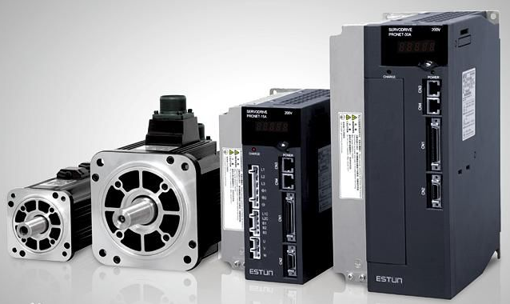

.. vim: syntax=rst

电机的分类介绍
==========================================

电机的简介
------------------------------------------
电机是一种可以在电能和机械能的之间相互转换的设备，其中发电机是将机械能转换为电能，
电动机是将电能转换为机械能。发电机的主要用于产生电能，用途单一，
但是电动机主要用于产生机械能，用途极其广泛。

电机的分类
------------------------------------------
电机种类多种多样，自然分类也是多种多样的，可以按照工作电源种类划分、按照结构和工作原理划分、
按照启动与运行方式划分、按照用途划分、按照运转速度划分等等。可以说是分类五花八门，但是在实际应用中，
工程师会根据电机的特性来分，例如：对速度要求高的会选择直流电机，对精度要求高的会选择步进电机等等；
接下来我们将会从众多类型中的电机中选择几个具有代表性、普遍性的常用电机。

直流电机
^^^^^^^^^^^^^^^^^^^^^
在直流电机中还分为普通的直流电机、直流减速电机，有刷和无刷，共分为：

- 直流有刷电机
- 直流有刷减速电机
- 直流无刷电机
- 直流无刷减速电机

这四种电机。
从字面意思上就可以想象的到，普通的直流电机和直流减速电机相差的只有“减速”，它们在构造上相差的是一个减速齿轮组。
普通的直流电机当空载时，电机的转速由电压决定;直流减速电机的转速由齿轮组和电压决定；
齿轮组的作用是，提供较低的转速，较大的力矩；同时不同的减速比会提供不同的转速和力矩。这样就大大提高了减速电机的使用率。

.. image:: ../media/low_speed.png
   :align: center
   :width: 3.5in
   :height: 3.5in

图 1-1 减速电机齿轮箱(图片来自网络)

接下来就是有刷与无刷的区别：有刷和无刷的字面意思是有无碳刷；有刷电机电机工作时需要线圈和换向器旋转，
磁钢和碳刷不转，线圈电流方向的交替变化是随电机转动的换相器和电刷来完成的。
无刷直流电动机是采用半导体开关器件来实现电子换向的，使用电子开关器件代替传统的接触式换向器和电刷。

图 1-2 左侧为有刷电机、右侧为无刷电机(图片来自网络)

步进电机
^^^^^^^^^^^^^^^^^^^^^
步进电机是一种可以将脉冲信号转换为角位移或线位移的开环控制电机，在空载低频的情况下，一个脉冲就是一步，
可以精准的控制旋转角度;步进电机按照构造方式分类，分为三类分别是反应式、永磁式和混合式。

.. list-table::
    :widths: 20 80
    :header-rows: 1

    * - 构造方式
      - 特性说明
    * - 反应式
      - 结构简单、成本低、步距角小，可达1.2°、但动态性能差、效率低、发热大，可靠性难保证。
    * - 永磁式
      - 其特点是动态性能好、输出力矩大，但这种电机精度差，步矩角大（一般为7.5°或15°）。
    * - 混合式
      - 其特点是输出力矩大、动态性能好，步距角小，但结构复杂、成本相对较高。

按照定子上绕组可分为二相、三相和五相等系列，但是最受欢迎的是两相混合式步进电机，约占97%上的市场份额，
基本上是占据了整个市场；所以后面也会主要针对两相混合式步进电机进行讲解。你一定听过42步进电机，
那么“42”指的是什么呢？下面这张图会告诉你“42”到底是什么意思。

图 1-3 42步进电机尺寸图

42步进电机是指步进的尺寸，混合式步进电机一般都是正方形，外框尺寸为42mm*42mm；
除42之外还有57步进电机，86步进电机，也都是因外框尺寸而得名的。

伺服电机
^^^^^^^^^^^^^^^^^^^^^
什么叫伺服电机？伺服电机长什么样子？“伺服”一词是来源于希腊语“奴隶”的意思，
那么伺服电机也可以理解为绝对服从控制信号指挥电机，所以伺服电机是指在伺服系统中被控制的电机。
如果单指一个电机的话，那只能算一个被控的机械元件，但是加上闭环控制系统就可以称之为伺服系统中的电机。

图 1-4 伺服电机图

伺服电机分为直流和交流伺服电动机两大类，其主要特点是，当信号电压为零时无自转现象，转速随着转矩的增加而匀速下降。

1. 直流伺服电机特性

- 机械特性 在输入的电枢电压保持不变时，电机的转速随电磁转矩变化而变化的规律
- 调节特性 直流电机在一定的电磁转矩（或负载转矩）下电机的稳态转速随电枢的控制电压变化而变化
- 动态特性 从原来的稳定状态到新的稳定状态，存在一个过渡过程，这就是直流电机的动态特性

2. 交流伺服电机特性

- 无电刷和换向器，因此工作可靠，对维护和保养要求低
- 定子绕组散热比较方便
- 惯量小，易于提高系统的快速性
- 适应于高速大力矩工作状态

舵机
^^^^^^^^^^^^^^^^^^^^^
舵机是一种常见的伺服电机，由小型直流电机、控制电路板、电位计和齿轮组构成，舵机的用途广泛；
舵机可按照信号类型划分、按照齿轮划分、按照用途划分；舵机分90°、180°、270°和360°舵机，其中180°的舵机最为常见。

图 1-5 模拟信号舵机（MG995）图

按照信号类型划分为 模拟信号舵机和数字信号舵机

- 模拟舵机：无MCU微控制器，电路为模拟电路，同样的舵机之间会有性能差异
- 数字舵机：有MCU控制器，一般内部采用算法优化，性能比模拟舵机好

按照齿轮划分为 金属齿轮舵机和塑料齿轮舵机

- 金属齿轮舵机：适用于大扭力和高速场合
- 塑料齿轮舵机：成本低适用于中低扭矩场合

