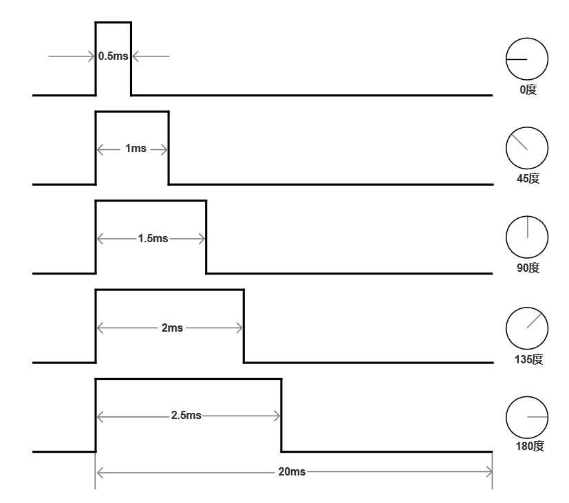

.. vim: syntax=rst

舵机控制
==========================================

舵机是一种位置（角度）伺服的驱动器，适用于那些需要角度不断变化并可以保持的控制系统。
舵机是一种俗称，其实是一种伺服马达。伺服马达内部包括了一个小型直流马达；一组变速齿轮组；
一个反馈可调电位器；及一块电子控制板。

舵机结构
------------------------------------------

舵机主要由以下几个部分组成：舵盘、减速齿轮组、比例电位器(位置反馈电位计)、直流电机(马达)、
控制电路板等。舵机内部结构见下图所示。

.. image:: ../media/steering_gear_diagram.jpg
   :align: center
   :alt: 舵机结构解析图

舵机工作原理
------------------------------------------

控制信号由接收机的通道进入信号调制芯片，获得直流偏置电压。它内部有一个基准电路，产生周期为
20ms，宽度为1.5ms的基准信号，将获得的直流偏置电压与电位器的电压比较，获得电压差输出。最后，
电压差的正负输出到电机驱动芯片决定电机的正反转。当电机转速一定时，通过级联减速齿轮带动
电位器旋转，使得电压差为0，电机停止转动。

.. image:: ../media/steering_gear_control_flow_chart.png
   :align: center
   :alt: 舵机内部控制流程

舵机控制原理
------------------------------------------

舵机的控制一般需要一个20ms的脉冲宽度调制（PWM），脉冲宽度部分一般为0.5ms-2.5ms范围
内的角度控制脉冲部分，总间隔为2ms。当脉冲宽度为1.5ms时，舵机旋转至中间角度，大于1.5ms时
舵机旋转角度增大，小于1.5ms时舵机旋转角度减小。舵机分90°、180°、270°和360°舵机，
以180°的舵机为例来看看脉冲宽度与角度的关系，见下图所示。

上图中脉冲宽度与舵机旋转角度为线线关系，其他舵机控制脉冲也类似，0.5ms对应0度，2.5ms对应最大
旋转角度，脉冲宽度与旋转角度也是线线关系。

舵机的输入有三根线，一般的中间的红色线为电源正极，咖啡色线的为电源负极，黄色色线为控制线号线。
如下图所示。

.. image:: ../media/steering_gear_line.png
   :align: center
   :alt: 舵机控制线

舵机几个参数介绍
------------------------------------------

舵机速度的单位是sec/60°，已就是舵机转过60°需要的时间，如果脉冲变化宽度大，变化速度快，舵机
就有可能在一次脉冲的变化过程中还没有转到目标角度时，脉冲就再次发生了变化，舵机的转动速度
一般有0.16sec/60°、0.12sec/60°等，0.16sec/60°就是舵机转动60°需要0.16秒的时间。舵机的速度
还有工作电压有关，在允许的电压范围内，电压越大速度越快，反之亦然。

舵机扭矩的单位是KG*CM，这是一个扭矩的单位，可以理解为在舵盘上距离舵机轴中心水平距离1CM处，
舵机能够带动的物体重量，如下图所示。

.. image:: ../media/steering_gear_torsion.jpg
   :align: center
   :alt: 舵机扭力单位示意图

通常说的55g舵机、9g舵机等，这里的55g和9g指的是舵机本身的重量。

舵机控制实现
-----------------------------------

硬件设计
^^^^^^^^^^^^^^^^^^^^^^^^^^^^^^^^^

**介绍电路和舵机**

软件设计
^^^^^^^^^^^^^^^^^^^^^^^^^^^^^^^^^

这里只讲解核心的部分代码，有些变量的设置，头文件的包含等并没有涉及到，完整的代码请
参考本章配套的工程。我们创建了四个文件：bsp_general_tim.c、bsp_general_tim.h文件用来
存定时器驱动和舵机控制程序及相关宏定义

编程要点
"""""""""""""""""

(1) 定时器 IO 配置

(2) 定时器时基结构体TIM_TimeBaseInitTypeDef配置

(3) 定时器输出比较结构体TIM_OCInitTypeDef配置

(4) 封装一个舵机角度控制函数

(5) 在main函数中编写按键舵机控制代码

.. code-block:: c
    :caption: 定时器复用功能引脚初始化
    :linenos:

    /*宏定义*/
    #define GENERAL_TIM                        	TIM2
    #define GENERAL_TIM_GPIO_AF                 GPIO_AF1_TIM2
    #define GENERAL_TIM_CLK_ENABLE()            __TIM2_CLK_ENABLE()

    #define PWM_CHANNEL_1                       TIM_CHANNEL_1
    //#define PWM_CHANNEL_2                       TIM_CHANNEL_2
    //#define PWM_CHANNEL_3                       TIM_CHANNEL_3
    //#define PWM_CHANNEL_4                       TIM_CHANNEL_4

    /* 累计 TIM_Period个后产生一个更新或者中断*/		
    /* 当定时器从0计数到PWM_PERIOD_COUNT，即为PWM_PERIOD_COUNT+1次，为一个定时周期 */
    #define PWM_PERIOD_COUNT     999

    /* 通用控制定时器时钟源TIMxCLK = HCLK/2=84MHz */
    /* 设定定时器频率为=TIMxCLK/(PWM_PRESCALER_COUNT+1) */
    #define PWM_PRESCALER_COUNT     1679

    /*PWM引脚*/
    #define GENERAL_TIM_CH1_GPIO_PORT           GPIOA
    #define GENERAL_TIM_CH1_PIN                 GPIO_PIN_15

    //#define GENERAL_TIM_CH2_GPIO_PORT           GPIOB
    //#define GENERAL_TIM_CH2_PIN                 GPIO_PIN_3

    //#define GENERAL_TIM_CH3_GPIO_PORT           GPIOB
    //#define GENERAL_TIM_CH3_PIN                 GPIO_PIN_10

    //#define GENERAL_TIM_CH4_GPIO_PORT           GPIOB
    //#define GENERAL_TIM_CH4_PIN                 GPIO_PIN_11

使用宏定义非常方便程序升级、移植。如果使用不同的定时器IO，修改这些宏即可。

定时器复用功能引脚初始化

.. code-block:: c
    :caption: 定时器复用功能引脚初始化
    :linenos:

    static void TIMx_GPIO_Config(void) 
    {
      GPIO_InitTypeDef GPIO_InitStruct;
      
      /* 定时器通道功能引脚端口时钟使能 */
      
      __HAL_RCC_GPIOA_CLK_ENABLE();
      
      /* 定时器通道1功能引脚IO初始化 */
      /*设置输出类型*/
      GPIO_InitStruct.Mode = GPIO_MODE_AF_PP;
      /*设置引脚速率 */ 
      GPIO_InitStruct.Speed = GPIO_SPEED_FREQ_HIGH;
      /*设置复用*/
      GPIO_InitStruct.Alternate = GENERAL_TIM_GPIO_AF;
      
      /*选择要控制的GPIO引脚*/	
      GPIO_InitStruct.Pin = GENERAL_TIM_CH1_PIN;
      /*调用库函数，使用上面配置的GPIO_InitStructure初始化GPIO*/
      HAL_GPIO_Init(GENERAL_TIM_CH1_GPIO_PORT, &GPIO_InitStruct);
    }

定时器通道引脚使用之前必须设定相关参数，这选择复用功能，并指定到对应的定时器。
使用GPIO之前都必须开启相应端口时钟。

.. code-block:: c
    :caption: 定时器模式配置
    :linenos:

    TIM_HandleTypeDef  TIM_TimeBaseStructure;
    static void TIM_PWMOUTPUT_Config(void)
    {
      TIM_OC_InitTypeDef  TIM_OCInitStructure;  
      
      /*使能定时器*/
      GENERAL_TIM_CLK_ENABLE();
      
      TIM_TimeBaseStructure.Instance = GENERAL_TIM;
      /* 累计 TIM_Period个后产生一个更新或者中断*/		
      //当定时器从0计数到PWM_PERIOD_COUNT，即为PWM_PERIOD_COUNT+1次，为一个定时周期
      TIM_TimeBaseStructure.Init.Period = PWM_PERIOD_COUNT;
      // 通用控制定时器时钟源TIMxCLK = HCLK/2=84MHz 
      // 设定定时器频率为=TIMxCLK/(PWM_PRESCALER_COUNT+1)
      TIM_TimeBaseStructure.Init.Prescaler = PWM_PRESCALER_COUNT;	
      
      /*计数方式*/
      TIM_TimeBaseStructure.Init.CounterMode = TIM_COUNTERMODE_UP;
      /*采样时钟分频*/
      TIM_TimeBaseStructure.Init.ClockDivision=TIM_CLOCKDIVISION_DIV1;
      /*初始化定时器*/
      HAL_TIM_Base_Init(&TIM_TimeBaseStructure);
      
      /*PWM模式配置*/
      TIM_OCInitStructure.OCMode = TIM_OCMODE_PWM1;      // 配置为PWM模式1
      TIM_OCInitStructure.Pulse = 0.5/20.0*PWM_PERIOD_COUNT;    // 默认占空比
      TIM_OCInitStructure.OCFastMode = TIM_OCFAST_DISABLE;
      /*当定时器计数值小于CCR1_Val时为高电平*/
      TIM_OCInitStructure.OCPolarity = TIM_OCPOLARITY_HIGH;	
      
      /*配置PWM通道*/
      HAL_TIM_PWM_ConfigChannel(&TIM_TimeBaseStructure, &TIM_OCInitStructure, PWM_CHANNEL_1);
      /*开始输出PWM*/
      HAL_TIM_PWM_Start(&TIM_TimeBaseStructure,PWM_CHANNEL_1);
    }

首先定义两个定时器初始化结构体，定时器模式配置函数主要就是对这两个结构体的成员进行初始化，然后通过相
应的初始化函数把这些参数写入定时器的寄存器中。有关结构体的成员介绍请参考定时器详解章节。

不同的定时器可能对应不同的APB总线，在使能定时器时钟是必须特别注意。通用控制定时器属于APB1，
定时器内部时钟是84MHz。

在时基结构体中我们设置定时器周期参数为PWM_PERIOD_COUNT（999），频率为50Hz，使用向上计数方式。
因为我们使用的是内部时钟，所以外部时钟采样分频成员不需要设置，重复计数器我们没用到，也不需要设置，
然后调用HAL_TIM_Base_Init初始化定时器。

在输出比较结构体中，设置输出模式为PWM1模式，通道输出高电平有效，设置默认脉宽为PWM_PERIOD_COUNT，
PWM_PERIOD_COUNT是我们定义的一个宏，用来指定占空比大小，实际上脉宽就是设定比较寄存器CCR的值，
用于跟计数器CNT的值比较。然后调用HAL_TIM_PWM_ConfigChannel初始化PWM输出。

最后使用HAL_TIM_PWM_Start函数让计数器开始计数和通道输出。

.. code-block:: c
    :caption: 设置定时器占空比
    :linenos:

    void set_steering_gear_dutyfactor(uint16_t dutyfactor)
    {
      #if 1
      {
        /* 对超过范围的占空比进行边界处理 */
        dutyfactor = 0.5/20.0*PWM_PERIOD_COUNT > dutyfactor ? 0.5/20.0*PWM_PERIOD_COUNT : dutyfactor;
        dutyfactor = 2.5/20.0*PWM_PERIOD_COUNT < dutyfactor ? 2.5/20.0*PWM_PERIOD_COUNT : dutyfactor;
      }
      #endif
      
      TIM2_SetPWM_pulse(PWM_CHANNEL_1, dutyfactor);
    }

封装一个舵机占空比设置函数，接收一个参数用于设置PWM的占空比，并对输入的参数进行合法性检查，将脉冲宽度限制
在0.5~2.5ms之间。

.. code-block:: c
    :caption: 设置舵机角度
    :linenos:

    void set_steering_gear_angle(uint16_t angle_temp)
    {
      angle_temp = (0.5 + angle_temp / 180.0 * (2.5 - 0.5)) / 20.0 * PWM_PERIOD_COUNT;    // 计算角度对应的占空比
      
      set_steering_gear_dutyfactor(angle_temp);    // 设置占空比
    }

该函数用于设置舵机角度，传入角度值然后计算占空比，最后条用set_steering_gear_dutyfactor()来设置占空比。

.. code-block:: c
    :caption: 串口控制
    :linenos:

    void deal_serial_data(void)
    {
      int angle_temp=0;
      
      //接收到正确的指令才为1
      char okCmd = 0;

      //检查是否接收到指令
      if(receive_cmd == 1)
      {
        if(UART_RxBuffer[0] == 'a' || UART_RxBuffer[0] == 'A')
        {
          //设置速度
          if(UART_RxBuffer[1] == ' ')
          {
            angle_temp = atoi((char const *)UART_RxBuffer+2);
            if(angle_temp>=0 && angle_temp <= 180)
            {
              printf("\n\r角度: %d\n\r", angle_temp);
              angle_temp = (0.5 + angle_temp / 180.0 * (2.5 - 0.5)) / 20.0 * PWM_PERIOD_COUNT;
              ChannelPulse = angle_temp;    // 同步按键控制的比较值
              set_steering_gear_angle(angle_temp);

              okCmd = 1;
            }
          }
        }
        else if(UART_RxBuffer[0] == '?')
        {
          //打印帮助命令
          show_help();
          okCmd = 1;
        }
        //如果指令有无则打印帮助命令
        if(okCmd != 1)
        {
          printf("\n\r 输入有误，请重新输入...\n\r");
          show_help();
        }

        //清空串口接收缓冲数组
        receive_cmd = 0;
        uart_FlushRxBuffer();

      }
    }

以上为串口接收处理函数，接收正确的指令后将字符串计算出正确的角度值，判断角度值是否是在有效范围内，
同步按键调节的占空比防止按钮调节时转动范围过大。

.. code-block:: c
    :caption: main函数
    :linenos:

    int main(void) 
    {
      /* HAL 库初始化 */
      HAL_Init();
      
      /* 初始化系统时钟为168MHz */
      SystemClock_Config();
      
      /* 初始化按键GPIO */
      Key_GPIO_Config();
      
      /* 初始化串口 */
      DEBUG_USART_Config();

      /* 通用定时器初始化并配置PWM输出功能 */
      TIMx_Configuration();
      
      printf("野火舵机控制实验\r\n");

      show_help();
      
      while(1)
      {
        /* 处理数据 */
        if (Key_Scan(KEY1_GPIO_PORT, KEY1_PIN) == KEY_ON)
        {
          ChannelPulse -= 10;    // 减少占空比
          
          ChannelPulse = 0.5/20.0*PWM_PERIOD_COUNT > ChannelPulse ? 0.5/20.0*PWM_PERIOD_COUNT : ChannelPulse;    // 检查占空比的合法性
          
          set_steering_gear_dutyfactor(ChannelPulse);    // 设置占空比
        }
        
        /* 处理数据 */
        if (Key_Scan(KEY2_GPIO_PORT, KEY2_PIN) == KEY_ON)
        {
          ChannelPulse += 10;    // 增加占空比
          
          ChannelPulse = (2.5/20.0*PWM_PERIOD_COUNT) < ChannelPulse ? (2.5/20.0*PWM_PERIOD_COUNT) : ChannelPulse;    // 检查占空比的合法性
          
          set_steering_gear_dutyfactor(ChannelPulse);    // 设置占空比
        }
        
        /* 串口处理 */
        deal_serial_data();
      }
    }

初始化串口、定时器输出PWM和按键等外设，最后在循环里面处理按键和串口接收的数据。当KEY1按下后，
减少占空比，并检查占空比是否在有效范围内，然后设置占空比，当KEY2按下后，增加占空比，并检查占空比
是否在有效范围内，然后设置占空比。最后调用deal_serial_data()来处理串口接收的函数。

下载验证
^^^^^^^^^^^^^^^^^^^^^^^^^^^^^^^^^

如果有条件的话，这里我们先不连接舵机，先通过示波器连接到开发板的PWM输出引脚上，通过示波器来观察PWM
的变化情况：

- 使用DAP连接开发板到电脑；
- 使用示波器的CH1连接到PA15，注意示波器要与开发板供地；
- 给开发板供电，编译下载配套源码，复位开发板。

上电后我们通过示波器可以观察到CH1通道的PWM波形，当按下KEY1或者KEY2时，可以改变CH1通道的占空比，
如下图所示。

.. image:: ../media/steering_gear_waveform.jpg
   :align: center
   :alt: 示波器观察PWM输出情况

经过验证可以知道我们的PWM脉冲宽度是在0.5~2.5ms之间变化。这正是我们想要的结果，这说明我们的代码是
正确的，这时我们就可以接上舵机来测试了。

通过按键KEY1和KEY2来调整舵机角度，或者通过串口来控制舵机角度。