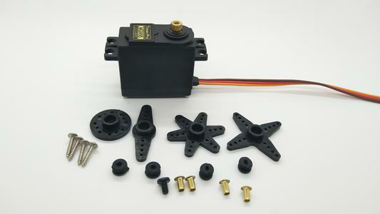
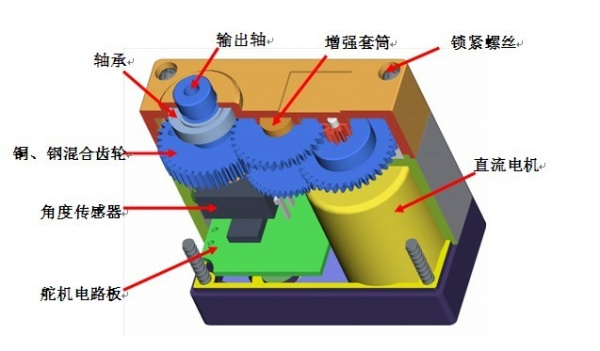
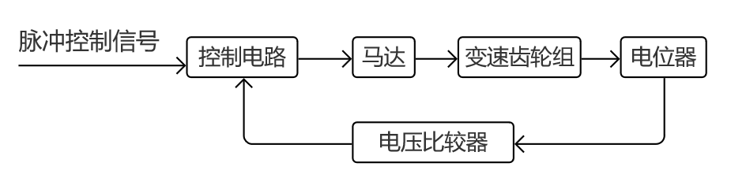
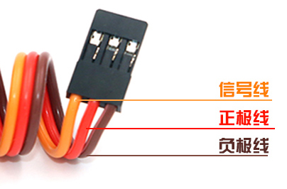
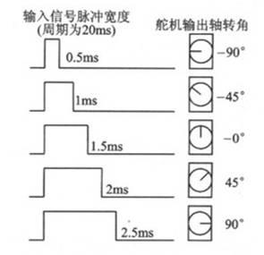
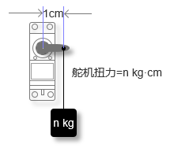
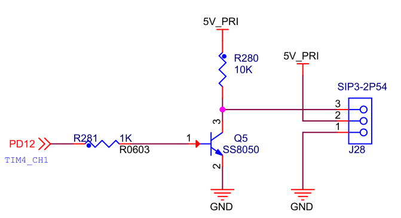
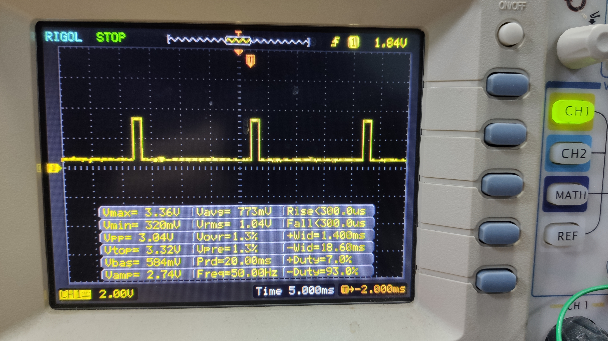

.. vim: syntax=rst

舵机控制
==========================================
有一种电机可以在程序的控制下，在一定范围内连续改变输出轴角度并且可以保持住。
这种电机最早被用在航模和船模等遥控模型中，控制各种舵面的转动，这就是舵机。
现在舵机除了运用在遥控模型中，也大量的运用在各种机器人、机械臂的关节以及智能小车的转向机构中。
下图就是一种标准舵机的外形。

舵机分类
------------------------------------------
1. 按照舵机的控制电路可以分为：模拟舵机和数字舵机。模拟舵机和数字舵机的机械结构可以说是完全相同的，
   模拟舵机的控制电路为纯模拟电路，需要一直发送目标信号，才能转到指定的位置，响应速度较慢，无反应区较大；
   数字舵机内部控制电路则加上了微控制器，只需要发送一次目标信号，即可到达指定位置，速度比模拟舵机更快，无反应区也更小。
#. 按照使用对象的不同，可以分为：航模舵机、车模舵机、船模舵机和机器人舵机。航模舵机一般要求速度快、精度高，
   而车模和船模用的舵机一般要求具有大扭矩和防水性好。
#. 按照内部机械材质，又可分成：塑料齿舵机和金属齿舵机。塑料齿舵机内部的传动齿轮是塑料的，重量轻价格便宜，
   但是扭矩一般较小无法做大；金属齿舵机的扭矩更大，舵机更结实耐用，但是相比塑料齿更重也更贵。
#. 按照外部接口和舵机的控制方式，又可分为：PWM舵机和串行总线舵机。

舵机结构
------------------------------------------

舵机主要由以下几个部分组成：外壳、舵盘、直流电机、减速齿轮组、角度传感器、控制驱动电路和接口线缆等。常见的舵机内部结构如下图所示。

其中角度传感器负责舵机的位置反馈，直接装在舵机的主输出轴上，将轴旋转后产生的角度变化变成电压信号发回控制电路，当前轴角度；
控制驱动电路用来接收外部接口传来的信号和角度传感器反馈的电压值，以及驱动直流电机旋转；
减速齿轮组则是降低直流电机的转速并且放大扭矩，这一部分就跟前面介绍的直流减速电机差不多了。

市面上常见的廉价舵机通常采用小型的直流有刷电机和塑料材质减速齿轮组，传感器一般使用电位器返回模拟电压。而一些稍贵的则会使用金属齿轮组。
一些高端的舵机内部甚至会采用无刷电机和磁电编码器。

舵机工作原理
------------------------------------------

模拟舵机和数字舵机内部电路不同，所以原理上稍有差别，这里以模拟舵机进行讲解。模拟舵机内部的控制驱动电路板从外界接收控制信号，
经过处理后变为一个直流偏置电压，在控制板内部有一个基准电压，这个基准电压由电位器产生并反馈到控制板。将外部获得的直流偏置电压与电位器的电压进行比较获得电压差，
并输出到电机驱动芯片驱动电机，电压差的正负决定电机的正反转，大小决定旋转的角度，电压差为0时，电机停止转动。大致原理框图如下图所示。

从图中可以看到，舵机内部是闭环控制的，所以这一类电机实际上是一种位置（角度）伺服的简化版伺服电机，将工业伺服电机的三闭环控制简化成了只有一个位置闭环。
舵机这个名字是国内起的一种俗称，本质上属于伺服电机，它的英文就直接叫Servo，或者RC Servo。

舵机控制原理
------------------------------------------

舵机的输入有三根线，一般的中间的红色线为电源正极，咖啡色线的为电源负极，黄色色线为控制线号线。
如下图所示。

舵机的控制通常采用PWM信号，例如需要一个周期为20ms的脉冲宽度调制（PWM），
脉冲宽度部分一般为0.5ms-2.5ms范围内的角度控制脉冲部分，总间隔为2ms。
当脉冲宽度为1.5ms时，舵机旋转至中间角度，大于1.5ms时
舵机旋转角度增大，小于1.5ms时舵机旋转角度减小。舵机分90°、180°、270°和360°舵机，
以180°的舵机为例来看看脉冲宽度与角度的关系，见下图所示。

上图中脉冲宽度与舵机旋转角度为线性关系，其他舵机控制脉冲也类似，0.5ms对应0度，2.5ms对应最大
旋转角度，脉冲宽度与旋转角度也是线性关系。

舵机几个参数介绍
------------------------------------------

舵机速度的单位是sec/60°，就是舵机转过60°需要的时间，如果控制脉冲变化宽度大，变化速度快，
舵机就有可能在一次脉冲的变化过程中还没有转到目标角度时，而脉冲就再次发生了变化，
舵机的转动速度一般有0.16sec/60°、0.12sec/60°等，0.16sec/60°就是舵机转动60°需要0.16秒的时间。
舵机的速度还有工作电压有关，在允许的电压范围内，电压越大速度越快，反之亦然。

舵机扭矩的单位是KG*CM，这是一个扭矩的单位，可以理解为在舵盘上距离舵机轴中心水平距离1CM处，
舵机能够带动的物体重量，如下图所示。

通常说的55g舵机、9g舵机等，这里的55g和9g指的是舵机本身的重量。

舵机基本控制实验
-----------------------------------

硬件设计
^^^^^^^^^^^^^^^^^^^^^^^^^^^^^^^^^

本实验使用MG996R舵机来演示，这款舵机的规格如下。

- 尺寸：40.8*20*38mm
- 重量：55g
- 速度：4.8V@ 0.20sec/60°——6.0V@ 0.19sec/60°
- 扭力：4.8V@ 13kg-cm——6.0V@ 15kg-cm
- 电压：4.8V-7.2V
- 空载工作电流：120mA
- 堵转工作电流：1450mA
- 响应脉宽时间≤5usec
- 角度偏差：回中误差0度，左右各45°误差≤3°。
- 齿轮：5级金属齿轮组
- 连接线长度：300mm 
- 接口规格：JR/FP通用。

电机开发板上预留了两个舵机接口，本实验只使用其中一个，舵机由TIM4的通道1控制，接口原理图如下图所示。

软件设计
^^^^^^^^^^^^^^^^^^^^^^^^^^^^^^^^^

这里只讲解核心的部分代码，有些变量的设置，头文件的包含等并没有涉及到，完整的代码请
参考本章配套的工程。我们创建了四个文件：bsp_general_tim.c、bsp_general_tim.h文件用来
存定时器驱动和舵机控制程序及相关宏定义

编程要点
"""""""""""""""""

(1) 定时器 IO 配置

(2) 定时器时基结构体TIM_TimeBaseInitTypeDef配置

(3) 定时器输出比较结构体TIM_OCInitTypeDef配置

(4) 封装一个舵机角度控制函数

(5) 在main函数中编写按键舵机控制代码

.. code-block:: c
    :caption: 定时器复用功能引脚初始化
    :linenos:

    /*宏定义*/
    #define GENERAL_TIM                        	TIM4
    #define GENERAL_TIM_GPIO_AF                 GPIO_AF2_TIM4
    #define GENERAL_TIM_CLK_ENABLE()  					__TIM4_CLK_ENABLE()

    #define PWM_CHANNEL_1                       TIM_CHANNEL_1
    //#define PWM_CHANNEL_2                       TIM_CHANNEL_2
    //#define PWM_CHANNEL_3                       TIM_CHANNEL_3
    //#define PWM_CHANNEL_4                       TIM_CHANNEL_4

    /* 累计 TIM_Period个后产生一个更新或者中断*/		
    /* 当定时器从0计数到PWM_PERIOD_COUNT，即为PWM_PERIOD_COUNT+1次，为一个定时周期 */
    #define PWM_PERIOD_COUNT     999

    /* 通用控制定时器时钟源TIMxCLK = HCLK/2=84MHz */
    /* 设定定时器频率为=TIMxCLK/(PWM_PRESCALER_COUNT+1) */
    #define PWM_PRESCALER_COUNT     1679

    /*PWM引脚*/
    #define GENERAL_TIM_CH1_GPIO_PORT           GPIOD
    #define GENERAL_TIM_CH1_PIN                 GPIO_PIN_12

    //#define GENERAL_TIM_CH2_GPIO_PORT           GPIOD
    //#define GENERAL_TIM_CH2_PIN                 GPIO_PIN_13

使用宏定义非常方便程序升级、移植。如果使用不同的定时器IO，修改这些宏即可。

定时器复用功能引脚初始化

.. code-block:: c
    :caption: 定时器复用功能引脚初始化
    :linenos:

    static void TIMx_GPIO_Config(void) 
    {
      GPIO_InitTypeDef GPIO_InitStruct;
      
      /* 定时器通道功能引脚端口时钟使能 */
      
      __HAL_RCC_GPIOA_CLK_ENABLE();
      
      /* 定时器通道1功能引脚IO初始化 */
      /*设置输出类型*/
      GPIO_InitStruct.Mode = GPIO_MODE_AF_PP;
      /*设置引脚速率 */ 
      GPIO_InitStruct.Speed = GPIO_SPEED_FREQ_HIGH;
      /*设置复用*/
      GPIO_InitStruct.Alternate = GENERAL_TIM_GPIO_AF;
      
      /*选择要控制的GPIO引脚*/	
      GPIO_InitStruct.Pin = GENERAL_TIM_CH1_PIN;
      /*调用库函数，使用上面配置的GPIO_InitStructure初始化GPIO*/
      HAL_GPIO_Init(GENERAL_TIM_CH1_GPIO_PORT, &GPIO_InitStruct);
    }

定时器通道引脚使用之前必须设定相关参数，这选择复用功能，并指定到对应的定时器。
使用GPIO之前都必须开启相应端口时钟。

.. code-block:: c
    :caption: 定时器模式配置
    :linenos:

    TIM_HandleTypeDef  TIM_TimeBaseStructure;
    static void TIM_PWMOUTPUT_Config(void)
    {
      TIM_OC_InitTypeDef  TIM_OCInitStructure;  
      
      /*使能定时器*/
      GENERAL_TIM_CLK_ENABLE();
      
      TIM_TimeBaseStructure.Instance = GENERAL_TIM;
      /* 累计 TIM_Period个后产生一个更新或者中断*/		
      //当定时器从0计数到PWM_PERIOD_COUNT，即为PWM_PERIOD_COUNT+1次，为一个定时周期
      TIM_TimeBaseStructure.Init.Period = PWM_PERIOD_COUNT;
      // 通用控制定时器时钟源TIMxCLK = HCLK/2=84MHz 
      // 设定定时器频率为=TIMxCLK/(PWM_PRESCALER_COUNT+1)
      TIM_TimeBaseStructure.Init.Prescaler = PWM_PRESCALER_COUNT;	
      
      /*计数方式*/
      TIM_TimeBaseStructure.Init.CounterMode = TIM_COUNTERMODE_UP;
      /*采样时钟分频*/
      TIM_TimeBaseStructure.Init.ClockDivision=TIM_CLOCKDIVISION_DIV1;
      /*初始化定时器*/
      HAL_TIM_Base_Init(&TIM_TimeBaseStructure);
      
      /*PWM模式配置*/
      TIM_OCInitStructure.OCMode = TIM_OCMODE_PWM1;      // 配置为PWM模式1
      TIM_OCInitStructure.Pulse = 0.5/20.0*PWM_PERIOD_COUNT;    // 默认占空比
      TIM_OCInitStructure.OCFastMode = TIM_OCFAST_DISABLE;
      /*当定时器计数值小于CCR1_Val时为高电平*/
      TIM_OCInitStructure.OCPolarity = TIM_OCPOLARITY_HIGH;	
      
      /*配置PWM通道*/
      HAL_TIM_PWM_ConfigChannel(&TIM_TimeBaseStructure, &TIM_OCInitStructure, PWM_CHANNEL_1);
      /*开始输出PWM*/
      HAL_TIM_PWM_Start(&TIM_TimeBaseStructure,PWM_CHANNEL_1);
    }

首先定义两个定时器初始化结构体，定时器模式配置函数主要就是对这两个结构体的成员进行初始化，然后通过相
应的初始化函数把这些参数写入定时器的寄存器中。有关结构体的成员介绍请参考定时器详解章节。

不同的定时器可能对应不同的APB总线，在使能定时器时钟是必须特别注意。通用控制定时器属于APB1，
定时器内部时钟是84MHz。

在时基结构体中我们设置定时器周期参数为PWM_PERIOD_COUNT（999），频率为50Hz，使用向上计数方式。
因为我们使用的是内部时钟，所以外部时钟采样分频成员不需要设置，重复计数器我们没用到，也不需要设置，
然后调用HAL_TIM_Base_Init初始化定时器。

在输出比较结构体中，设置输出模式为PWM1模式，通道输出高电平有效，设置默认脉宽为PWM_PERIOD_COUNT，
PWM_PERIOD_COUNT是我们定义的一个宏，用来指定占空比大小，实际上脉宽就是设定比较寄存器CCR的值，
用于跟计数器CNT的值比较。然后调用HAL_TIM_PWM_ConfigChannel初始化PWM输出。

最后使用HAL_TIM_PWM_Start函数让计数器开始计数和通道输出。

.. code-block:: c
    :caption: 设置定时器占空比
    :linenos:

    void set_steering_gear_dutyfactor(uint16_t dutyfactor)
    {
      #if 1
      {
        /* 对超过范围的占空比进行边界处理 */
        dutyfactor = 0.5/20.0*PWM_PERIOD_COUNT > dutyfactor ? 0.5/20.0*PWM_PERIOD_COUNT : dutyfactor;
        dutyfactor = 2.5/20.0*PWM_PERIOD_COUNT < dutyfactor ? 2.5/20.0*PWM_PERIOD_COUNT : dutyfactor;
      }
      #endif
      
      TIM2_SetPWM_pulse(PWM_CHANNEL_1, dutyfactor);
    }

封装一个舵机占空比设置函数，接收一个参数用于设置PWM的占空比，并对输入的参数进行合法性检查，将脉冲宽度限制
在0.5~2.5ms之间。

.. code-block:: c
    :caption: 设置舵机角度
    :linenos:

    void set_steering_gear_angle(uint16_t angle_temp)
    {
      angle_temp = (0.5 + angle_temp / 180.0 * (2.5 - 0.5)) / 20.0 * PWM_PERIOD_COUNT;    // 计算角度对应的占空比
      
      set_steering_gear_dutyfactor(angle_temp);    // 设置占空比
    }

该函数用于设置舵机角度，传入角度值然后计算占空比，最后条用set_steering_gear_dutyfactor()来设置占空比。

.. code-block:: c
    :caption: 串口控制
    :linenos:

    void deal_serial_data(void)
    {
      int angle_temp=0;
      
      //接收到正确的指令才为1
      char okCmd = 0;

      //检查是否接收到指令
      if(receive_cmd == 1)
      {
        if(UART_RxBuffer[0] == 'a' || UART_RxBuffer[0] == 'A')
        {
          //设置速度
          if(UART_RxBuffer[1] == ' ')
          {
            angle_temp = atoi((char const *)UART_RxBuffer+2);
            if(angle_temp>=0 && angle_temp <= 180)
            {
              printf("\n\r角度: %d\n\r", angle_temp);
              angle_temp = (0.5 + angle_temp / 180.0 * (2.5 - 0.5)) / 20.0 * PWM_PERIOD_COUNT;
              ChannelPulse = angle_temp;    // 同步按键控制的比较值
              set_steering_gear_angle(angle_temp);

              okCmd = 1;
            }
          }
        }
        else if(UART_RxBuffer[0] == '?')
        {
          //打印帮助命令
          show_help();
          okCmd = 1;
        }
        //如果指令有无则打印帮助命令
        if(okCmd != 1)
        {
          printf("\n\r 输入有误，请重新输入...\n\r");
          show_help();
        }

        //清空串口接收缓冲数组
        receive_cmd = 0;
        uart_FlushRxBuffer();

      }
    }

以上为串口接收处理函数，接收正确的指令后将字符串计算出正确的角度值，判断角度值是否是在有效范围内，
同步按键调节的占空比防止按钮调节时转动范围过大。

.. code-block:: c
    :caption: main函数
    :linenos:

    int main(void) 
    {
      /* HAL 库初始化 */
      HAL_Init();
      
      /* 初始化系统时钟为168MHz */
      SystemClock_Config();
      
      /* 初始化按键GPIO */
      Key_GPIO_Config();
      
      /* 初始化串口 */
      DEBUG_USART_Config();

      /* 通用定时器初始化并配置PWM输出功能 */
      TIMx_Configuration();
      
      printf("野火舵机控制实验\r\n");

      show_help();
      
      while(1)
      {
        /* 处理数据 */
        if (Key_Scan(KEY1_GPIO_PORT, KEY1_PIN) == KEY_ON)
        {
          ChannelPulse -= 10;    // 减少占空比
          
          ChannelPulse = 0.5/20.0*PWM_PERIOD_COUNT > ChannelPulse ? 0.5/20.0*PWM_PERIOD_COUNT : ChannelPulse;    // 检查占空比的合法性
          
          set_steering_gear_dutyfactor(ChannelPulse);    // 设置占空比
        }
        
        /* 处理数据 */
        if (Key_Scan(KEY2_GPIO_PORT, KEY2_PIN) == KEY_ON)
        {
          ChannelPulse += 10;    // 增加占空比
          
          ChannelPulse = (2.5/20.0*PWM_PERIOD_COUNT) < ChannelPulse ? (2.5/20.0*PWM_PERIOD_COUNT) : ChannelPulse;    // 检查占空比的合法性
          
          set_steering_gear_dutyfactor(ChannelPulse);    // 设置占空比
        }
        
        /* 串口处理 */
        deal_serial_data();
      }
    }

初始化串口、定时器输出PWM和按键等外设，最后在循环里面处理按键和串口接收的数据。当KEY1按下后，
减少占空比，并检查占空比是否在有效范围内，然后设置占空比，当KEY2按下后，增加占空比，并检查占空比
是否在有效范围内，然后设置占空比。最后调用deal_serial_data()来处理串口接收的函数。

下载验证
^^^^^^^^^^^^^^^^^^^^^^^^^^^^^^^^^

如果有条件的话，这里我们先不连接舵机，先通过示波器连接到开发板的PWM输出引脚上，通过示波器来观察PWM
的变化情况：

- 使用DAP连接开发板到电脑；
- 使用示波器的CH1连接到PA15，注意示波器要与开发板共地；
- 给开发板供电，编译下载配套源码，复位开发板。

上电后我们通过示波器可以观察到CH1通道的PWM波形，当按下KEY1或者KEY2时，可以改变CH1通道的占空比，
如下图所示。

经过验证可以知道我们的PWM脉冲宽度是在0.5~2.5ms之间变化。这正是我们想要的结果，这说明我们的代码是
正确的，这时我们就可以接上舵机来测试了。

通过按键KEY1和KEY2来调整舵机角度，或者通过串口来控制舵机角度。