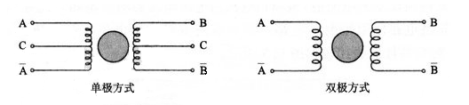

.. vim: syntax=rst

步进电机
==========================================

介绍
------------------

步进电机又称为脉冲电机,基于最基本的电磁铁原理,它是一种可以自由回转的电磁铁,其动作原理是依靠气隙磁导的变化来产生电磁转矩。
其原始模型是起源于年至年间。年前后开始以控制为目的的尝试,应用于氢弧灯的电极输送机构中。这被认为是最初的步进电机。
二十世纪初,在电话自动交换机中广泛使用了步进电机。由于西方资本主义列强争夺殖民地,步进电机在缺乏交流电源的船舶和飞机等独立系
统中得到了广泛的使用。二十世纪五十年代后期晶体管的发明也逐渐应用在步进电机上,对于数字化的控制变得更为容易。到了八十年代后,
由于廉价的微型计算机以多功能的姿态出现,步进电机的控制方式更加灵活多样。

步进电机相对于其它控制用途电机的最大区别是,它接收数字控制信号电脉冲信号并转化成与之相对应的角位移或直线位移,它本身就是一个
完成数字模式转化的执行元件。而且它可开环位置控制,输入一个脉冲信号就得到一个规定的位置增量,这样的所谓增量位置控制系统与传统
的直流控制系统相比,其成本明显减低,几乎不必进行系统调整。步进电机的角位移量与输入的脉冲个数严格成正比,而且在时间上与脉冲同步。
因而只要控制脉冲的数量、频率和电机绕组的相序,即可获得所需的转角、速度和方向。

由于步进电机是一个把电脉冲转换成离散的机械运动的装置,具有很好的数据控制特性,因此,计算机成为步进电机的理想驱动源,随着微电子
和计算机技术的发展,软硬件结合的控制方式成为了主流,即通过程序产生控制脉冲,驱动硬件电路。单片机通过软件来控制步进电机,更好地
挖掘出了电机的潜力。因此,用单片机控制步进电机已经成为了一种必然的趋势,也符合数字化的时代趋。

工作原理
------------------

通常电机的转子为永磁体，当电流流过定子绕组时，定子绕组产生一矢量磁场。该磁场会带动转子旋转一角度，使得转子的一对磁场方向与定
子的磁场方向一致。当定子的矢量磁场旋转一个角度。转子也随着该磁场转一个角度。每输入一个电脉冲，电动机转动一个角度前进一步。
它输出的角位移与输入的脉冲数成正比、转速与脉冲频率成正比。改变绕组通电的顺序，电机就会反转。所以可用控制脉冲数量、频率及电动
机各相绕组的通电顺序来控制步进电机的转动。

步进电机又分为单极性的步进电机和双极性的步进电机；

技术指标术语
------------------

主要特点
------------------

.. 一级标题
.. ==============================

.. 二级标题
.. ------------------

.. 三级标题
.. ^^^^^^^^^^^^^^^^^^^^^

.. 四级标题
.. """""""""""""""""

.. 五级标题
.. *****************

