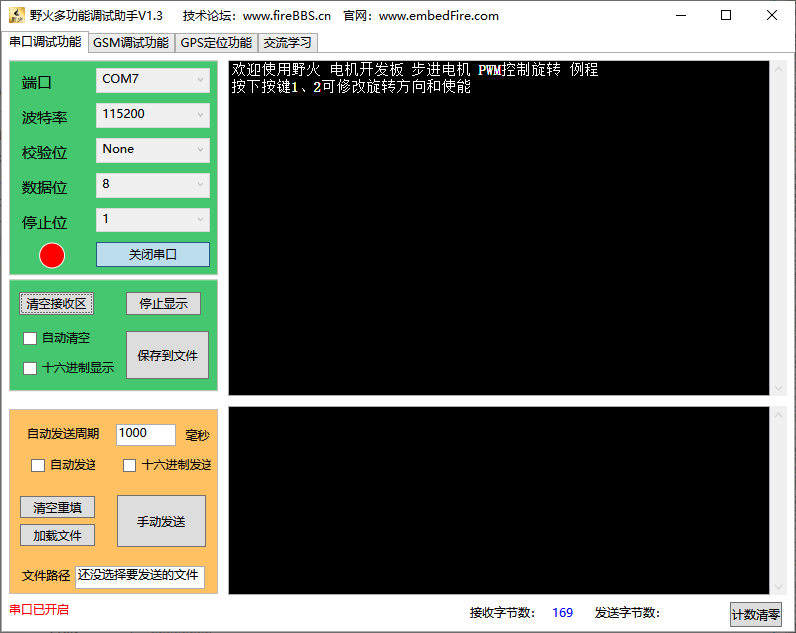

.. vim: syntax=rst

步进电机
==========================================

介绍
------------------

步进电机又称为脉冲电机，基于最基本的电磁铁原理，它是一种可以自由回转的电磁铁，其动作原理是依靠气隙磁导的变化来产生电磁转矩。
由于步进电机是一个可以把电脉冲转换成机械运动的装置，具有很好的数据控制特性，因此，计算机成为步进电机的理想驱动源，
随着微电子和计算机技术的发展，软硬件结合的控制方式成为了主流，即通过程序产生控制脉冲，驱动硬件电路。单片机通过软件来控制步进电机，
更好地挖掘出了电机的潜力。在不超载的情况下电机的转速和停止位置只取决于脉冲信号的频率和数量；
并且步进电机的脉冲与步进旋转的角度成正比，脉冲的频率与步进的转速成正比，所以可以很好的从源头控制信号的输出；
且步进电机只有周期性的误差，使得在速度、位置等控制领域用步进电机来控制变的非常的简单。话虽如此，想要玩转步进也不是件容易的事情。

.. image:: ../media/step_motor_pic.png
   :align: center

混合式步进电机拆解图

工作原理
------------------

通常步进电机的转子为永磁体，当电流流过定子绕组时，定子绕组产生一矢量磁场。磁场会带动转子旋转一定的角度，
使得转子的一对磁场方向与定子的磁场方向一致。当定子的矢量磁场旋转一个角度。转子也随着该磁场转步距角。
每输入一个电脉冲，电动机转动一个角度前进一步。它输出的角位移与输入的脉冲数成正比、转速与脉冲频率成正比。
改变绕组通电的顺序，电机就会反转。所以可用控制脉冲数量、频率及电动机各相绕组的通电顺序来控制步进电机的转动。具体看下图：

.. image:: ../media/step_dingzi.png
   :align: center

步进电机横截图

步进电机极性区分
^^^^^^^^^^^^^^^^^^^^^

步进电机又分为单极性的步进电机和双极性的步进电机；具体简易图如下图所示：

其中左侧为单极性步进电机，右侧为双极性的步进电机，从上图中不难看出区别是什么。单双极性是指一个步进电机里面有几种电流的流向，
左侧的五线四相步进电机就是单极性的步进电机，图中的红色箭头为电流的走向，四根线的电流走向汇总到公共线，所以称之为单极性电机；
但是右侧则不同，电机中有两个电流的回路，两个电流的回路自然就是双极性，所以称之为双极性电机。

**单极性绕组**

单极性步进电机使用的是单极性绕组。其一个电极上有两个绕组，这种联接方式为当一个绕组通电时，产生一个北极磁场；
另一个绕组通电，则产生一个南极磁场。因为从驱动器到线圈的电流不会反向，所以可称其为单极绕组。

**双极性绕组**

双极性步进电机使用的是双极性绕组。每相用一个绕组，通过将绕组中电流反向，电磁极性被反向。
典型的两相双极驱动的输出步骤在电气原理图和下图中的步进顺序中进一步阐述。
按图所示，转换只利用绕组简单地改变电流的方向，就能改变该组的极性。

.. image:: ../media/磁场极性.png
   :align: center

永磁步进电机包括一个永磁转子、线圈绕组和导磁定子，只要将线圈通电根据电磁铁的原理就会产生磁场，分为南北极，见上图所示；
通过改变步进电机定子的磁场，转子就会因磁场的变化而发生转动，同理，依次改变通电的顺序就可以使得电机转动起来。

双极性步进电机驱动原理
^^^^^^^^^^^^^^^^^^^^^^^^^^^^^^^^^^^^^^^^^^

下图是一个双极性的步进电机整步，步进顺序。
在第一步中：将A相通电，根据电磁铁原理，产生磁性，并且因异性相吸，所以磁场将转子固定在第一步的位置；
第二步：当A相关闭，B相通电时，转子会旋转90°；
第三步：B相关闭、A相通电，但极性与第1步相反，这促使转子再次旋转90°。
在第四步中：A相关闭、B相通电，极性与第2步相反。重复该顺序促使转子按90°的步距角顺时针旋转。

上图中显示的步进顺序是单相激励步进，也可以理解为每次通电产生磁性的相只有一个，要么A相，要么B相；
但是更常用的是双相激励，但是在转换时，一次只能换相一次，具体详见下图：

上图是两相同时通电的旋转顺序，与单相激励不同的是，单相通电后被固定在了与定子正对着的绕组极性，
但是双相同时激励时转子却被固定在两个绕阻的极性中间；此时通电顺序就变成了AB相同时通电即可。

在双相激励的过程中，也可以在装换相位时加一个关闭相位的状态而产生走半步的现象，这将步进电机的整个步距角一分为二，
例如，一个90°的步进电机将每半步移动45°，具体见下图。

1. A相通电，B相不通电
#. A、B相全部通电，且电流相同，产生相同磁性
#. B相通电，A断电
#. B相通电，A相通电，且电流相等，产生相同磁性

#. A相通电，B断电
#. A、B相全部通电，且电流相同，产生相同磁性
#. B相通电，A断电
#. B相通电，A相通电，且电流相等，产生相同磁性

其中1~4步与5~8步的电流方向相反（电流相反，电磁的极性就相反）这样就产生了顺时针旋转，同理逆时针是
将通电顺序反过来即可。

单极性步进电机驱动原理
^^^^^^^^^^^^^^^^^^^^^^^^^^^^^^^^^^^^^^^^^^
单极性与双极性步进电机驱动类似，都可以分为整步与半步的驱动方式，不同的是，双极性的步进电机可以通过改变
电流的方向来改变每相的磁场方向，但是单极性的就不可以了，它有一个公共端，这就直接决定了，电流方向。具体旋转顺序详见下图：

上图是单极性步进电机整步旋转的过程，其中，在图示中分为5根线，分别为A、B、C、D和公共端（+），公共端需要一直通电，
剩下ABCD相中只要有一个相通电，即可形成回路产生磁场，图中的通电顺序为A->B->C->D，即可完成上图中的顺时针旋转，
如果想要逆时针旋转只需要将其倒序即可。

以上是单相通电产生的整步旋转，两相通电也可以产生，两个相邻的相通电，这样相邻的两个相就都产生了回路，也就产生了磁场，
图中的通电顺序为AB->BC->CD->DA，同理逆时针旋转的顺序为逆序。具体看下图：

上面两张图清晰的描述了单极性步进电机的通电顺序与旋转的过程，综合这两张图就是单极性步进电机半步的通电顺序，具体看下图：

.. image:: ../media/单极性整步+半步.png
   :align: center

上图兼容了前两张图的所有特点，也可以说前两张图是这张图的子集，图中的通电顺序为：A->AB->B->BC->C->CD->D->DA
转子每次只走半步45度，所以这也被称为半步驱动，与整步相比半步的旋转方式旋转起来更加的顺滑。

细分器驱动原理
^^^^^^^^^^^^^^^^^^^^^
对于细分驱动的原理，不分单双极步进电机，下图以单极为例：

.. image:: ../media/电流细分原理.png
   :align: center

在上图中均为双相激励；其中图（a）为A相电流很大，B相的电流极其微弱，接近0；
图(C)为A相和B相的电流相同，电流决定磁场，所以说A相和B相的磁场也是相同的，(a)和（c）可以是极限特殊的情况，
再看图（b）和图（d）这两个是由于A相和B相的电流不同产生位置情况；由此可以得出改变定子的电流比例就可以使得转子在任意角度停住。
细分的原理就是：通过改变定子的电流比例，改变转子在一个整步中的不同位置，可以将一个整步分成多个小步来运行。

在上图中就是一个整步分成了4步来跑，从（a）~（d）是A相的电流逐渐减小，B相电流逐渐增大的过程，如果驱动器的细分能力很强，
可以将其分成32细分、64细分等；这不仅提高了步进电机旋转的顺畅度而且提高了每步的精度。

技术指标术语
------------------

静态指标术语
^^^^^^^^^^^^^^^^^^^^^

- 相数：产生不同对极N、S磁场的激磁线圈对数，也可以理解为步进电机中线圈的组数，其中两相步进电机步距角为1.8°，
  三相的步进电机步距角为1.5°，相数越多的步进电机，其步距角就越小。
- 拍数：完成一个磁场周期性变化所需脉冲数或导电状态用n表示，或指电机转过一个齿距角所需脉冲数，以四相电机为例，
  有四相四拍运行方式即AB-BC-CD-DA-AB，四相八拍运行方式即 A-AB-B-BC-C-CD-D-DA-A。
- 步距角：一个脉冲信号所对应的电机转动的角度，可以简单理解为一个脉冲信号驱动的角度，电机上都有写，一般42步进电机的步距角为1.8°
- 定位转矩：电机在不通电状态下，电机转子自身的锁定力矩（由磁场齿形的谐波以及机械误差造成的）。
- 静转矩：电机在额定静态电压作用下，电机不作旋转运动时，电机转轴的锁定力矩。此力矩是衡量电机体积的标准，与驱动电压及驱动电源等无关。

动态指标术语
^^^^^^^^^^^^^^^^^^^^^

- 步距角精度：步进电机转动一个步距角度的理论值与实际值的误差。用百分比表示：误差/步距角*100%。
- 失步：电机运转时运转的步数，不等于理论上的步数。也可以叫做丢步，一般都是因负载太大或者是频率过快。
- 失调角：转子齿轴线偏移定子齿轴线的角度，电机运转必存在失调角，由失调角产生的误差，采用细分驱动是不能解决的。
- 最大空载起动频率：在不加负载的情况下，能够直接起动的最大频率。
- 最大空载的运行频率：电机不带负载的最高转速频率。
- 运行转矩特性：电机的动态力矩取决于电机运行时的平均电流（而非静态电流），平均电流越大，电机输出力矩越大，即电机的频率特性越硬。
- 电机正反转控制：通过改变通电顺序而改变电机的正反转。

主要特点
------------------

1. 步进电机的精度大概为步距角的3-5%，且不会积累
#. 步进电机的外表允许的最高温度：一般步进电机会因外表温度过高而产生磁性减小，从而会导致力矩较小，
   一般来说磁性材料的退磁点都在摄氏130度以上，有的甚至高达摄氏200度以上，所以步进电机外表温度在摄氏80-90度完全正常。
#. 步进电机的转矩与速度成反比，速度越快力矩越小。
#. 低速时步进电机可以正常启动，高速时不会启动，并伴有啸叫声。步进电机的空载启动频率是固定的，
   如果高于这个频率电机不能被启动并且会产生丢步或者堵转。

驱动器简介
------------------

步进电机必须要有控制器和驱动器才可以使电机正常工作，控制器是stm32或者其它型号的MCU了，驱动器就是步进电机驱动器了。
为什么要使用驱动器呢？驱动器起到将控制器信号放大或者转换的作用，如下图所示，控制器输出方向信号和脉冲信号来控制步进电机驱动器，
驱动器将其功率放大然后作用到步进电机上。

.. image:: ../media/xifenqi.png
   :align: center

野火步进电机细分器介绍
^^^^^^^^^^^^^^^^^^^^^^^^^^^^^^^^^^^^^^^^^^

BHMSD4805是野火科技推出的一款智能步进电机驱动器。它是一款以双极恒流PWM驱动输出控制电机的驱动器，驱动电压范围DC12V~48V，
适合外径为42mm、 57mm、86mm系列，驱动电流在5A以下的所有两相混合式步进电机。
根据驱动器提供的8位拨码开关可以轻松的实现对不同电机电流及不同细分步数的精确控制。带有自动半流技术，
可以大大降低电机的功耗及发热量，输入信号都经过光耦隔离，具有很强的抗干扰能力，能适应恶劣的工作环境，下图为产品实物图。

.. image:: ../media/step_xifen.png
   :align: center

**驱动器性能表**

========  ======================  =======
  参数             说明
========  ======================  =======
额定电压  直流：                  12V~48V
额定电流  0.75A~5.0A
驱动方式  双极恒流PWM驱动输出
工作温度  0℃~80℃
结构尺寸  118*75.5*33             单位mm
应用领域  数控设备、雕刻机等设备
========  ======================  =======

.. _模块引脚说明:

模块引脚说明
^^^^^^^^^^^^^^^^^^^^^

驱动器右侧分别是电源及故障指示灯、控制信号接口、参数设定拨码开关、电源驱动接口，在其端子的正，上方是对应引脚名称的丝印。

控制信号引脚如下表所示：

====  =========  ============
序号  引脚名称     引脚定义
====  =========  ============
1     ENA-(ENA)  输出使能负端
2     ENA+(5V)   输出使能正端
3     DIR-(DIR)  方向控制负端
4     DIR+(5V)   方向控制正端
5     PUL-(PLU)  脉冲控制负端
6     PUL+(5V)   脉冲控制正端
====  =========  ============

- ENA功能说明：控制器的输出是通过该组信号使能，又称脱机信号。当此信号有效时，输出关闭，电机绕组电流为零，
  电机为无力矩状态，可以自由转动电机，适合需要手动调整电机的场合。
- DIR功能说明：电机的方向控制信号，当此信号有效时，电机顺时针转动，当此信号无效时，电机逆时针旋转。
- PUL功能说明：电机的转动控制信号，驱动器接收到的脉冲信号电机就会按照既定的方向旋转。电机的角位移与脉冲的数量成正比，
  速度与脉冲的频率成正比。通常脉冲的有效宽度>=5us，频率<=125KHz。

拨码开关引脚如下表所示：

====  ========  ========
序号  引脚名称  引脚定义
====  ========  ========
1     SW1~SW4   细分设定
2     SW5~SW8   电流设定
====  ========  ========

细分参数设置

驱动器的细分设置由拨码开关的SW1~SW4来设定，默认为100细分，一般的两相四线制步进电机的步进角都是1.8°，
因此电机旋转一圈需要360° /1.8° =200个脉冲，这里100细分转一圈 需要的脉冲数为200*100=20000个。具体详见下表：

====  =====  ===  ===  ===  ===
细分  脉冲   SW1  SW2  SW3  SW4
====  =====  ===  ===  ===  ===
2     400    ON   ON   ON   ON
4     800    OFF  ON   ON   ON
8     1600   ON   OFF  ON   ON
16    3200   OFF  OFF  ON   ON
32    6400   ON   ON   OFF  ON
64    12800  OFF  ON   OFF  ON
128   25600  ON   OFF  OFF  ON
3     600    OFF  OFF  OFF  ON
6     1200   ON   ON   ON   OFF
12    2400   OFF  ON   ON   OFF
36    7200   ON   OFF  ON   OFF
5     1000   OFF  OFF  ON   OFF
10    2000   ON   ON   OFF  OFF
20    4000   OFF  ON   OFF  OFF
50    10000  ON   OFF  OFF  OFF
100   20000  OFF  OFF  OFF  OFF
====  =====  ===  ===  ===  ===

电流参数设置

驱动器的电流设置由拨码开关的SW5~SW8来设定，默认为1.5A。这个电流值需要根据步进电机的额定电流来设定。
一般建议驱动器的输出电流设定和电机额定电流差不多或者小一点，详细设定见下表：

=====  ===  ===  ===  ===
电流   SW5  SW6  SW7  SW8
=====  ===  ===  ===  ===
0.75A  OFF  OFF  OFF  ON
1.00A  ON   OFF  OFF  ON
1.25A  OFF  ON   OFF  ON
1.50A  OFF  OFF  OFF  OFF
1.75A  OFF  OFF  ON   ON
2.00A  ON   OFF  OFF  OFF
2.25A  OFF  ON   ON   ON
2.50A  OFF  ON   OFF  OFF
3.00A  ON   ON   OFF  OFF
3.50A  OFF  OFF  ON   OFF
4.00A  ON   OFF  ON   OFF
4.50A  OFF  ON   ON   OFF
5.00A  ON   ON   ON   OFF
=====  ===  ===  ===  ===

**接线方式**

驱动器与控制器共有两种接线方式，分别为共阴极接法和供阳极接法：

共阴极接法如图所示：

.. image:: ../media/jiefa1.png
   :align: center

共阳极接法如图所示：

==========  ============
驱动器引脚  电机绕组接线
==========  ============
A+          蓝色
A-          红色
B+          绿色
B-          黑色
==========  ============

当输入信号高于5V时，可根据需要外接限流电阻。

步进电机基础旋转控制
------------------------------------

在本章前几个小节对步进电机的工作原理、特点以及驱动器的进行了详细的讲解，
本小节将对最基本的控制方法进行例举和讲解；

硬件设计
^^^^^^^^^^^^^^^^^^^^^^^^^^^^^^^^^^^^^^^^

介绍步进电机的电路与接线方法

**隔离电路**

步进电机光耦隔离部分电路

上图为原理图中的隔离电路，其中主要用到的是高速的光耦进行隔离，在这里隔离不仅可以防止外部电流倒灌，
损坏芯片，还有增强驱动能力的作用；并且在开发板这端已经默认为共阳极接法了，可以将步进电机的所有线按照对应的顺序接在端子上，
也可以在驱动器一端实现共阴或者共阳的接法。

**接线方法**

接线的方法可以查看 :ref:`模块引脚说明` 章节，里面有详细的介绍。

软件设计
^^^^^^^^^^^^^^^^^^^^^^^^^^^^^^^^^^^^^^^^

这里只讲解核心的部分代码，有些变量的设置，头文件的包含等并没有涉及到，完整的代码请参考本章配套的工程。
对于步进电机的基础控制部分，共使用了四种方式进行控制，层层递巩固基础。分别为：使用GPIO延时模拟脉冲控制、
使用GPIO中断模拟脉冲控制、使用PWM比较输出和使用PWM控制匀速旋转。

第一种方式：使用GPIO延时模拟脉冲控制
""""""""""""""""""""""""""""""""""""""""

**编程要点**

(1) 通用GPIO配置

(2) GPIO结构体GPIO_InitTypeDef配置

(3) 封装stepper_turn()函数用于控制步进电机旋转

(4) 在main函数中编写轮询按键控制步进电机旋转的代码

**宏定义**

.. code-block:: c
    :caption: 功能引脚相关宏定义
    :linenos:

    //引脚定义
    /*******************************************************/
    //Motor 方向 
    #define MOTOR_DIR_PIN                  	GPIO_PIN_1   
    #define MOTOR_DIR_GPIO_PORT            	GPIOE                    
    #define MOTOR_DIR_GPIO_CLK_ENABLE()   	__HAL_RCC_GPIOE_CLK_ENABLE()

    //Motor 使能 
    #define MOTOR_EN_PIN                  	GPIO_PIN_0
    #define MOTOR_EN_GPIO_PORT            	GPIOE                       
    #define MOTOR_EN_GPIO_CLK_ENABLE()    	__HAL_RCC_GPIOE_CLK_ENABLE()

    //Motor 脉冲

    #define MOTOR_PUL_PIN                  	GPIO_PIN_5
    #define MOTOR_PUL_GPIO_PORT            	GPIOI
    #define MOTOR_PUL_GPIO_CLK_ENABLE()   	__HAL_RCC_GPIOI_CLK_ENABLE()

    /************************************************************/
    #define HIGH GPIO_PIN_SET	      //高电平
    #define LOW  GPIO_PIN_RESET	    //低电平

    #define ON  LOW	                //开
    #define OFF HIGH	              //关

    #define CW 	HIGH		            //顺时针
    #define CCW LOW      	          //逆时针

    //控制使能引脚
    /* 带参宏，可以像内联函数一样使用 */
    #define MOTOR_EN(x)					HAL_GPIO_WritePin(MOTOR_EN_GPIO_PORT,MOTOR_EN_PIN,x)
    #define MOTOR_PLU(x)				HAL_GPIO_WritePin(MOTOR_PUL_GPIO_PORT,MOTOR_PUL_PIN,x)
    #define MOTOR_DIR(x)				HAL_GPIO_WritePin(MOTOR_DIR_GPIO_PORT,MOTOR_DIR_PIN,x)

使用宏定义非常方便程序升级、移植。如果使用不同的GPIO，修改这些宏即可。

**步进电机引脚初始化**

.. code-block:: c
    :caption: 步进电机引脚初始化
    :linenos:
    
    /**
      * @brief  引脚初始化
      * @retval 无
      */
    void stepper_Init()
    {
      /*定义一个GPIO_InitTypeDef类型的结构体*/
      GPIO_InitTypeDef  GPIO_InitStruct;

      /*开启Motor相关的GPIO外设时钟*/
      MOTOR_DIR_GPIO_CLK_ENABLE();
      MOTOR_PUL_GPIO_CLK_ENABLE();
      MOTOR_EN_GPIO_CLK_ENABLE();

      /*选择要控制的GPIO引脚*/															   
      GPIO_InitStruct.Pin = MOTOR_DIR_PIN;	

      /*设置引脚的输出类型为推挽输出*/
      GPIO_InitStruct.Mode  = GPIO_MODE_OUTPUT_PP;  

      GPIO_InitStruct.Pull =GPIO_PULLUP;// GPIO_PULLDOWN  GPIO_PULLUP

      /*设置引脚速率为高速 */   
      GPIO_InitStruct.Speed = GPIO_SPEED_FREQ_HIGH;

      /*Motor 方向引脚 初始化*/
      HAL_GPIO_Init(MOTOR_DIR_GPIO_PORT, &GPIO_InitStruct);	

      /*Motor 脉冲引脚 初始化*/
      GPIO_InitStruct.Pin = MOTOR_PUL_PIN;	
      HAL_GPIO_Init(MOTOR_PUL_GPIO_PORT, &GPIO_InitStruct);	

      /*Motor 使能引脚 初始化*/
      GPIO_InitStruct.Pin = MOTOR_EN_PIN;	
      HAL_GPIO_Init(MOTOR_EN_GPIO_PORT, &GPIO_InitStruct);	

      /*关掉使能*/
      MOTOR_EN(OFF);

    }

步进电机引脚使用必须选择相应的模式和设置对应的参数，使用GPIO之前都必须开启相应端口时钟。
初始化结束后可以先将步进电机驱动器的使能先关掉，需要旋转的时候，再将其打开即可。

**封装步进电机旋转函数**

由于脉冲为模拟产生的所以必须使用模拟的方式来产生所需的特定脉冲

.. code-block:: c
    :caption: 步进电机旋转函数
    :linenos:

    /**
    * @brief  步进电机旋转
    * @param  tim					方波周期 单位MS	周期越短频率越高，转速越快 细分为1时最少10ms
    * @param  angle				需要转动的角度值
    * @param  dir				选择正反转(取值范围：0,1)	
    * @param  subdivide	 	细分值
    *	@note 	无
    * @retval 无
    */
    void stepper_turn(int tim,float angle,float subdivide,uint8_t dir)	
    {
      int n,i;
      /*根据细分数求得步距角被分成多少个方波*/
      n=(int)(angle/(1.8/subdivide));
      if(dir==CLOCKWISE)	//顺时针
      {
        MOTOR_DIR(CLOCKWISE);
      }
      else if(dir==ANTI_CLOCKWISE)//逆时针
      {
        MOTOR_DIR(ANTI_CLOCKWISE);
      }
      /*开使能*/
      MOTOR_EN(ON);
      /*模拟方波*/
      for(i=0;i<n;i++)
      {		
        MOTOR_PLU(HIGH);
        delay_us(tim/2);
        MOTOR_PLU(LOW);
        delay_us(tim/2);
      }
      /*关使能*/
      MOTOR_EN(OFF);
    }

此函数封装的功能为步进电机选装特定的角度，stepper_turn()函数共四个参数，这四个参数几乎是决定了步进电机的旋转的所有特性

- tim: tim用于控制脉冲的产生周期，周期越短频率越高，速度也就越快
- angle:angle用于控制步进电机旋转的角度，如果需要旋转一周，输入360即可
- subdivide:subdivide用于控制软件上的细分数，这个细分参数必须与硬件的细分参数保持一致
- dir:dir用于控制方向,dir为1时顺时针方向旋转,dir为0时逆时针方向旋转

在函数中 **n=(int)(angle/(1.8/subdivide));** 根据函数传入的角度参数和步进电机的步角1.8°，
就可以算出在细分参数为1的情况下需要模拟的脉冲数，以此类推，
细分数为2、4、8、16时代入公式计算即可。

**主函数**

.. code-block:: c
    :caption: 主函数
    :linenos:

    /**
      * @brief  主函数
      * @param  无
      * @retval 无
      */
    int main(void) 
    {
      int key_val=0;
      int i=0;
      int dir_val=0;
      int angle_val=90;
      
      /* 初始化系统时钟为168MHz */
      SystemClock_Config();
      /*初始化USART 配置模式为 115200 8-N-1，中断接收*/
      DEBUG_USART_Config();
      printf("欢迎使用野火 电机开发板 步进电机 IO口模拟控制 例程\r\n");
      printf("按下按键2可修改旋转方向、按下按键3可修改旋转角度\r\n");
      /*按键初始化*/
      Key_GPIO_Config();
      /*步进电机初始化*/
      stepper_Init();
      /*开启步进电机使能*/
      while(1)
      {     
        if( Key_Scan(KEY2_GPIO_PORT,KEY2_PIN) == KEY_ON  )
        {
          /*改变方向*/
          dir_val=(++i % 2) ? CW : CCW;
          MOTOR_DIR(dir_val);
          key_val = ON;
        }
        if( Key_Scan(KEY3_GPIO_PORT,KEY3_PIN) == KEY_ON  )
        {
          /*改变角度*/
          angle_val=angle_val+90;
          key_val = ON;
        }
        if( key_val == ON  )
        {
          /*打印状态*/
          if(dir_val)
            printf("顺时针旋转 %d 度,",angle_val);
          else
            printf("逆时针旋转 %d 度,",angle_val);
          
          printf("正在运行中......\r\n");
          stepper_turn(1000,angle_val,32,dir_val);
          key_val = OFF;
        }
      }
    } 

初始化系统时钟、串口、按键和步进电机IO等外设，最后在循环里面处理键值。当KEY2按下后，
改变旋转方向，当KEY3按下后，增加旋转角度，并打印旋转的状态与角度。    

第二种方式：使用GPIO中断模拟脉冲控制
""""""""""""""""""""""""""""""""""""""""

**编程要点**

(1) 通用GPIO配置

(2) 步进电机、定时器中断初始化

(3) 在定时器中断翻转IO引脚

(4) 在main函数中编写轮询按键控制步进电机旋转的代码

**宏定义**

.. code-block:: c
    :caption: 功能引脚相关宏定义
    :linenos:

    #define MOTOR_PUL_TIM                   TIM2
    #define MOTOR_PUL_CLK_ENABLE()		      __TIM2_CLK_ENABLE()

    #define MOTOR_PUL_IRQn                  TIM2_IRQn
    #define MOTOR_PUL_IRQHandler            TIM2_IRQHandler

    //引脚定义
    /*******************************************************/
    //Motor 方向 
    #define MOTOR_DIR_PIN                  	GPIO_PIN_1   
    #define MOTOR_DIR_GPIO_PORT            	GPIOE                    
    #define MOTOR_DIR_GPIO_CLK_ENABLE()   	__HAL_RCC_GPIOE_CLK_ENABLE()

    //Motor 使能 
    #define MOTOR_EN_PIN                  	GPIO_PIN_0
    #define MOTOR_EN_GPIO_PORT            	GPIOE                       
    #define MOTOR_EN_GPIO_CLK_ENABLE()    	__HAL_RCC_GPIOE_CLK_ENABLE()

    //Motor 脉冲
    #define MOTOR_PUL_PIN                  	GPIO_PIN_5            
    #define MOTOR_PUL_GPIO_PORT            	GPIOI
    #define MOTOR_PUL_GPIO_CLK_ENABLE()   	__HAL_RCC_GPIOI_CLK_ENABLE()	

使用宏定义非常方便程序升级、移植。如果使用不同的GPIO，定时器更换对应修改这些宏即可。

**按键初始化配置**

.. code-block:: c
    :caption: 按键初始化
    :linenos:

    /**
      * @brief  配置按键用到的I/O口
      * @param  无
      * @retval 无
      */

    void Key_GPIO_Config(void)
    {
      GPIO_InitTypeDef GPIO_InitStructure;
      /*开启按键GPIO口的时钟*/
      KEY1_GPIO_CLK_ENABLE();
      KEY2_GPIO_CLK_ENABLE();
      KEY3_GPIO_CLK_ENABLE();
      KEY4_GPIO_CLK_ENABLE();
      KEY5_GPIO_CLK_ENABLE();

      /*选择按键的引脚*/ 
      GPIO_InitStructure.Pin = KEY1_PIN; 
      /*设置引脚为输入模式*/
      GPIO_InitStructure.Mode = GPIO_MODE_INPUT; 
      /*设置引脚不上拉也不下拉*/
      GPIO_InitStructure.Pull = GPIO_PULLDOWN;
      /*使用上面的结构体初始化按键*/
      HAL_GPIO_Init(KEY1_GPIO_PORT, &GPIO_InitStructure);

      /*选择按键的引脚*/
      GPIO_InitStructure.Pin = KEY2_PIN; 
      /*使用上面的结构体初始化按键*/
      HAL_GPIO_Init(KEY2_GPIO_PORT, &GPIO_InitStructure);
      
      /*选择按键的引脚*/
      GPIO_InitStructure.Pin = KEY3_PIN; 
      /*使用上面的结构体初始化按键*/
      HAL_GPIO_Init(KEY3_GPIO_PORT, &GPIO_InitStructure);
      
      /*选择按键的引脚*/
      GPIO_InitStructure.Pin = KEY4_PIN; 
      /*使用上面的结构体初始化按键*/
      HAL_GPIO_Init(KEY4_GPIO_PORT, &GPIO_InitStructure);
      
      /*选择按键的引脚*/
      GPIO_InitStructure.Pin = KEY5_PIN; 
      /*使用上面的结构体初始化按键*/
      HAL_GPIO_Init(KEY5_GPIO_PORT, &GPIO_InitStructure);
    }

开启按键IO对应的时钟，并在主函数中设置按键轮询。当按键按下时，会进入并且执行相应代码。

**定时器初始化配置**

.. code-block:: c
    :caption: 定时器初始化配置
    :linenos:

    /*
    * 注意：TIM_TimeBaseInitTypeDef结构体里面有5个成员，TIM6和TIM7的寄存器里面只有
    * TIM_Prescaler和TIM_Period，所以使用TIM6和TIM7的时候只需初始化这两个成员即可，
    * 另外三个成员是通用定时器和高级定时器才有.
    *-----------------------------------------------------------------------------
    * TIM_Prescaler         都有
    * TIM_CounterMode			 TIMx,x[6,7]没有，其他都有（通用定时器）
    * TIM_Period            都有
    * TIM_ClockDivision     TIMx,x[6,7]没有，其他都有(通用定时器)
    * TIM_RepetitionCounter TIMx,x[1,8]才有(高级定时器)
    *-----------------------------------------------------------------------------
    */
    static void TIM_Mode_Config(void)
    {

      MOTOR_PUL_CLK_ENABLE();

      TIM_TimeBaseStructure.Instance = MOTOR_PUL_TIM;
      /* 累计 TIM_Period个后产生一个更新或者中断*/		
      //当定时器从0计数到4999，即为5000次，为一个定时周期
      TIM_TimeBaseStructure.Init.Period = 300-1;	
      // 通用控制定时器时钟源TIMxCLK = HCLK/2=84MHz 
      // 设定定时器频率为=TIMxCLK/(TIM_Prescaler+1)=1MHz
      TIM_TimeBaseStructure.Init.Prescaler = 84-1;
      // 计数方式
      TIM_TimeBaseStructure.Init.CounterMode=TIM_COUNTERMODE_UP;
      // 采样时钟分频
      TIM_TimeBaseStructure.Init.ClockDivision=TIM_CLOCKDIVISION_DIV1;
      // 初始化定时器TIMx, x[2,5] [9,14]
      HAL_TIM_Base_Init(&TIM_TimeBaseStructure);

      // 开启定时器更新中断
      HAL_TIM_Base_Start_IT(&TIM_TimeBaseStructure);	
    }

首先对定时器进行初始化，定时器模式配置函数主要就是对这结构体的成员进行初始化，
然后通过相应的初始化函数把这些参数写入定时器的寄存器中。
有关结构体的成员介绍请参考定时器详解章节。

由于定时器坐在的APB总线不完全一致，所以说，定时器的时钟是不同的，在使能定时器时钟时必须特别注意，
在这里使用的是定时器2，通用定时器的总线频率为84MHZ,分频参数选择为（84-1），也就是当计数器计数到1M时为一个周期，
计数累计到（300-1）时产生一个中断，使用向上计数方式。产生中断后翻转IO口电平即可。
因为我们使用的是内部时钟，所以外部时钟采样分频成员不需要设置，重复计数器我们没用到，也不需要设置，
然后调用HAL_TIM_Base_Init初始化定时器并开启定时器更新中断。

**步进电机初始化**

.. code-block:: c
    :caption: 步进电机初始化
    :linenos:

    /**
      * @brief  引脚初始化
      * @retval 无
      */
    void stepper_Init()
    {
      /*定义一个GPIO_InitTypeDef类型的结构体*/
      GPIO_InitTypeDef  GPIO_InitStruct;

      /*开启Motor相关的GPIO外设时钟*/
      MOTOR_DIR_GPIO_CLK_ENABLE();
      MOTOR_PUL_GPIO_CLK_ENABLE();
      MOTOR_EN_GPIO_CLK_ENABLE();

      /*选择要控制的GPIO引脚*/															   
      GPIO_InitStruct.Pin = MOTOR_DIR_PIN;	

      /*设置引脚的输出类型为推挽输出*/
      GPIO_InitStruct.Mode  = GPIO_MODE_OUTPUT_PP;  

      GPIO_InitStruct.Pull =GPIO_PULLUP;

      /*设置引脚速率为高速 */   
      GPIO_InitStruct.Speed = GPIO_SPEED_FREQ_HIGH;

      /*Motor 方向引脚 初始化*/
      HAL_GPIO_Init(MOTOR_DIR_GPIO_PORT, &GPIO_InitStruct);	

      /*Motor 脉冲引脚 初始化*/
      GPIO_InitStruct.Pin = MOTOR_PUL_PIN;	
      HAL_GPIO_Init(MOTOR_PUL_GPIO_PORT, &GPIO_InitStruct);	

      /*Motor 使能引脚 初始化*/
      GPIO_InitStruct.Pin = MOTOR_EN_PIN;	
      HAL_GPIO_Init(MOTOR_EN_GPIO_PORT, &GPIO_InitStruct);	

      /*关掉使能*/
      MOTOR_EN(OFF);
      /*初始化定时器*/
      TIMx_Configuration();
            
    }

步进电机引脚使用必须选择相应的模式和设置对应的参数，使用GPIO之前都必须开启相应端口时钟。
初始化结束后可以先将步进电机驱动器的使能先关掉，需要旋转的时候，再将其打开即可。
最后需要初始化定时器，来反转引脚电平以达到模拟脉冲的目的。

**主函数**

.. code-block:: c
    :caption: 主函数
    :linenos:

    /**
      * @brief  主函数
      * @param  无
      * @retval 无
      */
    int main(void) 
    {
      int i=0,j=0;
      int dir_val=0;
      int en_val=0;

      /* 初始化系统时钟为168MHz */
      SystemClock_Config();
      /*初始化USART 配置模式为 115200 8-N-1，中断接收*/
      DEBUG_USART_Config();
      printf("欢迎使用野火 电机开发板 步进电机 IO口模拟控制 例程\r\n");
      printf("按下按键2可修改旋转方向，按下按键3可修改使能\r\n");
      /*按键中断初始化*/
      Key_GPIO_Config();	
      /*步进电机初始化*/
      stepper_Init();	

      MOTOR_EN(0);

      while(1)
      {     
        if( Key_Scan(KEY2_GPIO_PORT,KEY2_PIN) == KEY_ON  )
        {
          // LED2 取反		
          LED2_TOGGLE;
          
          /*改变方向*/
          dir_val=(++i % 2) ? CW : CCW;
          MOTOR_DIR(dir_val);
        }
        if( Key_Scan(KEY3_GPIO_PORT,KEY3_PIN) == KEY_ON  )
        {
          // LED1 取反		
          LED1_TOGGLE;

          /*改变使能*/
          en_val=(++j % 2) ? CW : CCW;
          MOTOR_EN(en_val);
        }
      }
    } 	

主函数中首先对系统和外设初始化，在while(1)里面是两个判断语句，主要作用是使能开关和方向的改变，在if语句中可以改变步进电机的状态。    

与方式一不同的是，从延时模拟脉冲变成了中断翻转电平增加了脉冲的准确性。

第三种方式：使用PWM比较输出
""""""""""""""""""""""""""""""""""""""""

方式二与方式三中的相同的部分，不再重复讲解，这里只讲解不同的部分。

**编程要点**

(1) 步进电机、定时器初始化

(2) 在main函数中编写轮询按键控制步进电机旋转的代码

**宏定义**

.. code-block:: c
    :caption: 宏定义
    :linenos:

    /*宏定义*/
    /*******************************************************/

    //Motor 方向
    #define MOTOR_DIR_PIN                  	GPIO_PIN_1
    #define MOTOR_DIR_GPIO_PORT            	GPIOE
    #define MOTOR_DIR_GPIO_CLK_ENABLE()   	__HAL_RCC_GPIOE_CLK_ENABLE()

    //Motor 使能
    #define MOTOR_EN_PIN                  	GPIO_PIN_0
    #define MOTOR_EN_GPIO_PORT            	GPIOE
    #define MOTOR_EN_GPIO_CLK_ENABLE()    	__HAL_RCC_GPIOE_CLK_ENABLE()

    //Motor 脉冲
    #define MOTOR_PUL_IRQn                  TIM8_CC_IRQn
    #define MOTOR_PUL_IRQHandler            TIM8_CC_IRQHandler

    #define MOTOR_PUL_TIM                   TIM8
    #define MOTOR_PUL_CLK_ENABLE()  		    __TIM8_CLK_ENABLE()

    #define MOTOR_PUL_PORT       			      GPIOI
    #define MOTOR_PUL_PIN             		  GPIO_PIN_5
    #define MOTOR_PUL_GPIO_CLK_ENABLE()		  __HAL_RCC_GPIOI_CLK_ENABLE()

    #define MOTOR_PUL_GPIO_AF               GPIO_AF3_TIM8
    #define MOTOR_PUL_CHANNEL_x             TIM_CHANNEL_1

使用宏定义非常方便程序升级、移植。如果使用不同的GPIO，定时器更换对应修改这些宏即可。

**PWM输出配置**

.. code-block:: c
    :caption: PWM输出配置
    :linenos:

    /*
    * 注意：TIM_TimeBaseInitTypeDef结构体里面有5个成员，TIM6和TIM7的寄存器里面只有
    * TIM_Prescaler和TIM_Period，所以使用TIM6和TIM7的时候只需初始化这两个成员即可，
    * 另外三个成员是通用定时器和高级定时器才有.
    *-----------------------------------------------------------------------------
    * TIM_Prescaler         都有
    * TIM_CounterMode			 TIMx,x[6,7]没有，其他都有（基本定时器）
    * TIM_Period            都有
    * TIM_ClockDivision     TIMx,x[6,7]没有，其他都有(基本定时器)
    * TIM_RepetitionCounter TIMx,x[1,8]才有(高级定时器)
    *-----------------------------------------------------------------------------
    */
    void TIM_PWMOUTPUT_Config(void)
    {
      TIM_OC_InitTypeDef  TIM_OCInitStructure;  	
      /*使能定时器*/
      MOTOR_PUL_CLK_ENABLE();

      TIM_TimeBaseStructure.Instance = MOTOR_PUL_TIM;    
      /* 累计 TIM_Period个后产生一个更新或者中断*/		
      //当定时器从0计数到10000，即为10000次，为一个定时周期
      TIM_TimeBaseStructure.Init.Period = TIM_PERIOD; 
      // 通用控制定时器时钟源TIMxCLK = HCLK/2=84MHz 
      // 设定定时器频率为=TIMxCLK/(TIM_Prescaler+1)=1MHz
      TIM_TimeBaseStructure.Init.Prescaler = 84-1;                

      /*计数方式*/
      TIM_TimeBaseStructure.Init.CounterMode = TIM_COUNTERMODE_UP;            
      /*采样时钟分频*/	
      TIM_TimeBaseStructure.Init.ClockDivision=TIM_CLOCKDIVISION_DIV1;   
      TIM_TimeBaseStructure.Init.RepetitionCounter = 0 ;  		
      /*初始化定时器*/
      HAL_TIM_OC_Init(&TIM_TimeBaseStructure);

      /*PWM模式配置--这里配置为输出比较模式*/
      TIM_OCInitStructure.OCMode = TIM_OCMODE_TOGGLE; 
      /*比较输出的计数值*/
      TIM_OCInitStructure.Pulse = OC_Pulse_num;                    
      /*当定时器计数值小于CCR1_Val时为高电平*/
      TIM_OCInitStructure.OCPolarity = TIM_OCPOLARITY_HIGH;          
      /*设置互补通道输出的极性*/
      TIM_OCInitStructure.OCNPolarity = TIM_OCNPOLARITY_LOW; 
      /*快速模式设置*/
      TIM_OCInitStructure.OCFastMode = TIM_OCFAST_DISABLE;   
      /*空闲电平*/
      TIM_OCInitStructure.OCIdleState = TIM_OCIDLESTATE_RESET;  
      /*互补通道设置*/
      TIM_OCInitStructure.OCNIdleState = TIM_OCNIDLESTATE_RESET; 
      HAL_TIM_OC_ConfigChannel(&TIM_TimeBaseStructure, &TIM_OCInitStructure, MOTOR_PUL_CHANNEL_x);

      /* 确定定时器 */
      HAL_TIM_Base_Start(&TIM_TimeBaseStructure);
      /* 启动比较输出并使能中断 */
      HAL_TIM_OC_Start_IT(&TIM_TimeBaseStructure,MOTOR_PUL_CHANNEL_x);
      /*使能比较通道*/
      TIM_CCxChannelCmd(MOTOR_PUL_TIM,MOTOR_PUL_CHANNEL_x,TIM_CCx_ENABLE);

    }

首先定义两个定时器初始化结构体，定时器模式配置函数主要就是对这两个结构体的成员进行初始化，然后通过相
应的初始化函数把这些参数写入定时器的寄存器中。有关结构体的成员介绍请参考定时器详解章节。

不同的定时器可能对应不同的APB总线，在使能定时器时钟是必须特别注意。通用控制定时器属于APB1，
定时器内部时钟是84MHz。

配置结构体后，则需要调用HAL_TIM_Base_Init初始化定时器并且启用比较输出通道和使能比较通道即可。

在输出比较结构体中，设置输出模式为TOGGLE模式，通道输出高电平有效，设置默认脉宽为OC_Pulse_num，
OC_Pulse_num是我们定义的一个全局参数，用来指定占空比大小，实际上脉宽就是设定比较寄存器CCR的值，
用于跟计数器CNT的值比较。然后调用HAL_TIM_PWM_ConfigChannel初始化PWM输出。

最后使用HAL_TIM_PWM_Start函数让计数器开始计数和通道输出。

**定时器比较中断**

.. code-block:: c
    :caption: 定时器比较中断
    :linenos:

    /**
      * @brief  定时器比较中断
      * @param  htim：定时器句柄指针
      *	@note 		无
      * @retval 无
      */
    void HAL_TIM_OC_DelayElapsedCallback(TIM_HandleTypeDef *htim)
    {
      __IO uint16_t count;
      
      /*获取当前计数*/
      count=__HAL_TIM_GET_COUNTER(htim);
      /*设置比较数值*/
      __HAL_TIM_SET_COMPARE(htim, MOTOR_PUL_CHANNEL_x, count + OC_Pulse_num);

    }

当定时器的比较数值达到后，就会产生中断，进入到这个定时器比较中断，中断中主要用于获取当前的计数值与设定下一次进入中断的时间。

**主函数**

.. code-block:: c
    :caption: 主函数
    :linenos:

    /**
      * @brief  主函数
      * @param  无
      * @retval 无
      */
    int main(void) 
    {
      int i=0,j=0;
      int dir_val=0;
      int en_val=0;

      /* 初始化系统时钟为168MHz */
      SystemClock_Config();
      /*初始化USART 配置模式为 115200 8-N-1，中断接收*/
      DEBUG_USART_Config();
      printf("欢迎使用野火 电机开发板 步进电机 PWM控制旋转 例程\r\n");
      printf("按下按键2修改旋转方向、按下按键3可修改使能\r\n");	
      /*按键中断初始化*/
      Key_GPIO_Config();	
      /*led初始化*/
      LED_GPIO_Config();
      /*步进电机初始化*/
      stepper_Init();

      while(1)
      {     
        if( Key_Scan(KEY2_GPIO_PORT,KEY2_PIN) == KEY_ON  )
        {
          // LED2 取反		
          LED2_TOGGLE;
          
          /*改变方向*/
          dir_val=(++i % 2) ? CW : CCW;
          MOTOR_DIR(dir_val);
        }
        if( Key_Scan(KEY3_GPIO_PORT,KEY3_PIN) == KEY_ON  )
        {
          // LED1 取反		
          LED1_TOGGLE;

          /*改变使能*/
          en_val=(++j % 2) ? CW : CCW;
          MOTOR_EN(en_val);
        }
      }
    } 	

主函数中对外设的配置进行了初始化，控制步进电机状态的代码在while(1)中使用按键轮询的方式实现，具体的脉冲产生已经在定时器中实现了。

第四种方式：使用PWM控制匀速旋转
""""""""""""""""""""""""""""""""""""""""
与比较输出的PWM相比，普通的PWM模式就有些略显简单了，虽然简单但控制步进电机匀速旋转还是绰绰有余。

与上述有相同的部分，不再重复讲解。

**编程要点**

(1) 步进电机、定时器初始化

(2) 在main函数中编写轮询按键控制步进电机旋转的代码

**步进电机定时器初始化**

.. code-block:: c
    :caption: 步进电机定时器初始化
    :linenos:

    /*
    * 注意：TIM_TimeBaseInitTypeDef结构体里面有5个成员，TIM6和TIM7的寄存器里面只有
    * TIM_Prescaler和TIM_Period，所以使用TIM6和TIM7的时候只需初始化这两个成员即可，
    * 另外三个成员是通用定时器和高级定时器才有.
    *-----------------------------------------------------------------------------
    * TIM_Prescaler         都有
    * TIM_CounterMode			 TIMx,x[6,7]没有，其他都有（基本定时器）
    * TIM_Period            都有
    * TIM_ClockDivision     TIMx,x[6,7]没有，其他都有(基本定时器)
    * TIM_RepetitionCounter TIMx,x[1,8]才有(高级定时器)
    *-----------------------------------------------------------------------------
    */
    TIM_HandleTypeDef  TIM_TimeBaseStructure;
    static void TIM_PWMOUTPUT_Config(void)
    {
      TIM_OC_InitTypeDef  TIM_OCInitStructure;  
      int tim_per=50;//定时器周期

      /*使能定时器*/
      MOTOR_PUL_CLK_ENABLE();

      TIM_TimeBaseStructure.Instance = MOTOR_PUL_TIM;
      /* 累计 TIM_Period个后产生一个更新或者中断*/		
      //当定时器从0计数到10000，即为10000次，为一个定时周期
      TIM_TimeBaseStructure.Init.Period = tim_per;
      // 通用控制定时器时钟源TIMxCLK = HCLK/2=84MHz 
      // 设定定时器频率为=TIMxCLK/(TIM_Prescaler+1)=1MHz
      TIM_TimeBaseStructure.Init.Prescaler = (84)-1;	

      /*计数方式*/
      TIM_TimeBaseStructure.Init.CounterMode = TIM_COUNTERMODE_UP;
      /*采样时钟分频*/
      TIM_TimeBaseStructure.Init.ClockDivision=TIM_CLOCKDIVISION_DIV1;
      /*初始化定时器*/
      HAL_TIM_Base_Init(&TIM_TimeBaseStructure);

      /*PWM模式配置*/
      TIM_OCInitStructure.OCMode = TIM_OCMODE_PWM1;//配置为PWM模式1 
      TIM_OCInitStructure.Pulse = tim_per/2;//默认占空比为50%
      TIM_OCInitStructure.OCFastMode = TIM_OCFAST_DISABLE;
      /*当定时器计数值小于CCR1_Val时为高电平*/
      TIM_OCInitStructure.OCPolarity = TIM_OCPOLARITY_HIGH;	

      /*配置PWM通道*/
      HAL_TIM_PWM_ConfigChannel(&TIM_TimeBaseStructure, &TIM_OCInitStructure, MOTOR_PUL_CHANNEL_x);
      /*开始输出PWM*/
      HAL_TIM_PWM_Start(&TIM_TimeBaseStructure,MOTOR_PUL_CHANNEL_x);
    
    }

首先对定时器进行初始化，定时器模式配置函数主要就是对这结构体的成员进行初始化，然后通过相
应的初始化函数把这些参数写入定时器的寄存器中。有关结构体的成员介绍请参考定时器详解章节。

由于定时器坐在的APB总线不完全一致，所以说，定时器的时钟是不同的，在使能定时器时钟时必须特别注意，
在这里使用的是定时器2，通用定时器的总线频率为84MHZ,分频参数选择为（84-1），也就是当计数器计数到1M时为一个周期，
计数累计到tim_per时使能的通道就会产生一个脉冲，并且使用向上计数方式。
因为我们使用的是内部时钟，所以外部时钟采样分频成员不需要设置，重复计数器我们没用到，也不需要设置，
然后调用HAL_TIM_PWM_ConfigChannel()来配置所需的定时器通道，并且开始输出PWM。

其它相同的函数不在这详细讲解。

上面虽然说是四种方式去控制步进电机，但其实原理大同小异，最终的目的都是产生脉冲，所谓条条大道通罗马，
也许产生脉冲且控制步进电机的不止这四种，但相信经过上述的方式你一定对步进电机的基础控制了解的足够深刻了。

下载验证
^^^^^^^^^^^^^^^^^^^^^^^^^^^^^^^^^^^^^^^^

- 将电机、驱动连接好；
- 使用野火DAP连接开发板到电脑；
- 给开发板供电，编译下载配套源码，复位开发板。

上电后复位后即可串口打印相应的提示消息。

按照按键提示按key2、key3即可达到相应的旋转效果。

.. 一级标题
.. ==============================

.. 二级标题
.. ------------------

.. 三级标题
.. ^^^^^^^^^^^^^^^^^^^^^

.. 四级标题
.. """""""""""""""""

.. 五级标题
.. *****************
.. 1. hhhhhhhh
.. #. hhhhhhhh
.. #. hhhhhhhh
.. #. hhhhhhhh
.. #. hhhhhhhh
.. #. hhhhhhhh

.. .. image:: ../media/xxx.png
..    :align: center
..    :alt: xxx

.. .. code-block:: c
..     :caption: xxx
..     :linenos:

.. .. _test:
..  :ref:`test` 

