.. vim: syntax=rst

stm32定时器详解
==========================================

TIM-基本定时器
------------------------------------------

TIM简介
^^^^^^^^^^^^^^^^^^^^^^^^^^^^^^^^^^^^^^^^^^

定时器(Timer)最基本的功能就是定时了，比如定时发送USART数据、定时采集AD数据等等。
如果把定时器与GPIO结合起来使用的话可以实现非常丰富的功能，可以测量输入信号的脉冲宽度，可以生产输出波形。
定时器生产PWM控制电机状态是工业控制普遍方法，这方面知识非常有必要深入了解。

STM32F4xx系列控制器有2个高级控制定时器、10个通用定时器和2个基本定时器，还有2个看门狗定时器。
看门狗定时器不在本章讨论范围，有专门讲解的章节。控制器上所有定时器都是彼此独立的，不共享任何资源。定时器功能参考下表：

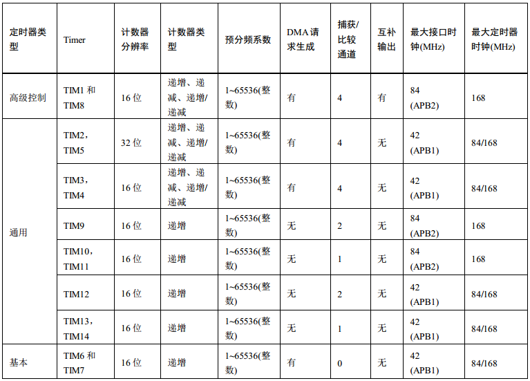

定时器功能表

其中最大定时器时钟可通过 RCC_DCKCFGR 寄存器配置为 84MHz 或者 168MHz。定时器功能强大，
这一点透过《STM32F4xx 中文参考手册》讲解定时器内容就有 160多页就显而易见了。
定时器篇幅长，内容多，对于新手想完全掌握确实有些难度，特别参考手册是先介绍高级控制定时器，
然后介绍通用定时器，最后才介绍基本定时器。实际上，就功能上来说通用定时器包含所有基本定时器功能，
而高级控制定时器包含通用定时器所有功能。所以高级控制定时器功能繁多，但也是最难理解的，
本章我们先选择最简单的基本定时器进行讲解。

基本定时器
^^^^^^^^^^^^^^^^^^^^^^^^^^^^^^^^^^^^^^^^^^
基本定时器比高级控制定时器和通用定时器功能少，结构简单，理解起来更容易，我们就开始先讲解基本定时器内容。
基本定时器主要两个功能，第一就是基本定时功能，生成时基，第二就是专门用于驱动数模转换器(DAC)。
关于驱动 DAC 具体应用参考 DAC 章节。

控制器有两个基本定时器 TIM6 和 TIM7，功能完全一样，但所用资源彼此都完全独立，
可以同时使用。在本章内容中，以 TIMx 统称基本定时器。

基本上定时器 TIM6 和 TIM7 是一个 16 位向上递增的定时器，
当我在自动重载寄存器(TIMx_ARR)添加一个计数值后并使能 TIMx，计数寄存器(TIMx_CNT)就会从 0 开始递增，
当 TIMx_CNT 的数值与 TIMx_ARR 值相同时就会生成事件并把 TIMx_CNT 寄存器清 0，完成一次循环过程。
如果没有停止定时器就循环执行上述过程。这些只是大概的流程，希望大家有个感性认识，下面细讲整个过程。

基本定时器功能框图
^^^^^^^^^^^^^^^^^^^^^^^^^^^^^^^^^^^^^^^^^^
基本定时器的功能框图包含了基本定时器最核心内容，掌握了功能框图，对基本定时器就有一个整体的把握，
在编程时思路就非常清晰。首先先看图中绿色框内容，第一个是带有阴影的方框，方框内容一般是一个寄存器名称，
比如图中主体部分的自动重载寄存器(TIMx_ARR)或 PSC 预分频器(TIMx_PSC)，这里要特别突出的是阴影这个标志的作用，
它表示这个寄存器还自带有影子寄存器，在硬件结构上实际是有两个寄存器，源寄存器是我们可以进行读写操作，
而影子寄存器我们是完全无法操作的，有内部硬件使用。影子寄存器是在程序运行时真正起到作用的，
源寄存器只是给我们读写用的，只有在特定时候(特定事件发生时)才把源寄存器的值拷贝给它的影子寄存器。
多个影子寄存器一起使用可以到达同步更新多个寄存器内容的目的。接下来是一个指向右下角的图标，它表示一个事件，
而一个指向右上角的图标表示中断和 DMA 输出。这个我们把它放在图中主体更好理解。图中的自动重载寄存器有影子寄存器，
它左边有一个带有“U”字母的事件图标，表示在更新事件生成时就把自动重载寄存器内容拷贝到影子寄存器内，这个与上面分析是一致。
寄存器右边的事件图标、中断和DMA 输出图标表示在自动重载寄存器值与计数器寄存器值相等时生成事件、中断和 DMA输出。

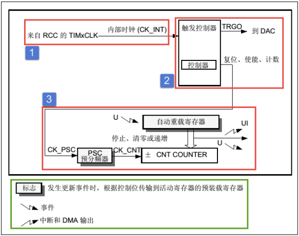

基本定时器功能框图

时钟源
""""""""""""""""""""""""""""""""""
定时器要实现计数必须有个时钟源，基本定时器时钟只能来自内部时钟，
高级控制定时器和通用定时器还可以选择外部时钟源或者直接来自其他定时器等待模式。
我们可以通过 RCC 专用时钟配置寄存器(RCC_DCKCFGR)的 TIMPRE 位设置所有定时器的时钟频率，
我们一般设置该位为默认值 0，即 TIMxCLK 为总线时钟的两倍，使得表 32-1 中可选的最大定时器时钟为 84MHz，
即基本定时器的内部时钟(CK_INT)频率为 84MHz。
基本定时器只能使用内部时钟，当 TIM6 和 TIM7 控制寄存器 1(TIMx_CR1)的 CEN 位置 1 时，启动基本定时器，
并且预分频器的时钟来源就是 CK_INT。对于高级控制定时器和通用定时器的时钟源可以来找控制器外部时钟、其他定时器等等模式，
较为复杂，我们在相关章节会详细介绍。

控制器
""""""""""""""""""""""""""""""""""""""""""""""""""""""""""""""""""""
定时器控制器控制实现定时器功能，控制定时器复位、使能、计数是其基础功能，基本定时器还专门用于 DAC 转换触发。

计数器
""""""""""""""""""""""""""""""""""""""""""""""""""""""""""""""""""""
基本定时器计数过程主要涉及到三个寄存器内容，分别是计数器寄存器(TIMx_CNT)、
预分频器寄存器(TIMx_PSC)、自动重载寄存器(TIMx_ARR)，这三个寄存器都是 16 位有效数字，即可设置值为 0 至 65535。

首先我们来看图中预分频器 PSC，它有一个输入时钟 CK_PSC 和一个输出时钟CK_CNT。
输入时钟 CK_PSC 来源于控制器部分，基本定时器只有内部时钟源所以CK_PSC 实际等于 CK_INT，即 90MHz。
在不同应用场所，经常需要不同的定时频率，通过设置预分频器 PSC CK_CNT，实际计算为：fCK_CNT 等于 fCK_PSC/(PSC[15:0]+1)。

图中是将预分频器 PSC 的值从 1 改为 4 时计数器时钟变化过程。原来是 1 分频，
CK_PSC 和 CK_CNT 频率相同。向 TIMx_PSC 寄存器写入新值时，并不会马上更新CK_CNT 输出频率，
而是等到更新事件发生时，把 TIMx_PSC 寄存器值更新到影子寄存器中，使其真正产生效果。
更新为 4 分频后，在 CK_PSC 连续出现 4 个脉冲后 CK_CNT 才产生一个脉冲。

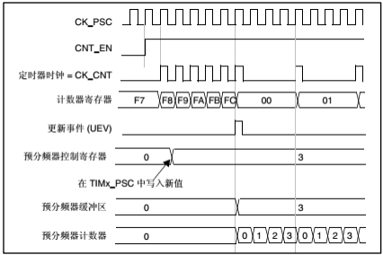

基本定时器时钟源分频

在定时器使能(CEN 置 1)时，计数器 COUNTER 根据 CK_CNT 频率向上计数，即每来一个 CK_CNT 脉冲，
TIMx_CNT 值就加 1。当 TIMx_CNT 值与 TIMx_ARR 的设定值相等时就自动生成事件并 TIMx_CNT 自动清零，
然后自动重新开始计数，如此重复以上过程。为此可见，我们只要设置 CK_PSC 和 TIMx_ARR
这两个寄存器的值就可以控制事件生成的时间，而我们一般的应用程序就是在事件生成的回调函数中运行的。
在 TIMx_CNT 递增至与 TIMx_ARR 值相等，我们叫做为定时器上溢。

自动重载寄存器 TIMx_ARR 用来存放于计数器值比较的数值，如果两个数值相等就生成事件，
将相关事件标志位置位，生成 DMA 和中断输出。 TIMx_ARR 有影子寄存器，
可以通过 TIMx_CR1 寄存器的 ARPE 位控制影子寄存器功能，如果 ARPE 位置 1，影子寄存器有效，
只有在事件更新时才把 TIMx_ARR 值赋给影子寄存器。如果 ARPE 位为 0，修改TIMx_ARR 值马上有效。

定时器周期计算
""""""""""""""""""""""""""""""""""""""""""""""""""""""""""""""""""""
经过上面分析，我们知道定时事件生成时间主要由 TIMx_PSC 和 TIMx_ARR 两个寄存器值决定，
这个也就是定时器的周期。比如我们需要一个 1s 周期的定时器，具体这两个寄存器值该如何设置内。
假设，我们先设置 TIMx_ARR 寄存器值为 9999，即当 TIMx_CNT从 0 开始计算，刚好等于 9999 时生成事件，
总共计数 10000 次，那么如果此时时钟源周期为 100us 即可得到刚好 1s 的定时周期。

接下来问题就是设置 TIMx_PSC 寄存器值使得 CK_CNT 输出为 100us 周期(10000Hz)的时钟。
预分频器的输入时钟 CK_PSC 为 84MHz，所以设置预分频器值为(8400-1)即可满足。

定时器初始化接头体讲解
^^^^^^^^^^^^^^^^^^^^^^^^^^^^^^^^^^^^^^^^^^
HAL 库函数对定时器外设建立了四个初始化结构体，基本定时器只用到其中一个即TIM_TimeBaseInitTypeDef，
该结构体成员用于设置定时器基本工作参数，并由定时器基本初始化配置函数 TIM_TimeBaseInit 调用，
这些设定参数将会设置定时器相应的寄存器，达到配置定时器工作环境的目的。
这一章我们只介绍 TIM_TimeBaseInitTypeDef 结构体，其他结构体将在相关章节介绍。

初始化结构体和初始化库函数配合使用是 HAL 库精髓所在，理解了初始化结构体每个成员意义基本上就可以对该外设运用自如了。
初始化结构体定义在 stm32f4xx_hal_tim.h 文件中，
初始化库函数定义在 stm32f4xx_hal_tim.c 文件中，编程时我们可以结合这两个文件内注释使用。

.. code-block:: c
   :caption: 定时器基本初始化结构体
   :linenos:

    typedef struct {
        uint16_t Prescaler;         // 预分频器
        uint16_t CounterMode;       // 计数模式
        uint32_t Period;            // 定时器周期
        uint16_t ClockDivision;     // 时钟分频
        uint8_t RepetitionCounter;  // 重复计算器
    } TIM_Base_InitTypeDef;

- Prescaler：定时器预分频器设置，时钟源经该预分频器才是定时器时钟，它设定TIMx_PSC 寄存器的值。
  可设置范围为 0 至 65535，实现 1 至 65536 分频。
- CounterMode：定时器计数方式，可是在为向上计数、向下计数以及三种中心对齐模式。
  基本定时器只能是向上计数，即 TIMx_CNT 只能从 0 开始递增，并且无需初始化。
- Period：定时器周期，实际就是设定自动重载寄存器的值，在事件生成时更新到影子寄存器。
  可设置范围为 0 至 65535。
- ClockDivision：时钟分频，设置定时器时钟 CK_INT 频率与数字滤波器采样时钟频率分频比，
  基本定时器没有此功能，不用设置。
- RepetitionCounter：重复计数器，属于高级控制寄存器专用寄存器位，利用它可以非常容易控制输出 PWM 的个数。
  这里不用设置。

虽然定时器基本初始化结构体有 5 个成员，但对于基本定时器只需设置其中两个就可以，想想使用基本定时器就是简单。

基本定时器定时实验
^^^^^^^^^^^^^^^^^^^^^^^^^^^^^^^^^^^^^^^^^^
在 DAC 转换中几乎都用到基本定时器，使用有关基本定时器触发 DAC 转换内容在 DAC 章节讲解即可，
这里就利用基本定时器实现简单的定时功能。

我们使用基本定时器循环定时 0.5s 并使能定时器中断，每到 0.5s 就在定时器中断服务函数翻转 RGB 彩灯，
使得最终效果 RGB 彩灯暗 0.5s，亮 0.5s，如此循环。

硬件设计
""""""""""""""""""""""""""""""""""""""""""""""""""""""""""""""""""""
基本定时器没有相关 GPIO，这里我们只用定时器的定时功能，无效其他外部引脚，
至于 RGB 彩灯硬件可参考 野火《stm32HAL库开发实战指南》的GPIO 章节。

**宏定义**

.. code-block:: c
   :caption: 宏定义
   :linenos:

    #define BASIC_TIM TIM6
    #define BASIC_TIM_CLK_ENABLE() __TIM6_CLK_ENABLE()
    #define BASIC_TIM_IRQn TIM6_DAC_IRQn
    #define BASIC_TIM_IRQHandler TIM6_DAC_IRQHandler

使用宏定义非常方便程序升级、移植。

**NVIC配置**

.. code-block:: c
   :caption: NVIC配置
   :linenos:

    /**
    * @brief 基本定时器 TIMx,x[6,7]中断优先级配置
    * @param 无
    * @retval 无
    */
    static void TIMx_NVIC_Configuration(void)
    {
        //设置抢占优先级，子优先级
        HAL_NVIC_SetPriority(BASIC_TIM_IRQn, 0, 3);
        // 设置中断来源
        HAL_NVIC_EnableIRQ(BASIC_TIM_IRQn);
    }

实验用到定时器更新中断，需要配置 NVIC，实验只有一个中断，对 NVIC 配置没什么具体要求。

**基本定时器模式配置**

.. code-block:: c
   :caption: 基本定时器模式配置
   :linenos:

    static void TIM_Mode_Config(void)
    {
        // 开启 TIMx_CLK,x[6,7]
        BASIC_TIM_CLK_ENABLE();

        TIM_TimeBaseStructure.Instance = BASIC_TIM;
        /* 累计 TIM_Period 个后产生一个更新或者中断*/
        //当定时器从 0 计数到 4999，即为 5000 次，为一个定时周期
        TIM_TimeBaseStructure.Init.Period = 5000-1;

        //定时器时钟源 TIMxCLK = 2 * PCLK1
        // PCLK1 = HCLK / 4
        // => TIMxCLK=HCLK/2=SystemCoreClock/2=84MHz
        // 设定定时器频率为=TIMxCLK/(TIM_Prescaler+1)=10000Hz
        TIM_TimeBaseStructure.Init.Prescaler = 8400-1;

        // 初始化定时器 TIMx, x[2,3,4,5]
        HAL_TIM_Base_Init(&TIM_TimeBaseStructure);

        // 开启定时器更新中断
        HAL_TIM_Base_Start_IT(&TIM_TimeBaseStructure);
    }

使用定时器之前都必须开启定时器时钟，基本定时器属于 APB1 总线外设。

接下来设置定时器周期数为 4999，即计数 5000 次生成事件。设置定时器预分频器为(8400-1)，
基本定时器使能内部时钟，频率为 84MHz，经过预分频器后得到 10KHz 的频率。
然后就是调用 TIM HAL_TIM_Base_Init 函数完成定时器配置。

最后使用 HAL_TIM_Base_Start_IT 函数开启定时器和更新中断。

**定时器中断服务函数**

.. code-block:: c
   :caption: 定时器中断服务函数
   :linenos:

    void BASIC_TIM_IRQHandler (void)
    {
        HAL_TIM_IRQHandler(&TIM_TimeBaseStructure);
    }

    void HAL_TIM_PeriodElapsedCallback(TIM_HandleTypeDef *htim)
    {
        if (htim==(&TIM_TimeBaseStructure)) {
        LED1_TOGGLE; //红灯周期闪烁
        }
    }

我们在 TIM_Mode_Config 函数启动了定时器更新中断，在发生中断时，中断服务函数就得到运行。
在服务函数内直接调用库函数 HAL_TIM_IRQHandler 函数，它会产生一个中断回调函数
HAL_TIM_PeriodElapsedCallback，用来添加用户代码，确定是 TIM6 产生中断后才运行 RGB 彩灯翻转动作。

**主函数**

.. code-block:: c
   :caption: 主函数
   :linenos:

    int main(void)
    {
        /* 初始化系统时钟为 168MHz */
        SystemClock_Config();
        /* 初始化 LED */
        LED_GPIO_Config();
        /* 初始化基本定时器定时， 1s 产生一次中断 */
        TIMx_Configuration();

        while (1) {
        }
    }

实验中先初始化系统时钟，用到 RGB 彩灯，需要对其初始化配置。
LED_GPIO_Config 函数是定义在 bsp_led.c 文件的完成 RGB 彩灯 GPIO 初始化配置的程序。

TIMx_Configuration 函数是定义在 bsp_basic_tim.c 文件的一个函数，它只是简单的先后调用
TIMx_NVIC_Configuration 和 TIM_Mode_Config 两个函数完成 NVIC 配置和基本定时器模式配置。

下载验证
""""""""""""""""""""""""""""""""""""""""""""""""""""""""""""""""""""
保证开发板相关硬件连接正确，把编译好的程序下载到开发板。开始 RGB 彩灯是暗的，
等一会 RGB 彩灯变为红色，再等一会又暗了，如此反复。如果我们使用表钟与 RGB 彩灯闪烁对比，
可以发现它是每 0.5s 改变一次 RGB 彩灯状态的。

TIM-高级定时器
------------------------------------------

特别说明，定时器的内容是以 STM32F40xx 系列控制器资源讲解。

上一章我们讲解了基本定时器功能，基本定时器功能简单，理解起来也容易。
高级控制定时器包含了通用定时器的功能，再加上已经有了基本定时器基础的基础，
如果再把通用定时器单独拿出来讲那内容有很多重复，实际效果不是很好，所以通用定时器不作为独立章节讲解，
可以在理解了高级定时器后参考《STM32F4xx 中文参考手册》通用定时器章节内容理解即可。

高级控制定时器
^^^^^^^^^^^^^^^^^^^^^^^^^^^^^^^^^^^^^^^^^^

高级控制定时器(TIM1 和 TIM8)和通用定时器在基本定时器的基础上引入了外部引脚，可以输入捕获和输出比较功能。
高级控制定时器比通用定时器增加了可编程死区互补输出、重复计数器、带刹车(断路)功能，这些功能都是针对工业电机控制方面。
这几个功能在本书不做详细的介绍，主要介绍常用的输入捕获和输出比较功能。

高级控制定时器时基单元包含一个 16 位自动重载计数器 ARR，一个 16 位的计数器 CNT，可向上/下计数，
一个 16 位可编程预分频器 PSC，预分频器时钟源有多种可选，有内部的时钟、外部时钟。
还有一个 8 位的重复计数器 RCR，这样最高可实现 40 位的可编程定时。

STM32F407ZGT6 的高级/通用定时器的 IO 分配具体见下图。
配套开发板因为 IO 资源紧缺，定时器的 IO 很多已经复用它途，故下表中的 IO 只有部分可用于定时器的实验。

========  =============  ========  ============  ========  ===========  ========  ========  =========  =========  =========  =========  =========
   \        **TIM1**     **TIM8**    **TIM2**    **TIM5**   **TIM3**    **TIM4**  **TIM9**  **TIM10**  **TIM11**  **TIM12**  **TIM13**  **TIM14**
========  =============  ========  ============  ========  ===========  ========  ========  =========  =========  =========  =========  =========
**CH1**   PA8/PE9        PC6       PA0/PA5       PA0       PA6/PC6/PB4  PD12/PB6  PE5/PA2   PF6/PB8    PF7/PB9    PB14       PF8/PA6    PF9/PA7
**CH1N**  PA7/PE8/PB13   PA5/PA7
**CH2**   PE11/PA9       PC7       PA1/PB3       PA1       PA7/PC7/PB5  PD13/PB7  PE6/PA3   PB15
**CH2N**  PB0/PE10/PB14  PB0/PB14
**CH3**   PE13/PA10      PC8       PA2/PB10      PA2       PB0/PC8      PD14/PB8
**CH3N**  PB1/PE12/PB15  PB1/PB15
**CH4**   PE14/PA11      PC9       PA3/PB11      PA3       PB1/PC9      PD15/PB9
**ETR**   PE7/PA12       PA0/PI3   PA0/PA5/PA15  PD2       PE0
**BKIN**  PA6/PE15/PB12  PA6/PI4
========  =============  ========  ============  ========  ===========  ========  ========  =========  =========  =========  =========  =========

高级控制定时器功能框图
^^^^^^^^^^^^^^^^^^^^^^^^^^^^^^^^^^^^^^^^^^

高级控制定时器功能框图包含了高级控制定时器最核心内容，掌握了功能框图，
对高级控制定时器就有一个整体的把握，在编程时思路就非常清晰，见下图。

.. image:: ../media/doc1002.png
   :align: center

高级控制定时器功能框图

关于图中带阴影的寄存器，即带有影子寄存器，
指向左下角的事件更新图标以及指向右上角的中断和DMA输出标志在上一章已经做了解释，这里就不再介绍。

①时钟源
"""""""""""""""""

高级控制定时器有四个时钟源可选：

-  内部时钟源CK_INT

-  外部时钟模式1：外部输入引脚TIx（x=1,2,3,4）

-  外部时钟模式2：外部触发输入ETR

-  内部触发输入

内部时钟源(CK_INT)

内部时钟CK_INT即来自于芯片内部，等于168M，一般情况下，我们都是使用内部时钟。
当从模式控制寄存器TIMx_SMCR的SMS位等于000时，则使用内部时钟。

外部时钟模式1

.. image:: ../media/doc1003.png
   :align: center

外部时钟模式1框图

**①：时钟信号输入引脚**

当使用外部时钟模式1的时候，时钟信号来自于定时器的输入通道，总共有4个，分别为TI1/2/3/4，
即TIMx_CH1/2/3/4。具体使用哪一路信号，由TIM_CCMx的位CCxS[1:0]配置，其中CCM1控制TI1/2，CCM2控制TI3/4。

**②：滤波器**

如果来自外部的时钟信号的频率过高或者混杂有高频干扰信号的话，我们就需要使用滤波器对ETRP信号重新采样，
来达到降频或者去除高频干扰的目的，具体的由TIMx_CCMx的位ICxF[3:0]配置。

**③：边沿检测**

边沿检测的信号来自于滤波器的输出，在成为触发信号之前，需要进行边沿检测，决定是上升沿有效还是下降沿有效，
具体的由TIMx_CCER的位CCxP和CCxNP配置。

**④：触发选择**

当使用外部时钟模式1时，触发源有两个，一个是滤波后的定时器输入1（TI1FP1）和滤波后的定时器输入2（TI2FP2），
具体的由TIMxSMCR的位TS[2:0]配置。

**⑤：从模式选择**

选定了触发源信号后，最后我们需把信号连接到TRGI引脚，让触发信号成为外部时钟模式1的输入，最终等于CK_PSC，
然后驱动计数器CNT计数。具体的配置TIMx_SMCR的位SMS[2:0]为000即可选择外部时钟模式1。

**⑥：使能计数器**

经过上面的5个步骤之后，最后我们只需使能计数器开始计数，外部时钟模式1的配置就算完成。使能计数器由TIMx_CR1的位CEN配置。

外部时钟模式2

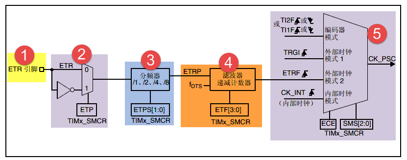

外部时钟模式2框图

**①：时钟信号输入引脚**

当使用外部时钟模式2的时候，时钟信号来自于定时器的特定输入通道TIMx_ETR，只有1个。

**②：外部触发极性**

来自ETR引脚输入的信号可以选择为上升沿或者下降沿有效，具体的由TIMx_SMCR的位ETP配置。

**③：外部触发预分频器**

由于ETRP的信号的频率不能超过TIMx_CLK（168M）的1/4，当触发信号的频率很高的情况下，
就必须使用分频器来降频，具体的由 TIMx_SMCR的位ETPS[1:0]配置。

**④：滤波器**

如果ETRP的信号的频率过高或者混杂有高频干扰信号的话，我们就需要使用滤波器对ETRP信号重新采样，
来达到降频或者去除高频干扰的目的。具体的由TIMx_SMCR的位ETF[3:0]配置，其中的f\ :sub:`DTS`\
是由内部时钟CK_INT分频得到，具体的由TIMx_CR1的位CKD[1:0]配置。

**⑤：从模式选择**

经过滤波器滤波的信号连接到ETRF引脚后，触发信号成为外部时钟模式2的输入，最终等于CK_PSC，然后驱动计数器CNT计数。
具体的配置TIMx_SMCR的位ECE为1即可选择外部时钟模式2。

**⑥：使能计数器**

经过上面的5个步骤之后，最后我们只需使能计数器开始计数，外部时钟模式2的配置就算完成。使能计数器由TIMx_CR1的位CEN配置。

内部触发输入

内部触发输入是使用一个定时器作为另一个定时器的预分频器。硬件上高级控制定时器和通用定时器在内部连接在一起，
可以实现定时器同步或级联。主模式的定时器可以对从模式定时器执行复位、启动、停止或提供时钟。
高级控制定时器和部分通用定时器(TIM2至TIM5)可以设置为主模式或从模式，TIM9和TIM10可设置为从模式。

下图为主模式定时器(TIM1)为从模式定时器(TIM2)提供时钟，即TIM1用作TIM2的预分频器。

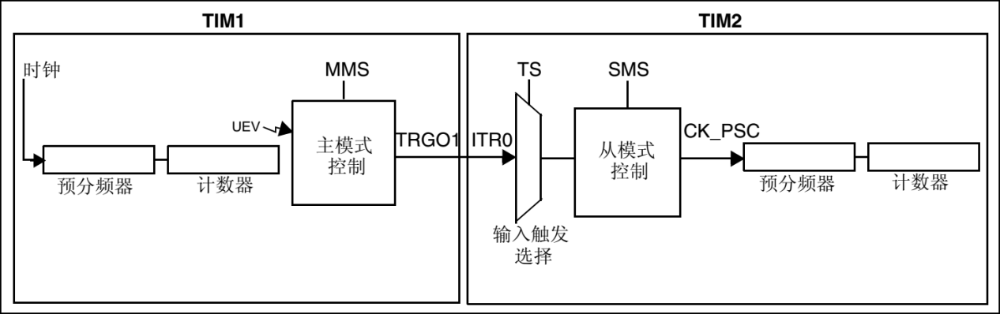

TIM1用作TIM2的预分频器

②控制器
"""""""""""""""""

高级控制定时器控制器部分包括触发控制器、从模式控制器以及编码器接口。触发控制器用来针对片内外设输出触发信号，
比如为其它定时器提供时钟和触发DAC/ADC转换。

编码器接口专门针对编码器计数而设计。从模式控制器可以控制计数器复位、启动、递增/递减、计数。

③时基单元
"""""""""""""""""
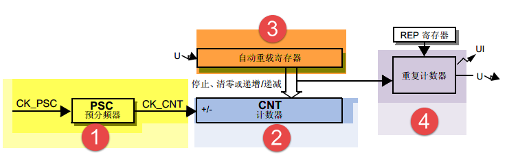

高级定时器时基单元

高级控制定时器时基单元包括四个寄存器，分别是计数器寄存器(CNT)、预分频器寄存器(PSC)、自动重载寄存器(ARR)和重复计数器寄存器(RCR)。
其中重复计数器RCR是高级定时器独有，通用和基本定时器没有。前面三个寄存器都是16位有效，TIMx_RCR寄存器是8位有效。

预分频器PSC

预分频器PSC，有一个输入时钟CK_PSC和一个输出时钟CK_CNT。输入时钟CK_PSC就是上面时钟源的输出，输出CK_CNT则用来驱动计数器CNT计数。
通过设置预分频器PSC的值可以得到不同的CK_CNT，
实际计算为：f\ :sub:`CK_CNT`\ 等于f\:sub:`CK_PSC`/(PSC[15:0]+1)，可以实现1至65536分频。

计数器CNT

高级控制定时器的计数器有三种计数模式，分别为递增计数模式、递减计数模式和递增/递减(中心对齐)计数模式。

(1) 递增计数模式下，计数器从0开始计数，每来一个CK_CNT脉冲计数器就增加1，
直到计数器的值与自动重载寄存器ARR值相等，然后计数器又从0开始计数并生成计数器上溢事件，计数器总是如此循环计数。
如果禁用重复计数器，在计数器生成上溢事件就马上生成更新事件(UEV)；
如果使能重复计数器，每生成一次上溢事件重复计数器内容就减1，直到重复计数器内容为0时才会生成更新事件。

(2) 递减计数模式下，计数器从自动重载寄存器ARR值开始计数，每来一个CK_CNT脉冲计数器就减1，直到计数器值为0，
然后计数器又从自动重载寄存器ARR值开始递减计数并生成计数器下溢事件，计数器总是如此循环计数。
如果禁用重复计数器，在计数器生成下溢事件就马上生成更新事件；
如果使能重复计数器，每生成一次下溢事件重复计数器内容就减1，直到重复计数器内容为0时才会生成更新事件。

(3) 中心对齐模式下，计数器从0开始递增计数，直到计数值等于(ARR-1)值生成计数器上溢事件，
然后从ARR值开始递减计数直到1生成计数器下溢事件。然后又从0开始计数，如此循环。
每次发生计数器上溢和下溢事件都会生成更新事件。

自动重载寄存器ARR

自动重载寄存器ARR用来存放与计数器CNT比较的值，如果两个值相等就递减重复计数器。
可以通过TIMx_CR1寄存器的ARPE位控制自动重载影子寄存器功能，
如果ARPE位置1，自动重载影子寄存器有效，只有在事件更新时才把TIMx_ARR值赋给影子寄存器。
如果ARPE位为0，则修改TIMx_ARR值马上有效。

重复计数器RCR

在基本/通用定时器发生上/下溢事件时直接就生成更新事件，但对于高级控制定时器却不是这样，
高级控制定时器在硬件结构上多出了重复计数器，在定时器发生上溢或下溢事件是递减重复计数器的值，
只有当重复计数器为0时才会生成更新事件。在发生N+1个上溢或下溢事件(N为RCR的值)时产生更新事件。

④输入捕获
"""""""""""""""""
.. image:: ../media/doc1007.png
   :align: center

输入捕获功能框图

输入捕获可以对输入的信号的上升沿，下降沿或者双边沿进行捕获，
常用的有测量输入信号的脉宽和测量PWM输入信号的频率和占空比这两种。

输入捕获的大概的原理就是，当捕获到信号的跳变沿的时候，
把计数器CNT的值锁存到捕获寄存器CCR中，把前后两次捕获到的CCR寄存器中的值相减，就可以算出脉宽或者频率。
如果捕获的脉宽的时间长度超过你的捕获定时器的周期，就会发生溢出，这个我们需要做额外的处理。

①输入通道

需要被测量的信号从定时器的外部引脚TIMx_CH1/2/3/4进入，通常叫TI1/2/3/4，
在后面的捕获讲解中对于要被测量的信号我们都以TIx为标准叫法。

②输入滤波器和边沿检测器

当输入的信号存在高频干扰的时候，我们需要对输入信号进行滤波，即进行重新采样，根据采样定律，
采样的频率必须大于等于两倍的输入信号。比如输入的信号为1M，又存在高频的信号干扰，那么此时就很有必要进行滤波，
我们可以设置采样频率为2M，这样可以在保证采样到有效信号的基础上把高于2M的高频干扰信号过滤掉。

滤波器的配置由CR1寄存器的位CKD[1:0]和CCMR1/2的位ICxF[3:0]控制。从ICxF位的描述可知，
采样频率f\ :sub:`SAMPLE`\ 可以由f\ :sub:`CK_INT`\ 和f\ :sub:`DTS`\ 分频后的时钟提供，
其中是f\ :sub:`CK_INT`\ 内部时钟，f\ :sub:`DTS`\ 是f\ :sub:`CK_INT`\ 经过分频后得到的频率，
分频因子由CKD[1:0]决定，可以是不分频，2分频或者是4分频。

边沿检测器用来设置信号在捕获的时候是什么边沿有效，可以是上升沿，下降沿，或者是双边沿，具体的由CCER寄存器的位CCxP和CCxNP决定。

③捕获通道

捕获通道就是图中的IC1/2/3/4，每个捕获通道都有相对应的捕获寄存器CCR1/2/3/4，
当发生捕获的时候，计数器CNT的值就会被锁存到捕获寄存器中。

这里我们要搞清楚输入通道和捕获通道的区别，输入通道是用来输入信号的，
捕获通道是用来捕获输入信号的通道，一个输入通道的信号可以同时输入给两个捕获通道。
比如输入通道TI1的信号经过滤波边沿检测器之后的TI1FP1和TI1FP2可以进入到捕获通道IC1和IC2，
其实这就是我们后面要讲的PWM输入捕获，只有一路输入信号（TI1）却占用了两个捕获通道（IC1和IC2）。
当只需要测量输入信号的脉宽时候，用一个捕获通道即可。输入通道和捕获通道的映射关系具体由寄存器CCMRx的位CCxS[1:0]配置。

④的预分频器

ICx的输出信号会经过一个预分频器，用于决定发生多少个事件时进行一次捕获。
具体的由寄存器CCMRx的位ICxPSC配置，如果希望捕获信号的每一个边沿，则不分频。

⑤捕获寄存器

经过预分频器的信号ICxPS是最终被捕获的信号，当发生捕获时（第一次），
计数器CNT的值会被锁存到捕获寄存器CCR中，还会产生CCxI中断，相应的中断位CCxIF（在SR寄存器中）会被置位，
通过软件或者读取CCR中的值可以将CCxIF清0。如果发生第二次捕获（即重复捕获：CCR寄存器中已捕获到计数器值且 CCxIF 标志已置 1），
则捕获溢出标志位CCxOF（在SR寄存器中）会被置位，CCxOF只能通过软件清零。

⑤输出比较
"""""""""""""""""
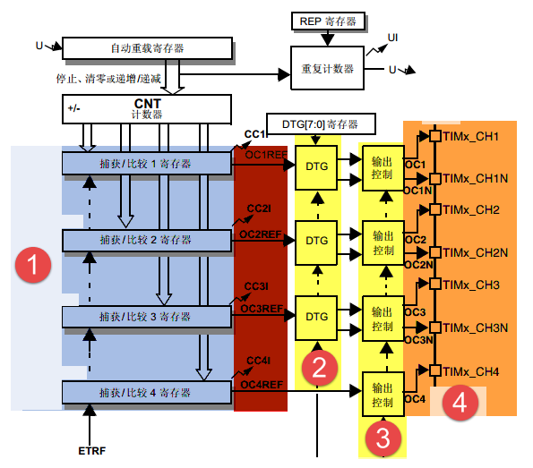

输出比较功能框图

输出比较就是通过定时器的外部引脚对外输出控制信号，有冻结、将通道X（x=1,2,3,4）设置为匹配时输出有效电平、
将通道X设置为匹配时输出无效电平、翻转、强制变为无效电平、强制变为有效电平、PWM1和PWM2这八种模式，
具体使用哪种模式由寄存器CCMRx的位OCxM[2:0]配置。其中PWM模式是输出比较中的特例，使用的也最多。

①比较寄存器

当计数器CNT的值跟比较寄存器CCR的值相等的时候，输出参考信号OCxREF的信号的极性就会改变，
其中OCxREF=1（高电平）称之为有效电平，OCxREF=0（低电平）称之为无效电平，并且会产生比较中断CCxI，
相应的标志位CCxIF（SR寄存器中）会置位。然后OCxREF再经过一系列的控制之后就成为真正的输出信号OCx/OCxN。

②死区发生器

在生成的参考波形OCxREF的基础上，可以插入死区时间，用于生成两路互补的输出信号OCx和OCxN，
死区时间的大小具体由BDTR寄存器的位DTG[7:0]配置。死区时间的大小必须根据与输出信号相连接的器件及其特性来调整。
下面我们简单举例说明下带死区的PWM信号的应用，我们以一个板桥驱动电路为例。

.. image:: ../media/doc1009.png
   :align: center

半桥驱动电路

在这个半桥驱动电路中，Q1导通，Q2截止，此时我想让Q1截止Q2导通，肯定是要先让Q1截止一段时间之后，
再等一段时间才让Q2导通，那么这段等待的时间就称为死区时间，因为Q1关闭需要时间（由MOS管的工艺决定）。
如果Q1关闭之后，马上打开Q2，那么此时一段时间内相当于Q1和Q2都导通了，这样电路会短路。

上图是针对上面的半桥驱动电路而画的带死区插入的PWM信号，图中的死区时间要根据MOS管的工艺来调节。

.. image:: ../media/doc1010.png
   :align: center

带死区插入的互补输出

③输出控制

.. image:: ../media/doc1011.png
   :align: center

输出比较（通道1~3）的输出控制框图

在输出比较的输出控制中，参考信号OCxREF在经过死区发生器之后会产生两路带死区的互补信号OCx_DT和OCxN_DT（通道1~3才有互补信号，
通道4没有，其余跟通道1~3一样），这两路带死区的互补信号然后就进入输出控制电路，如果没有加入死区控制，
那么进入输出控制电路的信号就直接是OCxREF。

进入输出控制电路的信号会被分成两路，一路是原始信号，一路是被反向的信号，具体的由寄存器CCER的位CCxP和CCxNP控制。
经过极性选择的信号是否由OCx引脚输出到外部引脚CHx/CHxN则由寄存器CCER的位CxE/CxNE配置。

如果加入了断路（刹车）功能，则断路和死区寄存器BDTR的MOE、OSSI和OSSR这三个位会共同影响输出的信号。

④输出引脚

输出比较的输出信号最终是通过定时器的外部IO来输出的，分别为CH1/2/3/4，
其中前面三个通道还有互补的输出通道CH1/2/3N。更加详细的IO说明还请查阅相关的数据手册。

⑥断路功能
""""""""""

断路功能就是电机控制的刹车功能，使能断路功能时，根据相关控制位状态修改输出信号电平。
在任何情况下，OCx和OCxN输出都不能同时为有效电平，这关系到电机控制常用的H桥电路结构原因。

断路源可以是时钟故障事件，由内部复位时钟控制器中的时钟安全系统(CSS)生成，也可以是外部断路输入IO，两者是或运算关系。

系统复位启动都默认关闭断路功能，将断路和死区寄存器(TIMx_BDTR)的BKE为置1，使能断路功能。
可通过TIMx_BDTR 寄存器的BKP位设置设置断路输入引脚的有效电平，设置为1时输入BRK为高电平有效，否则低电平有效。

发送断路时，将产生以下效果：

-  TIMx_BDTR 寄存器中主输出模式使能(MOE)位被清零，输出处于无效、空闲或复位状态；

-  根据相关控制位状态控制输出通道引脚电平；当使能通道互补输出时，会根据情况自动控制输出通道电平；

-  将TIMx_SR 寄存器中的 BIF位置 1，并可产生中断和DMA传输请求。

-  如果 TIMx_BDTR 寄存器中的 自动输出使能(AOE)位置 1，则MOE位会在发生下一个UEV事件时自动再次置 1。

输入捕获应用
^^^^^^^^^^^^^^^^^^^^^^^^^^^^^^^^^^^^^^^^^^

输入捕获一般应用在两个方面，一个方面是脉冲跳变沿时间测量，另一方面是PWM输入测量。

测量脉宽或者频率
"""""""""""""""""

.. image:: ../media/doc1012.png
   :align: center

脉宽/频率测量示意图

测量频率
*****************

当捕获通道TIx上出现上升沿时，发生第一次捕获，计数器CNT的值会被锁存到捕获寄存器CCR中，而且还会进入捕获中断，
在中断服务程序中记录一次捕获（可以用一个标志变量来记录），并把捕获寄存器中的值读取到value1中。
当出现第二次上升沿时，发生第二次捕获，计数器CNT的值会再次被锁存到捕获寄存器CCR中，并再次进入捕获中断，
在捕获中断中，把捕获寄存器的值读取到value3中，并清除捕获记录标志。利用value3和value1的差值我们就可以算出信号的周期（频率）。

测量脉宽
*****************

当捕获通道TIx上出现上升沿时，发生第一次捕获，计数器CNT的值会被锁存到捕获寄存器CCR中，而且还会进入捕获中断，
在中断服务程序中记录一次捕获（可以用一个标志变量来记录），并把捕获寄存器中的值读取到value1中。然后把捕获边沿改变为下降沿捕获，
目的是捕获后面的下降沿。当下降沿到来的时候，发生第二次捕获，计数器CNT的值会再次被锁存到捕获寄存器CCR中，并再次进入捕获中断，
在捕获中断中，把捕获寄存器的值读取到value3中，并清除捕获记录标志。然后把捕获边沿设置为上升沿捕获。

在测量脉宽过程中需要来回的切换捕获边沿的极性，如果测量的脉宽时间比较长，定时器就会发生溢出，
溢出的时候会产生更新中断，我们可以在中断里面对溢出进行记录处理。

PWM输入模式
"""""""""""""""""

测量脉宽和频率还有一个更简便的方法就是使用PWM输入模式。
与上面那种只使用一个捕获寄存器测量脉宽和频率的方法相比，PWM输入模式需要占用两个捕获寄存器。

.. image:: ../media/doc1013.png
   :align: center

输入通道和捕获通道的关系映射图

当使用PWM输入模式的时候，因为一个输入通道(TIx)会占用两个捕获通道(ICx)，
所以一个定时器在使用PWM输入的时候最多只能使用两个输入通道(TIx)。

我们以输入通道TI1工作在PWM输入模式为例来讲解下具体的工作原理，其他通道以此类推即可。

PWM信号由输入通道TI1进入，因为是PWM输入模式的缘故，信号会被分为两路，一路是TI1FP1，另外一路是TI2FP2。
其中一路是周期，另一路是占空比，具体哪一路信号对应周期还是占空比，得从程序上设置哪一路信号作为触发输入，
作为触发输入的哪一路信号对应的就是周期，另一路就是对应占空比。作为触发输入的那一路信号还需要设置极性，
是上升沿还是下降沿捕获，一旦设置好触发输入的极性，另外一路硬件就会自动配置为相反的极性捕获，无需软件配置。
一句话概括就是：选定输入通道，确定触发信号，然后设置触发信号的极性即可，因为是PWM输入的缘故，另一路信号则由硬件配置，无需软件配置。

当使用PWM输入模式的时候必须将从模式控制器配置为复位模式（配置寄存器SMCR的位SMS[2:0]来实现），
即当我们启动触发信号开始进行捕获的时候，同时把计数器CNT复位清零。

下面我们以一个更加具体的时序图来分析下PWM输入模式。

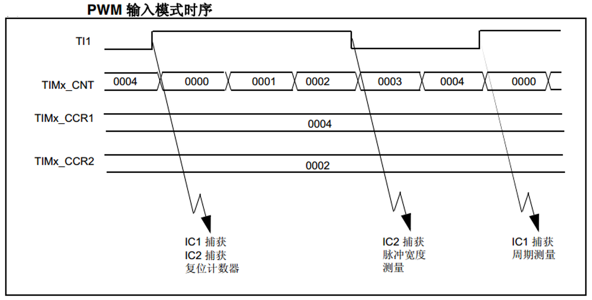

PWM输入模式时序

PWM信号由输入通道TI1进入，配置TI1FP1为触发信号，上升沿捕获。
当上升沿的时候IC1和IC2同时捕获，计数器CNT清零，到了下降沿的时候，IC2捕获，此时计数器CNT的值被锁存到捕获寄存器CCR2中，
到了下一个上升沿的时候，IC1捕获，计数器CNT的值被锁存到捕获寄存器CCR1中。其中CCR2测量的是脉宽，CCR1测量的是周期。

从软件上来说，用PWM输入模式测量脉宽和周期更容易，付出的代价是需要占用两个捕获寄存器。

输出比较应用
^^^^^^^^^^^^^^^^^^^^^^^^^^^^^^^^^^^^^^^^^^

输出比较模式总共有8种，具体的由寄存器CCMRx的位OCxM[2:0]配置。我们这里只讲解最常用的PWM模式，其他几种模式具体的看数据手册即可。

PWM输出模式
"""""""""""""""""

PWM输出就是对外输出脉宽（即占空比）可调的方波信号，信号频率由自动重装寄存器ARR的值决定，占空比由比较寄存器CCR的值决定。

PWM模式分为两种，PWM1和PWM2，总得来说是差不多，就看你怎么用而已，具体的区别下表PWM1与PWM2模式的区别。

====  =================  =================================
模式  计数器CNT计算方式                说明
====  =================  =================================
PWM1  递增               CNT<CCR，通道CH为有效，否则为无效
\     递减               CNT>CCR，通道CH为无效，否则为有效
PWM2  递增               CNT<CCR，通道CH为无效，否则为有效
\     递减               CNT>CCR，通道CH为有效，否则为无效
====  =================  =================================

PWM1与PWM2模式的区别

下面我们以PWM1模式来讲解，以计数器CNT计数的方向不同还分为边沿对齐模式和中心对齐模式。
PWM信号主要都是用来控制电机，一般的电机控制用的都是边沿对齐模式，FOC电机一般用中心对齐模式。
我们这里只分析这两种模式在信号感官上（即信号波形）的区别，具体在电机控制中的区别不做讨论，到了你真正需要使用的时候就会知道了。

PWM边沿对齐模式
*****************

在递增计数模式下，计数器从 0 计数到自动重载值（ TIMx_ARR寄存器的内容），然后重新从 0 开始计数并生成计数器上溢事件

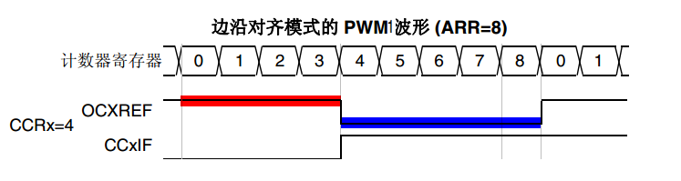

PWM1模式的边沿对齐波形

在边沿对齐模式下，计数器CNT只工作在一种模式，递增或者递减模式。这里我们以CNT工作在递增模式为例，
在中，ARR=8，CCR=4，CNT从0开始计数，当CNT<CCR的值时，OCxREF为有效的高电平，于此同时，比较中断寄存器CCxIF置位。
当CCR=<CNT<=ARR时，OCxREF为无效的低电平。然后CNT又从0开始计数并生成计数器上溢事件，以此循环往复。

PWM中心对齐模式
*****************

.. image:: ../media/doc1016.png
   :align: center

PWM1模式的中心对齐波形

在中心对齐模式下，计数器CNT是工作做递增/递减模式下。开始的时候，计数器CNT从 0 开始计数到自动重载值减1(ARR-1)，
生成计数器上溢事件；然后从自动重载值开始向下计数到 1 并生成计数器下溢事件。之后从0 开始重新计数。

图中是PWM1模式的中心对齐波形，ARR=8，CCR=4。
第一阶段计数器CNT工作在递增模式下，从0开始计数，当CNT<CCR的值时，OCxREF为有效的高电平，当CCR=<CNT<<ARR时，OCxREF为无效的低电平。
第二阶段计数器CNT工作在递减模式，从ARR的值开始递减，当CNT>CCR时，OCxREF为无效的低电平，当CCR=>CNT>=1时，OCxREF为有效的高电平。

在波形图上我们把波形分为两个阶段，第一个阶段是计数器CNT工作在递增模式的波形，这个阶段我们又分为①和②两个阶段，
第二个阶段是计数器CNT工作在递减模式的波形，这个阶段我们又分为③和④两个阶段。
要说中心对齐模式下的波形有什么特征的话，那就是①和③阶段的时间相等，②和④阶段的时间相等。

中心对齐模式又分为中心对齐模式1/2/3 三种，具体由寄存器CR1位CMS[1:0]配置。具体的区别就是比较中断中断标志位CCxIF在何时置1：
中心模式1在CNT递减计数的时候置1，中心对齐模式2在CNT递增计数时置1，中心模式3在CNT递增和递减计数时都置1。

定时器初始化结构体详解
^^^^^^^^^^^^^^^^^^^^^^^^^^^^^^^^^^^^^^^^^^

HAL库函数对定时器外设建立了多个初始化结构体，分别为时基初始化结构体TIM_Base_InitTypeDef、
输出比较初始化结构体TIM_OC_InitTypeDef、输入捕获初始化结构体TIM_IC_InitTypeDef、
单脉冲初始化结构体TIM_OnePulse_InitTypeDef、编码器模式配置初始化结构体TIM_Encoder_InitTypeDef、
断路和死区初始化结构体TIM_BreakDeadTimeConfigTypeDef。高级控制定时器可以用到所有初始化结构体，
通用定时器不能使用TIM_BreakDeadTimeConfigTypeDef结构体，基本定时器只能使用时基结构体。
初始化结构体成员用于设置定时器工作环境参数，并由定时器相应初始化配置函数调用，最终这些参数将会写入到定时器相应的寄存器中。

初始化结构体和初始化库函数配合使用是HAL库精髓所在，理解了初始化结构体每个成员意义基本上就可以对该外设运用自如。
初始化结构体定义在stm32f4xx_hal_tim.h和stm32f4xx_hal_tim_ex.h文件中，
初始化库函数定义在stm32f4xx_hal_tim.c和stm32f4xx_hal_tim_ex.c文件中，编程时我们可以结合这四个文件内注释使用。

TIM_Base_InitTypeDef
"""""""""""""""""""""

时基结构体TIM_Base_InitTypeDef用于定时器基础参数设置，与TIM_TimeBaseInit函数配合使用完成配置。

.. code-block:: c
   :caption: 定时器基本初始化结构体
   :linenos:

    typedef struct {
    uint16_t Prescaler; // 预分频器
    uint16_t CounterMode; // 计数模式
    uint32_t Period; // 定时器周期
    uint16_t ClockDivision; // 时钟分频
    uint8_t RepetitionCounter; // 重复计算器
    } Time_Base_InitTypeDef;

(1) Prescaler：定时器预分频器设置，时钟源经该预分频器才是定时器计数时钟CK_CNT，它设定PSC寄存器的值。计算公式为：
    计数器时钟频率 (f:sub:`CK_CNT`) 等于 f\ :sub:`CK_PSC` / (PSC[15:0] + 1)，可实现1至65536分频。

(2) CounterMode：定时器计数方式，可设置为向上计数、向下计数以及中心对齐。高级控制定时器允许选择任意一种。

(3) Period：定时器周期，实际就是设定自动重载寄存器ARR的值，ARR 为要装载到实际自动重载寄存器（即影子寄存器）的值，可设置范围为0至65535。

(4) ClockDivision：时钟分频，设置定时器时钟CK_INT频率与死区发生器以及数字滤波器采样时钟频率分频比。可以选择1、2、4分频。

(5) RepetitionCounter：重复计数器，只有8位，只存在于高级定时器。

TIM_OCInitTypeDef
"""""""""""""""""

输出比较结构体TIM_OCInitTypeDef用于输出比较模式，与TIM_OCx_SetConfig函数配合使用完成指定定时器输出通道初始化配置。
高级控制定时器有四个定时器通道，使用时都必须单独设置。

.. code-block:: c
   :caption: 定时器比较输出初始化结构体
   :linenos:

    typedef struct {
    uint32_t OCMode; // 比较输出模式
    uint32_t Pulse; // 脉冲宽度
    uint32_t OCPolarity; // 输出极性
    uint32_t OCNPolarity; // 互补输出极性
    uint32_t OCFastMode; // 比较输出模式快速使能
    uint32_t OCIdleState; // 空闲状态下比较输出状态
    uint32_t OCNIdleState; // 空闲状态下比较互补输出状态
    }TIM_OCInitTypeDef;

(1) OCMode：比较输出模式选择，总共有八种，常用的为PWM1/PWM2。它设定CCMRx寄存器OCxM[2:0]位的值。

(2) Pulse：比较输出脉冲宽度，实际设定比较寄存器CCR的值，决定脉冲宽度。可设置范围为0至65535。

(3) OCPolarity：比较输出极性，可选OCx为高电平有效或低电平有效。它决定着定时器通道有效电平。它设定CCER寄存器的CCxP位的值。

(4) OCNPolarity：比较互补输出极性，可选OCxN为高电平有效或低电平有效。它设定TIMx_CCER寄存器的CCxNP位的值。

(5) OCFastMode：比较输出模式快速使能。它设定TIMx_CCMR寄存器的，OCxFE位的值可以快速使能或者禁能输出。

(6) OCIdleState：空闲状态时通道输出电平设置，可选输出1或输出0，即在空闲状态(BDTR_MOE位为0)时，
    经过死区时间后定时器通道输出高电平或低电平。它设定CR2寄存器的OISx位的值。

(7) OCNIdleState：空闲状态时互补通道输出电平设置，可选输出1或输出0，即在空闲状态(BDTR_MOE位为0)时，
经过死区时间后定时器互补通道输出高电平或低电平，设定值必须与OCIdleState相反。它设定是CR2寄存器的OISxN位的值。

TIM_IC_InitTypeDef
""""""""""""""""""""

输入捕获结构体TIM_IC_InitTypeDef用于输入捕获模式，与HAL_TIM_IC_ConfigChannel函数配合使用完成定时器输入通道初始化配置。
如果使用PWM输入模式需要与HAL_TIM_PWM_ConfigChannel函数配合使用完成定时器输入通道初始化配置。

.. code-block:: c
   :caption: 定时器输入捕获初始化结构体
   :linenos:

    typedef struct {
    uint32_t ICPolarity; // 输入捕获触发选择
    uint32_t ICSelection; // 输入捕获选择
    uint32_t ICPrescaler; // 输入捕获预分频器
    uint32_t ICFilter; // 输入捕获滤波器
    } TIM_IC_InitTypeDef;

(1) ICPolarity：输入捕获边沿触发选择，可选上升沿触发、下降沿触发或边沿跳变触发。它设定CCER寄存器CCxP位和CCxNP位的值。

(2) ICSelection：输入通道选择，捕获通道ICx的信号可来自三个输入通道，
    分别为TIM_ICSELECTION_DIRECTTI、TIM_ICSELECTION_INDIRECTTI或TIM_ICSELECTION_TRC，具体的区别见下图。
    它设定CCRMx寄存器的CCxS[1:0]位的值。

..
.. image:: ../media/doc1017.png
   :align: center

输入通道与捕获通道IC的映射图

(3) ICPrescaler：输入捕获通道预分频器，可设置1、2、4、8分频，它设定CCMRx寄存器的ICxPSC[1:0]位的值。
    如果需要捕获输入信号的每个有效边沿，则设置1分频即可。

(4) ICFilter：输入捕获滤波器设置，可选设置0x0至0x0F。它设定CCMRx寄存器ICxF[3:0]位的值。一般我们不使用滤波器，即设置为0。

TIM_BreakDeadTimeConfigTypeDef
"""""""""""""""""""""""""""""""

断路和死区结构体TIM_BreakDeadTimeConfigTypeDef用于断路和死区参数的设置，属于高级定时器专用，用于配置断路时通道输出状态，以及死区时间。
它与HAL_TIMEx_ConfigBreakDeadTime函数配置使用完成参数配置。这个结构体的成员只对应BDTR这个寄存器，有关成员的具体使用配置请参考手册BDTR寄存器的详细描述。

.. code-block:: c
   :caption: 断路和死区初始化结构体
   :linenos:

    typedef struct {
    uint32_t OffStateRunMode; // 运行模式下的关闭状态选择
    uint32_t OffStateIDLEMode; // 空闲模式下的关闭状态选择
    uint32_t LockLevel; // 锁定配置
    uint32_t DeadTime; // 死区时间
    uint32_t BreakState; // 断路输入使能控制
    uint32_t BreakPolarity; // 断路输入极性
    uint32_t BreakFilter; // 断路输入滤波器
    uint32_t Break2State; // 断路2输入使能控制
    uint32_t Break2Polarity; // 断路2输入极性
    uint32_t Break2Filter; // 断路2输入滤波器
    uint32_t AutomaticOutput; // 自动输出使能
    } TIM_BreakDeadTimeConfigTypeDef;

(1)  OffStateRunMode：运行模式下的关闭状态选择，它设定BDTR寄存器OSSR位的值。

(2)  OffStateIDLEMode：空闲模式下的关闭状态选择，它设定BDTR寄存器OSSI位的值。

(3)  LockLevel：锁定级别配置， BDTR寄存器LOCK[1:0]位的值。

(4)  DeadTime：配置死区发生器，定义死区持续时间，可选设置范围为0x0至0xFF。它设定BDTR寄存器DTG[7:0]位的值。

(5)  BreakState：断路输入功能选择，可选使能或禁止。它设定BDTR寄存器BKE位的值。

(6)  BreakPolarity：断路输入通道BRK极性选择，可选高电平有效或低电平有效。它设定BDTR寄存器BKP位的值。

(7)  BreakFilter：断路输入滤波器，定义BRK 输入的采样频率和适用于 BRK的数字滤波器带宽。它设定BDTR寄存器BKF[3:0]位的值。

(8)  Break2State：断路2输入功能选择，可选使能或禁止。它设定BDTR寄存器BK2E位的值。

(9)  Break2Polarity：断路2输入通道BRK2极性选择，可选高电平有效或低电平有效。它设定BDTR寄存器BK2P位的值。

(10) Break2Filter：断路2输入滤波器，定义 BRK2 输入的采样频率和适用于 BRK2 的数字滤波器带宽。它设定BDTR寄存器BK2F[3:0]位的值。

(11) AutomaticOutput：自动输出使能，可选使能或禁止，它设定BDTR寄存器AOE位的值。

PWM互补输出实验
^^^^^^^^^^^^^^^^^^^^^^^^^^^^^^^^^^^^^^^^^^

输出比较模式比较多，这里我们以PWM输出为例讲解，并通过示波器来观察波形。
实验中不仅在主输出通道输出波形，还在互补通道输出与主通道互补的的波形，并且添加了断路和死区功能。

硬件设计
"""""""""""""""""

根据开发板引脚使用情况，并且参考定时器引脚信息 ，使用TIM8的通道1及其互补通道作为本实验的波形输出通道，
对应选择PC6和PA5引脚。将示波器的两个输入通道分别与PC6和PA5引脚短接，用于观察波形，还有注意共地。

为增加断路功能，需要用到TIM8_BKIN引脚，这里选择PA6引脚。程序我们设置该引脚为低电平有效，
所以先使用杜邦线将该引脚与开发板上3.3V短接。

另外，实验用到两个按键用于调节PWM的占空比大小，直接使用开发板上独立按键即可，电路参考独立按键相关章节。

软件设计
"""""""""""""""""

这里只讲解核心的部分代码，有些变量的设置，头文件的包含等并没有涉及到，完整的代码请参考本章配套的工程。
我们创建了两个文件：bsp_advance_tim.c和bsp_advance_tim.h文件用来存定时器驱动程序及相关宏定义。

编程要点
*****************

(1) 定时器 IO 配置

(2) 定时器时基结构体TIM_TimeBaseInitTypeDef配置

(3) 定时器输出比较结构体TIM_OCInitTypeDef配置

(4) 定时器断路和死区结构体TIM_BDTRInitTypeDef配置

软件分析
*****************

.. code-block:: c
   :caption: 宏定义
   :linenos:

    /* 定时器 */
    #define ADVANCE_TIM TIM8
    #define ADVANCE_TIM_CLK_ENABLE() \__TIM8_CLK_ENABLE()
    /* TIM8通道1输出引脚 */
    #define ADVANCE_OCPWM_PIN GPIO_PIN_6
    #define ADVANCE_OCPWM_GPIO_PORT GPIOC
    #define ADVANCE_OCPWM_GPIO_CLK_ENABLE() \__GPIOC_CLK_ENABLE()
    #define ADVANCE_OCPWM_AF GPIO_AF3_TIM8

    /* TIM8通道1互补输出引脚 */
    #define ADVANCE_OCNPWM_PIN GPIO_PIN_5
    #define ADVANCE_OCNPWM_GPIO_PORT GPIOA
    #define ADVANCE_OCNPWM_GPIO_CLK_ENABLE() \__GPIOA_CLK_ENABLE()
    #define ADVANCE_OCNPWM_AF GPIO_AF3_TIM8
    /* TIM8断路输入引脚 */
    #define ADVANCE_BKIN_PIN GPIO_PIN_6
    #define ADVANCE_BKIN_GPIO_PORT GPIOA
    #define ADVANCE_BKIN_GPIO_CLK_ENABLE() \__GPIOA_CLK_ENABLE()
    #define ADVANCE_BKIN_AF GPIO_AF3_TIM8

使用宏定义非常方便程序升级、移植。如果使用不同的定时器IO，修改这些宏即可。

定时器复用功能引脚初始化

.. code-block:: c
   :caption: 定时器复用功能引脚初始化
   :linenos:

    static void TIMx_GPIO_Config(void)
    {
        /*定义一个GPIO_InitTypeDef类型的结构体*/
        GPIO_InitTypeDef GPIO_InitStructure;

        /*开启定时器相关的GPIO外设时钟*/
        ADVANCE_OCPWM_GPIO_CLK_ENABLE();
        ADVANCE_OCNPWM_GPIO_CLK_ENABLE();
        ADVANCE_BKIN_GPIO_CLK_ENABLE();

        /* 定时器功能引脚初始化 */
        GPIO_InitStructure.Pin = ADVANCE_OCPWM_PIN;
        GPIO_InitStructure.Mode = GPIO_MODE_AF_PP;
        GPIO_InitStructure.Pull = GPIO_NOPULL;
        GPIO_InitStructure.Speed = GPIO_SPEED_HIGH;
        GPIO_InitStructure.Alternate = ADVANCE_OCPWM_AF;
        HAL_GPIO_Init(ADVANCE_OCPWM_GPIO_PORT, &GPIO_InitStructure);

        GPIO_InitStructure.Pin = ADVANCE_OCNPWM_PIN;
        GPIO_InitStructure.Alternate = ADVANCE_OCNPWM_AF;
        HAL_GPIO_Init(ADVANCE_OCNPWM_GPIO_PORT, &GPIO_InitStructure);

        GPIO_InitStructure.Pin = ADVANCE_BKIN_PIN;
        GPIO_InitStructure.Alternate = ADVANCE_BKIN_AF;
        HAL_GPIO_Init(ADVANCE_BKIN_GPIO_PORT, &GPIO_InitStructure);
     }

定时器通道引脚使用之前必须设定相关参数，这选择复用功能，并指定到对应的定时器。使用GPIO之前都必须开启相应端口时钟。

定时器模式配置

.. code-block:: c
   :caption: 定时器模式配置
   :linenos:

    static void TIM_Mode_Config(void)
    {
        TIM_BreakDeadTimeConfigTypeDef TIM_BDTRInitStructure;
        // 开启TIMx_CLK,x[1,8]
        ADVANCE_TIM_CLK_ENABLE();
        /* 定义定时器的句柄即确定定时器寄存器的基地址*/
        TIM_TimeBaseStructure.Instance = ADVANCE_TIM;
        /* 累计 TIM_Period个后产生一个更新或者中断*/
        //当定时器从0计数到999，即为1000次，为一个定时周期
        TIM_TimeBaseStructure.Init.Period = 1000-1;
        // 高级控制定时器时钟源TIMxCLK = HCLK=168MHz
        // 设定定时器频率为=TIMxCLK/(TIM_Prescaler+1)=1MHz
        TIM_TimeBaseStructure.Init.Prescaler = 168-1;
        // 采样时钟分频
        TIM_TimeBaseStructure.Init.ClockDivision=TIM_CLOCKDIVISION_DIV1;
        // 计数方式
        TIM_TimeBaseStructure.Init.CounterMode=TIM_COUNTERMODE_UP;
        // 重复计数器
        TIM_TimeBaseStructure.Init.RepetitionCounter=0;
        // 初始化定时器TIMx, x[1,8]
        HAL_TIM_PWM_Init(&TIM_TimeBaseStructure);

        /*PWM模式配置*/
        //配置为PWM模式1
        TIM_OCInitStructure.OCMode = TIM_OCMODE_PWM1;
        TIM_OCInitStructure.Pulse = ChannelPulse;
        TIM_OCInitStructure.OCPolarity = TIM_OCPOLARITY_HIGH;
        TIM_OCInitStructure.OCNPolarity = TIM_OCNPOLARITY_HIGH;
        TIM_OCInitStructure.OCIdleState = TIM_OCIDLESTATE_SET;
        TIM_OCInitStructure.OCNIdleState = TIM_OCNIDLESTATE_RESET;
        //初始化通道1输出PWM
        HAL_TIM_PWM_ConfigChannel(&TIM_TimeBaseStructure,&TIM_OCInitStructure,TIM_CHANNEL_1);

        /* 自动输出使能，断路、死区时间和锁定配置 */
        TIM_BDTRInitStructure.OffStateRunMode = TIM_OSSR_ENABLE;
        TIM_BDTRInitStructure.OffStateIDLEMode = TIM_OSSI_ENABLE;
        TIM_BDTRInitStructure.LockLevel = TIM_LOCKLEVEL_1;
        TIM_BDTRInitStructure.DeadTime = 11;
        TIM_BDTRInitStructure.BreakState = TIM_BREAK_ENABLE;
        TIM_BDTRInitStructure.BreakPolarity = TIM_BREAKPOLARITY_LOW;
        TIM_BDTRInitStructure.AutomaticOutput = TIM_AUTOMATICOUTPUT_ENABLE;
        HAL_TIMEx_ConfigBreakDeadTime(&TIM_TimeBaseStructure,
        &TIM_BDTRInitStructure);
        /* 定时器通道1输出PWM */
        HAL_TIM_PWM_Start(&TIM_TimeBaseStructure,TIM_CHANNEL_1);
        /* 定时器通道1互补输出PWM */
        HAL_TIMEx_PWMN_Start(&TIM_TimeBaseStructure,TIM_CHANNEL_1);
     }

首先定义三个定时器初始化结构体，定时器模式配置函数主要就是对这三个结构体的成员进行初始化，
然后通过相应的初始化函数把这些参数写入定时器的寄存器中。有关结构体的成员介绍请参考定时器初始化结构体详解小节。

不同的定时器可能对应不同的APB总线，在使能定时器时钟是必须特别注意。高级控制定时器属于APB2，定时器内部时钟是168MHz。

在时基结构体中我们设置定时器周期参数为1000，频率为1MHz，使用向上计数方式。
因为我们使用的是内部时钟，所以外部时钟采样分频成员不需要设置，重复计数器我们没用到，也不需要设置。

在输出比较结构体中，设置输出模式为PWM1模式，主通道和互补通道输出高电平有效，
设置脉宽为ChannelPulse，ChannelPulse是我们定义的一个无符号16位整形的全局变量，用来指定占空比大小，
实际上脉宽就是设定比较寄存器CCR的值，用于跟计数器CNT的值比较。

断路和死区结构体中，使能断路功能，设定断路信号的有效极性，设定死区时间。

最后使用HAL_TIM_PWM_Start函数和HAL_TIMEx_PWMN_Start函数让计数器开始计数和通道输出。

主函数

.. code-block:: c
   :caption: main函数
   :linenos:

    int main(void)
    {
        /* 初始化系统时钟为168MHz */
        SystemClock_Config();
        /* 初始化按键GPIO */
        Key_GPIO_Config();
        /* 初始化基本定时器定时，1s产生一次中断 */
        TIMx_Configuration();

        while (1) {
            /* 扫描KEY1 */
            if ( Key_Scan(KEY1_GPIO_PORT,KEY1_PIN) == KEY_ON ) {
            /* 增大占空比 */
            if (ChannelPulse<950)
                ChannelPulse+=50;
            else
                ChannelPulse=1000;
                __HAL_TIM_SetCompare(&TIM_TimeBaseStructure,M_CHANNEL_1,ChannelPulse);
            }
            /* 扫描KEY2 */
            if ( Key_Scan(KEY2_GPIO_PORT,KEY2_PIN) == KEY_ON ) {
            /* 减小占空比 */
            if (ChannelPulse>=50)
                ChannelPulse-=50;
            else
                ChannelPulse=0;
                __HAL_TIM_SetCompare(&TIM_TimeBaseStructure,M_CHANNEL_1,ChannelPulse);
            }
        }
     }

首先，调用初始化系统时钟，Key_GPIO_Config函数完成按键引脚初始化配置，该函数定义在bsp_key.c文件中。

接下来，调用TIMx_Configuration函数完成定时器参数配置，包括定时器复用引脚配置和定时器模式配置，
该函数定义在bsp_advance_tim.c文件中它实际上只是简单的调用TIMx_GPIO_Config函数和TIM_Mode_Config函数。
运行完该函数后通道引脚就已经有PWM波形输出，通过示波器可直观观察到。

最后，在无限循环函数中检测按键状态，
如果是KEY1被按下，就增加ChannelPulse变量值，并调用TIM_SetCompare1函数完成增加占空比设置；
如果是KEY2被按下，就减小ChannelPulse变量值，并调用TIM_SetCompare1函数完成减少占空比设置。TIM_SetCompare1函数实际是设定TIMx_CCR1寄存器值。

下载验证
"""""""""""""""""

根据实验的硬件设计内容接好示波器输入通道和开发板引脚连接，并把断路输入引脚拉高。
编译实验程序并下载到开发板上，调整示波器到合适参数，在示波器显示屏和看到一路互补的PWM波形，参考下图。
此时，按下开发板上KEY1或KEY2可改变波形的占空比。

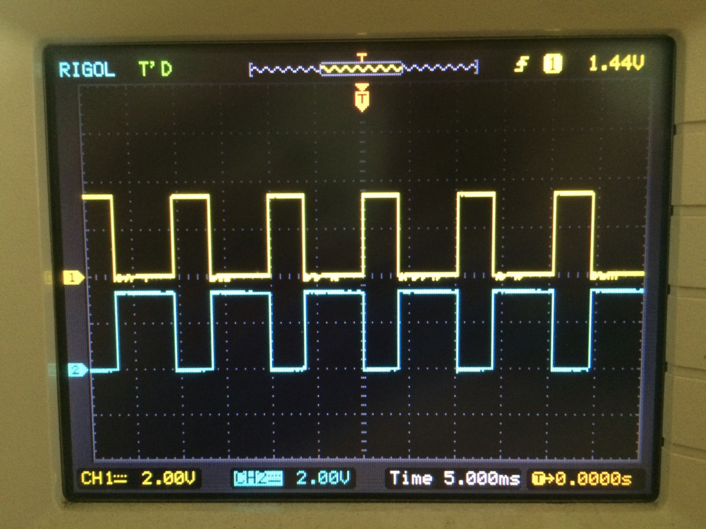

PWM互补波形输出示波器图

PWM输入捕获实验
^^^^^^^^^^^^^^^^^^^^^^^^^^^^^^^^^^^^^^^^^^
实验中，我们用通用定时器产生已知频率和占空比的PWM信号，然后用高级定时器的PWM输入模式来测量这个已知的PWM信号的频率和占空比，
通过两者的对比即可知道测量是否准确。

硬件设计
"""""""""""""""""

实验中用到两个引脚，一个是通用定时器通道用于波形输出，另一个是高级控制定时器通道用于输入捕获，实验中直接使用一根杜邦线短接即可。

软件设计
"""""""""""""""""

这里只讲解核心的部分代码，有些变量的设置，头文件的包含等并没有涉及到，完整的代码请参考本章配套的工程。我们创建了两个文件：
bsp_advance_tim.c和bsp_advance_tim.h文件用来存定时器驱动程序及相关宏定义。

编程要点
*****************

(1) 通用定时器产生PWM配置

(2) 高级定时器PWM输入配置

(3) 计算测量的频率和占空比，并打印出来比较

软件分析
*****************

宏定义

.. code-block:: c
   :caption: 宏定义
   :linenos:

    /* 通用定时器 */
    #define GENERAL_TIM TIM2
    #define GENERAL_TIM_CLK_ENABLE() \__TIM2_CLK_ENABLE()

    /* 通用定时器PWM输出 */
    /* PWM输出引脚 */
    #define GENERAL_OCPWM_PIN GPIO_PIN_5
    #define GENERAL_OCPWM_GPIO_PORT GPIOA
    #define GENERAL_OCPWM_GPIO_CLK_ENABLE() \__GPIOA_CLK_ENABLE()
    #define GENERAL_OCPWM_AF GPIO_AF1_TIM2

    /* 高级控制定时器 */
    #define ADVANCE_TIM TIM8
    #define ADVANCE_TIM_CLK_ENABLE() \__TIM8_CLK_ENABLE()

    /* 捕获/比较中断 */
    #define ADVANCE_TIM_IRQn TIM8_CC_IRQn
    #define ADVANCE_TIM_IRQHandler TIM8_CC_IRQHandler
    /* 高级控制定时器PWM输入捕获 */
    /* PWM输入捕获引脚 */
    #define ADVANCE_ICPWM_PIN GPIO_PIN_6
    #define ADVANCE_ICPWM_GPIO_PORT GPIOC
    #define ADVANCE_ICPWM_GPIO_CLK_ENABLE() \__GPIOC_CLK_ENABLE()
    #define ADVANCE_ICPWM_AF GPIO_AF3_TIM8
    #define ADVANCE_IC1PWM_CHANNEL TIM_CHANNEL_1
    #define ADVANCE_IC2PWM_CHANNEL TIM_CHANNEL_2

使用宏定义非常方便程序升级、移植。如果使用不同的定时器IO，修改这些宏即可。

定时器复用功能引脚初始化

.. code-block:: c
   :caption: 定时器复用功能引脚初始化
   :linenos:

    static void TIMx_GPIO_Config(void)
    {
        /*定义一个GPIO_InitTypeDef类型的结构体*/
        GPIO_InitTypeDef GPIO_InitStructure;

        /*开启定时器相关的GPIO外设时钟*/
        GENERAL_OCPWM_GPIO_CLK_ENABLE();
        ADVANCE_ICPWM_GPIO_CLK_ENABLE();

        /* 定时器功能引脚初始化 */
        /* 通用定时器PWM输出引脚*/
        GPIO_InitStructure.Pin = GENERAL_OCPWM_PIN;
        GPIO_InitStructure.Mode = GPIO_MODE_AF_PP;
        GPIO_InitStructure.Pull = GPIO_NOPULL;
        GPIO_InitStructure.Speed = GPIO_SPEED_HIGH;
        GPIO_InitStructure.Alternate = GENERAL_OCPWM_AF;
        HAL_GPIO_Init(GENERAL_OCPWM_GPIO_PORT, &GPIO_InitStructure);

        /* 高级定时器输入捕获引脚 */
        GPIO_InitStructure.Pin = ADVANCE_ICPWM_PIN;
        GPIO_InitStructure.Alternate = ADVANCE_ICPWM_AF;
        HAL_GPIO_Init(ADVANCE_ICPWM_GPIO_PORT, &GPIO_InitStructure);
    }

定时器通道引脚使用之前必须设定相关参数，这选择复用功能，并指定到对应的定时器。使用GPIO之前都必须开启相应端口时钟。

嵌套向量中断控制器组配置

.. code-block:: c
   :caption: NVIC配置
   :linenos:

    static void TIMx_NVIC_Configuration(void)
    {
        //设置抢占优先级，子优先级
        HAL_NVIC_SetPriority(ADVANCE_TIM_IRQn, 0, 3);
        // 设置中断来源
        HAL_NVIC_EnableIRQ(ADVANCE_TIM_IRQn);
    }

实验用到高级控制定时器捕获/比较中断，需要配置中断优先级，因为实验只用到一个中断，
所以这里对优先级配置没具体要求，只要符合中断组参数要求即可。

通用定时器PWM输出

.. code-block:: c
   :caption: 通用定时器PWM输出
   :linenos:

    static void TIM_PWMOUTPUT_Config(void)
    {
        TIM_OC_InitTypeDef TIM_OCInitStructure;
        // 开启TIMx_CLK,x[2,3,4,5,12,13,14]
        GENERAL_TIM_CLK_ENABLE();
        /* 定义定时器的句柄即确定定时器寄存器的基地址*/
        TIM_PWMOUTPUT_Handle.Instance = GENERAL_TIM;
        /* 累计 TIM_Period个后产生一个更新或者中断*/
        //当定时器从0计数到9999，即为10000次，为一个定时周期
        TIM_PWMOUTPUT_Handle.Init.Period = 10000-1;
        // 高级控制定时器时钟源TIMxCLK = HCLK=84MHz
        // 设定定时器频率为=TIMxCLK/(TIM_Prescaler+1)=100KHz
        TIM_PWMOUTPUT_Handle.Init.Prescaler = 84-1;
        // 采样时钟分频
        TIM_PWMOUTPUT_Handle.Init.ClockDivision=TIM_CLOCKDIVISION_DIV1;
        // 计数方式
        TIM_PWMOUTPUT_Handle.Init.CounterMode=TIM_COUNTERMODE_UP;
        // 重复计数器
        TIM_PWMOUTPUT_Handle.Init.RepetitionCounter=0;
        // 初始化定时器TIMx, x[1,8]
        HAL_TIM_PWM_Init(&TIM_PWMOUTPUT_Handle);

        /*PWM模式配置*/
        //配置为PWM模式1
        TIM_OCInitStructure.OCMode = TIM_OCMODE_PWM1;
        TIM_OCInitStructure.Pulse = 5000;
        TIM_OCInitStructure.OCPolarity = TIM_OCPOLARITY_HIGH;
        TIM_OCInitStructure.OCNPolarity = TIM_OCNPOLARITY_HIGH;
        TIM_OCInitStructure.OCIdleState = TIM_OCIDLESTATE_SET;
        TIM_OCInitStructure.OCNIdleState = TIM_OCNIDLESTATE_RESET;
        //初始化通道1输出PWM
        HAL_TIM_PWM_ConfigChannel(&TIM_PWMOUTPUT_Handle,
        &TIM_OCInitStructure,TIM_CHANNEL_1);
        /* 定时器通道1输出PWM */
        HAL_TIM_PWM_Start(&TIM_PWMOUTPUT_Handle,TIM_CHANNEL_1);

    }

定时器PWM输出模式配置函数很简单，看代码注释即可。这里我们设置了PWM的频率为100Hz，
即周期为10ms，占空比为：(Pulse+1)/(Period+1) = 50%。

高级控制定时PWM输入模式

.. code-block:: c
   :caption: PWM输入模式配置
   :linenos:

    static void TIM_PWMINPUT_Config(void)
    {
        TIM_IC_InitTypeDef    TIM_ICInitStructure;
        TIM_SlaveConfigTypeDef  TIM_SlaveConfigStructure;
        // 开启TIMx_CLK,x[1,8]
        ADVANCE_TIM_CLK_ENABLE();
        /* 定义定时器的句柄即确定定时器寄存器的基地址*/
        TIM_PWMINPUT_Handle.Instance = ADVANCE_TIM;
        TIM_PWMINPUT_Handle.Init.Period = 0xFFFF;
        // 高级控制定时器时钟源TIMxCLK = HCLK=168MHz
        // 设定定时器频率为=TIMxCLK/(TIM_Prescaler+1)=1MHz
        TIM_PWMINPUT_Handle.Init.Prescaler = 168-1;
        // 采样时钟分频
        TIM_PWMINPUT_Handle.Init.ClockDivision=TIM_CLOCKDIVISION_DIV1;
        // 计数方式
        TIM_PWMINPUT_Handle.Init.CounterMode=TIM_COUNTERMODE_UP;
        // 初始化定时器TIMx, x[1,8]
        HAL_TIM_IC_Init(&TIM_PWMINPUT_Handle);

        /* IC1捕获：上升沿触发 TI1FP1 */
        TIM_ICInitStructure.ICPolarity = TIM_ICPOLARITY_RISING;
        TIM_ICInitStructure.ICSelection = TIM_ICSELECTION_DIRECTTI;
        TIM_ICInitStructure.ICPrescaler = TIM_ICPSC_DIV1;
        TIM_ICInitStructure.ICFilter = 0x0;
        HAL_TIM_IC_ConfigChannel(&TIM_PWMINPUT_Handle,
                        &TIM_ICInitStructure,ADVANCE_IC1PWM_CHANNEL);
        /* IC2捕获：下降沿触发 TI1FP2 */
        TIM_ICInitStructure.ICPolarity = TIM_ICPOLARITY_FALLING;
        TIM_ICInitStructure.ICSelection = TIM_ICSELECTION_INDIRECTTI;
        TIM_ICInitStructure.ICPrescaler = TIM_ICPSC_DIV1;
        TIM_ICInitStructure.ICFilter = 0x0;

        HAL_TIM_IC_ConfigChannel(&TIM_PWMINPUT_Handle,
                        &TIM_ICInitStructure,ADVANCE_IC2PWM_CHANNEL);
        /* 选择从模式: 复位模式 */
        TIM_SlaveConfigStructure.SlaveMode = TIM_SLAVEMODE_RESET;
        /* 选择定时器输入触发: TI1FP1 */
        TIM_SlaveConfigStructure.InputTrigger = TIM_TS_TI1FP1;
        HAL_TIM_SlaveConfigSynchronization(&TIM_PWMINPUT_Handle，
                                    &TIM_SlaveConfigStructure);
        /* 使能捕获/比较2中断请求 */
        HAL_TIM_IC_Start_IT(&TIM_PWMINPUT_Handle,TIM_CHANNEL_1);
        HAL_TIM_IC_Start_IT(&TIM_PWMINPUT_Handle,TIM_CHANNEL_2);
    }

输入捕获配置中，主要初始化三个结构体，时基结构体部分很简单，看注释理解即可。关键部分是输入捕获结构体和从模式结构体的初始化。

首先，我们要选定捕获通道，这里我们用IC1，然后设置捕获信号的极性，这里我们配置为上升沿，
我们需要对捕获信号的每个有效边沿（即我们设置的上升沿）都捕获，所以我们不分频，滤波器我们也不需要用。
那么捕获通道的信号来源于哪里呢？IC1的信号可以是TI1输入的TI1FP1，也可以是从TI2输入的TI2FP1，
我们这里选择直连（DIRECTTI），即IC1映射到TI1FP1，即PWM信号从TI1输入。

我们知道，PWM输入模式，需要使用两个捕获通道，占用两个捕获寄存器。由输入通道TI1输入的信号会分成TI1FP1和TI1FP2，
具体选择哪一路信号作为捕获触发信号决定着哪个捕获通道测量的是周期。
这里我们选择TI1FP1作为捕获的触发信号，那PWM信号的周期则存储在CCR1寄存器中，
剩下的另外一路信号TI1FP2则进入IC2，CCR2寄存器存储的是脉冲宽度。

测量脉冲宽度我们选择捕获通道2，即IC2，设置捕获信号的极性，这里我们配置为下降沿，
我们需要对捕获信号的每个有效边沿（即我们设置的下降沿）都捕获，所以我们不分频，滤波器我们也不需要用。
那么捕获通道的信号来源于TI2输入的TI2FP1，这里选择间接（INDIRECTTI），PWM信号从IC1输入再进入IC2.

I2C作为间接输入模式，我们需要配置他的从模式，即从模式复位模式，定时器触发源为TIM_TS_TI1FP1，
最后使用函数HAL_TIM_SlaveConfigSynchronization进行配置。

最后启动定时器的两个通道捕获。

高级控制定时器中断服务函数

.. code-block:: c
   :caption: 高级控制定时器中断服务函数
   :linenos:

    void HAL_TIM_IC_CaptureCallback(TIM_HandleTypeDef *htim)
    {
        if (htim->Channel == HAL_TIM_ACTIVE_CHANNEL_1)
        {
            /* 获取输入捕获值 */
            IC1Value = HAL_TIM_ReadCapturedValue(&TIM_PWMINPUT_Handle,ADVANCE_IC1PWM_CHANNEL);
            IC2Value = HAL_TIM_ReadCapturedValue(&TIM_PWMINPUT_Handle,ADVANCE_IC2PWM_CHANNEL);
            if (IC1Value != 0)
            {
                /* 占空比计算 */
                DutyCycle = (float)((IC2Value+1) * 100) / (IC1Value+1);

                /* 频率计算 */
                Frequency = 168000000/168/(float)(IC1Value+1);

            }
            else
            {
                DutyCycle = 0;
                Frequency = 0;
            }

        }
    }

中断服务函数的回调函数中，我们获取CCR1和CCR2寄存器中的值，当CCR1的值不为0时，说明有效捕获到了一个周期，然后计算出频率和占空比。

如果是第一个上升沿中断，计数器会被复位，锁存到CCR1寄存器的值是0，CCR2寄存器的值也是0，无法计算频率和占空比。
当第二次上升沿到来的时候，CCR1和CCR2捕获到的才是有效的值。

主函数

.. code-block:: c
   :caption: main函数
   :linenos:

    int main(void)
    {
        /* 初始化系统时钟为168MHz */
        SystemClock_Config();
        /* 初始化串口 */
        UARTx_Config();
        /* 初始化基本定时器定时，1s产生一次中断 */
        TIMx_Configuration();

        while (1) {
            HAL_Delay(500);
            printf("IC1Value = %d IC2Value = %d ",IC1Value,IC2Value);
            printf("占空比：%0.2f%% 频率：%0.2fHz\n",DutyCycle,Frequency);
        }
    }

主函数内容非常简单，首先初始化系统时钟、调用UARTx_Config函数完成串口初始化配置，该函定义在bsp \_usart.c文件内。

接下来就是调用TIMx_Configuration函数完成定时器配置，该函数定义在bsp_advance_tim.c文件内，
它只是简单的分别调用TIMx_GPIO_Config()、TIMx_NVIC_Configuration()、TIM_PWMOUTPUT_Config()和TIM_PWMINPUT_Config()四个函数，
完成定时器引脚初始化配置，NVIC配置，通用定时器输出PWM以及高级控制定时器PWM输入模式配置。

主函数的无限循环每隔500ms输出一次捕获结果。

下载验证
"""""""""""""""""

把编译好的程序烧写到开发板，用杜邦线把通用定时器的PWM输出引脚（PA5）连接到高级定时器的PWM输入引脚（PC6）。然后用USB线连接电脑与开发板的USB转串口，打开串口调试助手，即可看到捕获到的PWM信号的频率和占空比，
具体见下图于此同时，可用示波器监控通用定时器输出的PWM信号，看下捕获到的信号是否正确，具体见下图。

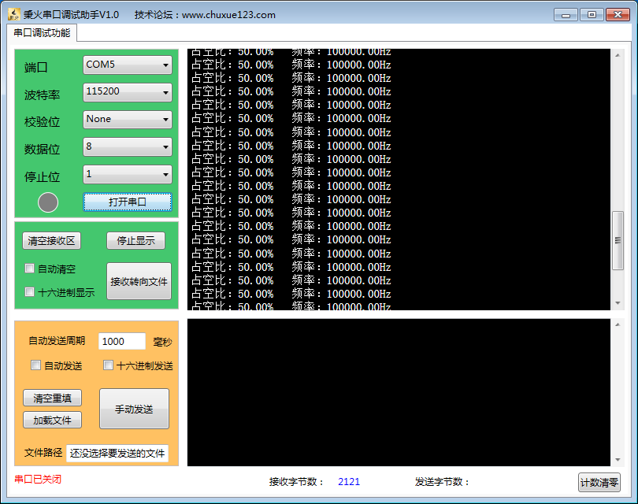

串口调试助手打印的捕获信息

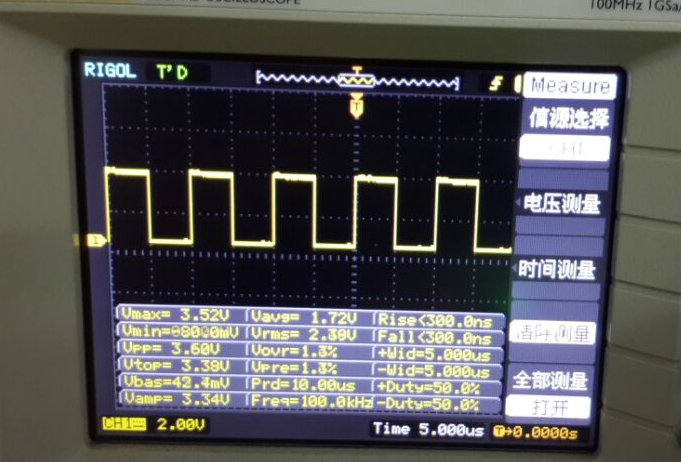

示波器监控的波形

从上面两个图中我们可以看到，程序捕获计算出的频率和占空比和示波器监控到的波形的频率和占空比跟一致，所以我们的程序是正确的。
