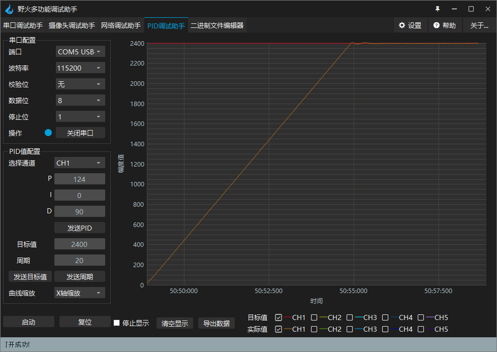

.. vim: syntax=rst

无刷电机双环控制（BLDC）
==========================================

通过前面章节的学习，我们已经大致了解六步换向方式下，无刷电机速度环、位置环等使用方法，由于六步换向方式生成的转矩并不平稳，所以力矩控制，也就是电流环的控制，实际效果不很符合预期，我们不做测试。
在实际应用中，往往需要同时对速度与位置进行精确的控制，所以这里我们介绍两环的串级PID控制例程。

硬件设计
------------------------------------------

关于详细的硬件分析在直流无刷电机章节中已经讲解过，这里不再做分析，
如有不明白请参考前面章节，这里只给出接线表。

电机主控板与无刷电机驱动板连接见下表所示。

.. list-table:: 电机与无刷电机驱动板连接
    :widths: 20 20
    :header-rows: 1
    :align: center

    * - 电机
      - 无刷电机驱动板
    * - 粗黄
      - U
    * - 粗绿
      - V
    * - 粗蓝
      - W
    * - 细红
      - +（编码器电源）
    * - 细黑
      - -（编码器电源）
    * - 细黄
      - HIU
    * - 细绿
      - HIV
    * - 细蓝
      - HIW

无刷电机驱动板与主控板连接见下表所示。

.. list-table:: 无刷电机驱动板与主控板连接
    :widths: 20 20
    :header-rows: 1
    :align: center

    * - 无刷电机驱动板
      - 主控板
    * - 5V_IN
      - 5V
    * - GND
      - GND
    * - U+
      - PI5
    * - U-
      - PH13
    * - V+
      - PI6
    * - V-
      - PH14
    * - W+
      - PI7
    * - W-
      - PH15
    * - HU
      - PH10
    * - HV
      - PH11
    * - HW
      - PH12
    * - SD
      - PE6

推荐使用配套的牛角排线直接连接驱动板和主控板。连接开发板的那端，请连接在“无刷电机驱动接口2”上。

直流电机速度环、位置环两环串级PID控制-位置式PID实现
------------------------------------------------------------
软件分析
^^^^^^^^^^^^^^^^^^^^^

编程要点
""""""""""""""""""""""""""""""""""

(1) 配置基本定时器可以产生定时中断来执行PID运算
(2) 编写位置式PID算法
(3) 编写位置环、速度环控制函数
(4) 增加上位机曲线观察相关代码
(5) 编写按键控制代码

软件部分通过前面章节的两环整合来实现代码，将速度环、位置环的实现部分添加进新的工程，本章代码在野火电机驱动例程中\\improve_part\\F407\\直流无刷刷电机-位置环速度环控制-位置式PID目录下，下面我们详细来看。

在串级PID控制中，最外环一般选择期望控制的参数的环节，例如对应速度快慢的速度环、位置的位置环，本代码的选择位置环作为最外环，位置作为控制量，期望控制电机实际位置。在主函数中，可以看出这点。

主函数
""""""""""""""""""""""""""""""""""

.. code-block:: c
  :caption: 主函数
  :linenos:

        int32_t target_location = 2400;
        
        /* 初始化系统时钟为168MHz */
        SystemClock_Config();
        
        /* HAL 库初始化 */
        HAL_Init();
        
        /* 初始化按键GPIO */
        Key_GPIO_Config();
        
        /* LED 灯初始化 */
        LED_GPIO_Config();
        
        /* 协议初始化 */
        protocol_init();
        
        /* 调试串口初始化 */
        DEBUG_USART_Config();
            
        PID_param_init();
        
        /* 周期控制定时器 50ms */
        TIMx_Configuration();

        /* 电机初始化 */
        bldcm_init();
        
        /* 设置目标位置 */
        set_pid_target(&pid_location, target_location);
            
        #if defined(PID_ASSISTANT_EN)
        set_computer_value(SEND_STOP_CMD, CURVES_CH1, NULL, 0);                // 同步上位机的启动按钮状态
        set_computer_value(SEND_TARGET_CMD, CURVES_CH1, &target_location, 1);     // 给通道 1 发送目标值
        #endif
            
            while(1)
            {
            /* 接收数据处理 */
            receiving_process();
            
            /* 扫描KEY1 */
            if( Key_Scan(KEY1_GPIO_PORT,KEY1_PIN) == KEY_ON  )
            {
            /* 使能电机 */
            set_bldcm_enable();
            
            #if defined(PID_ASSISTANT_EN) 
            set_computer_value(SEND_START_CMD, CURVES_CH1, NULL, 0);               // 同步上位机的启动按钮状态
            #endif
            }
            
            /* 扫描KEY2 */
            if( Key_Scan(KEY2_GPIO_PORT,KEY2_PIN) == KEY_ON  )
            {
            /* 停止电机 */
            set_bldcm_disable();
            
            #if defined(PID_ASSISTANT_EN) 
            set_computer_value(SEND_STOP_CMD, CURVES_CH1, NULL, 0);               // 同步上位机的启动按钮状态
            #endif
            }
            
            /* 扫描KEY3 */
            if( Key_Scan(KEY3_GPIO_PORT,KEY3_PIN) == KEY_ON  )
            {
            /* 增大占空比 */
            target_location += 12;
            
            set_pid_target(&pid_location, target_location);
            
            #if defined(PID_ASSISTANT_EN)
            set_computer_value(SEND_TARGET_CMD, CURVES_CH1,  &target_location, 1);     // 给通道 1 发送目标值
            #endif
            }
            
            /* 扫描KEY4 */
            if( Key_Scan(KEY4_GPIO_PORT,KEY4_PIN) == KEY_ON  )
            {
            target_location -= 12;
                    
            set_pid_target(&pid_location, target_location);
            
            #if defined(PID_ASSISTANT_EN)
            set_computer_value(SEND_TARGET_CMD, CURVES_CH1,  &target_location, 1);     // 给通道 1 发送目标值
            #endif
            }
            
            /* 扫描KEY5 */
            if( Key_Scan(KEY5_GPIO_PORT,KEY5_PIN) == KEY_ON  )
            {
                    
                    target_location *= -1;
                    set_pid_target(&pid_location, target_location);
                    
            #if defined(PID_ASSISTANT_EN)
            set_computer_value(SEND_TARGET_CMD, CURVES_CH1,  &target_location, 1);     // 给通道 1 发送目标值
            #endif
            }
            }
        }

主函数中，做了外设初始化的相关操作。此外还通过target_location这一变量， 设定了目标位置，即实际中电机需要转动达到的位置，通过前面位置环的学习，可以知道这一变量被赋值为宏PER_CYCLE_PULSES，意味着电机目标位置为转动一圈后达到的位置。剩余操作与前面章节一致，通过按键控制电机，略过不讲，下面看PID参数的初始化和整定的一些说明。

PID参数初始化、整定说明
""""""""""""""""""""""""""""""""""

与前面章节不同的是，由于引入了两环环控制(位置环、速度环、电流环)，所以在PID初始化时，对应的有两套PID参数。具体看代码。

.. code-block:: c
  :caption: bsp_pid.c-位置式PID参数初始化
  :linenos:

        //定义全局变量

        _pid pid_location;
        _pid pid_speed;

        /**
        * @brief  PID参数初始化
            *	@note 	无
        * @retval 无
        */
        void PID_param_init()
        {
            /* 位置相关初始化参数 */
        pid_location.target_val=0.0;				
        pid_location.actual_val=0.0;
        pid_location.err=0.0;
        pid_location.err_last=0.0;
        pid_location.integral=0.0;

        pid_location.Kp = 124;
        pid_location.Ki = 0;
        pid_location.Kd = 90;
            
            /* 速度相关初始化参数 */
            pid_speed.target_val=0.0;				
            pid_speed.actual_val=0.0;
            pid_speed.err=0.0;
            pid_speed.err_last=0.0;
            pid_speed.integral=0.0;

            pid_speed.Kp = 0.35;
            pid_speed.Ki = 0.18;
            pid_speed.Kd = 0.01;

        #if defined(PID_ASSISTANT_EN)
        float pid_temp[3] = {pid_location.Kp, pid_location.Ki, pid_location.Kd};
        set_computer_value(SEND_P_I_D_CMD, CURVES_CH1, pid_temp, 3);     // 给通道 1 发送 P I D 值
            pid_temp[0] = pid_speed.Kp;
            pid_temp[1] = pid_speed.Ki;
            pid_temp[2] = pid_speed.Kd;
        set_computer_value(SEND_P_I_D_CMD, CURVES_CH2, pid_temp, 3);     // 给通道 2 发送 P I D 值
        #endif
        }

从代码中，可以看到两套PID参数配置结构体，它们分别是位置环、速度环的PID参数配置。这三套配置，需要我们从内环到外环依次的调参。以本章工程为例，本章工程是位置环作为外环，速度环作为内环，所以进行PID调参时，从速度环开始调参。调参时参考《PID控制器参数整定》章节的方法进行PID的整定。

位置环、速度环控制函数
""""""""""""""""""""""""""""""""""

.. code-block:: c
   :caption: bsp_basic_tim.h-宏定义
   :linenos:

    #define BASIC_TIM           		  TIM6
    #define BASIC_TIM_CLK_ENABLE()   	__TIM6_CLK_ENABLE()

    #define BASIC_TIM_IRQn				    TIM6_DAC_IRQn
    #define BASIC_TIM_IRQHandler    	TIM6_DAC_IRQHandler

    /* 累计 TIM_Period个后产生一个更新或者中断*/		
      //当定时器从0计数到BASIC_PERIOD_COUNT-1，即为BASIC_PERIOD_COUNT次，为一个定时周期
    #define BASIC_PERIOD_COUNT    (50*20)

    //定时器时钟源TIMxCLK = 2 * PCLK1  
    //				PCLK1 = HCLK / 4 
    //				=> TIMxCLK=HCLK/2=SystemCoreClock/2=84MHz
    #define BASIC_PRESCALER_COUNT   (1680)

    /* 获取定时器的周期，单位ms */
    //#define __HAL_TIM_GET_PRESCALER(__HANDLE__)      ((__HANDLE__)->Instance->PSC)    // Get TIM Prescaler.
    //#define GET_BASIC_TIM_PERIOD(__HANDLE__)    (1.0/(HAL_RCC_GetPCLK2Freq()/(__HAL_TIM_GET_PRESCALER(__HANDLE__)+1)/(__HAL_TIM_GET_AUTORELOAD(__HANDLE__)+1))*1000)

    /* 以下两宏仅适用于定时器时钟源TIMxCLK=84MHz，预分频器为：1680-1 的情况 */
    #define SET_BASIC_TIM_PERIOD(T)     __HAL_TIM_SET_AUTORELOAD(&TIM_TimeBaseStructure, (T)*50 - 1)    // 设置定时器的周期（1~1000ms）
    #define GET_BASIC_TIM_PERIOD()      ((__HAL_TIM_GET_AUTORELOAD(&TIM_TimeBaseStructure)+1)/50.0)     // 获取定时器的周期，单位ms

这里封装了定时器的一些相关的宏，使用宏定义非常方便程序升级、移植。使用SET_BASIC_TIM_PERIOD(T)这个宏可以设置定时器的周期，
这样可以通过按键或者上位机来设置这个定时器的中断周期，使用GET_BASIC_TIM_PERIOD()这个宏可以得到定时器的当前周期，
不过使用的两个宏是有要求的，需要定时器时钟源的频率是84MHz，且预分频系数为1680。
如果更换定时器和修改预分频器则需要重新计算这个宏里面的参数.我们来看一下当前宏中周期的计算:84000000/1680/20 = 2500,
84000000为时钟源的频率，1680为预分频系数，50为自动重装载值，1000为定时器产生更新中断的频率，
当定时器以(84000000/1680)Hz的频率计数到50时刚好是1ms，所以只要设置自动重装载值为50的n倍减一时，
就可以得到n毫秒的更新中断，注意n是1到1000的正整数。

.. code-block:: c
  :caption: sp_bldcm_control-两环控制定时器计算PID
  :linenos: 

        /**
        * @brief  电机位置式 PID 控制实现(定时调用)
        * @param  无
        * @retval 无
        */
        void bldcm_pid_control(void)
        {
        int32_t location_actual = get_motor_location();   // 电机旋转的当前位置

            
        if (bldcm_data.is_enable)
        {
            float cont_val = 0;    // 当前控制值

                cont_val = location_pid_realize(&pid_location, location_actual);    // 进行 PID 计算
                
                /* 目标速度上限处理 */
                if (cont_val > TARGET_SPEED_MAX)
                {
                    cont_val = TARGET_SPEED_MAX;
                }
                else if (cont_val < -TARGET_SPEED_MAX)
                {
                    cont_val = -TARGET_SPEED_MAX;
                }
                
                set_pid_target(&pid_speed, cont_val);    // 设定位置的目标值
                
                #if defined(PID_ASSISTANT_EN)
                    int32_t temp = cont_val;
                    set_computer_value(SEND_TARGET_CMD, CURVES_CH2, &temp, 1);     // 给通道 2 发送目标值
                #endif
            
                
                int32_t actual_speed = get_motor_speed();
                cont_val = speed_pid_realize(&pid_speed, actual_speed);    // 进行 PID 计算
                if (cont_val < 0)
                {
                        cont_val = -cont_val;
                        bldcm_data.direction = MOTOR_REV;
                }
                else 
                {
                        bldcm_data.direction = MOTOR_FWD;
                }

                cont_val = (cont_val > PWM_PERIOD_COUNT) ? PWM_PERIOD_COUNT : cont_val;  // 上限处理

                set_bldcm_speed(cont_val);
                
            #if defined(PID_ASSISTANT_EN)
                set_computer_value(SEND_FACT_CMD, CURVES_CH2, &actual_speed, 1);      // 给通道 2 发送实际值
                set_computer_value(SEND_FACT_CMD, CURVES_CH1, &location_actual, 1);     // 给通道 1 发送实际值
            #else
                printf("实际值：%d, 目标值： %.0f，控制值: %.0f\n", location_actual, get_pid_target(), cont_val);
            #endif
            }
            
        }

代码的整体实现逻辑，是位置环作为两环控制的外环，它的PID输出作为速度环的输入，以达到两环控制的目的。增加了速度环，即增加了对速度控制的期望，将速度也纳入到了控制的环节中，这样一方面降低了干扰，另一方可以对速度进行跟随，防止超调。

从代码中可以看到，内环控制的周期与外环周期一致。

在实际应用中，还是根据实际的场景设定内外环控制周期。控制的最终效果，还是要让内环跟随外环的变化趋势最终达到稳定效果。

.. code-block:: c
  :caption: sp_bldcm_control-限值定义
  :linenos:

        #define TARGET_SPEED_MAX    1500    // 目标速度的最大值 r/m

.. code-block:: c
   :caption: bsp_pid.c-位置环位置式PID算法实现
   :linenos:
   
        float location_pid_realize(_pid *pid, float actual_val)
        {
                /*计算目标值与实际值的误差*/
            pid->err=pid->target_val-actual_val;
            pid->integral += pid->err;    // 误差累积

                /*PID算法实现*/
            pid->actual_val = pid->Kp*pid->err+pid->Ki*pid->integral+pid->Kd*(pid->err-pid->err_last);
        
                /*误差传递*/
            pid->err_last=pid->err;
            
                /*返回当前实际值*/
            return pid->actual_val;
        }

这里没有对位置环进行死区处理，因为六步换向方式下，每转一个信号都是固定的30°圆周角。

.. code-block:: c
   :caption: bsp_pid.c-速度环位置式PID算法实现
   :linenos:
   
        float speed_pid_realize(_pid *pid, float actual_val)
        {
                /*计算目标值与实际值的误差*/
            pid->err=pid->target_val-actual_val;

        //    if((pid->err<0.2f )&& (pid->err>-0.2f))
        //      pid->err = 0.0f;

            pid->integral += pid->err;    // 误差累积

                /*PID算法实现*/
            pid->actual_val = pid->Kp*pid->err+pid->Ki*pid->integral+pid->Kd*(pid->err-pid->err_last);
        
                /*误差传递*/
            pid->err_last=pid->err;
            
                /*返回当前实际值*/
            return pid->actual_val;
        }

下载验证
^^^^^^^^^^^^^^^^^^^^^

下载程序到电机开发板，我们按下Key1键启动电机(看主函数)，也可以通过上位机给PID算法输入目标值启动，开发板就能实时的通过PID运算并控制输出，见下图。

可以看到，电机按照设定的位置进行了转动。

在调试过程中，我们可以发现，电机实际的转动效果，跟随了速度环的PID曲线，说明两环调节中的各环都需要合理整定。可以预想，要是速度环是震荡调节的，那么震荡的效果必然会叠加到最终的控制效果中。理解了这点，运用中，想要电机按照怎样的速度，怎样的电流去达到指定位置，就可以通过整定速度环、电流环的PID参数来实现了。例如想要电机以缓慢的速度到达指定位置，那么速度环的PID曲线必然是缓慢上升的，稍微调整速度环参数即可看到变化，如下图。

