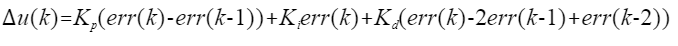

.. vim: syntax=rst

无刷电机速度环控制（BLDC）
==========================================

前面我们学习了无刷电机简单的6步PWM控制。但是我们在实际使用中并不是只是简单的PWM控制就能满足应用要求，
通常我们还需要对速度进行控制控制，如前面章节中讲到的为什么使用PID一节中列举的小车控制一样，
如果不对速度进行控制可能系统运行效果会不如预期那么好，
本章节中我们就通过速度环的PID控制来实现直流无刷电机的速度控制。

本章通过我们前面学习的位置式PID和增量式PID两种控制方式分别来实现速度环的控制，
如果还不知道什么是位置式PID和增量式PID，请务必先学习前面PID算法的通俗解说这一章节。

硬件设计
------------------------------------------

关于详细的硬件分析在直流无刷电机章节中已经讲解过，这里不再做分析，
如有不明白请参考前面章节，这里只给出接线表。

电机主控板与无刷电机驱动板连接见下表所示。

.. list-table:: 电机与无刷电机驱动板连接
    :widths: 20 20
    :header-rows: 1
    :align: center

    * - 电机
      - 无刷电机驱动板
    * - 粗黄
      - U
    * - 粗绿
      - V
    * - 粗蓝
      - W
    * - 细红
      - +（编码器电源）
    * - 细黑
      - -（编码器电源）
    * - 细黄
      - HIU
    * - 细绿
      - HIV
    * - 细蓝
      - HIW

无刷电机驱动板与主控板连接见下表所示。

.. list-table:: 无刷电机驱动板与主控板连接
    :widths: 20 20
    :header-rows: 1
    :align: center

    * - 无刷电机驱动板
      - 主控板
    * - 5V_IN
      - 5V
    * - GND
      - GND
    * - U+
      - PI5
    * - U-
      - PH13
    * - V+
      - PI6
    * - V-
      - PH14
    * - W+
      - PI7
    * - W-
      - PH15
    * - HU
      - PH10
    * - HV
      - PH11
    * - HW
      - PH12
    * - SD
      - PE6

推荐使用配套的牛角排线直接连接驱动板和主控板。连接开发板的那端，请连接在“无刷电机驱动接口2”上。

直流无刷电机速度环控制-位置式PID实现
------------------------------------------

软件设计
^^^^^^^^^^^^^^^^^^^^^^^^^^^^^^^^^

这里只讲解核心的部分代码，有些变量的设置，头文件的包含等并没有涉及到，
还有一些在前章节章节分析过的代码在这里也不在重复讲解，完整的代码请参考本章配套的工程。
本章代码在野火电机驱动例程中:\\base_code\\improve_part\\F407\\直流无刷电机-速度环控制-位置式PID目录下。

编程要点
"""""""""""""""""""""""""""""""""

(1) 高级定时器 IO 配置
(2) 定时器时基结构体TIM_HandleTypeDef配置
(3) 定时器输出比较结构体TIM_OC_InitTypeDef配置
(4) 根据电机的换相表编写换相中断回调函数
(5) 根据定时器定义电机控制相关函数.
(6) 配置基本定时器可以产生定时中断来执行PID运算
(7) 编写位置式PID算法
(8) 编写速度控制函数
(9) 增加上位机曲线观察相关代码
(10) 编写按键控制代码

软件分析
^^^^^^^^^^^^^^^^^^^^^^^^^^^^^^^^^

在编程要点中的1和2在前章节已经讲解过，这里就不在详细讲解，
如果不明白请先学习前面相关章节的内容。这里主要讲解速度的获取方法和分析PID算法的控制实现部分。

.. code-block:: c
   :caption: bsp_motor_tim.c-设置pwm输出的占空比
   :linenos:

    void set_pwm_pulse(uint16_t pulse)
    {
      /* 设置定时器通道输出 PWM 的占空比 */
      bldcm_pulse = pulse;
      
      if (motor_drive.enable_flag)
        HAL_TIM_TriggerCallback(NULL);   // 执行一次换相
    }

该函数用于设置pwm输出的占空比，本函数只是将占空比存放在了bldcm_pulse变量中，
而真正设置正空比是在HAL_TIM_TriggerCallback()函数中，
所以在电机使能时需要调用HAL_TIM_TriggerCallback()设置pwm输出的占空比。

.. code-block:: c
   :caption: bsp_motor_tim.c-更新电机速度
   :linenos:

    static void update_motor_speed(uint8_t dir_in, uint32_t time)
    {
      int speed_temp = 0;
      static uint8_t count = 0;
      static int flag = 0;

      /* 计算速度：
        电机每转一圈共用24个脉冲，(1.0/(84000000.0/128.0)为计数器的周期，(1.0/(84000000.0/128.0) * time)为时间长。
      */
      motor_drive.speed_group[count++] = (1.0 / 24.0) / ((1.0 / (84000000.0 / HALL_PRESCALER_COUNT) * time) / 60.0);

      if (count >= SPEED_FILTER_NUM)
      {
        flag = 1;
        count = 0;
      }

      speed_temp = 0;

      /* 计算近 SPEED_FILTER_NUM 次的速度平均值（滤波） */
      if (flag)
      {
        for (uint8_t c=0; c<SPEED_FILTER_NUM; c++)
        {
          speed_temp += motor_drive.speed_group[c];
        }

        motor_drive.speed = speed_temp/SPEED_FILTER_NUM;
      }
      else
      {
        for (uint8_t c=0; c<count; c++)
        {
          speed_temp += motor_drive.speed_group[c];
        }

        motor_drive.speed = speed_temp / count;
      }
      
      update_speed_dir(dir_in);
    }

该函数用于更新电机的当前速度，其中形参time传入的是霍尔传感器有变化时定时器捕获到的值，
通过time就可以计算出一次换相的时间为(1.0/(84000000.0/128.0) * time)秒，电机旋转一圈共有24个变化信号，
所以电机的速度为：(1.0 / 24.0) / ((1.0 / (84000000.0 / HALL_PRESCALER_COUNT) * time) / 60.0)RPM。
将计算得到的速度保存在motor_drive.speed_group[]数组中，计算最近SPEED_FILTER_NUM次的速度值，达到滤波的效果，
最后调用update_speed_dir()更新速度方向。

.. code-block:: c
  :caption: bsp_motor_tim.c-更新电机速度方向
  :linenos:

    static void update_speed_dir(uint8_t dir_in)
    {
      uint8_t step[6] = {1, 3, 2, 6, 4, 5};

      static uint8_t num_old = 0;
      uint8_t step_loc = 0;    // 记录当前霍尔位置
      int8_t dir = 1;
      
      for (step_loc=0; step_loc<6; step_loc++)
      {
        if (step[step_loc] == dir_in)    // 找到当前霍尔的位置
        {
          break;
        }
      }
      
      /* 端点处理 */
      if (step_loc == 0)
      {
        if (num_old == 1)
        {
          dir = 1;
        }
        else if (num_old == 5)
        {
          dir = -1;
        }
      }
      /* 端点处理 */
      else if (step_loc == 5)
      {
        if (num_old == 0)
        {
          dir = 1;
        }
        else if (num_old == 4)
        {
          dir = -1;
        }
      }
      else if (step_loc > num_old)
      {
        dir = -1;
      }
      else if (step_loc < num_old)
      {
        dir = 1;
      }
      
      num_old = step_loc;
      motor_drive.speed *= dir;
    }

该函数用于更新电机的速度方向，使用当前读到的霍尔值，与上一次读到的霍尔值进行对比，来确定方向。

.. code-block:: c
  :caption: bsp_motor_tim.c-换相实现函数
  :linenos:

    void HAL_TIM_TriggerCallback(TIM_HandleTypeDef *htim)
    {
      /* 获取霍尔传感器引脚状态,作为换相的依据 */
      uint8_t step = 0;

      step = get_hall_state();

      if (htim == &htimx_hall)   // 判断是否由触发中断产生
      {
        update_motor_speed(step, __HAL_TIM_GET_COMPARE(htim,TIM_CHANNEL_1));
        motor_drive.timeout = 0;
      }
      
      if(get_bldcm_direction() != MOTOR_FWD)
      {
        step = 7 - step;          // 换相： CW = 7 - CCW;
      }

      switch(step)
      {
        case 1:    /* W+ U- */
          __HAL_TIM_SET_COMPARE(&htimx_bldcm, TIM_CHANNEL_2, 0);                            // 通道 2 配置为 0
          HAL_GPIO_WritePin(MOTOR_OCNPWM2_GPIO_PORT, MOTOR_OCNPWM2_PIN, GPIO_PIN_RESET);    // 关闭下桥臂
        
          __HAL_TIM_SET_COMPARE(&htimx_bldcm, TIM_CHANNEL_3, bldcm_pulse);                  // 通道 3 配置的占空比
          HAL_GPIO_WritePin(MOTOR_OCNPWM1_GPIO_PORT, MOTOR_OCNPWM1_PIN, GPIO_PIN_SET);      // 开启下桥臂
          break;
        
        case 2:    /* U+  V -*/
          __HAL_TIM_SET_COMPARE(&htimx_bldcm, TIM_CHANNEL_3, 0);                            // 通道 3 配置为 0
          HAL_GPIO_WritePin(MOTOR_OCNPWM3_GPIO_PORT, MOTOR_OCNPWM3_PIN, GPIO_PIN_RESET);    // 关闭下桥臂
        
          __HAL_TIM_SET_COMPARE(&htimx_bldcm, TIM_CHANNEL_1, bldcm_pulse);                  // 通道 1 配置的占空比
          HAL_GPIO_WritePin(MOTOR_OCNPWM2_GPIO_PORT, MOTOR_OCNPWM2_PIN, GPIO_PIN_SET);      // 开启下桥臂
          break;
        
        case 3:    /* W+ V- */
          __HAL_TIM_SET_COMPARE(&htimx_bldcm, TIM_CHANNEL_1, 0);                            // 通道 1 配置为 0
          HAL_GPIO_WritePin(MOTOR_OCNPWM1_GPIO_PORT, MOTOR_OCNPWM1_PIN, GPIO_PIN_RESET);    // 关闭下桥臂
    
          __HAL_TIM_SET_COMPARE(&htimx_bldcm, TIM_CHANNEL_3, bldcm_pulse);                  // 通道 3 配置的占空比
          HAL_GPIO_WritePin(MOTOR_OCNPWM2_GPIO_PORT, MOTOR_OCNPWM2_PIN, GPIO_PIN_SET);      // 开启下桥臂
          break;
        
        case 4:    /* V+ W- */
          __HAL_TIM_SET_COMPARE(&htimx_bldcm, TIM_CHANNEL_1, 0);                            // 通道 1 配置为 0
          HAL_GPIO_WritePin(MOTOR_OCNPWM1_GPIO_PORT, MOTOR_OCNPWM1_PIN, GPIO_PIN_RESET);    // 关闭下桥臂
          
          __HAL_TIM_SET_COMPARE(&htimx_bldcm, TIM_CHANNEL_2, bldcm_pulse);                  // 通道 2 配置的占空比
          HAL_GPIO_WritePin(MOTOR_OCNPWM3_GPIO_PORT, MOTOR_OCNPWM3_PIN, GPIO_PIN_SET);      // 开启下桥臂
          break;
        
        case 5:    /* V+ U- */
          __HAL_TIM_SET_COMPARE(&htimx_bldcm, TIM_CHANNEL_3, 0);                            // 通道 3 配置为 0
          HAL_GPIO_WritePin(MOTOR_OCNPWM3_GPIO_PORT, MOTOR_OCNPWM3_PIN, GPIO_PIN_RESET);    // 关闭下桥臂

          __HAL_TIM_SET_COMPARE(&htimx_bldcm, TIM_CHANNEL_2, bldcm_pulse);                  // 通道 2 配置的占空比
          HAL_GPIO_WritePin(MOTOR_OCNPWM1_GPIO_PORT, MOTOR_OCNPWM1_PIN, GPIO_PIN_SET);      // 开启下桥臂
          break;
        
        case 6:    /* U+ W- */
          __HAL_TIM_SET_COMPARE(&htimx_bldcm, TIM_CHANNEL_2, 0);                            // 通道 2 配置为 0
          HAL_GPIO_WritePin(MOTOR_OCNPWM2_GPIO_PORT, MOTOR_OCNPWM2_PIN, GPIO_PIN_RESET);    // 关闭下桥臂

          __HAL_TIM_SET_COMPARE(&htimx_bldcm, TIM_CHANNEL_1, bldcm_pulse);                  // 通道 1 配置的占空比
          HAL_GPIO_WritePin(MOTOR_OCNPWM3_GPIO_PORT, MOTOR_OCNPWM3_PIN, GPIO_PIN_SET);      // 开启下桥臂
          break;
      }
      
      HAL_TIM_GenerateEvent(&htimx_bldcm, TIM_EVENTSOURCE_COM);    // 软件产生换相事件，此时才将配置写入
    }

换相的实现在直流无刷电机章节已经讲过这个不在赘述，在上面第7行的**if**里面判断了htim和&htimx_hall是否相等，
如果是则说明是中断产生而回调的，更新速度和检测堵转超时，如果不相等则说明是第一次启动或设置占空比时调用，
不更新速度和检测堵转超时的变量。

.. code-block:: c
   :caption: bsp_basic_tim.h-宏定义
   :linenos:

    #define BASIC_TIM           		  TIM6
    #define BASIC_TIM_CLK_ENABLE()   	__TIM6_CLK_ENABLE()

    #define BASIC_TIM_IRQn				    TIM6_DAC_IRQn
    #define BASIC_TIM_IRQHandler    	TIM6_DAC_IRQHandler

    /* 累计 TIM_Period个后产生一个更新或者中断*/		
      //当定时器从0计数到BASIC_PERIOD_COUNT-1，即为BASIC_PERIOD_COUNT次，为一个定时周期
    #define BASIC_PERIOD_COUNT    (50*100)

    //定时器时钟源TIMxCLK = 2 * PCLK1  
    //				PCLK1 = HCLK / 4 
    //				=> TIMxCLK=HCLK/2=SystemCoreClock/2=84MHz
    #define BASIC_PRESCALER_COUNT   (1680)

    /* 获取定时器的周期，单位ms */
    //#define __HAL_TIM_GET_PRESCALER(__HANDLE__)      ((__HANDLE__)->Instance->PSC)    // Get TIM Prescaler.
    //#define GET_BASIC_TIM_PERIOD(__HANDLE__)    (1.0/(HAL_RCC_GetPCLK2Freq()/(__HAL_TIM_GET_PRESCALER(__HANDLE__)+1)/(__HAL_TIM_GET_AUTORELOAD(__HANDLE__)+1))*1000)

    /* 以下两宏仅适用于定时器时钟源TIMxCLK=84MHz，预分频器为：1680-1 的情况 */
    #define SET_BASIC_TIM_PERIOD(T)     __HAL_TIM_SET_AUTORELOAD(&TIM_TimeBaseStructure, (T)*50 - 1)    // 设置定时器的周期（1~1000ms）
    #define GET_BASIC_TIM_PERIOD()      ((__HAL_TIM_GET_AUTORELOAD(&TIM_TimeBaseStructure)+1)/50.0)     // 获取定时器的周期，单位ms

这里封装了定时器的一些相关的宏，使用宏定义非常方便程序升级、移植。使用SET_BASIC_TIM_PERIOD(T)这个宏可以设置定时器的周期，
这样可以通过按键或者上位机来设置这个定时器的中断周期，使用GET_BASIC_TIM_PERIOD()这个宏可以得到定时器的当前周期，
不过使用的两个宏是有要求的，需要定时器时钟源的频率是84MHz，且预分频系数为1680。
如果更换定时器和修改预分频器则需要重新计算这个宏里面的参数.我们来看一下当前宏中周期的计算:84000000/1680/50 = 1000,
84000000为时钟源的频率，1680为预分频系数，50为自动重装载值，1000为定时器产生更新中断的频率，
当定时器以(84000000/1680)Hz的频率计数到50时刚好是1ms，所以只要设置自动重装载值为50的n倍减一时，
就可以得到n毫秒的更新中断，注意n是1到1000的正整数。

.. code-block:: c
   :caption: bsp_basic_tim.c-定时器配置函数
   :linenos:

    static void TIM_Mode_Config(void)
    {
      // 开启TIMx_CLK,x[6,7] 
      BASIC_TIM_CLK_ENABLE(); 

      TIM_TimeBaseStructure.Instance = BASIC_TIM;
      /* 累计 TIM_Period个后产生一个更新或者中断*/		
      //当定时器从0计数到BASIC_PERIOD_COUNT-1，即为BASIC_PERIOD_COUNT次，为一个定时周期
      TIM_TimeBaseStructure.Init.Period = BASIC_PERIOD_COUNT - 1;       

      //定时器时钟源TIMxCLK = 2 * PCLK1  
      //				PCLK1 = HCLK / 4 
      //				=> TIMxCLK=HCLK/2=SystemCoreClock/2=84MHz
      // 设定定时器频率为=TIMxCLK/BASIC_PRESCALER_COUNT
      TIM_TimeBaseStructure.Init.Prescaler = BASIC_PRESCALER_COUNT - 1;	
      TIM_TimeBaseStructure.Init.CounterMode = TIM_COUNTERMODE_UP;           // 向上计数
      TIM_TimeBaseStructure.Init.ClockDivision = TIM_CLOCKDIVISION_DIV1;     // 时钟分频

      // 初始化定时器TIMx, x[2,3,4,5]
      HAL_TIM_Base_Init(&TIM_TimeBaseStructure);

      // 开启定时器更新中断
      HAL_TIM_Base_Start_IT(&TIM_TimeBaseStructure);	
    }

首先定义两个定时器初始化结构体，定时器模式配置函数主要就是对这两个结构体的成员进行初始化，
然后通过调用的初始化函数HAL_TIM_Base_Init()把这些参数写入定时器的寄存器中。
有关结构体的成员介绍请参考定时器详解章节。
最后通过调用函数HAL_TIM_Base_Start_IT()使能定时器的更新中断。

.. code-block:: c
   :caption: bsp_basic_tim.c-定时器初始
   :linenos:

    void TIMx_Configuration(void)
    {
      TIMx_NVIC_Configuration();	
      
      TIM_Mode_Config();
      
    #if defined(PID_ASSISTANT_EN)
      uint32_t temp = GET_BASIC_TIM_PERIOD();     // 计算周期，单位ms
      
      set_computer_value(SEED_PERIOD_CMD, CURVES_CH1, &temp, 1);     // 给通道 1 发送目标值
    #endif
    }

该函数主要配置了定时器的中断设置和定时器模式配置，最后调用set_computer_value()函数设置了上位机的周期值，
这里只是同步一下上位机显示的周期值。PID_ASSISTANT_EN是用于选择是否使用上位机的宏，
当我们在调试阶段时可以定义这个宏，方便使用上位机（野火调试助手-PID调试助手）来观察电机的运行效果，
在完成调试后我们可以直接不定义这个宏，这样就去掉了上位机相关部分。

.. code-block:: c
   :caption: bsp_pid.c-位置式PID参数初始化
   :linenos:

    void PID_param_init()
    {
      /* 初始化参数 */
      pid.target_val=0.0;				
      pid.actual_val=0.0;
      pid.err=0.0;
      pid.err_last=0.0;
      pid.integral=0.0;

      pid.Kp = 0.3;//24
      pid.Ki = 0.2;
      pid.Kd = 0.0;

    #if defined(PID_ASSISTANT_EN)
      float pid_temp[3] = {pid.Kp, pid.Ki, pid.Kd};
      set_computer_value(SEND_P_I_D_CMD, CURVES_CH1, pid_temp, 3);     // 给通道 1 发送 P I D 值
    #endif
    }

PID_param_init()函数把结构体pid参数初始化，将目标、实际值、偏差值和积分项等初始化为0，
其中pid.Kp、pid.Ki和pid.Kd是我们配套电机运行效果相对比较好的参数，不同的电机该参数是不同的。
set_computer_value()函数用来同步上位机显示的PID值。

.. code-block:: c
   :caption: bsp_pid.c-设置速度目标值
   :linenos:

    void set_pid_target(float temp_val)
    {
      if (temp_val < 0)
      {
        temp_val = -temp_val;
        set_bldcm_direction(MOTOR_REV);
      }
      else
      {
        set_bldcm_direction(MOTOR_FWD);
      }
        
      pid.target_val = temp_val;    // 设置当前的目标值
    }

设置目标值，并且根据目标值的正负，设置电机的旋转方向。

.. code-block:: c
   :caption: bsp_pid.c-位置式PID算法实现
   :linenos:
   
    float PID_realize(float actual_val)
    {
      /*计算目标值与实际值的误差*/
      pid.err = pid.target_val - actual_val;
      pid.integral += pid.err;

      /*PID算法实现*/
      pid.actual_val = pid.Kp * pid.err + 
                       pid.Ki * pid.integral + 
                       pid.Kd * (pid.err - pid.err_last);

      /*误差传递*/
      pid.err_last = pid.err;

      /*返回当前实际值*/
      return pid.actual_val;
    }

这个函数主要实现了位置式PID算法，用传入的目标值减去实际值得到误差值得到比例项，在对误差值进行累加得到积分项，
用本次误差减去上次的误差得到微分项，然后通过前面章节介绍的位置式PID公式实现PID算法，并返回实际控制值。

.. code-block:: c
   :caption: bsp_pid.c-电机位置式PID算法实现
   :linenos:

    void bldcm_pid_control(void)
    {
      int32_t speed_actual = get_motor_speed();   // 电机旋转的当前速度

      if (bldcm_data.is_enable)
      {
        float cont_val = 0;    // 当前控制值

        cont_val = PID_realize(abs(speed_actual));
        if (cont_val < 0)
        {
          cont_val = 0;
        }

        cont_val = cont_val > PWM_MAX_PERIOD_COUNT ? PWM_MAX_PERIOD_COUNT : cont_val;
        set_bldcm_speed(cont_val);
        
      #ifdef PID_ASSISTANT_EN
        set_computer_value(SEND_FACT_CMD, CURVES_CH1, &speed_actual, 1);     // 给通道 1 发送实际值
      #else
        printf("实际值：%d. 目标值：%d\n", actual, get_pid_target());
      #endif
      }
    }

该函数在定时器的中断里定时调用默认是50毫秒调用一次，如果改变了周期那么PID三个参数也需要做相应的调整，
PID的控制周期与控制效果是息息相关的。
调用get_motor_speed()获取电机的旋转速度，单位是转每分钟。把实际速度带入PID_realize(speed_actual)进行运算，
最后对输出的结果做一个上限处理，最后用于PWM占空比的控制，最后将实际的速度值发送到上位机绘制变化的曲线。

.. code-block:: c
  :caption: protocol.c-串口数据解析
  :linenos:

    /**
    * @brief   接收的数据处理
    * @param   void
    * @return  -1：没有找到一个正确的命令.
    */
    int8_t receiving_process(void)
    {
      uint8_t frame_data[128];         // 要能放下最长的帧
      uint16_t frame_len = 0;          // 帧长度
      uint8_t cmd_type = CMD_NONE;     // 命令类型
      
      while(1)
      {
        cmd_type = protocol_frame_parse(frame_data, &frame_len);
        switch (cmd_type)
        {
          case CMD_NONE:
          {
            return -1;
          }

          case SET_P_I_D_CMD:
          {
            uint32_t temp0 = COMPOUND_32BIT(&frame_data[13]);
            uint32_t temp1 = COMPOUND_32BIT(&frame_data[17]);
            uint32_t temp2 = COMPOUND_32BIT(&frame_data[21]);
            
            float p_temp, i_temp, d_temp;
            
            p_temp = *(float *)&temp0;
            i_temp = *(float *)&temp1;
            d_temp = *(float *)&temp2;
            
            set_p_i_d(p_temp, i_temp, d_temp);    // 设置 P I D
          }
          break;

          case SET_TARGET_CMD:
          {
            int actual_temp = COMPOUND_32BIT(&frame_data[13]);    // 得到数据
            
            set_pid_target(actual_temp);    // 设置目标值
          }
          break;
          
          case START_CMD:
          {
            set_bldcm_enable();              // 启动电机
          }
          break;
          
          case STOP_CMD:
          {
            set_bldcm_disable();              // 停止电机
          }
          break;
          
          case RESET_CMD:
          {
            HAL_NVIC_SystemReset();          // 复位系统
          }
          break;
          
          case SET_PERIOD_CMD:
          {
            uint32_t temp = COMPOUND_32BIT(&frame_data[13]);     // 周期数
            SET_BASIC_TIM_PERIOD(temp);                             // 设置定时器周期1~1000ms
          }
          break;

          default: 
            return -1;
        }
      }
    }

这函数用于处理上位机发下的数据，在主函数中循环调用，可以使用上位机调整PID参数，使用上位机可以非常方便的调整PID参数，
这样可以不用每次修改PID参数时都要改代码、编译和下载代码；可以使用上位机设置目标速度；可以启动和停止电机；
可以使用上位机复位系统；可以使用上位机设置定时器的周期；具体功能的实现请参考配套工程代码。

.. code-block:: c
  :caption: main.c-主函数
  :linenos:

    int main(void) 
    {
      int16_t target_speed = 1500;
      uint8_t i = 0;
      
      /* 初始化系统时钟为168MHz */
      SystemClock_Config();
      
      /* HAL 库初始化 */
      HAL_Init();
      
      /* 初始化按键GPIO */
      Key_GPIO_Config();
      
      /* LED 灯初始化 */
      LED_GPIO_Config();
      
      /* 协议初始化 */
      protocol_init();
      
      /* 调试串口初始化 */
      DEBUG_USART_Config();
      
      PID_param_init();
      
      /* 周期控制定时器 50ms */
      TIMx_Configuration();

      /* 电机初始化 */
      bldcm_init();
      
      /* 设置目标速度 */
      set_pid_target(target_speed);

    #if defined(PID_ASSISTANT_EN)
      set_computer_value(SEND_STOP_CMD, CURVES_CH1, NULL, 0);                // 同步上位机的启动按钮状态
      set_computer_value(SEND_TARGET_CMD, CURVES_CH1, &target_speed, 1);     // 给通道 1 发送目标值
    #endif
      
      while(1)
      {
        /* 接收数据处理 */
        receiving_process();
        
        /* 扫描KEY1 */
        if( Key_Scan(KEY1_GPIO_PORT,KEY1_PIN) == KEY_ON  )
        {
          /* 使能电机 */
          set_bldcm_enable();
          
        #if defined(PID_ASSISTANT_EN) 
          set_computer_value(SEND_START_CMD, CURVES_CH1, NULL, 0);               // 同步上位机的启动按钮状态
        #endif
        }
        
        /* 扫描KEY2 */
        if( Key_Scan(KEY2_GPIO_PORT,KEY2_PIN) == KEY_ON  )
        {
          /* 停止电机 */
          set_bldcm_disable();
          
        #if defined(PID_ASSISTANT_EN) 
          set_computer_value(SEND_STOP_CMD, CURVES_CH1, NULL, 0);               // 同步上位机的启动按钮状态
        #endif
        }
        
        /* 扫描KEY3 */
        if( Key_Scan(KEY3_GPIO_PORT,KEY3_PIN) == KEY_ON  )
        {
          /* 增大占空比 */
          target_speed += 100;
          
          if(target_speed > 3500)
            target_speed = 3500;
          
          set_pid_target(target_speed);
          
        #if defined(PID_ASSISTANT_EN)
          set_computer_value(SEND_TARGET_CMD, CURVES_CH1,  &target_speed, 1);     // 给通道 1 发送目标值
        #endif
        }
        
        /* 扫描KEY4 */
        if( Key_Scan(KEY4_GPIO_PORT,KEY4_PIN) == KEY_ON  )
        {
          target_speed -= 100;

          if(target_speed < 300)
            target_speed = 300;
          
          set_pid_target(target_speed);
          
        #if defined(PID_ASSISTANT_EN)
          set_computer_value(SEND_TARGET_CMD, CURVES_CH1,  &target_speed, 1);     // 给通道 1 发送目标值
        #endif
        }
        
        /* 扫描KEY5 */
        if( Key_Scan(KEY5_GPIO_PORT,KEY5_PIN) == KEY_ON  )
        {
          /* 转换方向 */
          set_bldcm_direction( (++i % 2) ? MOTOR_FWD : MOTOR_REV);
        }
      }
    }

在主函数里面首先做了一些外设的初始化，然后通过按键可以控制电机的启动、停止和目标速度的设定，
在使用上位机的情况下这些操作也可以通过上位机完成。

下载验证
^^^^^^^^^^^^^^^^^^^^^^^^^^^^^^^^^

我们按前面介绍的硬件连接好电机和驱动板。

将程序编译下载后，使用Type-C数据线连接开发板到电脑USB，打开野火调试助手-PID调试助手来观察电机的运行效果。
按下KEY1可以启动电机，按下KEY2可以停止电机，按下KEY3可以加速，按下KEY4可以减速。按下按键改变速度后，
我们可以通过上位机来观察速度的变化情况，也可以通过上位机来控制电机。

直流无刷电机速度环控制-增量式PID实现
------------------------------------------

软件设计
^^^^^^^^^^^^^^^^^^^^^^^^^^^^^^^^^

通过前面位置式PID控制的学习，大家应该对速度环PID控制有了更深刻的理解，
这里将只讲解核心的部分代码，有些变量的设置，头文件的包含等并没有涉及到，
还有一些在前章节章节分析过的代码在这里也不在重复讲解，完整的代码请参考本节配套的工程。
本章代码在野火电机驱动例程中:\\base_code\\improve_part\\F407\\直流无刷电机-速度环控制-增量式PID目录下。

编程要点
"""""""""""""""""""""""""""""""""

(1) 高级定时器 IO 配置
(2) 定时器时基结构体TIM_HandleTypeDef配置
(3) 定时器输出比较结构体TIM_OC_InitTypeDef配置
(4) 根据电机的换相表编写换相中断回调函数
(5) 根据定时器定义电机控制相关函数.
(6) 配置基本定时器可以产生定时中断来执行PID运算
(7) 编写增量式PID算法
(8) 编写速度控制函数
(9) 增加上位机曲线观察相关代码
(10) 编写按键控制代码

软件分析
^^^^^^^^^^^^^^^^^^^^^^^^^^^^^^^^^

增量式PID实现的速度环控制和位置式PID现实的速度环控制其控制代码大部分都是一样的，
在上面的编程要点中只有第4项是不同的，其他代码均相同，所以这里将只讲解不一样的部分代码，
完整代码请参考本节配套工程。

.. code-block:: c
   :caption: bsp_pid.c-增量式PID参数初始化
   :linenos:

    void PID_param_init()
    {
      /* 初始化参数 */
      pid.target_val=500;				
      pid.actual_val=0.0;
      pid.err = 0.0;
      pid.err_last = 0.0;
      pid.err_next = 0.0;
      
      pid.Kp = 0.30;
      pid.Ki = 0.08;
      pid.Kd = 0.01;
      
    #if defined(PID_ASSISTANT_EN)
      float pid_temp[3] = {pid.Kp, pid.Ki, pid.Kd};
      set_computer_value(SEND_P_I_D_CMD, CURVES_CH1, pid_temp, 3);     // 给通道 1 发送 P I D 值
    #endif
    }

PID_param_init()函数把结构体pid参数初始化，将目标值、实际值、偏差值和上一次偏差值等初始化为0，
其中pid.err用来保存本次偏差值，pid.err_last用来保存上一次偏差值，pid.err_next用来保存上上次的偏差值；
pid.Kp、pid.Ki和pid.Kd是我们配套电机运行效果相对比较好的参数，不同的电机该参数是不同的。
set_computer_value()函数用来同步上位机显示的PID值。

.. code-block:: c
   :caption: bsp_pid.c-增量式PID算法实现
   :linenos:

    float PID_realize(float temp_val) 
    {
      /*计算目标值与实际值的误差*/
      pid.err = pid.target_val - temp_val;
      
      /*PID算法实现*/
      pid.actual_val += pid.Kp * (pid.err - pid.err_next) 
                     +  pid.Ki *  pid.err 
                     +  pid.Kd * (pid.err - 2 * pid.err_next + pid.err_last);
      /*传递误差*/
      pid.err_last = pid.err_next;
      pid.err_next = pid.err;
      
      /*返回当前实际值*/
      return pid.actual_val;
    }

这个函数主要实现了增量式PID算法，用传入的目标值减去实际值得到误差值得到当前偏差值，
在第7~9行中实现了下面公式中的增量式PID算法。

.. image:: ../media/PID_lisan6.png
   :align: center

然后进行误差传递，将本次偏差和上次偏差保存下来，供下次计算时使用。
在第7行中将计算后的结果累加到pid.actual_val变量，最后返回该变量，用于控制电机的PWM占空比。

下载验证
^^^^^^^^^^^^^^^^^^^^^^^^^^^^^^^^^

我们按前面介绍的硬件连接好电机和驱动板。

将程序编译下载后，使用Type-C数据线连接开发板到电脑USB，打开野火调试助手-PID调试助手来观察电机的运行效果。
按下KEY1可以启动电机，按下KEY2可以停止电机，按下KEY3可以加速，按下KEY4可以减速。按下按键改变速度后，
我们可以通过上位机来观察速度的变化情况，也可以通过上位机来控制电机。下图是电机运行效果图。

