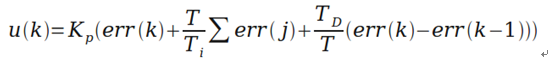

.. vim: syntax=rst

PID算法的通俗解说
==========================================

为什么使用PID？
^^^^^^^^^^^^^^^^^^^^^
PID算法是控制领域非常常见的算法，小到控制温度，大到控制飞机的飞行姿态和速度等等，都会涉及到PID控制，
在控制领域可以算是万能的算法，如果你能够掌握PID算法的控制与实现，那么已经足以应对控制领域的一般问题了。
并且在众多控制算法中PID是最能体现反馈思想的算法；可以算上是经典之作，那么如此好用的算法是不是很复杂呢？
并不是，经典不等同于复杂，往往经典的东西是都是简单的。所以放心学习就好了！

以小车速度为例，你一定会发现这样一个问题，当你刚把充满的12V电池装在小车上时，然后在程序上给了一个固定50%的占空比，
此时小车跑的很快动力很足，但是跑着跑着就慢了下来，因为电池电压的影响小车速度变慢了，在刚充满的时候12V电池50%的占空比
相当于直接作用在电机两端的电压是12V x 50% = 6V ,当使用一段时间后电池的电压变为9V，虽然程序占空比没有变，但是由于电池电压降低了，
所以作用在电机两端的电压也就变了，所以小车变慢了。那么怎么才能够使小车按照恒定速度行驶呢？其思想就是当小车速度慢了，就增加占空比。
那么速度慢多少开始增加占空比呢？怎么增加？增加多少呢？

此时，PID算法就是一个非常好的选择，对于增加多少的问题，一定要通过PID算法，因为速度和占空比到底是个什么关系，谁也不知道。
但是此时使用PID算法，通过编码器的速度反馈，可以实时的知道小车的速度是否慢了，然后利用目标速度与实际速度的误差带入算法，
即可获得当前占空比，达到控制速度的效果。

PID算法介绍
^^^^^^^^^^^^^^^^^^^^^
PID是Proportional（比例）、Integral（积分）、Differential（微分）的首字母缩写；
是一种结合比例、积分和微分三种环节于一体的闭环控制算法，它是目前为止在连续控制系统中计数最为成熟的一种控制算法；
在工业控制、机器人、无人机、机械臂和平衡车等领域有着极为重要的作用；该控制算法出现于20世纪30至40年代，至今为止经久不衰，
适用于对被控对象模型了解不清楚的场合。实际运行的经验和理论的分析都表明，运用这种控制规律对许多工业过程进行控制时，
都能得到比较满意的效果。PID控制的实质是对目标值和实际值误差进行比例、积分、微分运算后的结果用来作用在输出上。

连续控制的理想PID控制规律：

- Kp——比例增益，Kp与比例度成倒数关系
- Tt——积分时间常数
- TD——微分时间常数
- u（t）——PID控制器的输出信号
- e（t）——给定值r（t）与测量值误差

**比例（P）**

比例控制是最简单的一种控制方式，成比例的反应控制系统中输入与输出的偏差信号，只要偏差一旦产生，就立即产生控制的作用来减小产生的误差。
比例控制器的输出与输入成正比关系，能够迅速的反应偏差，偏差减小的速度取决于比例系数Kp,Kp越大偏差减小的就越快，但是极易引起震荡；
Kp减小发生震荡的可能性减小，但是调节的速度变慢，单纯的比例控制存在不能消除的静态误差，这里就需要积分来控制。

**积分（I）**

在比例控制环节产生了静态误差，在积分环节中，主要用于就是消除静态误差提高系统的无差度。积分作用的强弱，取决于积分时间常数Ti，
Ti越大积分作用越弱，反之则越强。积分控制作用的存在与偏差e(t)的存在时间有关，只要系统存在着偏差，积分环节就会不断起作用，对输入偏差进行积分，
使控制器的输出及执行器的开度不断变化，产生控制作用以减小偏差。在积分时间足够的情况下，可以完全消除静差，这时积分控制作用将维持不变。
Ti越小，积分速度越快，积分作用越强。积分作用太强会使系统超调加大，甚至使系统出现振荡。

**微分（D）**

微分环节的作用是反应系统偏差的一个变化趋势，也可以说是变化率，可以在误差来临之前提前引入一个有效的修正信号，
有利于提高输出响应的快速性,减小被控量的超调和增加系统的稳定性，虽然积分环节可以消除静态误差但是降低了系统的响应速度，
所以引入微分控制器就显得很有必要，尤其是具有较大惯性的被控对象使用PI控制器很难得到很好的动态调节品质，系统会产生较大的超调和振荡，
这时可以引入微分作用。在偏差刚出现或变化的瞬间，不仅根据偏差量作出及时反应（即比例控制作用），
还可以根据偏差量的变化趋势（速度）提前给出较大的控制作用（即微分控制作用），将偏差消灭在萌芽状态，
这样可以大大减小系统的动态偏差和调节时问，使系统的动态调节品质得以改善。微分环节有助于系统减小超调，克服振荡，
加快系统的响应速度，减小调节时间，从而改善了系统的动态性能，但微分时间常数过大，会使系统出现不稳定。
微分控制作用一个很大的缺陷是容易引入高频噪声，所有在干扰信号比较严重的流量控制系统中不宜引入微分控制作用。

PID算法的离散化
^^^^^^^^^^^^^^^^^^^^^
在前部分章节已经讲解了PID的基本形式，并且对控制系统也做出了相应的举例说明，这一节中我们将PID离散化

先看一下PID算法的一般形式：
 
.. image:: ../media/pid_lisanhua.png
   :align: center

PID框图

通过以上框图不难看出，PID控制其实就是对偏差的控制过程；如果偏差为0,则比例环节不起作用，只有存在偏差时，比例环节才起作用；
积分环节主要是用来消除静差，所谓静差，就是系统稳定后输出值和设定值之间的差值，积分环节实际上就是偏差累计的过程，
把累计的误差加到原有系统上以抵消系统造成的静差；而微分信号则反应了偏差信号的变化规律，也可以说是变化趋势，根据偏差信号的变化趋势来进行超前调节，
从而增加了系统的预知性；

接下来对PID系统进行离散化，离散化后方便在MCU上实现，连续状态的公式整理得：

- 假设采集数据的间隔时间为T,则在第 k T 时刻有：
- 误差等于第k个周期时刻的误差等于输入（目标）值减输出（实际）值，则有： **err(k)=rin(k)-rout(k)**
- 积分环节为所有时刻的误差和，则有： **err(k)+err(k+1)+err(k+2)+...**
- 微分环节为第k时刻误差的变化率，则有：**[err(k)-err(k-1)]/T**

从而获得如下PID离散形式：

则u(k)可表示为：

到此为止，PID的基本离散表达形式就推导出来了，有点经验人一定会有疑问，PID的公式不应该P*A（x）+I*B(x)+D*C(x)的形式么？
不错，以上的形式是没有化简的形式，接着推导则有：

.. image:: ../media/PID_lisan5.png
   :align: center

其中：

- k为采样的序号
- err(k)为第k次的误差
- u(k)为输出量
- Kp不变
- Ki=Kp*T/Ti
- Kd=Kp*Td/T

这样就相对方便记忆了；目前这种表达形式为位置式，也叫作全量式PID。

接下来只需两步即可推导出增量式PID：

第一步，将 k-1 带入到 k 得：

.. image:: ../media/PID_lisan3.png
   :align: center

第二步，由△u=u(k)-u(k-1)得：

.. image:: ../media/PID_lisan4.png
   :align: center

到此增量式PID表达方式就推导完了，从公式可以看出增量式PID的输出与近三次的偏差有很大关系；
需要注意的是我们推导的是对于上一次来说的调节量，也就是说当前的输出等于上一次加增加的调节量，
公式如下：

.. image:: ../media/PID_lisan6.png
   :align: center

位置式PID的C语言实现
^^^^^^^^^^^^^^^^^^^^^
在上一小节已经推导出位置式PID;这节主要讲解增量式PID的实现方法，以及C语言的算法实现举例说明。
这里只讲解核心的部分代码，有些变量的设置，头文件的包含等并没有涉及到，完整的代码请参考本章配套的工程。
我们创建了两个文件：bsp_pid.c和bsp_pid.h文件用来存放PID的程序及相关宏定义。

编程要点
*****************

(1) 定时器中断配置

(2) 串口初始化

(3) PID_realize()函数算法实现

(4) PID_param_init()参数整定

软件分析
*****************

.. code-block:: c
   :caption: pid结构体
   :linenos:

    /*pid*/
    typedef struct
    {
        float target_val;               //目标值
        float actual_val;        		//实际值
        float err;             			//定义偏差值
        float err_last;          		//定义上一个偏差值
        float Kp,Ki,Kd;          		//定义比例、积分、微分系数
        float integral;          		//定义积分值
    }_pid;

用于在使用PID时方便调用每个结构体成员，不同的PID算法只需要使用_pid重新定义即可。

.. code-block:: c
   :caption: PID参数初始化
   :linenos:

    /**
    * @brief  PID参数初始化
    *	@note 	无
    * @retval 无
    */
    void PID_param_init()
    {
        /* 初始化参数 */
        printf("PID_init begin \n");
        pid.target_val=0.0;
        pid.actual_val=0.0;
        pid.err=0.0;
        pid.err_last=0.0;
        pid.integral=0.0;
        pid.Kp = 0.31;
        pid.Ki = 0.070;
        pid.Kd = 0.3;
        printf("PID_init end \n");

    }

在这个函数中主要对PID的所有参数进行初始化，并且要初始化好Kp、Ki、Kd这三个参数，
因为这三个参数直接影响算法到达目标值的时间和状态。

.. code-block:: c
   :caption: PID算法实现
   :linenos:

    /**
        * @brief  PID算法实现
        * @param  val		目标值
        *	@note 	无
        * @retval 通过PID计算后的输出
    */
    float PID_realize(float temp_val)
    {
        /*传入目标值*/
        pid.target_val=temp_val;
        /*计算目标值与实际值的误差*/
        pid.err=pid.target_val-pid.actual_val;
        /*误差累积*/
        pid.integral+=pid.err;
        /*PID算法实现*/
        pid.actual_val=pid.Kp*pid.err+pid.Ki*pid.integral+pid.Kd*(pid.err-pid.err_last);
        /*误差传递*/
        pid.err_last=pid.err;
        /*返回当前实际值*/
        return pid.actual_val;
    }

这个函数是整个工程的核心，不算注释，10行左右的代码，就实现了位置式PID的算法；
在PID_realize(float temp_val)函数中以传参的形式将目标值传入函数中，然后所有的计算数值都是pid结构体成员的运算；
为了更好地理解从公式到算法的实现，可以仔细观察以下公式：

.. image:: ../media/PID_lisan5.png
   :align: center

这个公式就是代码第16行中的公式形式，公式和代码的计算方式基本一致，只不过在公式中第二项的Ki是使用的对误差积分，
在代码中变成了对误差的累加，虽然表达形式不一样，但是达到的效果和目的是一样的。
计算过后将误差传递用于下一次使用，并将实际值返回。

.. code-block:: c
   :caption: 定时器周期调用函数
   :linenos:

    /**
    * @brief  定时器周期调用函数
    * @param  无
        *	@note 	无
    * @retval 无
    */
    void time_period_fun()
    {
        float set_point=200.0;
        float val=PID_realize(set_point);
        printf("val,%f;act,%f\n",set_point,val);

    }

这个函数主要在定时器中断中调用，定时器配置为每20ms中断一次，PID算法每20ms执行一次，这也就是算法的周期。

将程序下载到开发板，就会看到目标值与实际值的变化，为了方便观看，我将串口打印信息复制到了下面：

.. code-block:: c
   :caption: 串口打印
   :linenos:

    欢迎使用野火 电机开发板 位置式PID算法实现 例程
    PID_init begin
    PID_init end
    val,200.000000;act,136.000000
    val,200.000000;act,-2.480003
    val,200.000000;act,136.966415
    val,200.000000;act,14.772430
    val,200.000000;act,144.110626
    val,200.000000;act,32.468391
    val,200.000000;act,151.098831
    val,200.000000;act,48.664665
    val,200.000000;act,157.332108
    val,200.000000;act,63.301472
    val,200.000000;act,162.829300
    val,200.000000;act,76.510063
    val,200.000000;act,167.667450
    val,200.000000;act,88.428955
    val,200.000000;act,171.921616
    val,200.000000;act,99.185036
    val,200.000000;act,175.659195
    val,200.000000;act,108.892838
    val,200.000000;act,178.940063
    val,200.000000;act,117.655540
    val,200.000000;act,181.817383
    val,200.000000;act,125.566086
    val,200.000000;act,184.338287
    val,200.000000;act,132.708191
    val,200.000000;act,186.544617
    val,200.000000;act,139.157257
    val,200.000000;act,188.473450
    val,200.000000;act,144.981232
    val,200.000000;act,190.157669
    val,200.000000;act,150.241318
    val,200.000000;act,191.626343
    val,200.000000;act,154.992737
    val,200.000000;act,192.905258
    val,200.000000;act,159.285156
    val,200.000000;act,194.017212
    val,200.000000;act,163.163437
    val,200.000000;act,194.982422
    val,200.000000;act,166.667938
    val,200.000000;act,195.818710
    val,200.000000;act,169.835114
    val,200.000000;act,196.541855
    val,200.000000;act,172.697739
    val,200.000000;act,197.165833
    val,200.000000;act,175.285461
    val,200.000000;act,197.702942
    val,200.000000;act,177.624939
    val,200.000000;act,198.164032
    val,200.000000;act,179.740311
    val,200.000000;act,198.558685
    val,200.000000;act,181.653259
    val,200.000000;act,198.895340
    val,200.000000;act,183.383377
    val,200.000000;act,199.181473
    val,200.000000;act,184.948349
    val,200.000000;act,199.423615
    val,200.000000;act,186.364105
    val,200.000000;act,199.627502
    val,200.000000;act,187.645065
    val,200.000000;act,199.798203
    val,200.000000;act,188.804214
    val,200.000000;act,199.940186
    val,200.000000;act,189.853226
    val,200.000000;act,200.057327
    val,200.000000;act,190.802719
    val,200.000000;act,200.153076
    val,200.000000;act,191.662262
    val,200.000000;act,200.230408
    val,200.000000;act,192.440445
    val,200.000000;act,200.291946
    val,200.000000;act,193.145111
    val,200.000000;act,200.339966
    val,200.000000;act,193.783249
    val,200.000000;act,200.376480
    val,200.000000;act,194.361237
    val,200.000000;act,200.403229
    val,200.000000;act,194.884811
    val,200.000000;act,200.421707
    val,200.000000;act,195.359161
    val,200.000000;act,200.433243
    val,200.000000;act,195.788940
    val,200.000000;act,200.438995
    val,200.000000;act,196.178421
    val,200.000000;act,200.439896
    val,200.000000;act,196.531433
    val,200.000000;act,200.436829
    val,200.000000;act,196.851425
    val,200.000000;act,200.430557
    val,200.000000;act,197.141510
    val,200.000000;act,200.421661
    val,200.000000;act,197.404541
    val,200.000000;act,200.410721
    val,200.000000;act,197.643066
    val,200.000000;act,200.398163
    val,200.000000;act,197.859390
    val,200.000000;act,200.384415
    val,200.000000;act,198.055603
    val,200.000000;act,200.369781
    val,200.000000;act,198.233597
    val,200.000000;act,200.354584
    val,200.000000;act,198.395096
    val,200.000000;act,200.339020
    val,200.000000;act,198.541656
    val,200.000000;act,200.323303
    val,200.000000;act,198.674667
    val,200.000000;act,200.307617
    val,200.000000;act,198.795380
    val,200.000000;act,200.292053
    val,200.000000;act,198.904968
    val,200.000000;act,200.276749
    val,200.000000;act,199.004471
    val,200.000000;act,200.261765
    val,200.000000;act,199.094818
    val,200.000000;act,200.247208
    val,200.000000;act,199.176865
    val,200.000000;act,200.233109
    val,200.000000;act,199.251373
    val,200.000000;act,200.219513
    val,200.000000;act,199.319061
    val,200.000000;act,200.206436
    val,200.000000;act,199.380554
    val,200.000000;act,200.193909
    val,200.000000;act,199.436432
    。。。。。。

观察数据可以面明显看到一开始相邻两个数据相差很多，震荡的比较严重，但是随着算法一直运行，目标值（val）与实际值（act）的误差越来越小，到最后，实际值的相邻两个数值在目标值上下跳动
，这里数值的微小振动就是稳态误差了，也叫作静态误差。

**位置式参数验证**

以上是一直调节的效果，对于不同的PID参数，输出调节一定是不一样的；

.. code-block:: c
   :caption: 定时器周期调用函数
   :linenos:

    /**
    * @brief  定时器周期调用函数
    * @param  无
        *	@note 	无
    * @retval 无
    */
    void time_period_fun()
    {
        static int flag=0;
        static int num=0;
        static int run_i=0;

        float set_point=200.0;
        if(!flag)
        {
            float val=PID_realize(set_point);
            printf("val,%f;act,%f\n",set_point,val);
            run_i++;
            if(abs(val-set_point)<=1)
            {
                num++;
            }
            else//必须满足连续次数
            {
                num=0;
            }
            if(num>20)//稳定次数
            {
                printf("PID算法运行%d 次后稳定\r\n",run_i);
                flag=1;
            }
        }
    }

这个函数主要验证在多少次后PID趋于稳定，趋于稳定暂时定于的条件是20次，具体看需求可以调节。

.. code-block:: c
   :caption: 调节对比
   :linenos:

    欢迎使用野火 电机开发板 位置式PID算法实现 例程     欢迎使用野火 电机开发板 位置式PID算法实现 例程
    PID_init begin                                     PID_init begin
    PID_init end                                       PID_init end
    val,200.000000;act,136.000000                      val,200.000000;act,116.000000
    val,200.000000;act,-2.480003                       val,200.000000;act,2.719994
    val,200.000000;act,136.966415                      val,200.000000;act,109.102402
    val,200.000000;act,14.772430                       val,200.000000;act,27.226210
    val,200.000000;act,144.110626                      val,200.000000;act,112.991951
    val,200.000000;act,32.468391                       val,200.000000;act,50.779129
    val,200.000000;act,151.098831                      val,200.000000;act,118.682854
    val,200.000000;act,48.664665                       val,200.000000;act,71.080315
    val,200.000000;act,157.332108                      val,200.000000;act,124.753098
    val,200.000000;act,63.301472                       val,200.000000;act,88.366516
    val,200.000000;act,162.829300                      val,200.000000;act,130.839844
    val,200.000000;act,76.510063                       val,200.000000;act,103.103676
    val,200.000000;act,167.667450                      val,200.000000;act,136.773865
    val,200.000000;act,88.428955                       val,200.000000;act,115.707054
    val,200.000000;act,171.921616                      val,200.000000;act,142.452682
    val,200.000000;act,99.185036                       val,200.000000;act,126.520699
    val,200.000000;act,175.659195                      val,200.000000;act,147.813248
    val,200.000000;act,108.892838                      val,200.000000;act,135.827515
    val,200.000000;act,178.940063                      val,200.000000;act,152.820084
    val,200.000000;act,117.655540                      val,200.000000;act,143.860748
    val,200.000000;act,181.817383                      val,200.000000;act,157.457535
    val,200.000000;act,125.566086                      val,200.000000;act,150.813339
    val,200.000000;act,184.338287                      val,200.000000;act,161.723984
    val,200.000000;act,132.708191                      val,200.000000;act,156.845627
    val,200.000000;act,186.544617                      val,200.000000;act,165.627594
    val,200.000000;act,139.157257                      val,200.000000;act,162.091339
    val,200.000000;act,188.473450                      val,200.000000;act,169.183029
    val,200.000000;act,144.981232                      val,200.000000;act,166.662567
    val,200.000000;act,190.157669                      val,200.000000;act,172.409119
    val,200.000000;act,150.241318                      val,200.000000;act,170.653610
    val,200.000000;act,191.626343                      val,200.000000;act,175.327133
    val,200.000000;act,154.992737                      val,200.000000;act,174.144089
    val,200.000000;act,192.905258                      val,200.000000;act,177.959427
    val,200.000000;act,159.285156                      val,200.000000;act,177.201508
    val,200.000000;act,194.017212                      val,200.000000;act,180.328552
    val,200.000000;act,163.163437                      val,200.000000;act,179.883377
    val,200.000000;act,194.982422                      val,200.000000;act,182.456696
    val,200.000000;act,166.667938                      val,200.000000;act,182.238785
    val,200.000000;act,195.818710                      val,200.000000;act,184.365204
    val,200.000000;act,169.835114                      val,200.000000;act,184.309799
    val,200.000000;act,196.541855                      val,200.000000;act,186.074280
    val,200.000000;act,172.697739                      val,200.000000;act,186.132584
    val,200.000000;act,197.165833                      val,200.000000;act,187.602921
    val,200.000000;act,175.285461                      val,200.000000;act,187.738327
    val,200.000000;act,197.702942                      val,200.000000;act,188.968689
    val,200.000000;act,177.624939                      val,200.000000;act,189.154007
    val,200.000000;act,198.164032                      val,200.000000;act,190.187820
    val,200.000000;act,179.740311                      val,200.000000;act,190.403030
    val,200.000000;act,198.558685                      val,200.000000;act,191.275208
    val,200.000000;act,181.653259                      val,200.000000;act,191.505676
    val,200.000000;act,198.895340                      val,200.000000;act,192.244415
    val,200.000000;act,183.383377                      val,200.000000;act,192.479706
    val,200.000000;act,199.181473                      val,200.000000;act,193.107727
    val,200.000000;act,184.948349                      val,200.000000;act,193.340500
    val,200.000000;act,199.423615                      val,200.000000;act,193.876343
    val,200.000000;act,186.364105                      val,200.000000;act,194.101547
    val,200.000000;act,199.627502                      val,200.000000;act,194.560333
    val,200.000000;act,187.645065                      val,200.000000;act,194.774704
    val,200.000000;act,199.798203                      val,200.000000;act,195.168762
    val,200.000000;act,188.804214                      val,200.000000;act,195.370300
    val,200.000000;act,199.940186                      val,200.000000;act,195.709824
    val,200.000000;act,189.853226                      val,200.000000;act,195.897446
    val,200.000000;act,200.057327                      val,200.000000;act,196.190781
    val,200.000000;act,190.802719                      val,200.000000;act,196.364136
    val,200.000000;act,200.153076                      val,200.000000;act,196.618225
    val,200.000000;act,191.662262                      val,200.000000;act,196.777359
    val,200.000000;act,200.230408                      val,200.000000;act,196.998016
    val,200.000000;act,192.440445                      val,200.000000;act,197.143372
    val,200.000000;act,200.291946                      val,200.000000;act,197.335403
    val,200.000000;act,193.145111                      val,200.000000;act,197.467575
    val,200.000000;act,200.339966                      val,200.000000;act,197.635056
    val,200.000000;act,193.783249                      val,200.000000;act,197.754852
    val,200.000000;act,200.376480                      val,200.000000;act,197.901154
    val,200.000000;act,194.361237                      val,200.000000;act,198.009399
    val,200.000000;act,200.403229                      val,200.000000;act,198.137436
    val,200.000000;act,194.884811                      val,200.000000;act,198.235001
    val,200.000000;act,200.421707                      val,200.000000;act,198.347183
    val,200.000000;act,195.359161                      val,200.000000;act,198.434937
    val,200.000000;act,200.433243                      val,200.000000;act,198.533386
    val,200.000000;act,195.788940                      val,200.000000;act,198.612152
    val,200.000000;act,200.438995                      val,200.000000;act,198.698669
    val,200.000000;act,196.178421                      val,200.000000;act,198.769272
    val,200.000000;act,200.439896                      val,200.000000;act,198.845367
    val,200.000000;act,196.531433                      val,200.000000;act,198.908569
    val,200.000000;act,200.436829                      val,200.000000;act,198.975540
    val,200.000000;act,196.851425                      val,200.000000;act,199.032059
    val,200.000000;act,200.430557                      val,200.000000;act,199.091095
    val,200.000000;act,197.141510                      val,200.000000;act,199.141556
    val,200.000000;act,200.421661                      val,200.000000;act,199.193619
    val,200.000000;act,197.404541                      val,200.000000;act,199.238663
    val,200.000000;act,200.410721                      val,200.000000;act,199.284592
    val,200.000000;act,197.643066                      val,200.000000;act,199.324753
    val,200.000000;act,200.398163                      val,200.000000;act,199.365311
    val,200.000000;act,197.859390                      val,200.000000;act,199.401123
    val,200.000000;act,200.384415                      PID算法运行95 次后稳定
    val,200.000000;act,198.055603
    val,200.000000;act,200.369781
    val,200.000000;act,198.233597
    val,200.000000;act,200.354584
    val,200.000000;act,198.395096
    val,200.000000;act,200.339020
    val,200.000000;act,198.541656
    val,200.000000;act,200.323303
    val,200.000000;act,198.674667
    val,200.000000;act,200.307617
    val,200.000000;act,198.795380
    val,200.000000;act,200.292053
    val,200.000000;act,198.904968
    val,200.000000;act,200.276749
    val,200.000000;act,199.004471
    val,200.000000;act,200.261765
    val,200.000000;act,199.094818
    val,200.000000;act,200.247208
    val,200.000000;act,199.176865
    val,200.000000;act,200.233109
    PID算法运行116 次后稳定

以上是不同的参数，调节的结果及输出次数，左边的结果是运行116次稳定，右侧却是95次就趋于稳定，代码一样，
只修改了一个参数Kp,将原来的0.31，修改为0.21就减少了调节次数，这足以证明参数的重要性。

增量式PID的C语言实现
^^^^^^^^^^^^^^^^^^^^^

看过上一节的讲解后，对于位置式的PID的算法实现应该有一个深度的认识了，在这节将对增量式PID的算法进行解析。
这里只讲解核心的部分代码，有些变量的设置，头文件的包含等并没有涉及到，完整的代码请参考本章配套的工程。
我们创建了两个文件：bsp_pid.c和bsp_pid.h文件用来存放PID的程序及相关宏定义。

编程要点
*****************

(1) 定时器中断配置

(2) 串口初始化

(3) PID_realize()函数算法实现

(4) PID_param_init()参数整定

软件分析
*****************

.. code-block:: c
   :caption: pid结构体
   :linenos:

    /*pid*/
    typedef struct
    {
        float target_val;     //目标值
        float actual_val;     //实际值
        float err;            //定义当前偏差值
        float err_next;       //定义下一个偏差值
        float err_last;       //定义最后一个偏差值
        float Kp, Ki, Kd;     //定义比例、积分、微分系数
    }_pid;

用于在使用PID时方便调用每个结构体成员，不同的PID算法只需要使用_pid重新定义即可。

.. code-block:: c
   :caption: PID参数初始化
   :linenos:

    /**
    * @brief  PID参数初始化
    *	@note 	无
    * @retval 无
    */
    void PID_param_init()
    {
            /* 初始化参数 */
        printf("PID_init begin \n");
        pid.target_val=0.0;
        pid.actual_val=0.0;
        pid.err = 0.0;
        pid.err_last = 0.0;
        pid.err_next = 0.0;
        //		pid.Kp = 0.21;
        //		pid.Ki = 0.070;
        //		pid.Kd = 0.32;
        pid.Kp = 0.21;
        pid.Ki = 0.80;
        pid.Kd = 0.01;
        printf("PID_init end \n");

    }

在这个函数中主要对PID的所有参数进行初始化，并且要初始化好Kp、Ki、Kd这三个参数，
因为这三个参数直接影响算法到达目标值的时间和状态。

.. code-block:: c
   :caption: PID算法实现
   :linenos:

    /**
    * @brief  PID算法实现
    * @param  val		目标值
    *	@note 	无
    * @retval 通过PID计算后的输出
    */
    float PID_realize(float temp_val)
    {
        /*传入目标值*/
        pid.target_val = temp_val;
        /*计算目标值与实际值的误差*/
        pid.err=pid.target_val-pid.actual_val;
        /*PID算法实现*/
        float increment_val = pid.Kp*(pid.err - pid.err_next) + pid.Ki*pid.err + pid.Kd*(pid.err - 2 * pid.err_next + pid.err_last);
        /*累加*/
        pid.actual_val += increment_val;
        /*传递误差*/
        pid.err_last = pid.err_next;
        pid.err_next = pid.err;
        /*返回当前实际值*/
        return pid.actual_val;
    }

这个函数是整个工程的核心，不算注释，10行左右的代码，就实现了位置式PID的算法；
在PID_realize(float temp_val)函数中以传参的形式将目标值传入函数中，然后所有的计算数值都是pid结构体成员的运算；
为了更好地理解从公式到算法的实现，可以仔细观察以下两个公式：

.. image:: ../media/PID_lisan4.png
   :align: center

.. image:: ../media/PID_lisan6.png
   :align: center

这两个公式就是代码第14、16行中的公式形式，公式和代码的计算方式基本一致，可以看出增量式的PID是与近三次的误差有关；
虽然代码与公式的表达形式不一样，但是达到的效果和目的是一样的。计算过后将误差传递用于下一次使用，并将实际值返回。

**增量式参数验证**

参数验证的代码与位置式的验证代码一致，在这里就不在贴出。

将代码下载到开发板，以下是修改参数后的增量式PID串口输出：

.. code-block:: c
   :caption: PID调节输出
   :linenos:

    欢迎使用野火 电机开发板 位置式PID算法实现 例程
    PID_init begin
    PID_init end
    val,200.000000;act,202.000000
    val,200.000000;act,155.979996
    val,200.000000;act,202.880203
    val,200.000000;act,190.266800
    val,200.000000;act,201.171173
    val,200.000000;act,197.818176
    val,200.000000;act,200.376801
    val,200.000000;act,199.504517
    val,200.000000;act,200.109665
    val,200.000000;act,199.886124
    val,200.000000;act,200.030212
    val,200.000000;act,199.973541
    val,200.000000;act,200.008057
    val,200.000000;act,199.993790
    val,200.000000;act,200.002106
    val,200.000000;act,199.998535
    val,200.000000;act,200.000534
    val,200.000000;act,199.999649
    val,200.000000;act,200.000137
    val,200.000000;act,199.999908
    val,200.000000;act,200.000031
    val,200.000000;act,199.999985
    val,200.000000;act,200.000015
    val,200.000000;act,200.000000
    val,200.000000;act,200.000000
    val,200.000000;act,200.000000
    val,200.000000;act,200.000000
    PID算法运行28 次后稳定

以上是修改参数后的调节输出；通过数据看到PID调节的次数更少了，次数越少说明调节的效果越好。

