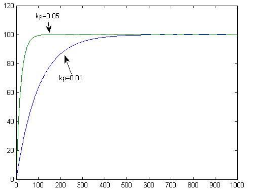
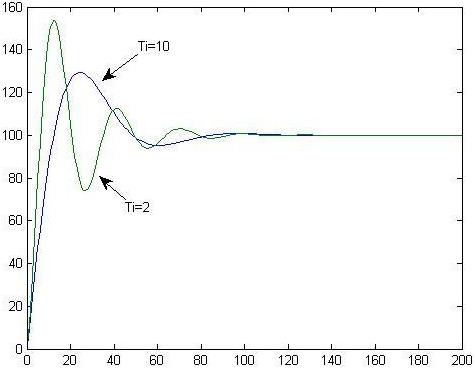
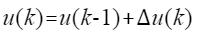

.. vim: syntax=rst

PID算法的通俗解说
==========================================

为什么使用PID？
^^^^^^^^^^^^^^^^^^^^^
PID算法是控制领域非常常见的算法，小到控制温度，大到控制飞机的飞行姿态和速度等等，都会涉及到PID控制，
在控制领域可以算是万能的算法，如果你能够掌握PID算法的控制与实现，那么已经足以应对控制领域的一般问题了。
并且在众多控制算法中PID是最能体现反馈思想的算法；可以算上是经典之作，那么如此好用的算法是不是很复杂呢？
并不是，经典不等同于复杂，往往经典的东西是都是简单的。所以放心学习就好了！

以小车速度为例，你一定会发现这样一个问题，当你刚把充满的12V电池装在小车上时，然后在程序上给了一个固定50%的占空比，
此时小车跑的很快动力很足，但是跑着跑着就慢了下来，因为电池电压的影响小车速度变慢了，在刚充满的时候12V电池50%的占空比
相当于直接作用在电机两端的电压是12V x 50% = 6V ,当使用一段时间后电池的电压变为9V，虽然程序占空比没有变，但是由于电池电压降低了，
所以作用在电机两端的电压也就变了，所以小车变慢了。那么怎么才能够使小车按照恒定速度行驶呢？其思想就是当小车速度慢了，就增加占空比。
那么速度慢多少开始增加占空比呢？怎么增加？增加多少呢？

此时，PID算法就是一个非常好的选择，对于增加多少的问题，一定要通过PID算法，因为速度和占空比到底是个什么关系，谁也不知道。
但是此时使用PID算法，通过编码器的速度反馈，可以实时的知道小车的速度是否慢了，然后利用目标速度与实际速度的误差带入算法，
即可获得当前占空比，达到控制速度的效果。

PID算法介绍
^^^^^^^^^^^^^^^^^^^^^
PID是Proportional（比例）、Integral（积分）、Differential（微分）的首字母缩写；
是一种结合比例、积分和微分三种环节于一体的闭环控制算法，它是目前为止在连续控制系统中计数最为成熟的一种控制算法；
在工业控制、机器人、无人机、机械臂和平衡车等领域有着极为重要的作用；该控制算法出现于20世纪30至40年代，至今为止经久不衰，
适用于对被控对象模型了解不清楚的场合。实际运行的经验和理论的分析都表明，运用这种控制规律对许多工业过程进行控制时，
都能得到比较满意的效果。PID控制的实质是对目标值和实际值误差进行比例、积分、微分运算后的结果用来作用在输出上。

连续控制的理想PID控制规律：

.. image:: ../media/pid_guilv.png
   :align: center

- Kp——比例增益，Kp与比例度成倒数关系
- Tt——积分时间常数
- TD——微分时间常数
- u（t）——PID控制器的输出信号
- e（t）——给定值r（t）与测量值误差

**比例（P）**

比例控制是最简单的一种控制方式，成比例的反应控制系统中输入与输出的偏差信号，只要偏差一旦产生，就立即产生控制的作用来减小产生的误差。
比例控制器的输出与输入成正比关系，能够迅速的反应偏差，偏差减小的速度取决于比例系数Kp,Kp越大偏差减小的就越快，但是极易引起震荡；
Kp减小发生震荡的可能性减小，但是调节的速度变慢，单纯的比例控制存在不能消除的静态误差，这里就需要积分来控制。

**积分（I）**

在比例控制环节产生了静态误差，在积分环节中，主要用于就是消除静态误差提高系统的无差度。积分作用的强弱，取决于积分时间常数Ti，
Ti越大积分作用越弱，反之则越强。积分控制作用的存在与偏差e(t)的存在时间有关，只要系统存在着偏差，积分环节就会不断起作用，对输入偏差进行积分，
使控制器的输出及执行器的开度不断变化，产生控制作用以减小偏差。在积分时间足够的情况下，可以完全消除静差，这时积分控制作用将维持不变。
Ti越小，积分速度越快，积分作用越强。积分作用太强会使系统超调加大，甚至使系统出现振荡。

**微分（D）**

微分环节的作用是反应系统偏差的一个变化趋势，也可以说是变化率，可以在误差来临之前提前引入一个有效的修正信号，
有利于提高输出响应的快速性,减小被控量的超调和增加系统的稳定性，虽然积分环节可以消除静态误差但是降低了系统的响应速度，
所以引入微分控制器就显得很有必要，尤其是具有较大惯性的被控对象使用PI控制器很难得到很好的动态调节品质，系统会产生较大的超调和振荡，
这时可以引入微分作用。在偏差刚出现或变化的瞬间，不仅根据偏差量作出及时反应（即比例控制作用），
还可以根据偏差量的变化趋势（速度）提前给出较大的控制作用（即微分控制作用），将偏差消灭在萌芽状态，
这样可以大大减小系统的动态偏差和调节时问，使系统的动态调节品质得以改善。微分环节有助于系统减小超调，克服振荡，
加快系统的响应速度，减小调节时间，从而改善了系统的动态性能，但微分时间常数过大，会使系统出现不稳定。
微分控制作用一个很大的缺陷是容易引入高频噪声，所有在干扰信号比较严重的流量控制系统中不宜引入微分控制作用。

**举例分析**

（1）假设一个水箱注水的实例，水位高度可以实时观测，并且要从空箱开始注入水达到某个位置，然而你可以控制的就是注水龙头的的开关大小。

那么想要将水住满只需要观察水位的实际情况与目标位置的距离，如果距离较大的话那就将水龙头开大点，如果距离较小的话就将水龙头开的小点；
随着距离越来越小，直到关闭水龙头，就可以达到将水注满的目的，对于这个简单的系统来说，只需要 **比例调节** 即可；

**Kp代表水龙头放水的粗细，水龙头越粗调节的就越快，也就是增大比例系数可以加快系统的响应。**

（2）在空箱注水的基础上，这时不仅仅需要注水，而且还需要给用户持续供水，那么在原来的数学模型上就需要添加一个常数项，具体如下：

这时候如果控制器只有一个比例环节进行调节的话，当系统处于稳态时，也就是放水的速度与注入水的速度即 **dx = 0** 时，可以推导出 **e**
的关系式，**e** 在系统稳定时不为0，液位的高度就一直会有差那么一点点，这就是系统的 **静态误差**。

当 **c** 是固定常数时，**kp** 越大就会使得 **e** 越小，即 **在有静差的情况下，增大比例系数有助于减小静差；**

具体如下图：

但是如果客户用水量不是一个常数，那么静态误差就不是很好控制了，所以需要增加注水的动态性，那么怎么增加其动态性呢？只有比例控制
是不可能了，这是需要增加积分调节。

此时相当于多加了一个水龙头，这个水龙头的使用规则是，当水位低于目标高度时就将其一直往大拧，当水位高于目标高度时就一直往小了拧，
如果用户用水的速度不变，那么数次之后便可以消除系统的静差；**这就是积分环节可以消除系统的静差**。

增加了积分调节环节，那么还有一个重要的参数，**积分时间** ；具体看下图：

从上式可以看出，积分时间越大会导致积分环节调节的就越小，相当于降低了积分调节的敏感度，在实例中可以理解为将水龙头的水管换成细水管了。
在没有到达预定的高度之前，第二个龙头会按照最大量向水箱内注入水，当达到预期的高度时，水龙头正好是拧到最大的输出，自然而然就会出现注水注多的现象，
所以多出来的这部分就是 **超调**；所以说第二个水龙头越粗，他达到预期高度也就越快，但是波折也就越多。具体如下图：

所以可以得出结论：**增大积分时间有利于减小超调，是系统稳定性增加，但是会增长消除静差的时间**；   

（3）如果用户用水量不是一个常数，是一个会变化的量，那么此时第二个水龙头根据预期高度来控制的话就显得有些滞后了，因为你很难知道下一个时间段
用户用多少水量；此时仅仅使用比例调节和积分调节就不是那么奏效了，所以我们需要引入微分调节。相当于在水箱又加了一个水龙头和一个可以漏水可控的阀门；
现在就需要观察水位的变化快慢，根据水位的快慢来决定 **放水/注水** 的速度；根据水位实际高度与预期高度差值的变化率来反应阀门的状态来达到更好的
控制水位的效果。效果如下图：

.. image:: ../media/微分图.png
   :align: center

PID算法的离散化
^^^^^^^^^^^^^^^^^^^^^

**公式推导**

先看一下PID算法的一般形式：
 
.. image:: ../media/pid_lisanhua.png
   :align: center

PID框图

通过以上框图不难看出，PID控制其实就是对偏差的控制过程；如果偏差为0,则比例环节不起作用，只有存在偏差时，比例环节才起作用；
积分环节主要是用来消除静差，所谓静差，就是系统稳定后输出值和设定值之间的差值，积分环节实际上就是偏差累计的过程，
把累计的误差加到原有系统上以抵消系统造成的静差；而微分信号则反应了偏差信号的变化规律，也可以说是变化趋势，根据偏差信号的变化趋势来进行超前调节，
从而增加了系统的预知性；

接下来对上述PID系统进行离散化，离散化后方便在程序上进行数字处理，把连续状态的公式整理得：

.. image:: ../media/pid_zhenglide.png
   :align: center

- 假设采集数据的间隔时间为T,则在第 k T 时刻有：
- 误差等于第k个周期时刻的误差等于输入（目标）值减输出（实际）值，则有： **err(k)=rin(k)-rout(k)**
- 积分环节为所有时刻的误差和，则有： **err(k)+err(k+1)+err(k+2)+...**
- 微分环节为第k时刻误差的变化率，则有：**[err(k)-err(k-1)]/T**

从而获得如下PID离散形式：

.. image:: ../media/PID_lisan1.png
   :align: center

则u(k)可表示为：

.. image:: ../media/PID_lisan2.png
   :align: center

到此为止，PID的基本离散表达形式就推导出来了，有点经验人一定会有疑问，PID的公式不应该P*A（x）+I*B(x)+D*C(x)的形式么？
不错，以上的形式是没有化简的形式，接着推导则有：

.. image:: ../media/PID_lisan5.png
   :align: center

其中：

- k为采样的序号
- err(k)为第k次的误差
- u(k)为输出量
- Kp不变
- Ki=Kp*T/Ti
- Kd=Kp*Td/T

这样就相对方便记忆了；目前这种表达形式为 **位置式** ，也叫作全量式PID。

接下来只需两步即可推导出 **增量式PID**：

第一步，将 k-1 带入到 k 得：

第二步，由△u=u(k)-u(k-1)得：

.. image:: ../media/PID_lisan4.png
   :align: center

到此 **增量式PID** 表达方式就推导完了，从公式可以看出 **增量式PID** 的输出与近三次的偏差有很大关系；
需要注意的是我们推导的是对于上一次来说的调节量，也就是说当前的输出等于上一次加增加的调节量，
公式如下：

**对比区别**

- **增量式算法** 不需要对积分项累加，控制量增量只与近几次的误差有关，计算误差对控制量计算的影响较小。
  而 **位置式算法** 要对近几次的偏差的进行积分累加，容易产生较大的累加误差；

- **增量式算法** 得出的是控制量的增量，例如在阀门控制中，只输出阀门开度的变化部分，误动作影响小，必要时还可通过逻辑判断限制或禁止本次输出，
  不会严重影响系统的工作；
  而位置式的输出直接对应对象的输出，因此对系统影响较大；

- **增量式算法** 控制输出的是控制量增量，并无积分作用，因此该方法适用于执行机构带积分部件的对象，如步进电机等，
  而 **位置式算法** 适用于执行机构不带积分部件的对象，如电液伺服阀；

- 在进行PID控制时，**位置式PID** 需要有积分限幅和输出限幅，而 **增量式PID** 只需输出限幅。

**位置式PID优缺点：**

**优点：**:位置式PID是一种非递推式算法，可直接控制执行机构（如平衡小车），u(k)的值和执行机构的实际位置（如小车当前角度）是一一对应的，
因此在执行机构不带积分部件的对象中可以很好应用;

**缺点：**:每次输出均与过去的状态有关，计算时要对e(k)进行累加，运算工作量大。

**增量式PID优缺点：**

**优点：**:

1. 误动作时影响小，必要时可用逻辑判断的方法去掉出错数据。
#. 手动/自动切换时冲击小，便于实现无扰动切换。
#. 算式中不需要累加。控制增量Δu(k)的确定仅与最近3次的采样值有关。在速度闭环控制中有很好的实时性。

**缺点：**

1. 积分截断效应大，有稳态误差；
#. 溢出的影响大。有的被控对象用增量式则不太好；

位置式PID的C语言实现
^^^^^^^^^^^^^^^^^^^^^
在上一小节已经推导出位置式PID;这节主要讲解位置式PID的实现方法，以及C语言的算法实现举例说明。
这里只讲解核心的部分代码，有些变量的设置，头文件的包含等并没有涉及到，完整的代码请参考本章配套的工程。
我们创建了两个文件：bsp_pid.c和bsp_pid.h文件用来存放PID的程序及相关宏定义。

编程要点
*****************

(1) 定时器中断配置

(2) 串口初始化

(3) PID_realize()函数算法实现

(4) PID_param_init()参数整定

软件分析
*****************

.. code-block:: c
   :caption: pid结构体
   :linenos:

    /*pid*/
    typedef struct
    {
        float target_val;               //目标值
        float actual_val;        		//实际值
        float err;             			//定义偏差值
        float err_last;          		//定义上一个偏差值
        float Kp,Ki,Kd;          		//定义比例、积分、微分系数
        float integral;          		//定义积分值
    }_pid;

用于在使用PID时方便调用每个结构体成员，不同的PID算法只需要使用_pid重新定义即可。

.. code-block:: c
   :caption: PID参数初始化
   :linenos:

    /**
    * @brief  PID参数初始化
    *	@note 	无
    * @retval 无
    */
    void PID_param_init()
    {
        /* 初始化参数 */
        printf("PID_init begin \n");
        pid.target_val=0.0;
        pid.actual_val=0.0;
        pid.err=0.0;
        pid.err_last=0.0;
        pid.integral=0.0;
        pid.Kp = 0.31;
        pid.Ki = 0.070;
        pid.Kd = 0.3;
        printf("PID_init end \n");

    }

在这个函数中主要对PID的所有参数进行初始化，并且要初始化好Kp、Ki、Kd这三个参数，
因为这三个参数直接影响算法到达目标值的时间和状态。

.. code-block:: c
   :caption: PID算法实现
   :linenos:

   /**
     * @brief  PID算法实现
     * @param  val		实际值
     * @note 	无
     * @retval 通过PID计算后的输出
     */
   float PID_realize(float temp_val)
   {
   	/*计算目标值与实际值的误差*/
       pid.err=pid.target_val-temp_val;
   	/*误差累积*/
       pid.integral+=pid.err;
   	/*PID算法实现*/
       pid.actual_val=pid.Kp*pid.err+pid.Ki*pid.integral+pid.Kd*(pid.err-pid.err_last);
   	/*误差传递*/
       pid.err_last=pid.err;
   	/*返回当前实际值*/
       return pid.actual_val;
   }

这个函数是整个工程的核心，不算注释，10行左右的代码，就实现了位置式PID的算法；
在PID_realize(float temp_val)函数中以传参的形式将实际值传入函数中，然后所有的计算数值都是pid结构体成员的运算；
为了更好地理解从公式到算法的实现，可以仔细观察以下公式：

.. image:: ../media/PID_lisan5.png
   :align: center

这个公式就是代码第16行中的公式形式，公式和代码的计算方式基本一致，只不过在公式中第二项的Ki是使用的对误差积分，
在代码中变成了对误差的累加，虽然表达形式不一样，但是达到的效果和目的是一样的。
计算过后将误差传递用于下一次使用，并将实际值返回。

.. code-block:: c
   :caption: 定时器周期调用函数
   :linenos:

    /**
    * @brief  定时器周期调用函数
    * @param  无
        *	@note 	无
    * @retval 无
    */
    void time_period_fun()
    {
    	static int num=0;
    	static int run_i=0;
    
    	if(!pid_status)
    	{
        float val=PID_realize(pid.actual_val);
    
          int temp = val; 
          // 给通道 1 发送实际值
          set_computer_value(SEED_FACT_CMD, CURVES_CH1, &temp, 1);               
         
    }
    }

这个函数主要在定时器中断中调用，定时器配置为每20ms中断一次，PID算法每20ms执行一次，这也就是算法的周期。

将程序下载到开发板，就会看到目标值与实际值的变化，为了方便观看，我将串口打印信息复制到了下面：

.. code-block:: 

观察数据可以面明显看到一开始相邻两个数据相差很多，震荡的比较严重，但是随着算法一直运行，目标值（val）与实际值（act）的误差越来越小，到最后，实际值的相邻两个数值在目标值上下跳动
，这里数值的微小振动就是稳态误差了，也叫作静态误差。

**位置式参数验证**

调节参数并观察曲线变化，对于不同的PID参数，输出调节一定是不一样的，具体如下图：

以上的曲线图是相同的代码，但是带来的效果却是大不相同，左侧的曲线明显是震荡了很多次后才趋于稳定，
但是只修改了一个参数Kp,将原来的0.31，修改为0.21曲线调节次数就明显减少了，这足以证明参数的重要性。

增量式PID的C语言实现
^^^^^^^^^^^^^^^^^^^^^

看过上一节的讲解后，对于位置式的PID的算法实现应该有一个深度的认识了，在这节将对增量式PID的算法进行解析。
这里只讲解核心的部分代码，有些变量的设置，头文件的包含等并没有涉及到，完整的代码请参考本章配套的工程。
我们创建了两个文件：bsp_pid.c和bsp_pid.h文件用来存放PID的程序及相关宏定义。

编程要点
*****************

(1) 定时器中断配置

(2) 串口初始化

(3) PID_realize()函数算法实现

(4) PID_param_init()参数整定

软件分析
*****************

.. code-block:: c
   :caption: pid结构体
   :linenos:

    /*pid*/
    typedef struct
    {
        float target_val;     //目标值
        float actual_val;     //实际值
        float err;            //定义当前偏差值
        float err_next;       //定义下一个偏差值
        float err_last;       //定义最后一个偏差值
        float Kp, Ki, Kd;     //定义比例、积分、微分系数
    }_pid;

用于在使用PID时方便调用每个结构体成员，不同的PID算法只需要使用_pid重新定义即可。

.. code-block:: c
   :caption: PID参数初始化
   :linenos:

    /**
    * @brief  PID参数初始化
    *	@note 	无
    * @retval 无
    */
    void PID_param_init()
    {
            /* 初始化参数 */
        printf("PID_init begin \n");
        pid.target_val=0.0;
        pid.actual_val=0.0;
        pid.err = 0.0;
        pid.err_last = 0.0;
        pid.err_next = 0.0;
        //		pid.Kp = 0.21;
        //		pid.Ki = 0.070;
        //		pid.Kd = 0.32;
        pid.Kp = 0.21;
        pid.Ki = 0.80;
        pid.Kd = 0.01;
        printf("PID_init end \n");

    }

在这个函数中主要对PID的所有参数进行初始化，并且要初始化好Kp、Ki、Kd这三个参数，
因为这三个参数直接影响算法到达目标值的时间和状态。

.. code-block:: c
   :caption: PID算法实现
   :linenos:

    /**
    * @brief  PID算法实现
    * @param  val		目标值
    *	@note 	无
    * @retval 通过PID计算后的输出
    */
    float PID_realize(float temp_val)
    {
        /*计算目标值与实际值的误差*/
        pid.err=pid.target_val-temp_val;
        /*PID算法实现*/
        float increment_val = pid.Kp*(pid.err - pid.err_next) + pid.Ki*pid.err + pid.Kd*(pid.err - 2 * pid.err_next + pid.err_last);
        /*累加*/
        pid.actual_val += increment_val;
        /*传递误差*/
        pid.err_last = pid.err_next;
        pid.err_next = pid.err;
        /*返回当前实际值*/
        return pid.actual_val;
    }

这个函数是整个工程的核心，不算注释，10行左右的代码，就实现了增量式PID的算法；
在PID_realize(float temp_val)函数中以传参的形式将目标值传入函数中，然后所有的计算数值都是pid结构体成员的运算；
为了更好地理解从公式到算法的实现，可以仔细观察以下两个公式：

.. image:: ../media/PID_lisan4.png
   :align: center

这两个公式就是代码第14、16行中的公式形式，公式和代码的计算方式基本一致，可以看出增量式的PID是与近三次的误差有关；
虽然代码与公式的表达形式不一样，但是达到的效果和目的是一样的。计算过后将误差传递用于下一次使用，并将实际值返回。

**增量式参数验证**

将代码下载到开发板，调节参数并观察曲线变化，对于不同的PID参数，输出调节一定是不一样的，具体如下图：

以上是修改参数后的调节输出；通过数据看到PID调节的次数更少了，次数越少说明调节的效果越好，当然也要根据具体应用来决定需要什么样的曲线。

