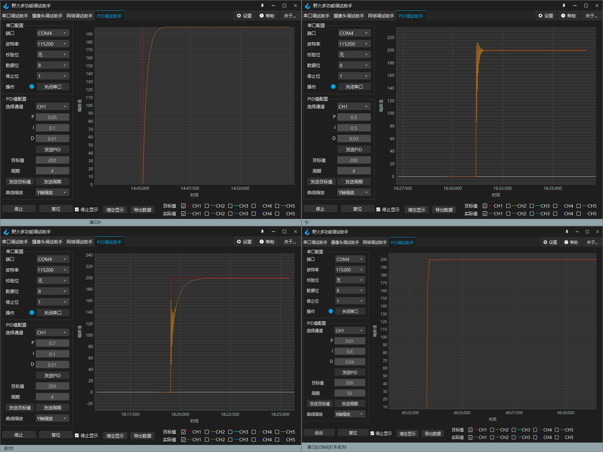

.. vim: syntax=rst

PID控制器参数整定
==========================================
算法固然重要，但是参数重要性一点也不低于算法本身，同样的算法如果PID的参数调的不好，实际的效果就是天壤之别了，所以这个章节主要对参数的整定进行讲解。

参数整定曲线图

以上是四组不同的参数对实际值的影响，其中红色的线为目标值橙色的线为实际值，但是在不同参数下却表现的大不相同，在曲线上已经变现的很明显了；
如果曲线的走势就表示电机的速度变化，可想而知，哪个参数好哪个参数不好，那么这个么重要的参数应该怎样整定呢？整定参数都与什么有关系呢？

它是根据被控过程的特性确定 PID 控制器的比例系数、积分时间和微分时间的大小；PID控制器参数整定的方法有很多，
主要分为两大类理论计算整定方法和工程整定法也叫作经验法；其中第一种是理论计算整定法主要是建立数学模型然后根据数学模型，
经过理论的计算来确定最终的控制器参数，这种方法是在所有的情况都是理想的，经过这种方法调出来的参数是不可以直接使用的，
毕竟理想化的参数考虑的太少，只能当做一个参考还需要根据实际情况修改；

第二种是工程整定方法，它主要是依赖于工程中的经验，直接在实际的控制系统的实验中进行，方法简单容易掌握，被广泛使用；

在实际的应用中用到的最多的应该就要属经验法（工程整定法），因为不同的控制系统的实际情况都是不一样的，除了理论公式一致以外其它的完全不同。
所以就需要懂得理论并付诸于实践，才能使控制系统达到好的效果。

.. image:: ../media/pidgif.gif
   :align: center

先看上图中PID曲线动态图，这个图只描述了算法中的一部分参数，可以做来参考。

PID参数整定方法
------------------

试凑法
^^^^^^^^^^^^^^^^^^^^^

采样周期的选择，要根据所设计的系统的具体情况，用试凑的方法，在试凑过程中根据各种合理的建议来预选采样周期，
多次试凑，选择性能较好的一个作为最后的采样周期。早整定参数时必须要认真的观察系统的相应情况，根据系统的响应情况来调整参数。
在调节参数时应该知道各种参数调节的特点，才能有的放矢；

- 比例调节作用特点：调节作用快，系统一出现偏差，调节器立即将偏差放大输出；
- 积分调节作用特点：积分调节作用的输出变化与输入偏差的积分成正比，积分调节作用的输出不仅取决于偏差的大小，还取决于偏差存在的时间，只要有偏差存在,
  尽管偏差可能很小，但它存在的时间越长，输出信号就越大，只有消除偏差，输出才停止变化；
- 微分调节作用特点：微分调节的输出是与被调量的变化率成正比，微分调节越大，越能提前响应，但是也会将不必要的偏差放大；

1. 先是比例（P），再积分（I），最后是微分（D）
#. 调试时，将PID参数置于影响最小的位置，即P最大，I最大，D最小；
#. 按纯比例系统整定比例度，使其得到比较理想的调节过程曲线，然后再把比例度放大1.2倍左右，将积分时间从大到小改变，使其得到较好的调节过程曲线；
#. 最后在这个积分时间下重新改变比例度，再看调节过程曲线有无改善；
#. 如有改善，可将原整定的比例度减少，改变积分时间，这样多次的反复，就可得到合适的比例度和积分时间；
#. 如果在外界的干扰下系统稳定性不好，可把比例度和积分时间适当增加一些，使系统足够稳定；
#. 将整定好的比例度和积分时间适当减小，加入微分作用，以得到超调量最小、调节作用时间最短的调节过程。

临界比例法
^^^^^^^^^^^^^^^^^^^^^

临界比例法：适用于闭环控制系统里将调节器置于纯比例的作用下，从大到小逐渐改变调节器的比例度，并且得到等幅度的震荡过程就叫做临界比例度；

1. 将调节器的积分置于最大，微分置于0，比例度系数适当即可平衡一段时间，把系统投放到自动运行中。
#. 然后将比例逐渐增大，增大到产生等幅现象，并记录下等幅时的临界比例系数和两个波峰的时间间隔。
#. 根据记下的比例系数和周期，采用经验公式，计算调节器的参数。

========== ========== ==================== =================
控制方法     Kp        Ki                   Kd
========== ========== ==================== =================
P控制       δK / 2
PI控制      δK / 2.2   Kp / (0.833 × TK)
PID控制     δK / 1.7   Kp / (0.5 × TK)      0.125 × TK × Kp
========== ========== ==================== =================

一般调节法
^^^^^^^^^^^^^^^^^^^^^

这种方法针对一般的PID控制系统所以称之为一般调节法；其中Kp是加快系统响应速度，提高系统的调节精度；Ki用于消除稳态误差；Kd改善系统的稳态性能。

.. 1. 确定比例系数
..    确定比例系数Kp 时，首先去掉PID 的积分项和微分项，可以令Ki=0、Kd=0，使之成为
..    纯比例调节。输入设定为系统允许输出最大值的60％～70％，比例系数Kp 由0 开始逐渐增
..    大，直至系统出现振荡；再反过来，从此时的比例系数Kp 逐渐减小，直至系统振荡消失。
..    记录此时的比例系数Kp，设定PID 的比例系数Kp 为当前值的60％～70％。
.. #. 确定积分系数
..    比例系数Kp 确定之后，设定一个较大的积分时间常数Ki，然后逐渐减小Ki，直至系统出现
..    振荡，然后再反过来，逐渐增大Ki，直至系统振荡消失。记录此时的Ki，设定PID 的积分
..    时间常数Ki 为当前值的150％～180％。
.. #. 确定微分系数
..    微分时间常数Kd 一般不用设定，为0 即可，此时PID 调节转换为PI 调节。如果需要设定，
..    则与确定Kp 的方法相同，取不振荡时其值的30％。
.. #. 系统空载、带载联调
..    对 PID 参数进行微调，直到满足性能要求。

a. 在输出不振荡时，增大比例增益P。
b. 在输出不振荡时，减小积分时间常数Ti。
c. 在输出不振荡时，增大微分时间常数Td。

（它们三个任何谁过大都会造成系统的震荡。）

一般步骤为：

a. 确定比例增益P ：确定比例增益P 时，首先去掉PID的积分项和微分项，一般是令Ti=0、Td=0（具体见PID的参数设定说明），使PID为纯比例调节。
   输入设定为系统允许的最大值的60%~70%，由0逐渐加大比例增益P，直至系统出现振荡；再反过来，从此时的比例增益P逐渐减小，直至系统振荡消失，
   记录此时的比例增益P，设定PID的比例增益P为当前值的60%~70%。比例增益P调试完成。
b. 确定积分时间常数Ti比例增益P确定后，设定一个较大的积分时间常数Ti的初值，然后逐渐减小Ti，直至系统出现振荡，之后在反过来，逐渐加大Ti，
   直至系统振荡消失。记录此时的Ti，设定PID的积分时间常数Ti为当前值的150%~180%。积分时间常数Ti调试完成。
c. 确定积分时间常数Td 积分时间常数Td一般不用设定，为0即可。若要设定，与确定 P和Ti的方法相同，取不振荡时的30%。
d. 系统空载、带载联调，再对PID参数进行微调，直至满足要求：理想时间两个波，前高后低4比1。

采样周期选择
^^^^^^^^^^^^^^^^^^^^^

采样周期该怎么选择？采样周期越短控制的效果越接近于连续，对于大多数算法缩短采样周期可使控制回路性能改善，但采样周期缩短时，
频繁的采样必然会占用较多的计算工作时间，同时也会增加计算的负担，而对有些变化缓慢的受控对象无需很高的采样频率即可满意地进行跟踪，
过多的采样反而没有多少实际意义。

以一个轮子的转动为例，根据耐奎斯特采样定理可知：假设这个轮子以每秒45度来转动，那么每个轴返回原位需要8秒（采样周期），
那如果我们在8、16、24秒时用相机拍照是不是拍到的照片都是静止不动的？这是因为在采样的周期内，车轮旋转的证书周期都会回到原位，
不论旋转方向如何都会回到原位；如果现在减少拍照时间，每4秒钟拍一张照片则会在照片中发现轮子正在旋转，但是不能区分旋转方向。
如果3秒钟拍一张照片那么无论是顺时针还是逆时针都可以从照片中观察到轮子的相位变化。这就是Nyquist-Shannon采样定理，
我们希望同时看到轮子的旋转和相位变化，采样周期要小于整数周期的1/2，采样的频率应该大于原始频率的2倍。

.. image:: ../media/lunzi.png
   :align: center

以上的调参方法只是一些工程上一些普遍的方法，但是调参时更注重的应该是原理和影响因素，不同的控制系统因素不同。
例如电机控速系统，影响参数的有电源电压电流还有反馈的精度，具体参数要根据实际具体调整，才能更有效。

使用野火上位机整定PID
------------------------------------

工欲善其事必先利其器，新版的野火多功能调试助手中，带有了PID调试助手，如上图所示。通过PID调试助手，我们可以很方便的通过上位机对PID参数进行整定。先简要的介绍一下上位机的功能。

野火PID上位机通过串口与开发板相关联，通过特定的协议，可以同步上位机与下位机的指令与数据，具体的同步方式后文中会详细讲到。

野火上位机支持多达10个通道的信号采集，可以同时获取5组PID的调试情况（目标值与实际值为一组）。此外，调试过程中的数据，也可以导出为.csv文件，方便数据采集归纳。

在PID调试助手的左侧如上图所示。我们可以配置PID调整的通道，将配置好的PID参数发送给上位机。当然，界面中的目标值、周期也都是可调的。

在调试过程中，如果需要细致的查看调整曲线，我们可以通过勾选“停止显示”复选框，在曲线缩放选项中，选择X轴或Y轴进行调整，通过在波形显示界面滚动鼠标滚轮，即可完成缩放操作。

在界面下方，分别提供了两个功能按钮：启动、复位，方便用户在调试的时候对下位机进行操作。

当然，以上这些操作，都需要用户在下位机中实现特定的协议和收发操作，野火官方的驱动例程均已实现。如果用户想将自己的工程与野火上位机连接起来，移植协议也是很方便的，见下文。

在STM32下位机解析上位机协议
------------------------------------

阅读本小节之前，建议先阅读本章最后一节----野火PID调试上位机协议说明，对协议建立一个初步的印象，不需要仔细阅读，大致知道协议内容即可。

在STM32下位机中，野火电机的官方例程里，已经配套好了协议的解析和收发操作，用户如果想使用野火的PID调试助手来调试自己的工程，只需做一些简单的移植操作就可以了，这里我们详细的讲解协议解析的过程。

函数讲解说明
^^^^^^^^^^^^^^^^^^^^^
代码位于工程目录\\User\\protocol\\protocol.h文件

.. code-block:: c
   :name: 上位机函数讲解说明(工程目录\\User\\protocol\\protocol.h)
   :caption: 上位机函数讲解说明(工程目录\\User\\protocol\\protocol.h)
   :linenos:

   /**
   * @brief   接收数据处理
   * @param   *data:  要计算的数据的数组.
   * @param   data_len: 数据的大小
   * @return  void.
   */
   void protocol_data_recv(uint8_t *data, uint16_t data_len);

   /**
   * @brief   初始化接收协议
   * @param   void
   * @return  初始化结果.
   */
   int32_t protocol_init(void);

   /**
   * @brief   接收的数据处理
   * @param   void
   * @return  -1：没有找到一个正确的命令.
   */
   int8_t receiving_process(void);

   /**
   * @brief 设置上位机的值
   * @param cmd：命令
   * @param ch: 曲线通道
   * @param data：参数指针
   * @param num：参数个数
   * @retval 无
   */
   void set_computer_value(uint8_t cmd, uint8_t ch, void *data, uint8_t num);

下位机要做的操作无非2个，接受数据，发送数据。再细化一点，就有解析协议和数据包，发送指令给上位机同步数据，这四个函数大体要做的功能就是这些，下面我们具体看他们怎么工作。

初始化函数
^^^^^^^^^^^^^^^^^^^^^

.. code-block:: c
   :name: protocol_init()函数(工程目录\\User\\protocol\\protocol.c)
   :caption: protocol_init()函数(工程目录\\User\\protocol\\protocol.c)
   :linenos:

   struct prot_frame_parser_t
   {
      uint8_t *recv_ptr;
      uint16_t r_oft;
      uint16_t w_oft;
      uint16_t frame_len;
      uint16_t found_frame_head;
   };

   static struct prot_frame_parser_t parser;

   static uint8_t recv_buf[PROT_FRAME_LEN_RECV];
   /**
   * @brief   初始化接收协议
   * @param   void
   * @return  初始化结果.
   */
   int32_t protocol_init(void)
   {
      memset(&parser, 0, sizeof(struct prot_frame_parser_t));
      
      /* 初始化分配数据接收与解析缓冲区*/
      parser.recv_ptr = recv_buf;
   
      return 0;
   }

下位机中使用了环形缓冲区的数据结构来做数据的存储，所以在使用前要对缓冲区进行初始化操作，这里使用了一个prot_frame_parser_t结构体来记录缓冲区当前的操作信息。

(1) uint8_t \*recv_ptr ：记录数据缓冲区的地址
(2) uint16_t r_oft ： 记录当前缓冲区读指针所在位置
(3) uint16_t w_oft ： 记录当前缓冲区写指针所在位置
(4) uint16_t frame_len ： 记录接收到的帧长度，就是一个数据包的长度
(5) uint16_t found_frame_head ： 标志位，可以判断是否找到帧头

如果对环形缓冲区的操作不了解，请掌握数据结构一些相关的知识。

获取数据包
^^^^^^^^^^^^^^^^^^^^^

在串口中断中，调用了protocol_data_recv()函数，来将串口接收到的数据，存放在缓冲区内，并偏移写指针。

.. code-block:: c
   :name: protocol_data_recv()函数(工程目录\\User\\protocol\\protocol.c)
   :caption: protocol_data_recv()函数(工程目录\\User\\protocol\\protocol.c)
   :linenos:

   /**
   * @brief   接收数据处理
   * @param   *data:  要计算的数据的数组.
   * @param   data_len: 数据的大小
   * @return  void.
   */
   void protocol_data_recv(uint8_t *data, uint16_t data_len)
   {
      recvbuf_put_data(parser.recv_ptr, PROT_FRAME_LEN_RECV, parser.w_oft, data, data_len);    // 接收数据
      parser.w_oft = (parser.w_oft + data_len) % PROT_FRAME_LEN_RECV;                          // 计算写偏移
   }

解析数据包并处理
^^^^^^^^^^^^^^^^^^^^^

.. code-block:: c
   :name: receiving_process()函数(工程目录\\User\\protocol\\protocol.c)
   :caption: receiving_process()函数(工程目录\\User\\protocol\\protocol.c)
   :linenos:

   /**
   * @brief   接收的数据处理
   * @param   void
   * @return  -1：没有找到一个正确的命令.
   */
   int8_t receiving_process(void)
   {
   uint8_t frame_data[128];         // 要能放下最长的帧
   uint16_t frame_len = 0;          // 帧长度
   uint8_t cmd_type = CMD_NONE;     // 命令类型
   
   while(1)
   {
      cmd_type = protocol_frame_parse(frame_data, &frame_len);
      switch (cmd_type)
      {
         case CMD_NONE:
         {
         return -1;
         }

         case SET_P_I_D_CMD:
         {
         uint32_t temp0 = COMPOUND_32BIT(&frame_data[13]);
         uint32_t temp1 = COMPOUND_32BIT(&frame_data[17]);
         uint32_t temp2 = COMPOUND_32BIT(&frame_data[21]);
         
         float p_temp, i_temp, d_temp;
         
         p_temp = *(float *)&temp0;
         i_temp = *(float *)&temp1;
         d_temp = *(float *)&temp2;
         
         set_p_i_d(p_temp, i_temp, d_temp);    // 设置 P I D
         }
         break;

         case SET_TARGET_CMD:
         {
         int actual_temp = COMPOUND_32BIT(&frame_data[13]);    // 得到数据
         
         set_point = (actual_temp);    // 设置目标值
         }
         break;
         
         case START_CMD:
         {
           set_motor_enable();              // 启动电机
         }
         break;
         
         case STOP_CMD:
         {
           set_motor_disable();              // 停止电机
         }
         break;
         
         case RESET_CMD:
         {
         HAL_NVIC_SystemReset();          // 复位系统
         }
         break;
         
         case SET_PERIOD_CMD:
         {
         uint32_t temp = COMPOUND_32BIT(&frame_data[13]);     // 周期数
         SET_BASIC_TIM_PERIOD(temp);                             // 设置定时器周期1~1000ms
         }
         break;

         default: 
         return -1;
      }
   }
   }
   
该函数实现的功能为接收一帧数据并解析内容，在主函数中轮询调用。我们可以看到在函数中调用了protocol_frame_parse函数来解析数据，根据获取到的指令类型，最后在Switch操作中做出对应操作。

下面我们来看protocol_frame_parse()函数是如何解析一帧数据的。

.. code-block:: c
   :name: protocol_frame_parse()函数(工程目录\\User\\protocol\\protocol.c)
   :caption: protocol_frame_parse()函数(工程目录\\User\\protocol\\protocol.c)
   :linenos:

   /**
   * @brief   查询帧类型（命令）
   * @param   *data:  帧数据
   * @param   data_len: 帧数据的大小
   * @return  帧类型（命令）.
   */
   static uint8_t protocol_frame_parse(uint8_t *data, uint16_t *data_len)
   {
      uint8_t frame_type = CMD_NONE;
      uint16_t need_to_parse_len = 0;
      int16_t header_oft = -1;
      uint8_t checksum = 0;
      
      need_to_parse_len = recvbuf_get_len_to_parse(parser.frame_len, PROT_FRAME_LEN_RECV, parser.r_oft, parser.w_oft);    // 得到为解析的数据长度
      if (need_to_parse_len < 9)     // 肯定还不能同时找到帧头和帧长度
         return frame_type;

      /* 还未找到帧头，需要进行查找*/
      if (0 == parser.found_frame_head)
      {
         /* 同步头为四字节，可能存在未解析的数据中最后一个字节刚好为同步头第一个字节的情况，
            因此查找同步头时，最后一个字节将不解析，也不会被丢弃*/
         header_oft = recvbuf_find_header(parser.recv_ptr, PROT_FRAME_LEN_RECV, parser.r_oft, need_to_parse_len);
         if (0 <= header_oft)
         {
               /* 已找到帧头*/
               parser.found_frame_head = 1;
               parser.r_oft = header_oft;
            
               /* 确认是否可以计算帧长*/
               if (recvbuf_get_len_to_parse(parser.frame_len, PROT_FRAME_LEN_RECV,
                     parser.r_oft, parser.w_oft) < 9)
                  return frame_type;
         }
         else 
         {
               /* 未解析的数据中依然未找到帧头，丢掉此次解析过的所有数据*/
               parser.r_oft = ((parser.r_oft + need_to_parse_len - 3) % PROT_FRAME_LEN_RECV);
               return frame_type;
         }
      }
      
      /* 计算帧长，并确定是否可以进行数据解析*/
      if (0 == parser.frame_len) 
      {
         parser.frame_len = get_frame_len(parser.recv_ptr, parser.r_oft);
         if(need_to_parse_len < parser.frame_len)
               return frame_type;
      }

      /* 帧头位置确认，且未解析的数据超过帧长，可以计算校验和*/
      if ((parser.frame_len + parser.r_oft - PROT_FRAME_LEN_CHECKSUM) > PROT_FRAME_LEN_RECV)
      {
         /* 数据帧被分为两部分，一部分在缓冲区尾，一部分在缓冲区头 */
         checksum = check_sum(checksum, parser.recv_ptr + parser.r_oft, 
                  PROT_FRAME_LEN_RECV - parser.r_oft);
         checksum = check_sum(checksum, parser.recv_ptr, parser.frame_len -
                  PROT_FRAME_LEN_CHECKSUM + parser.r_oft - PROT_FRAME_LEN_RECV);
      }
      else 
      {
         /* 数据帧可以一次性取完*/
         checksum = check_sum(checksum, parser.recv_ptr + parser.r_oft, parser.frame_len - PROT_FRAME_LEN_CHECKSUM);
      }

      if (checksum == get_frame_checksum(parser.recv_ptr, parser.r_oft, parser.frame_len))
      {
         /* 校验成功，拷贝整帧数据 */
         if ((parser.r_oft + parser.frame_len) > PROT_FRAME_LEN_RECV) 
         {
               /* 数据帧被分为两部分，一部分在缓冲区尾，一部分在缓冲区头*/
               uint16_t data_len_part = PROT_FRAME_LEN_RECV - parser.r_oft;
               memcpy(data, parser.recv_ptr + parser.r_oft, data_len_part);
               memcpy(data + data_len_part, parser.recv_ptr, parser.frame_len - data_len_part);
         }
         else 
         {
               /* 数据帧可以一次性取完*/
               memcpy(data, parser.recv_ptr + parser.r_oft, parser.frame_len);
         }
         *data_len = parser.frame_len;
         frame_type = get_frame_type(parser.recv_ptr, parser.r_oft);

         /* 丢弃缓冲区中的命令帧*/
         parser.r_oft = (parser.r_oft + parser.frame_len) % PROT_FRAME_LEN_RECV;
      }
      else
      {
         /* 校验错误，说明之前找到的帧头只是偶然出现的废数据*/
         parser.r_oft = (parser.r_oft + 1) % PROT_FRAME_LEN_RECV;
      }
      parser.frame_len = 0;
      parser.found_frame_head = 0;

      return frame_type;
   }

在帧解析函数中，先调用了recvbuf_get_len_to_parse来获取串口接收到了多少数据。

.. code-block:: c
   :name: recvbuf_get_len_to_parse()函数(工程目录\\User\\protocol\\protocol.c)
   :caption: recvbuf_get_len_to_parse()函数(工程目录\\User\\protocol\\protocol.c)
   :linenos:

   /**
   * @brief   计算为解析的数据长度
   * @param   *buf:  数据缓冲区.
   * @param   ring_buf_len: 缓冲区大小
   * @param   start: 起始位置
   * @param   end: 结束位置
   * @return  为解析的数据长度
   */
   static int32_t recvbuf_get_len_to_parse(uint16_t frame_len, uint16_t ring_buf_len,uint16_t start, uint16_t end)
   {
      uint16_t unparsed_data_len = 0;

      if (start <= end)
         unparsed_data_len = end - start;
      else
         unparsed_data_len = ring_buf_len - start + end;

      if (frame_len > unparsed_data_len)
         return 0;
      else
         return unparsed_data_len;
   }

该函数的处理流程，是判断读写指针的位置，即读写位置之差，返回串口接收到的数据的长度。该函数调用了两次，第一次是查询串口有没有接收到数据，接收了多少。第二次是在已知帧头位置的情况下，从帧头位置开始，重新检查一遍串口接收到的数据长度，判断帧长度是否足够长，如果足够长就可以从串口接收到的数据中，解析到上位机传来的帧长度的信息。

这里长度有两种情况，一种是串口接收到数据的长度，是串口实际收了多少数据，另一种是上位机发送的数据包，包内含有的长度信息。要注意分别。

接着，在第二次判断前调用了recvbuf_find_header函数，以匹配了帧头位置。如何匹配帧头位置，我们来看recvbuf_find_header()。

.. code-block:: c
   :name: recvbuf_find_header()函数(工程目录\\User\\protocol\\protocol.c)
   :caption: recvbuf_find_header()函数(工程目录\\User\\protocol\\protocol.c)
   :linenos:

   /**
   * @brief   查找帧头
   * @param   *buf:  数据缓冲区.
   * @param   ring_buf_len: 缓冲区大小
   * @param   start: 起始位置
   * @param   len: 需要查找的长度
   * @return  -1：没有找到帧头，其他值：帧头的位置.
   */
   static int32_t recvbuf_find_header(uint8_t *buf, uint16_t ring_buf_len, uint16_t start, uint16_t len)
   {
      uint16_t i = 0;

      for (i = 0; i < (len - 3); i++)
      {
         if (((buf[(start + i + 0) % ring_buf_len] <<  0) |
               (buf[(start + i + 1) % ring_buf_len] <<  8) |
               (buf[(start + i + 2) % ring_buf_len] << 16) |
               (buf[(start + i + 3) % ring_buf_len] << 24)) == FRAME_HEADER)
         {
               return ((start + i) % ring_buf_len);
         }
      }
      return -1;
   }

函数主要对缓冲区中的数据和FRAME_HEADER帧头信息进行匹配，返回在缓冲区中匹配到的位置。

如果帧头匹配成功，我们就可以从数据包中开始解析数据了。我们调用get_frame_len来从数据包中，查找含有包长度信息的字段。

.. code-block:: c
   :name: get_frame_len()函数(工程目录\\User\\protocol\\protocol.c)
   :caption: get_frame_len()函数(工程目录\\User\\protocol\\protocol.c)
   :linenos:

   /**
   * @brief   得到帧长度
   * @param   *buf:  数据缓冲区.
   * @param   head_oft: 帧头的偏移位置
   * @return  帧长度.
   */
   static uint16_t get_frame_len(uint8_t *frame, uint16_t head_oft)
   {
      return ((frame[(head_oft + LEN_INDEX_VAL + 0) % PROT_FRAME_LEN_RECV] <<  0) |
               (frame[(head_oft + LEN_INDEX_VAL + 1) % PROT_FRAME_LEN_RECV] <<  8) |
               (frame[(head_oft + LEN_INDEX_VAL + 2) % PROT_FRAME_LEN_RECV] << 16) |
               (frame[(head_oft + LEN_INDEX_VAL + 3) % PROT_FRAME_LEN_RECV] << 24));    // 合成帧长度
   }

该操作是从一帧数据中，解析出帧的长度信息字段并返回。

知道了长度，接下来我们就可以对数据进行校验和，判断数据包是否完整，如果数据包完整，则可以将数据内容拷贝出来，最后再解析根据数据内容返回指令类型，再根据实际情况可以分别地处理了。

计算校验和函数和数据拷贝函数较为简单，这里略过不讲，有兴趣的同学查看源码就一目了然。

在get_frame_type函数中，协议中的帧命令是固定位置的，通过CMD偏移就可以获得命令的类型并返回。

.. code-block:: c
   :name: get_frame_type()函数(工程目录\\User\\protocol\\protocol.c)
   :caption: get_frame_type()函数(工程目录\\User\\protocol\\protocol.c)
   :linenos:
   
   /**
    * @brief   得到帧类型（帧命令）
    * @param   *frame:  数据帧
    * @param   head_oft: 帧头的偏移位置
    * @return  帧长度.
    */
   static uint8_t get_frame_type(uint8_t *frame, uint16_t head_oft)
   {
       return (frame[(head_oft + CMD_INDEX_VAL) % PROT_FRAME_LEN_RECV] & 0xFF);
   }

到这里对数据的解析过程就结束了。

将STM32数据同步到上位机
------------------------------------

同步函数较为简单，只需将宏定义的命令，参数值等填入函数即可，函数内已经封装好了打包数据包、发送的操作。

.. code-block:: c
   :name: set_computer_value()函数(工程目录\\User\\protocol\\protocol.c)
   :caption: set_computer_value()函数(工程目录\\User\\protocol\\protocol.c)
   :linenos:

   /**
   * @brief 设置上位机的值
   * @param cmd：命令
   * @param ch: 曲线通道
   * @param data：参数指针
   * @param num：参数个数
   * @retval 无
   */
   void set_computer_value(uint8_t cmd, uint8_t ch, void *data, uint8_t num)
   {
   uint8_t sum = 0;    // 校验和
   num *= 4;           // 一个参数 4 个字节
   
   static packet_head_t set_packet;
   
   set_packet.head = FRAME_HEADER;     // 包头 0x59485A53
   set_packet.len  = 0x0B + num;      // 包长
   set_packet.ch   = ch;              // 设置通道
   set_packet.cmd  = cmd;             // 设置命令
   
   sum = check_sum(0, (uint8_t *)&set_packet, sizeof(set_packet));       // 计算包头校验和
   sum = check_sum(sum, (uint8_t *)data, num);                           // 计算参数校验和
   
   HAL_UART_Transmit(&UartHandle, (uint8_t *)&set_packet, sizeof(set_packet), 0xFFFFF);    // 发送数据头
   HAL_UART_Transmit(&UartHandle, (uint8_t *)data, num, 0xFFFFF);                          // 发送参数
   HAL_UART_Transmit(&UartHandle, (uint8_t *)&sum, sizeof(sum), 0xFFFFF);                  // 发送校验和
   }

STM32下位机与上位机联调实例
------------------------------------

在野火电机开发板配套的例程目录中找到\\improve_part\\F407\\PID——位置式按键修改目标值

.. code-block:: c
   :name: STM32下位机与上位机联调实例main.c
   :caption: STM32下位机与上位机联调实例main.c
   :linenos:

   /**
   * @brief  主函数
   * @param  无
   * @retval 无
   */
   int main(void) 
   {
      /* 初始化系统时钟为168MHz */
      SystemClock_Config();
      /* 协议初始化 */
      protocol_init();
      /*初始化USART 配置模式为 115200 8-N-1，中断接收*/
      DEBUG_USART_Config();
      /* 初始化基本定时器定时，20ms产生一次中断 */
      TIMx_Configuration();
      /* PID算法参数初始化 */
      PID_param_init();	
      /*led初始化*/
      LED_GPIO_Config();
      /*按键初始化*/
      Key_GPIO_Config();
      int run_i=0;
   
   #if defined(PID_ASSISTANT_EN) 
      int temp = set_point;    // 上位机需要整数参数，转换一下
      set_computer_value(SEND_TARGET_CMD, CURVES_CH1, &temp, 1);     // 给通道 1 发送目标值
   #endif
   
      while(1)
      {      
         /* 接收数据处理 */
         receiving_process();		
         /*模拟修改PID目标值*/
         if( Key_Scan(KEY2_GPIO_PORT,KEY2_PIN) == KEY_ON  )
         {
            if(run_i%2==0)
                  set_point=200;
            else
                  set_point=0;
            run_i++;
         
   #if defined(PID_ASSISTANT_EN) 
         temp = set_point;    // 上位机需要整数参数，转换一下
         set_computer_value(SEND_TARGET_CMD, CURVES_CH1, &temp, 1);     // 给通道 1 发送目标值
   #endif
         }   

         if( Key_Scan(KEY3_GPIO_PORT,KEY3_PIN) == KEY_ON  )
         {
            pid_status=!pid_status;//取反状态
         
   #if defined(PID_ASSISTANT_EN) 
         if (!pid_status)
         {
            set_computer_value(SEND_START_CMD, CURVES_CH1, NULL, 0);     // 同步上位机的启动按钮状态
         }
         else
         {
            set_computer_value(SEND_STOP_CMD, CURVES_CH1, NULL, 0);     // 同步上位机的启动按钮状态
         }      
   #endif
         } 
         
      }
   }

我们可以看到receiving_process()、set_computer_value()这两个函数在循环调用，以同步下位机和上位机的信息。

当然，切记不能忘记在中断中，将数据存入缓冲区的操作。

.. code-block:: c
   :name: STM32下位机与上位机联调实例stm32f4xx_it.c
   :caption: STM32下位机与上位机联调实例stm32f4xx_it.c
   :linenos:

   // 串口中断服务函数

   void DEBUG_USART_IRQHandler(void)
   {
      uint8_t dr = __HAL_UART_FLUSH_DRREGISTER(&UartHandle);
      protocol_data_recv(&dr, 1);
      HAL_UART_IRQHandler(&UartHandle);
   }

到这里野火电机开发板和上位机联调的说明就结束了，如果需要移植，大致的步骤，也只是需要配置好串口，将处理协议的.c文件导入到工程中，循环调用数据处理，和信息同步函数即可。

野火PID调试上位机协议说明
------------------------------------

指令格式详解
^^^^^^^^^^^^^^^^^^^^^

指令包格式
"""""""""""""""""

+----------+--------------+------------+----------+----------+---------+-------+---------+-----------+
| 字节数   | 4bytes       | 1bytes     | 4bytes   | 1bytes   | … …     | … …   | … …     | 1 bytes   |
+==========+==============+============+==========+==========+=========+=======+=========+===========+
| 名称     | 包头         | 通道地址   | 包长度   | 指令     | 参数1   | …     | 参数2   | 校验和    |
+----------+--------------+------------+----------+----------+---------+-------+---------+-----------+
| 内容     | 0x59485A53   | xxxx       | xxxx     | xxxx     | xxxx    | …     | xxxx    | xxxx      |
+----------+--------------+------------+----------+----------+---------+-------+---------+-----------+

1. 所有多字节的\ **低字节**\ 在前
2. 包头固定为四字节的\ **0x59485A53**\ ；
3. 通道地址1到5对应软件上的CH1到CH5，\ **CH1为0x01**\ ，CH2为0x02；
4. 包长度为从包头到校验的所有数据长度。
5. 指令为相应的功能码。
6. 参数为指令需要参数时加入。
7. 校验为校验和方式——8位。

指令详解
^^^^^^^^^^^^^^^^^^^^^

指令汇总
""""""""""""""""""""""""""""""""""

+--------+---------------------------------+----------------------------------------------+
|        | **下位机——>上位机：**           |                                              |
+========+=================================+==============================================+
| 指令   | 参数                            | 功能                                         |
+--------+---------------------------------+----------------------------------------------+
| 0x01   | 1个，目标值，int类型            | 设置上位机通道的目标值                       |
+--------+---------------------------------+----------------------------------------------+
| 0x02   | 1个，实际值，int类型            | 设置上位机通道实际值                         |
+--------+---------------------------------+----------------------------------------------+
| 0x03   | 3个，P、I、D，float类型         | 设置上位机PID值                              |
+--------+---------------------------------+----------------------------------------------+
| 0x04   | 无                              | 设置上位机启动指令（同步上位机的按钮状态）   |
+--------+---------------------------------+----------------------------------------------+
| 0x05   | 无                              | 设置上位机停止指令（同步上位机的按钮状态）   |
+--------+---------------------------------+----------------------------------------------+
| 0x06   | 1个，目标值，unsigned int类型   | 设置上位机周期                               |
+--------+---------------------------------+----------------------------------------------+

+--------+---------------------------------+----------------------+
|        | **上位机——>下位机：**           |                      |
+========+=================================+======================+
| 指令   | 参数                            | 功能                 |
+--------+---------------------------------+----------------------+
| 0x10   | 3个，P、I、D，float类型         | 设置下位机的PID值    |
+--------+---------------------------------+----------------------+
| 0x11   | 1个，目标值，int类型            | 设置下位机的目标值   |
+--------+---------------------------------+----------------------+
| 0x12   | 无                              | 启动指令             |
+--------+---------------------------------+----------------------+
| 0x13   | 无                              | 停止指令             |
+--------+---------------------------------+----------------------+
| 0x14   | 无                              | 复位指令             |
+--------+---------------------------------+----------------------+
| 0x15   | 1个，目标值，unsigned int类型   | 设置下位机周期       |
+--------+---------------------------------+----------------------+

设置上位机通道的目标值
""""""""""""""""""""""""""""""""""

-  功能说明：设置上位机对应通道的目标值。
-  输入参数：目标值，int类型的数据。

指令包格式：

+----------+----------------+------------+----------+----------+----------+-----------+
| 字节数   | 4bytes         | 1bytes     | 4bytes   | 1bytes   | 4bytes   | 1 bytes   |
+==========+================+============+==========+==========+==========+===========+
| 名称     | 包头           | 通道地址   | 包长度   | 指令     | 目标值   | 校验和    |
+----------+----------------+------------+----------+----------+----------+-----------+
| 内容     | 　0x59485A53   | xxxx       | 0x0F     | 0x01     | 　xxxx   | 　xxxx    |
+----------+----------------+------------+----------+----------+----------+-----------+

目标值：

::

    设置上位机的目标值（int类型数据）

发送通道的实际值
""""""""""""""""""""""""""""""""""

-  功能说明：发送实际值给上位机。
-  输入参数：实际值，int类型的数据。

指令包格式：

+----------+--------------+------------+----------+----------+-----------+-----------+
| 字节数   | 4bytes       | 1bytes     | 4bytes   | 1bytes   | 4 bytes   | 1 bytes   |
+==========+==============+============+==========+==========+===========+===========+
| 名称     | 包头         | 通道地址   | 包长度   | 指令     | 实际值    | 校验和    |
+----------+--------------+------------+----------+----------+-----------+-----------+
| 内容     | 0x59485A53   | xxxx       | 0x0F     | 0x02     | xxxx      | xxxx      |
+----------+--------------+------------+----------+----------+-----------+-----------+

实际值：

::

    设置上位机的实际值（int类型数据）

发送PID参数给上位机
""""""""""""""""""""""""""""""""""

功能说明：下位机发送P、I、D参数给上位机。

输入参数：P、I、D参数，三个float类型的数据。

+----------+----------------+------------+----------+----------+----------+----------+----------+-----------+
| 字节数   | 4bytes         | 1bytes     | 4bytes   | 1bytes   | 4bytes   | 4bytes   | 4bytes   | 1 bytes   |
+==========+================+============+==========+==========+==========+==========+==========+===========+
| 名称     | 包头           | 通道地址   | 包长度   | 指令     | P参数    | I参数    | D参数    | 校验和    |
+----------+----------------+------------+----------+----------+----------+----------+----------+-----------+
| 内容     | 0x59485A53　   | xxxx       | 0x17　   | 0x03     | xxxx     | xxxx     | xxxx     | xxxx      |
+----------+----------------+------------+----------+----------+----------+----------+----------+-----------+

**P** 参数:

::

    下位机要发送的P参数（float类型数据）

**I** 参数:

::

    下位机要发送的I参数（float类型数据）

**D** 参数:

::

    下位机要发送的D参数（float类型数据）

下位机同步启动按钮指令
""""""""""""""""""""""""""""""""""

-  功能说明：下位机发送同步启动按钮状态指令给上位机。
-  输入参数：无。

指令包格式：

+----------+--------------+------------+--------------+----------+-----------+
| 字节数   | 4bytes       | 1bytes     | 4bytes       | 1bytes   | 1 bytes   |
+==========+==============+============+==============+==========+===========+
| 名称     | 包头         | 通道地址   | 包长度       | 指令     | 校验和    |
+----------+--------------+------------+--------------+----------+-----------+
| 内容     | 0x59485A53   | xxxx       | 0x0000000F   | 0x04     | xxxx      |
+----------+--------------+------------+--------------+----------+-----------+

下位机同步停止按钮指令
""""""""""""""""""""""""""""""""""

-  功能说明：下位机发送同步停止按钮状态指令给上位机。
-  输入参数：无。

指令包格式：

+----------+--------------+------------+--------------+----------+-----------+
| 字节数   | 4bytes       | 1bytes     | 4bytes       | 1bytes   | 1 bytes   |
+==========+==============+============+==============+==========+===========+
| 名称     | 包头         | 通道地址   | 包长度       | 指令     | 校验和    |
+----------+--------------+------------+--------------+----------+-----------+
| 内容     | 0x59485A53   | xxxx       | 0x0000000F   | 0x05     | xxxx      |
+----------+--------------+------------+--------------+----------+-----------+

下位机发送周期值
""""""""""""""""""""""""""""""""""

-  功能说明：下位机发送周期给上位机。
-  输入参数：周期，正整数类型的数据。

指令包格式：

+----------+--------------+------------+----------+----------+-----------+-----------+
| 字节数   | 4bytes       | 1bytes     | 4bytes   | 1bytes   | 4 bytes   | 1 bytes   |
+==========+==============+============+==========+==========+===========+===========+
| 名称     | 包头         | 通道地址   | 包长度   | 指令     | 周期      | 校验和    |
+----------+--------------+------------+----------+----------+-----------+-----------+
| 内容     | 0x59485A53   | xxxx       | 0x0F     | 0x06     | xxxx      | xxxx      |
+----------+--------------+------------+----------+----------+-----------+-----------+

周期:

::

    下位机需要设置的周期值（正整数类型数据：unsigned int）

上位机发送PID参数
""""""""""""""""""""""""""""""""""

-  功能说明：上位机发送P、I、D参数给下位机。
-  输入参数：P、I、D参数，三个float类型的数据。

+----------+----------------+------------+----------+----------+----------+----------+----------+-----------+
| 字节数   | 4bytes         | 1bytes     | 4bytes   | 1bytes   | 4bytes   | 4bytes   | 4bytes   | 1 bytes   |
+==========+================+============+==========+==========+==========+==========+==========+===========+
| 名称     | 包头           | 通道地址   | 包长度   | 指令     | P参数    | I参数    | D参数    | 校验和    |
+----------+----------------+------------+----------+----------+----------+----------+----------+-----------+
| 内容     | 0x59485A53　   | xxxx       | 0x17　   | 0x10     | xxxx     | xxxx     | xxxx     | xxxx      |
+----------+----------------+------------+----------+----------+----------+----------+----------+-----------+

**P** 参数:

::

    上位机要发送的P参数（float类型数据）

**I** 参数:

::

    上位机要发送的I参数（float类型数据）

**D** 参数:

::

    上位机要发送的D参数（float类型数据）

上位机发送目标值
""""""""""""""""""""""""""""""""""

-  功能说明：上位机发送目标值给下位机。
-  输入参数：目标值，int类型的数据。

指令包格式：

+----------+--------------+------------+----------+----------+-----------+-----------+
| 字节数   | 4bytes       | 1bytes     | 4bytes   | 1bytes   | 4 bytes   | 1 bytes   |
+==========+==============+============+==========+==========+===========+===========+
| 名称     | 包头         | 通道地址   | 包长度   | 指令     | 目标值    | 校验和    |
+----------+--------------+------------+----------+----------+-----------+-----------+
| 内容     | 0x59485A53   | xxxx       | 0x0F     | 0x11     | xxxx      | xxxx      |
+----------+--------------+------------+----------+----------+-----------+-----------+

目标值：

::

    上位机发送给下位机的目标值（int类型数据）

上位机发送启动指令
""""""""""""""""""""""""""""""""""

-  功能说明：上位机发送启动指令给下位机。
-  输入参数：无。

指令包格式：

+----------+--------------+------------+--------------+----------+-----------+
| 字节数   | 4bytes       | 1bytes     | 4bytes       | 1bytes   | 1 bytes   |
+==========+==============+============+==============+==========+===========+
| 名称     | 包头         | 通道地址   | 包长度       | 指令     | 校验和    |
+----------+--------------+------------+--------------+----------+-----------+
| 内容     | 0x59485A53   | xxxx       | 0x0000000F   | 0x12     | xxxx      |
+----------+--------------+------------+--------------+----------+-----------+

上位机发送停止指令
""""""""""""""""""""""""""""""""""

-  功能说明：上位机发送停止指令给下位机。
-  输入参数：无。

指令包格式：

+----------+--------------+------------+--------------+----------+-----------+
| 字节数   | 4bytes       | 1bytes     | 4bytes       | 1bytes   | 1 bytes   |
+==========+==============+============+==============+==========+===========+
| 名称     | 包头         | 通道地址   | 包长度       | 指令     | 校验和    |
+----------+--------------+------------+--------------+----------+-----------+
| 内容     | 0x59485A53   | xxxx       | 0x0000000F   | 0x13     | xxxx      |
+----------+--------------+------------+--------------+----------+-----------+

上位机发送复位指令
""""""""""""""""""""""""""""""""""

-  功能说明：上位机发送停止指令给下位机。
-  输入参数：无。

指令包格式：

+----------+--------------+------------+--------------+----------+-----------+
| 字节数   | 4bytes       | 1bytes     | 4bytes       | 1bytes   | 1 bytes   |
+==========+==============+============+==============+==========+===========+
| 名称     | 包头         | 通道地址   | 包长度       | 指令     | 校验和    |
+----------+--------------+------------+--------------+----------+-----------+
| 内容     | 0x59485A53   | xxxx       | 0x0000000F   | 0x14     | xxxx      |
+----------+--------------+------------+--------------+----------+-----------+

上位机发送周期
""""""""""""""""""""""""""""""""""

-  功能说明：上位机发送周期给下位机。
-  输入参数：周期，正整数类型的数据。

指令包格式：

+----------+--------------+------------+----------+----------+-----------+-----------+
| 字节数   | 4bytes       | 1bytes     | 4bytes   | 1bytes   | 4 bytes   | 1 bytes   |
+==========+==============+============+==========+==========+===========+===========+
| 名称     | 包头         | 通道地址   | 包长度   | 指令     | 周期      | 校验和    |
+----------+--------------+------------+----------+----------+-----------+-----------+
| 内容     | 0x59485A53   | xxxx       | 0x0F     | 0x15     | xxxx      | xxxx      |
+----------+--------------+------------+----------+----------+-----------+-----------+
