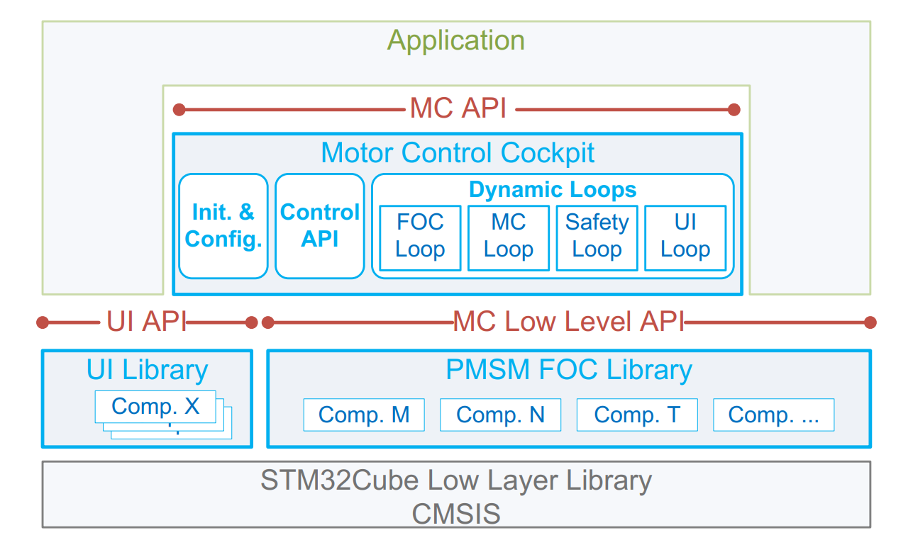
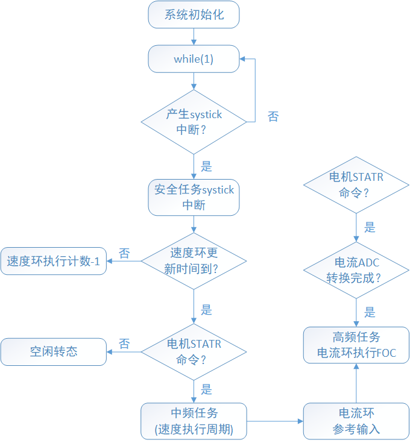

.. vim: syntax=rst

ST FOC MC SDK5.x电机控制软件框架
==========================================

随着直流无刷电机（BLDC）和永磁同步电机（PMSM）在诸多领域有着广泛应用，并且用量也在逐步增长，
电机的驱动和控制技术做为核心部分直接影响到产品性能；控制技术之一的FOC控制技术
（磁场定向控制技术）有其众多的优势，ST在其STM32全系列产品上已经实现FOC控制技术；
本章节将介绍ST电机控制软件控制库框架。

总体软件架构
-----------------------------------------

MC SDK5.x 包含有芯片外设库、电机库和电机应用层三个主要部分，其中芯片外设库使用 ST HAL/LL 库，可被各个层级调用；
电机库则是主要的电机FOC控制层；最上层为电机应用层，供用户直接使用电机库，而不去关心底层如何实现的，加快用户
程序开发；另外 MC SDK5.x 还提供 UI 库，用于界面调试通讯使用，比如和 Workbench 之间的交互就是通过 UI 库实现；
这边强调的一点是电机库是综合体，包含 FOC 算法，单片机外设配置，中断机制等各个环节， 简单控制可能只需要关心电机
应用层即可，如果复杂控制将涉及到整体操作；

在 SDK 使用过程中，电机本体，电机控制硬件板，控制管脚，控制策略在 MC workbench 中配置完成，顺序为 MC
Workbench→CubeMx工程→电机库代码（芯片外设库+电机控制库+电机驾驶舱+用户界面库+系统初始化），该生成
代码加入简单API后（比如 MC_StartMotor1）可以直接运行对应电机，当需要细化控制或者复杂控制时才有可能涉及到修改电机控制库中的代码。

电机控制库文件
-----------------------------------------

在简单的电机控制应用中通常不需要修改这部分代码，如果在Application MC API层不能满足应用需求时才会需要修改这部分代码，
在修改前需要对电机运行框架非常熟悉的情况下再来修改。

.. list-table:: 电机控制库文件
    :widths: 20 20
    :header-rows: 1
    :align: center

    * - 源文件
      - 说明
    * - bus_voltage_sensor.c
      - 总线电压
    * - circle_limitation.c
      - 电压极限限制
    * - enc_align_ctrl.c
      - 编码器初始定位控制
    * - encoder_speed_pos_fdbk.c
      - 编码器传感器相关
    * - fast_div.c
      - 快速软件除法
    * - hall_speed_pos_fdbk.c
      - Hall 传感器相关
    * - inrush_current_limiter.c
      - 浪涌电流限制
    * - mc_math.c
      - 数学计算
    * - mc_interface.c
      - 马达控制底层接口
    * - motor_power_measurement.c
      - 平均功率计算
    * - ntc_temperature_sensor.c
      - NTC 温度传感
    * - open_loop.c
      - 开环控制
    * - pid_regulator.c
      - PID 环路控制
    * - pqd_motor_power_measurement.c
      - 功率计算
    * - pwm_common.c
      - TIMER 同步使能
    * - pwm_curr_fdbk.c
      - SVPWM， ADC 设定相关接口
    * - r_divider_bus_voltage_sensor.c
      - 实际总线电压采集
    * - virtual_bus_voltage_sensor.c
      - 虚拟总线电压
    * - ramp_ext_mngr.c
      - 无传感开环转闭环控制
    * - speed_pos_fdbk.c
      - 速度传感接口
    * - speed_torq_ctrl.c
      - 速度力矩控制
    * - state_machine.c
      - 电机状态相关
    * - virtual_speed_sensor.c
      - 无传感开环运行相关
    * - 以下部分在工程中只会存在其中一个文件
      - \-
    * - ics_f4xx_pwm_curr_fdbk.c
      - STM32F4 的 ICS 采样
    * - r1_f4xx_pwm_curr_fdbk.c
      - STM32F4 的单电阻采样
    * - r3_1_f4xx_pwm_curr_fdbk.c
      - STM32F4 的三电阻采样（1 个 ADC）
    * - r3_2_f4xx_pwm_curr_fdbk.c
      - STM32F4 的三电阻采样（2 个 ADC）

电机控制API
-----------------------------------------

在mc_api.c中有各种可以供用户使用的API接口，对于普通的电机控制用户可以不用关心底层的实现，
只需要使用这些API就可完成电机控制，电机库可以支持两个电机，
在函数中使用后缀Motor1和Motor2来区分是电机1还是电机2。
这里以控制电机1为例来说明个API接口的含义，电机2的控制类似。

   
.. list-table:: 电机控制API说明
    :widths: 20 20 20 20
    :header-rows: 1
    :align: center

    * - 函数名称
      - 函数形参
      - 函数返回值
      - 函数功能
    * - MC_StartMotor1
      - void
      - bool
      - 启动电机
    * - MC_StopMotor1
      - void
      - bool
      - 停止电机
    * - MC_ProgramSpeedRampMotor1
      - hFinalSpeed、hDurationms
      - void
      - 设定目标速度以及持续时间
    * - MC_ProgramTorqueRampMotor1
      - hFinalTorque、hDurationms
      - void
      - 设定目标力矩以及持续时间
    * - MC_SetCurrentReferenceMotor1
      - Iqdref
      - void
      - 设定 Iq， Id 参考
    * - MC_GetCommandStateMotor1
      - void
      - MCI_CommandState_t
      - 返回指令执行状态
    * - MC_StopSpeedRampMotor1
      - void
      - bool
      - 停止速度指令执行,速度指令保存为执行停止前速度指令
    * - MC_StopRampMotor1
      - void
      - void
      - 停止执行电机正在运行的斜坡
    * - MC_HasRampCompletedMotor1
      - void
      - bool
      - 指令是否执行完成
    * - MC_GetMecSpeedReferenceMotor1
      - void
      - int16_t
      - 返回机械参考速度
    * - MC_GetMecSpeedAverageMotor1
      - void
      - int16_t
      - 返回平均机械速度
    * - MC_GetLastRampFinalSpeedMotor1
      - void
      - int16_t
      - 返回上次指令速度
    * - MC_GetControlModeMotor1
      - void
      - STC_Modality_t
      - 返回控制模式
    * - MC_GetImposedDirectionMotor1
      - void
      - int16_t
      - 返回电机转动方向
    * - MC_GetSpeedSensorReliabilityMotor1
      - void
      - bool
      - 返回当前速度传感器可信度
    * - MC_GetPhaseCurrentAmplitudeMotor1
      - void
      - int16_t
      - 返回电流值
    * - MC_GetPhaseVoltageAmplitudeMotor1
      - void
      - int16_t
      - 返回电压值
    * - MC_GetIabMotor1
      - void
      - ab_t
      - 返回 a， b 相电流
    * - MC_GetIalphabetaMotor1
      - void
      - alphabeta_t
      - 返回 clark 变换后的 Iα，Iβ
    * - MC_GetIqdMotor1
      - void
      - qd_t
      - 返回 park 变换后的 Id， Iq
    * - MC_GetIqdrefMotor1
      - void
      - qd_t
      - 返回 Id， Iq 参考
    * - MC_GetVqdMotor1
      - void
      - qd_t
      - 返回变换电压量 Vd， Vq
    * - MC_GetValphabetaMotor1
      - void
      - alphabeta_t
      - 返回变换电压量 Vα， Vβ
    * - MC_GetElAngledppMotor1
      - void
      - int16_t
      - 返回电角度 DPP 数据
    * - MC_GetTerefMotor1
      - void
      - int16_t
      - 返回电流参考
    * - MC_SetIdrefMotor1
      - hNewIdref
      - void
      - 设定电流 Id 参考
    * - MC_Clear_IqdrefMotor1
      - void
      - void
      - Iq，Id 数据回到默认值
    * - MC_AcknowledgeFaultMotor1
      - void
      - bool
      - 清除异常状态
    * - MC_GetOccurredFaultsMotor1
      - void
      - uint16_t
      - 得到发生了的故障状态
    * - MC_GetCurrentFaultsMotor1
      - void
      - uint16_t
      - 得到当前的故障状态
    * - MC_GetSTMStateMotor1
      - void
      - State_t
      - 得到电机状态

上面表格中只是简单的函数功能说明，更加详细的说明请参考函数源码或函数源码前的注释。

软件执行流程
---------------------------------

电机控制流程图如下图所示，其中电机的控制都在中断中执行；

