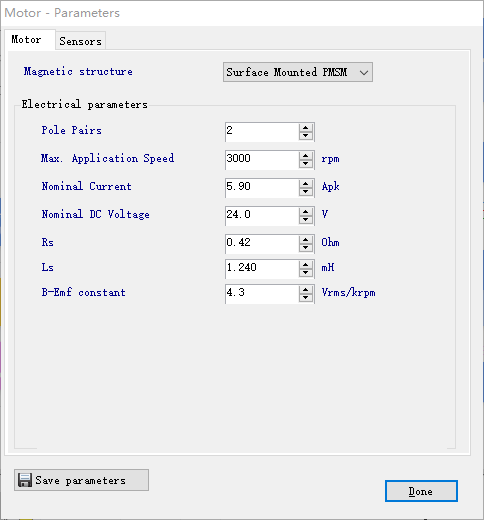
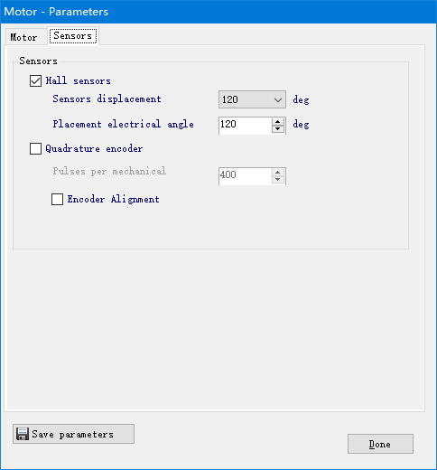
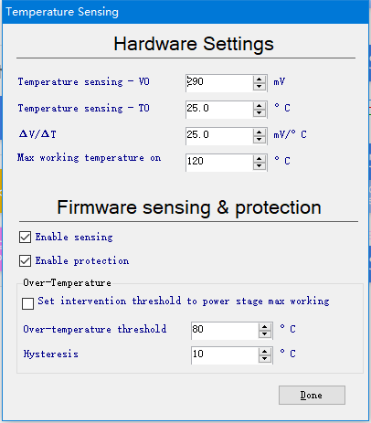

.. vim: syntax=rst

X-CUBE-MCSDK——安装与使用
==========================================

X-CUBE-MCSDK是ST（意法半导体）推出的STM32电机控制软件开发套件（MCSDK），使用该软件对电机进行配置后，
可以直接生成FOC控制电机源码工程，简化了开发过程。

X-CUBE-MCSDK 软件获取与安装
-----------------------------------------

软件共有两种版本：X-CUBE-MCSDK和X-CUBE-MCSDK-FUL，
其中X-CUBE-MCSDK在一些核心的算法使用lib的形式提供给用户，X-CUBE-MCSDK-FUL则是完整的源码，
两个软件可以在ST官网搜索MC SDK下载，如下图所示，不过其中X-CUBE-MCSDK-FUL在注册并获得批准后方可下载，
X-CUBE-MCSDK则不需要批准可以直接下载。也可以在我们提供的资料中下载。

下载后可以得到名为：X-CUBE-MCSDK-FUL_5.4.4.exe的安装包，双击安装即可，
安装过程很简单这里就不在截图说明，**注意，安装路径中不能有中文**。安装完成后会在桌面生成MotorControl Workbench 5.4.4
和 Motor Profiler 5.4.4两个软件，Motor Profiler 5.4.4是用于自动测量电机参数的软件，
不过使用该软件需要使用ST相关的主板和电机驱动板才可以，这里就不介绍该软件的时候方法。
MotorControl Workbench 5.4.4才是我们需要的软件，可以使用该软件配置电机驱动板等参数后就可以生成源代码。

在安装好X-CUBE-MCSDK-FUL后我们还需要安装STM32CubeMX，因为X-CUBE-MCSDK-FUL在配置完相关参数后，
在生成代码时需要调用STM32CubeMX。

STM32CubeMX软件安装
-----------------------------------------

必备软件：Java（V1.7及以上版本）和STM32CubeMX（版本6.0.0）

Java下载地址：\ `www.java.com/zh_CN/ <https://www.java.com/zh_CN/>`__

STM32CubeMX下载地址：ST官网搜索STM32CubeMX

安装Java软件

双击安装包“JavaSetup8u151.exe”，具体操作步骤如下：

.. image:: ../media/image1.png
   :align: center
   :alt: 图 10‑1 Java安装步骤1
   :name: 图10_1

.. image:: ../media/image2.png
   :align: center
   :alt: 图 10‑2 Java安装步骤2
   :name: 图10_2

.. image:: ../media/image3.png
   :align: center
   :alt: 图 10‑3 Java验证成功
   :name: 图10_3

在本地新建好文件夹后，把准备好的库文件添加到相应的文件夹下：

安装STM32CubeMX软件
^^^^^^^^^^^^^^^^^^^^^^^^^^^^^^^^^

双击安装包“SetupSTM32CubeMX-6.0.0.exe”，具体操作步骤如下：

.. image:: ../media/image6.png
   :align: center
   :alt: 图 10‑6 STM32CubeMX指定安装路径
   :name: 图10_6

.. image:: ../media/image7.png
   :align: center
   :alt: 图 10‑7 STM32CubeMX创建快捷方式
   :name: 图10_7

.. image:: ../media/image8.png
   :align: center
   :alt: 图 10‑8 STM32CubeMX完成安装
   :name: 图10_8

ST Motor Control Workbench 的使用
--------------------------------------------------

在使用 ST Motor Control Workbench (以下简称：Workbench)前我们需要知道电机的一些参数，
我们配套电机参数如下表所示。如果不知道电机参数时通常我们可以咨询电机厂商，一般电机厂商都会提供电机的相关参数，
或者我们可以自己通过仪器测得。

.. list-table:: 电机参数
    :widths: 20 20 20
    :header-rows: 1
    :align: center

    * - 电机参数
      - BLDC
      - PMSM
    * - 极对数
      - 4对极
      - 4对极
    * - 额定转速
      - 3000RPM
      - 3000RPM
    * - 额定电流
      - 5.90A
      - 4.00A
    * - 额定电压
      - 24V
      - 24V
    * - 相电阻
      - 0.42±10%Ω
      - 1.02±10%Ω
    * - 相电流
      - 1.12±20%0mH
      - 0.590±20%mH
    * - 反电动势系数
      - 4.3Vrms/krpm
      - 4.3Vrms/krpm
    * - 编码器
      - \-
      - 1000线

在我们知道电机参数后我们就可以使用Workbench来配置生成代码来控制电机了，
以下我们使用BLDC速度控制使用霍尔传感器（HALL）为例来说一下Workbench的使用方法，
以下只是简单介绍Workbench的使用，并不会介绍FOC相关的原理，
这里的目的是使用Workbench配置后生成的代码让电机跑起来，不过生成的代码并不能直接使用，
还需要做简单的修改，所以我们只讲解需要修改部分的代码。

新建项目
^^^^^^^^^^^^^^^^^^^^^^^^^^^^^^^^^

以下示例工程在\\base_code\\improve_part\\BLDC_FOC_V5.44_Hall_speed_control目录下。

下图是双击MotorControl Workbench 5.4.4打开的界面，整个界面可以分为3个部分。

1. 新建项目、加载项目、启动Motor Profiler 5.4.4
2. 最近打开过的项目列表
3. 示例项目

这里我们点击 New Project 来创建我们的第一个项目。

选择应用类型、控制板、驱动板和电机个数，这里前3个我们都选择自定义模式，电机个数选择一个。
应用类型可以在实际应用中选择对应的类型。

.. image:: ../media/st_foc/New_Project.png
   :align: center
   :alt: MotorControl Workbench 5.4.4界面

选择完成后点击OK即可。

参数配置
^^^^^^^^^^^^^^^^^^^^^^^^^^^^^^^^^

下图是参数配置界面，整个界面可以大概分为4个部分：

1. 用户图标按钮，可以通过点击图标来新建、加载、保存项目、生成代码和上位机控制电机等；
2. 用于设置所选硬件的功能，如电机参数或传感器的使用；
3. 显示一些主要的参数；
4. 用于提示一些用户的操作反馈，或者错误等。

.. image:: ../media/st_foc/Profiler_config_ui.png
   :align: center
   :alt: Workbench 参数配置界面

**单片机和时钟频率选择**

点击下图中的芯片型号可以选择对应我们控制板的MCU型号。

选择对应的芯片型号，注意，这里的时钟源需要选择25MHz。

**电机参数配置**

如下图所示，电机 Motor Parameters 可以配置电机相关的参数和传感器，
以下内容需要根据实际使用的电机准确填写，否则可能导致电机无法启动或者抖动。

下图填写电机相关参数，如极对数、最大速度、额定电流电压等参数。

在下图中可以选择传感器，可以选择HALL和Encoder，如果都不选则使用无传感器模式。

**速度反馈配置**

点击 Speed Sensing 可以打开速度反馈配置界面，如下图所示，这里可以选择使用什么传感器来反馈速度，
可以配置主传感器和辅助传感器，这里配置主传感器为HALL，不使用辅助传感器。

**MOS 管驱动配置**

点击 Phase U 可以配置 MOS 管的驱动极性，我们的驱动板中高端 MOS 管和低端 MOS 管都是高电平打开。

**MOS 管配置**

点击下图中的 Power Switches 就可以设置 MOS 管的相关参数。

如下图所示在这里可以设置死区时间和 MOS 管的最大开关频率，从数据手册中可以知道我们使用的 MOS
管死区时间设置为100ns就可以。

**总线电压传感器**

点击 Bus Volatage Sensing 可以设置电压传感器相关参数，如下图所示。
由于我们使用了电压隔离芯片，还使用加法电路，所以这里不能配置出适合我们驱动板的参数，
需要我们重新实现电压的转换函数，所以这里对于我们的驱动板来只配置了前面的分压电路。

**温度传感器**

点击 Temperature Sensing 可以设置温度传感器相关参数，如下图所示。
不过该配置只支持 ST 的温度传感器，因此这里我们只要设置好温度范围就可以了，
其他参数可以不管，具体的温度获取函数需要我们根据配套的传感器来实现。
这里设置传感器最高采集温度为120℃，然后使能传感器和温度保护，并将温度最大保护电压设置为80℃。

**电流采样电路**

点击 Current Sensing 可以配置电流采集相关的参数，如下图所示，这里根据我们的驱动板选择3电阻采样，
采样电阻的阻值为0.02ohm。然后勾选 Amplification on board ，点击 Calculate 来计算放大倍数。

配置后如下图所示，由于我们使用了隔离运放，所以这里并不能按照原理图对应的来配置，
在这里我们只要配置出和驱动板相同的倍数和偏置电压就可以了。电压放大倍数配置为8倍，
偏置电压配置1.2V。

**驱动配置**

点击 Fimware Drive Management 后，选择 Drive Settings，配置界面如下图所示。
这里可以配置PWM输出频率，通常配置为10KHz~20KHz，这里我们配置为16KHz，
把高端和低端 MOS 管的空闲状态都设置为关，执行时间为1ms，PI 可以根据电机的运行效果来调整，
控制模式选择速度控制模式，默认目标速度设置为1500RPM，转矩和磁通控制的PI这里使用默认参数，
当然如果觉得控制效果不好也可以自己调整。

**附加功能和PFC配置**

点击 Fimware Drive Management 后，选择 Additional Features，在这里可以选择一些控制算法，
不过我们这里都不选择。

**传感器使能和固件保护配置**

点击 Fimware Drive Management 后，选择 Sensing and FW protections，如下图所示，
这里可以使能电压传感器和使能过压、欠压保护功能，并且配置有效的电压工作范围，
超过电压范围后禁用PWM输出。

**FreeRTOS**

点击 Fimware Drive Management 后，选择 FreeRTOS，如下图所示，
这里可以选择是否启用 FreeRTOS 操作系统，这里我们不需要就不启用了。

**用户界面**

点击 User Interface 可以配置用户界面，在SDK 5.x 中LCD相关的固件已经没有了，这里参数都被禁用，
Start/Stop Button 选择使能，Serial Communication 中使能串口，使用 Bidirectional。

**数字输出输入 I/O 配置**

点击 Digital I/O 配置数字输出输入相关引脚，在这里需要配置驱动定时器和相关的引脚，
以及霍尔传感器的配置，还可以配置串口和启动停止按键的IO配置，这里我们只需要根据原理图来配置就可以了，
我们选择电机驱动接口1来接电机驱动板。

**模拟输出和保护配置**

点击 Analog Input and Protection 可以配置模拟量输出相关的引脚和保护功能。

如下图所示，这里可以配置采样电流相关的ADC和引脚，已经采样率等参数，只需要根据原理图中对应的引脚配置就可以了，
这里的过流保护选择没有保护。

下面两图中配置电压和温度的采集ADC和引脚，这里我们只需要根据我们的原理图配置就可以了，
配置如下图所示。

**DAC 功能**

点击 DAC Functionality 可以配置DAC功能，这里主要是调试使用，不过这里的输出引脚是固定的，
只能是PA4和PA5并不能更改，而这里的 PA4 我们已经使用了，所以这里只能选择不使用。

**交流输入配置**

在下图中，红框部分是关于交流输入的相关配置，不过我们驱动板使用的是直流输入，
所以这部分我们可以不用管。

**引脚分配与检查**

点击 Pin assignment 可以查看引脚的分配，Check 可以检查引脚是否有冲突，在检查OK后配置工作就完成了。

至此关于参数的配置我们就完成了，接下来就可以生成代码了。

生成工程代码
^^^^^^^^^^^^^^^^^^^^^^^^^^^^^^^^^

在配置完所有参数后我们可以保存我们的项目了，点击Save Project就可以保存项目了（**注意，保存路径中不能有中文**）。
我们可以点击Generation来生成代码，如下图所示，左侧可以选择 STM32CubeMX ，可以选择开发环境，
这里我们选择Keil MDK-ARM V5 ，固件版本可以选择最新或者已经下载好的版本，驱动类型选择HAL库。
配置好后就可以点击Generation生成代码了。如果之后还需要修改配置，那么我们可以点击 UPDATE
来更新代码。

修改工程源码
^^^^^^^^^^^^^^^^^^^^^^^^^^^^^^^^^

我们生成的源码并不能直接编译、下载就能运行，主要有以下3个方面需要修改：

- 我们驱动需要一个引脚来控制 MOS 驱动芯片的开关，所以需要增加一个引脚来控制 SD 引脚；
- 由于我们使用了电压隔离芯片，还使用加法电路，所以生成的代码并不能完成我们需要的功能，
  需要重新写电压获取代码和过压、欠压检测代码；
- 生成的温度获取代码也并不能直接用，需要重新实现。

**初始化 SD 控制脚**

初始化 SD 引脚有两种方法，一种是我们自己写代码来初始化，还有一种是我们可以使用STM32CubeMX打开
\\improve_part\\BLDC_FOC_V5.44_Hall_speed_control\\BLDC_control\\BLDC_control.ioc，
通过STM32CubeMX来初始化SD引脚，如下图所示，将PG12配置为GPIO_Output，并且将默认的电平输出设置为高电平，
User Labe 项填写 SD 。修改完成后保存关闭窗口，这里不使用STM32CubeMX来生成代码，需要回到Workbench，
使用Workbench来更新代码（**注意，不是生成**）。

.. image:: ../media/st_foc/sd_pin_config.png
   :align: center
   :alt: STM32CubeMX修改.ioc文件

如下图所示，点击 UPDATE 即可更新代码。

**修改电压传感器**

官方的 SDK 中函数都使用了 **__weak** 关键字，所以我们可以不改动源码，直接重新实现需要修改的函数就可以了，
在电压部分共有两个函数需要重新实现，分别是 **uint16_t VBS_GetAvBusVoltage_V( BusVoltageSensor_Handle_t * pHandle )** 和
**uint16_t RVBS_CheckFaultState( RDivider_Handle_t * pHandle )**，我们重新创建新建的源码文件，
和SDK的命名基本一样只是在前面增加一个 **yh_** 前缀用于区分。新建的文件都放到了 **\\USER\\YH_MotorControl** 目录下，
在yh_bus_voltage_sensor.c中增加VBS_GetAvBusVoltage_V函数源码如下：

.. code-block:: c
   :caption: 电压获取函数
   :linenos:

   /**
   * @brief  It return latest averaged Vbus measurement expressed in Volts
   * @param  pHandle related Handle of BusVoltageSensor_Handle_t
   * @retval uint16_t Latest averaged Vbus measurement in Volts
   */
   uint16_t VBS_GetAvBusVoltage_V( BusVoltageSensor_Handle_t * pHandle )
   {
      uint16_t temp;

      temp = (pHandle->AvBusVoltage_d / 65536.0f * (float)ADC_REFERENCE_VOLTAGE - (float)VBUS_VBIAS)\
               * (float)VBUS_MAGNIFICATION_TIMES;

      return temp;
   }

在yh_bus_voltage_sensor.h中增加如下宏定义，由于我们使用了偏置电压，所以官方生成的计算方法不能直接用需要重新实现。

.. code-block:: c
   :caption: 电压传感器宏定义
   :linenos:

   #define VBUS_MAGNIFICATION_TIMES     37.0    // 电压放大倍数
   #define VBUS_VBIAS                   1.24    // 偏置电压

   #define YH_OVERVOLTAGE_THRESHOLD_d   (uint16_t)((OV_VOLTAGE_THRESHOLD_V / VBUS_MAGNIFICATION_TIMES + VBUS_VBIAS)/\
                                                   ADC_REFERENCE_VOLTAGE * 65535)
   #define YH_UNDERVOLTAGE_THRESHOLD_d  (uint16_t)((UD_VOLTAGE_THRESHOLD_V / VBUS_MAGNIFICATION_TIMES + VBUS_VBIAS)/\
                                                   ADC_REFERENCE_VOLTAGE * 65535)

在yh_bus_voltage_sensor.c中增加RVBS_CheckFaultState函数源码如下：

.. code-block:: c
   :caption: 过压、欠压检测函数
   :linenos:

   /**
   * @brief  It returns MC_OVER_VOLT, MC_UNDER_VOLT or MC_NO_ERROR depending on
   *         bus voltage and protection threshold values
   * @param  pHandle related RDivider_Handle_t
   * @retval uint16_t Fault code error
   */
   uint16_t RVBS_CheckFaultState( RDivider_Handle_t * pHandle )
   {
      uint16_t fault;

      if ( pHandle->_Super.AvBusVoltage_d > YH_OVERVOLTAGE_THRESHOLD_d )
      {
         fault = MC_OVER_VOLT;
      }
      else if ( pHandle->_Super.AvBusVoltage_d < YH_UNDERVOLTAGE_THRESHOLD_d )
      {
         fault = MC_UNDER_VOLT;
      }
      else
      {
         fault = MC_NO_ERROR;
      }
      return fault;
   }

**修改温度传感器**

由于 SDK 中温度传感器的计算方法和我们使用的计算方法不一样，所以这部分代码也需要修改，
在yh_ntc_temperature_sensor.h中增加如下宏定义：

.. code-block:: c
   :caption: 温度传感器相关宏
   :linenos:

   #define GET_ADC_VDC_VAL(val)            ((float)val / 65536.0f * (float)ADC_REFERENCE_VOLTAGE)          // 得到电压值
   
   /* 参数宏 */
   #define DICIDER_RESISTANCE    (4700.0f)    // 分压电阻阻值

   #define NTC_Ka     (273.15f)         // 0℃ 时对应的温度（开尔文）
   #define NTC_R25    (10000.0f)        // 25℃ 电阻值
   #define NTC_T25    (NTC_Ka + 25)     // 25℃ 时对应的温度（开尔文）
   #define NTC_B      (3950.0f)         /* B-常数：B = ln(R25 / Rt) / (1 / T – 1 / T25)，
                                          其中 T = 25 + 273.15 */

   /* 温度保护阈值与清除报警值,
   计算公式（_d = 3.3 * R / (Rt + R) / ADC_REFERENCE_VOLTAGE * 65536） */
   #define YH_OV_TEMPERATURE_THRESHOLD_d      51837    /*!< 通过查表80℃对应的电阻值计算得出 */
   #define YH_OV_TEMPERATURE_HYSTERESIS_d     47866    /*!< 通过查表70℃对应的电阻值计算得出 */

在yh_ntc_temperature_sensor.c中重新实现NTC_SetFaultState和NTC_CalcAvTemp函数如下：

.. code-block:: c
   :caption: 温度传感器采集计算与状态检测
   :linenos:

   /* Private functions ---------------------------------------------------------*/

   /**
   * @brief Returns fault when temperature exceeds the over voltage protection threshold
   *
   *  @p pHandle : Pointer on Handle structure of TemperatureSensor component
   *
   *  @r Fault status : Updated internal fault status
   */
   uint16_t NTC_SetFaultState( NTC_Handle_t * pHandle )
   {
      uint16_t hFault;

      if ( pHandle->hAvTemp_d > YH_OV_TEMPERATURE_THRESHOLD_d )
      {
         hFault = MC_OVER_TEMP;
      }
      else if ( pHandle->hAvTemp_d < YH_OV_TEMPERATURE_HYSTERESIS_d )
      {
         hFault = MC_NO_ERROR;
      }
      else
      {
         hFault = pHandle->hFaultState;
      }
      return hFault;
   }

   /* Functions ---------------------------------------------------- */

   /**
   * @brief Performs the temperature sensing average computation after an ADC conversion
   *
   *  @p pHandle : Pointer on Handle structure of TemperatureSensor component
   *
   *  @r Fault status : Error reported in case of an over temperature detection
   */
   uint16_t NTC_CalcAvTemp( NTC_Handle_t * pHandle )
   {
      uint32_t wtemp;
      uint16_t hAux;

      if ( pHandle->bSensorType == REAL_SENSOR )
      {
         hAux = RCM_ExecRegularConv(pHandle->convHandle);

         if ( hAux != 0xFFFFu )
         {
            wtemp =  ( uint32_t )( pHandle->hLowPassFilterBW ) - 1u;
            wtemp *= ( uint32_t ) ( pHandle->hAvTemp_d );
            wtemp += hAux;
            wtemp /= ( uint32_t )( pHandle->hLowPassFilterBW );

            pHandle->hAvTemp_d = ( uint16_t ) wtemp;
         }

         pHandle->hFaultState = NTC_SetFaultState( pHandle );
      }
      else  /* case VIRTUAL_SENSOR */
      {
         pHandle->hFaultState = MC_NO_ERROR;
      }

      return ( pHandle->hFaultState );
   }

在yh_ntc_temperature_sensor.c中重新实现NTC_GetAvTemp_C函数如下：

.. code-block:: c
   :caption: 获取温度值
   :linenos:

   /**
   * @brief  Returns latest averaged temperature expressed in Celsius degrees
   *
   * @p pHandle : Pointer on Handle structure of TemperatureSensor component
   *
   * @r AverageTemperature : Latest averaged temperature measured (in Celsius degrees)
   */
   int16_t NTC_GetAvTemp_C( NTC_Handle_t * pHandle )
   {
      int32_t wTemp;

      if ( pHandle->bSensorType == REAL_SENSOR )
      {
         float Rt = 0;                   // 测量电阻
         Rt = get_ntc_r_val(pHandle);    // 获取当前电阻值

         wTemp = NTC_B * NTC_T25 / (NTC_B + log(Rt / NTC_R25) * NTC_T25) - NTC_Ka ;    // 使用公式计算
      }
      else
      {
         wTemp = pHandle->hExpectedTemp_C;
      }
      return ( ( int16_t )wTemp );
   }

编译下载测试
^^^^^^^^^^^^^^^^^^^^^^^^^^^^^^^^^

上面我们已经完成了所有源码的修改，现在可以编译然后下载测试代码了。

编译下载后可以按KEY2来启动和停止电机。还可以使用 Workbench 里面的监视器来控制电机。

如下图所示，点击 Monitor 图标就可以打开监视器了。

开打后的监视器如下图所示。

连接到开发板后，可以通过 Start Motor 和 Stop Motor 来启动和停止电机，
可以通过速度旋钮来调节目标速度，或者通过旋钮下方的编辑框来调节目标速度，
编辑好后回车就可以发送目标速度。

可以通过速度表盘来观察速度值，也可以通过 plotting 来观察实际速度与目标速度的关系，如下图所示。

状态指示灯有3种颜色：

- 绿色：正常状态
- 红色：故障产生，并且没有被排除
- 黄色：故障产生，但是已经被排除

当故障故障产生时，对应的故障灯也会亮起，此时电机不能启动，需我们排除故障后才能启动电机。
如下图所示，电机驱动板电压过低发生欠压故障，此时欠压故障灯和状态指示灯都为红色。

如下图所示，当我们将电压调整为正常值后，欠压故障灯和状态指示灯都为黄色，此时可以电机 Fault Ack
来确认这个故障已经解决，这样就可以正常的启动电机了。

无感模式
^^^^^^^^^^^^^^^^^^^^^^^^^^^^^^^^^

上面我们介绍了霍尔感器获取速度的配置方法，现在我们介绍不使用传感器的配置方法，
关于电机和驱动板的参数配置与使用霍尔传感器模式一样，如下图所示，点击 Speed Sensing
后主传感器选择 Sensor-less (Observer+PLL) 。

无感模式还需要配置启动参数，点击 Fimware Drive Management 后，选择 Start-up parameters，
配置界面如下图所示。无感模式需要开环跑来后在切换到 FOC 模式控制，在下面参数中可以配置开环跑的相关参数，
例如，开环对齐时持续时间，对齐电角度，速度上升时间，最终速度值等。

配置完所有参数后，就可以生成代码了，不过生成的代码还是不能直接运行，需要做同霍尔传感器模式一样的修改：

- 驱动需要一个引脚来控制 MOS 驱动芯片的开关，所以需要增加一个引脚来控制 SD 引脚；
- 由于我们使用了电压隔离芯片，还使用加法电路，所以生成的代码并不能完成我们需要的功能，
  需要重新写电压获取代码和过压、欠压检测代码；
- 生成的温度获取代码也并不能直接用，需要重新实现。

关于以上的更改方法与霍尔传感器模式完全一样。

编码器模式
^^^^^^^^^^^^^^^^^^^^^^^^^^^^^^^^^

下面介绍使用编码器模式获取速度，关于电机和驱动板的参数配置与使用霍尔传感器模式基本一样，
如下图所示，点击 Speed Sensing 后主传感器选择 Quadrature encoder 。

在 Motor-Parameters 感器勾选 Quadrature encoder ，编码器为1000线，

编码器模式同样需要配置启动参数，点击 Fimware Drive Management 后，选择 Start-up parameters，
配置界面如下图所示。可以配置对齐时间、对齐角度和电流。

点击 Digital I/O 配置数字输出输入相关引脚，在这里需要选择编码器使用的定时器和引脚。

配置完所有参数后，就可以生成代码了，生成代码同样需要做跟霍尔模式一样的修改。

编码器模式-位置控制
^^^^^^^^^^^^^^^^^^^^^^^^^^^^^^^^^

在使用 PMSM 电机中使用编码器时还可以选择位置控制模式，如下图所示。

位置控制模式和速度控制模式在 Workbench 的配置中只有这个界面的配置不一样，
在这里选择位置控制模式后，通常还需要在左下角的位置调节器中修改 PID 的参数才能正常工作。

配置完所有参数后，就可以生成代码了，生成代码后再按霍尔模式修改好代码，
这里还需要在修改代码才能进行测试，因为 Workbench 里面的监视器不支持位置控制，
所以我们需自己写代码来控制位置。在mian.c 的 main 函数中 while(1) 里面增加如下图红框中的代码。

这里通过 MCSDK 中提供的 MC_ProgramPositionCommandMotor1() API 来设置电机的位置，
函数的具体用法请参考函数源码前的注释。

现在我们编译下载后按KEY2启动可以看到电机每隔两秒转一次，一次转90°。