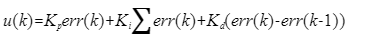
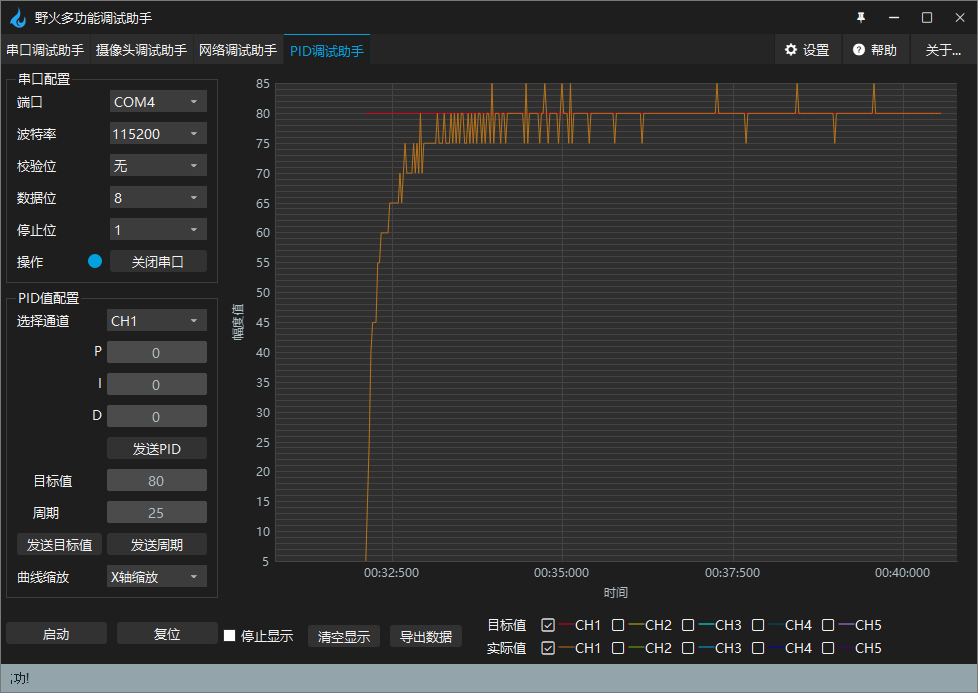
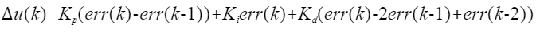
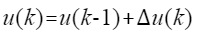
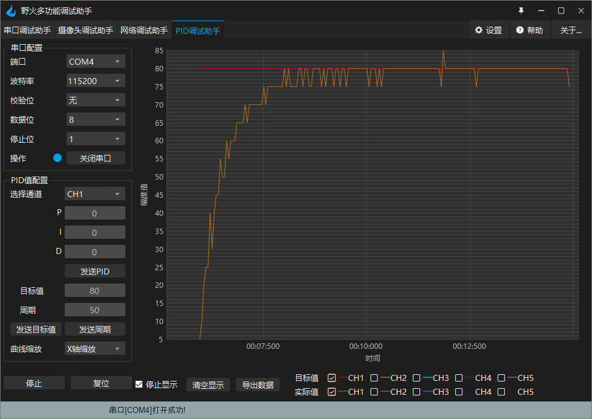

.. vim: syntax=rst

直流电机电流环控制实现
==========================================

通过上一章节《直流电机速度环控制实现》的学习，我们大致的了解了PID在实际应用中是如何发挥它自动控制的作用的。在实际应用中，并不仅仅只有使用速度作为反馈来调节直流电机工作。相反地，现实中有许多参数可以作为反馈量，为特定场景下的直流电机控制带来更好的效果，例如本章节要讲到的电流环控制。电流环控制，简单的说，就是希望以恒定的电流来驱动电机运转，即希望电机能输出恒定的转矩。接下来，本章节就来介绍一下使用电流环来实现直流电机的电流控制。

本章通过我们前面学习的位置式PID和增量式PID两种控制方式分别来实现电流环的控制， 如果还不知道什么是位置式PID和增量式PID，请务必先学习前面PID算法的通俗解说这一章节。

硬件设计
--------------

本章实验需要连接开发板和驱动板，这里给出接线表。

MOS管搭建驱动板
^^^^^^^^^^^^^^^^^^^^^^^^^^^^^^^^^

电机与MOS管搭建驱动板连接见下表所示。

.. list-table:: 电机与MOS管搭建驱动板连接
    :widths: 20 20
    :header-rows: 1

    * - 电机
      - MOS管搭建驱动板
    * - 电机输出M+
      - M+
    * - 电机输出M-
      - M-

MOS管搭建驱动板与主控板连接见下表所示。

.. list-table:: MOS管搭建驱动板与主控板连接
    :widths: 20 20
    :header-rows: 1

    * - MOS管搭建驱动板
      - 主控板
    * - PWM1
      - PA9
    * - PWM2
      - PA8
    * - SD
      - PG12
    * - 信号检测-电流
      - PB1
    * - 信号检测-电压
      - PB0
    * - 电源输入：5V
      - 5V
    * - 电源输入：GND
      - GND

推荐使用配套的牛角排线直接连接驱动板和主控板。连接开发板的那端，请连接在“无刷电机驱动接口1”上。

直流电机电流环控制-位置式PID实现
------------------------------------------

软件设计
^^^^^^^^^^^^^^^^^^^^^

软件部分和上一章大体相同，区别在于更换了输入PID的参数为电流值，代码中也增加了电流获取的功能，本章代码在野火电机驱动例程中\\improve_part\\F407\\直流有刷电机-电流环控制-位置式PID目录下，下面我们详细来看。

编程要点
"""""""""""""""""

(1) 配置定时器可以输出PWM控制电机
(2) 配置定时器可以读取当前电路中驱动电机的电流值
(3) 配置基本定时器可以产生定时中断来执行PID运算
(4) 编写位置式PID算法
(5) 编写电流控制函数
(6) 增加上位机曲线观察相关代码
(7) 编写按键控制代码

软件分析
^^^^^^^^^^^^^^^^^^^^^

PWM定时器配置
"""""""""""""""""

定时器如何配置前面章节多次提到，这边就略过不讲了，只展示初始化输出PWM的定时器初始化所调用的函数。如有疑问，之前的章节有详细讲解，代码也非常简单易懂。

.. code-block:: c
   :name: Motor_TIMx_Configuration()函数
   :caption: Motor_TIMx_Configuration()函数
   :linenos:

    /**
    * @brief  初始化控制通用定时器
    * @param  无
    * @retval 无
    */
    void Motor_TIMx_Configuration(void)
    {
        TIMx_GPIO_Config();
        TIM_PWMOUTPUT_Config();
    }

通用定时器定时获取电流值、计算PID
""""""""""""""""""""""""""""""""""

此代码位于野火电机开发板例程：直流有刷电机-电流环控制-位置式PID\\User\\motor_control\\bsp_motor_control.c

.. code-block:: c
   :name: motor_pid_control()函数
   :caption: motor_pid_control()函数
   :linenos:

    /**
    * @brief  电机位置式 PID 控制实现(定时调用)
    * @param  无
    * @retval 无
    */
    void motor_pid_control(void)
    {
    int32_t actual_current = get_curr_val();    // 读取当前电流值
    
    if (is_motor_en == 1)     // 电机在使能状态下才进行控制处理
    {
        float cont_val = 0;                       // 当前控制值

        cont_val = PID_realize(actual_current);    // 进行 PID 计算
        
        if (cont_val < 0)
        {
        cont_val = 0;    // 下限处理
        }
        else if (cont_val > PWM_MAX_PERIOD_COUNT)
        {
        cont_val = PWM_MAX_PERIOD_COUNT;    // 速度上限处理
        }

        set_motor_speed(cont_val);                                                 // 设置 PWM 占空比
        
    #if defined(PID_ASSISTANT_EN)
        set_computer_value(SEND_FACT_CMD, CURVES_CH1, &actual_current, 1);                // 给通道 1 发送实际值
    #else
        printf("实际值：%d. 目标值：%.0f\n", actual_speed, get_pid_actual());      // 打印实际值和目标值
    #endif
    }
    }

    /**
    * @brief  定时器每25ms产生一次中断回调函数
    * @param  htim：定时器句柄
    * @retval 无
    */
    void HAL_TIM_PeriodElapsedCallback(TIM_HandleTypeDef *htim)
    {
    if(htim==(&TIM_TimeBaseStructure))
    {
        motor_pid_control();
    }
    }

代码中，由基本定时器每25ms产生一次中断，并在中断中调用motor_pid_control函数。该函数主要功能是获取当前驱动电机电流，通过PID计算反馈值并输出到PWM中。在代码的最后，使用set_computer_value发送下位机参数与上位机进行同步，这样一来就可以很直观的在上位机看到PID调整输出的过程。接下来我们在看看电流环的位置式PID算法。

电流环位置式PID算法实现
""""""""""""""""""""""""""""""""""

此代码位于野火电机开发板例程：直流有刷电机-电流环控制-位置式PID\\User\\pid\\bsp_pid.c

.. code-block:: c
   :name: PID算法实现
   :caption: PID算法实现
   :linenos:

    /**
    * @brief  PID算法实现
    * @param  actual_val:实际值
    * @note   无
    * @retval 通过PID计算后的输出
    */
    float PID_realize(float actual_val)
    {
        /*计算目标值与实际值的误差*/
        pid.err=pid.target_val-actual_val;
        /*误差累积*/
        pid.integral+=pid.err;
        /*PID算法实现*/
        pid.actual_val=pid.Kp*pid.err+pid.Ki*pid.integral+pid.Kd*(pid.err-pid.err_last);
        /*误差传递*/
        pid.err_last=pid.err;
        /*返回当前实际值*/
        return pid.actual_val;
    }
    
    /**
    * @brief  PID参数初始化
    * @note   无
    * @retval 无
    */
    void PID_param_init()
    {
        /* 初始化参数 */
        pid.target_val=80.0;				
        pid.actual_val=0.0;
        pid.err=0.0;
        pid.err_last=0.0;
        pid.integral=0.0;

        pid.Kp = 0;
        pid.Ki = 3.5;
        pid.Kd = 0;

    #if defined(PID_ASSISTANT_EN)
        float pid_temp[3] = {pid.Kp, pid.Ki, pid.Kd};
        set_computer_value(SEND_P_I_D_CMD, CURVES_CH1, pid_temp, 3);     // 给通道 1 发送 P I D 值
    #endif
    }

这个函数主要实现了位置式PID算法，用传入的目标值减去实际值得到误差值得到比例项，在对误差值进行累加得到积分项，
用本次误差减去上次的误差得到微分项，然后通过前面章节介绍的位置式PID公式实现PID算法，并返回实际控制值。

这个公式就是代码第14行中的公式形式，公式和代码的计算方式基本一致，只不过在公式中第二项的Ki是使用的对误差积分，
在代码中变成了对误差的累加，虽然表达形式不一样，但是达到的效果和目的是一样的。
计算过后将误差传递用于下一次使用，并将实际值返回。

其实不难发现，上述的代码与上章的速度环位置式PID控制几乎没有区别，甚至是仅有PID参数的差异，可以看出PID控制算法，基本是有一定规律性的，难点就在于调参。上述代码中实现了PID参数的初始化，和PID算法的具体实现，代码看起来也是简单易懂的。

主函数
""""""""""""""""""""""""""""""""""

主函数中主要初始化一些外设与上位机的协议，例如串口、定时器、ADC等，最后在主循环中轮询按键的事件和处理上位机数据。

.. code-block:: c
  :caption: 主函数
  :linenos:

  /**
    * @brief  主函数
    * @param  无
    * @retval 无
    */
  int main(void)
  {
    int32_t target_curr = 80;
    
    /* HAL 库初始化 */
    HAL_Init();
    
    /* 初始化系统时钟为168MHz */
    SystemClock_Config();
    
    /* 初始化按键 GPIO */
    Key_GPIO_Config();
    
    /* 初始化 LED */
    LED_GPIO_Config();
    
    /* 协议初始化 */
    protocol_init();
    
    /* 初始化串口 */
    DEBUG_USART_Config();

    /* 电机初始化 */
    motor_init();
    
    set_motor_disable();     // 停止电机 
    
    /* 初始化基本定时器，用于处理定时任务 */
    TIMx_Configuration();
    
    /* PID 参数初始化 */
    PID_param_init();
    
    /* ADC 始化 */
    ADC_Init();
    
  #if defined(PID_ASSISTANT_EN)
    set_computer_value(SEND_STOP_CMD, CURVES_CH1, NULL, 0);    // 同步上位机的启动按钮状态
    set_computer_value(SEND_TARGET_CMD, CURVES_CH1, &target_curr, 1);     // 给通道 1 发送目标值
  #endif

    while(1)
    {
      /* 接收数据处理 */
      receiving_process();
      
      /* 扫描KEY1 */
      if( Key_Scan(KEY1_GPIO_PORT, KEY1_PIN) == KEY_ON)
      {
      #if defined(PID_ASSISTANT_EN) 
        set_computer_value(SEND_START_CMD, CURVES_CH1, NULL, 0);               // 同步上位机的启动按钮状态
      #endif
        set_pid_target(target_curr);    // 设置目标值
        set_motor_enable();              // 使能电机
      }
      
      /* 扫描KEY2 */
      if( Key_Scan(KEY2_GPIO_PORT, KEY2_PIN) == KEY_ON)
      {
        set_motor_disable();     // 停止电机
      #if defined(PID_ASSISTANT_EN) 
        set_computer_value(SEND_STOP_CMD, CURVES_CH1, NULL, 0);               // 同步上位机的启动按钮状态
      #endif
      }
      
      /* 扫描KEY3 */
      if( Key_Scan(KEY3_GPIO_PORT, KEY3_PIN) == KEY_ON)
      {
        /* 增大目标速度 */
        target_curr += 10;
        
        if(target_curr > 120)
          target_curr = 120;
        
        set_pid_target(target_curr);
      #if defined(PID_ASSISTANT_EN)
        set_computer_value(SEND_TARGET_CMD, CURVES_CH1,  &target_curr, 1);     // 给通道 1 发送目标值
      #endif
      }

      /* 扫描KEY4 */
      if( Key_Scan(KEY4_GPIO_PORT, KEY4_PIN) == KEY_ON)
      {
        /* 减小目标速度 */
        target_curr -= 10;
        
        if(target_curr < 25)
          target_curr = 25;
        
        set_pid_target(target_curr);
      #if defined(PID_ASSISTANT_EN)
        set_computer_value(SEND_TARGET_CMD, CURVES_CH1,  &target_curr, 1);     // 给通道 1 发送目标值
      #endif
      }
    }
  }

下载验证
^^^^^^^^^^^^^^^^^^^^^

下载程序到电机开发板，我们按下Key1键启动电机(看主函数)，也可以通过上位机给PID算法输入目标值启动，开发板就能实时的通过PID运算并控制输出，见下图。

可以清楚的看到PID调整输出的过程，先急后缓。由于电流容易波动，采集出来的数据并不是特别稳定，也受采集的精度影响，所以调整曲线看起不是特别平滑，但是控制效果并不受太大的影响。

直流电机电流环控制-增量式PID实现
------------------------------------------

软件设计
^^^^^^^^^^^^^^^^^^^^^

增量式PID与位置式PID总体上看就是实现算法的部分有所不同，但是实际控制输出等其他代码功能是完全相通的，所以在此只介绍增量式PID算法与位置式的不同之处。本章代码在野火电机驱动例程中\\improve_part\\F407\\直流有刷电机-电流环控制-增量式PID目录下，下面我们详细来看。

编程要点
"""""""""""""""""

(1) 配置定时器可以输出PWM控制电机
(2) 配置定时器可以读取当前电路中驱动电机的电流值
(3) 配置基本定时器可以产生定时中断来执行PID运算
(4) 编写增量式PID算法
(5) 编写电流控制函数
(6) 增加上位机曲线观察相关代码
(7) 编写按键控制代码

软件分析
^^^^^^^^^^^^^^^^^^^^^

增量式PID参数初始化
""""""""""""""""""""""""""""""""""

.. code-block:: c
  :name: 增量式PID参数初始化
  :caption: 增量式PID参数初始化-\\pid\\bsp_pid.c
  :linenos:

  /**
    * @brief  PID参数初始化
    *	@note 	无
    * @retval 无
    */
  void PID_param_init()
  {
      /* 初始化参数 */
      pid.target_val=80;				
      pid.actual_val=0.0;
      pid.err = 0.0;
      pid.err_last = 0.0;
      pid.err_next = 0.0;
      
      pid.Kp = 0;
      pid.Ki = 2.8;
      pid.Kd = 0;

  #if defined(PID_ASSISTANT_EN)
      float pid_temp[3] = {pid.Kp, pid.Ki, pid.Kd};
      set_computer_value(SEND_P_I_D_CMD, CURVES_CH1, pid_temp, 3);     // 给通道 1 发送 P I D 值
  #endif
  }

从代码中，可以到看增量式PID的参数与位置式PID有所区别，这也是有增量式算法的算式决定的，下面我们再看看增量式算法的实现。

增量式PID算法实现
""""""""""""""""""""""""""""""""""

.. code-block:: c
  :name: 增量式PID算法实现
  :caption: 增量式PID算法实现-\\pid\\bsp_pid.c
  :linenos:

  /**
    * @brief  PID算法实现
    * @param  actual_val:实际值
    *	@note 	无
    * @retval 通过PID计算后的输出
    */
  float PID_realize(float actual_val)
  {
    /*计算目标值与实际值的误差*/
    pid.err=pid.target_val-actual_val;
    /*PID算法实现*/
    pid.actual_val += pid.Kp*(pid.err - pid.err_next) 
                  + pid.Ki*pid.err 
                  + pid.Kd*(pid.err - 2 * pid.err_next + pid.err_last);
    /*传递误差*/
    pid.err_last = pid.err_next;
    pid.err_next = pid.err;
    /*返回当前实际值*/
    return pid.actual_val;
  }

这个函数主要实现了增量式PID算法，用传入的目标值减去实际值,得到当前偏差值，
在第12~14行中实现了下面公式中的增量式PID算法。

然后进行误差传递，将本次偏差和上次偏差保存下来，供下次计算时使用。
在第12行中将计算后的结果累加到pid.actual_val变量，最后返回该变量，用于控制电机的PWM占空比。

下载验证
^^^^^^^^^^^^^^^^^^^^^

下载程序到电机开发板，我们按下Key1键启动电机)，开发板就能实时的通过PID运算并控制输出，见下图。

从图中看到，增量式pid和位置式pid的控制效果区别不大，说明这两种算法的本质是相同的，只是实现的角度不一样。