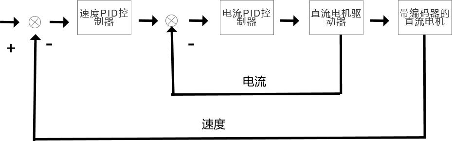
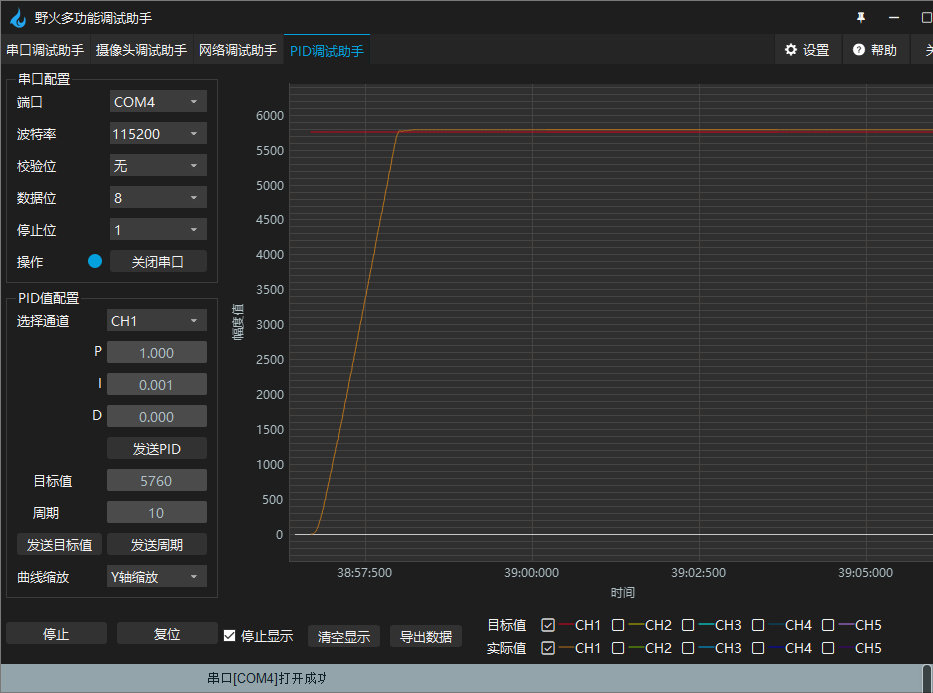
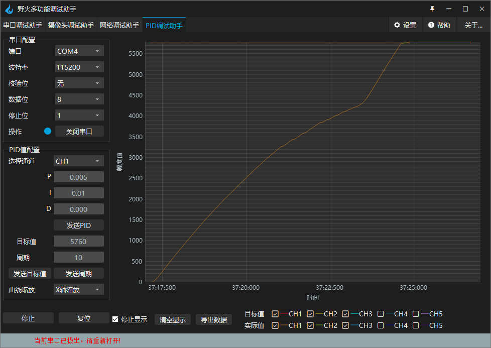

.. vim: syntax=rst

有刷电机多环控制实现
==========================================

通过前面章节的学习，我们已经大致了解速度环、电流环、位置环等使用方法。通过简单的介绍，对各种反馈环节如何去选择也有了一定的了解。在实际的生产生活中，单闭环控制系统并不是最常使用的，因为实际环节里，往往存在着许多的干扰等各种因素。

简单举例，汽车在爬坡过程中，想要汽车有足够的力量爬坡，又想速度又快又稳。在类似的场景中，如果想要达到良好的调节效果，往往会使用多环控制。以前面的举例来说，在整个控制闭环内，速度环的后级，再串上一个电流环，以前级的输出(这里指速度环的输出)，作为后级的输入(这里指作为电流环的输入)，最终后级(电流环)的输出最终实现在执行机构上,以形成双反馈控制的效果。下面框图可能可以帮助理解串级PID的组织结构。

野火提供的电机开发板配套例程中，有两环和三环的串级PID控制例程，串级PID的实现原理大同小异。在本章中，我们通过前面学习的位置式PID和单环PID调整知识，来实现速度环、电流环、位置环三环串级PID控制， 如果还不知道什么是位置式PID和各种反馈环的实现D，请务必先学习前面的章节。下面我们通过讲解如何使用位置环、速度环、电流环三环控制，来领略多环控制的魅力。

硬件设计
--------------

本章实验需要连接开发板和驱动板，这里给出接线表。

MOS管搭建驱动板
^^^^^^^^^^^^^^^^^^^^^^^^^^^^^^^^^

电机与MOS管搭建驱动板连接见下表所示。

.. list-table:: 电机与MOS管搭建驱动板连接
    :widths: 20 20
    :header-rows: 1

    * - 电机
      - MOS管搭建驱动板
    * - M+
      - M+
    * - 5V
      - 编码器电源：+
    * - GND
      - 编码器电源：-
    * - A
      - A
    * - B
      - B
    * - M-
      - M-

MOS管搭建驱动板与主控板连接见下表所示。

.. list-table:: MOS管搭建驱动板与主控板连接
    :widths: 20 20
    :header-rows: 1

    * - MOS管搭建驱动板
      - 主控板
    * - PWM1
      - PA9
    * - PWM2
      - PA8
    * - 编码器A端
      - PC6
    * - 编码器B端
      - PC7
    * - SD
      - PG12
    * - 信号检测-电流
      - PB1
    * - 信号检测-电压
      - PB0
    * - 电源输入：5V
      - 5V
    * - 电源输入：GND
      - GND

推荐使用配套的牛角排线直接连接驱动板和主控板。连接开发板的那端，请连接在“无刷电机驱动接口1”上。

直流电机速度环、电流环、位置环三环串级PID控制-位置式PID实现
------------------------------------------------------------

软件分析
^^^^^^^^^^^^^^^^^^^^^

编程要点
""""""""""""""""""""""""""""""""""

(1) 配置基本定时器可以产生定时中断来执行PID运算
(2) 编写位置式PID算法
(3) 编写位置环、速度环、电流环控制函数
(4) 增加上位机曲线观察相关代码
(5) 编写按键控制代码

软件设计
^^^^^^^^^^^^^^^^^^^^^

软件部分通过前面章节的三环整合来实现代码，将速度环、电流环、位置环的实现部分添加进新的工程，本章代码在野火电机驱动例程中\\improve_part\\F407\\直流有刷电机-位置环速度环电流环控制-位置式PID目录下，下面我们详细来看。

在串级PID控制中，最外环一般选择期望控制的参数的环节，例如对应速度快慢的速度环、位置的位置环、电流大小的电流环大小，本代码的选择位置环作为最外环，位置作为控制量，期望控制电机实际位置。在主函数中，可以看出这点。

主函数
""""""""""""""""""""""""""""""""""

.. code-block:: c
  :caption: 主函数
  :linenos:

    /**
    * @brief  主函数
    * @param  无
    * @retval 无
    */
    int main(void)
    {
    int32_t target_location = PER_CYCLE_PULSES;
    
    /* HAL 库初始化 */
    HAL_Init();
    
    /* 初始化系统时钟为168MHz */
    SystemClock_Config();

    /* 初始化按键 GPIO */
    Key_GPIO_Config();
    
    /* 初始化 LED */
    LED_GPIO_Config();
    
    /* 协议初始化 */
    protocol_init();
    
    /* 初始化串口 */
    DEBUG_USART_Config();

    /* 电机初始化 */
    motor_init();
    
    set_motor_disable();     // 停止电机 

    /* ADC 初始化 */
    ADC_Init();
    
    /* 编码器接口初始化 */
    Encoder_Init();
    
    /* 初始化基本定时器，用于处理定时任务 */
    TIMx_Configuration();
    
    /* PID 参数初始化 */
    PID_param_init();
    
    set_pid_target(&pid_location, target_location);    // 设置目标值
    
    #if defined(PID_ASSISTANT_EN)
    set_computer_value(SEND_STOP_CMD, CURVES_CH1, NULL, 0);    // 同步上位机的启动按钮状态
    set_computer_value(SEND_TARGET_CMD, CURVES_CH1, &target_location, 1);     // 给通道 1 发送目标值
    #endif

        while(1)
        {
        /* 接收数据处理 */
        receiving_process();
        
        /* 扫描KEY1 */
        if( Key_Scan(KEY1_GPIO_PORT, KEY1_PIN) == KEY_ON)
        {
        #if defined(PID_ASSISTANT_EN) 
        set_computer_value(SEND_START_CMD, CURVES_CH1, NULL, 0);               // 同步上位机的启动按钮状态
        #endif
        set_pid_target(&pid_location, target_location);    // 设置目标值
        set_motor_enable();              // 使能电机
        }
        
        /* 扫描KEY2 */
        if( Key_Scan(KEY2_GPIO_PORT, KEY2_PIN) == KEY_ON)
        {
        set_motor_disable();     // 停止电机
        set_computer_value(SEND_STOP_CMD, CURVES_CH1, NULL, 0);               // 同步上位机的启动按钮状态
        }
        
        /* 扫描KEY3 */
        if( Key_Scan(KEY3_GPIO_PORT, KEY3_PIN) == KEY_ON)
        {
        /* 增大目标位置 */
        target_location += PER_CYCLE_PULSES;
        
        set_pid_target(&pid_location, target_location);
        #if defined(PID_ASSISTANT_EN)
        set_computer_value(SEND_TARGET_CMD, CURVES_CH1,  &target_location, 1);     // 给通道 1 发送目标值
        #endif
        }

        /* 扫描KEY4 */
        if( Key_Scan(KEY4_GPIO_PORT, KEY4_PIN) == KEY_ON)
        {
        /* 减小目标位置 */
        target_location -= PER_CYCLE_PULSES;
        
        set_pid_target(&pid_location, target_location);
        #if defined(PID_ASSISTANT_EN)
        set_computer_value(SEND_TARGET_CMD, CURVES_CH1,  &target_location, 1);     // 给通道 1 发送目标值
        #endif
        }
        }
    }

主函数中，做了外设初始化的相关操作。此外还通过target_location这一变量， 设定了目标位置，即实际中电机需要转动达到的位置，通过前面位置环的学习，可以知道这一变量被赋值为宏PER_CYCLE_PULSES，意味着电机目标位置为转动一圈后达到的位置。剩余操作与前面章节一致，通过按键控制电机，略过不讲，下面看PID参数的初始化和整定的一些说明。

PID参数初始化、整定说明
""""""""""""""""""""""""""""""""""

与前面章节不同的是，由于引入了三环控制(位置环、速度环、电流环)，所以在PID初始化时，对应的有三套PID参数，同理两环有两套。具体看代码。

.. code-block:: c
  :caption: 位置式PID参数初始化-\\pid\\bsp_pid.c
  :linenos:

    _pid pid_location;
    _pid pid_curr;
    _pid pid_speed;

    /**
    * @brief  PID参数初始化
        *	@note 	无
    * @retval 无
    */
    void PID_param_init(void)
    {
        /* 位置相关初始化参数 */
        pid_location.target_val=0.0;				
        pid_location.actual_val=0.0;
        pid_location.err=0.0;
        pid_location.err_last=0.0;
        pid_location.integral=0.0;

        pid_location.Kp = 0.01418;
        pid_location.Ki = 0.0;
        pid_location.Kd = 0.0;

        /* 速度相关初始化参数 */
        pid_speed.target_val=150.0;				
        pid_speed.actual_val=0.0;
        pid_speed.err=0.0;
        pid_speed.err_last=0.0;
        pid_speed.integral=0.0;

        pid_speed.Kp = 0.05;
        pid_speed.Ki = 0.008;
        pid_speed.Kd = 0.0;
        /* 电流相关初始化参数 */
        pid_curr.target_val=80.0;				
        pid_curr.actual_val=0.0;
        pid_curr.err=0.0;
        pid_curr.err_last=0.0;
        pid_curr.integral=0.0;

        pid_curr.Kp = 1.0;
        pid_curr.Ki = 10.0;//5.5
        pid_curr.Kd = 0.00;

    #if defined(PID_ASSISTANT_EN)
        float pid_temp[3] = {pid_location.Kp, pid_location.Ki, pid_location.Kd};
    //    set_computer_value(SEND_P_I_D_CMD, CURVES_CH1, pid_temp, 3);     // 给通道 1 发送 P I D 值

        pid_temp[0] = pid_speed.Kp;
        pid_temp[1] = pid_speed.Ki;
        pid_temp[2] = pid_speed.Kd;
    //    set_computer_value(SEND_P_I_D_CMD, CURVES_CH2, pid_temp, 3);     // 给通道 2 发送 P I D 值

        pid_temp[0] = pid_curr.Kp;
        pid_temp[1] = pid_curr.Ki;
        pid_temp[2] = pid_curr.Kd;
    //    set_computer_value(SEND_P_I_D_CMD, CURVES_CH3, pid_temp, 3);     // 给通道 3 发送 P I D 值

    #endif
    } 

从代码中，可以看到三套PID参数配置结构体，它们分别是位置环、速度环、电流环的PID参数配置。这三套配置，需要我们从内环到外环依次的调参。以本章工程为例，本章工程是位置环作为最外环，电流环作为最内环，所以进行PID调参时，从电流环开始调参。调参时参考《PID控制器参数整定》章节的方法进行PID的整定。

定时器定时计算PID并输出
""""""""""""""""""""""""""""""""""

定时器配置与前面章节相同，不详细展开，参考前面章节。通过定时器的定时调用，我们进行PID运算并实现定时对电机的输出控制，具体看代码。

.. code-block:: c
  :caption: 三环控制定时器计算PID-\\motor_control\\bsp_motor_control.c
  :linenos:

    /**
    * @brief  电机位置式 PID 控制实现(定时调用)
    * @param  无
    * @retval 无
    */
    void motor_pid_control(void)
    {
    static uint32_t louter_ring_timer = 0;      // 外环环周期（电流环计算周期为定时器周期T，速度环为2T，位置环为3T）
    int32_t actual_current = get_curr_val();    // 读取当前电流值
    if(actual_current > TARGET_CURRENT_MAX)
    {
        actual_current = TARGET_CURRENT_MAX;
    }
    if (is_motor_en == 1)                  // 电机在使能状态下才进行控制处理
    {
        static int32_t Capture_Count = 0;    // 当前时刻总计数值
        static int32_t Last_Count = 0;       // 上一时刻总计数值
        float cont_val = 0;                  // 当前控制值
        
        /* 当前时刻总计数值 = 计数器值 + 计数溢出次数 * ENCODER_TIM_PERIOD  */
        Capture_Count = __HAL_TIM_GET_COUNTER(&TIM_EncoderHandle) + (Encoder_Overflow_Count * ENCODER_TIM_PERIOD);
        
        /* 位置环计算 */
        if (louter_ring_timer % 3 == 0)
        {
        cont_val = location_pid_realize(&pid_location, Capture_Count);    // 进行 PID 计算

        /* 目标速度上限处理 */
        if (cont_val > TARGET_SPEED_MAX)
        {
            cont_val = TARGET_SPEED_MAX;
        }
        else if (cont_val < -TARGET_SPEED_MAX)
        {
            cont_val = -TARGET_SPEED_MAX;
        }
    
        set_pid_target(&pid_speed, cont_val);    // 设定速度的目标值
        
        #if defined(PID_ASSISTANT_EN)
        int32_t temp = cont_val;
        set_computer_value(SEND_TARGET_CMD, CURVES_CH2, &temp, 1);     // 给通道 2 发送目标值
        #endif
        }

        /* 速度环计算 */
        static int32_t actual_speed = 0;                 // 实际测得速度
        if (louter_ring_timer++ % 2 == 0)
        {
        /* 转轴转速 = 单位时间内的计数值 / 编码器总分辨率 * 时间系数  */
        actual_speed = ((float)(Capture_Count - Last_Count) / ENCODER_TOTAL_RESOLUTION / REDUCTION_RATIO) / (GET_BASIC_TIM_PERIOD()*2/1000.0/60.0);
            
        /* 记录当前总计数值，供下一时刻计算使用 */
        Last_Count = Capture_Count;
        
        cont_val = speed_pid_realize(&pid_speed, actual_speed);    // 进行 PID 计算

        if (cont_val > 0)    // 判断电机方向
        {
            set_motor_direction(MOTOR_FWD);
        }
        else
        {
            cont_val = -cont_val;
            set_motor_direction(MOTOR_REV);
        }
    
        cont_val = (cont_val > TARGET_CURRENT_MAX) ? TARGET_CURRENT_MAX : cont_val;    // 电流上限处理
        set_pid_target(&pid_curr, cont_val);    // 设定电流的目标值
        
        #if defined(PID_ASSISTANT_EN)
        int32_t temp = cont_val;
        set_computer_value(SEND_TARGET_CMD, CURVES_CH3, &temp, 1);     // 给通道 3 发送目标值  
        #endif
        }
        
        /* 电流环计算 */
        cont_val = curr_pid_realize(&pid_curr, actual_current);    // 进行 PID 计算
        
        if (cont_val < 0)
        {
        cont_val = 0;    // 下限处理
        }
        else if (cont_val > PWM_MAX_PERIOD_COUNT)
        {
        cont_val = PWM_MAX_PERIOD_COUNT;    // 速度上限处理
        }

        set_motor_speed(cont_val);                                                 // 设置 PWM 占空比
        
    #if defined(PID_ASSISTANT_EN)
        set_computer_value(SEND_FACT_CMD, CURVES_CH1, &Capture_Count,  1);         // 给通道 1 发送实际值
        set_computer_value(SEND_FACT_CMD, CURVES_CH2, &actual_speed,   1);         // 给通道 2 发送实际值
        set_computer_value(SEND_FACT_CMD, CURVES_CH3, &actual_current, 1);         // 给通道 3 发送实际值
    #else
        printf("1.电流：实际值：%d. 目标值：%.0f.\n", Capture_Count, get_pid_target(&pid_location));      // 打印实际值和目标值
    #endif
    }
    label:;
    }

代码的整体实现逻辑，是位置环作为三环控制的外环，它的PID输出作为中间环(即速度环)的输入，而速度环的PID输出，作为电流环(内环)的输入，以达到三环控制的目的。增加了速度环、电流环，即增加了对速度、电流控制的期望，将速度、电流也纳入到了控制的环节中，这样一方面降低了干扰，另一方可以对速度、电流进行跟随，防止超调。

从代码中可以看到，在定时器调用的不同周期中(由louter_ring_timer控制)计算了各环的PID参数。内环控制的周期要比外环周期短，因为内环控制着最终的输出，这个输出对应的就是实际场景中的控制量(本代码中最终的控制量是位置)，位置是无法突变，是需要时间积累的，所以内环输出尽可能快些。

在实际应用中，还是根据实际的场景设定内外环控制周期。控制的最终效果，还是要让内环跟随外环的变化趋势最终达到稳定效果。

.. code-block:: c
  :caption: 限赋值宏定义-\\motor_control\\bsp_motor_control.c
  :linenos:

    #define TARGET_CURRENT_MAX    130    // 目标电流的最大值 mA
    #define TARGET_SPEED_MAX      200    // 目标速度的最大值 r/m

通过宏定义，对速度环和电流环的输入参数进行限制，预防超调的情况发生。

下面我们来看每一环的具体实现。

位置环
*****************

.. code-block:: c
  :caption: 三环控制定时器计算PID位置环-\\pid\\bsp_pid.c
  :linenos:

    /**
    * @brief  位置PID算法实现
    * @param  actual_val:实际值
    * @note 	无
    * @retval 通过PID计算后的输出
    */
    float location_pid_realize(_pid *pid, float actual_val)
    {
        /*计算目标值与实际值的误差*/
        pid->err = pid->target_val - actual_val;
    
        /* 限定闭环死区 */
        if((pid->err >= -40) && (pid->err <= 40))
        {
            pid->err = 0;
            pid->integral = 0;
        }
        
        /* 积分分离，偏差较大时去掉积分作用 */
        if (pid->err > -1500 && pid->err < 1500)
        {
            pid->integral += pid->err;    // 误差累积
            
            /* 限定积分范围，防止积分饱和 */
            if (pid->integral > 4000) 
                pid->integral = 4000;
            else if (pid->integral < -4000) 
                pid->integral = -4000;
        }

            /*PID算法实现*/
        pid->actual_val = pid->Kp * pid->err + 
                        pid->Ki * pid->integral + 
                        pid->Kd * (pid->err - pid->err_last);
    
            /*误差传递*/
        pid->err_last = pid->err;
        
            /*返回当前实际值*/
        return pid->actual_val;
    }

代码的实现与前面章节基本相似，只是添加了一些特殊的计算。

因为使用PID控制，实际的控制过程中常常会遇到一些问题，例如积分饱和、死区处理。这就要求我们要在PID运算中，对计算过程加以干预，防止控制效果达不到预期。进行常见的数据处理方式有许多。这里只讲本工程中遇到的两种问题处理的方法。

闭环死区，是指执行机构的最小控制量，无法满足控制需求产生的。举个例子，假设有个水池，你期望控制水龙头让水从水池以1.5L每秒的流速流出，但是你买的水龙头流量太大了，水龙头按最小刻度拧一下都会让流速增加1L每秒。最终流速只能控制在1L每秒或2L每秒，始终无法达到预设值。这1.5L小数点后的范围内，就是闭环死区，系统是无法控制的。如果不限定闭环，因为始终无法达到目标值，误差会一直存在，容易发生震荡现象。一般情况下要是系统要求的精确度不高，就可以设定闭环死区来解决。还是以上面为例，如果说水1L或2L每秒的流速流出也是能接受的，就可以认为只要实际值和目标值的误差在2分之一升以内，就没有误差，将目标值与实际值之差赋值为0，这就限定了闭环死区。

积分饱和的处理。积分饱和，就是执行机构达到极限输出能力了，仍无法到达目标值，在很长一段时间内无法消除静差造成的。简单举例，就是电机满功率运行，仍达不到期望转速，在一段时间内没有到达目标值，这时候PID的积分项累计了很大的数值，如果这时候到达了目标值或者重新设定了目标值，由于积分由于累计的误差很大，系统并不能马上稳定到目标值，并会造成严重的超调或失调的现象。解决办法有很多，代码中使用了积分分离的方法，在累计误差大于一定值后去掉积分项的作用。

速度环
*****************

.. code-block:: c
  :caption: 三环控制定时器计算PID速度环-\\pid\\bsp_pid.c
  :linenos:

    /**
    * @brief  速度PID算法实现
    * @param  actual_val:实际值
    * @note 	无
    * @retval 通过PID计算后的输出
    */
    float speed_pid_realize(_pid *pid, float actual_val)
    {
            /*计算目标值与实际值的误差*/
        pid->err = pid->target_val - actual_val;

        if((pid->err<0.2f ) && (pid->err>-0.2f))
            pid->err = 0.0f;

        pid->integral += pid->err;    // 误差累积

            /*PID算法实现*/
        pid->actual_val = pid->Kp * pid->err + 
                        pid->Ki * pid->integral + 
                        pid->Kd * (pid->err - pid->err_last);

            /*误差传递*/
        pid->err_last = pid->err;
        
            /*返回当前实际值*/
        return pid->actual_val;
    }

由于编码器精度原因，当实际值和目标值的偏差小于编码区能测量得到的最小精度时，就认为目标值与实际值没有偏差，pid->err为0。

电流环
*****************

.. code-block:: c
  :caption: 三环控制定时器计算PID电流环-\\pid\\bsp_pid.c
  :linenos:

    /**
    * @brief  电流环PID算法实现
    * @param  actual_val:实际值
    * @note 	无
    * @retval 通过PID计算后的输出
    */
    float curr_pid_realize(_pid *pid, float actual_val)
    {
            /*计算目标值与实际值的误差*/
        pid->err=pid->target_val-actual_val;

        pid->integral += pid->err;    // 误差累积
    
        if (pid->err > -5 && pid->err < 5)
            pid->err = 0;
    
        /* 限定积分范围，防止积分饱和 */
        if (pid->integral > 2000) 
            pid->integral = 2000;
        else if (pid->integral < -2000) 
            pid->integral = -2000;

            /*PID算法实现*/
        pid->actual_val = pid->Kp * pid->err + 
                        pid->Ki * pid->integral + 
                        pid->Kd * (pid->err - pid->err_last);
    
            /*误差传递*/
        pid->err_last=pid->err;
        
            /*返回当前实际值*/
        return pid->actual_val;
    }

由于ADC采集电流精度原因，当实际值和目标值的偏差小于ADC能测量得到的最小精度时，就认为目标值与实际值没有偏差，pid->err为0。

下载验证
^^^^^^^^^^^^^^^^^^^^^

下载程序到电机开发板，我们按下Key1键启动电机(看主函数)，也可以通过上位机给PID算法输入目标值启动，开发板就能实时的通过PID运算并控制输出，见下图。

可以看到，电机按照设定的位置进行了转动。要是放大来看，可以看到实际值和目标值还是有一个小的偏差，由于精度的限制，代码中设置了死区，所以PID就不会对着点小偏差再进行PID调节了。

在调试过程中，我们可以发现，电机实际的转动效果，跟随了速度环和电流环的PID曲线，说明三环调节中的各环都需要合理整定。可以预想，要是速度环是震荡调节的，那么震荡的效果必然会叠加到最终的控制效果中。理解了这点，运用中，想要电机按照怎样的速度，怎样的电流去达到指定位置，就可以通过整定速度环、电流环的PID参数来实现了。例如想要电机以缓慢的速度到达指定位置，那么速度环的PID曲线必然是缓慢上升的，稍微调整速度环参数即可看到变化，如下图。

