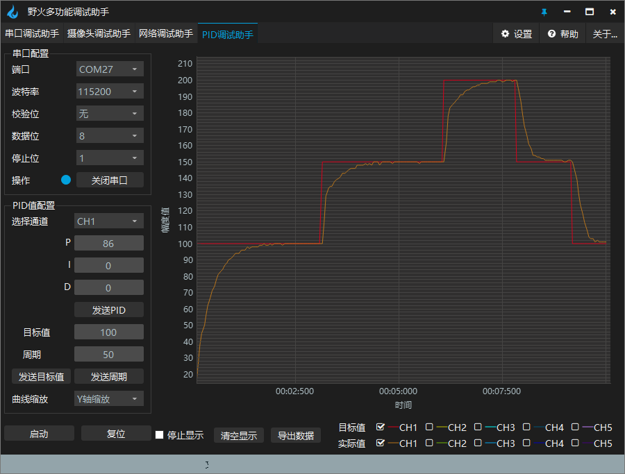
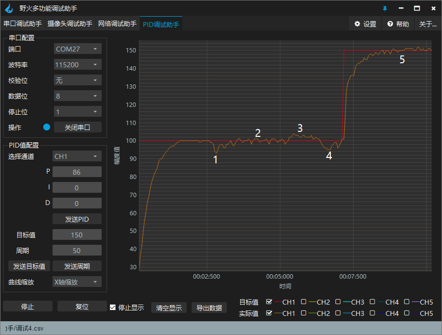
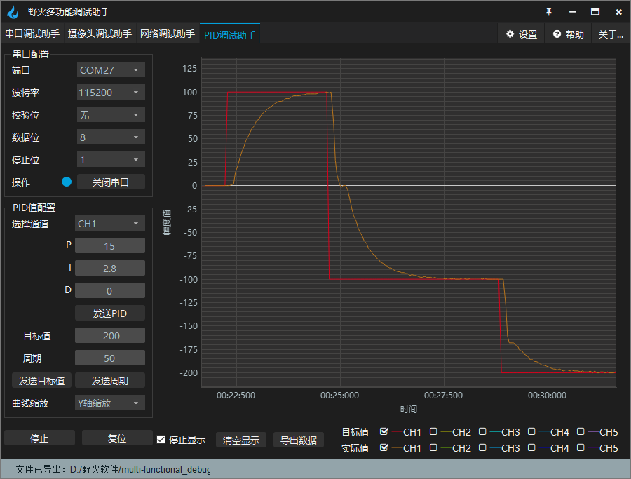

.. vim: syntax=rst

直流电机速度环控制实现
==========================================

前面我们学习了直流电机简单的PWM控制。但是我们在实际使用中并不是只是简单的PWM控制就能满足应用要求，
通常我们还需要对速度进行控制控制，如前面章节中讲到的为什么使用PID一节中列举的小车控制一样，
如果不对速度进行控制可能系统运行效果会不如预期那么好，本章节中我们就通过速度环的PID控制来实现直流电机的速度控制。

本章通过我们前面学习的位置式PID和增量式PID两种控制方式分别来实现速度环的控制，
如果还不知道什么是位置式PID和增量式PID，请务必先学习前面PID算法的通俗解说这一章节。

硬件设计
------------------------------------------
本章配套L298N和野火使用MOS管搭建的驱动板教程。

关于详细的硬件分析在直流有刷电机和编码器的使用章节中已经讲解过，这里不再做分析，
如有不明白请参考前面章节，这里只给出接线表。

L298N驱动板
^^^^^^^^^^^^^^^^^^^^^^^^^^^^^^^^^

电机与L298N驱动板连接见下表所示。

.. list-table:: 电机与L298N驱动板连接
    :widths: 40 40
    :header-rows: 1

    * - 电机
      - L298N驱动板
    * - M+
      - 电机输出：1
    * - M-
      - 电机输出：2

电机与主控板连接见下表所示。主控板上的J37需要用跳冒将VENC连接到5V。

.. list-table:: 电机与主控板连接
    :widths: 40 40
    :header-rows: 1

    * - 电机
      - 主控板
    * - 5V
      - VENC
    * - GND
      - GND
    * - A
      - PC6
    * - B
      - PC7

L298N驱动板与主控板连接见下表所示。

.. list-table:: L298N驱动板与主控板连接
    :widths: 40 40
    :header-rows: 1

    * - L298N驱动板
      - 主控板
    * - PWM1
      - PA9
    * - PWM2
      - PA8
    * - GND
      - GND
    * - ENA
      - PG12

在L298N驱动板与主控板连接中，ENA可以不接PG12，使用跳冒连接到5V。

MOS管搭建驱动板
^^^^^^^^^^^^^^^^^^^^^^^^^^^^^^^^^

电机与MOS管搭建驱动板连接见下表所示。

.. list-table:: 电机与MOS管搭建驱动板连接
    :widths: 20 20
    :header-rows: 1

    * - 电机
      - MOS管搭建驱动板
    * - M+
      - M+
    * - 5V
      - 编码器电源：+
    * - GND
      - 编码器电源：-
    * - A
      - A
    * - B
      - B
    * - M-
      - M-

MOS管搭建驱动板与主控板连接见下表所示。

.. list-table:: MOS管搭建驱动板与主控板连接
    :widths: 20 20
    :header-rows: 1

    * - MOS管搭建驱动板
      - 主控板
    * - PWM1
      - PA9
    * - PWM2
      - PA8
    * - SD
      - PG12
    * - A
      - PC6
    * - B
      - PC7
    * - 电源输入：5V
      - 5V
    * - 电源输入：GND
      - GND

推荐使用配套的牛角排线直接连接驱动板和主控板。

直流电机速度环控制-位置式PID实现
------------------------------------------

软件设计
^^^^^^^^^^^^^^^^^^^^^^^^^^^^^^^^^

这里只讲解核心的部分代码，有些变量的设置，头文件的包含等并没有涉及到，
还有一些在前章节章节分析过的代码在这里也不在重复讲解，完整的代码请参考本章配套的工程。

编程要点
"""""""""""""""""""""""""""""""""

(1) 配置定时器可以输出PWM控制电机
(2) 配置定时器可以读取编码器的计数值
(3) 配置基本定时器可以产生定时中断来执行PID运算
(4) 编写位置式PID算法
(5) 编写速度控制函数
(6) 增加上位机曲线观察相关代码
(7) 编写按键控制代码

软件分析
^^^^^^^^^^^^^^^^^^^^^^^^^^^^^^^^^

在编程要点中的1和2在前章节已经讲解过，这里就不在讲解，如果不明白请先学习前面相关章节的内容。
这里主要分析PID算法的控制实现部分。

.. code-block:: c
   :caption: bsp_basic_tim.h-宏定义
   :linenos:

    #define BASIC_TIM           		  TIM6
    #define BASIC_TIM_CLK_ENABLE()   	__TIM6_CLK_ENABLE()

    #define BASIC_TIM_IRQn				    TIM6_DAC_IRQn
    #define BASIC_TIM_IRQHandler    	TIM6_DAC_IRQHandler

    /* 累计 TIM_Period个后产生一个更新或者中断*/		
      //当定时器从0计数到BASIC_PERIOD_COUNT-1，即为BASIC_PERIOD_COUNT次，为一个定时周期
    #define BASIC_PERIOD_COUNT    (50*50)

    //定时器时钟源TIMxCLK = 2 * PCLK1  
    //				PCLK1 = HCLK / 4 
    //				=> TIMxCLK=HCLK/2=SystemCoreClock/2=84MHz
    #define BASIC_PRESCALER_COUNT   (1680)

    /* 获取定时器的周期，单位ms */
    //#define __HAL_TIM_GET_PRESCALER(__HANDLE__)      ((__HANDLE__)->Instance->PSC)    // Get TIM Prescaler.
    //#define GET_BASIC_TIM_PERIOD(__HANDLE__)    (1.0/(HAL_RCC_GetPCLK2Freq()/(__HAL_TIM_GET_PRESCALER(__HANDLE__)+1)/(__HAL_TIM_GET_AUTORELOAD(__HANDLE__)+1))*1000)

    /* 以下两宏仅适用于定时器时钟源TIMxCLK=84MHz，预分频器为：1680-1 的情况 */
    #define SET_BASIC_TIM_PERIOD(T)     __HAL_TIM_SET_AUTORELOAD(&TIM_TimeBaseStructure, (T)*50 - 1)    // 设置定时器的周期（1~1000ms）
    #define GET_BASIC_TIM_PERIOD()      ((__HAL_TIM_GET_AUTORELOAD(&TIM_TimeBaseStructure)+1)/50.0)     // 获取定时器的周期，单位ms

这里封装了定时器的一些相关的宏，使用宏定义非常方便程序升级、移植。使用SET_BASIC_TIM_PERIOD(T)这个宏可以设置定时器的周期，
这样可以通过按键或者上位机来设置这个定时器的中断周期，使用GET_BASIC_TIM_PERIOD()这个宏可以得到定时器的当前周期，
不过使用的两个宏是有要求的，需要定时器时钟源的频率是84MHz，且预分频系数为1680。
如果更换定时器和修改预分频器则需要重新计算这个宏里面的参数.我们来看一下当前宏中周期的计算:84000000/1680/50 = 1000,
84000000为时钟源的频率，1680为预分频系数，50为自动重装载值，1000为定时器产生更新中断的频率，
当定时器以(84000000/1680)Hz的频率计数到50时刚好是1ms，所以只要设置自动重装载值为50的n倍减一时，
就可以得到n毫秒的更新中断，注意n是1到1000的正整数。

.. code-block:: c
   :caption: bsp_basic_tim.c-定时器配置函数
   :linenos:

    static void TIM_Mode_Config(void)
    {
      // 开启TIMx_CLK,x[6,7] 
      BASIC_TIM_CLK_ENABLE(); 

      TIM_TimeBaseStructure.Instance = BASIC_TIM;
      /* 累计 TIM_Period个后产生一个更新或者中断*/		
      //当定时器从0计数到BASIC_PERIOD_COUNT-1，即为BASIC_PERIOD_COUNT次，为一个定时周期
      TIM_TimeBaseStructure.Init.Period = BASIC_PERIOD_COUNT - 1;       

      //定时器时钟源TIMxCLK = 2 * PCLK1  
      //				PCLK1 = HCLK / 4 
      //				=> TIMxCLK=HCLK/2=SystemCoreClock/2=84MHz
      // 设定定时器频率为=TIMxCLK/BASIC_PRESCALER_COUNT
      TIM_TimeBaseStructure.Init.Prescaler = BASIC_PRESCALER_COUNT - 1;	
      TIM_TimeBaseStructure.Init.CounterMode = TIM_COUNTERMODE_UP;           // 向上计数
      TIM_TimeBaseStructure.Init.ClockDivision = TIM_CLOCKDIVISION_DIV1;     // 时钟分频

      // 初始化定时器TIMx, x[2,3,4,5]
      HAL_TIM_Base_Init(&TIM_TimeBaseStructure);

      // 开启定时器更新中断
      HAL_TIM_Base_Start_IT(&TIM_TimeBaseStructure);	
    }

首先定义两个定时器初始化结构体，定时器模式配置函数主要就是对这两个结构体的成员进行初始化，
然后通过调用的初始化函数HAL_TIM_Base_Init()把这些参数写入定时器的寄存器中。
有关结构体的成员介绍请参考定时器详解章节。
最后通过调用函数HAL_TIM_Base_Start_IT()使能定时器的更新中断。

.. code-block:: c
   :caption: bsp_basic_tim.c-定时器初始
   :linenos:

    void TIMx_Configuration(void)
    {
      TIMx_NVIC_Configuration();	
      
      TIM_Mode_Config();
      
    #if defined(PID_ASSISTANT_EN)
      uint32_t temp = GET_BASIC_TIM_PERIOD();     // 计算周期，单位ms
      
      set_computer_value(SEED_PERIOD_CMD, CURVES_CH1, &temp, 1);     // 给通道 1 发送目标值
    #endif

    }

该函数主要配置了定时器的中断设置和定时器模式配置，最后调用set_computer_value()函数设置了上位机的周期值，
这里只是同步一下上位机显示的周期值。PID_ASSISTANT_EN是用于选择是否使用上位机的宏，
当我们在调试阶段时可以定义这个宏，方便使用上位机（野火调试助手-PID调试助手）来观察电机的运行效果，
在完成调试后我们可以直接不定义这个宏，这样就去掉了上位机相关部分。

.. code-block:: c
   :caption: stm32f4xx_it.c-定时器更新中断回调函数
   :linenos:

    void HAL_TIM_PeriodElapsedCallback(TIM_HandleTypeDef *htim)
    {
      if(htim==(&TIM_EncoderHandle))
      {
        /* 判断当前计数器计数方向 */
        if(__HAL_TIM_IS_TIM_COUNTING_DOWN(&TIM_EncoderHandle))
          /* 下溢 */
          Encoder_Overflow_Count--;
        else
          /* 上溢 */
          Encoder_Overflow_Count++;
      }
      else if(htim==(&TIM_TimeBaseStructure))
      {
        motor_pid_control();
      }
    }

其中当htim=(&TIM_EncoderHandle)时是编码器定时器计数器溢出，当htim=(&TIM_TimeBaseStructure)时是基本定时器，
在这里调用motor_pid_control()进行PID的周期性的控制。

.. code-block:: c
   :caption: bsp_pid.c-位置式PID参数初始化
   :linenos:

    void PID_param_init()
    {
        /* 初始化参数 */
        pid.target_val=100.0;				
        pid.actual_val=0.0;
        pid.err=0.0;
        pid.err_last=0.0;
        pid.integral=0.0;

        pid.Kp = 13;
        pid.Ki = 3.5;
        pid.Kd = 0.04;

    #if defined(PID_ASSISTANT_EN)
        float pid_temp[3] = {pid.Kp, pid.Ki, pid.Kd};
        set_computer_value(SEED_P_I_D_CMD, CURVES_CH1, pid_temp, 3);     // 给通道 1 发送 P I D 值
    #endif
    }

PID_param_init()函数把结构体pid参数初始化，将目标值pid.target_val设置为100.0，将实际值、偏差值和积分项等初始化为0，
其中pid.Kp、pid.Ki和pid.Kd是我们配套电机运行效果相对比较好的参数，不同的电机该参数是不同的。
set_computer_value()函数用来同步上位机显示的PID值。

.. code-block:: c
   :caption: bsp_pid.c-位置式PID算法实现
   :linenos:
   
    float PID_realize(float actual_val)
    {
        /*计算目标值与实际值的误差*/
        pid.err=pid.target_val-actual_val;
        /*误差累积*/
        pid.integral+=pid.err;
        /*PID算法实现*/
        pid.actual_val=pid.Kp*pid.err+pid.Ki*pid.integral+pid.Kd*(pid.err-pid.err_last);
        /*误差传递*/
        pid.err_last=pid.err;
        /*返回当前实际值*/
        return pid.actual_val;
    }

这个函数主要实现了位置式PID算法，用传入的目标值减去实际值得到误差值得到比例项，在对误差值进行累加得到积分项，
用本次误差减去上次的误差得到微分项，然后通过前面章节介绍的位置式PID公式实现PID算法，并返回实际控制值。

.. image:: ../media/PID_lisan5.png
   :align: center

这个公式就是代码第8行中的公式形式，公式和代码的计算方式基本一致，只不过在公式中第二项的Ki是使用的对误差积分，
在代码中变成了对误差的累加，虽然表达形式不一样，但是达到的效果和目的是一样的。
计算过后将误差传递用于下一次使用，并将实际值返回。

当不使用PID控制，直接输出固定占空的PWM进行控制的时候，返回的速度也会有波动，这个波动是不可避免的，
所以在PID的控制过程中不可能把速度刚好调整为目标值，这时候我们就需要把波动的误差设置为0。

.. code-block:: c
   :caption: bsp_motor_control.c-速度环pid控制
   :linenos:

    void motor_pid_control(void)
    {
      if (is_motor_en == 1)     // 电机在使能状态下才进行控制处理
      {
        float cont_val = 0;                       // 当前控制值
        static __IO int32_t Capture_Count = 0;    // 当前时刻总计数值
        static __IO int32_t Last_Count = 0;       // 上一时刻总计数值
        int32_t actual_speed = 0;                 // 实际测得速度
        
        /* 当前时刻总计数值 = 计数器值 + 计数溢出次数 * ENCODER_TIM_PERIOD  */
        Capture_Count =__HAL_TIM_GET_COUNTER(&TIM_EncoderHandle) + (Encoder_Overflow_Count * ENCODER_TIM_PERIOD);
        
        /* 转轴转速 = 单位时间内的计数值 / 编码器总分辨率 * 时间系数  */
        actual_speed = ((float)(Capture_Count - Last_Count) / ENCODER_TOTAL_RESOLUTION / REDUCTION_RATIO) / (GET_BASIC_TIM_PERIOD()/1000.0/60.0);
        
        /* 记录当前总计数值，供下一时刻计算使用 */
        Last_Count = Capture_Count;
        
        cont_val = PID_realize(actual_speed);    // 进行 PID 计算
        
        if (cont_val > 0)    // 判断电机方向
        {
          set_motor_direction(MOTOR_FWD);
        }
        else
        {
          cont_val = -cont_val;
          set_motor_direction(MOTOR_REV);
        }
        
        cont_val = (cont_val > PWM_PERIOD_COUNT) ? PWM_PERIOD_COUNT : cont_val;    // 速度上限处理
        set_motor_speed(cont_val);                                                 // 设置 PWM 占空比
        
      #if defined(PID_ASSISTANT_EN)
        set_computer_value(SEED_FACT_CMD, CURVES_CH1, &actual_speed, 1);                // 给通道 1 发送实际值
      #else
        printf("实际值：%d. 目标值：%.0f\n", actual_speed, get_pid_actual());      // 打印实际值和目标值
      #endif
      }
    }

该函数在定时器的中断里定时调用默认是50毫秒调用一次，如果改变了周期那么PID三个参数也需要做相应的调整，
PID的控制周期与控制效果是息息相关的。通过Capture_Count和Last_Count这两个变量记录了当前时刻和上一个周期时编码器的计数值，
由(Capture_Count-Last_Count)可以得到在一个周期编码器的计数值，
再由(Capture_Count - Last_Count) / ENCODER_TOTAL_RESOLUTION / REDUCTION_RATIO可以得到在这个周期内电机轴实际旋转的圈数，
GET_BASIC_TIM_PERIOD()/1000.0/60.0为周期的对应的时间，单位是分钟。
所以((float)(Capture_Count-Last_Count)/ENCODER_TOTAL_RESOLUTION/REDUCTION_RATIO)/(GET_BASIC_TIM_PERIOD()/1000.0/60.0)就是电机的旋转速度，
单位是转每分钟。把实际速度带入PID_realize(actual_speed)进行运算，通过返回的结果的正负来确定电机的旋转方向，
最后对输出的结果做一个上限处理，最后用于PWM占空比的控制，最后将实际的速度值发送到上位机绘制变化的曲线。

.. code-block:: c
  :caption: protocol.c-串口数据解析
  :linenos:

  /**
  * @brief   接收的数据处理
  * @param   void
  * @return  -1：没有找到一个正确的命令.
  */
  int8_t receiving_process(void)
  {
    uint8_t frame_data[128];         // 要能放下最长的帧
    uint16_t frame_len = 0;          // 帧长度
    uint8_t cmd_type = CMD_NONE;     // 命令类型
    
    while(1)
    {
      cmd_type = protocol_frame_parse(frame_data, &frame_len);
      switch (cmd_type)
      {
        case CMD_NONE:
        {
          return -1;
        }

        case SET_P_I_D_CMD:
        {
          uint32_t temp0 = COMPOUND_32BIT(&frame_data[13]);
          uint32_t temp1 = COMPOUND_32BIT(&frame_data[17]);
          uint32_t temp2 = COMPOUND_32BIT(&frame_data[21]);
          
          float p_temp, i_temp, d_temp;
          
          p_temp = *(float *)&temp0;
          i_temp = *(float *)&temp1;
          d_temp = *(float *)&temp2;
          
          set_p_i_d(p_temp, i_temp, d_temp);    // 设置 P I D
        }
        break;

        case SET_TARGET_CMD:
        {
          int actual_temp = COMPOUND_32BIT(&frame_data[13]);    // 得到数据
          
          set_pid_target(actual_temp);    // 设置目标值
        }
        break;
        
        case START_CMD:
        {
          set_motor_enable();              // 启动电机
        }
        break;
        
        case STOP_CMD:
        {
          set_motor_disable();              // 停止电机
        }
        break;
        
        case RESET_CMD:
        {
          HAL_NVIC_SystemReset();          // 复位系统
        }
        break;
        
        case SET_PERIOD_CMD:
        {
          uint32_t temp = COMPOUND_32BIT(&frame_data[13]);     // 周期数
          SET_BASIC_TIM_PERIOD(temp);                             // 设置定时器周期1~1000ms
        }
        break;

        default: 
          return -1;
      }
    }
  }

这函数用于处理上位机发下的数据，在主函数中循环调用，可以使用上位机调整PID参数，使用上位机可以非常方便的调整PID参数，
这样可以不用每次修改PID参数时都要改代码、编译和下载代码；可以使用上位机设置目标速度；可以启动和停止电机；
可以使用上位机复位系统；可以使用上位机设置定时器的周期；具体功能的实现请参考配套工程代码。

.. code-block:: c
  :caption: main.c-主函数
  :linenos:
  
  /**
    * @brief  主函数
    * @param  无
    * @retval 无
    */
  int main(void)
  {
    int32_t target_speed = 100;
    
    /* HAL 库初始化 */
    HAL_Init();
    
    /* 初始化系统时钟为168MHz */
    SystemClock_Config();
    
    /* 初始化按键 GPIO */
    Key_GPIO_Config();
    
    /* 初始化 LED */
    LED_GPIO_Config();
    
    /* 协议初始化 */
    protocol_init();
    
    /* 初始化串口 */
    DEBUG_USART_Config();

    /* 电机初始化 */
    motor_init();
    
    set_motor_disable();     // 停止电机 
    
    /* 编码器接口初始化 */
    Encoder_Init();
    
    /* 初始化基本定时器，用于处理定时任务 */
    TIMx_Configuration();
    
    /* PID 参数初始化 */
    PID_param_init();
    
  #if defined(PID_ASSISTANT_EN)
    set_computer_value(SEND_STOP_CMD, CURVES_CH1, NULL, 0);    // 同步上位机的启动按钮状态
    set_computer_value(SEND_TARGET_CMD, CURVES_CH1, &target_speed, 1);     // 给通道 1 发送目标值
  #endif

    while(1)
    {
      /* 接收数据处理 */
      receiving_process();
      
      /* 扫描KEY1 */
      if( Key_Scan(KEY1_GPIO_PORT, KEY1_PIN) == KEY_ON)
      {
      #if defined(PID_ASSISTANT_EN) 
        set_computer_value(SEND_START_CMD, CURVES_CH1, NULL, 0);               // 同步上位机的启动按钮状态
      #endif
        set_pid_target(target_speed);    // 设置目标值
        set_motor_enable();              // 使能电机
      }
      
      /* 扫描KEY2 */
      if( Key_Scan(KEY2_GPIO_PORT, KEY2_PIN) == KEY_ON)
      {
        set_motor_disable();     // 停止电机
      #if defined(PID_ASSISTANT_EN) 
        set_computer_value(SEND_STOP_CMD, CURVES_CH1, NULL, 0);               // 同步上位机的启动按钮状态
      #endif
      }
      
      /* 扫描KEY3 */
      if( Key_Scan(KEY3_GPIO_PORT, KEY3_PIN) == KEY_ON)
      {
        /* 增大目标速度 */
        target_speed += 50;
        
        if(target_speed > 350)
          target_speed = 350;
        
        set_pid_target(target_speed);
      #if defined(PID_ASSISTANT_EN)
        set_computer_value(SEND_TARGET_CMD, CURVES_CH1,  &target_speed, 1);     // 给通道 1 发送目标值
      #endif
      }

      /* 扫描KEY4 */
      if( Key_Scan(KEY4_GPIO_PORT, KEY4_PIN) == KEY_ON)
      {
        /* 减小目标速度 */
        target_speed -= 50;
        
        if(target_speed < -350)
          target_speed = -350;
        
        set_pid_target(target_speed);
      #if defined(PID_ASSISTANT_EN)
        set_computer_value(SEND_TARGET_CMD, CURVES_CH1,  &target_speed, 1);     // 给通道 1 发送目标值
      #endif
      }
    }
  }

在主函数里面首先做了一些外设的初始化，然后通过按键可以控制电机的启动、停止和目标速度的设定，
在使用上位机的情况下这些操作也可以通过上位机完成。

下载验证
^^^^^^^^^^^^^^^^^^^^^^^^^^^^^^^^^

我们按前面介绍的硬件连接好电机和驱动板，L298N和野火使用MOS管搭建的驱动板的程序是一样的。

将程序编译下载后，使用Type-C数据线连接开发板到电脑USB，打开野火调试助手-PID调试助手来观察电机的运行效果。
按下KEY1可以启动电机，按下KEY2可以停止电机，按下KEY3可以加速，按下KEY4可以减速。按下按键改变速度后，
我们可以通过上位机来观察速度的变化情况，也可以通过上位机来控制电机。下图是不带负载的电机运行效果图。

下图是带负载的运行效果图，在图中1点时增加负载（手捏住电机轴，**谨慎操作**），可以看到速度下降，但是马上有回升，
在2点速度还是在目标值附近波动，在3点去掉负载，速度上升后马上有下降到目标值；在4点增加负载，
紧接着改变目标值，在4点到5点间负载是一直存在的，可以到速度在有负载的情况下一样可以迅速达到目标值。

直流电机速度环控制-增量式PID实现
------------------------------------------

软件设计
^^^^^^^^^^^^^^^^^^^^^^^^^^^^^^^^^

通过前面位置式PID控制的学习，大家应该对速度环PID控制有了更深刻的理解，
这里将只讲解核心的部分代码，有些变量的设置，头文件的包含等并没有涉及到，
还有一些在前章节章节分析过的代码在这里也不在重复讲解，完整的代码请参考本节配套的工程。

编程要点
"""""""""""""""""""""""""""""""""

(1) 配置定时器可以输出PWM控制电机
(2) 配置定时器可以读取编码器的计数值
(3) 配置基本定时器可以产生定时中断来执行PID运算
(4) 编写增量式PID算法
(5) 编写速度控制函数
(6) 增加上位机曲线观察相关代码
(7) 编写按键控制代码

软件分析
^^^^^^^^^^^^^^^^^^^^^^^^^^^^^^^^^

增量式PID实现的速度环控制和位置式PID现实的速度环控制其控制代码大部分都是一样的，
在上面的编程要点中只有第4项是不同的，其他代码均相同，所以这里将只讲解不一样的部分代码，
完整代码请参考本节配套工程。

.. code-block:: c
   :caption: bsp_pid.c-位置式PID参数初始化
   :linenos:

    void PID_param_init()
    {
        /* 初始化参数 */
        pid.target_val=100;				
        pid.actual_val=0.0;
        pid.err = 0.0;
        pid.err_last = 0.0;
        pid.err_next = 0.0;
        
        pid.Kp = 0.6;
        pid.Ki = 0.4;
        pid.Kd = 0.2;

    #if defined(PID_ASSISTANT_EN)
        float pid_temp[3] = {pid.Kp, pid.Ki, pid.Kd};
        set_computer_value(SEED_P_I_D_CMD, CURVES_CH1, pid_temp, 3);     // 给通道 1 发送 P I D 值
    #endif
    }

PID_param_init()函数把结构体pid参数初始化，将目标值pid.target_val设置为100.0，将实际值、偏差值和上一次偏差值等初始化为0，
其中pid.err用来保存本次偏差值，pid.err_last用来保存上一次偏差值，pid.err_next用来保存上上次的偏差值；
pid.Kp、pid.Ki和pid.Kd是我们配套电机运行效果相对比较好的参数，不同的电机该参数是不同的。
set_computer_value()函数用来同步上位机显示的PID值。

.. code-block:: c
   :caption: bsp_pid.c-增量式PID算法实现
   :linenos:

    float PID_realize(float actual_val)
    {
      /*计算目标值与实际值的误差*/
      pid.err=pid.target_val-actual_val;
      /*PID算法实现*/
      pid.actual_val += pid.Kp*(pid.err - pid.err_next) 
                     + pid.Ki*pid.err 
                     + pid.Kd*(pid.err - 2 * pid.err_next + pid.err_last);
      /*传递误差*/
      pid.err_last = pid.err_next;
      pid.err_next = pid.err;
      /*返回当前实际值*/
      return pid.actual_val;
    }

这个函数主要实现了增量式PID算法，用传入的目标值减去实际值得到误差值得到当前偏差值，
在第6~8行中实现了下面公式中的增量式PID算法。

.. image:: ../media/PID_lisan4.png
   :align: center

.. image:: ../media/PID_lisan6.png
   :align: center

然后进行误差传递，将本次偏差和上次偏差保存下来，供下次计算时使用。
在第6行中将计算后的结果累加到pid.actual_val变量，最后返回该变量，用于控制电机的PWM占空比。

下载验证
^^^^^^^^^^^^^^^^^^^^^^^^^^^^^^^^^

我们按前面介绍的硬件连接好电机和驱动板，L298N和野火使用MOS管搭建的驱动板的程序是一样的，

将程序编译下载后，使用Type-C数据线连接开发板到电脑USB，打开野火调试助手-PID调试助手来观察电机的运行效果。
按下KEY1可以启动电机，按下KEY2可以停止电机，按下KEY3可以加速，按下KEY4可以减速。按下按键改变速度后，
我们可以通过上位机来观察速度的变化情况，也可以通过上位机来控制电机。下图是电机运行效果图。

