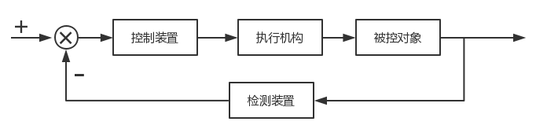
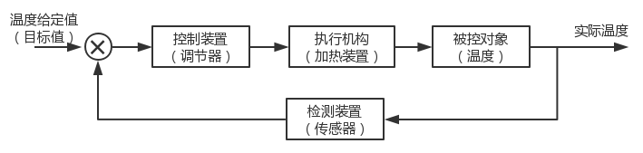
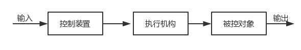
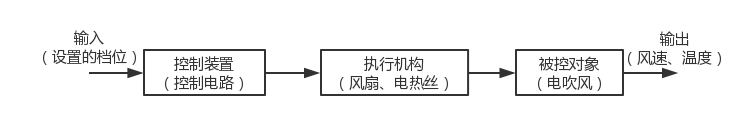

.. vim: syntax=rst

控制系统与电机的关系
==========================================

什么是控制系统？
^^^^^^^^^^^^^^^^^^^^^

控制系统是指由控制主体、控制客体和控制媒体组成的具有自身目标和功能的管理系统。也可以理解为：为了使控制对象达到预期的稳定状态。
例如一个水箱的温度控制，可以通过控制加热设备输出的功率进而来改变水温达到目标温度，这个水箱的温度控制可以称之为一个简单的控制系统。

自动控制系统的工作原理是什么？
""""""""""""""""""""""""""""""

原理：对生产中某些关键性参数进行自动控制，使它们在受到外界干扰(扰动) 的影响而偏离正常状态时，能够被自动地调节而回到工艺所要求的数值范围内。
自动控制系统分为开环和闭环，具体为：

闭环自动控制系统原理：
************************

闭环控制也就是（负）反馈控制，原理与人和动物的目的性行为相似，系统组成包括传感器（相当于感官），控制装置（相当于脑和神经），
执行机构（相当于手腿和肌肉）。传感器检测被控对象的状态信息（输出量），并将其转变成物理（电）信号传给控制装置。
控制装置比较被控对象当前状态（输出量）对希望状态（给定量）的偏差，产生一个控制信号，通过执行机构驱动被控对象运动，
使其运动状态接近希望状态。具体可见一下框图：

闭环控制系统框图

以热水器自动控温为例，首先我们将热水器设置一个温度，此时这个温度就是这个系统的给定值，也是控制系统想要达到的目标值；
热水器的调节器为整个系统的控制器，调节器经过计算处理输出给执行机构，通过热水器的加热装置，进而控制水的温度，
然后检测实际的温度，将温度反馈给控制系统，此时实际的温度和目标温度产生偏差，通过加热装置给水加热来达到理想的温度。闭环控制框图如下：

热水器闭环控制系统框图

开环自动控制系统原理：
***********************

开环控制不能够检测误差，不能够校正误差，只能够按照事先确定好的程序和产生信号的条件，依次去控制对象并且无抑制的干扰能力。

开环控制系统框图

以生活中的电吹风为例，电吹风是一个常见开环控制系统，通过设置吹风机的档位可以改变风扇的转速和电热丝的温度，进而调节输出的温度和风速。
电吹风的开环控制框图如下：

电吹风开环控制系统框图

控制系统与电机有什么关系？
^^^^^^^^^^^^^^^^^^^^^^^^^^^

上一小节讲解了开环与闭环控制系统，并给出了系统框图和实际的应用举例；在控制系统中有一个角色十分的重要，
它根据控制装置的信号改变着被控对象的状态——执行器。执行器的种类多种多样，可以是改变温度的电热丝、改变转速的电机等等，
只要是符合可以改变被控对象的状态都可以称之为执行器。

就目前来说电机加上相应的传输结构占执行器的一大部分，所以说控制电机就变成了十分重要的内容。
电机控制的好坏直接决定于被控对象状态改变的是否准确。电机的控制是对电机的启动、加速、运转、减速以及停止进行控制，
通过对其控制达到快速启动、快速响应、高效率、高扭矩输出和高过载能力的目的。

具体的电机应该如何应用，将在应用章节集中讲解。

