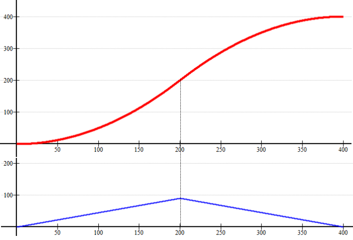
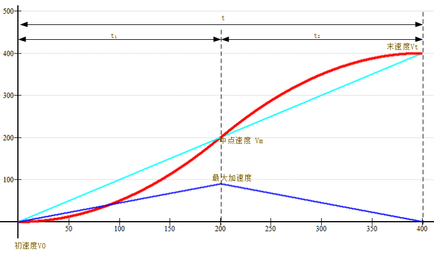
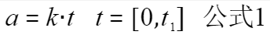
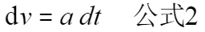
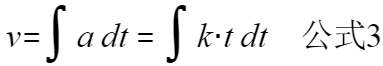
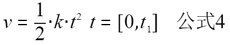
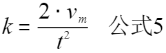
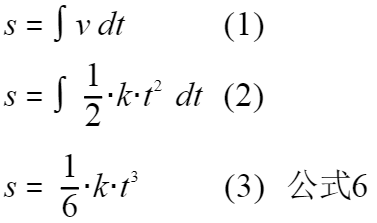
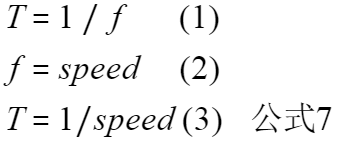
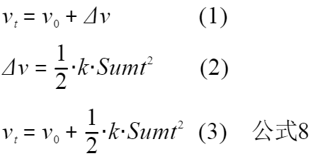

.. vim: syntax=rst

步进电机S形加减速实现
==========================================

在上一章节已经对步进电机的梯形加减速进行了非常详细的推导和讲解，接下来会对另一种加减速进行讲解—S形加减速。

S形加减速可以理解为在加减速的变化过程中速度曲线呈现一个英文字母“S”形的加减速算法。那么已经有了梯形加减速算法了，
为什么还需要S形加减速算法呢？答案很明显，由于不同的加减速算法的特点是不一样的，所以带来的效果自然而然的就不同了。

**梯形加减速** 在启动、停止和高速运动的过程中会产生很大的冲击力振动和噪声，所以多数会应用于简单的定长送料的应用场合中，
例如常见的3D打印机使用的就是梯形加减速算法；但是相比较 **S形加减速** 在启动停止以及高速运动时的速度变化的比较慢，
导致冲击力噪音就很小，但这也决定了他在启动停止时需要较长的时间，所以多数适用于精密的工件搬运与建造。

S形加减速原理分析
------------------------------------

"S"模型解析
^^^^^^^^^^^^^^^^^^^^^^^^^^^^^^^^^^^^

S形加减速算法对于曲线并没有具体的限定和轨迹，可以是指数函数、正弦函数只要满足于速度的变化曲线是一个“S”形即可；

具体的曲线情况如上图。在上图中一共有两幅曲线图像，其中红色的是速度的曲线，可以看出整体都属于速度的上升阶段，
在加速的过程中一共可以分为两个阶段，分别为前半部分和后半部分，前半部分是加速度匀速递增的曲线，称为：
**加加速阶段** 曲线，后半部分是加速度匀速递减的曲线超，所以称为： **减加速度阶段** 曲线。

上图中蓝色的曲线是加速度的变化曲线，按照速度变化的规律共分成前半段加速度匀速递增和后半部分加速度匀速递减，
也可以简单理解为一次函数，前半段一次函数的斜率是大于0的，后半部分的斜率是小于0的；加速度从0开始变化，
到了最大值开始减小，最后为0，由于加速度的斜率是相同的，所以斜率大于0和小于0两段曲线是关于加速度最大值所对应的速度中心对称的。

.. _算法理论实现:

算法理论实现
^^^^^^^^^^^^^^^^^^^^^^^^^^^^^^^^^^^^

下图共有三条曲线分别是红色、青色和蓝色，其中红色速度曲线、蓝色加速度曲线，青色为梯形加减速模型的加速部分曲线。

图中是梯形加速度部分（青色曲线）和S形加速部分（红色曲线）比较，梯形加减速是按照一个固定的斜率增加速度到达Vt,
到达Vt后加速部分结束，开始进入匀速部分，梯形加减速由匀加速上升的趋势突然变成匀速，由于惯性会产生较大的冲击力和噪声；
S形加减速则很好的避免了这一问题，在加速到Vt后进入匀速阶段曲线上非常的顺滑，阶段衔接的相对完美。

主要的目的是通过初速度、末速度和时间三个变量计算出控制步进电机的每一步速度；

**基础公式推导**

加速度 **a** 从0变化到最大值有

其中 **k** 是图中加速度的斜率，**t** 为时间变化，所以有：

对加速度积分就可以得到速度，所以有：

根据公式三可得：

如上图所示：当 **加速度a** 随着时间变化到最大值时速度 **V=Vm**,并且初速度 **V0=0**，将这两个条件带入公式4，
可求得 **斜率k**:

对速度积分就可以得到位移，所以有：

**其中：**

1. 对速度进行积分；
#. 将 **速度v** 的表达式带入；
#. 求解速度积分的计算结果，并得到位移与时间的公式，即 **公式6**；

根据 **公式六** 可以很清楚的看到只要给定一个合适的t值，
比如1秒内加速1000次，也就是 **t1=1/1000** 那就可以得到一个比较平滑的速度曲线。

**速度推导**

步进电机的速度是由定时器脉冲的频率决定的，频率越快也就是步进电机的速度越快，
所以可以得出 **脉冲输出的频率=速度**，所以有：

所以说只要计算出第一步的周期时间就可以计算出下一步的速度；并且根据时间的变化每计算一次就会累加一次时间变化量 **Sumt**。

在上图中：

- **T 代表但脉冲周期**
- **f 代表频率**
- **speed 代表速度**

每一步的速度都是在初始速度的基础上计算的，所以说 **公式4** 计算的是当 **初始速度为0时** 的增量，具体公式如下：

1. t时刻的速度等于初始速度与增量速度的和；
#. 求解增量速度，并且将累计时间变量带入 **公式4**；
#. 带入求解t时刻的速度；

S形加减速算法实现
------------------------------------

硬件设计
^^^^^^^^^^^^^^^^^^^^^^^^^^^^^^^^^^^^^^^^^^

提高部分的线路连接与基础部分的线路连接是完全一样的，所以硬件的部分可以直接参考： 
**基础部分-步进电机基础旋转控制-硬件设计**

软件设计
^^^^^^^^^^^^^^^^^^^^^^^^^^^^^^^^^^^^^^^^^^

**编程要点**

(1) 通用GPIO配置

(2) 步进电机、定时器中断初始化

(3) 计算S加减速的速度表

(4) 在定时器中对状态进行决策

(5) 通过对步进电机的初始速度、末速度和加速时间的设置来决定步进电机的运动

S形加减速算法是基于基础旋转延伸的控制方式，所以，相关的基础部分可以直接参考基础部分步进电机控制的教程；
在这里不再重复讲解。

**计算加减速速度表**

.. code-block:: c
    :caption: 设置第一次速度
    :linenos:

    /**
      * @brief  初始化状态并且设置第一步的速度
      * @param  无
    	* @param  无
    	*	@note 		无
      * @retval 无
      */
    void stepper_start_run()
    {
    
    	/*初始化结构体*/
    	memset(&Stepper,0,sizeof(Stepper_Typedef));
    	/*初始电机状态*/
    	Stepper.status=ACCEL;
    	/*初始电机位置*/
    	Stepper.pos=0;
    
    	/*计算第一次脉冲间隔*/
      if(Speed.Form[0] == 0)	//排除分母为0的情况
        Stepper.pluse_time = 0xFFFF;
      else										//分母不为0的情况
        Stepper.pluse_time  = (uint32_t)(T1_FREQ/Speed.Form[0]);
    
    	/*获取当前计数值*/
    	uint32_t temp=__HAL_TIM_GET_COUNTER(&TIM_TimeBaseStructure);
    	/*在当前计数值基础上设置定时器比较值*/
    	__HAL_TIM_SET_COMPARE(&TIM_TimeBaseStructure,MOTOR_PUL_CHANNEL_x,temp +Stepper.pluse_time); 
    	/*开启中断输出比较*/
    	HAL_TIM_OC_Start_IT(&TIM_TimeBaseStructure,MOTOR_PUL_CHANNEL_x);
    	/*使能定时器通道*/
    	TIM_CCxChannelCmd(MOTOR_PUL_TIM, MOTOR_PUL_CHANNEL_x, TIM_CCx_ENABLE);
    }

- 第12-16行：初始化 **Stepper** 结构体，初始化电机状态以及电机位置；
- 第18-23行：计算第一次的脉冲时间间隔，也就是利用 **定时器分频后的主频与Speed.Form[0]** 做比值，但是这里需要考虑分母为0的情况
  如果分母为0，那么直接将脉冲时间赋值为0xffff;
- 第25-31行：获取当前定时器的计数值并且与脉冲时间累加，然后作为参数传入 **__HAL_TIM_SET_COMPARE** 设置下一次进入中断的时间。
  并开启中断比较输出。

**计算加减速速度表**

.. code-block:: c
    :caption: 计算S形速度表
    :linenos:

    /**
      * @brief  CalcSpeed
      * @param  Vo	初始速度
    	* @param  Vt	末速度
    	* @param  T		时间
    	*	@note 		无
      * @retval 无
      */
    void CalcSpeed(int32_t Vo, int32_t Vt, float T)
    {
    
        uint8_t Is_Dec = FALSE;     
        int32_t i = 0;
        int32_t Vm =0;              // 中间点速度
        float K = 0;             // 加加速度
        float Ti = 0;               // 时间间隔 dt
        float Sumt = 0;             // 时间累加量
        float DeltaV = 0;           // 速度的增量dv  
    
        /***************************第一部分************************************************/
        /*判断初速度和末速度的关系，来决定加减速*/
        if(Vo > Vt )
        {                               
            Is_Dec = TRUE;
            Speed.Vo = CONVER(Vt);  
            Speed.Vt = CONVER(Vo); 
        }
        else
        {
            Is_Dec = FALSE;
            Speed.Vo = CONVER(Vo);    
            Speed.Vt = CONVER(Vt);    
        }
        /****************************第二部分***********************************************/
        /*计算初始参数*/
        T = T / 2;						//加加速段的时间（加速度斜率>0的时间）
    
        Vm = (Speed.Vo + Speed.Vt) / 2;	//计算中点的速度
    
        K = fabs(( 2 * ((Vm) - (Speed.Vo)) ) / pow((T),2));// 根据中点速度计算加加速度
    
        Speed.INC_AccelTotalStep = (int32_t)( ( (K) * pow( (T) ,3) ) / 6 );// 加加速需要的步数
    
        Speed.Dec_AccelTotalStep = (int32_t)(Speed.Vt * T - Speed.INC_AccelTotalStep);   // 减加速需要的步数 S = Vt * Time - S1
    
       /***************************第三部分************************************************/
        /*计算共需要的步数，并校检内存大小，申请内存空间存放速度表*/
        Speed.AccelTotalStep = Speed.Dec_AccelTotalStep + Speed.INC_AccelTotalStep;              // 加速需要的步数 
        if( Speed.AccelTotalStep  % 2 != 0)     // 由于浮点型数据转换成整形数据带来了误差,所以这里加1
            Speed.AccelTotalStep  += 1;
    
    	/*判断内存长度*/
    	if(FORM_LEN<Speed.AccelTotalStep)
    	{
    		printf("FORM_LEN 缓存长度不足\r\n,请将 FORM_LEN 修改为 %d \r\n",Speed.AccelTotalStep);
    		return ;
    	}
    
    	/***************************第四部分************************************************/
        /* 计算第一步的时间 */
    
        /*根据第一步的时间计算，第一步的速度和脉冲时间间隔*/
        /*根据位移为0的时候的情况，计算时间的关系式 ->  根据位移和时间的公式S = 1/2 * K * Ti^3  可得 Ti=6 * 1 / K开1/3次方 */
        Ti = pow((6.0f * 1.0f / K),(1 / 3.0f) ); //开方求解 Ti 时间常数
        Sumt += Ti;//累计时间常数
        /*根据V=1/2*K*T^2,可以计算第一步的速度*/
        DeltaV = 0.5f * K * pow(Sumt,2);
        /*在初始速度的基础上增加速度*/
        Speed.Form[0] = Speed.Vo + DeltaV;
    
    	/****************************第五部分***********************************************/
    	/*最小速度限幅*/
        if( Speed.Form[0] <= MIN_SPEED )//以当前定时器频率所能达到的最低速度
            Speed.Form[0] = MIN_SPEED;
    
      /****************************第六部分***********************************************/
    	/*计算S形速度表*/
      for(i = 1; i < Speed.AccelTotalStep; i++)
      {
    
    		/*根据时间周期与频率成反比的关系，可以计算出Ti,在这里每次计算上一步时间，用于积累到当前时间*/
    		Ti = 1.0f / Speed.Form[i-1];   
        /* 加加速度计算 */
        if( i < Speed.INC_AccelTotalStep)
        {
            /*累积时间*/
            Sumt += Ti;
            /*速度的变化量 dV = 1/2 * K * Ti^2 */
            DeltaV = 0.5f * K * pow(Sumt,2);
            /*根据初始速度和变化量求得速度表*/
            Speed.Form[i] = Speed.Vo + DeltaV;  
            /*为了保证在最后一步可以使得时间严谨的与预期计算的时间一致，在最后一步进行处理*/
            if(i == Speed.INC_AccelTotalStep - 1)
               Sumt  = fabs(Sumt - T );
        }
        /* 减加速度计算 */
        else
        {
            /*时间累积*/
            Sumt += Ti;                                       
            /*计算速度*/
            DeltaV = 0.5f * K * pow(fabs( T - Sumt),2); 
            Speed.Form[i] = Speed.Vt - DeltaV;          
        }
      }
    	/**************************第七部分*************************************************/
    	/*减速运动，倒序排列*/
      if(Is_Dec == TRUE)
      {
        float tmp_Speed = 0;  
        /* 倒序排序 */
        for(i = 0; i< (Speed.AccelTotalStep / 2); i++)
        {
          tmp_Speed = Speed.Form[i];
          Speed.Form[i] = Speed.Form[Speed.AccelTotalStep-1 - i];
          Speed.Form[Speed.AccelTotalStep-1 - i] = tmp_Speed;
        }
      }
    }

- 第一部分: 根据传入的参数判断，是加速还是减速；如果初始速度小于末速度那么就是加速运动，如果初始速度大于末速度那么就是
  减速度运动，并将状态变量 **Is_Dec** 对应修改。

- 第二部分: 计算初始算法相关的基础公式，其中 **T** 计算的是斜率大于0的时间；**Vm** 是根据初末速度计算的中点速度；
  **K** 计算的是斜率；**Speed.INC_AccelTotalStep** 和 **Speed.Dec_AccelTotalStep** 计算的分别是加加速度时的所需步数和总步数；
  具体的公式推导过程可以参考 :ref:`算法理论实现` 的基础公式推到部分。

- 第三部分:根据加加速运动和减加速运动可以计算出一共所需的步数，并判断数组是否可以装下这些数据，如果不可以，提示修改。

- 第四部分:计算 **Speed.Form[0]** ：根据公式6可直接推导出时间 **Ti** 的数值，并且累计时间常数带入到 **v-t** 的关系式中，求得△t的数值。
  并根据初始量与变化量的关系即可求出 **Speed.Form[0]** 。

- 第五部分:判断 **Speed.Form[0]** 最小速度的数值大小，不能小于 **定时器的频率与最大计数值的比值**。

- 第六部分:根据前面的总步数和算出每一步的 **Speed.Form[i]** 数值

- 第七部分:由于中心对称的关系，如果为减速运动只需将之前计算的数值倒序排列即可。

**速度决策**

.. code-block:: c
    :caption: 速度决策
    :linenos:

    /**
    * @brief  速度决策
    *	@note 	在中断中使用，每进一次中断，决策一次
    * @retval 无
    */
    void speed_decision(void)
    {
         /*计数临时变量*/
         float temp_p = 0;
         /*脉冲计数*/
         static uint8_t i = 0;  	

         if(__HAL_TIM_GET_IT_SOURCE(&TIM_TimeBaseStructure, MOTOR_TIM_IT_CCx) !=RESET)
         {
            /*清除定时器中断*/
            __HAL_TIM_CLEAR_IT(&TIM_TimeBaseStructure, MOTOR_TIM_IT_CCx);
      
            /******************************************************************/
            /*两次为一个脉冲周期*/
            i++; 
            if(i == 2)
            {
               /*脉冲周期完整后清零*/
               i = 0;   
               /*判断当前的状态，*/
               if(Stepper.status == ACCEL || Stepper.status == DECEL)
               {
                  /*步数位置索引递增*/
                  Stepper.pos++;
                  if(Stepper.pos  < Speed.AccelTotalStep )
                  { 
                     /*获取每一步的定时器计数值*/
                     temp_p = T1_FREQ / Speed.Form[Stepper.pos];
                     if((temp_p / 2) >= 0xFFFF)
                        temp_p = 0xFFFF;
                     Stepper.pluse_time = (uint16_t) (temp_p / 2);
                  }
                  else
                  {
                     /*加速部分结束后接下来就是匀速状态或者停止状态*/
                     if(Stepper.status == ACCEL)   
                     {
                        Stepper.status = AVESPEED;
                     }          
                     else
                     {
                        /*停止状态，清空速度表并且关闭通道*/
                        Stepper.status = STOP; 
                        memset(Speed.Form,0,sizeof(float)*FORM_LEN);
                        TIM_CCxChannelCmd(MOTOR_PUL_TIM, MOTOR_PUL_CHANNEL_x, TIM_CCx_DISABLE);// 使能定时器通道 

                     }
                  }
               }
            }
            /**********************************************************************/
            // 获取当前计数器数值
            uint32_t tim_count=__HAL_TIM_GET_COUNTER(&TIM_TimeBaseStructure);
            /*计算下一次时间*/
            uint32_t tmp = tim_count+Stepper.pluse_time;
            /*设置比较值*/
            __HAL_TIM_SET_COMPARE(&TIM_TimeBaseStructure,MOTOR_PUL_CHANNEL_x,tmp);
    
    	   }
    }

- 第8~12行：定义了脉冲计数以及临时变量；
- 第13~17行：判断是否有新的中断到来，如果有便清楚定时器的中断标志；
- 第20~24行：进入两次中断才能获得一个完整的脉冲周期，所以在这里进行一个脉冲偶数化清零；
- 第29~37行：在 **Speed.Form[]** 表里按照顺序获取数值，并与定时器分频后的时钟主频做比值求得脉冲时间；
- 第40~52行：加速结束后共有两个状态分别是匀速状态和停止状态，匀速状态即保持当前速度不变继续运行，停止状态即清空速度表并关闭通道；
- 第57~62行：获取当前定时器的计数值并且与上文计算的脉冲时间累加，然后作为参数传入 **__HAL_TIM_SET_COMPARE** 设置下一次进入中断的时间。

下载验证
^^^^^^^^^^^^^^^^^^^^^^^^^^^^^^^^^^^^

保证开发板相关硬件连接正确，并且将代码下载到开发板中，按下 **KEY2** 按键会发现步进电机先加速运动再减速运动。

.. 一级标题
.. ==============================

.. 二级标题
.. ------------------

.. 三级标题
.. ^^^^^^^^^^^^^^^^^^^^^
     
.. 四级标题
.. """""""""""""""""

.. 五级标题
.. *****************
.. 1. hhhhhhhh
.. #. hhhhhhhh
.. #. hhhhhhhh

.. .. image:: ../media/xxx.png
..    :align: center
..    :alt: xxx

.. .. code-block:: c
..     :caption: xxx
..     :linenos:

.. .. _test:
..  :ref:`test` 

