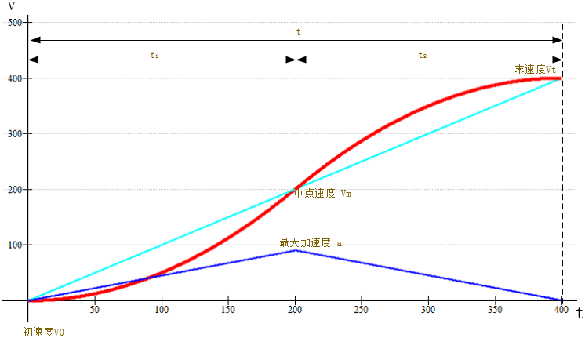

.. vim: syntax=rst

步进电机S形加减速实现
==========================================

在上一章节已经对步进电机的梯形加减速进行了非常详细的推导和讲解，接下来会对另一种加减速进行讲解—S形加减速。

S形加减速可以理解为在加减速的变化过程中速度曲线呈现一个英文字母“S”形的加减速算法。那么已经有了梯形加减速算法了，
为什么还需要S形加减速算法呢？答案很明显，由于不同的加减速算法的特点是不一样的，所以带来的效果自然而然的就不同了。

**梯形加减速** 在启动、停止和高速运动的过程中会产生很大的冲击力振动和噪声，所以多数会应用于简单的定长送料的应用场合中，
例如常见的3D打印机使用的就是梯形加减速算法；但是相比较 **S形加减速** 在启动停止以及高速运动时的速度变化的比较慢，
导致冲击力噪音就很小，但这也决定了他在启动停止时需要较长的时间，所以多数适用于精密的工件搬运与建造。

S形加减速原理分析
------------------------------------

S形加减速算法对于曲线并没有具体的限定和轨迹，可以是指数函数、正弦函数只要满足于速度的变化曲线是一个“S”形即可；

.. image:: ../media/S加减速图1.png
   :align: center

具体的曲线情况如上图。在上图中一共有两幅曲线图像，其中红色的是速度的曲线，可以看出整体都属于速度的上升阶段，
在加速的过程中一共可以分为两个阶段，分别为前半部分和后半部分，前半部分是加速度匀速递增的曲线，称为：
**加加速阶段** 曲线，后半部分是加速度匀速递减的曲线超，所以称为： **减加速度阶段** 曲线。

上图中蓝色的曲线是加速度的变化曲线，按照速度变化的规律共分成前半段加速度匀速递增和后半部分加速度匀速递减，
也可以简单理解为一次函数，前半段一次函数的斜率是大于0的，后半部分的斜率是小于0的；加速度从0开始变化，
到了最大值开始减小，最后为0，由于加速度的斜率是相同的，所以斜率大于0和小于0两段曲线是关于加速度最大值所对应的速度中心对称的。

下图共有三条曲线分别是红色、青色和蓝色，其中红色速度曲线、蓝色加速度曲线，青色为梯形加减速模型的加速部分曲线。

S形加减速算法实现
------------------------------------

.. 一级标题
.. ==============================

.. 二级标题
.. ------------------

.. 三级标题
.. ^^^^^^^^^^^^^^^^^^^^^
     
.. 四级标题
.. """""""""""""""""

.. 五级标题
.. *****************
.. 1. hhhhhhhh
.. #. hhhhhhhh
.. #. hhhhhhhh

.. .. image:: ../media/xxx.png
..    :align: center
..    :alt: xxx

.. .. code-block:: c
..     :caption: xxx
..     :linenos:

.. .. _test:
..  :ref:`test` 

