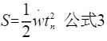
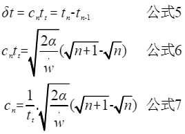
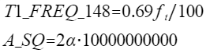
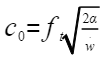
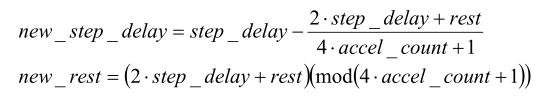

.. vim: syntax=rst

步进电机梯形加减速实现
==========================================
在基础章节已经对步进电机的基础旋转进行了详细的讲解和多种方式的实验。相信你对步进电机的基础旋转已经得心应手了，
但是这并不够；还需要对步进电机的加减速进行学习，所以在这一章节主要对步进电机的梯形加减速进行讲解。

**一定会有人疑问为什么要使用加减速、加减速有什么好处呢？**

**加减速使用的场景有那些呢？**

为什么要使用加减速呢？如果你在基础部分学习，硬件驱动细分器与软件的细分参数或定时器分频参数设置不当时启动电机时，
会遇见步进电机有啸叫声但是不会转动，这是因为软件产生脉冲的频率大于步进电机的启动频率，步进电机有一个很重要的技术参数：
空载启动频率，也就是在没有负载的情况下能够正常启动的最大脉冲频率，如果脉冲频率大于该值，步进电机则不能够正常启动，
发生丢步或者堵转的情况；**或者也可以理解为由于步进脉冲变化过快，转子由于惯性的作用跟不上电信号的变化。**
所以要使用加减速来解决启动频率低的问题，在启动时使用较低的脉冲频率，然后逐渐的加快频率。

步进电机加减速使用的场景有有哪些呢？步进电机加减速使用的场景可以说是多种多样，但是大部分在一些工业上，例如CNC雕刻机、
3D打印机、车床等。只要是在工业上使用到步进电机的都会涉及到加减速，可见加减速算法的重要性。

.. _梯形加减速算法原理详解:

梯形加减速算法原理详解
------------------------------------

梯形加减速的实现是基于基础旋转章节的内容，
所以对于基础旋转章节不理解的可以参考，**基础部分步进电机基础旋转控制**
章节。参考书目《AVR446_Linear speed control of stepper motor.pdf》

算法特点
^^^^^^^^^^^^^^^^^^^^^^^^^^^^^^^^^^^^

为了使得不出现丢步或者超步现象并且提高效率，需要使得步进电机先以固定的加速度达到目标速度，然后以这个速度运行，
快到达目标步数时再减到最低速；整个过程是一个梯形的模型，所以以它的数学模型命名的加减速算法。

从模型中即可反映出算法的特点，数学模型中一共分为三个阶段，OA加速部分、AB匀速部分和BC减速部分。

- 在OA加速过程中，由低于步进电机的启动频率开始启动（模型中由0启动），以固定的加速度增加速度到目标值；
- 在AB匀速过程中，以最大速度匀速运动；
- 在BC减速部分中，以加速度不变的速度递减到0；

这种算法是一种在加速过程和减速过程中加速度不变的匀变速控制算法，
由于速度变化的曲线有折点，所以在启动、停止、匀速段中很容易产生冲击和振动。

.. _算法基础概念及方程:

算法基础概念及方程
^^^^^^^^^^^^^^^^^^^^^^^^^^^^^^^^^^^^

步进电机的转动需要控制器发送脉冲，如果控制器以恒定速度发送脉冲，那么步进电机就以恒定速度转动；
如果控制器以加速度运动，那么步进电机就以加速度运动；所以只要改变脉冲的频率就可以改变速度的变化，
也就是说调整脉冲之间的时间间隔就可以改变速度。

上图为步进电机与时间的示意图，其中

- t0  表示脉冲发送的起始时刻
- t1  表示脉冲发送的第二个时刻
- t2  表示脉冲发送的第三个时刻
- tt  表示定时器的计数周期
- c0  表示定时器从t0~t1时刻的定时器计数值
- c1  表示定时器从t1~t2时刻的定时器计数值
- δt  表示两个脉冲之间的间隔时间

以stm32的高级定时器8为例，定时器8的时钟频率为168MHZ,如果将分频值设置为5，那么定时器的时钟频率则为：**ft=168/(5+1)=28MHZ**,
相当于计数28M次正好为一秒，周期与频率为倒数关系，所以分频值为5的定时器8的计数周期为:**1/ft**;

其中 :

- n 为步进电机所转的脉冲数
- s 为时间单位 秒
- spr 为步进电机所转一圈的脉冲数
- rad 为弧度单位 (1rad = (180/π)° ≈ 57.3°)
- rad/sec 弧度每秒；
  1圈（revolutions） = 2 * 3.1415弧度（rad）；
  (1 rad/sec = 60*1/(2*3.1415) rev/min = 9.55 rpm)；
  1 rad/sec=9.55 rpm；

直线加减速模型解析
^^^^^^^^^^^^^^^^^^^^^^^^^^^^^^^^^^^^

在本章的一开始就已经简单的介绍了一下加减速算法的模型

**模型阶段分析：**

.. image:: ../media/直线模型.png
   :align: center  

要使得步进电机平稳的启动和停止，则需要控制好步进电机的加速度和减速度，控制好加速度和减速度就可得到好的曲线模型，
上图中一共是三个不同变量与时间的变化曲线，分别是 **加速度与时间、速度与时间和位置与时间的曲线**。

在三个模型中的跳变位置已经画上对应的虚线，分别为虚线a、虚线b、虚线c和虚线d

1. **起始点~a**：在这阶段中，速度、加速度、位置都没有变化；
#. **a~b阶段**：从虚线a开始，在这阶段中加速度不变，速度与位置不断上升，并且速度是以恒定加速度上升，上升到最大速度也就是速度曲线与虚线b的交点；
#. **b~c阶段**：在这阶段中，以不变的速度在运行，由于速度不变，则加速度为零，并且位置在这阶段呈现一个一次函数的上升阶段；
#. **c~d阶段**：在这阶段中，速度开始呈匀减速的状态，所以加速度为负值，但是位置依旧上升，但上升曲线逐渐变慢；

**进一步理解：**

在已经对模型的几个阶段有所了解后，下面对加速部分进一步讲解；

.. image:: ../media/速度时间脉冲位置.png
   :align: center     

上图中分别是对 **ω-t和θ-t** 的变化图：

在 **ω-t** 图中是梯形加减速模型中的加速部分中，红色竖线表示的是脉冲发生的位置，由加速的方向看（从左到右），
在图上两个相邻之间的脉冲之间的距离越来越近，根据 **δt=ct** 计数周期不变，计数值越来越小也就意味着脉冲之间的间隔时间变短了，
频率变快了，直接影响步进电机转的变快了；所以说脉冲之间的定时器计数值是影响脉冲频率变化的重要因素。

在 **θ-t** 图中，脉冲每产生一次就对应着θ轴上的一小格，**ω-t** 图中工产生6次脉冲就对应 **θ-t** 中的6次位置的变化。

脉冲时间间隔的精确计算
^^^^^^^^^^^^^^^^^^^^^^^^^^^^^^^^^^^^

**脉冲间隔决定速率变化，所以对于脉冲的时间间隔计算 就显得尤为重要。**

时间间隔的计算由以下几个公式推导出来：

**注：n表示脉冲个数；α表示步距角；**

在第n个时刻的脉冲角度，所以 **nα** 就是n个脉冲实际旋转的角度；这里可以说是角度也可以说是位置，单纯说一个脉冲那就是一个步距角，
那么电机与丝杆滑台联系到一起那最终作用到的就是滑台的位置移动了。

对于这个公式应该都不陌生，物理学中的匀加速运动的距离公式，在梯形加减速中加速部分就是匀加速运动。
当v0=0，并且将相关变量带入得：

**注： S表示位移；w表示加速度;tn表示时间点**

将上述公式整理为：

可以将上述理解为两个时间点，那么相邻脉冲的时间点的差值就是脉冲的时间间隔；
所以计数器的时间间隔公式为：

**将n与n+1带入公式4并且提出公因式即可得到公式6，将公式6左右两侧除以tt，即可得到公式7。**

当n=0带入公式7，括号内的数值为1，并且算出第一次产生脉冲的计数值C0；仔细观察公式8与公式7，发现可以将公式8直接带入到公式7，即可得到公式9；
此时第n次的脉冲间隔的计数值只与第一次的计数值和次数有关。

由于计算的过程中需要进行开方运算，微控制器的计算能力有限，因此在此使用泰勒公式进行泰勒级数逐级逼近的方法。
在这里主要是用的是泰勒公式的特例—— **麦克劳林公式** ；具体如下图：

为构造与麦克劳林相同的公式将 **n-1** ，并且与公式9做比值处理，并进行化简计算，具体如下图所示：

公式推导一共分为以下5个步骤推导：

1. 步骤1是将 **n** 与 **n-1** 分别带入到公式9；
#. 分子分母提出C0和根号n,并将其约掉；
#. 整理化简根号下的内容；
#. 将麦克劳林公式带入；
#. 忽略无穷下余项，化简求得；

将其化简为关于Cn的式子如下：

这样就避免了开方两次的问题，由于在化简时舍弃了无穷小余项，所以验证下化简前后的误差：

.. image:: ../media/误差计算.png
   :align: center  

当 n=1 时，分别带入以上两个式子，求得其结果，发现出现偏差，但是可以通过将化简后的C0乘以一个0.69的参数进行矫正这个误差。

.. _加减速度与步数的关系:

加减速度与步数的关系
^^^^^^^^^^^^^^^^^^^^^^^^^^^^^^^^^^^^

根据上一小节推导的公式可得：

1. 这是初速度为0的匀加速运动的基础方程，只不过其中一些变量是与具体参数有关的，具体可以参考上一小节的公式；
#. 步距角与步数的乘积相当于旋转角度，或者位置；
#. 将(1)与(2) 的关系式联系起来就是公式（3）；
#. 根据V=V0+at，初始速度为0得V=at，再将其带入相关变量；
#. 将公式（4）带入公式（5）

在上述公式中有相关变量分别为：步数、加速度、速度和步距角四个变量，由于步距角是一个固定值，
**所以当速度设置为最大值时步数就与加速度成反比，也就是当加速度小的时候需要较多的步数，当加速度大的时候需要较少的步数就可以到达目标速度。**

由于步进电机 **加速到最大的时候速度与其刚开始减速时的速度一样** ，具体看下图：

根据上图，我们只要修改步数就可以修改加速度的数值，
所以有以下公式：

当初始速度和末速度都为0并且给定步数时，为了得到加速的步数，将公式12整理得：

1. 将公式12写到这里；
#. 将等式两端分别加上同一项，保证等式；
#. 将等式两端分别提出公因式；
#. 将左侧除n1外多余的项移到右侧；即可得到公式13；

算法理论实现
^^^^^^^^^^^^^^^^^^^^^^^^^^^^^^^^^^^^

由于算法在计算过程中涉及到一些浮点型运算，大量的浮点型运算会使得效率大大降低为了使在计算浮点型的速度得到更好的优化，
所以这一小节主要讲解由算法到代码的一些变量参数的放大转换过程和一些相关算法的不同情况。

控制步进电机需要四个描述速度曲线的参数；速度曲线从零速度开始，加速到给定速度并持续到减速开始，并且最后减速至零给定步数的速度。

- step 需要移动的步数
- accel 加速度
- decel 减速度
- speed 最大速度

设置计算
""""""""""""""""""""""""""""""""""

**最小间隔**

根据前几小节可有一下公式：

在上图中最终得出的是间隔时间与速度的函数关系式；其中步距角与定时器的频率为定值，所以说速度与脉冲时间间隔成反比；

在这里将步距角与定时器的频率放大100倍，并将数值赋值给变量 **A_T_x100** 所以最小的时间间隔的公式就为 
**min_delay=A_T_x100/speed** ；

**C0**
 
以下是加速度相关的参数：

以上两个关于C0的是带入参数后的式子和原始的式子，在 **step_delay** 中参数 **T1_FREQ_148** 矫正了误差并且将其缩
小10的两次方倍，将A_SQ放大10十次方倍，由于放大倍数是在根号下放大的10的10次方，开根号后就是5次方，加速度也放大10的二次方倍，
在除以100，正好就是与原始相等；（具体运算如下图）

- 步骤（1）中是原始式子
- 步骤（2）矫正误差并且将放大的倍数分解
- 步骤（3）整理分解的倍数
- 步骤（4）最后的结果只与原始有误差矫正的区别

以上的整理说明，即使放大或者缩小了部分参数的倍数只要保证结果不变，会给计算带来很大的便利。

.. _加减速情况分析:

加减速情况分析
""""""""""""""""""""""""""""""""""

对于加减速的情况来说，由于已经设定好了步进电机加速度、减速度、最大速度和步数，所以说一共分为两种情况：

**第一种情况：持续加速到最大速度然后再减速到0**

**第二种情况：在没达到最大速度之前就需要开始减速到0**

第一种情况
""""""""""""""""""""""""""""""""""

根据上图可以很明显的看到7个参数，其中

- speed: 算法设置的最大速度；
- accel：加速度；
- decel：加速度；
- step ：总步数；

以上的参数都是程序里面直接给出的，不需要求解。

- max_s_lim：速度从0加速到speed所需的步数；
- accel_lim：在忽略虽大速度的情况下，开始减速之前的步数，也可以理解为加速度曲线与减速度曲线的交点；
- decel_val：实际减速的步数；

以上的参数都是需要根据前面的计算推导求解的。

**max_s_lim：**

根据速度与路程的物理公式，所以有以下公式：

并将其图中相关参数带入，具体如下图：

**注：speed是扩大100倍后的数值，那么平方就是10000倍，所以分子需要乘以100，才能保证结果不变**

**accel_lim：**

最大的加速步数公式推导可以参考 :ref:`加减速度与步数的关系` 章节；

如果 **max_s_lim <accel_lim** ，则通过达到所需速度来限制加速度；所以
减速度取决于此，在这种情况下，通过以下方法找到decal_val：

**decel_val：**

根据公式12可以直接推出decel_val的表达式；但是由于是减速度的步数，所以需要带上负号，具体公式如下图：

第二种情况
""""""""""""""""""""""""""""""""""

这种情况是在还未达到最大速度时就已经开始减速了；其中 **accel_lim、max_s_lim** 不需要重复计算了；

当 **max_s_lim>accel_lim** 时，如上图加速受减速开始的限制，所以 **decel_val** 表达式为：

中断状态区分
^^^^^^^^^^^^^^^^^^^^^^^^^^^^^^^^^^^^

上图表现的是速度在数学模型中的几个阶段性速度，具体看上图。

上图是这几个状态机之间切换的的关系图：

- **第一种情况** ：当步数为1时，毫无疑问直接进入到减速阶段然后到停止状态
- **第二种情况** ：当步数大于1，并且会加到最大速度，会经过：加速状态->匀速状态->减速状态->停止状态
- **第三种情况** ：当步数大于1，并且不会加到最大速度，会经过：加速状态->减速状态->停止状态
            

对于加减速的每一步来说，都需要重新计算下一步的时间，计算的过程中可能会出现除不尽的项式，
为了更有利的加减速，可以采用加速向上取整，减速向下取整的原则来做运算，也可以采用余数累计的方法，
在这里使用的是将余数累计的方法来提高间隔时间的精度和准确性。

根据公式11可有：

梯形加减速算法实现
------------------------------------------

硬件设计
^^^^^^^^^^^^^^^^^^^^^^^^^^^^^^^^^^^^^^^^^^

提高部分的线路连接与基础部分的线路连接是完全一样的，所以硬件的部分可以直接参考： **基础部分-步进电机基础旋转控制-硬件设计**

软件设计
^^^^^^^^^^^^^^^^^^^^^^^^^^^^^^^^^^^^^^^^^^

**编程要点**

(1) 通用GPIO配置

(2) 步进电机、定时器中断初始化

(3) 在定时器中对速度和状态进行决策

(4) 通过对步进电机的步数、加减速度和最大速度的设置来决定步进电机的运动

梯形加减速算法是基于基础旋转的延伸控制方式，所以，相关的基础部分可以直接参考基础部分步进电机控制的教程；

**宏定义**

.. code-block:: c
    :caption: 宏定义
    :linenos:

    #ifndef __BSP_STEP_MOTOR_INIT_H
    #define	__BSP_STEP_MOTOR_INIT_H
    
    #include "stm32f4xx.h"
    #include "stm32f4xx_hal.h"
    #include "./stepper/bsp_stepper_T_speed.h"
    
    /*宏定义*/
    /*******************************************************/
    //宏定义对应开发板的接口 1 、2 、3 、4
    #define CHANNEL_SW 1
    
    #if(CHANNEL_SW == 1)
    //Motor 方向 
    #define MOTOR_DIR_PIN                  	GPIO_PIN_1   
    #define MOTOR_DIR_GPIO_PORT            	GPIOE                    
    #define MOTOR_DIR_GPIO_CLK_ENABLE()   	__HAL_RCC_GPIOE_CLK_ENABLE()
 
    //Motor 使能 
    #define MOTOR_EN_PIN                  	GPIO_PIN_0
    #define MOTOR_EN_GPIO_PORT            	GPIOE                       
    #define MOTOR_EN_GPIO_CLK_ENABLE()    	__HAL_RCC_GPIOE_CLK_ENABLE()
       
    //Motor 脉冲
    #define MOTOR_PUL_IRQn                  TIM8_CC_IRQn
    #define MOTOR_PUL_IRQHandler            TIM8_CC_IRQHandler
 
    #define MOTOR_PUL_TIM                   TIM8
    #define MOTOR_PUL_CLK_ENABLE()  		__TIM8_CLK_ENABLE()
 
    #define MOTOR_PUL_PORT       			GPIOI
    #define MOTOR_PUL_PIN             		GPIO_PIN_5
    #define MOTOR_PUL_GPIO_CLK_ENABLE()		__HAL_RCC_GPIOI_CLK_ENABLE()
  
    #define MOTOR_PUL_GPIO_AF               GPIO_AF3_TIM8
    #define MOTOR_PUL_CHANNEL_x             TIM_CHANNEL_1
 
    #define MOTOR_TIM_IT_CCx                TIM_IT_CC1
    #define MOTOR_TIM_FLAG_CCx              TIM_FLAG_CC1 
    
    #elif(CHANNEL_SW == 2)
    
    ... ... 

    #elif(CHANNEL_SW == 3)
    
    ... ...      
    
    #elif(CHANNEL_SW == 4)

    ... ...    

    #endif
    
    #endif

以上是在板子上步进电机的四个接口，（由于篇幅有限，只写了一部分具体开源码）为了方便使用，在这里全都定义完，并且可以使用宏定义 **CHANNEL_SW** 
直接修改数值为1、2、3、4就可以直接修改对应的开发板通道，然后对应接在上面即可。

对于加减速来说有两个部分的框架很重要，分别是中断函数里面的速度决策调用和 **stepper_move_T()** 函数相关数值计算。

**速度决策**

.. code-block:: c
    :caption: 速度决策
    :linenos:

    /**
    * @brief  速度决策
    *	@note 	在中断中使用，每进一次中断，决策一次
    * @retval 无
    */
    void speed_decision()
    {
         uint32_t tim_count=0;
         uint32_t tmp = 0;
         // 保存新（下）一个延时周期
         uint16_t new_step_delay=0;
         // 加速过程中最后一次延时（脉冲周期）.
         static uint16_t last_accel_delay=0;
         // 总移动步数计数器
         static uint32_t step_count = 0;
         static int32_t rest = 0;
         //定时器使用翻转模式，需要进入两次中断才输出一个完整脉冲
         static uint8_t i=0;
      
         if(__HAL_TIM_GET_IT_SOURCE(&TIM_TimeBaseStructure, MOTOR_TIM_IT_CCx) !=RESET)
         {
            // 清楚定时器中断
            __HAL_TIM_CLEAR_IT(&TIM_TimeBaseStructure, MOTOR_TIM_IT_CCx);
      
            // 设置比较值
            tim_count=__HAL_TIM_GET_COUNTER(&TIM_TimeBaseStructure);
            tmp = tim_count+srd.step_delay;
            __HAL_TIM_SET_COMPARE(&TIM_TimeBaseStructure,MOTOR_PUL_CHANNEL_x,tmp);
      
            i++;     // 定时器中断次数计数值
            if(i==2) // 2次，说明已经输出一个完整脉冲
            {
               i=0;   // 清零定时器中断次数计数值
               switch(srd.run_state) 
               {
                  /*步进电机停止状态*/
                  case STOP:
                  step_count = 0;  // 清零步数计数器
                  rest = 0;        // 清零余值
                  // 关闭通道
                  TIM_CCxChannelCmd(MOTOR_PUL_TIM, MOTOR_PUL_CHANNEL_x, TIM_CCx_DISABLE);        
                  __HAL_TIM_CLEAR_FLAG(&TIM_TimeBaseStructure, MOTOR_TIM_FLAG_CCx);
      
                  status.running = FALSE;
                  break;
                  /*步进电机加速状态*/
                  case ACCEL:
                  step_count++;
                  srd.accel_count++;
      
                  new_step_delay = srd.step_delay - (((2 *srd.step_delay) + rest)/(4 * srd.accel_count + 1));//计算新(下)一步脉冲周期(时间间隔)
                  rest = ((2 * srd.step_delay)+rest)%(4 * srd.accel_count + 1);// 计算余数，下次计算补上余数，减少误差
                  //检查是够应该开始减速
                     if(step_count >= srd.decel_start) {
                        srd.accel_count = srd.decel_val;
                        srd.run_state = DECEL;
                     }
                     //检查是否到达期望的最大速度
                     else if(new_step_delay <= srd.min_delay) {
                        last_accel_delay = new_step_delay;
                        new_step_delay = srd.min_delay;    
                        rest = 0;                          
                        srd.run_state = RUN;
                     }
                     break;
                  /*步进电机最大速度运行状态*/
                  case RUN:
      
                     step_count++;
                     new_step_delay = srd.min_delay;
      
                     //检查是否需要开始减速
                     if(step_count >= srd.decel_start) 
                     {
                        srd.accel_count = srd.decel_val;
                        //以最后一次加速的延时作为开始减速的延时
                        new_step_delay = last_accel_delay;
                        srd.run_state = DECEL;
      
                     }
                     break;
                  /*步进电机减速状态*/
                  case DECEL:
      
                     step_count++;
                     srd.accel_count++;
                     new_step_delay = srd.step_delay - (((2 * srd.step_delay) + rest)/(4 * srd.accel_count + 1)); //计算新(下)一步脉冲周期(时间间隔)
                     rest = ((2 * srd.step_delay)+rest)%(4 * srd.accel_count + 1);// 计算余数，下次计算补上余数，减少误差
                     //检查是否为最后一步
                     if(srd.accel_count >= 0)
                     {
                        srd.run_state = STOP;
                     }
                     break;
               }
               /*求得下一次间隔时间*/
               srd.step_delay = new_step_delay;
            }
         }
    }

- **8~18行** 在函数内部定义临时变量和静态变量，用于中断内算法的相关计算推导；
- **20~23行** 判断当前是否为 **TIM_TimeBaseStructure** 中断的通道1；
- **26~28行** 在26行中使用HAL库函数 **__HAL_TIM_GET_COUNTER()** 来获取当前计数器的数值，并且将其返回给 **tim_count**
  并且计算下一次需要的数值，使用 **__HAL_TIM_SET_COMPARE()** 设置比较值;
- **30~33行** 由于进入中断两次才能输出一个完整脉冲，所以在这只对进入中断的次数进行一个偶数化；
- **37~45行** 接下来这部分就是对步进电机的运行状态的分析，在37~45行是 **STOP** 状态，在停止状态主要是关闭当前步进电机的通道以及清除中断标志位；
- **47~65行** 这部分是加速状态，在加速状态中需要时刻计算下一次的脉冲间隔时间，由于加减速分为两种情况，这两种情况可以参考 :ref:`加减速情况分析` 
  所以需要判断当前的步数是否到达了需要减速步数或者已经达到了设置的最大速度需要开始减速了，根据不同条件判断下一状态；
- **67~81行** 这部分是以最大速度运行的状态；如果说在加速阶段判断下一阶段可以达到最大速度，那么就会跳转到这个状态中，那么这个状态的下一状态一定是减速，
  所以说需要在这部分使用步数 **step_count** 的条件来判断是否到达了减速阶段；
- **83~94行** 这部分是以减速度运行的状态，有可能是从匀速状态或者是加速状态跳转过来的，并且求得下一次的脉冲时间间隔；
- **97行**  将新求得的间隔时间赋值给结构体成员，方便下一次调用；

如果有不懂的可以在详细看一下上一章节的 :ref:`梯形加减速算法原理详解` 

**stepper_move_T**

**stepper_move_T()** 这个函数主要是对给定步数和加减速度等参数的计算，将加减速整个过程的最大速度位置最小速度位置以及到达加减速区域的步数等。
具体的代码实现，可以看以下代码。

.. code-block:: c
    :caption: stepper_move_T
    :linenos:

    /*! \brief 以给定的步数移动步进电机
     *  通过计算加速到最大速度，以给定的步数开始减速
     *  如果加速度和减速度很小，步进电机会移动很慢，还没达到最大速度就要开始减速
     *  \param step   移动的步数 (正数为顺时针，负数为逆时针).
     *  \param accel  加速度,如果取值为100，实际值为100*0.01*rad/sec^2=1rad/sec^2
     *  \param decel  减速度,如果取值为100，实际值为100*0.01*rad/sec^2=1rad/sec^2
     *  \param speed  最大速度,如果取值为100，实际值为100*0.01*rad/sec=1rad/sec
     */
    void stepper_move_T( int32_t step, uint32_t accel, uint32_t decel, uint32_t speed)
    {  
         //达到最大速度时的步数.
         unsigned int max_s_lim;
         //必须开始减速的步数(如果还没加速到达最大速度时)。
         unsigned int accel_lim;
     
    	 /*根据步数和正负判断*/
    	 if(step == 0)
    	 {
    	 		return ;
    	 }
    	 else if(step < 0)//逆时针
         {
             srd.dir = CCW;
             step = -step;
         }
         else//顺时针
         {
             srd.dir = CW;
         }	// 输出电机方向
    	 	MOTOR_DIR(srd.dir);
     
         // 如果只移动一步
         if(step == 1)
         {
             // 只移动一步
             srd.accel_count = -1;
             // 减速状态
             srd.run_state = DECEL;
             // 短延时
             srd.step_delay = 1000;
             // 配置电机为运行状态
             status.running = TRUE;
          }
     
         // 步数不为零才移动
         else if(step != 0)
         {
    	 	// 设置最大速度极限, 计算得到min_delay用于定时器的计数器的值。
    	 	// min_delay = (alpha / tt)/ w
    	 	srd.min_delay = (int32_t)(A_T_x10/speed);
     
    	 	// 通过计算第一个(c0) 的步进延时来设定加速度，其中accel单位为0.1rad/sec^2
    	 	// step_delay = 1/tt * sqrt(2*alpha/accel)
    	 	// step_delay = ( tfreq*0.676/10 )*10 * sqrt( (2*alpha*100000) / (accel*10) )/100
    	 	srd.step_delay = (int32_t)((T1_FREQ_148 * sqrt(A_SQ / accel))/10);
     
    	 	// 计算多少步之后达到最大速度的限制
    	 	// max_s_lim = speed^2 / (2*alpha*accel)
    	 	max_s_lim = (uint32_t)(speed*speed/(A_x200*accel/10));
    	 	// 如果达到最大速度小于0.5步，我们将四舍五入为0
    	 	// 但实际我们必须移动至少一步才能达到想要的速度
    	 	if(max_s_lim == 0)
    	 	{
    	 			max_s_lim = 1;
    	 	}
     
    	 	// 计算多少步之后我们必须开始减速
    	 	// n1 = (n1+n2)decel / (accel + decel)
    	 	accel_lim = (uint32_t)(step*decel/(accel+decel));
    	 	// 我们必须加速至少1步才能才能开始减速.
    	 	if(accel_lim == 0)
    	 	{
    	 		accel_lim = 1;
    	 	}
    	 	// 使用限制条件我们可以计算出第一次开始减速的位置
    	 	//srd.decel_val为负数
    	 	if(accel_lim <= max_s_lim)
    	 	{
    	 		srd.decel_val = accel_lim - step;
    	 	}
    	 	else{
    	 		srd.decel_val = -(max_s_lim*accel/decel);
    	 	}
    	 	// 当只剩下一步我们必须减速
    	 	if(srd.decel_val == 0)
    	 	{
    	 		srd.decel_val = -1;
    	 	}
     
    	 	// 计算开始减速时的步数
    	 	srd.decel_start = step + srd.decel_val;
     
    	 	// 如果最大速度很慢，我们就不需要进行加速运动
    	 	if(srd.step_delay <= srd.min_delay)
    	 	{
    	 		srd.step_delay = srd.min_delay;
    	 		srd.run_state = RUN;
    	 	}
    	 	else
    	 	{
    	 		srd.run_state = ACCEL;
    	 	}
    	 	// 复位加速度计数值
    	 	srd.accel_count = 0;
    	 	status.running = TRUE;
    	 }
    	 /*获取当前计数值*/
    	 int tim_count=__HAL_TIM_GET_COUNTER(&TIM_TimeBaseStructure);
    	 /*在当前计数值基础上设置定时器比较值*/
    	 __HAL_TIM_SET_COMPARE(&TIM_TimeBaseStructure,MOTOR_PUL_CHANNEL_x,tim_count+srd.step_delay); 
    	 /*使能定时器通道*/
    	 TIM_CCxChannelCmd(MOTOR_PUL_TIM, MOTOR_PUL_CHANNEL_x, TIM_CCx_ENABLE);
    	 MOTOR_EN(ON);
    }

- **11~15行** 定义最大速度需要的步数和开始减速的步数变量；
- **17~30行** 这部分是对步数的判断和方向的设置；
- **46~106行** 这部分是针对加减速模型所需要的的一些计算；具体推导过程可以参考 :ref:`算法基础概念及方程` 章节中的内容；
- **108~113行** 获取当前计数值，根据计算设置第一次的比较值并开启使能驱动器；

下载验证
^^^^^^^^^^^^^^^^^^^^^^^^^^^^^^^^^^^^^^^^^^

保证开发板相关硬件连接正确，并且将代码下载到开发板中，会发现电机正转2圈后反转两圈。

.. 一级标题
.. ==============================

.. 二级标题
.. ------------------

.. 三级标题
.. ^^^^^^^^^^^^^^^^^^^^^
     
.. 四级标题
.. """""""""""""""""

.. 五级标题
.. *****************
.. 1. hhhhhhhh
.. #. hhhhhhhh
.. #. hhhhhhhh

.. .. image:: ../media/xxx.png
..    :align: center
..    :alt: xxx

.. .. code-block:: c
..     :caption: xxx
..     :linenos:

.. .. _test:
..  :ref:`test` 

