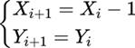

.. vim: syntax=rst

步进电机圆弧插补实现
==========================================

逐点比较法圆弧插补原理
~~~~~~~~~~~~~~~~~~~~~~~~~~~~~~~
逐点比较法的圆弧插补和直线插补一样，都分为偏差判别、坐标进给、偏差计算和终点判别四个步骤。逐点比较法圆弧插补中，一般以坐标原点为圆心，给出圆弧起点坐标和终点坐标，
以及圆弧的加工方向和所在的象限。为了降低复杂度，我们首先讲解位于第一象限的逆时针圆弧插补。

偏差判别
------------------------
设坐标轴中有一段逆时针方向的圆弧AB，圆形为坐标原点，起点坐标A(X\ :sub:`0`\,Y\ :sub:`0`\)，终点坐标B(X\ :sub:`e`\,Y\ :sub:`e`\)，圆弧上有一加工动点P，
坐标P(X\ :sub:`i`\,Y\ :sub:`i`\)，如下图所示。

设A点到圆心的距离为R，动点P到圆心的距离为R\ :sub:`P`\，根据上图给出的信息，使用圆的标准方程可得圆弧AB所在圆的方程和动点P所在圆的方程：

设动点P所在圆的半径与圆弧AB所在圆的半径之间的差值为插补的偏差值，记为F\ :sub:`i`\，则有式子：

从上面的式子中可以分析出，F\ :sub:`i`\的正负能够反映动点P与圆弧AB的位置偏差情况。

- 当F\ :sub:`i`\ = 0时，R\ :sub:`P`\ = R，则动点P在圆弧AB上；
- 当F\ :sub:`i`\ > 0时，R\ :sub:`P`\ > R，则动点P在圆弧AB的外侧；
- 当F\ :sub:`i`\ < 0时，R\ :sub:`P`\ < R，则动点P在圆弧AB的内侧。

坐标进给
------------------------
逐点比较法的坐标进给有两个原则：一是减小加工动点相对于理论轨迹的位置偏差，二是进给方向总是平行与某个坐标轴。
根据这个原则以及上个步骤偏差判别的信息，可以得出第一象限逆时针圆弧插补的坐标进给方法：

- F\ :sub:`i`\ = 0，动点P在圆弧AB上，可向圆内进给一步，也可向圆外方向进给一步，通常规定向圆内即-X方向进给；
- F\ :sub:`i`\ > 0，动点P在圆弧AB的外侧，应该向圆内即-X方向进给一步；
- F\ :sub:`i`\ < 0，动点P在圆弧AB的内侧，应该向圆外即+Y方向进给一步；
- 当动点P在X轴上时，为减小误差，通常直接向+Y方向进给一步。

整个坐标进给的轨迹效果可以用一张图演示出来，如下图所示。

当然，图中只作为第一象限逆时针圆弧插补中刀具运动轨迹的演示，实际应用中的运动轨迹并不会像图里这么夸张，进给一步的长度是一个脉冲当量，以保证加工精度。

偏差计算
------------------------
在坐标进给之后得到新的动点坐标值，此时需要计算新的动点和理论轨迹之间的偏差值。从前面的讨论中我们知道了偏差值F\ :sub:`i`\的计算公式，
可以通过公式直接求出F\ :sub:`i`\。不过公式中有4次乘方运算，也可以说是4次乘法运算，虽然现在的各种控制器基本可以轻松的做乘法运算，
但是为了追求更高的运行效率，我们把当前的偏差计算公式做一点小小的优化，将其变为递推公式。

假设当F\ :sub:`i`\ > 0时，加工动点P向圆内进给一步，生成一个新的动点P\ :sub:`i+1`\，坐标是(X\ :sub:`i+1`\ , Y\ :sub:`i+1`\)，
则新动点的偏差值F\ :sub:`i+1`\计算公式为：

又因为动点P\ :sub:`i+1`\的坐标可由P点表示：

所以将由P点表示的P\ :sub:`i+1`\坐标代入F\ :sub:`i+1`\式中，可得：

上面最后得出的这个公式便是逐点比较法的第一象限逆时针圆弧插补偏差计算的递推公式，从式中可以看出，
偏差F\ :sub:`i+1`\的值只跟上一步进给的偏差F\ :sub:`i`\和上一步的动点坐标值P\ :sub:`i`\有关，且将四次乘方运算转为一次乘2运算，比原始公式更简单快速。

同理可得，当F\ :sub:`i`\ < 0时，加工动点向+Y方向进给一步后的新偏差值递推公式：

需要指出的是，以上两个圆弧插补偏差计算公式中包含了上一个加工动点的坐标X\ :sub:`i`\和Y\ :sub:`i`\，由于加工动点是变化的，
因此在计算偏差F\ :sub:`i+1`\的同时，还要计算出新的动点坐标X\ :sub:`i+1`\和Y\ :sub:`i+1`\，为新的偏差值计算做准备，这是直线插补所不需要的。

终点判别
------------------------
常用的终点判别方法有三种，终点坐标法、投影法和总步长法。

- 终点坐标法。在启动插补之前，先定义X、Y两个方向的步长计数器，分别记录终点坐标在X、Y两个方向上的值。开始插补后当X、Y方向每进给一步，
  就在相应的计数器中减1，直到两个计数器的值都减为0时，刀具抵达终点，停止插补。

- 投影法。在插补前，先比较出终点坐标的X、Y值中较大的一个，然后以较大的数值作为计数器的值，当对应的轴有进给时，计数器减1，直到计数器为0。
  相当于终点坐标向值较大的轴做投影，所以叫投影法。

- 总步长法，即插补前，将终点坐标的X、Y值求和，得到一个总步长计数器，开始插补后，无论哪个轴进给一步，总步长计数器都减1，直到计数器等于0，停止插补。

以上三种终点判别的方法，全部使用坐标的绝对值进行计算。

第一象限逆时针圆弧插补实验
~~~~~~~~~~~~~~~~~~~~~~~~~~~~~~~
上一节讲解了逐点比较法的第一象限逆时针圆弧插补原理，接下来结合实验程序讲解具体实现。本实验讲解如何实现第一象限逆时针圆弧插补。
学习本节内容时，请打开配套的“stepper—第一象限逆时针圆弧插补-逐点比较法”工程配合阅读。

硬件设计
------------------------
本实验的硬件设计部分与直线插补实验完全相同，在此不再赘述。如有不清楚的地方，请查看第一象限直线插补实验。

软件设计
------------------------
本次第一象限逆时针圆弧插补实验只讲解跟圆弧插补有关的部分核心代码，有些变量的设置，头文件的包含等并没有涉及到，
完整的代码请参考本章配套工程“stepper—第一象限逆时针圆弧插补-逐点比较法”。
我们创建了两个文件：bsp_circular_interpolation.c 和 bsp_circular_interpolation.h 文件用来存放圆弧插补程序及相关变量定义。

编程要点
^^^^^^^^^^^^^^^^^^^^^^^^
1. 步进电机定时器 IO 配置
#. 步进电机定时器时基、中断配置
#. 在定时器中完成圆弧插补的4个步骤
#. 通过对圆弧参数的设置实现第一象限圆弧插补

软件分析
^^^^^^^^^^^^^^^^^^^^^^^^
1. 宏定义

.. code-block:: c
   :caption: bsp_stepper_init.h-宏定义
   :linenos:

    /*宏定义*/
    /*******************************************************/
    #define MOTOR_PUL_TIM                        TIM8
    #define MOTOR_PUL_IRQn                       TIM8_UP_TIM13_IRQn
    #define MOTOR_PUL_IRQHandler                 TIM8_UP_TIM13_IRQHandler
    #define MOTOR_PUL_CLK_ENABLE()               __TIM8_CLK_ENABLE()
    #define MOTOR_PUL_GPIO_AF                    GPIO_AF3_TIM8

    /*********************X轴电机引脚定义*******************/
    //Motor 方向
    #define X_MOTOR_DIR_PIN                      GPIO_PIN_1
    #define X_MOTOR_DIR_GPIO_PORT                GPIOE
    #define X_MOTOR_DIR_GPIO_CLK_ENABLE()        __HAL_RCC_GPIOE_CLK_ENABLE()

    //Motor 使能
    #define X_MOTOR_EN_PIN                       GPIO_PIN_0
    #define X_MOTOR_EN_GPIO_PORT                 GPIOE
    #define X_MOTOR_EN_GPIO_CLK_ENABLE()         __HAL_RCC_GPIOE_CLK_ENABLE()

    //Motor 脉冲
    #define X_MOTOR_PUL_PORT                     GPIOI
    #define X_MOTOR_PUL_PIN                      GPIO_PIN_5
    #define X_MOTOR_PUL_GPIO_CLK_ENABLE()        __HAL_RCC_GPIOI_CLK_ENABLE()

    //定时器通道
    #define X_MOTOR_PUL_CHANNEL                  TIM_CHANNEL_1

    /*********************Y轴电机引脚定义*******************/
    //Motor 方向
    #define Y_MOTOR_DIR_PIN                      GPIO_PIN_8
    #define Y_MOTOR_DIR_GPIO_PORT                GPIOI          
    #define Y_MOTOR_DIR_GPIO_CLK_ENABLE()        __HAL_RCC_GPIOI_CLK_ENABLE()

    //Motor 使能
    #define Y_MOTOR_EN_PIN                       GPIO_PIN_4
    #define Y_MOTOR_EN_GPIO_PORT                 GPIOE                       
    #define Y_MOTOR_EN_GPIO_CLK_ENABLE()      	 __HAL_RCC_GPIOE_CLK_ENABLE()

    //Motor 脉冲
    #define Y_MOTOR_PUL_PORT       			         GPIOI
    #define Y_MOTOR_PUL_PIN             		     GPIO_PIN_6
    #define Y_MOTOR_PUL_GPIO_CLK_ENABLE()        __HAL_RCC_GPIOI_CLK_ENABLE()

    //定时器通道
    #define Y_MOTOR_PUL_CHANNEL                  TIM_CHANNEL_2

由于直线插补需要两个步进电机才能完成，所以在bsp_stepper_init.h中新增第二个步进电机的相关IO口和外设的宏定义。
宏定义的具体内容与其他步进电机控制例程一致，故不再赘述。

2. 步进电机初始化

.. code-block:: c
   :caption: bsp_stepper_init.h-结构体
   :linenos:

    /* 步进电机结构体 */
    typedef struct{
      uint16_t pul_pin;        //脉冲引脚
      uint16_t dir_pin;        //方向引脚
      uint16_t en_pin;         //使能引脚
      uint32_t pul_channel;    //输出脉冲的定时器通道
      GPIO_TypeDef *pul_port;  //脉冲引脚端口结构体
      GPIO_TypeDef *dir_port;  //方向引脚端口结构体
      GPIO_TypeDef *en_port;   //使能引脚端口结构体
    }Stepper_TypeDef;
  
    /* 步进电机结构体数组  bsp_stepper_init.c */
    Stepper_TypeDef step_motor[2] = 
    {
      {X_MOTOR_PUL_PIN, X_MOTOR_DIR_PIN, X_MOTOR_EN_PIN, X_MOTOR_PUL_CHANNEL, X_MOTOR_PUL_PORT, X_MOTOR_DIR_GPIO_PORT, X_MOTOR_EN_GPIO_PORT},
      {Y_MOTOR_PUL_PIN, Y_MOTOR_DIR_PIN, Y_MOTOR_EN_PIN, Y_MOTOR_PUL_CHANNEL, Y_MOTOR_PUL_PORT, Y_MOTOR_DIR_GPIO_PORT, Y_MOTOR_EN_GPIO_PORT},
    };

在bsp_stepper_init.h中定义了一个结构体，内部包括控制步进电机所必须的引脚端口、编号和脉冲输出的定时器通道，
然后在bsp_stepper_init.c中定义了一个Stepper_TypeDef类型的数组，分别管理X、Y轴步进电机。这么做的目的是为了方便后续程序更方便的控制两个步进电机，
如需增加或减少步进电机的数量，直接增加或减少数组元素即可。

.. code-block:: c
   :caption: bsp_stepper_init.c-定时器初始化
   :linenos:

   static void TIM_PWMOUTPUT_Config(void)
    {
      TIM_OC_InitTypeDef  TIM_OCInitStructure;

      /* 获取数组元素个数 */
      uint8_t member_count = sizeof(step_motor)/sizeof(Stepper_TypeDef);
      
      /*使能定时器*/
      MOTOR_PUL_CLK_ENABLE();
      
      TIM_StepperHandle.Instance = MOTOR_PUL_TIM;    
      /* 累计 TIM_Period个后产生一个更新或者中断*/    
      //当定时器从0计数到TIM_PERIOD，即为TIM_PERIOD次，为一个定时周期
      TIM_StepperHandle.Init.Period = TIM_PERIOD;
      // 通用控制定时器时钟源TIMxCLK = HCLK = 168MHz 
      // 设定定时器频率为=TIMxCLK/(TIM_Prescaler+1)=28MHz
      TIM_StepperHandle.Init.Prescaler = TIM_PRESCALER-1;

      /*计数方式*/
      TIM_StepperHandle.Init.CounterMode = TIM_COUNTERMODE_UP;            
      /*采样时钟分频*/  
      TIM_StepperHandle.Init.ClockDivision=TIM_CLOCKDIVISION_DIV1;   
      TIM_StepperHandle.Init.RepetitionCounter = 0;
      /*初始化定时器为输出比较模式*/
      HAL_TIM_Base_Init(&TIM_StepperHandle);

      /*PWM模式配置--这里配置为PWM模式2*/
      TIM_OCInitStructure.OCMode = TIM_OCMODE_PWM2;
      /*比较输出的计数值*/
      TIM_OCInitStructure.Pulse = TIM_PERIOD;
      /*当定时器计数值小于CCR1_Val时为高电平*/
      TIM_OCInitStructure.OCPolarity = TIM_OCPOLARITY_HIGH;
      /*设置互补通道输出的极性*/
      TIM_OCInitStructure.OCNPolarity = TIM_OCNPOLARITY_HIGH; 
      /*快速模式设置*/
      TIM_OCInitStructure.OCFastMode = TIM_OCFAST_DISABLE;
      /*空闲电平*/
      TIM_OCInitStructure.OCIdleState = TIM_OCIDLESTATE_RESET;  
      /*互补通道设置*/
      TIM_OCInitStructure.OCNIdleState = TIM_OCNIDLESTATE_RESET;

      for(uint8_t i = 0; i < member_count; i++)
      {
        /* 配置输出比较通道 */
        HAL_TIM_OC_ConfigChannel(&TIM_StepperHandle, &TIM_OCInitStructure, step_motor[i].pul_channel);
        TIM_CCxChannelCmd(MOTOR_PUL_TIM, step_motor[i].pul_channel, TIM_CCx_DISABLE);
      }
    }

接下来比较重要的是控制步进电机的定时器初始化，在上述代码中我们使用PMW模式2输出脉冲，具体原因已在第一象限直线插补实验中说明。
上述代码中，分别使用TIM8的通道1和通道2控制X、Y两轴步进电机，使用一个for循环配置所有用到的通道，初始化定时器配置好输出通道之后并没有立刻启动定时器输出。

3. 第一象限逆时针圆弧插补相关参数

.. code-block:: c
   :caption: bsp_circular_interpolation.h-圆弧插补变量定义
   :linenos:

    /* 坐标轴枚举 */
    typedef enum{
      x_axis = 0U,
      y_axis
    }Axis_TypeDef;

    /* 圆弧插补参数结构体 */
    typedef struct{
      __IO int32_t startpoint_x;         //起点坐标X
      __IO int32_t startpoint_y;         //起点坐标Y
      __IO int32_t endpoint_x;           //终点坐标X
      __IO int32_t endpoint_y;           //终点坐标Y
      __IO uint32_t endpoint_pulse;       //到达终点位置需要的脉冲数
      __IO uint32_t active_axis;          //当前运动的轴
      __IO int32_t deviation;             //偏差参数
      __IO uint8_t motionstatus : 1;      //插补运动状态
      __IO uint8_t dir_x : 1;             //X轴运动方向
      __IO uint8_t dir_y : 1;             //Y轴运动方向
    }CircularInterpolation_TypeDef;

上述代码中分别定义了一个枚举和结构体，用于管理第一象限逆时针圆弧插补的相关数据参数。CircularInterpolation_TypeDef结构体的成员中，
定义了圆弧起点和终点的坐标，endpoint_pulse记录运动到终点需要多少脉冲，active_axis记录当前活动的轴，
也就是当前进给的轴，deviation就是上面讲到的F\ :sub:`i`\，用于偏差值的记录和计算。X、Y轴的运动方向和整个插补运动的状态则由一个结构体位域定义。

4. 第一象限逆时针圆弧插补运动

.. code-block:: c
   :caption: bsp_circular_interpolation.c-圆弧插补变量定义
   :linenos:

       /**
      * @brief  第一象限逆圆插补运动
      * @param  start_x：圆弧起点相对于圆心的坐标X，增量
      * @param  start_y：圆弧起点相对于圆心的坐标Y，增量
      * @param  stop_x：圆弧终点相对于圆心的坐标X，增量
      * @param  stop_y：圆弧终点相对于圆心的坐标Y，增量
      * @param  speed：进给速度
      * @retval 无
      */
    void Circular_InterPolation_CCW(int32_t start_x, int32_t start_y, int32_t stop_x, int32_t stop_y, uint16_t speed)
    {
      /* 判断当前是否正在做插补运动 */
      if(interpolation_para.motionstatus != 0)
        return;
      
      /* 检查起点、终点坐标是否在同一个圆上 */
      if(((start_x * start_x) + (start_y * start_y)) != ((stop_x * stop_x) + (stop_y * stop_y)))
        return;
      
      /* 偏差清零 */
      interpolation_para.deviation = 0;
      
      /* 起点坐标 */
      interpolation_para.startpoint_x = start_x;
      interpolation_para.startpoint_y = start_y;
      /* 终点坐标 */
      interpolation_para.endpoint_x = stop_x;
      interpolation_para.endpoint_y = stop_y;
      /* 所需脉冲数是从起点到终点的脉冲数之和 */
      interpolation_para.endpoint_pulse = abs(stop_x - start_x) + abs(stop_y - start_y);
      
      /* 第一象限逆圆，x轴逆转，y轴正转 */
      interpolation_para.dir_x = CCW;
      interpolation_para.dir_y = CW;
      MOTOR_DIR(step_motor[x_axis].dir_port, step_motor[x_axis].dir_pin, CCW);
      MOTOR_DIR(step_motor[y_axis].dir_port, step_motor[y_axis].dir_pin, CW);
      
      /* 起点坐标y=0，说明起点在x轴上，直接向y轴进给可减小误差 */
      if(interpolation_para.startpoint_y == 0)
      {
        /* 第一步活动轴为Y轴 */
        interpolation_para.active_axis = y_axis;
        /* 计算偏差 */
        interpolation_para.deviation += (2 * interpolation_para.startpoint_y + 1);
      }
      else
      {
        /* 第一步活动轴为X轴 */
        interpolation_para.active_axis = x_axis;
        /* 计算偏差 */
        interpolation_para.deviation -= (2 * interpolation_para.startpoint_x + 1);
      }
      
      /* 设置速度 */
      __HAL_TIM_SET_COMPARE(&TIM_StepperHandle, step_motor[x_axis].pul_channel, speed);
      __HAL_TIM_SET_COMPARE(&TIM_StepperHandle, step_motor[y_axis].pul_channel, speed);
      __HAL_TIM_SET_AUTORELOAD(&TIM_StepperHandle, speed * 2);
      
      /* 使能主输出 */
      __HAL_TIM_MOE_ENABLE(&TIM_StepperHandle);
      /* 开启活动轴比较通道输出 */
      TIM_CCxChannelCmd(MOTOR_PUL_TIM, step_motor[interpolation_para.active_axis].pul_channel, TIM_CCx_ENABLE);
      HAL_TIM_Base_Start_IT(&TIM_StepperHandle);
      
      interpolation_para.motionstatus = 1;
    }

上述代码用来开启圆弧插补运动，并在开始运动前，对起点终点坐标、XY轴的进给方向和进给速度进行处理。

- 第11行：判断当前是否有插补正在运行，如果有则跳出；
- 第15行：判断当前传入的起点终点坐标是否在同一个圆上，如不在则跳出；
- 第21~28行：记录起点终点坐标，计算并记录总共需要的插补步数；
- 第31~34行：由于是第一象限逆时针圆弧插补，所以在插补未开始时，将XY轴的步进电机方向设置到符合第一象限逆时针；
- 第37~50行：判断起点坐标是否在X轴上，如果在X轴则第一步向+Y方向进给，并计算对应的偏差值，如果不在X轴则第一步向-X方向进给；
- 第53~55行：设置圆弧插补的进给速度；
- 第53~65行：开启定时器输出，开始执行插补运动。

.. code-block:: c
   :caption: bsp_circular_interpolation.c-定时器中断回调函数
   :linenos:

      /**
      * @brief  定时器比较中断回调函数
      * @param  htim：定时器句柄指针
      * @note   无
      * @retval 无
      */
    void HAL_TIM_PeriodElapsedCallback(TIM_HandleTypeDef *htim)
    {
      uint32_t last_axis = 0;
      
      /* 记录上一步的进给活动轴 */
      last_axis = interpolation_para.active_axis;
      
      /* 根据进给方向刷新坐标 */
      switch(last_axis)
      {
        case x_axis:
          switch(interpolation_para.dir_x)
          {
            case CCW: interpolation_para.startpoint_x--; break;
            case CW:  interpolation_para.startpoint_x++; break;
          }
          break;
        case y_axis:
          switch(interpolation_para.dir_y)
          {
            case CCW: interpolation_para.startpoint_y--; break;
            case CW:  interpolation_para.startpoint_y++; break;
          }
          break;
      }
      
      /* 根据上一步的偏差，判断的进给方向，并计算下一步的偏差 */
      if(interpolation_para.deviation >= 0)
      {
        /* 偏差>=0，在圆弧外侧，应向圆内进给，计算偏差 */
        interpolation_para.active_axis = x_axis;
        interpolation_para.deviation -= (2 * interpolation_para.startpoint_x + 1);
      }
      else
      {
        /* 偏差<0，在圆弧内侧，应向圆外进给，计算偏差 */
        interpolation_para.active_axis = y_axis;
        interpolation_para.deviation += (2 * interpolation_para.startpoint_y + 1);
      }
      
      /* 下一步的活动轴与上一步的不一致时，需要换轴 */
      if(last_axis != interpolation_para.active_axis)
      {
        TIM_CCxChannelCmd(htim->Instance, step_motor[last_axis].pul_channel, TIM_CCx_DISABLE);
        TIM_CCxChannelCmd(htim->Instance, step_motor[interpolation_para.active_axis].pul_channel, TIM_CCx_ENABLE);
      }
      
      /* 进给总步数减1 */
      interpolation_para.endpoint_pulse--;
      
      /* 判断是否完成插补 */
      if(interpolation_para.endpoint_pulse == 0)
      {
        /* 关闭定时器 */
        TIM_CCxChannelCmd(htim->Instance, step_motor[last_axis].pul_channel, TIM_CCx_DISABLE);
        TIM_CCxChannelCmd(htim->Instance, step_motor[interpolation_para.active_axis].pul_channel, TIM_CCx_DISABLE);
        __HAL_TIM_MOE_DISABLE(htim);
        HAL_TIM_Base_Stop_IT(htim);
        interpolation_para.motionstatus = 0;
      }
    }

开启定时器中断后，后续的处理都直接放到中断回调函数中进行。

- 第12行：记录上一步进给的活动轴；
- 第15~30行：这一部分用来计算上一步加工动点的坐标，先判断活动轴是X还是Y，如果是X轴就继续判断上一步是正转还是反转，
  正转+1，反转-1，Y轴同理；
- 第34~44行：这一部分代码根据上一步的动点坐标和偏差值计算新的偏差值；
- 第48~51行：比较上一步进给的轴和下一步进给的轴是否一致，如果不一致，需要切换PWM输出的通道；
- 第55行：完成一次插补，总的进给步数就减一，这里使用了总步长法进行终点判别；
- 第58~65行：如果总的进给步数为0，则表示插补走到终点，关闭定时器结束插补。

整个第一象限逆时针圆弧插补算法的核心内容就在这个定时器中断回调函数中实现了，算法全部的4个步骤都在其中有所体现。

5. main函数

.. code-block:: c
   :caption: main.c-main函数
   :linenos:

    /**
      * @brief  主函数
      * @param  无
      * @retval 无
      */
    int main(void) 
    {
      HAL_InitTick(0);
      /* 初始化系统时钟为168MHz */
      SystemClock_Config();
      /*初始化USART 配置模式为 115200 8-N-1，中断接收*/
      DEBUG_USART_Config();
      printf("欢迎使用野火 电机开发板 步进电机 第一象限圆弧插补 例程\r\n");
      /* LED初始化 */
      LED_GPIO_Config();
      /* 按键初始化 */
      Key_GPIO_Config();
      /*步进电机初始化*/
      stepper_Init();

      while(1)
      {
        /* 逆时针圆弧 */
        if(Key_Scan(KEY2_GPIO_PORT, KEY2_PIN) == KEY_ON)
        {
          Circular_InterPolation_CCW(6400 * 10, 0, 0, 6400 * 10, 1000);
        }
      }
    }

main函数中主要就是一些外设的初始化，包括步进电机的定时器初始化。然后在while循环中轮询按键，通过按键控制步进电机做第一象限逆圆插补。
需要注意的是，由于逐点比较法的圆弧插补进给一次是一个步进脉冲，所以最后插补出来的圆弧大小跟步进电机的细分直接相关，在本实验中默认步进电机32细分，
在main函数中输入的终点坐标参数中也对应步进电机的32细分，6400个脉冲步进电机旋转一圈。

实验现象
------------------------
使用两轴丝杆滑台组成一个标准X-Y滑动平台，将步进电机连接好，下载程序到开发板后，按下开发板的按键，可以看到丝杆滑台上的滑块沿着程序设定的圆弧轨迹运动。

任意象限圆弧插补原理
~~~~~~~~~~~~~~~~~~~~~~~~~~~~~~~
在前面的内容中，我们详细讲解了第一象限逆时针圆弧插补的原理和实现，并推导出了偏差计算公式，不过实际应用中的圆弧插补并不只有第一象限，也有可能在第二、三、四象限。
在每个象限中除了逆时针方向，还有可能会遇到顺时针方向。所以下面的内容将会讲解如何实现任意象限和方向的圆弧插补。

首先我们来看第一象限的顺时针圆弧插补。设坐标轴中有一段顺时针方向的圆弧AB，圆形为坐标原点，起点坐标A(X\ :sub:`0`\,Y\ :sub:`0`\)，
终点坐标B(X\ :sub:`e`\,Y\ :sub:`e`\)，圆弧上有一加工动点P，坐标P(X\ :sub:`i`\,Y\ :sub:`i`\)，如下图所示。

根据上面逆时针圆弧插补的思路，可以推出第一象限顺时针圆弧插补的偏差判别、偏差值计算公式和XY坐标进给方向。如下表所示。

综合这张计算表我们可以发现几个特点，如果把第一象限顺时针圆弧的X、Y轴插补方向对调，就变成了第一象限逆时针圆弧的插补方向，
这样顺时针圆弧的插补问题就变成了逆时针的插补问题，两个方向的偏差计算公式形式保持不变，只是符号和对应的X、Y轴变化。

实际上和直线插补类似，逐点比较法的圆弧插补同样可以利用第一象限逆圆插补推出所有象限和方向的插补情况。
设SR1、SR2、SR3、SR4为第一、二、三、四象限的顺时针圆弧，NR1、NR2、NR3、NR4第一、二、三、四象限的逆时针圆弧，一共8种线形。
根据他们各自的偏差判别、偏差值计算公式和XY坐标进给方向，可以归纳为2组，这里由于篇幅限制，不展开推导每种线形的偏差计算公式，
而是分别用两张图表来说明，对此感兴趣的可以自己尝试推导。

首先第一组是NR1、NR3、SR2、SR4，这一组的共同点如下：

- 当F\ :sub:`i`\ ≥ 0时，X轴进给，NR1、SR4走-X方向，SR2、NR3走+X方向；
- 当F\ :sub:`i`\ < 0时，Y轴进给，NR1、SR2走+Y方向，NR3、SR4走-Y方向。

设都从各自的圆弧起点开始插补，则第一组的圆弧插补方向在一张坐标系图中可得：

第一组的偏差计算公式与第一象限逆时针圆弧插补相同，只是X、Y坐标值使用绝对值参与计算。
将这一组的偏差计算公式和进给方向总结为一张表格，如下表所示。

然后第二组是SR1、SR3、NR2、NR4，这一组的共同点如下：

- 当F\ :sub:`i`\ ≥ 0时，Y轴进给，SR1、NR2走-Y方向，SR3、NR4走+Y方向；
- 当F\ :sub:`i`\ < 0时，X轴进给，SR1、NR4走+X方向，NR2、SR3走-X方向。

同样，第二组的圆弧插补方向在坐标系图中表示为：

第二组的偏差计算公式与第二组相反，并且X、Y坐标值使用绝对值参与计算。
第二组的偏差计算公式和进给方向总结为一张表格，如下表所示。

任意象限双向圆弧插补实验
~~~~~~~~~~~~~~~~~~~~~~~~~~~~~~~
上一节讲解了逐点比较法的任意象限双向圆弧插补原理，接下来结合实验程序讲解具体实现。
学习本节内容时，请打开配套的“stepper—任意象限双向圆弧插补-逐点比较法”工程配合阅读。

硬件设计
------------------------
本实验的硬件设计部分与直线插补实验完全相同，在此不再赘述。如有不清楚的地方，请查看第一象限直线插补实验。

软件设计
------------------------
本次任意象限双向圆弧插补实验只讲解跟圆弧插补有关的部分核心代码，有些变量的设置，头文件的包含等并没有涉及到，
完整的代码请参考本章配套工程“stepper—任意象限双向圆弧插补-逐点比较法”。
我们创建了两个文件：bsp_circular_interpolation.c 和 bsp_circular_interpolation.h 文件用来存放圆弧插补程序及相关变量定义。

编程要点
^^^^^^^^^^^^^^^^^^^^^^^^
1. 步进电机定时器 IO 配置
#. 步进电机定时器时基、中断配置
#. 在定时器中完成圆弧插补的4个步骤
#. 判断圆弧起点终点坐标，实现任意象限圆弧插补。

软件分析
^^^^^^^^^^^^^^^^^^^^^^^^
1. 任意象限双向圆弧插补相关参数

.. code-block:: c
   :caption: bsp_circular_interpolation.h-圆弧插补相关参数
   :linenos:

    /* 坐标轴枚举 */
    typedef enum{
      x_axis = 0U,
      y_axis
    }Axis_TypeDef;

    /* 坐标轴象限枚举 */
    typedef enum{
      quadrant_1st = 0U,
      quadrant_2nd,
      quadrant_3rd,
      quadrant_4th
    }Quadrant_TypeDef;

    /* 圆弧插补参数结构体 */
    typedef struct{
      __IO int32_t startpoint[2];        //起点坐标X、Y
      __IO int32_t endpoint_x;           //终点坐标X
      __IO int32_t endpoint_y;           //终点坐标Y
      __IO uint32_t endpoint_pulse;      //到达终点位置需要的脉冲数
      __IO uint32_t active_axis;         //当前运动的轴
      __IO int32_t deviation;            //偏差参数F
      __IO int8_t devi_sign[2];          //偏差方程的运算符号，正负
      __IO uint8_t motionstatus : 1;     //插补运动状态
      __IO uint8_t dir_x : 1;            //X轴运动方向
      __IO uint8_t dir_y : 1;            //Y轴运动方向
      __IO uint8_t dir_interpo : 1;      //插补整体运动方向
      __IO uint8_t crood_pos : 2;        //起点坐标所在的象限
    }CircularInterpolation_TypeDef;

本实验的步进电机相关宏定义、引脚和定时器初始化与之前讲过的实验完全相同，所以在此不再赘述，重点讲解任意象限圆弧插补的实现过程。

在上述代码中分别定义了坐标轴和坐标象限的枚举，和一个圆弧插补相关参数的结构体。CircularInterpolation_TypeDef结构体相比第一象限逆圆插补，修改和增加了一些成员变量，
其中startpoint[2]数组变量用来存放起点的坐标(x,y)，devi_sign[2]数组中的两个元素分别保存X轴偏差方程和Y轴偏差方程的运算符号，为了判断圆弧插补的方向和所在象限，
增加了dir_interpo和crood_pos。

2. 任意象限双向圆弧插补

.. code-block:: c
   :caption: bsp_circular_interpolation.c-判断插补进给方向
   :linenos:

    /**
      * @brief  设置进给方向
      * @param  coord_x
      * @param  coord_y
      * @retval 无
      */
    static void Set_Feed_DIR(int32_t coord_x, int32_t coord_y, uint8_t dir)
    {
      /* 记录插补运动方向 */
      circular_para.dir_interpo = dir;
      
      if(dir == CW)
      {
        if(coord_x > 0)/* x正半轴 */
        {
          if(coord_y > 0)/* 第一象限 */
          {
            circular_para.crood_pos = quadrant_1st;
            circular_para.dir_x = CW;
            circular_para.dir_y = CCW;
            circular_para.devi_sign[x_axis] = 1;
            circular_para.devi_sign[y_axis] = -1;
            MOTOR_DIR(step_motor[x_axis].dir_port, step_motor[x_axis].dir_pin, CW);
            MOTOR_DIR(step_motor[y_axis].dir_port, step_motor[y_axis].dir_pin, CCW);
          }
          else/* 第四象限 */
          {
            circular_para.crood_pos = quadrant_4th;
            circular_para.dir_x = CCW;
            circular_para.dir_y = CCW;
            circular_para.devi_sign[x_axis] = -1;
            circular_para.devi_sign[y_axis] = -1;
            MOTOR_DIR(step_motor[x_axis].dir_port, step_motor[x_axis].dir_pin, CCW);
            MOTOR_DIR(step_motor[y_axis].dir_port, step_motor[y_axis].dir_pin, CCW);
          }
        }
        else if(coord_x < 0)/* x负半轴 */
        {
          if(coord_y >= 0)/* 第二象限 */
          {
            circular_para.crood_pos = quadrant_2nd;
            circular_para.dir_x = CW;
            circular_para.dir_y = CW;
            circular_para.devi_sign[x_axis] = 1;
            circular_para.devi_sign[y_axis] = 1;
            MOTOR_DIR(step_motor[x_axis].dir_port, step_motor[x_axis].dir_pin, CW);
            MOTOR_DIR(step_motor[y_axis].dir_port, step_motor[y_axis].dir_pin, CW);
          }
          else/* 第三象限 */
          {
            circular_para.crood_pos = quadrant_3rd;
            circular_para.dir_x = CCW;
            circular_para.dir_y = CW;
            circular_para.devi_sign[x_axis] = -1;
            circular_para.devi_sign[y_axis] = 1;
            MOTOR_DIR(step_motor[x_axis].dir_port, step_motor[x_axis].dir_pin, CCW);
            MOTOR_DIR(step_motor[y_axis].dir_port, step_motor[y_axis].dir_pin, CW);
          }
        }
        else if(coord_x == 0)/* x=0，当前点在Y轴上 */
        {
          if(coord_y > 0)/* 第一象限 */
          {
            circular_para.crood_pos = quadrant_1st;
            circular_para.dir_x = CW;
            circular_para.dir_y = CCW;
            circular_para.devi_sign[x_axis] = 1;
            circular_para.devi_sign[y_axis] = -1;
            MOTOR_DIR(step_motor[x_axis].dir_port, step_motor[x_axis].dir_pin, CW);
            MOTOR_DIR(step_motor[y_axis].dir_port, step_motor[y_axis].dir_pin, CCW);
          }
          else if(coord_y < 0)/* 第三象限 */
          {
            circular_para.crood_pos = quadrant_3rd;
            circular_para.dir_x = CCW;
            circular_para.dir_y = CW;
            circular_para.devi_sign[x_axis] = -1;
            circular_para.devi_sign[y_axis] = 1;
            MOTOR_DIR(step_motor[x_axis].dir_port, step_motor[x_axis].dir_pin, CCW);
            MOTOR_DIR(step_motor[y_axis].dir_port, step_motor[y_axis].dir_pin, CW);
          }
        }
      }
      else
      {
        if(coord_x > 0)/* x正半轴 */
        {
          if(coord_y >= 0)/* 第一象限 */
          {
            circular_para.crood_pos = quadrant_1st;
            circular_para.dir_x = CCW;
            circular_para.dir_y = CW;
            circular_para.devi_sign[x_axis] = -1;
            circular_para.devi_sign[y_axis] = 1;
            MOTOR_DIR(step_motor[x_axis].dir_port, step_motor[x_axis].dir_pin, CCW);
            MOTOR_DIR(step_motor[y_axis].dir_port, step_motor[y_axis].dir_pin, CW);
          }
          else/* 第四象限 */
          {
            circular_para.crood_pos = quadrant_4th;
            circular_para.dir_x = CW;
            circular_para.dir_y = CW;
            circular_para.devi_sign[x_axis] = 1;
            circular_para.devi_sign[y_axis] = 1;
            MOTOR_DIR(step_motor[x_axis].dir_port, step_motor[x_axis].dir_pin, CW);
            MOTOR_DIR(step_motor[y_axis].dir_port, step_motor[y_axis].dir_pin, CW);
          }
        }
        else if(coord_x < 0)/* x负半轴 */
        {
          if(coord_y > 0)/* 第二象限 */
          {
            circular_para.crood_pos = quadrant_2nd;
            circular_para.dir_x = CCW;
            circular_para.dir_y = CCW;
            circular_para.devi_sign[x_axis] = -1;
            circular_para.devi_sign[y_axis] = -1;
            MOTOR_DIR(step_motor[x_axis].dir_port, step_motor[x_axis].dir_pin, CCW);
            MOTOR_DIR(step_motor[y_axis].dir_port, step_motor[y_axis].dir_pin, CCW);
          }
          else/* 第三象限 */
          {
            circular_para.crood_pos = quadrant_3rd;
            circular_para.dir_x = CW;
            circular_para.dir_y = CCW;
            circular_para.devi_sign[x_axis] = 1;
            circular_para.devi_sign[y_axis] = -1;
            MOTOR_DIR(step_motor[x_axis].dir_port, step_motor[x_axis].dir_pin, CW);
            MOTOR_DIR(step_motor[y_axis].dir_port, step_motor[y_axis].dir_pin, CCW);
          }
        }
        else if(coord_x == 0)/* x=0，当前点在Y轴上 */
        {
          if(coord_y > 0)/* 第二象限 */
          {
            circular_para.crood_pos = quadrant_2nd;
            circular_para.dir_x = CCW;
            circular_para.dir_y = CCW;
            circular_para.devi_sign[x_axis] = -1;
            circular_para.devi_sign[y_axis] = -1;
            MOTOR_DIR(step_motor[x_axis].dir_port, step_motor[x_axis].dir_pin, CCW);
            MOTOR_DIR(step_motor[y_axis].dir_port, step_motor[y_axis].dir_pin, CCW);
          }
          else if(coord_y < 0)/* 第四象限 */
          {
            circular_para.crood_pos = quadrant_4th;
            circular_para.dir_x = CW;
            circular_para.dir_y = CW;
            circular_para.devi_sign[x_axis] = 1;
            circular_para.devi_sign[y_axis] = 1;
            MOTOR_DIR(step_motor[x_axis].dir_port, step_motor[x_axis].dir_pin, CW);
            MOTOR_DIR(step_motor[y_axis].dir_port, step_motor[y_axis].dir_pin, CW);
          }
        }
      }
    }

上述代码根据传入的起点坐标和插补方向，判断起点坐标所在的象限，并设置X轴和Y轴的运动方向以及偏差计算公式的符号。

- 第12~80行：插补方向为顺时针时的参数判断和处理；
- 第84~152行：插补方向为逆时针时的参数判断和处理。

.. code-block:: c
   :caption: bsp_circular_interpolation.c-任意象限顺圆插补运动函数
   :linenos:

    /**
      * @brief  任意象限顺圆插补运动
      * @param  start_x：圆弧起点坐标X
      * @param  start_y：圆弧起点坐标Y
      * @param  stop_x：圆弧终点坐标X
      * @param  stop_y：圆弧终点坐标Y
      * @param  speed：进给速度
      * @param  dir：进给方向
      * @retval 无
      */
    void Circular_InterPolation(int32_t start_x, int32_t start_y, int32_t stop_x, int32_t stop_y, uint16_t speed, uint8_t dir)
    {
      /* 判断当前是否正在做插补运动 */
      if(circular_para.motionstatus != 0)
        return;
      
      /* 检查起点、终点坐标是否在同一个圆上 */
      if(((start_x * start_x) + (start_y * start_y)) != ((stop_x * stop_x) + (stop_y * stop_y)))
        return;
      
      /* 偏差清零 */
      circular_para.deviation = 0;
      
      /* 起点坐标 */
      circular_para.startpoint[x_axis] = start_x;
      circular_para.startpoint[y_axis] = start_y;
      /* 终点坐标 */
      circular_para.endpoint_x = stop_x;
      circular_para.endpoint_y = stop_y;
      /* 所需脉冲数是从起点到终点的脉冲数之和 */
      circular_para.endpoint_pulse = abs(stop_x - start_x) + abs(stop_y - start_y);
      
      /* 根据坐标确定插补方向和X、Y运动方向 */
      Set_Feed_DIR(circular_para.startpoint[x_axis], circular_para.startpoint[y_axis], dir);
      
      /* 起点坐标x=0，说明起点在y轴上，直接向x轴进给可减小误差 */
      if(circular_para.startpoint[x_axis] == 0)
      {
        /* 偏差方程：F = F ± 2 * x + 1*/
        circular_para.active_axis = x_axis;
        circular_para.deviation += 2 * circular_para.devi_sign[x_axis]
                                     * circular_para.startpoint[x_axis] + 1;
      }
      else
      {
        /* 偏差方程：F = F ± 2 * y + 1*/
        circular_para.active_axis = y_axis;
        circular_para.deviation += 2 * circular_para.devi_sign[y_axis]
                                     * circular_para.startpoint[y_axis] + 1;
      }
      
      /* 设置速度 */
      __HAL_TIM_SET_COMPARE(&TIM_StepperHandle, step_motor[x_axis].pul_channel, speed);
      __HAL_TIM_SET_COMPARE(&TIM_StepperHandle, step_motor[y_axis].pul_channel, speed);
      __HAL_TIM_SET_AUTORELOAD(&TIM_StepperHandle, speed * 2);
      
      /* 使能主输出 */
      __HAL_TIM_MOE_ENABLE(&TIM_StepperHandle);
      /* 开启活动轴比较通道输出 */
      TIM_CCxChannelCmd(MOTOR_PUL_TIM, step_motor[circular_para.active_axis].pul_channel, TIM_CCx_ENABLE);
      HAL_TIM_Base_Start_IT(&TIM_StepperHandle);
      
      circular_para.motionstatus = 1;
    }

上述代码用来开启圆弧插补运动，并在开始运动前，对起点终点坐标、XY轴的进给方向和进给速度进行处理。

- 第14行：判断是否还有插补运动正在执行；
- 第17行：判断传入的起点和终点坐标是否在同一个圆上；
- 第22行：清零偏差；
- 第25~31行：记录起点终点坐标，计算并记录总共需要的插补步数；
- 第34行：调用Set_Feed_DIR函数，根据起点坐标设置X、Y轴的运动方向；
- 第37~50行：判断起点坐标是否在X轴上，如果在X轴则第一步向Y轴进给，并计算对应的偏差值，如果不在X轴则第一步向X轴进给，
  进给的运动方向和偏差计算公式的符号由第34行得出；
- 第53~55行：设置圆弧插补的进给速度；
- 第57~63行：开启定时器输出，开始执行插补运动。

.. code-block:: c
   :caption: bsp_circular_interpolation.c-定时器比较中断回调函数
   :linenos:

       /**
      * @brief  定时器比较中断回调函数
      * @param  htim：定时器句柄指针
      * @note   无
      * @retval 无
      */
    void HAL_TIM_PeriodElapsedCallback(TIM_HandleTypeDef *htim)
    {
      uint32_t last_axis = 0;
      
      /* 记录上一步的进给活动轴 */
      last_axis = circular_para.active_axis;
      
      /* 根据进给方向刷新坐标 */
      switch(last_axis)
      {
        case x_axis:
          switch(circular_para.dir_x)
          {
            case CCW: circular_para.startpoint[x_axis]--; break;
            case CW:  circular_para.startpoint[x_axis]++; break;
          }
          break;
        case y_axis:
          switch(circular_para.dir_y)
          {
            case CCW: circular_para.startpoint[y_axis]--; break;
            case CW:  circular_para.startpoint[y_axis]++; break;
          }
          break;
      }
      
      /* 根据上一次进给的偏差，判断新的进给活动轴 */
      if(circular_para.deviation >= 0)
      {
        switch(circular_para.dir_interpo)
        {
          case CW:/* 顺时针 */
            switch(circular_para.crood_pos)
            {
              case quadrant_1st:
              case quadrant_3rd:
                circular_para.active_axis = y_axis;
                break;
              case quadrant_2nd:
              case quadrant_4th:
                circular_para.active_axis = x_axis;
                break;
            }
            break;
          case CCW:/* 逆时针 */
            switch(circular_para.crood_pos)
            {
              case quadrant_1st:
              case quadrant_3rd:
                circular_para.active_axis = x_axis;
                break;
              case quadrant_2nd:
              case quadrant_4th:
                circular_para.active_axis = y_axis;
                break;
            }
            break;
        }
      }
      else /* 偏差小于0，向圆外进给 */
      {
        switch(circular_para.dir_interpo)
        {
          case CW:/* 顺时针 */
            switch(circular_para.crood_pos)
            {
              case quadrant_1st:
              case quadrant_3rd:
                circular_para.active_axis = x_axis;
                break;
              case quadrant_2nd:
              case quadrant_4th:
                circular_para.active_axis = y_axis;
                break;
            }
            break;
          case CCW:/* 逆时针 */
            switch(circular_para.crood_pos)
            {
              case quadrant_1st:
              case quadrant_3rd:
                circular_para.active_axis = y_axis;
                break;
              case quadrant_2nd:
              case quadrant_4th:
                circular_para.active_axis = x_axis;
                break;
            }
            break;
        }
      }
      /* 根据插补运动方向和进给方向计算出新的偏差 */
      circular_para.deviation += 2 * circular_para.devi_sign[circular_para.active_axis]
                                   * circular_para.startpoint[circular_para.active_axis] + 1;
      
      /* 下一步的活动轴与上一步的不一致时，需要换轴 */
      if(last_axis != circular_para.active_axis)
      {
        TIM_CCxChannelCmd(htim->Instance, step_motor[last_axis].pul_channel, TIM_CCx_DISABLE);
        TIM_CCxChannelCmd(htim->Instance, step_motor[circular_para.active_axis].pul_channel, TIM_CCx_ENABLE);
      }
      
      /* 进给总步数减1 */
      circular_para.endpoint_pulse--;
      
      /* 判断是否完成插补 */
      if(circular_para.endpoint_pulse == 0)
      {
        /* 关闭定时器 */
        TIM_CCxChannelCmd(htim->Instance, step_motor[last_axis].pul_channel, TIM_CCx_DISABLE);
        TIM_CCxChannelCmd(htim->Instance, step_motor[circular_para.active_axis].pul_channel, TIM_CCx_DISABLE);
        __HAL_TIM_MOE_DISABLE(htim);
        HAL_TIM_Base_Stop_IT(htim);
        circular_para.motionstatus = 0;
      }
    }

开启定时器中断后，后续的处理都直接放到中断回调函数中进行。

- 第12行：记录上一步进给的活动轴；
- 第15~30行：这一部分用来计算上一步加工动点的坐标，先判断活动轴是X还是Y，如果是X轴就继续判断上一步是正转还是反转，
  正转+1，反转-1，Y轴同理；
- 第34~95行：这一部分代码根据上一步的插补偏差大小、插补方向和动点所在象限，得出正在活动的轴；
- 第99~100行：这一行实现了任意象限圆弧插补的偏差计算公式，与上一节总结出的任意象限圆弧插补偏差计算公式几乎相同，只是多了对公式中正负号的控制，
  devi_sign变量便是公式中的正负号，由Set_Feed_DIR函数得出，这样可以仅用一行代码实现任意象限圆弧插补的所有公式；
- 第103~106行：比较上一步进给的轴和下一步进给的轴是否一致，如果不一致，需要切换PWM输出的通道；
- 第110行：完成一次插补，总的进给步数就减一，这里使用了总步长法进行终点判别；
- 第113~120行：如果总的进给步数为0，则表示插补走到终点，关闭定时器结束插补。

3. 主函数

.. code-block:: c
   :caption: main.c-main函数
   :linenos:

    /**
      * @brief  主函数
      * @param  无
      * @retval 无
      */
    int main(void) 
    {
      HAL_InitTick(0);
      /* 初始化系统时钟为168MHz */
      SystemClock_Config();
      /*初始化USART 配置模式为 1156400 8-N-1，中断接收*/
      DEBUG_USART_Config();
      printf("欢迎使用野火 电机开发板 步进电机 任意象限圆弧插补 例程\r\n");
      /* LED初始化 */
      LED_GPIO_Config();
      /* 按键初始化 */
      Key_GPIO_Config();
      /*步进电机初始化*/
      stepper_Init();

      while(1)
      {
        /* 顺时针圆弧 */
        if(Key_Scan(KEY2_GPIO_PORT, KEY2_PIN) == KEY_ON)
        {
          Circular_InterPolation(6400 * 10, 0, 0, -6400 * 10, 1000, CW);
          while(circular_para.motionstatus);
          Circular_InterPolation(0, -6400 * 10, -6400 * 10, 0, 1000, CW);
          while(circular_para.motionstatus);
          Circular_InterPolation(-6400 * 10, 0, 0, 6400 * 10, 1000, CW);
          while(circular_para.motionstatus);
          Circular_InterPolation(0, 6400 * 10, 6400 * 10, 0, 1000, CW);
        }
        /* 逆时针圆弧 */
        if(Key_Scan(KEY3_GPIO_PORT, KEY3_PIN) == KEY_ON)
        {
          Circular_InterPolation(6400 * 10, 0, 0, 6400 * 10, 1000, CCW);
          while(circular_para.motionstatus);
          Circular_InterPolation(0, 6400 * 10, -6400 * 10, 0, 1000, CCW);
          while(circular_para.motionstatus);
          Circular_InterPolation(-6400 * 10, 0, 0, -6400 * 10, 1000, CCW);
          while(circular_para.motionstatus);
          Circular_InterPolation(0, -6400 * 10, 6400 * 10, 0, 1000, CCW);
        }
      }
    }

main函数中主要就是一些外设的初始化，包括步进电机的定时器初始化。然后在while循环中轮询按键，通过按键控制步进电机做圆弧插补。
按下KEY2，做一个从第一象限开始的顺时针圆弧插补，总的运动轨迹为正圆；按下KEY3，做一个从第一象限开始的逆时针圆弧插补，运动轨迹同样为正圆。

实验现象
------------------------
使用两轴丝杆滑台组成一个标准X-Y滑动平台，将步进电机连接好，下载程序到开发板后，按下开发板的按键，可以看到丝杆滑台上的滑块沿着程序设定的圆弧轨迹运动。
