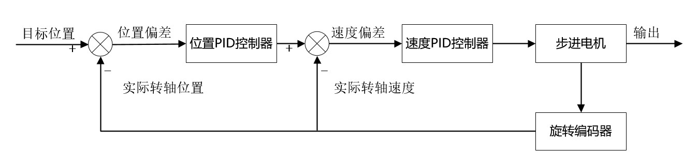
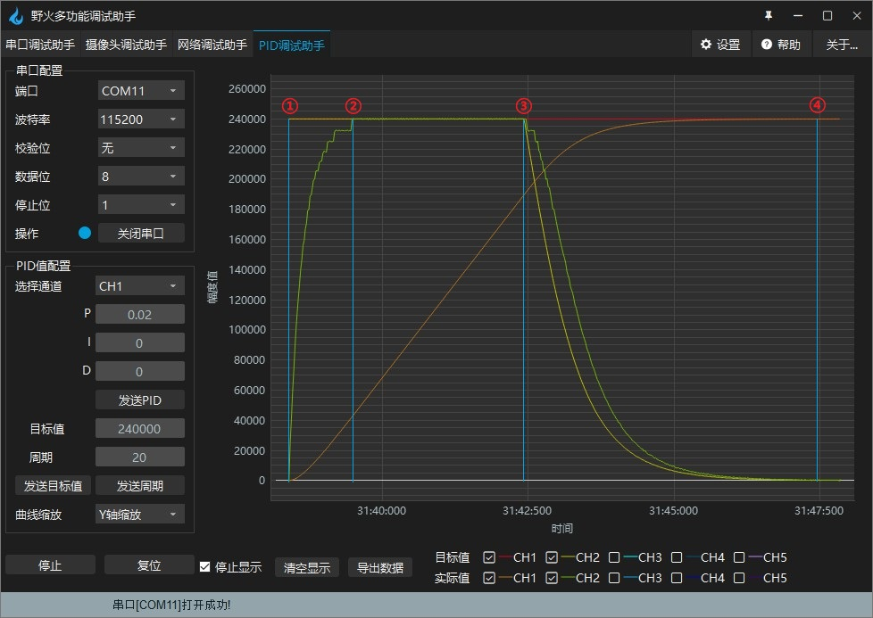

.. vim: syntax=rst

步进电机位置速度双环控制实现
==========================================

在前面有关闭环控制的章节中，我们已经详细的讲解了步进电机单环闭环控制方法，虽然单环控制已经能很好地提高步进电机的性能了，但是仍有其局限性。

在前面两个章节的实验中不难发现，我们虽然使用速度环精确控制了步进电机的转速，但是停止的位置我们难以精确控制；
我们使用位置环来精确控制了步进电机转过的角度，却不得不人为限制速度来防止堵转。

那么我们能不能将位置环和速度环控制融合在一起，各取其长处，既实现位置的精确调节又实现速度的自动控制？
当然是可以的！这一章，我们将为大家讲解如何实现对位置环和速度环的套娃操作以及步进电机在位置和速度双闭环下的控制方法。

本章内容是对之前有关步进电机知识的综合应用，请充分学习和理解相关知识后再进行本章内容的学习。
在学习本章内容时，请打开配套的“步进电机——位置速度双环控制”工程配合阅读。

步进电机位置速度双闭环控制原理
--------------------------------

步进电机闭环控制的原理已经在 **步进电机速度环控制实现** 这一章节详细说明，本章只对双环控制的原理做讲解。

在位置速度双环控制中，位置环为外环，速度环为内环。先向位置PID控制器传入目标位置作为期望值，
然后传入编码器的转轴位置作为实际值进行计算，我们将会得到一个计算值。
此时再把这个计算值传入速度PID控制器作为速度PID控制器的期望值（也就是目标速度），
然后传入编码器的转轴速度作为速度PID控制器的实际值进行计算，
最后我们将速度PID控制器的计算结果输出给步进电机。下图为步进电机位置速度双闭环控制的流程图，
为了方便叙述，没有将步机电机驱动器加入系统框图：

在这个系统中，编码器不仅起到了反馈位置的作用，也起到了反馈速度的作用。

.. tip:: 在PID参数整定时，采取先内环再外环的方法，也就是先单独使用速度环控制，得到满意的参数后，
    再把位置环套在外面，整定位置环参数，最后根据整体效果对速度环参数进行微调。

硬件设计
---------

本章实验的硬件设计仍旧与编码器的使用章节中硬件设计完全相同，相关内容不再继续说明。

步进电机位置速度双闭环控制--增量式PID
------------------------------------

软件设计
~~~~~~~~~~

本章的例程是以"步进电机速度环控制-增量式PID"和"步进电机位置环控制-增量式PID"两个例程的基础上进行编写，
程序主体代码相同，主要修改了存放PID控制器相关参数及宏定义的bsp_pid.h、
bsp_pid.c和用来存步进电机控制程序及相关宏定义的bsp_stepper_ctrl.c、bsp_stepper_ctrl.h 这四个文件。
在接下来我们也着重讲解这一部分。

编程要点
^^^^^^^^^

1. 位置速度双闭环控制实现
#. 双环PID参数整定
#. 控制逻辑的优化

软件分析
^^^^^^^^^

**头文件**

.. code-block:: c
    :caption: bsp_pid.h
    :linenos:

    /*pid*/
    typedef struct
    {
      float target_val;     //目标值
      float actual_val;     //实际值
      float err;            //定义当前偏差值
      float err_next;       //定义下一个偏差值
      float err_last;       //定义上一个偏差值
      float Kp, Ki, Kd;     //定义比例、积分、微分系数
    }_pid;

在bsp_pid.h中定义PID控制器相关参数的结构体，和前两章内容相同

.. code-block:: c
    :caption: bsp_stepper_ctrl.h
    :linenos:

    /*宏定义*/
    /*******************************************************/
    #define TIM_STEP_FREQ     (SystemCoreClock/TIM_PRESCALER) // 频率ft值

    /*电机单圈参数*/
    #define STEP_ANGLE				1.8f                 //步进电机的步距角 单位：度
    #define FSPR              (360.0f/STEP_ANGLE)  //步进电机的一圈所需脉冲数

    #define MICRO_STEP        32          				 //细分器细分数 
    #define SPR               (FSPR*MICRO_STEP)    //细分后一圈所需脉冲数

    #define PULSE_RATIO       (float)(SPR/ENCODER_TOTAL_RESOLUTION)//步进电机单圈脉冲数与编码器单圈脉冲的比值
    #define SAMPLING_PERIOD   50                   //PID采样频率，单位Hz

    #define MOVE_CTRL         0.1f                   //启用速度环控制量
    #define TARGET_DISP       20                   //步进电机运动时的目标圈数，单位：转
    #define TARGET_SPEED_MAX  800                 // 目标速度的最大值

    typedef struct {
      unsigned char stepper_dir : 1;               //步进电机方向
      unsigned char stepper_running : 1;           //步进电机运行状态
      unsigned char MSD_ENA : 1;                   //驱动器使能状态
    }__SYS_STATUS;

在bsp_stepper_ctrl.h中定义步进电机状态的结构体和部分控制参数的宏定义，其中宏定义做了部分修改。

1. **MOVE_CTRL**  作为判断速度环启停的阈值。
2. **TARGET_SPEED_MAX**  由于步进电机的力矩会随转速的升高而下降，我们限制了步进电机最大转速。

**PID算法的实现**

.. code-block:: c
   :caption: bsp_stepper_ctrl.c-增量式PID算法实现-增量式PID
   :linenos:

    /**
      * @brief  增量式PID算法实现
      * @param  val：当前实际值
      *	@note 	无
      * @retval 通过PID计算后的输出
      */
    float PID_realize(_pid *pid, float temp_val) 
    {
      /*传入实际值*/
      pid->actual_val = temp_val;
      /*计算目标值与实际值的误差*/
      pid->err=pid->target_val-pid->actual_val;

      /*PID算法实现*/
      float increment_val = pid->Kp*(pid->err - pid->err_next) + pid->Ki*pid->err + pid->Kd*(pid->err - 2 * pid->err_next + pid->err_last);
      /*传递误差*/
      pid->err_last = pid->err_next;
      pid->err_next = pid->err;
      /*返回增量值*/
      return increment_val;
    }

上面增量式PID算法的实现和前两章的增量式PID算法基本相同，不同之处在于本章使用的PID_realize不仅传入了编码器的参数作为实际值，
还传入了_pid结构体的地址，用以区分速度环和位置环的参数。

**步进电机控制**

.. code-block:: c
   :caption: bsp_stepper_ctrl.c-步进电机位置速度双闭环控制
   :linenos:

    /**
      * @brief  步进电机位置速度双闭环控制
      * @retval 无
      * @note   基本定时器中断内调用
      */
    void Stepper_Ctrl(void)
    {
      /* 编码器相关变量 */
      static __IO float last_count = 0;
      __IO float capture_count = 0;
      __IO float capture_per_unit = 0;
      /* 经过pid计算后的期望值 */
      static __IO float speed_cont_val = 0.0f;
      static __IO float move_cont_val = 0.0f;  
      static int cont_val = 0;  
      
      /* 当电机运动时才启动pid计算 */
      if((sys_status.MSD_ENA == 1) && (sys_status.stepper_running == 1))
      {
        /* 计算编码器脉冲数 */
        capture_count = (int)__HAL_TIM_GET_COUNTER(&TIM_EncoderHandle) + (encoder_overflow_count * ENCODER_TIM_PERIOD);
        /* 计算速度环的传入值 */
        capture_per_unit = capture_count - last_count;
        last_count = capture_count;
        
        /* 编码器脉冲累计值作为实际值传入位置环pid控制器 */
        move_cont_val += PID_realize_move(&move_pid, (float)capture_count);// 进行 PID 计算
        /* 判断运动方向 */
        move_cont_val > 0 ? (MOTOR_DIR(CW)) : (MOTOR_DIR(CCW));
        /* 判断是否启用速度环 */
        if (fabsf(move_cont_val) >= MOVE_CTRL) 
        {
          /* 传递位置环计算值，便于计算*/
          cont_val = move_cont_val;
          
          /* 目标速度上限处理 */
          if (cont_val > TARGET_SPEED_MAX)
          {
            cont_val = TARGET_SPEED_MAX;
          }
          else if (cont_val < -TARGET_SPEED_MAX)
          {
            cont_val = -TARGET_SPEED_MAX;
          }
          
    #if defined(PID_ASSISTANT_EN)
          int32_t temp = cont_val;
          set_computer_value(SEED_TARGET_CMD, CURVES_CH2, &temp, 1);     // 给通道 2 发送目标值
    #endif
          /* 设定速度的目标值 */
          set_pid_target(&speed_pid, cont_val);    
          /* 单位时间内的编码器脉冲数作为实际值传入速度环pid控制器 */
          speed_cont_val += PID_realize_speed(&speed_pid, (float)capture_per_unit);// 进行 PID 计算
          /* 由于OC_Pulse_num为uint16_t变量，取速度环输出值的绝对值进行后续计算*/
          cont_val = fabsf(speed_cont_val);	
          /* 计算比较计数器的值 */
          OC_Pulse_num = ((uint16_t)(TIM_STEP_FREQ / (cont_val * PULSE_RATIO * SAMPLING_PERIOD))) >> 1;
        } 
        else
        {
          /* 计算比较计数器的值 */
          OC_Pulse_num = ((uint16_t)(TIM_STEP_FREQ / ((float)move_cont_val * PULSE_RATIO))) >> 1;
        }
    #if PID_ASSISTANT_EN
        int Temp_ch2 = capture_per_unit;    // 上位机需要整数参数，转换一下
        int Temp_ch1 = capture_count;
        set_computer_value(SEED_FACT_CMD, CURVES_CH2, &Temp_ch2, 1);  // 给通道 1 发送实际值     // 给通道 2 发送实际值
        set_computer_value(SEED_FACT_CMD, CURVES_CH1, &Temp_ch1, 1);     // 给通道 1 发送实际值

    #else
        printf("实际值：%d，目标值：%.0f\r\n", capture_per_unit, pid.target_val);// 打印实际值和目标值 
    #endif
      }
      else
      {
        /*停机状态所有参数清零*/
        last_count = 0;
        speed_cont_val = 0;
        move_cont_val = 0;
        speed_pid.actual_val = 0;
        speed_pid.err = 0;
        speed_pid.err_last = 0;
        speed_pid.err_next = 0;
        move_pid.actual_val = 0;
        move_pid.err = 0;
        move_pid.err_last = 0;
        move_pid.err_next = 0;
      }
    }

本函数实现了位置环和速度环的套娃处理，主要思路就是将外环的输出值作为内环的输入值。
对照本例程就是将位置环PID的输出值作为速度环PID的输入值，由编码器得到的实际值从位置环输入，最终的期望值由速度环输出。

本函数是双环控制的核心代码，接下来我们将逐行对代码进行分析：

-   8-15 ：相关变量的定义和初始化。
-   18   ：判断在电机启动时才进行PID的计算
-   21   ：计算编码器的脉冲数，得到编码器开始运行后的绝对位置。作为位置环的实际值输入。
-   23-24：计算两次PID运算时编码器的差值，得到单位时间编码器相对于上一次的相对位置。作为速度环的实际值输入。
-   27   ：进行位置环PID计算，使用增量式PID控制器
-   29   ：判断步进电机的运动方向
-   31   ：判断何时开启速度环。由于速度环的输入值是位置环的输出值，速度环的输出有一定的滞后性，在到达指定位置后会造成过冲，在即将到达目标位置时只使用位置环进行控制，可以有效改善这种情况。
-   32-58：启用速度环，此时是双环控制。
-   60-63：只使用位置环控制。
-   34   ：由于位置环的输出值是累加的，将其传递给另一个变量便于后续处理。
-   37-44：限制速度环的目标值，也即是限制步进电机的最大转速。原因是步进电机的力矩会随转速的升高而下降。
-   51   ：设定速度环的目标值。
-   53   ：速度环PID计算。
-   55   ：取速度环输出值的绝对值并传递给中间变量。
-   57   ：进行比较计数器值的计算。由于OC_Pulse_num是一个uint16_t的变量，当速度环输出值为负时，计算出OC_Pulse_num = 0 ，而在上一行中取速度环输出值的绝对值可以解决这一问题。
-   62   ：只使用速度环是比较计数器值的计算。
-   75-88：停机时将所有的参数都清零。

**main函数**

.. code-block:: c
   :caption: bsp_stepper_ctrl.h-宏定义
   :linenos:

    /**
      * @brief  主函数
      * @param  无
      * @retval 无
      */
    int main(void) 
    {
      /* 初始化系统时钟为168MHz */
      SystemClock_Config();
      /*初始化USART 配置模式为 115200 8-N-1，中断接收*/
      DEBUG_USART_Config();
      printf("欢迎使用野火 电机开发板 步进电机位置速度双环控制 例程\r\n");
      printf("按下按键3启动和停止电机\r\n");	
      /* 初始化时间戳 */
      HAL_InitTick(5);
      /*按键中断初始化*/
      Key_GPIO_Config();	
      /*led初始化*/
      LED_GPIO_Config();
      /* 初始化基本定时器定时，20ms产生一次中断 */
      TIMx_Configuration();
      /* 编码器接口初始化 */
      Encoder_Init();
      /*步进电机初始化*/
      stepper_Init();
      /* 上电默认停止电机 */
      Set_Stepper_Stop();
      /* PID算法参数初始化 */
      PID_param_init();
    //  MOTOR_DIR(CW);

      /* 目标位置转换为编码器的脉冲数作为pid目标值 */
      move_pid.target_val = TARGET_DISP * ENCODER_TOTAL_RESOLUTION;
      int32_t Temp = TARGET_DISP * ENCODER_TOTAL_RESOLUTION;
    #if PID_ASSISTANT_EN
      set_computer_value(SEED_STOP_CMD, CURVES_CH1, NULL, 0);    // 同步上位机的启动按钮状态
      set_computer_value(SEED_TARGET_CMD, CURVES_CH1, &Temp, 1);// 给通道 1 发送目标值
    #endif

      while(1)
      {
        /* 扫描KEY1，启动电机 */
        if( Key_Scan(KEY1_GPIO_PORT,KEY1_PIN) == KEY_ON  )
        {
        #if PID_ASSISTANT_EN
          Set_Stepper_Start();
          set_computer_value(SEED_START_CMD, CURVES_CH1, NULL, 0);// 同步上位机的启动按钮状态
        #else
          Set_Stepper_Start();
        #endif
        }
        /* 扫描KEY2，停止电机 */
        if( Key_Scan(KEY2_GPIO_PORT,KEY2_PIN) == KEY_ON  )
        {
        #if PID_ASSISTANT_EN
          Set_Stepper_Stop();
          set_computer_value(SEED_STOP_CMD, CURVES_CH1, NULL, 0);// 同步上位机的启动按钮状态
        #else
          Set_Stepper_Stop();     
        #endif
        }
        /* 扫描KEY3，增大目标位置*/
        if( Key_Scan(KEY3_GPIO_PORT,KEY3_PIN) == KEY_ON  )
        {
          /* 目标位置增加48000，对应电机位置增加20圈 */
          move_pid.target_val += 48000;
          
        #if PID_ASSISTANT_EN
          int temp = move_pid.target_val;
          set_computer_value(SEED_TARGET_CMD, CURVES_CH1, &temp, 1);// 给通道 1 发送目标值
        #endif
        }
        /* 扫描KEY4，减小目标位置 */
        if( Key_Scan(KEY4_GPIO_PORT,KEY4_PIN) == KEY_ON  )
        {
          /* 目标位置减小48000，对应电机位置减少20圈 */
          move_pid.target_val -= 48000;
          
        #if PID_ASSISTANT_EN
          int temp = move_pid.target_val;
          set_computer_value(SEED_TARGET_CMD, CURVES_CH1, &temp, 1);// 给通道 1 发送目标值
        #endif
        }
      }
    } 	

main函数中主要就是一些外设的初始化，包括PID控制器的目标值设置。然后在while循环中轮询按键，通过按键控制步进电机，
其中KEY1、KEY2控制步机电机的启动和停止，KEY3、KEY4控制步进电机的位置。

实验现象
~~~~~~~~~~~
下载程序后，打开野火多功能调试助手，按KEY1启动步进电机，从调试助手的PID调试界面可以看到步进电机的位置和速度变化曲线。

.. image:: ../media/步进电机双环控制增量式PID效果位置曲线.png
   :align: center
   :alt: 步进电机双环控制增量式PID效果位置曲线

.. image:: ../media/步进电机双环控制增量式PID效果速度曲线.png
   :align: center
   :alt: 步进电机双环控制增量式PID效果速度曲线

步进电机位置速度双闭环控制--位置式PID
------------------------------------
软件设计
~~~~~~~~~~

本章的例程是以"步进电机位置速度双闭环控制--增量式PID"例程为基础、
结合"步进电机速度环控制-位置式PID"和"步进电机位置环控制-位置式PID"这两个例程进行编写，
程序主体代码相同，主要修改了存放PID控制器相关参数及宏定义的bsp_pid.h、
bsp_pid.c和用来存步进电机控制程序及相关宏定义的bsp_stepper_ctrl.c、bsp_stepper_ctrl.h 这四个文件。
在接下来我们也着重讲解这一部分。

编程要点
^^^^^^^^^

1. 位置速度双闭环控制实现
#. 双环PID参数整定
#. 控制逻辑的优化

软件分析
^^^^^^^^^

**头文件**

.. code-block:: c
    :caption: bsp_pid.h
    :linenos:

    /*pid*/
    typedef struct
    {
      float target_val;           //目标值
      float actual_val;        		//实际值
      float err;             			//定义偏差值
      float err_last;          		//定义上一个偏差值
      float Kp,Ki,Kd;          		//定义比例、积分、微分系数
      float integral;          		//定义积分值
    }_pid;

在bsp_pid.h中定义PID控制器相关参数的结构体，和前两章位置式PID内容相同。
而bsp_stepper_ctrl.h中的内容与上一节相比，只修改了部分宏定义的值。

.. code-block:: c
    :caption: bsp_stepper_ctrl.h
    :linenos:

    /*宏定义*/
    /*******************************************************/
    #define TIM_STEP_FREQ     (SystemCoreClock/TIM_PRESCALER) // 频率ft值

    /*电机单圈参数*/
    #define STEP_ANGLE				1.8f                 //步进电机的步距角 单位：度
    #define FSPR              (360.0f/STEP_ANGLE)  //步进电机的一圈所需脉冲数

    #define MICRO_STEP        32          				 //细分器细分数 
    #define SPR               (FSPR*MICRO_STEP)    //细分后一圈所需脉冲数

    #define PULSE_RATIO       (float)(SPR/ENCODER_TOTAL_RESOLUTION)//步进电机单圈脉冲数与编码器单圈脉冲的比值

    #define SAMPLING_PERIOD   50                   //PID采样频率，单位Hz

    #define MOVE_CTRL         0.1f                   //启用速度环控制量
    #define TARGET_DISP       100                   //步进电机运动时的目标圈数，单位：转

    #define TARGET_SPEED_MAX  1000                 // 目标速度的最大值

    typedef struct {
      unsigned char stepper_dir : 1;               //步进电机方向
      unsigned char stepper_running : 1;           //步进电机运行状态
      unsigned char MSD_ENA : 1;                   //驱动器使能状态
    }__SYS_STATUS;

**PID算法的实现**

.. code-block:: c
   :caption: bsp_pid.c-位置式PID算法实现
   :linenos:

    /**
      * @brief  位置式PID算法实现
      * @param  val：当前实际值
      *	@note 	无
      * @retval 通过PID计算后的输出
      */
    float PID_realize(_pid *pid, float actual_val) 
    {
      /*传入实际值*/
      pid->actual_val = actual_val;
      /*计算目标值与实际值的误差*/
      pid->err = pid->target_val - pid->actual_val;

      /*误差累积*/
      pid->integral += pid->err;
      /*PID算法实现*/
      pid->actual_val = pid->Kp*pid->err+ pid->Ki*pid->integral+ pid->Kd*(pid->err-pid->err_last);
      /*误差传递*/
      pid->err_last = pid->err;
      /*PID算法实现，并返回计算值*/
      return pid->actual_val;
    }

上面位置式PID算法的实现和前两章的位置式PID算法完全相同。

**步进电机控制**

.. code-block:: c
   :caption: bsp_stepper_ctrl.c-步进电机位置速度双闭环控制-位置式PID
   :linenos:

    /**
      * @brief  步进电机位置速度双闭环控制
      * @retval 无
      * @note   基本定时器中断内调用
      */
    void Stepper_Ctrl(void)
    {
      /* 编码器相关变量 */
      static __IO float last_count = 0;
      __IO float capture_count = 0;
      __IO float capture_per_unit = 0;
      /* 经过pid计算后的期望值 */
      static __IO float speed_cont_val = 0.0f;
      static __IO float move_cont_val = 0.0f;  
      static int cont_val = 0;  
      
      /* 当电机运动时才启动pid计算 */
      if((sys_status.MSD_ENA == 1) && (sys_status.stepper_running == 1))
      {
        /* 计算编码器脉冲数 */
        capture_count = (int)__HAL_TIM_GET_COUNTER(&TIM_EncoderHandle) + (encoder_overflow_count * ENCODER_TIM_PERIOD);
        /* 计算速度环的传入值 */
        capture_per_unit = capture_count - last_count;
        last_count = capture_count;
        
        /* 编码器脉冲累计值作为实际值传入位置环pid控制器 */
        move_cont_val = PID_realize(&move_pid, (float)capture_count);// 进行 PID 计算
        /* 判断运动方向 */
        move_cont_val > 0 ? (MOTOR_DIR(CW)) : (MOTOR_DIR(CCW));
        /* 判断是否启用速度环 */
        if (fabsf(move_cont_val) >= MOVE_CTRL) 
        {
          /* 传递位置环计算值，便于计算*/
          cont_val = move_cont_val;
          
          /* 目标速度上限处理 */
          if (cont_val > TARGET_SPEED_MAX)
          {
            cont_val = TARGET_SPEED_MAX;
          }
          else if (cont_val < -TARGET_SPEED_MAX)
          {
            cont_val = -TARGET_SPEED_MAX;
          }
          
    #if defined(PID_ASSISTANT_EN)
          int32_t temp = cont_val;
          set_computer_value(SEED_TARGET_CMD, CURVES_CH2, &temp, 1);     // 给通道 2 发送目标值
    #endif
          /* 设定速度的目标值 */
          set_pid_target(&speed_pid, cont_val);    
          /* 单位时间内的编码器脉冲数作为实际值传入速度环pid控制器 */
          speed_cont_val = PID_realize(&speed_pid, (float)capture_per_unit);// 进行 PID 计算
          /* 由于OC_Pulse_num为uint16_t变量，取速度环输出值的绝对值进行后续计算*/
          cont_val = fabsf(speed_cont_val);	
          /* 计算比较计数器的值 */
          OC_Pulse_num = ((uint16_t)(TIM_STEP_FREQ / (cont_val * PULSE_RATIO * SAMPLING_PERIOD))) >> 1;
        } 
        else
        {
          /* 计算比较计数器的值 */
          OC_Pulse_num = ((uint16_t)(TIM_STEP_FREQ / ((float)move_cont_val * PULSE_RATIO))) >> 1;
        }
    #if PID_ASSISTANT_EN
        int Temp_ch2 = capture_per_unit;    // 上位机需要整数参数，转换一下
        int Temp_ch1 = capture_count;
        set_computer_value(SEED_FACT_CMD, CURVES_CH2, &Temp_ch2, 1);  // 给通道 1 发送实际值     // 给通道 2 发送实际值
        set_computer_value(SEED_FACT_CMD, CURVES_CH1, &Temp_ch1, 1);     // 给通道 1 发送实际值

    #else
        printf("实际值：%d，目标值：%.0f\r\n", capture_per_unit, pid.target_val);// 打印实际值和目标值 
    #endif
      }
      else
      {
        /*停机状态所有参数清零*/
        last_count = 0;
        speed_cont_val = 0;
        move_cont_val = 0;
        speed_pid.actual_val = 0;
        speed_pid.err = 0;
        speed_pid.err_last = 0;
        move_pid.actual_val = 0;
        move_pid.err = 0;
        move_pid.err_last = 0;
      }
    }

本函数和上节基本相同，已经在上节进行了详细的描述，这里只对不同点作出说明。

-   27   ：进行位置环PID计算，使用位置式PID控制器。
-   53   ：进行速度环PID计算，使用位置式PID控制器。
-   75-86：停机时将所有的参数都清零。

**main函数**

.. code-block:: c
   :caption: bsp_stepper_ctrl.h-宏定义
   :linenos:

    /**
      * @brief  主函数
      * @param  无
      * @retval 无
      */
    int main(void) 
    {
      /* 初始化系统时钟为168MHz */
      SystemClock_Config();
      /*初始化USART 配置模式为 115200 8-N-1，中断接收*/
      DEBUG_USART_Config();
      printf("欢迎使用野火 电机开发板 步进电机位置速度双环控制 例程\r\n");
      printf("按下按键3启动和停止电机\r\n");	
      /* 初始化时间戳 */
      HAL_InitTick(5);
      /*按键中断初始化*/
      Key_GPIO_Config();	
      /*led初始化*/
      LED_GPIO_Config();
      /* 初始化基本定时器定时，20ms产生一次中断 */
      TIMx_Configuration();
      /* 编码器接口初始化 */
      Encoder_Init();
      /*步进电机初始化*/
      stepper_Init();
      /* 上电默认停止电机 */
      Set_Stepper_Stop();
      /* PID算法参数初始化 */
      PID_param_init();
    //  MOTOR_DIR(CW);

      /* 目标位置转换为编码器的脉冲数作为pid目标值 */
      move_pid.target_val = TARGET_DISP * ENCODER_TOTAL_RESOLUTION;
      int32_t Temp = TARGET_DISP * ENCODER_TOTAL_RESOLUTION;
    #if PID_ASSISTANT_EN
      set_computer_value(SEED_STOP_CMD, CURVES_CH1, NULL, 0);    // 同步上位机的启动按钮状态
      set_computer_value(SEED_TARGET_CMD, CURVES_CH1, &Temp, 1);// 给通道 1 发送目标值
    #endif

      while(1)
      {
        /* 扫描KEY1，启动电机 */
        if( Key_Scan(KEY1_GPIO_PORT,KEY1_PIN) == KEY_ON  )
        {
        #if PID_ASSISTANT_EN
          Set_Stepper_Start();
          set_computer_value(SEED_START_CMD, CURVES_CH1, NULL, 0);// 同步上位机的启动按钮状态
        #else
          Set_Stepper_Start();
        #endif
        }
        /* 扫描KEY2，停止电机 */
        if( Key_Scan(KEY2_GPIO_PORT,KEY2_PIN) == KEY_ON  )
        {
        #if PID_ASSISTANT_EN
          Set_Stepper_Stop();
          set_computer_value(SEED_STOP_CMD, CURVES_CH1, NULL, 0);// 同步上位机的启动按钮状态
        #else
          Set_Stepper_Stop();     
        #endif
        }
        /* 扫描KEY3，增大目标位置*/
        if( Key_Scan(KEY3_GPIO_PORT,KEY3_PIN) == KEY_ON  )
        {
          /* 目标位置增加48000，对应电机位置增加20圈 */
          move_pid.target_val += 48000;
          
        #if PID_ASSISTANT_EN
          int temp = move_pid.target_val;
          set_computer_value(SEED_TARGET_CMD, CURVES_CH1, &temp, 1);// 给通道 1 发送目标值
        #endif
        }
        /* 扫描KEY4，减小目标位置 */
        if( Key_Scan(KEY4_GPIO_PORT,KEY4_PIN) == KEY_ON  )
        {
          /* 目标位置减小48000，对应电机位置减少20圈 */
          move_pid.target_val -= 48000;
          
        #if PID_ASSISTANT_EN
          int temp = move_pid.target_val;
          set_computer_value(SEED_TARGET_CMD, CURVES_CH1, &temp, 1);// 给通道 1 发送目标值
        #endif
        }
      }
    } 	

main函数中主要就是一些外设的初始化，包括PID控制器的目标值设置。然后在while循环中轮询按键，通过按键控制步进电机，
其中KEY1、KEY2控制步机电机的启动和停止，KEY3、KEY4控制步进电机的位置。

实验现象
~~~~~~~~~~~
下载程序后，打开野火多功能调试助手，按KEY1启动步进电机，从调试助手的PID调试界面可以看到步进电机的位置和速度变化曲线。

上图并不是我们在调试过程中的实际曲线，为了便于观察和理解，我们将数据进行处理，将速度的目标值和实际值扩大了240倍，还添加了四条蓝色辅助线。

-   图中①为起始点，当我们按下按键key1，步进电机开始工作。
-   ①-②之间，由于实际位置和目标位置的差值很大，位置环的输出很大，超过速度限制值，为了使步进电机工作在有效转矩，我们对速度环的输入限制最大为1000（图中扩大240倍就是240000），随着速度真实值越来越接近速度目标值1000，单位时间速度变化量逐渐减小。步进电机在这段时间做加速度减小的加速运动。
-   ②为实际速度达到限制速度的点，此时速度为最大值1000（图中扩大240倍）。
-   ②-③之间，此时位置环的输出值仍然大于限制速度，所以速度目标值在这段时间都是1000（图中扩大240倍），实际速度等于目标速度。步进电机做匀速运动。
-   随着位置实际值越来越接近位置目标值，位置环的输出减小，在③处位置环的输出等于限制速度，此时刻实际速度是大于目标速度的。
-   ③-④之间，随着位置实际值继续接近位置目标值，位置环输出低于最大限制速度且持续减小，速度环的目标值持续减小，实际速度也持续减小，但仍然比速度目标值大，步进电机做减速运动。
-   到达④时，步进电机速度为零，到达目标位置。

.. hint:: 图中红色线为位置目标值；橙色线为位置实际值；黄色线为速度目标值；绿色线为实际速度值；蓝色线为辅助线。
