.. vim: syntax=rst

步进电机直线插补实现
==========================================
在前面的章节中，我们已经详细介绍并讲解了各种常见的步进电机的控制方法，从最基础的IO口模拟脉冲控制步进电机旋转，
到步进电机的梯形、S型加减速以及PID速度环位置环控制等，这些都是控制单个步进电机的方法，在众多的步进电机应用中，
更多的是双轴甚至多轴的联动控制。如何控制步进电机进行双轴联合运动？这就是我们接下来要讲解内容：步进电机的双轴插补运动。

插补运动简介
~~~~~~~~~~~~~~~~~~~~~~~~~~
概念
--------------------------
插补这个概念最初源自于数值分析数学中的插值，它是一类在离散的已知数据点范围内构造新数据点的方法。
现在这类方法被广泛应用在数控系统和各种相关行业中，所以接下来关于插补的介绍讲解将会直接引用数控系统对其的定义，
包括可能出现的一些数控系统的名词。

数控机床的加工过程中，在理论上刀具的运动轨迹应该十分精准的沿着被加工工件的轮廓，同时满足对加工对象的精度要求。
但是真正加工的工件轮廓可能是各种形状，有一些简单的直线段和圆弧，还有一些复杂曲线。直接生成复杂曲线的运动轨迹会耗费大量的计算资源，
因此在实际应用中通常使用简单的线型去拟合复杂曲线，同时采用一系列微小的直线段去逼近直线和圆弧线型，以满足加工精度的要求。

在数控机床的加工程序中，一般仅提供描述线性所必须的参数，比如直线段只提供起点和终点在加工系统中的坐标，圆弧则会提供圆心、起点和终点的坐标，
以及圆弧的方向。一般数控机床的刀具运动轨迹是由X、Y两个方向的运动合成的，本身并不能非常严格的按照理论曲线运动，只知道这么一些线段参数无法精准的完成加工任务，
需要一种方法能把已知点中间所有微小直线段的坐标点全都计算出来，从而形成符合精度要求的刀具运动轨迹，这种计算方法就叫插补（interpolation），也称为“数据点的密化”。

插补算法法所要解决的就是根据加工速度的要求，在给定的数据点坐标之间，连续计算出若干中间点的坐标值。
而这些中间点的坐标值以一定的精度逼近理论的轨迹。由于计算每个中间点所消耗的时间直接影响数控系统的控制速度，坐标值的计算精度又影响数控系统的控制精度，
所以插补算法是整个数控系统的控制核心。

常见插补方法简介
--------------------------
严格来说，插补应该是一类计算方法，而不只是某一种。目前，根据不同的条件给出的插补方法实现有很多种，在这里我们简单的介绍几种常用的插补方法。
根据输出信号的方式不同，插补算法大致可以分为脉冲增量插补和数字增量插补两大类。

1. 脉冲增量插补。也称作基准脉冲插补，这类插补算法的特点是每次插补运算只产生一个行程增量，用一个个脉冲的方式输出到电机以驱动机床刀具或工作台运动。
   每发出一个脉冲，刀具或工作台向X或Y轴方向移动一个脉冲当量。脉冲增量插补的实现方法相对比较简单，通常只需加法、乘法和移位即可完成插补。
   这类算法一般适合中等精度和中等速度的数控系统中，插补误差不超过一个脉冲当量，不过输出脉冲的速率主要受插补计算的时间限制。

#. 数字采样插补。这类插补算法的特点是把插补运算分成了粗插补和精插补两个部分。第一步先粗插补，把给定曲线分割成若干等长的首尾相接的微小直线段，
   直线段的长度与插补周期有关，求得每个微小直线段起点终点的增量坐标。粗插补生成的直线段对于系统精度来说还是比较大，所以还需要第二部分，
   第二部分是精插补，这一部分实际上是把粗插补部分生成的直线段再做插补，相当于对直线使用脉冲增量插补。

上述两类插补算法中，数字采样插补输出的信号不是一个脉冲当量，而是与各坐标轴位置增量相对应的几个数字量，并且需要数控系统的反馈回路跟踪轨迹误差，
然后根据误差修正下一次计算结果，所以这类算法基本上都用在以伺服电机为驱动装置的闭环数控系统。脉冲增量插补算法就非常适合以步进电机为驱动装置的开环数控系统，
脉冲增量插补在计算过程中不断向X、Y各个坐标轴发出进给脉冲，以驱动坐标轴所在的步进电机运动。
目前已经有很多属于脉冲增量插补算法的具体算法被用到实际的生产应用中，在这里我们简单介绍几种比较常见的。

1. 逐点比较法。逐点比较法最开始被称为区域判别法，又称代数运算法或醉步式近似法。是一种逐点计算、判别偏差并修正逼近理论轨迹的方法。
   逐点比较法的基本思想就是在刀具按理论轨迹运动加工工件轮廓的时候，不断比较刀具与工件轮廓之间的相对位置，
   并根据比较结果决定下一步的进给方向，使刀具向减小误差的方向移动。

#. 数字积分法。数字积分法又称数字微分分析法DDA(Digital Differential Analyzer)，简称积分器。这种算法是在数字积分器的基础上建立起来的一种插补算法，
   可以较为方便的实现一次、二次曲线的插补。具有运算速度快、脉冲分配均匀、易于实现多坐标联动及描绘平面各种函数曲线的特点，应用比较广泛。

#. Bresenham算法。这种算法本来是计算机图形学里的一种用来快速画直线段和圆的绘图算法，由于算法非常成熟并且十分高效，目前也逐渐被引入到数控系统中，
   通常作为直线插补算法或者多轴联动算法使用。例如著名的开源3D打印机固件Marlin，其内部就应用了Bresenham算法。

在普通的开环数控系统中，逐点比较法和数字积分法应用最为广泛，其中逐点比较法计算简单直观容易理解，并且输出为步进式的脉冲信号，尤其适合步进电机驱动的开环数控系统。
所以本章及下一章主要讲解逐点比较法的原理和实现过程。

逐点比较法直线插补原理
~~~~~~~~~~~~~~~~~~~~~~~~~~
逐点比较法的基本原理其实在上一节介绍的时候已有简单提及，这种算法能逐点计算和比较加工偏差，以控制刀具的下一步进给。一句话概括；逐点比较法是以阶梯折现来逼近直线段和圆弧等曲线。
每完成一次进给都需要以下4个步骤：

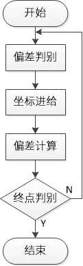

1. 偏差判别：判断当前加工点和理论加工图形之间的相对位置，决定下一步X、Y轴的运动方向；
#. 坐标进给：根据得到的偏差，控制指定坐标轴进给（移动）一步，逼近理论图形，减小误差；
#. 偏差计算：计算新的加工点与理论加工图像间的偏差大小，作为下一步判别的依据；
#. 终点判别：判断是否到达加工终点，如果到达终点则停止插补，如过没有到达终点，则回到第一个步骤，
   不断重复整个过程，直到到达轨迹终点。

逐点比较法可以插补直线和圆弧，并且都存在上述4个步骤，在这一章中我们先来讲解逐点比较法如何实现直线插补，圆弧插补放到下一章。
为了降低复杂度，我们首先讲解在坐标轴第一象限的直线的插补原理。

偏差判别
------------------------
假设现在有一条如下图所示的第一象限直线OE，取O点为坐标原点，直线终点为E点且坐标已知，图中有一动点P为加工点。

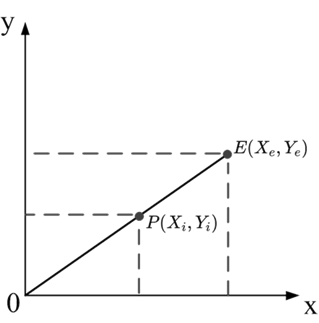

根据上图信息使用直线的两点式方程可得直线OE的方程：

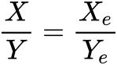

设F\ :sub:`i`\为加工动点P与直线OE间的偏差，将F\ :sub:`i`\和点P坐标代入上式可得：

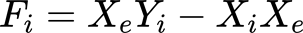

从上面等式中可以分析出，F\ :sub:`i`\的符号能够反映动点P和直线OE的位置偏差情况。

- 若F\ :sub:`i`\ = 0，表示动点P在直线OE内；
- 若F\ :sub:`i`\ > 0，表示动点P在直线OE的上方；
- 若F\ :sub:`i`\ < 0，表示动点P在直线OE的下方。

综上，这个等式便是逐点比较法直线插补的偏差判别方程。

坐标进给
------------------------
逐点比较法的坐标进给有两个原则：一是减小加工动点相对于理论轨迹的位置偏差，二是进给方向总是平行与某个坐标轴。
根据这个原则以及上个步骤偏差判别的信息，可以得出直线插补的坐标进给方法：

- 当F\ :sub:`i`\ = 0时，动点P在直线内，可向+X方向进给一步，也可向+Y方向进给一步，通常规定向+X方向进给；
- 当F\ :sub:`i`\ > 0时，动点P在直线上方，应该向+X方向进给一步；
- 当F\ :sub:`i`\ < 0时，动点P在直线下方，应该向+Y方向进给一步；

开始坐标进给前，刀具总是位于直线轨迹的起点处，此时F\ :sub:`i`\ = 0，整个坐标进给的轨迹效果可以用一张图演示出来，如下图所示。

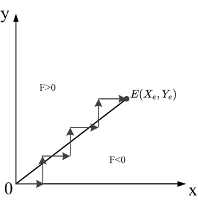

当然，图中只做为直线插补中刀具运动轨迹的演示，实际应用中的运动轨迹并不会像图里这么夸张，进给一步的长度是一个脉冲当量，以保证加工精度。

偏差计算
------------------------
在坐标进给之后得到新的动点坐标值，此时需要计算新的动点和理论轨迹之间的偏差值。从前面的讨论中我们知道了偏差值F\ :sub:`i`\的计算公式，
可以通过公式直接求出F\ :sub:`i`\。虽然现在的各种控制器基本可以轻松的做乘法运算，但是为了追求更高的运行效率，我们把当前的偏差计算公式做一点小小的优化，
将其变为递推公式，即设法找到相邻两个加工动点偏差值间的关系。

假设当F\ :sub:`i`\ > 0时，加工动点向+X方向进给一步，生成一个新的动点P\ :sub:`i+1`\，坐标是(X\ :sub:`i+1`\ , Y\ :sub:`i+1`\)，
则新动点的偏差值F\ :sub:`i+1`\计算公式为：

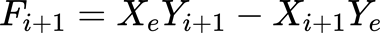

又因为动点P\ :sub:`i+1`\的坐标可由P点表示：

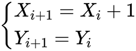

所以将由P点表示的P\ :sub:`i+1`\坐标代入F\ :sub:`i+1`\式中，可得：

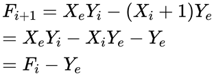

最后得出的这个公式便是逐点比较法的第一象限直线插补偏差计算的递推公式，从式中可以看出，偏差F\ :sub:`i+1`\的计算只跟上一步进给的偏差F\ :sub:`i`\和终点坐标值有关，
且只有加法运算，比原始公式更简单快速。

同理可得，当F\ :sub:`i`\ < 0，加工动点向+Y方向进给一步后的新偏差值递推公式：

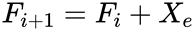

终点判别
------------------------
常用的终点判别方法有三种，终点坐标法、投影法和总步长法。

- 终点坐标法。在启动插补之前，先定义X、Y两个方向的步长计数器，分别记录终点坐标在X、Y两个方向上的值。开始插补后当X、Y方向每进给一步，
  就在相应的计数器中减1，直到两个计数器的值都减为0时，刀具抵达终点，停止插补。

- 投影法。在插补前，先比较出终点坐标的X、Y值中较大的一个，然后以较大的数值作为计数器的值，当对应的轴有进给时，计数器减1，直到计数器为0。
  相当于终点坐标向值较大的轴做投影，所以叫投影法。

- 总步长法，即插补前，将终点坐标的X、Y值求和，得到一个总步长计数器，开始插补后，无论哪个轴进给一步，总步长计数器都减1，直到计数器等于0，停止插补。

以上三种终点判别的方法，全部使用坐标的绝对值进行计算。

第一象限直线插补实验
~~~~~~~~~~~~~~~~~~~~~~~~~~
上一节讲解了逐点比较法的第一象限直线插补原理，接下来结合实验程序讲解具体实现。本实验讲解如何实现第一象限直线插补。学习本节内容时，
请打开配套的“stepper—第一象限直线插补-逐点比较法”工程配合阅读。

硬件设计
------------------------
本实验用到的步进电机与之前的步进电机例程相同，所以硬件连接上也基本相同，不同的是使用了2个步进电机，分别接入开发板的步进电机接口1、接口2中，
如下图所示。接口1的步进电机对应X轴，接口2的步进电机对应Y轴。

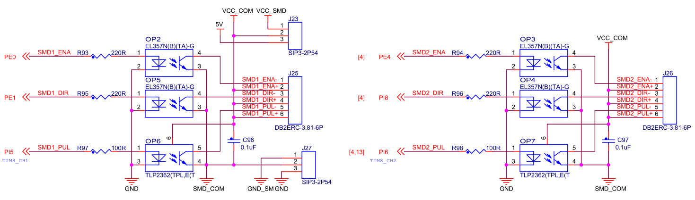

软件设计
------------------------
本次第一象限直线插补例程是在步进电机按键控制例程的基础上编写的，这里只讲解跟直线插补有关的部分核心代码，有些变量的设置，头文件的包含等并没有涉及到，
完整的代码请参考本章配套工程“stepper—第一象限直线插补-逐点比较法”。
我们创建了两个文件：bsp_linear_interpolation.c 和 bsp_linear_interpolation.h 文件用来存放直线插补程序及相关变量定义。

编程要点
^^^^^^^^^^^^^^^^^^^^^^^^
1. 步进电机定时器 IO 配置
#. 步进电机定时器时基、中断配置
#. 在定时器中完成直线插补的4个步骤
#. 通过对直线参数的设置实现直线插补

软件分析
^^^^^^^^^^^^^^^^^^^^^^^^
(1) 宏定义

.. code-block:: c
   :caption: bsp_stepper_init.h-宏定义
   :linenos:

    /*宏定义*/
    /*******************************************************/
    #define MOTOR_PUL_TIM                        TIM8
    #define MOTOR_PUL_IRQn                       TIM8_UP_TIM13_IRQn
    #define MOTOR_PUL_IRQHandler                 TIM8_UP_TIM13_IRQHandler
    #define MOTOR_PUL_CLK_ENABLE()               __TIM8_CLK_ENABLE()
    #define MOTOR_PUL_GPIO_AF                    GPIO_AF3_TIM8

    /*********************X轴电机引脚定义*******************/
    //Motor 方向
    #define X_MOTOR_DIR_PIN                      GPIO_PIN_1
    #define X_MOTOR_DIR_GPIO_PORT                GPIOE
    #define X_MOTOR_DIR_GPIO_CLK_ENABLE()        __HAL_RCC_GPIOE_CLK_ENABLE()

    //Motor 使能
    #define X_MOTOR_EN_PIN                       GPIO_PIN_0
    #define X_MOTOR_EN_GPIO_PORT                 GPIOE
    #define X_MOTOR_EN_GPIO_CLK_ENABLE()         __HAL_RCC_GPIOE_CLK_ENABLE()

    //Motor 脉冲
    #define X_MOTOR_PUL_PORT                     GPIOI
    #define X_MOTOR_PUL_PIN                      GPIO_PIN_5
    #define X_MOTOR_PUL_GPIO_CLK_ENABLE()        __HAL_RCC_GPIOI_CLK_ENABLE()

    //定时器通道
    #define X_MOTOR_PUL_CHANNEL                  TIM_CHANNEL_1

    /*********************Y轴电机引脚定义*******************/
    //Motor 方向
    #define Y_MOTOR_DIR_PIN                      GPIO_PIN_8
    #define Y_MOTOR_DIR_GPIO_PORT                GPIOI          
    #define Y_MOTOR_DIR_GPIO_CLK_ENABLE()        __HAL_RCC_GPIOI_CLK_ENABLE()

    //Motor 使能
    #define Y_MOTOR_EN_PIN                       GPIO_PIN_4
    #define Y_MOTOR_EN_GPIO_PORT                 GPIOE                       
    #define Y_MOTOR_EN_GPIO_CLK_ENABLE()      	 __HAL_RCC_GPIOE_CLK_ENABLE()

    //Motor 脉冲
    #define Y_MOTOR_PUL_PORT       			         GPIOI
    #define Y_MOTOR_PUL_PIN             		     GPIO_PIN_6
    #define Y_MOTOR_PUL_GPIO_CLK_ENABLE()        __HAL_RCC_GPIOI_CLK_ENABLE()

    //定时器通道
    #define Y_MOTOR_PUL_CHANNEL                  TIM_CHANNEL_2

由于直线插补需要两个步进电机才能完成，所以在bsp_stepper_init.h中新增第二个步进电机的相关IO口和外设的宏定义。
宏定义的具体内容与其他步进电机控制例程一致，故不再赘述。

(2) 步进电机初始化

.. code-block:: c
   :caption: bsp_stepper_init.h-结构体
   :linenos:

    /* 步进电机结构体 */
    typedef struct{
      uint16_t pul_pin;        //脉冲引脚
      uint16_t dir_pin;        //方向引脚
      uint16_t en_pin;         //使能引脚
      uint32_t pul_channel;    //输出脉冲的定时器通道
      GPIO_TypeDef *pul_port;  //脉冲引脚端口结构体
      GPIO_TypeDef *dir_port;  //方向引脚端口结构体
      GPIO_TypeDef *en_port;   //使能引脚端口结构体
    }Stepper_TypeDef;
  
    /* 步进电机结构体数组  bsp_stepper_init.c */
    Stepper_TypeDef step_motor[2] = 
    {
      {X_MOTOR_PUL_PIN, X_MOTOR_DIR_PIN, X_MOTOR_EN_PIN, X_MOTOR_PUL_CHANNEL, X_MOTOR_PUL_PORT, X_MOTOR_DIR_GPIO_PORT, X_MOTOR_EN_GPIO_PORT},
      {Y_MOTOR_PUL_PIN, Y_MOTOR_DIR_PIN, Y_MOTOR_EN_PIN, Y_MOTOR_PUL_CHANNEL, Y_MOTOR_PUL_PORT, Y_MOTOR_DIR_GPIO_PORT, Y_MOTOR_EN_GPIO_PORT},
    };

在bsp_stepper_init.h中定义了一个结构体，内部包括控制步进电机所必须的引脚端口、编号和脉冲输出的定时器通道，
然后在bsp_stepper_init.c中定义了一个Stepper_TypeDef类型的数组，分别管理X、Y轴步进电机。这么做的目的是为了方便后续程序更方便的控制两个步进电机，
如需增加或减少步进电机的数量，直接增加或减少数组元素即可。

.. code-block:: c
   :caption: bsp_stepper_init.c-定时器初始化
   :linenos:

   static void TIM_PWMOUTPUT_Config(void)
    {
      TIM_OC_InitTypeDef  TIM_OCInitStructure;

      /* 获取数组元素个数 */
      uint8_t member_count = sizeof(step_motor)/sizeof(Stepper_TypeDef);
      
      /*使能定时器*/
      MOTOR_PUL_CLK_ENABLE();
      
      TIM_StepperHandle.Instance = MOTOR_PUL_TIM;    
      /* 累计 TIM_Period个后产生一个更新或者中断*/    
      //当定时器从0计数到TIM_PERIOD，即为TIM_PERIOD次，为一个定时周期
      TIM_StepperHandle.Init.Period = TIM_PERIOD;
      // 通用控制定时器时钟源TIMxCLK = HCLK = 168MHz 
      // 设定定时器频率为=TIMxCLK/(TIM_Prescaler+1)=28MHz
      TIM_StepperHandle.Init.Prescaler = TIM_PRESCALER-1;

      /*计数方式*/
      TIM_StepperHandle.Init.CounterMode = TIM_COUNTERMODE_UP;            
      /*采样时钟分频*/  
      TIM_StepperHandle.Init.ClockDivision=TIM_CLOCKDIVISION_DIV1;   
      TIM_StepperHandle.Init.RepetitionCounter = 0;
      /*初始化定时器为输出比较模式*/
      HAL_TIM_Base_Init(&TIM_StepperHandle);

      /*PWM模式配置--这里配置为PWM模式2*/
      TIM_OCInitStructure.OCMode = TIM_OCMODE_PWM2;
      /*比较输出的计数值*/
      TIM_OCInitStructure.Pulse = TIM_PERIOD;
      /*当定时器计数值小于CCR1_Val时为高电平*/
      TIM_OCInitStructure.OCPolarity = TIM_OCPOLARITY_HIGH;
      /*设置互补通道输出的极性*/
      TIM_OCInitStructure.OCNPolarity = TIM_OCNPOLARITY_HIGH; 
      /*快速模式设置*/
      TIM_OCInitStructure.OCFastMode = TIM_OCFAST_DISABLE;
      /*空闲电平*/
      TIM_OCInitStructure.OCIdleState = TIM_OCIDLESTATE_RESET;  
      /*互补通道设置*/
      TIM_OCInitStructure.OCNIdleState = TIM_OCNIDLESTATE_RESET;

      for(uint8_t i = 0; i < member_count; i++)
      {
        /* 配置输出比较通道 */
        HAL_TIM_OC_ConfigChannel(&TIM_StepperHandle, &TIM_OCInitStructure, step_motor[i].pul_channel);
        TIM_CCxChannelCmd(MOTOR_PUL_TIM, step_motor[i].pul_channel, TIM_CCx_DISABLE);
      }
    }

接下来比较重要的是控制步进电机的定时器初始化，在之前的例程中，我们都是使用高级定时器输出比较的电平翻转模式，而在上述代码中我们则改成了上述代码中使用的PMW模式2，
由于直线插补主要是在定时器中断中完成，使用电平翻转模式完成一个脉冲输出需要进入两次中断，两个步进电机就需要4次中断才能完成一次脉冲输出，
对于高速应用来说MCU的开销较大，并且可能影响最终的刀具进给速度。而PWM模式2可以配置为一次脉冲输出只触发一次中断，两个步进电机只需两次。
步进电机的速度只跟脉冲频率有关，为了减小开销，本例程包括之后的所有插补例程，均使用PMW模式2驱动步进电机。

上述代码中，分别使用TIM8的通道1和通道2控制X、Y两轴步进电机，使用一个for循环配置所有用到的通道，初始化定时器配置好输出通道之后并没有立刻启动定时器输出，
因为还没有开始插补。

(3) 第一象限直线插补相关参数

.. code-block:: c
   :caption: bsp_linear_interpolation.h-直线插补变量定义
   :linenos:

    /* 坐标轴枚举 */
    typedef enum{
      x_axis = 0U,
      y_axis
    }Axis_TypeDef;

    /* 直线插补参数结构体 */
    typedef struct{
      __IO uint32_t endpoint_x;           //终点坐标X
      __IO uint32_t endpoint_y;           //终点坐标Y
      __IO uint32_t endpoint_pulse;       //到达终点位置需要的脉冲数
      __IO uint32_t active_axis;          //当前运动的轴
      __IO int32_t deviation;             //偏差参数
    }LinearInterpolation_TypeDef;

上述代码中分别定义了一个枚举型和结构体，用于管理第一象限直线插补的相关数据参数。LinearInterpolation_TypeDef结构体的成员中，
endpoint_x和endpoint_y用于记录直线插补的终点坐标，endpoint_pulse记录运动到终点需要多少脉冲，active_axis记录当前活动的轴，
也就是当前进给的轴，deviation就是上面讲到的F\ :sub:`i`\，用来记录和计算偏差值。

(4) 第一象限直线插补运动

.. code-block:: c
   :caption: bsp_linear_interpolation.c-直线插补运动
   :linenos:

    /**
      * @brief  直线增量插补运动
      * @param  inc_x：终点坐标X的增量
      * @param  inc_y：终点坐标Y的增量
      * @param  speed：进给速度
      * @retval 无
      */
    void InterPolation_Move(uint32_t inc_x, uint32_t inc_y, uint16_t speed)
    {
      /* 偏差清零 */
      interpolation_para.deviation = 0;
      
      /* 设置终点坐标 */
      interpolation_para.endpoint_x = inc_x;
      interpolation_para.endpoint_y = inc_y;
      /* 所需脉冲数为X、Y坐标增量之和 */
      interpolation_para.endpoint_pulse = inc_x + inc_y;
      
      /* 第一步进给的活动轴为X轴 */
      interpolation_para.active_axis = x_axis;
      /* 计算偏差 */
      interpolation_para.deviation -= interpolation_para.endpoint_y;
      
      /* 设置速度 */
      __HAL_TIM_SET_COMPARE(&TIM_StepperHandle, step_motor[x_axis].pul_channel, speed);
      __HAL_TIM_SET_COMPARE(&TIM_StepperHandle, step_motor[y_axis].pul_channel, speed);
      __HAL_TIM_SET_AUTORELOAD(&TIM_StepperHandle, speed * 2);
      
      /* 使能主输出 */
      __HAL_TIM_MOE_ENABLE(&TIM_StepperHandle);
      /* 开启X轴比较通道输出 */
      TIM_CCxChannelCmd(MOTOR_PUL_TIM, step_motor[interpolation_para.active_axis].pul_channel, TIM_CCx_ENABLE);
      HAL_TIM_Base_Start_IT(&TIM_StepperHandle);
    }

上述代码启动第一象限直线插补，首先将偏差F\ :sub:`i`\清零，设置终点坐标值，为什么没有起点坐标呢？因为逐点比较法属于脉冲增量插补算法，
参数坐标都是增量形式的相对坐标，也就是说默认直线的起点在坐标系原点(0,0)上，或以上一条直线的终点为新的起点。
把完成插补所需的脉冲数记录为终点的X、Y坐标值之和，用于插补终点的判断，这里使用的是总步长法。

由于是刚开始插补，此时加工点必定在预计的直线上，根据之前所讲内容，加工点在直线上时向X方向进给一步，也就是在上述代码中把进给的轴设置为X轴，
同时利用F\ :sub:`i`\的偏差公式，计算出进给之后的新偏差值。计算出偏差值后，设置两轴的进给速度，实际为定时器的PWM输出频率，
使能主输出后开启X轴的输出通道和定时器中断，开始处理后续数据和发送脉冲。

.. code-block:: c
   :caption: bsp_linear_interpolation.c-定时器中断函数
   :linenos:

    /**
      * @brief  定时器比较中断回调函数
      * @param  htim：定时器句柄指针
      * @note   无
      * @retval 无
      */
    void HAL_TIM_PeriodElapsedCallback(TIM_HandleTypeDef *htim)
    {
      uint32_t last_axis = 0;
      
      /* 记录上一步的进给活动轴 */
      last_axis = interpolation_para.active_axis;
      
      /* 根据上一步的偏差，判断的进给方向，并计算下一步的偏差 */
      if(interpolation_para.deviation >= 0)
      {
        /* 偏差>0，在直线上方，进给X轴，计算偏差 */
        interpolation_para.active_axis = x_axis;
        interpolation_para.deviation -= interpolation_para.endpoint_y;
      }
      else
      {
        /* 偏差<0，在直线下方，进给Y轴，计算偏差 */
        interpolation_para.active_axis = y_axis;
        interpolation_para.deviation += interpolation_para.endpoint_x;
      }
      
      /* 下一步的活动轴与上一步的不一致时，需要换轴 */
      if(last_axis != interpolation_para.active_axis)
      {
        TIM_CCxChannelCmd(htim->Instance, step_motor[last_axis].pul_channel, TIM_CCx_DISABLE);
        TIM_CCxChannelCmd(htim->Instance, step_motor[interpolation_para.active_axis].pul_channel, TIM_CCx_ENABLE);
      }
      
      /* 进给总步数减1 */
      interpolation_para.endpoint_pulse--;

      /* 判断是否完成插补 */
      if(interpolation_para.endpoint_pulse == 0)
      {
        /* 关闭定时器 */
        TIM_CCxChannelCmd(htim->Instance, step_motor[last_axis].pul_channel, TIM_CCx_DISABLE);
        TIM_CCxChannelCmd(htim->Instance, step_motor[interpolation_para.active_axis].pul_channel, TIM_CCx_DISABLE);
        __HAL_TIM_MOE_DISABLE(htim);
        HAL_TIM_Base_Stop_IT(htim);
      }
    }

开启定时器中断后，后续的处理都直接放到中断回调函数中进行。

- 第12行：记录上一次进给的轴；
- 第15~26行：判断上一次的偏差值F\ :sub:`i`\的大小，如F\ :sub:`i`\ > 0，说明加工动点在直线上方，需要进给X轴，F\ :sub:`i`\ < 0，说明加工动点在直线下方，需要进给Y轴。
  同时，根据进给的方向计算出新的偏差值；
- 第29~33行：比较上一步进给的轴和下一步进给的轴是否一致，如果不一致，需要切换PWM输出的通道；
- 第36行：完成一次插补，总的进给步数就减一，这里使用了总步长法进行终点判别；
- 第39~46行：如果总的进给步数为0，则表示插补走到终点，关闭定时器结束插补。

整个第一象限直线插补算法的核心内容就在这个定时器中断回调函数中实现了，算法全部的4个步骤都在其中有所体现。
用一张程序流程图来展示第一象限直线插补算法的核心内容，就如下图所示。

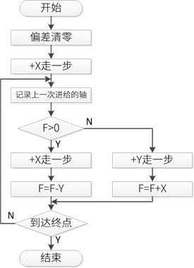

(5) main函数

.. code-block:: c
   :caption: main.c-main函数
   :linenos:

    /**
      * @brief  主函数
      * @param  无
      * @retval 无
      */
    int main(void) 
    {
      HAL_InitTick(0);
      /* 初始化系统时钟为168MHz */
      SystemClock_Config();
      /*初始化USART 配置模式为 115200 8-N-1，中断接收*/
      DEBUG_USART_Config();
      printf("欢迎使用野火 电机开发板 步进电机 第一象限直线插补 例程\r\n");
      /* LED初始化 */
      LED_GPIO_Config();
      /* 按键初始化 */
      Key_GPIO_Config();
      /*步进电机初始化*/
      stepper_Init();
      
      while(1)
      {
        if(Key_Scan(KEY1_GPIO_PORT, KEY1_PIN) == KEY_ON)
        {
          InterPolation_Move(6400, 4560, 1500);
        }
        if(Key_Scan(KEY2_GPIO_PORT, KEY2_PIN) == KEY_ON)
        {
          InterPolation_Move(6400 * 6, 6400 * 6, 1500);
        }
        if(Key_Scan(KEY3_GPIO_PORT, KEY3_PIN) == KEY_ON)
        {
          InterPolation_Move(12200, 45060, 1500);
        }
        if(Key_Scan(KEY4_GPIO_PORT, KEY4_PIN) == KEY_ON)
        {
          InterPolation_Move(5466, 89080, 1500);
        }
        if(Key_Scan(KEY5_GPIO_PORT, KEY5_PIN) == KEY_ON)
        {
          InterPolation_Move(39879, 44542, 1500);
        }
      }
    } 

main函数中主要就是一些外设的初始化，包括步进电机的定时器初始化。然后在while循环中轮询按键，通过按键控制步进电机做不同终点坐标的直线插补。
需要注意的是，由于直线插补进给一次是一个步进脉冲，所以最后插补出来的直线长度跟步进电机的细分直接相关，在本实验中默认步进电机32细分，
在main函数中输入的终点坐标参数中也对应步进电机的32细分。

实验现象
------------------------
使用两轴丝杆滑台组成一个标准X-Y滑动平台，将步进电机连接好，下载程序到开发板后，按下开发板的按键，可以看到丝杆滑台上的滑块沿着程序设定的直线轨迹运动。

任意象限直线插补
~~~~~~~~~~~~~~~~~~~~~~~~~~
在前面的内容中，我们详细讲解了第一象限直线插补的原理和实现，不过实际应用中并不只有第一象限的直线，任意象限和方向的直线都可能会遇到，
所以下面的内容将会讲解如果实现任意象限的直线插补。

任意象限直线插补原理
------------------------
假设有一条起点坐标为原点，终点坐标为E\ :sup:`'`\的直线OE\ :sup:`'`\位于第二象限，如下图所示。
图中直线OE\ :sup:`'`\和直线OE关于Y轴对称。对OE进行直线插补的时候，如果把原本沿+X方向的进给变成沿-X方向，
也就是步进电机运动方向相反。那么实际插补出的就是第二象限的直线OE\ :sup:`'`\。

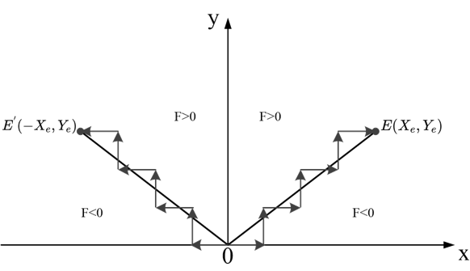

同理，如果是插补第三象限的直线，由于其和第一象限直线OE关于原点对称，所以依旧可以按照第一象限直线OE插补，唯一不同的只是进给方向。

综上可得，任意象限直线插补的方法都可用第一象限直线插补推出，偏差计算公式都相同，偏差值的计算使用坐标的绝对值。
设L1、L2、L3、L4分别表示第1、2、3、4象限的直线，则任意象限直线插补的X、Y轴进给方向如下图所示。

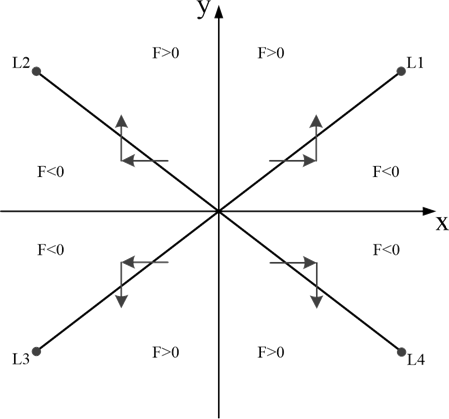

在上图中，靠近Y轴区域偏差F>0，靠近X轴区域偏差F<0。当F≥0时，进给都是沿X轴，动点坐标的X轴绝对值增大；
当F<0时，进给都沿Y轴，动点坐标的Y轴绝对值增大。把以上内容整理成表格，如下表所示。

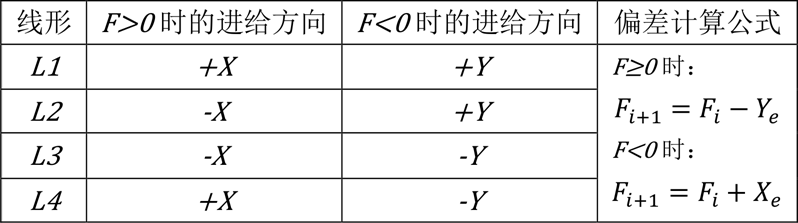

至此，任意象限直线插补的原理已经讲解完毕，接下来开始讲解在程序中如何实现。

任意象限直线插补实验
------------------------
本实验讲解如何实现任意象限的直线插补。学习本节内容时，请打开配套的“stepper—任意象限直线插补-逐点比较法”工程配合阅读。

硬件设计
^^^^^^^^^^^^^^^^^^^^^^^^
本实验的硬件设计部分与上一个实验完全相同，在此不再赘述。如有不清楚的地方，请查看第一象限直线插补实验。

软件设计
^^^^^^^^^^^^^^^^^^^^^^^^
1. 步进电机定时器 IO 配置
#. 步进电机定时器时基、中断配置
#. 在定时器中完成直线插补的4个步骤
#. 通过直线坐标判断直线的方向
#. 实现任意直线插补

软件分析
"""""""""""""""""""""""
(1) 宏定义

.. code-block:: c
   :caption: bsp_stepper_init.h-宏定义
   :linenos:

    /*宏定义*/
    /*******************************************************/
    #define MOTOR_PUL_TIM                        TIM8
    #define MOTOR_PUL_IRQn                       TIM8_UP_TIM13_IRQn
    #define MOTOR_PUL_IRQHandler                 TIM8_UP_TIM13_IRQHandler
    #define MOTOR_PUL_CLK_ENABLE()               __TIM8_CLK_ENABLE()
    #define MOTOR_PUL_GPIO_AF                    GPIO_AF3_TIM8

    /*********************X轴电机引脚定义*******************/
    //Motor 方向
    #define X_MOTOR_DIR_PIN                      GPIO_PIN_1
    #define X_MOTOR_DIR_GPIO_PORT                GPIOE
    #define X_MOTOR_DIR_GPIO_CLK_ENABLE()        __HAL_RCC_GPIOE_CLK_ENABLE()

    //Motor 使能
    #define X_MOTOR_EN_PIN                       GPIO_PIN_0
    #define X_MOTOR_EN_GPIO_PORT                 GPIOE
    #define X_MOTOR_EN_GPIO_CLK_ENABLE()         __HAL_RCC_GPIOE_CLK_ENABLE()

    //Motor 脉冲
    #define X_MOTOR_PUL_PORT                     GPIOI
    #define X_MOTOR_PUL_PIN                      GPIO_PIN_5
    #define X_MOTOR_PUL_GPIO_CLK_ENABLE()        __HAL_RCC_GPIOI_CLK_ENABLE()

    //定时器通道
    #define X_MOTOR_PUL_CHANNEL                  TIM_CHANNEL_1

    /*********************Y轴电机引脚定义*******************/
    //Motor 方向
    #define Y_MOTOR_DIR_PIN                      GPIO_PIN_8
    #define Y_MOTOR_DIR_GPIO_PORT                GPIOI          
    #define Y_MOTOR_DIR_GPIO_CLK_ENABLE()        __HAL_RCC_GPIOI_CLK_ENABLE()

    //Motor 使能
    #define Y_MOTOR_EN_PIN                       GPIO_PIN_4
    #define Y_MOTOR_EN_GPIO_PORT                 GPIOE                       
    #define Y_MOTOR_EN_GPIO_CLK_ENABLE()         __HAL_RCC_GPIOE_CLK_ENABLE()

    //Motor 脉冲
    #define Y_MOTOR_PUL_PORT                     GPIOI
    #define Y_MOTOR_PUL_PIN                      GPIO_PIN_6
    #define Y_MOTOR_PUL_GPIO_CLK_ENABLE()        __HAL_RCC_GPIOI_CLK_ENABLE()

    //定时器通道
    #define Y_MOTOR_PUL_CHANNEL                  TIM_CHANNEL_2

由于直线插补需要两个步进电机才能完成，所以在bsp_stepper_init.h中新增第二个步进电机的相关IO口和外设的宏定义。
宏定义的具体内容与其他步进电机控制例程一致，故不再赘述。

本实验中的步进电机相关初始化与上一实验完全相同，不再赘述。重点详解任意象限的插补实现。

(2) 任意象限直线插补相关参数

.. code-block:: c
   :caption: bsp_linear_interpolation.h-任意象限直线插补参数
   :linenos:

    /* 坐标轴枚举 */
    typedef enum{
      x_axis = 0U,
      y_axis
    }Axis_TypeDef;

    /* 直线插补参数结构体 */
    typedef struct{
      __IO uint32_t endpoint_x;           //终点坐标X
      __IO uint32_t endpoint_y;           //终点坐标Y
      __IO uint32_t endpoint_pulse;       //到达终点位置需要的脉冲数
      __IO uint32_t active_axis;          //当前运动的轴
      __IO int32_t deviation;             //偏差参数
      __IO uint8_t motionstatus : 1;      //插补运动状态
      __IO uint8_t dir_x : 1;             //X轴运动方向
      __IO uint8_t dir_y : 1;             //Y轴运动方向
    }LinearInterpolation_TypeDef;

上述代码是任意象限直线插补的相关数据参数，同样由一个枚举和一个结构体构成，其中结构体中相比第一象限的插补多了三个成员变量，
分别使用结构体位域定义，用来管理X、Y轴的运动方向和整个插补运动的状态。

(3) 任意象限直线插补实现

.. code-block:: c
   :caption: bsp_linear_interpolation.c-任意象限直线插补实现
   :linenos:

    /**
      * @brief  任意直线插补运动
      * @param  coordi_x：终点坐标X的增量
      * @param  coordi_y：终点坐标Y的增量
      * @param  speed：进给速度，定时器计数值
      * @retval 无
      */
    void Linear_Interpolation(int32_t coordi_x, int32_t coordi_y, uint16_t speed)
    {
      /* 判断当前是否正在做插补运动 */
      if(interpolation_para.motionstatus != 0)
        return;
      
      /* 判断坐标正负，以此决定各轴的运动方向 */
      if(coordi_x < 0)
      {
        interpolation_para.dir_x = CCW;
        coordi_x = -coordi_x;
        MOTOR_DIR(step_motor[x_axis].dir_port, step_motor[x_axis].dir_pin, CCW);
      }
      else
      {
        interpolation_para.dir_x = CW;
        MOTOR_DIR(step_motor[x_axis].dir_port, step_motor[x_axis].dir_pin, CW);
      }
      
      if(coordi_y < 0)
      {
        interpolation_para.dir_y = CCW;
        coordi_y = -coordi_y;
        MOTOR_DIR(step_motor[y_axis].dir_port, step_motor[y_axis].dir_pin, CCW);
      }
      else
      {
        interpolation_para.dir_y = CW;
        MOTOR_DIR(step_motor[y_axis].dir_port, step_motor[y_axis].dir_pin, CW);
      }
      
      /* 开始插补运动 */
      InterPolation_Move(coordi_x, coordi_y, speed);
    }

上述代码是实现任意象限直线插补的关键，Linear_Interpolation函数的入口参数是直线终点坐标值和进给速度。

- 第15~25行：判断终点坐标的X值是否大于0，如果X<0，X轴步进电机反转，如果X>0，X轴步进电机正转，同时计算出坐标绝对值;
- 第27~27行：判断终点坐标的Y值是否大于0，如果Y<0，Y轴步进电机反转，如果Y>0，Y轴步进电机正转，同时计算出坐标绝对值;
- 第40行：设置完X、Y轴步进电机的运动方向之后，根据计算出的坐标绝对值开始执行插补运动。

.. code-block:: c
   :caption: bsp_linear_interpolation.c-直线插补运动
   :linenos:

    /**
      * @brief  直线增量插补运动
      * @param  inc_x：终点坐标X的增量
      * @param  inc_y：终点坐标Y的增量
      * @param  speed：进给速度
      * @retval 无
      */
    void InterPolation_Move(uint32_t inc_x, uint32_t inc_y, uint16_t speed)
    {
      /* 偏差清零 */
      interpolation_para.deviation = 0;
      
      /* 设置终点坐标 */
      interpolation_para.endpoint_x = inc_x;
      interpolation_para.endpoint_y = inc_y;
      /* 所需脉冲数为X、Y坐标增量之和 */
      interpolation_para.endpoint_pulse = inc_x + inc_y;
      
      /* 第一步进给的活动轴为X轴 */
      interpolation_para.active_axis = x_axis;
      /* 计算偏差 */
      interpolation_para.deviation -= interpolation_para.endpoint_y;
      
      /* 设置速度 */
      __HAL_TIM_SET_COMPARE(&TIM_StepperHandle, step_motor[x_axis].pul_channel, speed);
      __HAL_TIM_SET_COMPARE(&TIM_StepperHandle, step_motor[y_axis].pul_channel, speed);
      __HAL_TIM_SET_AUTORELOAD(&TIM_StepperHandle, speed * 2);
      
      /* 使能主输出 */
      __HAL_TIM_MOE_ENABLE(&TIM_StepperHandle);
      /* 开启X轴比较通道输出 */
      TIM_CCxChannelCmd(MOTOR_PUL_TIM, step_motor[interpolation_para.active_axis].pul_channel, TIM_CCx_ENABLE);
      HAL_TIM_Base_Start_IT(&TIM_StepperHandle);
    }

.. code-block:: c
   :caption: bsp_linear_interpolation.c-定时器中断函数
   :linenos:

    /**
      * @brief  定时器比较中断回调函数
      * @param  htim：定时器句柄指针
      * @note   无
      * @retval 无
      */
    void HAL_TIM_PeriodElapsedCallback(TIM_HandleTypeDef *htim)
    {
      uint32_t last_axis = 0;
      
      /* 记录上一步的进给活动轴 */
      last_axis = interpolation_para.active_axis;
      
      /* 根据上一步的偏差，判断的进给方向，并计算下一步的偏差 */
      if(interpolation_para.deviation >= 0)
      {
        /* 偏差>0，在直线上方，进给X轴，计算偏差 */
        interpolation_para.active_axis = x_axis;
        interpolation_para.deviation -= interpolation_para.endpoint_y;
      }
      else
      {
        /* 偏差<0，在直线下方，进给Y轴，计算偏差 */
        interpolation_para.active_axis = y_axis;
        interpolation_para.deviation += interpolation_para.endpoint_x;
      }
      
      /* 下一步的活动轴与上一步的不一致时，需要换轴 */
      if(last_axis != interpolation_para.active_axis)
      {
        TIM_CCxChannelCmd(htim->Instance, step_motor[last_axis].pul_channel, TIM_CCx_DISABLE);
        TIM_CCxChannelCmd(htim->Instance, step_motor[interpolation_para.active_axis].pul_channel, TIM_CCx_ENABLE);
      }
      
      /* 进给总步数减1 */
      interpolation_para.endpoint_pulse--;

      /* 判断是否完成插补 */
      if(interpolation_para.endpoint_pulse == 0)
      {
        /* 关闭定时器 */
        TIM_CCxChannelCmd(htim->Instance, step_motor[last_axis].pul_channel, TIM_CCx_DISABLE);
        TIM_CCxChannelCmd(htim->Instance, step_motor[interpolation_para.active_axis].pul_channel, TIM_CCx_DISABLE);
        __HAL_TIM_MOE_DISABLE(htim);
        HAL_TIM_Base_Stop_IT(htim);
      }
    }

可以看到，上述代码与第一象限直线插补实验完全相同，这是因为直线所在象限的判断和进给方向的处理已经在Linear_Interpolation函数中完成，
剩下的直接按照第一象限直线进行插补即可。

(4) main函数

.. code-block:: c
   :caption: main.c-main函数
   :linenos:

    /**
      * @brief  主函数
      * @param  无
      * @retval 无
      */
    int main(void) 
    {
      HAL_InitTick(0);
      /* 初始化系统时钟为168MHz */
      SystemClock_Config();
      /*初始化USART 配置模式为 115200 8-N-1，中断接收*/
      DEBUG_USART_Config();
      printf("欢迎使用野火 电机开发板 步进电机 任意直线插补 例程\r\n");
      /* LED初始化 */
      LED_GPIO_Config();
      /* 按键初始化 */
      Key_GPIO_Config();
      /*步进电机初始化*/
      stepper_Init();
      
      Linear_Interpolation(6400, 6400, 500);
      
      while(1)
      {
        if(Key_Scan(KEY1_GPIO_PORT, KEY1_PIN) == KEY_ON)
        {
          Linear_Interpolation(6400, 4560, 1000);
        }
        if(Key_Scan(KEY2_GPIO_PORT, KEY2_PIN) == KEY_ON)
        {
          Linear_Interpolation(6400 * 6, 6400 * 6, 1000);
        }
        if(Key_Scan(KEY3_GPIO_PORT, KEY3_PIN) == KEY_ON)
        {
          Linear_Interpolation(12200, -45060, 1000);
        }
        if(Key_Scan(KEY4_GPIO_PORT, KEY4_PIN) == KEY_ON)
        {
          Linear_Interpolation(-65466, -89080, 1000);
        }
        if(Key_Scan(KEY5_GPIO_PORT, KEY5_PIN) == KEY_ON)
        {
          Linear_Interpolation(-39879, 44542, 1000);
        }
      }
    }

main函数中主要就是一些外设的初始化，包括步进电机的定时器初始化。然后在while循环中轮询按键，通过按键控制步进电机做不同象限的直线插补。
需要注意的是，由于直线插补进给一次是一个步进脉冲，所以最后插补出来的直线长度跟步进电机的细分直接相关，在本实验中默认步进电机32细分，
在main函数中输入的终点坐标参数中也对应步进电机的32细分。

实验现象
^^^^^^^^^^^^^^^^^^^^^^^^
使用两轴丝杆滑台组成一个标准X-Y滑动平台，将步进电机连接好，下载程序到开发板后，按下开发板的按键，可以看到丝杆滑台上的滑块沿着程序设定的直线轨迹运动。
