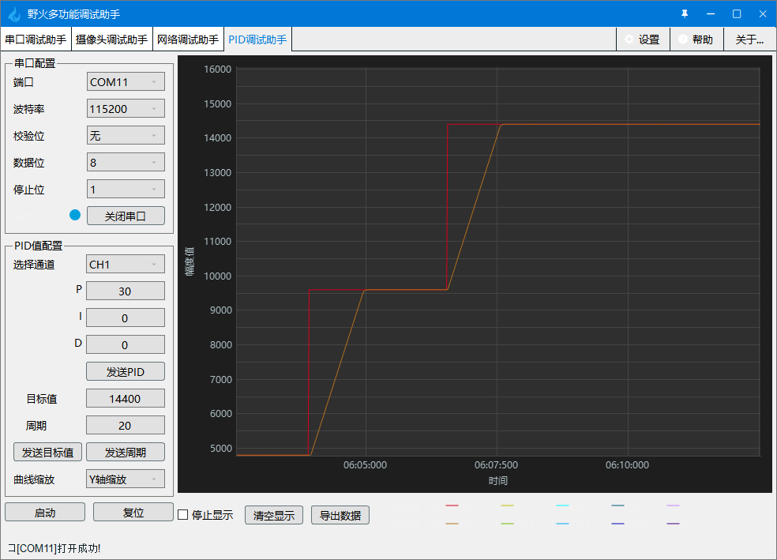
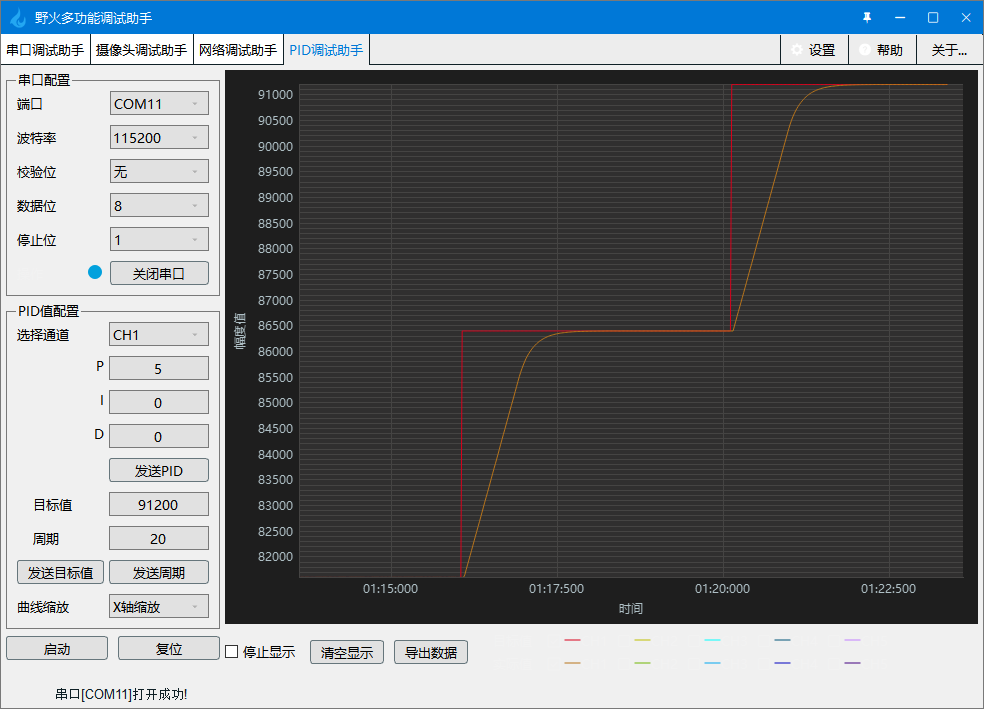

.. vim: syntax=rst

步进电机位置环控制实现
============================

关于步进电机闭环控制的原理在上一章 **步进电机速度环控制实现** 已经详细说明，
我们也在上一章中学习了步进电机速度环的控制方法，接下来，我们继续学习步进电机位置环的控制方法。
在本章中，控制方法的实现与上一章基本相同，最大的区别就是将速度量的控制变为了位置量。

本章通过我们前面学习的位置式PID和增量式PID两种控制方式分别来实现步进电机位置环的控制，
如果还不知道什么是位置式PID和增量式PID，请务必先学习前面PID算法的通俗解说这一章节。

硬件设计
---------

本实验的硬件设计与编码器的使用章节中的硬件设计完全相同，在此不再赘述。

步进电机位置闭环控制--增量式PID
-----------------------------------

本实验会结合之前章节的PID控制和步进电机编码器测速，来讲解如何使用增量式PID对步进电机进行位置闭环控制。
学习本小节内容时，请打开配套的“步进电机位置环控制——增量式PID”工程配合阅读。

软件设计
~~~~~~~~~~~

本闭环控制例程是在步进电机编码器测速例程的基础上编写的，这里只讲解核心的部分代码，有些变量的设置，头文件的包含等并没有涉及到，完整的代码请参考本章配套的工程。
我们创建了4个文件：bsp_pid.c和bsp_pid.h文件用来存放PID控制器相关程序，bsp_stepper_ctrl.c、bsp_stepper_ctrl.h 文件用来存步进电机位置环控制程序及相关宏定义。

编程要点
^^^^^^^^^
1. 定时器 IO 配置
#. 步进电机、编码器相关外设初始化
#. 位置闭环控制实现
#. PID参数整定

软件分析
^^^^^^^^^

**宏定义**

.. code-block:: c
   :caption: bsp_stepper_init.h-宏定义
   :linenos:

    /*宏定义*/
    /*******************************************************/
    //宏定义对应开发板的接口 1 、2 、3 、4
    #define CHANNEL_SW 1

    #if(CHANNEL_SW == 1)
    //Motor 方向 
    #define MOTOR_DIR_PIN                  	GPIO_PIN_1   
    #define MOTOR_DIR_GPIO_PORT            	GPIOE                    
    #define MOTOR_DIR_GPIO_CLK_ENABLE()   	__HAL_RCC_GPIOE_CLK_ENABLE()

    //Motor 使能 
    #define MOTOR_EN_PIN                  	GPIO_PIN_0
    #define MOTOR_EN_GPIO_PORT            	GPIOE                       
    #define MOTOR_EN_GPIO_CLK_ENABLE()    	__HAL_RCC_GPIOE_CLK_ENABLE()

    //Motor 脉冲
    #define MOTOR_PUL_IRQn                  TIM8_CC_IRQn
    #define MOTOR_PUL_IRQHandler            TIM8_CC_IRQHandler

    #define MOTOR_PUL_TIM                   TIM8
    #define MOTOR_PUL_CLK_ENABLE()  		    __TIM8_CLK_ENABLE()

    #define MOTOR_PUL_PORT       	     		  GPIOI
    #define MOTOR_PUL_PIN             		  GPIO_PIN_5
    #define MOTOR_PUL_GPIO_CLK_ENABLE()		  __HAL_RCC_GPIOI_CLK_ENABLE()

    #define MOTOR_PUL_GPIO_AF               GPIO_AF3_TIM8
    #define MOTOR_PUL_CHANNEL_x             TIM_CHANNEL_1

    #elif(CHANNEL_SW == 2)
    ... ... 
    #elif(CHANNEL_SW == 3)
    ... ... 
    #elif(CHANNEL_SW == 4)
    ... ... 
    #endif

    /*频率相关参数*/
    //定时器实际时钟频率为：168MHz/TIM_PRESCALER
    //其中 高级定时器的 频率为168MHz,其他定时器为84MHz
    //168/TIM_PRESCALER = 28MHz
    //具体需要的频率可以自己计算
    #define TIM_PRESCALER                6
    // 定义定时器周期，输出比较模式周期设置为0xFFFF
    #define TIM_PERIOD                   0xFFFF

以上是在板子上步进电机的四个接口，（由于篇幅有限，只写了一部分具体开源码）为了方便使用，在这里全都定义完，并且可以使用宏定义 **CHANNEL_SW** 
直接修改数值为1、2、3、4就可以直接修改对应的开发板通道，然后对应接在上面即可。

.. code-block:: c
   :caption: bsp_stepper_ctrl.h-宏定义
   :linenos:

    /*宏定义*/
    /*******************************************************/
    #define T1_FREQ           (SystemCoreClock/TIM_PRESCALER) // 频率ft值

    /*电机单圈参数*/
    #define STEP_ANGLE        1.8f                        //步进电机的步距角 单位：度
    #define FSPR              ((float)(360.0f/STEP_ANGLE))//步进电机的一圈所需脉冲数

    #define MICRO_STEP        32                          //细分器细分数 
    #define SPR               (FSPR*MICRO_STEP)           //细分后一圈所需脉冲数

    #define PULSE_RATIO       ((float)(SPR/ENCODER_TOTAL_RESOLUTION))//步进电机单圈脉冲数与编码器单圈脉冲的比值
    #define TARGET_DISP       2                    //步进电机运动时的目标圈数，单位：转
    #define SPEED_LIMIT       10000                //最大启动速度限制
    #define SAMPLING_PERIOD   50                   //PID采样频率，单位Hz

上面的宏定义是步进电机本身的参数和闭环控制需要用到的参数，包括步进电机的步距角、驱动器细分数和PID控制用到的目标位置等等。
其中宏 **PULSE_RATIO** 是细分后的步进电机单圈脉冲数与编码器单圈脉冲数的比值，
因为在整个位置闭环控制系统中，反馈和PID计算得出的都是编码器的脉冲数。

.. tip:: 如果使用的电机参数不同，直接在头文件中修改相关宏定义即可。

**增量式PID算法实现**

本例程中使用的增量式PID算法，在代码实现方式上与之前介绍PID时的算法有少许区别，具体可以看如下代码。

.. code-block:: c
   :caption: bsp_pid.c-增量式PID算法实现
   :linenos:

    /**
      * @brief  增量式PID算法实现
      * @param  val：当前实际值
      *	@note 	无
      * @retval 通过PID计算后的输出
      */
    float PID_realize(float temp_val) 
    {
      /*传入实际值*/
      pid.actual_val = temp_val;
      /*计算目标值与实际值的误差*/
      pid.err=pid.target_val-pid.actual_val;

      /*PID算法实现*/
      float increment_val = pid.Kp*(pid.err - pid.err_next) + pid.Ki*pid.err + pid.Kd*(pid.err - 2 * pid.err_next + pid.err_last);
      /*传递误差*/
      pid.err_last = pid.err_next;
      pid.err_next = pid.err;
      /*返回增量值*/
      return increment_val;
    }

上述代码中PID控制器的入口参数从原来的目标值更改为了反馈回来的实际值，而目标值在控制器外赋值，控制器的返回值变为PID计算得出的增量值，
实际值的累加则放到了控制器外。整个增量式PID控制器的原理并没有变化，只是调整了部分代码的组织逻辑，这么做可以更方便的在程序的其他位置调用PID控制器。

**步进电机闭环控制**

.. code-block:: c
   :caption: bsp_stepper_ctrl.c-步进电机闭环控制
   :linenos:

    //bsp_stepper_ctrl.h
    typedef struct {
      unsigned char stepper_dir : 1;               //步进电机方向
      unsigned char stepper_running : 1;           //步进电机运行状态
      unsigned char MSD_ENA : 1;                   //驱动器使能状态
    }__SYS_STATUS;

    //bsp_stepper_ctrl.c
    /* 系统状态初始化 */
    __SYS_STATUS sys_status = {0};

    /**
      * @brief  步进电机增量式PID控制
      * @retval 无
      * @note   基本定时器中断内调用
      */
    void Stepper_Speed_Ctrl(void)
    {
      /* 编码器相关变量 */
      static __IO int32_t last_count = 0;
      __IO int32_t capture_count = 0;
      __IO int32_t capture_per_unit = 0;
      /* 经过pid计算后的期望值 */
      static __IO float cont_val = 0.0f;
      
      __IO float timer_delay = 0.0f;
      
      /* 当电机运动时才启动pid计算 */
      if((sys_status.MSD_ENA == 1) && (sys_status.stepper_running == 1))
      {
        /* 计算单个采样时间内的编码器脉冲数 */
        capture_count =__HAL_TIM_GET_COUNTER(&TIM_EncoderHandle) + (encoder_overflow_count * ENCODER_TIM_PERIOD);
        
        /* 单位时间内的编码器脉冲数作为实际值传入pid控制器 */
        cont_val += PID_realize((float)capture_count);// 进行 PID 计算
        
        /* 判断位置方向 */
        cont_val > 0 ? (MOTOR_DIR(CW)) : (MOTOR_DIR(CCW));
        
        /* 计算得出的期望值取绝对值 */
        timer_delay = fabsf(cont_val);
        
        /* 限制最大启动速度 */
        timer_delay >= SPEED_LIMIT ? (timer_delay = SPEED_LIMIT) : timer_delay;
        
        /* 计算比较计数器的值 */
        OC_Pulse_num = ((uint16_t)(T1_FREQ / ((float)timer_delay * PULSE_RATIO))) >> 1;
    
        #if PID_ASSISTANT_EN
        int Temp = capture_count;    // 上位机需要整数参数，转换一下
        set_computer_value(SEED_FACT_CMD, CURVES_CH1, &Temp, 1);  // 给通道 1 发送实际值
        #else
        printf("实际值：%d，目标值：%.0f\r\n", capture_per_unit, pid.target_val);// 打印实际值和目标值 
        #endif
      }
      else
      {
        /*停机状态所有参数清零*/
        last_count = 0;
        cont_val = 0;
        pid.actual_val = 0;
        pid.err = 0;
        pid.err_last = 0;
        pid.err_next = 0;
      }
    }

- 第2~6行：定义了一个结构体 **__SYS_STATUS** ，用来管理驱动器和电机的运行状态；
- 第20~26行：定义了一些用于编码器测速和PID计算的中间变量；
- 第29行：判断驱动器和电机运行状态，如果驱动器使能并且电机处于运动状态，才能执行闭环控制；
- 第32行：读取编码器计数值并计算总脉冲数；
- 第35行：把 **capture_count** 作为实际值传给PID控制器，并把PID运算后的期望增量值累加到变量 **cont_val** ；
- 第38行：判断步进电机旋转的方向；
- 第41行：把计算出的期望值取绝对值便于后续计算，fabsf函数是C库函数，专门用来处理单精度浮点数的绝对值计算；
- 第44行：限制最大启动速度，防止电机因速度过快堵转；
- 第46行：将期望值换算为比较计数器的值赋值给变量 **OC_Pulse_num**；
- 第49~54行：这部分其实跟闭环控制关系不大，主要是用作信息输出，通过一个宏定义判断是否开启上位机通信功能，如果开启宏 **PID_ASSISTANT_EN**，那么就是使用上位机软件进行输出，否则使用串口输出数据；
- 第57~65行：在电机停止或由运行变为停止时，需要清零编码器读数的中间值和PID控制器中的累加数据，以免影响电机再次启动时的控制效果。

还需要注意的是,传入PID的是编码器累计值，PID输出的是编码器的调节值，但是实际被控量是步进电机的转轴位置，需要做转换。

将编码器总位置期望值 **timer_delay** 乘上一个系数 **PULSE_RATIO** 便可得到步进电机所需的脉冲数量，
这个系数是由步进电机经过细分后转轴转一圈所需的脉冲数与编码器转一圈发出的脉冲数之间的比值得出。

得到了步进电机需要的脉冲数量还不够，我们经过处理将位置变化量的控制转换为速度变化量，
就会有 **timer_delay** 越小，**OC_Pulse_num** 越大，单个脉冲频率变小，步进电机速度减小的效果。

**闭环控制周期调用**

.. code-block:: c
   :caption: main.c-定时器更新事件回调函数
   :linenos:

    /**
      * @brief  定时器更新事件回调函数
      * @param  无
      * @retval 无
      */
    void HAL_TIM_PeriodElapsedCallback(TIM_HandleTypeDef *htim)
    {
      /* 判断触发中断的定时器 */
      if(htim->Instance == BASIC_TIM)
      {
        Stepper_Speed_Ctrl();
      }
      else if(htim->Instance == ENCODER_TIM)
      {  
        /* 判断当前计数方向 */
        if(__HAL_TIM_IS_TIM_COUNTING_DOWN(htim))
          /* 下溢 */
          encoder_overflow_count--;
        else
          /* 上溢 */
          encoder_overflow_count++;
      }
    }

这是一个定时器更新事件回调函数。本实验在基本定时器TIM6的定时中断中循环调用闭环控制程序，TIM6配置为20ms中断一次，也就是说闭环控制的采样周期是20ms。

**main函数**

.. code-block:: c
   :caption: main.c-主函数
   :linenos:

    /**
      * @brief  主函数
      * @param  无
      * @retval 无
      */
    int main(void) 
    {
      /* 初始化系统时钟为168MHz */
      SystemClock_Config();
      /*初始化USART 配置模式为 115200 8-N-1，中断接收*/
      DEBUG_USART_Config();
      printf("欢迎使用野火 电机开发板 步进电机 编码器测速 例程\r\n");
      printf("按下按键1启动电机，按下按键2停止电机\r\n");	
      printf("按下按键3增大位置，按下按键4减小位置\r\n");	
      /* 初始化时间戳 */
      HAL_InitTick(5);
      /*按键中断初始化*/
      Key_GPIO_Config();	
      /*led初始化*/
      LED_GPIO_Config();
      /* 初始化基本定时器定时，20ms产生一次中断 */
      TIMx_Configuration();
      /*步进电机初始化*/
      stepper_Init();
      /* 上电默认停止电机 */
      MOTOR_EN(ON);
      MOTOR_DIR(HIGH);
      Set_Stepper_Stop();
      /* 编码器接口初始化 */
      Encoder_Init();
      /* PID算法参数初始化 */
      PID_param_init();	

      /* 目标速度转换为编码器的脉冲数作为pid目标值 */
      pid.target_val = TARGET_DISP * ENCODER_TOTAL_RESOLUTION;
        
    #if PID_ASSISTANT_EN
      int Temp = pid.target_val;    // 上位机需要整数参数，转换一下
      set_computer_value(SEED_STOP_CMD, CURVES_CH1, NULL, 0);    // 同步上位机的启动按钮状态
      set_computer_value(SEED_TARGET_CMD, CURVES_CH1, &Temp, 1);// 给通道 1 发送目标值
    #endif

      while(1)
      {
        /* 扫描KEY1，启动电机 */
        if( Key_Scan(KEY1_GPIO_PORT,KEY1_PIN) == KEY_ON  )
        {
        #if PID_ASSISTANT_EN
          Set_Stepper_Start();
          set_computer_value(SEED_START_CMD, CURVES_CH1, NULL, 0);// 同步上位机的启动按钮状态
        #else
          Set_Stepper_Start();
        #endif
        }
        /* 扫描KEY2，停止电机 */
        if( Key_Scan(KEY2_GPIO_PORT,KEY2_PIN) == KEY_ON  )
        {
        #if PID_ASSISTANT_EN
          Set_Stepper_Stop();
          set_computer_value(SEED_STOP_CMD, CURVES_CH1, NULL, 0);// 同步上位机的启动按钮状态
        #else
          Set_Stepper_Stop();     
        #endif
        }
        /* 扫描KEY3，增大目标位置 */
        if( Key_Scan(KEY3_GPIO_PORT,KEY3_PIN) == KEY_ON  )
        {
          /* 位置增加2圈 */
          pid.target_val += 4800;
          
        #if PID_ASSISTANT_EN
          int temp = pid.target_val;
          set_computer_value(SEED_TARGET_CMD, CURVES_CH1, &temp, 1);// 给通道 1 发送目标值
        #endif
        }
        /* 扫描KEY4，减小目标位置 */
        if( Key_Scan(KEY4_GPIO_PORT,KEY4_PIN) == KEY_ON  )
        {
          /* 位置减小2圈 */
          pid.target_val -= 4800;
          
        #if PID_ASSISTANT_EN
          int temp = pid.target_val;
          set_computer_value(SEED_TARGET_CMD, CURVES_CH1, &temp, 1);// 给通道 1 发送目标值
        #endif
        }
      }
    } 		

main函数中主要就是一些外设的初始化，包括PID控制器的目标值设置。然后在while循环中轮询按键，通过按键控制步进电机，
其中KEY1、KEY2控制步机电机的启动和停止，KEY3、KEY4控制步进电机的位置。

实验现象
~~~~~~~~~~~
下载程序后，打开野火多功能调试助手，按KEY1启动步进电机，从调试助手的PID调试界面可以看到步进电机的位置变化曲线。

.. tip:: 由于步进电机的特性，我们这里只调节比例项P就能达到很好的效果。P的数值越大，电机的响应速度越快，
    但也不能无穷大，当响应速度大于启动速度时，就会发生堵转。在本实验中，由于对最大速度做了限制，
    所以在启动的一段时间里，电机都是以最大限速运行的。

步进电机位置闭环控制--位置式PID
------------------------------------
本实验会结合之前章节的PID控制和步进电机编码器测速，来讲解如何使用增量式PID对步进电机进行位置闭环控制。
学习本小节内容时，请打开配套的“步进电机位置环控制——位置式PID”工程配合阅读。

软件设计
~~~~~~~~~~~

本闭环控制例程是在步进电机编码器测速例程的基础上编写的，这里只讲解核心的部分代码，有些变量的设置，头文件的包含等并没有涉及到，完整的代码请参考本章配套的工程。
我们创建了4个文件：bsp_pid.c和bsp_pid.c文件用来存放PID控制器相关程序，bsp_stepper_ctrl.c、bsp_stepper_ctrl.h 文件用来存步进电机位置环控制程序及相关宏定义。

编程要点
^^^^^^^^^
1. 定时器 IO 配置
#. 步进电机、编码器相关外设初始化
#. 位置闭环控制实现
#. PID参数整定

软件分析
^^^^^^^^^

在bsp_stepper_init.h和bsp_stepper_ctrl.h中的宏定义与上一节"步进电机位置闭环控制--增量式PID"中的宏定义完全相同，此处不再重复说明。
我们直接开始位置式PID算法的实现。

**位置式PID算法实现**

本例程中使用的位置式PID算法，在代码实现方式上与之前介绍PID时的算法有少许区别，具体可以看如下代码。

.. code-block:: c
   :caption: bsp_pid.c-位置式PID算法实现
   :linenos:

    /**
      * @brief  位置式PID算法实现
      * @param  actual_val：当前实际值
      *	@note 	无
      * @retval 通过PID计算后的输出
      */
    float PID_realize(float actual_val) 
    {
      /*传入实际值*/
      pid.actual_val = actual_val;
      /*计算目标值与实际值的误差*/
      pid.err = pid.target_val - pid.actual_val;

      /*误差累积*/
      pid.integral += pid.err;
      /*PID算法实现*/
      pid.actual_val = pid.Kp*pid.err + pid.Ki*pid.integral + pid.Kd*(pid.err-pid.err_last);
      /*误差传递*/
      pid.err_last = pid.err;
      /*PID算法实现，并返回计算值*/
      return pid.actual_val;
    }

上述代码中PID控制器的入口参数从原来的目标值更改为了反馈回来的实际值，而目标值在控制器外赋值，
控制器的返回值变为PID计算得出的位置值。
整个位置式PID控制器的原理并没有变化，只是调整了部分代码的组织逻辑，这么做可以更方便的在程序的其他位置调用PID控制器。

**步进电机闭环控制**

.. code-block:: c
   :caption: bsp_stepper_ctrl.c-步进电机闭环控制
   :linenos:

    /**
      * @brief  步进电机位置式PID控制
      * @retval 无
      * @note   基本定时器中断内调用
      */
    void Stepper_Speed_Ctrl(void)
    {
      /* 编码器相关变量 */
      __IO int32_t capture_per_unit = 0;
      __IO int32_t capture_count = 0;
      static __IO int32_t last_count = 0;
      /* 经过pid计算后的期望值 */
      __IO int32_t cont_val = 0;
      
      /* 当电机运动时才启动pid计算 */
      if((sys_status.MSD_ENA == 1) && (sys_status.stepper_running == 1))
      {
        /* 计算单个采样时间内的编码器脉冲数 */
        capture_count =__HAL_TIM_GET_COUNTER(&TIM_EncoderHandle) + (encoder_overflow_count * ENCODER_TIM_PERIOD);
        
        /* 单位时间内的编码器脉冲数作为实际值传入pid控制器 */
        cont_val = PID_realize((float)capture_count);// 进行 PID 计算

        /* 判断方向 */
        cont_val > 0 ? (MOTOR_DIR(CW)) : (MOTOR_DIR(CCW));
        
        /* 对计算得出的期望值取绝对值 */
        cont_val = abs(cont_val);
        
        /* 限制最大启动速度 */
        cont_val >= SPEED_LIMIT ? (cont_val = SPEED_LIMIT) : cont_val;
        
        /* 计算比较计数器的值 */
        OC_Pulse_num = ((uint16_t)(T1_FREQ / ((float)cont_val * PULSE_RATIO))) >> 1;
            
      #if PID_ASSISTANT_EN
        int Temp = capture_count;    // 上位机需要整数参数，转换一下
        set_computer_value(SEED_FACT_CMD, CURVES_CH1, &Temp, 1);  // 给通道 1 发送实际值
      #else
        printf("实际值：%d，目标值：%.0f\r\n", capture_count, pid.target_val);// 打印实际值和目标值
      #endif
      }
      else
      {
        capture_per_unit = 0;
        cont_val = 0;
        pid.actual_val = 0;
        pid.err = 0;
        pid.err_last = 0;
        pid.integral = 0;
      }
    }

步进电机闭环控制部分与"步进电机位置环控制--增量式PID"基本相同，这里仅对不同点做出说明。
在 "步进电机位置环控制--位置式PID"中，PID控制器返回的值为总的位置期望值，而不是对位置增量的期望，
因此无需做累加运算，直接赋值给 **cont_val** 即可，其他部分都没有区别。

**闭环控制周期调用**

闭环控制周期调用的相关内容与上一节完全相同，内容请参考上一节。

**main函数**

.. code-block:: c
   :caption: main.c-主函数
   :linenos:

    /**
      * @brief  主函数
      * @param  无
      * @retval 无
      */
    int main(void) 
    {
      /* 初始化系统时钟为168MHz */
      SystemClock_Config();
      /*初始化USART 配置模式为 115200 8-N-1，中断接收*/
      DEBUG_USART_Config();
      printf("欢迎使用野火 电机开发板 步进电机 位置闭环控制 例程\r\n");
      printf("按下按键1启动电机，按下按键2停止电机\r\n");	
      printf("按下按键3增大位置，按下按键4减小位置\r\n");	
      /* 初始化时间戳 */
      HAL_InitTick(5);
      /*按键中断初始化*/
      Key_GPIO_Config();	
      /*led初始化*/
      LED_GPIO_Config();
      /* 初始化基本定时器定时，20ms产生一次中断 */
      TIMx_Configuration();
      /* 编码器接口初始化 */
      Encoder_Init();
      /*步进电机初始化*/
      stepper_Init();
      /* 上电默认停止电机 */
      Set_Stepper_Stop();
      /* PID算法参数初始化 */
      PID_param_init();	

      /* 目标位置转换为编码器的脉冲数作为pid目标值 */
      pid.target_val = TARGET_DISP * ENCODER_TOTAL_RESOLUTION;
        
    #if PID_ASSISTANT_EN
      int Temp = pid.target_val;    // 上位机需要整数参数，转换一下
      set_computer_value(SEED_STOP_CMD, CURVES_CH1, NULL, 0);    // 同步上位机的启动按钮状态
      set_computer_value(SEED_TARGET_CMD, CURVES_CH1, &Temp, 1);// 给通道 1 发送目标值
    #endif

      while(1)
      {
        /* 扫描KEY1，启动电机 */
        if( Key_Scan(KEY1_GPIO_PORT,KEY1_PIN) == KEY_ON  )
        {
        #if PID_ASSISTANT_EN
          Set_Stepper_Start();
          set_computer_value(SEED_START_CMD, CURVES_CH1, NULL, 0);// 同步上位机的启动按钮状态
        #else
          Set_Stepper_Start();
        #endif
        }
        /* 扫描KEY2，停止电机 */
        if( Key_Scan(KEY2_GPIO_PORT,KEY2_PIN) == KEY_ON  )
        {
        #if PID_ASSISTANT_EN
          Set_Stepper_Stop();
          set_computer_value(SEED_STOP_CMD, CURVES_CH1, NULL, 0);// 同步上位机的启动按钮状态
        #else
          Set_Stepper_Stop();     
        #endif
        }
        /* 扫描KEY3，增大目标位置 */
        if( Key_Scan(KEY3_GPIO_PORT,KEY3_PIN) == KEY_ON  )
        {
          /* 位置增加2圈 */
          pid.target_val += 4800;
          
        #if PID_ASSISTANT_EN
          int temp = pid.target_val;
          set_computer_value(SEED_TARGET_CMD, CURVES_CH1, &temp, 1);// 给通道 1 发送目标值
        #endif
        }
        /* 扫描KEY4，减小目标位置 */
        if( Key_Scan(KEY4_GPIO_PORT,KEY4_PIN) == KEY_ON  )
        {
          /* 位置减小2圈 */
          pid.target_val -= 4800;
          
        #if PID_ASSISTANT_EN
          int temp = pid.target_val;
          set_computer_value(SEED_TARGET_CMD, CURVES_CH1, &temp, 1);// 给通道 1 发送目标值
        #endif
        }
      }
    } 	

main函数中主要就是一些外设的初始化，包括PID控制器的目标值设置。然后在while循环中轮询按键，通过按键控制步进电机，
其中KEY1、KEY2控制步机电机的启动和停止，KEY3、KEY4控制步进电机的位置。

实验现象
~~~~~~~~~~~

下载程序后，打开野火多功能调试助手，按KEY1启动步进电机，从调试助手的PID调试界面可以看到步进电机的位置变化曲线。

