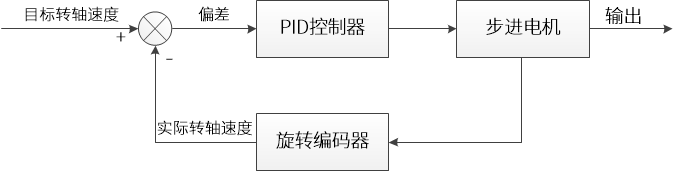
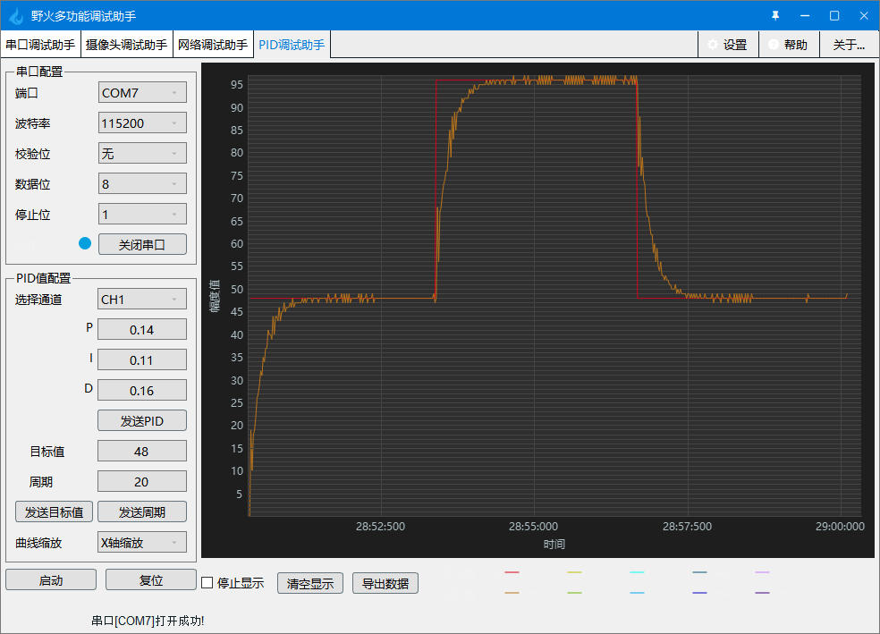
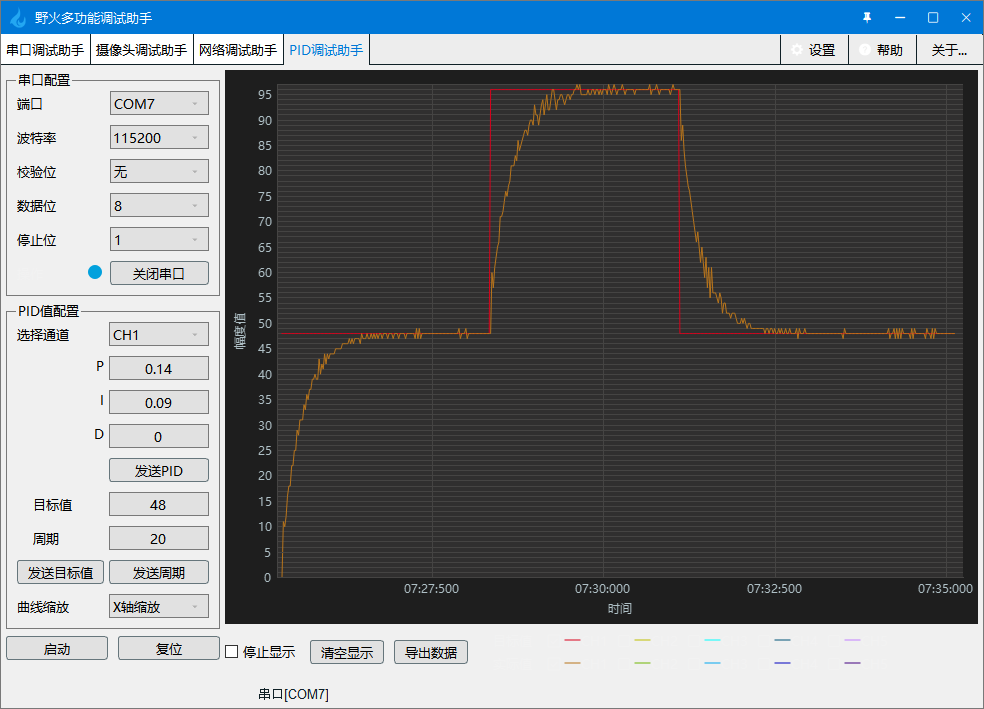

.. vim: syntax=rst

步进电机速度环控制实现
==========================================
在前面基础部分的章节中，我们已经详细的讲解了步进电机的基本控制方法，从这一章开始我们将为大家讲解如何对步进电机进行更高级的控制。

步进电机闭环控制原理概述
~~~~~~~~~~~~~~~~~~~~~~~~
根据前面基础部分的学习，我们知道步进电机是一种数字信号驱动的电机，其主要优点之一就是拥有很好的开环控制能力，控制系统不需要传感器和相应电路的反馈电机信息，
在负载不超载和脉冲频率合适的情况下，步进电机接收到的脉冲数和转子的角位移就是严格成正比关系。既然如此，那为什么要在步进电机上引入闭环控制呢？
虽然步进电机可以很好的开环控制，但实际在一些开环系统中，步进电机有可能由于自身性能及系统机械结构等因素的影响，在快速启停或负载突变时出现失步、过冲甚至堵转，
控制器无法知晓和矫正，这些现象在某些对精度要求较高的系统中可能导致严重后果。而加入传感器反馈组成闭环系统后，可以检测是否有失步等现象发生并及时纠正偏差。

目前的步进电机闭环控制方案有很多种，有些比较简单，只做失步的检测和矫正，有些非常复杂，可以完全控制步进电机的转矩和位置，改善步进电机的转矩频率特性，
降低发热和平均功耗，提高电机运行效率。平时听到的一些控制名词，比如速度环、位置环和电流环这些，就可以用于步进电机的闭环控制，
当然这些名词同样适用于其他的电机闭环系统。

在这里我们介绍一种以步进电机转速作为被控量（也就是速度环），使用旋转编码器作为反馈传感器，PID算法进行控制的闭环控制系统，
系统框图如下所示，为了方便叙述，没有将步机电机驱动器加入系统框图：

图中的旋转编码器作为反馈通道，负责收集步进电机转子在单位采样时间内的实际执行的步数，系统将实际步数转换为转速并与目标转速进行比较然后计算出偏差，
偏差值输入到PID控制器中，控制器输出经过修正的期望转速，最后交由步进电机执行。从框图中我们可以知道，当步进电机在运动过程中发生丢步，
会出现实际转速偏离目标转速，编码器将实际转速反馈给系统，控制器就能及时做出偏差修正。

硬件设计
~~~~~~~~~~~

本实验的硬件设计与编码器的使用章节中的硬件设计完全相同，在此不再赘述。

步进电机速度闭环控制--增量式PID
~~~~~~~~~~~~~~~~~~~~~~~~~~~~~~~~
本实验会结合之前章节的PID控制和步进电机编码器测速，来讲解如何使用增量式PID对步进电机进行速度闭环控制。
学习本小节内容时，请打开配套的“步进电机速度环控制——增量式PID”工程配合阅读。

软件设计
----------
本闭环控制例程是在步进电机编码器测速例程的基础上编写的，这里只讲解核心的部分代码，有些变量的设置，头文件的包含等并没有涉及到，完整的代码请参考本章配套的工程。
我们创建了4个文件：bsp_pid.h和bsp_pid.c文件用来存放PID控制器相关程序，bsp_stepper_ctrl.c、bsp_stepper_ctrl.h 文件用来存步进电机速度环控制程序及相关宏定义。

编程要点
^^^^^^^^^
1. 定时器 IO 配置
#. 步进电机、编码器相关外设初始化
#. 速度闭环控制实现
#. PID参数整定

软件分析
^^^^^^^^^
**宏定义**

.. code-block:: c
   :caption: bsp_stepper_init.h-宏定义
   :linenos:

    /*宏定义*/
    /*******************************************************/
    //宏定义对应开发板的接口 1 、2 、3 、4
    #define CHANNEL_SW 1

    #if(CHANNEL_SW == 1)
    //Motor 方向 
    #define MOTOR_DIR_PIN                  	GPIO_PIN_1   
    #define MOTOR_DIR_GPIO_PORT            	GPIOE                    
    #define MOTOR_DIR_GPIO_CLK_ENABLE()   	__HAL_RCC_GPIOE_CLK_ENABLE()

    //Motor 使能 
    #define MOTOR_EN_PIN                  	GPIO_PIN_0
    #define MOTOR_EN_GPIO_PORT            	GPIOE                       
    #define MOTOR_EN_GPIO_CLK_ENABLE()    	__HAL_RCC_GPIOE_CLK_ENABLE()

    //Motor 脉冲
    #define MOTOR_PUL_IRQn                  TIM8_CC_IRQn
    #define MOTOR_PUL_IRQHandler            TIM8_CC_IRQHandler

    #define MOTOR_PUL_TIM                   TIM8
    #define MOTOR_PUL_CLK_ENABLE()  		    __TIM8_CLK_ENABLE()

    #define MOTOR_PUL_PORT       	     		  GPIOI
    #define MOTOR_PUL_PIN             		  GPIO_PIN_5
    #define MOTOR_PUL_GPIO_CLK_ENABLE()		  __HAL_RCC_GPIOI_CLK_ENABLE()

    #define MOTOR_PUL_GPIO_AF               GPIO_AF3_TIM8
    #define MOTOR_PUL_CHANNEL_x             TIM_CHANNEL_1

    #elif(CHANNEL_SW == 2)
    ... ... 
    #elif(CHANNEL_SW == 3)
    ... ... 
    #elif(CHANNEL_SW == 4)
    ... ... 
    #endif

    /*频率相关参数*/
    //定时器实际时钟频率为：168MHz/TIM_PRESCALER
    //其中 高级定时器的 频率为168MHz,其他定时器为84MHz
    //168/TIM_PRESCALER = 28MHz
    //具体需要的频率可以自己计算
    #define TIM_PRESCALER                6
    // 定义定时器周期，输出比较模式周期设置为0xFFFF
    #define TIM_PERIOD                   0xFFFF

以上是在板子上步进电机的四个接口，（由于篇幅有限，只写了一部分具体开源码）为了方便使用，在这里全都定义完，并且可以使用宏定义 **CHANNEL_SW** 
直接修改数值为1、2、3、4就可以直接修改对应的开发板通道，然后对应接在上面即可。

.. code-block:: c
   :caption: bsp_stepper_ctrl.h-宏定义
   :linenos:

    /*宏定义*/
    /*******************************************************/
    #define TIM_STEP_FREQ     (SystemCoreClock/TIM_PRESCALER) // 频率ft值

    /*电机单圈参数*/
    #define STEP_ANGLE				1.8f                 //步进电机的步距角 单位：度
    #define FSPR              (360.0f/STEP_ANGLE)  //步进电机的一圈所需脉冲数

    #define MICRO_STEP        32          				 //细分器细分数 
    #define SPR               (FSPR*MICRO_STEP)    //细分后一圈所需脉冲数

    #define PULSE_RATIO       (float)(SPR/ENCODER_TOTAL_RESOLUTION)//步进电机单圈脉冲数与编码器单圈脉冲的比值

    #define TARGET_SPEED      1                   //步进电机运动时的目标转速，单位：转/秒
    #define SAMPLING_PERIOD   50                  //PID采样频率，单位Hz

上面的宏定义是步进电机本身的参数和闭环控制需要用到的参数，包括步进电机的步距角、驱动器细分数和PID控制用到的目标速度等等。
其中宏 **PULSE_RATIO** 是细分后的步进电机单圈脉冲数与编码器单圈脉冲数的比值，因为在整个速度闭环控制系统中，
反馈和PID计算得出的都是编码器的脉冲数。

**增量式PID算法实现**

本例程中使用的增量式PID算法，在代码实现方式上与之前介绍PID时的算法有少许区别，具体可以看如下代码。

.. code-block:: c
   :caption: bsp_pid.c-增量式PID算法实现
   :linenos:

    /**
      * @brief  增量式PID算法实现
      * @param  val：当前实际值
      *	@note 	无
      * @retval 通过PID计算后的输出
      */
    float PID_realize(float temp_val) 
    {
      /*传入实际值*/
      pid.actual_val = temp_val;
      /*计算目标值与实际值的误差*/
      pid.err=pid.target_val-pid.actual_val;

      /*PID算法实现*/
      float increment_val = pid.Kp*(pid.err - pid.err_next) + pid.Ki*pid.err + pid.Kd*(pid.err - 2 * pid.err_next + pid.err_last);
      /*传递误差*/
      pid.err_last = pid.err_next;
      pid.err_next = pid.err;
      /*返回增量值*/
      return increment_val;
    }

上述代码中PID控制器的入口参数从原来的目标值更改为了反馈回来的实际值，而目标值在控制器外赋值，控制器的返回值变为PID计算得出的增量值，
实际值的累加则放到了控制器外。整个增量式PID控制器的原理并没有变化，只是调整了部分代码的组织逻辑，这么做可以更方便的在程序的其他位置调用PID控制器。

**步进电机闭环控制**

.. code-block:: c
   :caption: bsp_stepper_ctrl.c-步进电机闭环控制
   :linenos:

    //bsp_stepper_ctrl.h
    typedef struct {
      unsigned char stepper_dir : 1;               //步进电机方向
      unsigned char stepper_running : 1;           //步进电机运行状态
      unsigned char MSD_ENA : 1;                   //驱动器使能状态
    }__SYS_STATUS;

    //bsp_stepper_ctrl.c
    /* 系统状态初始化 */
    __SYS_STATUS sys_status = {0};

    /**
      * @brief  步进电机速度闭环控制
      * @retval 无
      * @note   基本定时器中断内调用
      */
    void Stepper_Speed_Ctrl(void)
    {
      /* 编码器相关变量 */
      static __IO int32_t last_count = 0;
      __IO int32_t capture_count = 0;
      __IO int32_t capture_per_unit = 0;
      /* 经过pid计算后的期望值 */
      static __IO float cont_val = 0.0f;
      
      __IO float timer_delay = 0.0f;
      
      /* 当电机运动时才启动pid计算 */
      if((sys_status.MSD_ENA == 1) && (sys_status.stepper_running == 1))
      {
        /* 计算单个采样时间内的编码器脉冲数 */
        capture_count =__HAL_TIM_GET_COUNTER(&TIM_EncoderHandle) + (encoder_overflow_count * ENCODER_TIM_PERIOD);
        capture_per_unit = capture_count - last_count;
        last_count = capture_count;
        
        /* 单位时间内的编码器脉冲数作为实际值传入pid控制器 */
        cont_val += PID_realize((float)capture_per_unit);// 进行 PID 计算
        
        /* 判断速度方向 */
        cont_val > 0 ? (MOTOR_DIR(CW)) : (MOTOR_DIR(CCW));
        
        /* 计算得出的期望值取绝对值 */
        timer_delay = fabsf(cont_val);
        
        /* 计算比较计数器的值 */
        OC_Pulse_num = ((uint16_t)(TIM_STEP_FREQ / (timer_delay * PULSE_RATIO * SAMPLING_PERIOD))) >> 1;
        
        #if PID_ASSISTANT_EN
        int Temp = capture_per_unit;    // 上位机需要整数参数，转换一下
        set_computer_value(SEED_FACT_CMD, CURVES_CH1, &Temp, 1);  // 给通道 1 发送实际值
        #else
        printf("实际值：%d，目标值：%.0f\r\n", capture_per_unit, pid.target_val);// 打印实际值和目标值 
        #endif
      }
      else
      {
        /*停机状态所有参数清零*/
    //    OC_Pulse_num = 0xFFFF;
        last_count = 0;
        cont_val = 0;
        pid.actual_val = 0;
        pid.err = 0;
        pid.err_last = 0;
        pid.err_next = 0;
      }
    }

上述代码就是整个步进电机速度闭环控制的核心代码了。

- 第2~6行：定义了一个结构体 **__SYS_STATUS** ，用来管理驱动器和电机的运行状态；
- 第20~26行：定义了一些用于编码器测速和PID计算的中间变量；
- 第29行：判断驱动器和电机运行状态，如果驱动器使能并且电机处于运动状态，才能执行闭环控制；
- 第32~34行：读取编码器计数值并计算在单个采样周期中的计数值 **capture_per_unit** ，单位是脉冲每毫秒，实际表示编码器脉冲的频率，
  这里为了后续计算方便并没有写成以转每秒为单位的速度；
- 第37行：把 **capture_per_unit** 作为实际值传给PID控制器，并把PID运算后的期望增量值累加到变量 **cont_val** ；
- 第43行：把计算出的期望值取绝对值便于后续计算，fabsf函数是C库函数，专门用来处理单精度浮点数的绝对值计算，速度比自己手写的稍快些；
- 第46行：将期望值换算为比较计数器的值赋值给变量 **OC_Pulse_num**；
- 第48~53行：这部分其实跟闭环控制关系不大，主要是用作信息输出，通过一个宏定义判断是否开启上位机通信功能，如果开启宏 **PID_ASSISTANT_EN**，
  那么就是使用上位机软件进行输出，否则使用串口输出数据；
- 第57~64行：在电机停止或由运行变为停止时，需要清零编码器读数的中间值和PID控制器中的累加数据，以免影响电机再次启动时的控制效果。

我们重点讲解一下第47行代码，首先需要说明一点，整个Stepper_Speed_Ctrl闭环控制函数中，传入PID和PID输出的参数都是编码器的数据，也就是编码器的脉冲频率，
但是实际被控量是步进电机的转轴速度，需要做转换。将编码器的脉冲频率 **capture_per_unit** 乘上一个系数 **PULSE_RATIO** 便可得到步进电机所需的脉冲频率，
这个系数是由步进电机经过细分后转轴转一圈所需的脉冲数，与编码器转一圈发出的脉冲数之间的比值得出。不过此时的频率还是以ms为单位的，为了后续计算方便，
需要统一成以s为单位，因为本例程的采样周期是20ms，所以单位转换只需要乘上1s内的采样次数50即可。

得到了步进电机需要的脉冲频率还不够，我们需要想办法把它转换成可以写入捕获比较寄存器的值。在步进电机基础旋转章节中我们提到过，当定时器配置为输出比较模式时，
通过修改捕获比较寄存器当中的值，可以改变步进电机脉冲的周期，从而改变电机转速，其实本实验也是同样的道理。

**闭环控制周期调用**

.. code-block:: c
   :caption: main.c-定时器更新事件回调函数
   :linenos:

    /**
      * @brief  定时器更新事件回调函数
      * @param  无
      * @retval 无
      */
    void HAL_TIM_PeriodElapsedCallback(TIM_HandleTypeDef *htim)
    {
      /* 判断触发中断的定时器 */
      if(htim->Instance == BASIC_TIM)
      {
        Stepper_Speed_Ctrl();
      }
      else if(htim->Instance == ENCODER_TIM)
      {  
        /* 判断当前计数方向 */
        if(__HAL_TIM_IS_TIM_COUNTING_DOWN(htim))
          /* 下溢 */
          encoder_overflow_count--;
        else
          /* 上溢 */
          encoder_overflow_count++;
      }
    }

这是一个定时器更新事件回调函数。本实验在基本定时器TIM6的定时中断中循环调用闭环控制程序，TIM6配置为20ms中断一次，也就是说闭环控制的采样周期是20ms。

**main函数**

.. code-block:: c
   :caption: main.c-主函数
   :linenos:

    /**
      * @brief  主函数
      * @param  无
      * @retval 无
      */
    int main(void) 
    {
      /* 初始化系统时钟为168MHz */
      SystemClock_Config();
      /*初始化USART 配置模式为 115200 8-N-1，中断接收*/
      DEBUG_USART_Config();
      printf("欢迎使用野火 电机开发板 步进电机 速度闭环控制 例程\r\n");
      printf("按下按键3启动和停止电机\r\n");	
      /* 初始化时间戳 */
      HAL_InitTick(5);
      /*按键中断初始化*/
      Key_GPIO_Config();	
      /*led初始化*/
      LED_GPIO_Config();
      /* 初始化基本定时器定时，20ms产生一次中断 */
      TIMx_Configuration();
      /* 编码器接口初始化 */
      Encoder_Init();
      /*步进电机初始化*/
      stepper_Init();
      /* 上电默认停止电机 */
      Set_Stepper_Stop();
      /* PID算法参数初始化 */
      PID_param_init();
    //  MOTOR_DIR(CW);

      /* 目标速度转换为编码器的脉冲数作为pid目标值 */
      pid.target_val = TARGET_SPEED * ENCODER_TOTAL_RESOLUTION / SAMPLING_PERIOD;
      
    #if PID_ASSISTANT_EN
      int Temp = pid.target_val;    // 上位机需要整数参数，转换一下
      set_computer_value(SEED_STOP_CMD, CURVES_CH1, NULL, 0);    // 同步上位机的启动按钮状态
      set_computer_value(SEED_TARGET_CMD, CURVES_CH1, &Temp, 1);// 给通道 1 发送目标值
    #endif

      while(1)
      {
        /* 扫描KEY1，启动电机 */
        if( Key_Scan(KEY1_GPIO_PORT,KEY1_PIN) == KEY_ON  )
        {
        #if PID_ASSISTANT_EN
          Set_Stepper_Start();
          set_computer_value(SEED_START_CMD, CURVES_CH1, NULL, 0);// 同步上位机的启动按钮状态
        #else
          Set_Stepper_Start();
        #endif
        }
        /* 扫描KEY2，停止电机 */
        if( Key_Scan(KEY2_GPIO_PORT,KEY2_PIN) == KEY_ON  )
        {
        #if PID_ASSISTANT_EN
          Set_Stepper_Stop();
          set_computer_value(SEED_STOP_CMD, CURVES_CH1, NULL, 0);// 同步上位机的启动按钮状态
        #else
          Set_Stepper_Stop();     
        #endif
        }
        /* 扫描KEY3，增大目标速度 */
        if( Key_Scan(KEY3_GPIO_PORT,KEY3_PIN) == KEY_ON  )
        {
          /* 目标速度增加48，对应电机转速增加1 */
          pid.target_val += 48;
          
        #if PID_ASSISTANT_EN
          int temp = pid.target_val;
          set_computer_value(SEED_TARGET_CMD, CURVES_CH1, &temp, 1);// 给通道 1 发送目标值
        #endif
        }
        /* 扫描KEY4，减小目标速度 */
        if( Key_Scan(KEY4_GPIO_PORT,KEY4_PIN) == KEY_ON  )
        {
          /* 目标速度减小48，对应电机转速减少1 */
          pid.target_val -= 48;
          
        #if PID_ASSISTANT_EN
          int temp = pid.target_val;
          set_computer_value(SEED_TARGET_CMD, CURVES_CH1, &temp, 1);// 给通道 1 发送目标值
        #endif
        }
      }
    } 	

main函数中主要就是一些外设的初始化，包括PID控制器的目标值设置。然后在while循环中轮询按键，通过按键控制步进电机，
其中KEY1、KEY2控制步机电机的启动和停止，KEY3\KEY4控制步进电机的速度。

实验现象
----------

下载程序后，打开野火多功能调试助手，按KEY1启动步进电机，从调试助手的PID调试界面可以看到步进电机的速度变化曲线。

步进电机速度环控制--位置式PID
~~~~~~~~~~~~~~~~~~~~~~~~~~~~~~~~

本实验会结合之前章节的PID控制、步进电机编码器测速和上一节的“步进电机速度环控制--增量式PID”来讲解如何使用位置式PID对步进电机进行速度闭环控制。
学习本小节内容时，请打开配套的“步进电机速度环控制——位置式PID”工程配合阅读。

软件设计
----------

这里只讲解核心的部分代码，有些变量的设置，头文件的包含等并没有涉及到，完整的代码请参考本章配套的工程。
我们创建了4个文件：bsp_pid.h和bsp_pid.c文件用来存放PID控制器相关程序，
bsp_stepper_ctrl.c、bsp_stepper_ctrl.h 文件用来存步进电机速度环控制程序及相关宏定义。

编程要点
^^^^^^^^^

1. 定时器 IO 配置
#. 步进电机、编码器相关外设初始化
#. 速度闭环控制实现
#. PID参数整定

软件分析
^^^^^^^^^

在bsp_stepper_init.h和bsp_stepper_ctrl.h中的宏定义与上一节步进电机速度闭环控制--增量式PID中的宏定义完全相同，此处不再重复说明。
我们直接开始位置式PID算法的实现。

**位置式PID算法实现**

本例程中使用的位置式PID算法，在代码实现方式上与之前介绍PID时的算法有少许区别，具体可以看如下代码。

.. code-block:: c
   :caption: bsp_pid.c-位置式PID算法实现
   :linenos:

    /**
      * @brief  位置式PID算法实现
      * @param  actual_val：当前实际值
      *	@note 	无
      * @retval 通过PID计算后的输出
      */
    float PID_realize(float actual_val) 
    {
      /*传入实际值*/
      pid.actual_val = actual_val;
      /*计算目标值与实际值的误差*/
      pid.err = pid.target_val - pid.actual_val;
      /*误差累积*/
      pid.integral += pid.err;
      /*PID算法实现*/
      pid.actual_val = pid.Kp*pid.err + pid.Ki*pid.integral + pid.Kd*(pid.err-pid.err_last);
      /*误差传递*/
      pid.err_last = pid.err;
      /*PID算法实现，并返回计算值*/
      return pid.actual_val;
    }

上述代码中PID控制器的入口参数从原来的目标值更改为了反馈回来的实际值，而目标值在控制器外赋值，
控制器的返回值变为PID计算得出的位置值。整个位置式PID控制器的原理并没有变化，只是调整了部分代码的组织逻辑，这么做可以更方便的在程序的其他位置调用PID控制器。

**步进电机闭环控制**

.. code-block:: c
   :caption: bsp_stepper_ctrl.c-步进电机闭环控制
   :linenos:

      /**
      * @brief  步进电机位置式PID控制
      * @retval 无
      * @note   基本定时器中断内调用
      */
    void Stepper_Speed_Ctrl(void)
    {
      /* 编码器相关变量 */
      __IO int16_t capture_per_unit = 0;
      __IO int32_t capture_count = 0;
      static __IO int32_t last_count = 0;
      
      /* 经过pid计算后的期望值 */
      __IO float cont_val = 0;

      /* 当电机运动时才启动pid计算 */
      if((sys_status.MSD_ENA == 1) && (sys_status.stepper_running == 1))
      {
        /* 计算单个采样时间内的编码器脉冲数 */
        capture_count = __HAL_TIM_GET_COUNTER(&TIM_EncoderHandle) + (encoder_overflow_count * ENCODER_TIM_PERIOD);
        capture_per_unit = capture_count - last_count;
        last_count = capture_count;
        
        /* 单位时间内的编码器脉冲数作为实际值传入pid控制器 */
        cont_val = PID_realize((float)capture_per_unit);// 进行 PID 计算
        
        /* 判断速度方向 */
        cont_val > 0 ? (MOTOR_DIR(CW)) : (MOTOR_DIR(CCW));

        /* 对计算得出的期望值取绝对值 */
        cont_val = fabsf(cont_val);
        /* 计算比较计数器的值 */
        OC_Pulse_num = ((uint16_t)(T1_FREQ / (cont_val * PULSE_RATIO * SAMPLING_PERIOD))) >> 1;

      #if PID_ASSISTANT_EN
        int temp = capture_per_unit;
        set_computer_value(SEED_FACT_CMD, CURVES_CH1, &temp, 1);  // 给通道 1 发送实际值
      #else
        printf("实际值：%d，目标值：%.0f\r\n", capture_per_unit, pid.target_val);// 打印实际值和目标值
      #endif
      }
      else
      {
        capture_per_unit = 0;
        cont_val = 0;
        pid.actual_val = 0;
        pid.err = 0;
        pid.err_last = 0;
        pid.integral = 0;
      }
    }

步进电机闭环控制部分与步进电机速度环控制--增量式PID基本相同，这里只对不同点作出说明。

- 第25行：使用 **capture_per_unit** 作为实际值传给位置式PID控制器进行运算，并把返回值赋值给 **cont_val**

**闭环控制周期调用**

步进电机闭环控制周期调用与上一节“步进电机速度环控制--增量式PID”完全相同。

**main函数**

.. code-block:: c
   :caption: main.c-主函数
   :linenos:

    /**
      * @brief  主函数
      * @param  无
      * @retval 无
      */
    int main(void) 
    {
      /* 初始化系统时钟为168MHz */
      SystemClock_Config();
      /*初始化USART 配置模式为 115200 8-N-1，中断接收*/
      DEBUG_USART_Config();
      printf("欢迎使用野火 电机开发板 步进电机 速度闭环控制 位置式PID例程\r\n");
      printf("按下按键1启动电机、按键2停止、按键3增加目标值、按键4减少目标值\r\n");	
      /* 初始化时间戳 */
      HAL_InitTick(5);
      /*按键中断初始化*/
      Key_GPIO_Config();	
      /*led初始化*/
      LED_GPIO_Config();
      /* 初始化基本定时器定时，20ms产生一次中断 */
      TIMx_Configuration();
      /* 编码器接口初始化 */
      Encoder_Init();
      /*步进电机初始化*/
      stepper_Init();
      /* 上电默认停止电机 */
      Set_Stepper_Stop();
      /* PID算法参数初始化 */
      PID_param_init();
      
      /* 目标速度转换为编码器的脉冲数作为pid目标值 */
      pid.target_val = TARGET_SPEED * ENCODER_TOTAL_RESOLUTION / SAMPLING_PERIOD;
        
    #if PID_ASSISTANT_EN
      int Temp = pid.target_val;    // 上位机需要整数参数，转换一下
      set_computer_value(SEED_STOP_CMD, CURVES_CH1, NULL, 0);    // 同步上位机的启动按钮状态
      set_computer_value(SEED_TARGET_CMD, CURVES_CH1, &Temp, 1);// 给通道 1 发送目标值
    #endif

      while(1)
      {
        /* 扫描KEY1，启动电机 */
        if( Key_Scan(KEY1_GPIO_PORT,KEY1_PIN) == KEY_ON  )
        {
        #if PID_ASSISTANT_EN
          Set_Stepper_Start();
          set_computer_value(SEED_START_CMD, CURVES_CH1, NULL, 0);// 同步上位机的启动按钮状态
        #else
          Set_Stepper_Start();
        #endif
        }
        /* 扫描KEY2，停止电机 */
        if( Key_Scan(KEY2_GPIO_PORT,KEY2_PIN) == KEY_ON  )
        {
        #if PID_ASSISTANT_EN
          Set_Stepper_Stop();
          set_computer_value(SEED_STOP_CMD, CURVES_CH1, NULL, 0);// 同步上位机的启动按钮状态
        #else
          Set_Stepper_Stop();     
        #endif
        }
        /* 扫描KEY3，增大目标速度 */
        if( Key_Scan(KEY3_GPIO_PORT,KEY3_PIN) == KEY_ON  )
        {
          /* 目标速度增加48，对应电机转速增加1 */
          pid.target_val += 48;
          
        #if PID_ASSISTANT_EN
          int temp = pid.target_val;
          set_computer_value(SEED_TARGET_CMD, CURVES_CH1, &temp, 1);// 给通道 1 发送目标值
        #endif
        }
        /* 扫描KEY4，减小目标速度 */
        if( Key_Scan(KEY4_GPIO_PORT,KEY4_PIN) == KEY_ON  )
        {
          /* 目标速度减小48，对应电机转速减少1 */
          pid.target_val -= 48;
          
        #if PID_ASSISTANT_EN
          int temp = pid.target_val;
          set_computer_value(SEED_TARGET_CMD, CURVES_CH1, &temp, 1);// 给通道 1 发送目标值
        #endif
        }
      }
    }

main函数中主要就是一些外设的初始化，包括PID控制器的目标值设置。然后在while循环中轮询按键，通过按键控制步进电机，
其中KEY1、KEY2控制步机电机的启动和停止，KEY3、KEY4控制步进电机的速度。

实验现象
----------

下载程序后，打开野火多功能调试助手，按KEY1启动步进电机，从调试助手的PID调试界面可以看到步进电机的速度变化曲线。

