.. vim: syntax=rst

编码器的使用
==========================================
本章参考资料：《STM32 HAL库开发指南——基于F407》、《STM32F4xx参考手册》、
HAL库帮助文档《STM32F417xx_User_Manual.chm》。
学习本章时，配合《STM32F4xx 参考手册》通用定时器章节一起阅读，效果会更佳，特别是涉及到寄存器说明的部分。

在基础部分的编码器详解章节中，已经详细介绍了旋转编码器的结构、原理和参数，这一章节我们将介绍如何使用编码器对电机的速度和位置进行测量。

增量式编码器倍频技术
~~~~~~~~~~~~~~~~~~~~
首先来看一下增量式编码器的输出信号和它的信号倍频技术。增量式编码器输出的脉冲波形信号形式常见的有两种：

1. 一种是占空比50%的方波，通道A和B相位差为90°；
#. 另一种则是正弦波这类模拟信号，通道A和B相位差同样为90°。

对于第1种形式的方波信号，如果把两个通道组合起来看的话，可以发现A和B各自的上升沿和下降沿都能计数，至少在1/2个原始方波周期内就可以计数一次，
最多1/4个原始方波周期。这样计数频率就是原始方波信号的2倍或4倍，换句话说就是，将编码器的分辨率提高了2到4倍，具体如下图所示。

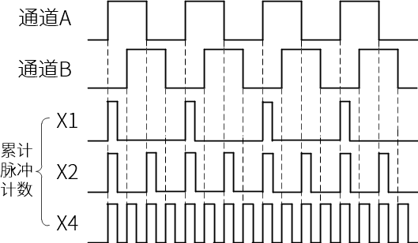

图中的方波信号如果只看其中一个通道的上升沿，那计数频率就等于这个通道信号的频率。如果在通道A的上升沿和下降沿都进行计数，计数频率就是通道A的两倍，即2倍频。
如果同时对两个通道的上升沿和下降沿都计数，那计数频率就变成了原始信号的4倍，即4倍频。

假设有个增量式编码器它的分辨率是600PPR，能分辨的最小角度是0.6°，对它进行4倍频之后就相当于把分辨率提高到了600*4=2400PPR，此时编码器能够分辨的最小角度为0.15°。
编码器倍频技术还可用来扩展一些测速方法的速度适用范围。例如电机测速通常使用M法进行测量（M法在下节介绍），编码器4倍频后可以扩展M法的速度下限。

以上就是方波信号的编码器倍频技术，其实输出模拟信号的增量式编码器同样也可以倍频，不过这种倍频原理与方波完全不同，教程当中就不讲解了。

常用测速方法简介
~~~~~~~~~~~~~~~~~~~~~~~~
上一节提到了增量式编码器倍频技术可以扩展M法的测量范围，那么现在我们就来讲解下这个M法究竟是怎样测速的，以及简单介绍一些常用的编码器测速方法。
对于电机转速的测量，可以把增量式编码器安装到电机上，用控制器对编码器脉冲进行计数，然后通过特定的方法求出电机转速，常用的编码器测速方法一般有三种：M法、T法和M/T法。

- M法：又叫做频率测量法。这种方法是在一个固定的定时时间内（以秒为单位），统计这段时间的编码器脉冲数，计算速度值。设编码器单圈总脉冲数为C，
  在时间T\ :sub:`0`\内，统计到的编码器脉冲数为M\ :sub:`0`\，则转速n的计算公式为：

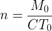

公式中的编码器单圈总脉冲数C是常数，所以转速n跟M\ :sub:`0`\成正比。这就使得在高速测量时M\ :sub:`0`\变大，可以获得较好的测量精度和平稳性，
但是如果速度很低，低到每个T\ :sub:`0`\内只有少数几个脉冲，此时算出的速度误差就会比较大，并且很不稳定。也有一些方法可以改善M法在低速测量的准确性，
上一节提到的增量式编码器倍频技术就是其中一种，比如原本捕获到的脉冲M\ :sub:`0`\只有4个，经过4倍频后，相同电机状态M\ :sub:`0`\变成了16个，
也就提升了低速下的测量精度。

- T法：又叫做周期测量法。这种方法是建立一个已知频率的高频脉冲并对其计数，计数时间由捕获到的编码器相邻两个脉冲的间隔时间T\ :sub:`E`\决定，
  计数值为M\ :sub:`1`\。设编码器单圈总脉冲数为C，高频脉冲的频率为F\ :sub:`0`\，则转速n的计算公式为：

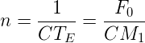

公式中的编码器单圈总脉冲数C和高频脉冲频率F\ :sub:`0`\是常数，所以转速n跟M\ :sub:`1`\成反比。从公式可以看出，在电机高转速的时候，
编码器脉冲间隔时间T\ :sub:`E`\很小，使得测量周期内的高频脉冲计数值M\ :sub:`1`\也变得很少，导致测量误差变大，而在低转速时，T\ :sub:`E`\足够大，
测量周期内的M\ :sub:`1`\也足够多，所以T法和M法刚好相反，更适合测量低速。

- M/T法：这种方法综合了M法和T法各自的优势，既测量编码器脉冲数又测量一定时间内的高频脉冲数。在一个相对固定的时间内，计数编码器脉冲数M\ :sub:`0`\，
  并计数一个已知频率为F\ :sub:`0`\的高频脉冲，计数值为M\ :sub:`1`\，计算速度值。设编码器单圈总脉冲数为C，则转速n的计算公式为：

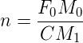

由于M/T法公式中的F\ :sub:`0`\和C是常数，所以转速n就只受M\ :sub:`0`\和M\ :sub:`1`\的影响。电机高速时，M\ :sub:`0`\增大，M\ :sub:`1`\减小，相当于M法，
低速时，M\ :sub:`1`\增大，M\ :sub:`0`\减小，相当于T法。

STM32的编码器接口简介
~~~~~~~~~~~~~~~~~~~~~~~

STM32芯片内部有专门用来采集增量式编码器方波信号的接口，这些接口实际上是STM32定时器的其中一种功能。
不过编码器接口功能只有高级定时器TIM1、TIM8和通用定时器TIM2到TIM5才有。编码器接口用到了定时器的输入捕获部分，
功能框图如下图所示。输入捕获功能在《STM32 HAL库开发指南》中已有详细讲解，所以这部分内容在此就不再赘述了。

我们重点关注编码器接口是如何实现信号采集和倍频的。《STM32F4xx参考手册》给出了的编码器信号与计数器方向和计数位置之间的关系，如下表所示。

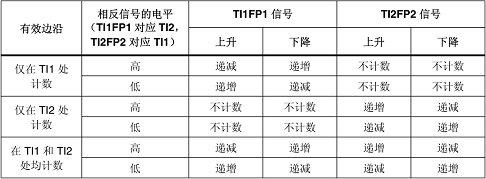

这个表格将编码器接口所有可能出现的工作情况全都列了出来，包括它是如何实现方向检测和倍频的。虽然信息很全面但是乍看上去却不容易看懂。
首先需要解释一下，表中的TI1和TI2对应编码器的通道A和通道B，而TI1FP1和TI2FP2则对应反相以后的TI1、TI2。STM32的编码器接口在计数的时候，
并不是单纯采集某一通道信号的上升沿或下降沿，而是需要综合另一个通道信号的电平。表中“相反信号的电平”指的就是在计数的时候所参考的另一个通道信号的电平，
这些电平决定了计数器的计数方向。

为了便于大家理解STM32编码器接口的计数原理，我们将表中的信息提出转换成一系列图像。首先看下图，下图所展示的信息对应表格中“仅在TI1处计数”。
图中包含TI1、TI2两通道的信号，以及计数器的计数方向，其中TI1比TI2 **提前** 1/4个周期，以TI1的信号边沿作为有效边沿。
当检测到TI1的上升沿时，TI2为低电平，此时计数器向上计数1次，下一时刻检测到TI1的下降沿时，TI2为高电平，此时计数器仍然向上计数一次，以此类推。
这样就能把TI1的上升沿和下降沿都用来计数，即实现了对原始信号的2倍频。

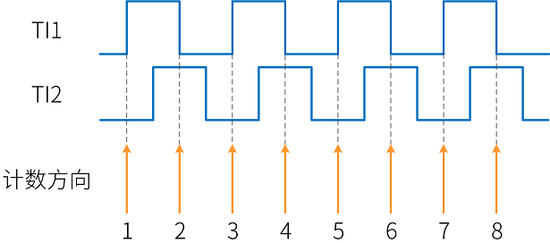

接下来看如下图像，图中同样包含TI1、TI2两通道的信号，以及计数器的计数方向，其中TI1比TI2 **滞后** 1/4个周期，以TI1的信号边沿作为有效边沿。
当检测到TI1的上升沿时，TI2为高电平，此时计数器向下计数1次，下一时刻检测到TI1的下降沿时，TI2为低电平，此时计数器仍然向下计数一次，以此类推。
这样同样是把TI1的上升沿和下降沿都用来计数，同样实现了对原始信号的2倍频，只不过变成向下计数了。

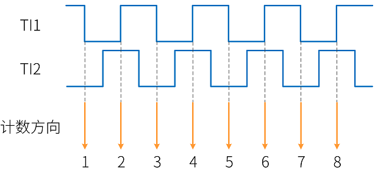

以上两幅图像都是只以TI1的信号边沿作为有效边沿，并且根据TI2的电平决定各自的计数方向，然后判断计数方向就能得到编码器的旋转方向，向上计数正向，向下计数反向。
“仅在TI2处计数”也是同样的原理，在这里就不重复讲了。

最后如下图所示，下图所展示的信息对应表格中“在TI1和TI2处均计数”。这种采样方式可以把两个通道的上升沿和下降沿都用来计数，计数方向也是两个通道同时参考，
相当于原来仅在一个通道处计数的2倍，所以这种就能实现对原始信号的4倍频。

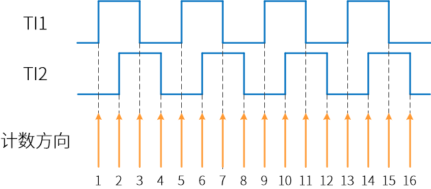

编码器接口初始化结构体详解
~~~~~~~~~~~~~~~~~~~~~~~~~~~
HAL库函数对定时器外设建立了多个初始化结构体，其中编码器接口用到的有时基初始化结构体 TIM_Base_InitTypeDef
，和编码器初始化配置结构体 TIM_Encoder_InitTypeDef 。初始化结构体成员用于设置定时器工作环境参数，并由定时器相应初始化配置函数调用，
最终这些参数将会写入到定时器相应的寄存器中。

TIM_Base_InitTypeDef
------------------------
时基结构体 TIM_Base_InitTypeDef 用于定时器基础参数设置，与 HAL_TIM_Base_Init 函数配合使用完成配置。
这个结构体在《STM32 HAL库开发指南》的定时器章节有详细的讲解，这里我们只简单的提一下。

.. code-block:: c
   :caption: 定时器基本初始化结构体
   :linenos:

   typedef struct
   {
     uint32_t Prescaler;            //预分频器
     uint32_t CounterMode;          //计数模式
     uint32_t Period;               //定时器周期
     uint32_t ClockDivision;        //时钟分频
     uint32_t RepetitionCounter;    //重复计算器
     uint32_t AutoReloadPreload;    //自动重载值
    }TIM_Base_InitTypeDef;

1. Prescaler：定时器预分频器设置；
#. CounterMode：定时器计数方式；
#. Period：定时器周期；
#. ClockDivision：时钟分频；
#. RepetitionCounter：重复计数器；
#. AutoReloadPreload：自动重载预装载值。

TIM_Encoder_InitTypeDef
------------------------
编码器初始化配置结构体 TIM_Encoder_InitTypeDef 用于定时器的编码器接口模式，与 HAL_TIM_Encoder_Init
函数配合使用完成初始化配置操作。高级定时器TIM1和TIM8以及通用定时器TIM2到TIM5都带有编码器接口，使用时都必须单独设置。

.. code-block:: c
   :caption: 编码器接口初始化结构体
   :linenos:

   typedef struct
   {
     uint32_t EncoderMode;    //编码器模式
     uint32_t IC1Polarity;    //输入信号极性
     uint32_t IC1Selection;   //输入通道
     uint32_t IC1Prescaler;   //输入捕获预分频器
     uint32_t IC1Filter;      //输入捕获滤波器
     uint32_t IC2Polarity;    //输入信号极性
     uint32_t IC2Selection;   //输入通道
     uint32_t IC2Prescaler;   //输入捕获预分频器
     uint32_t IC2Filter;      //输入捕获滤波器
    }TIM_Encoder_InitTypeDef;

1. EncoderMode：编码器模式选择，用来设置计数器采集编码器信号的方式，可选通道A计数、通道B计数和双通道计数。
   它设定TIMx_DIER寄存器的SMS[2:0]位。这个成员实际是用来设置编码器接口的倍频数的，当选择通道A或B计数时为2倍频，双通道计数时为4倍频。
#. ICxPolarity：输入捕获信号极性选择，用于设置定时器通道在编码器模式下的输入信号是否反相。
   它设定TIMx_CCER寄存器的CCxNP位和CCxP位。
#. ICxSelection：输入通道选择，ICx的信号可来自三个输入通道，分别为 TIM_ICSELECTION_DIRECTTI、
   TIM_ICSELECTION_INDIRECTTI 或 IM_ICSELECTION_TRC。它设定TIMx_CCMRx寄存器的CCxS[1:0]位的值。
   定时器在编码器接口模式下，此成员只能设置为TIM_ICSELECTION_DIRECTTI。
#. ICxPrescaler：输入捕获通道预分频器，可设置1、2、4、8分频。它设定TIMx_CCMRx寄存器的ICxPSC[1:0]位的值。
#. ICxFilter：输入捕获滤波器设置，可选设置0x0至0x0F。它设定TIMx_CCMRx寄存器ICxF[3:0]位的值。

.. _减速电机编码器测速实验:

减速电机编码器测速实验
~~~~~~~~~~~~~~~~~~~~~~~~

本实验讲解如何使用STM32的编码器接口，并利用编码器接口对减速电机进行测速。学习本小节内容时，请打开配套的“减速电机编码器测速”工程配合阅读。

硬件设计
--------
本实验用到的减速电机与减速电机按键控制例程的相同，所以电机、开发板和驱动板的硬件连接也完全相同，只加上了编码器的连线。

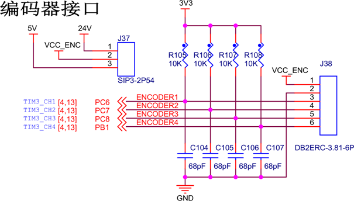

上图是我们电机开发板使用的编码器接口原理图，通过连接器与STM32的GPIO相连，一共4个通道，可以同时接入两个编码器。本实验使用PC6和PC7两个引脚，对应TIM3的CH1和CH2。

软件设计
--------
本编码器测速例程是在减速电机按键控制例程的基础上编写的，这里只讲解跟编码器有关的部分核心代码，有些变量的设置，头文件的包含以及如何驱动电机等并没有涉及到，
完整的代码请参考本章配套的工程。我们创建了两个文件：bsp_encoder.c 和 bsp_encoder.h 文件用来存放编码器接口驱动程序及相关宏定义。

编程要点
^^^^^^^^^^^
1. 定时器 IO 配置
#. 定时器时基结构体TIM_HandleTypeDef配置
#. 编码器接口结构体TIM_Encoder_InitTypeDef配置
#. 通过编码器接口测量到的数值计算减速电机转速

软件分析
^^^^^^^^^^^
(1) 宏定义

.. code-block:: c
   :caption: bsp_encoder.h-宏定义
   :linenos:

    /* 定时器选择 */
    #define ENCODER_TIM                         TIM3
    #define ENCODER_TIM_CLK_ENABLE()            __HAL_RCC_TIM3_CLK_ENABLE()
    /* 定时器溢出值 */
    #define ENCODER_TIM_PERIOD                  65535
    /* 定时器预分频值 */
    #define ENCODER_TIM_PRESCALER               0
    /* 定时器中断 */
    #define ENCODER_TIM_IRQn                    TIM3_IRQn
    #define ENCODER_TIM_IRQHandler              TIM3_IRQHandler
    /* 编码器接口引脚 */
    #define ENCODER_TIM_CH1_GPIO_CLK_ENABLE()   __HAL_RCC_GPIOC_CLK_ENABLE()
    #define ENCODER_TIM_CH1_GPIO_PORT           GPIOC
    #define ENCODER_TIM_CH1_PIN                 GPIO_PIN_6
    #define ENCODER_TIM_CH1_GPIO_AF             GPIO_AF2_TIM3
    #define ENCODER_TIM_CH2_GPIO_CLK_ENABLE()   __HAL_RCC_GPIOC_CLK_ENABLE()
    #define ENCODER_TIM_CH2_GPIO_PORT           GPIOC
    #define ENCODER_TIM_CH2_PIN                 GPIO_PIN_7
    #define ENCODER_TIM_CH2_GPIO_AF             GPIO_AF2_TIM3
    /* 编码器接口倍频数 */
    #define ENCODER_MODE                        TIM_ENCODERMODE_TI12
    /* 编码器接口输入捕获通道相位设置 */
    #define ENCODER_IC1_POLARITY                TIM_ICPOLARITY_RISING
    #define ENCODER_IC2_POLARITY                TIM_ICPOLARITY_RISING
    /* 编码器物理分辨率 */
    #define ENCODER_RESOLUTION                  15
    /* 经过倍频之后的总分辨率 */
    #if ((ENCODER_MODE == TIM_ENCODERMODE_TI1) || (ENCODER_MODE == TIM_ENCODERMODE_TI2))
      #define ENCODER_TOTAL_RESOLUTION             (ENCODER_RESOLUTION * 2)  /* 2倍频后的总分辨率 */
    #else
      #define ENCODER_TOTAL_RESOLUTION             (ENCODER_RESOLUTION * 4)  /* 4倍频后的总分辨率 */
    #endif
    /* 减速电机减速比 */
    #define REDUCTION_RATIO                     34

使用宏定义非常方便程序升级、移植。如果使用不同的定时器、编码器倍频数、编码器分辨率等，修改这些宏即可。
开发板使用的是TIM3的CH1和CH2，分别连接到编码器的通道A和通道B，对应的引脚为PC6、PC7。

(2) 定时器复用功能引脚初始化

.. code-block:: c
   :caption: bsp_encoder.c-定时器复用功能引脚初始化
   :linenos:

    /**
      * @brief  编码器接口引脚初始化
      * @param  无
      * @retval 无
      */
    static void Encoder_GPIO_Init(void)
    {
      GPIO_InitTypeDef GPIO_InitStruct = {0};

      /* 定时器通道引脚端口时钟使能 */
      ENCODER_TIM_CH1_GPIO_CLK_ENABLE();
      ENCODER_TIM_CH2_GPIO_CLK_ENABLE();

      /**TIM3 GPIO Configuration
      PC6     ------> TIM3_CH1
      PC7     ------> TIM3_CH2
      */
      /* 设置输入类型 */
      GPIO_InitStruct.Mode = GPIO_MODE_AF_PP;
      /* 设置上拉 */
      GPIO_InitStruct.Pull = GPIO_PULLUP;
      /* 设置引脚速率 */
      GPIO_InitStruct.Speed = GPIO_SPEED_FREQ_HIGH;

      /* 选择要控制的GPIO引脚 */
      GPIO_InitStruct.Pin = ENCODER_TIM_CH1_PIN;
      /* 设置复用 */
      GPIO_InitStruct.Alternate = ENCODER_TIM_CH1_GPIO_AF;
      /* 调用库函数，使用上面配置的GPIO_InitStructure初始化GPIO */
      HAL_GPIO_Init(ENCODER_TIM_CH1_GPIO_PORT, &GPIO_InitStruct);

      /* 选择要控制的GPIO引脚 */
      GPIO_InitStruct.Pin = ENCODER_TIM_CH2_PIN;
      /* 设置复用 */
      GPIO_InitStruct.Alternate = ENCODER_TIM_CH2_GPIO_AF;
      /* 调用库函数，使用上面配置的GPIO_InitStructure初始化GPIO */
      HAL_GPIO_Init(ENCODER_TIM_CH2_GPIO_PORT, &GPIO_InitStruct);
    }

定时器通道引脚使用之前必须设定相关参数，这里选择复用功能，并指定到对应的定时器。使用GPIO之前都必须开启相应端口时钟，这个没什么好说的。
唯一要注意的一点，有些编码器的输出电路是不带上拉电阻的，需要在板子上或者芯片GPIO设置中加上上拉电阻。

(3) 编码器接口配置

.. code-block:: c
   :caption: bsp_encoder.c-编码器接口配置
   :linenos:

    /**
      * @brief  配置TIMx编码器模式
      * @param  无
      * @retval 无
      */
    static void TIM_Encoder_Init(void)
    {
      TIM_Encoder_InitTypeDef Encoder_ConfigStructure;

      /* 使能编码器接口时钟 */
      ENCODER_TIM_CLK_ENABLE();

      /* 定时器初始化设置 */
      TIM_EncoderHandle.Instance = ENCODER_TIM;
      TIM_EncoderHandle.Init.Prescaler = ENCODER_TIM_PRESCALER;
      TIM_EncoderHandle.Init.CounterMode = TIM_COUNTERMODE_UP;
      TIM_EncoderHandle.Init.Period = ENCODER_TIM_PERIOD;
      TIM_EncoderHandle.Init.ClockDivision = TIM_CLOCKDIVISION_DIV1;
      TIM_EncoderHandle.Init.AutoReloadPreload = TIM_AUTORELOAD_PRELOAD_DISABLE;

      /* 设置编码器倍频数 */
      Encoder_ConfigStructure.EncoderMode = ENCODER_MODE;
      /* 编码器接口通道1设置 */
      Encoder_ConfigStructure.IC1Polarity = ENCODER_IC1_POLARITY;
      Encoder_ConfigStructure.IC1Selection = TIM_ICSELECTION_DIRECTTI;
      Encoder_ConfigStructure.IC1Prescaler = TIM_ICPSC_DIV1;
      Encoder_ConfigStructure.IC1Filter = 0;
      /* 编码器接口通道2设置 */
      Encoder_ConfigStructure.IC2Polarity = ENCODER_IC2_POLARITY;
      Encoder_ConfigStructure.IC2Selection = TIM_ICSELECTION_DIRECTTI;
      Encoder_ConfigStructure.IC2Prescaler = TIM_ICPSC_DIV1;
      Encoder_ConfigStructure.IC2Filter = 0;
      /* 初始化编码器接口 */
      HAL_TIM_Encoder_Init(&TIM_EncoderHandle, &Encoder_ConfigStructure);

      /* 清零计数器 */
      __HAL_TIM_SET_COUNTER(&TIM_EncoderHandle, 0);

      /* 清零中断标志位 */
      __HAL_TIM_CLEAR_IT(&TIM_EncoderHandle,TIM_IT_UPDATE);
      /* 使能定时器的更新事件中断 */
      __HAL_TIM_ENABLE_IT(&TIM_EncoderHandle,TIM_IT_UPDATE);
      /* 设置更新事件请求源为：定时器溢出 */
      __HAL_TIM_URS_ENABLE(&TIM_EncoderHandle);

      /* 设置中断优先级 */
      HAL_NVIC_SetPriority(ENCODER_TIM_IRQn, 5, 1);
      /* 使能定时器中断 */
      HAL_NVIC_EnableIRQ(ENCODER_TIM_IRQn);

      /* 使能编码器接口 */
      HAL_TIM_Encoder_Start(&TIM_EncoderHandle, TIM_CHANNEL_ALL);
    }

编码器接口配置中，主要初始化两个结构体，其中时基初始化结构体TIM_HandleTypeDef很简单，而且在其他应用中都用涉及到，直接看注释理解即可。

重点是编码器接口结构体TIM_Encoder_InitTypeDef的初始化。对于STM32定时器的编码器接口，我们首先需要设置编码器的倍频数，即成员EncoderMode，
它可把编码器接口设置为2倍频或4倍频，根据bsp_encoder.h的宏定义我们将其设置为4倍频，倍频原理在上面已有讲解这里不再赘述。

对于编码器接口输入通道的配置，我们只讲解通道1的配置情况，通道2是一样的。首先是输入信号极性，成员IC1Polarity在输入捕获模式中是用来设置触发边沿的，
但在编码器模式中是用来设置输入信号是否反相的。设置为RISING表示不反相，FALLING表示反相。此成员与编码器的计数触发边沿无关，
只用来匹配编码器和电机的方向，当设定的电机正方向与编码器正方向不一致时不必更改硬件连接，直接在程序中修改IC1Polarity即可。

接下来是成员IC1Selection，这个成员用于选择输入通道，IC1可以是TI1输入的TI1FP1，也可以是从TI2输入的TI2FP1，我们这里选择直连（DIRECTTI），即TI1FP1映射到IC1，
在编码器模式下这个成员只能设置为DIRECTTI，其他可选值都是不起作用的。

最后是成员IC1Prescaler和成员IC1Filter，我们需要对编码器的每个脉冲信号都进行捕获，所以设置成不分频。根据STM32编码器接口2倍频或4倍频的原理，
接口在倍频采样的过程中也会对信号抖动进行补偿，所以输入滤波器也很少会用到。

配置完编码器接口结构体后清零计数器，然后开启定时器的更新事件中断，并把更新事件中断源配置为定时器溢出，也就是仅当定时器溢出时才触发更新事件中断。
然后配置定时器的中断优先级并开启中断，最后启动编码器接口。

(4) 定时器溢出次数记录

.. code-block:: c
   :caption: bsp_encoder.c-定时器溢出次数记录
   :linenos:

    /**
      * @brief  定时器更新事件回调函数
      * @param  无
      * @retval 无
      */
    void HAL_TIM_PeriodElapsedCallback(TIM_HandleTypeDef *htim)
    {
      /* 判断当前计数器计数方向 */
      if(__HAL_TIM_IS_TIM_COUNTING_DOWN(&TIM_EncoderHandle))
        /* 下溢 */
        Encoder_Overflow_Count--;
      else
        /* 上溢 */
        Encoder_Overflow_Count++;
    }

在TIM_Encoder_Init函数中我们配置了仅当定时器计数溢出时才触发更新事件中断，然后在中断回调函数中记录定时器溢出了多少次。首先定义一个全局变量Encoder_Overflow_Count，
用来记录计数器的溢出次数。在定时器更新事件中断回调函数中，使用__HAL_TIM_IS_TIM_COUNTING_DOWN函数判断当前的计数方向，是向上计数还是向下计数，
如果向下计数，Encoder_Overflow_Count减1，反之则加1。这样在计算电机转速和位置的时候就可以把溢出次数也参与在内。

(5) 主函数

.. code-block:: c
   :caption: main.c-主函数
   :linenos:

    /**
      * @brief  主函数
      * @param  无
      * @retval 无
      */
    int main(void)
    {
      __IO uint16_t ChannelPulse = 0;
      uint8_t i = 0;

      /* HAL库初始化*/
      HAL_Init();
      /* 初始化系统时钟为168MHz */
      SystemClock_Config();
      /* 配置1ms时基为SysTick */
      HAL_InitTick(5);
      /* 初始化按键GPIO */
      Key_GPIO_Config();
      /* 初始化USART */
      DEBUG_USART_Config();

      printf("\r\n——————————野火减速电机编码器测速演示程序——————————\r\n");

      /* 通用定时器初始化并配置PWM输出功能 */
      TIMx_Configuration();

      TIM1_SetPWM_pulse(PWM_CHANNEL_1,0);
      TIM1_SetPWM_pulse(PWM_CHANNEL_2,0);

      /* 编码器接口初始化 */
      Encoder_Init();

      while(1)
      {
        /* 扫描KEY1 */
        if( Key_Scan(KEY1_GPIO_PORT, KEY1_PIN) == KEY_ON)
        {
          /* 增大占空比 */
          ChannelPulse += 50;

          if(ChannelPulse > PWM_PERIOD_COUNT)
            ChannelPulse = PWM_PERIOD_COUNT;

          set_motor_speed(ChannelPulse);
        }

        /* 扫描KEY2 */
        if( Key_Scan(KEY2_GPIO_PORT, KEY2_PIN) == KEY_ON)
        {
          if(ChannelPulse < 50)
            ChannelPulse = 0;
          else
            ChannelPulse -= 50;

          set_motor_speed(ChannelPulse);
        }

        /* 扫描KEY3 */
        if( Key_Scan(KEY3_GPIO_PORT, KEY3_PIN) == KEY_ON)
        {
          /* 转换方向 */
          set_motor_direction( (++i % 2) ? MOTOR_FWD : MOTOR_REV);
        }
      }
    }

本实验的主函数与减速电机按键调速基本相同，只是在一开始初始化了HAL库和配置了SysTick嘀嗒定时器为1ms中断一次，
当然最重要的还是调用Encoder_Init函数，初始化和配置STM32的编码器接口。while循环内容相同，为了不影响到在while循环中调整电机速度，
我们将使用中断进行编码器数据采集和计算。

(6) 数据计算

.. code-block:: c
   :caption: main.c-数据计算
   :linenos:

    /* 电机旋转方向 */
    __IO int8_t Motor_Direction = 0;
    /* 当前时刻总计数值 */
    __IO int32_t Capture_Count = 0;
    /* 上一时刻总计数值 */
    __IO int32_t Last_Count = 0;
    /* 电机转轴转速 */
    __IO float Shaft_Speed = 0.0f;

    /**
      * @brief  SysTick中断回调函数
      * @param  无
      * @retval 无
      */
    void HAL_SYSTICK_Callback(void)
    {
      static uint16_t i = 0;

      i++;
      if(i == 100)/* 100ms计算一次 */
      {
        /* 电机旋转方向 = 计数器计数方向 */
        Motor_Direction = __HAL_TIM_IS_TIM_COUNTING_DOWN(&TIM_EncoderHandle);

        /* 当前时刻总计数值 = 计数器值 + 计数溢出次数 * 计数器溢出值  */
        Capture_Count =__HAL_TIM_GET_COUNTER(&TIM_EncoderHandle) + (Encoder_Overflow_Count * ENCODER_TIM_PERIOD);

        /* 转轴转速 = 单位时间内的计数值 / 编码器总分辨率 * 时间系数  */
        Shaft_Speed = (float)(Capture_Count - Last_Count) / ENCODER_TOTAL_RESOLUTION * 10 ;

        printf("电机方向：%d\r\n", Motor_Direction);
        printf("单位时间内有效计数值：%d\r\n", Capture_Count - Last_Count);/* 单位时间计数值 = 当前时刻总计数值 - 上一时刻总计数值 */
        printf("电机转轴处转速：%.2f 转/秒 \r\n", Shaft_Speed);
        printf("电机输出轴转速：%.2f 转/秒 \r\n", Shaft_Speed/REDUCTION_RATIO);/* 输出轴转速 = 转轴转速 / 减速比 */

        /* 记录当前总计数值，供下一时刻计算使用 */
        Last_Count = Capture_Count;
        i = 0;
      }
    }

如上代码所示，首先定义了一些全局变量，用来保存计算数据和供其他函数使用。在SysTick中断回调函数中每100ms执行一次采集和计算，
先检测电机旋转方向，直接读取当前时刻的计数器计数方向就可获得方向，向上计数为正向，向下计数为反向。

接着是测量当前时刻的总计数值，根据总计数值计算电机转速，在本例程中我们使用M法进行测速，单位时间内的计数值除以编码器总分辨率即可得到单位时间内的电机转速，
代码中单位时间为100ms，单位时间内的计数值由当前时刻总计数值Capture_Count减上一时刻总计数值Last_Count得到，编码器总分辨率由编码器物理分辨率乘倍频数得到，
这里算出来的电机转速单位是转/百毫秒，转到常用的单位还需要乘上一个时间系数，比如转/秒就乘10。不过此时得到的是电机转轴处的转速，并不是减速电机输出轴的转速，
把转轴转速除以减速比即可得到输出轴的转速。

所有数据全部采集和计算完毕后，将电机方向、单位时间内的计数值、电机转轴转速和电机输出轴转速等数据全部通过串口打印到窗口调试助手上，
并将当前的总计数值记录下来方便下次计算使用。

下载验证
--------

保证开发板相关硬件连接正确，用USB线连接开发板“USB转串口”接口跟电脑，在电脑端打开串口调试助手，把编译好的程序下载到开发板，串口调试助手会显示程序输出的信息。
我们通过开发板上的三个按键控制电机加减速和方向，在串口调试助手的接收区即可看到电机转速等信息。

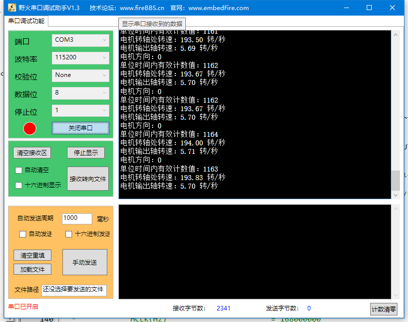

步进电机编码器测速实验
~~~~~~~~~~~~~~~~~~~~~~

本实验讲解如何使用STM32的编码器接口，并利用编码器接口对步进电机进行测速。学习本小节内容时，请打开配套的“步进电机编码器测速”工程配合阅读。

硬件设计
--------

本实验用到的步进电机与步进电机按键控制例程的相同，所以电机、开发板和驱动板的硬件连接也完全相同，只加上了编码器的连线。
关于编码器接口部分原理图及其说明与减速电机编码器相同，可以查看 :ref:`减速电机编码器测速实验` 章节相关内容。

软件设计
--------

本编码器测速例程是在步进电机按键控制例程的基础上编写的，这里只讲解跟编码器有关的部分核心代码，有些变量的设置，头文件的包含以及如何驱动步进电机等并没有涉及到，
完整的代码请参考本章配套的工程。我们创建了两个文件：bsp_encoder.c 和 bsp_encoder.h 文件用来存放编码器接口驱动程序及相关宏定义。

编程要点
^^^^^^^^^^^
1. 定时器 IO 配置
#. 定时器时基结构体TIM_HandleTypeDef配置
#. 编码器接口结构体TIM_Encoder_InitTypeDef配置
#. 通过编码器接口测量到的数值计算步进电机转速

软件分析
^^^^^^^^^^^

(1) 宏定义

.. code-block:: c
   :caption: bsp_encoder.h-宏定义
   :linenos:

    /* 定时器选择 */
    #define ENCODER_TIM                            TIM3
    #define ENCODER_TIM_CLK_ENABLE()  				     __HAL_RCC_TIM3_CLK_ENABLE()

    /* 定时器溢出值 */		
    #define ENCODER_TIM_PERIOD                     65535
    /* 定时器预分频值 */
    #define ENCODER_TIM_PRESCALER                  0      

    /* 定时器中断 */
    #define ENCODER_TIM_IRQn                       TIM3_IRQn
    #define ENCODER_TIM_IRQHandler                 TIM3_IRQHandler

    /* 编码器接口引脚 */
    #define ENCODER_TIM_CH1_GPIO_CLK_ENABLE()      __HAL_RCC_GPIOC_CLK_ENABLE()
    #define ENCODER_TIM_CH1_GPIO_PORT              GPIOC
    #define ENCODER_TIM_CH1_PIN                    GPIO_PIN_6
    #define ENCODER_TIM_CH1_GPIO_AF                GPIO_AF2_TIM3

    #define ENCODER_TIM_CH2_GPIO_CLK_ENABLE()      __HAL_RCC_GPIOC_CLK_ENABLE()
    #define ENCODER_TIM_CH2_GPIO_PORT              GPIOC
    #define ENCODER_TIM_CH2_PIN                    GPIO_PIN_7
    #define ENCODER_TIM_CH2_GPIO_AF                GPIO_AF2_TIM3

    /* 编码器接口倍频数 */
    #define ENCODER_MODE                           TIM_ENCODERMODE_TI12

    /* 编码器接口输入捕获通道相位设置 */
    #define ENCODER_IC1_POLARITY                   TIM_ICPOLARITY_RISING
    #define ENCODER_IC2_POLARITY                   TIM_ICPOLARITY_RISING

    /* 编码器物理分辨率 */
    #define ENCODER_RESOLUTION                     600

    /* 经过倍频之后的总分辨率 */
    #if ((ENCODER_MODE == TIM_ENCODERMODE_TI1) || (ENCODER_MODE == TIM_ENCODERMODE_TI2))
      #define ENCODER_TOTAL_RESOLUTION             (ENCODER_RESOLUTION * 2)  /* 2倍频后的总分辨率 */
    #else
      #define ENCODER_TOTAL_RESOLUTION             (ENCODER_RESOLUTION * 4)  /* 4倍频后的总分辨率 */
    #endif

宏定义的说明与减速电机章节相同，此处不再赘述。

(2) 定时器复用功能引脚初始化

.. code-block:: c
   :caption: bsp_encoder.c-定时器复用功能引脚初始化
   :linenos:

    /**
      * @brief  编码器接口引脚初始化
      * @param  无
      * @retval 无
      */
    static void Encoder_GPIO_Init(void)
    {
      GPIO_InitTypeDef GPIO_InitStruct = {0};

      /* 定时器通道引脚端口时钟使能 */
      ENCODER_TIM_CH1_GPIO_CLK_ENABLE();
      ENCODER_TIM_CH2_GPIO_CLK_ENABLE();

      /**TIM3 GPIO Configuration
      PC6     ------> TIM3_CH1
      PC7     ------> TIM3_CH2
      */
      /* 设置输入类型 */
      GPIO_InitStruct.Mode = GPIO_MODE_AF_PP;
      /* 设置上拉 */
      GPIO_InitStruct.Pull = GPIO_PULLUP;
      /* 设置引脚速率 */
      GPIO_InitStruct.Speed = GPIO_SPEED_FREQ_HIGH;

      /* 选择要控制的GPIO引脚 */
      GPIO_InitStruct.Pin = ENCODER_TIM_CH1_PIN;
      /* 设置复用 */
      GPIO_InitStruct.Alternate = ENCODER_TIM_CH1_GPIO_AF;
      /* 调用库函数，使用上面配置的GPIO_InitStructure初始化GPIO */
      HAL_GPIO_Init(ENCODER_TIM_CH1_GPIO_PORT, &GPIO_InitStruct);

      /* 选择要控制的GPIO引脚 */
      GPIO_InitStruct.Pin = ENCODER_TIM_CH2_PIN;
      /* 设置复用 */
      GPIO_InitStruct.Alternate = ENCODER_TIM_CH2_GPIO_AF;
      /* 调用库函数，使用上面配置的GPIO_InitStructure初始化GPIO */
      HAL_GPIO_Init(ENCODER_TIM_CH2_GPIO_PORT, &GPIO_InitStruct);
    }

定时器复用功能引脚初始化的说明与减速电机章节相同，此处不再赘述。

(3) 编码器接口配置

.. code-block:: c
   :caption: bsp_encoder.c-编码器接口配置
   :linenos:

    /**
      * @brief  配置TIMx编码器模式
      * @param  无
      * @retval 无
      */
    static void TIM_Encoder_Init(void)
    {
      TIM_Encoder_InitTypeDef Encoder_ConfigStructure;

      /* 使能编码器接口时钟 */
      ENCODER_TIM_CLK_ENABLE();

      /* 定时器初始化设置 */
      TIM_EncoderHandle.Instance = ENCODER_TIM;
      TIM_EncoderHandle.Init.Prescaler = ENCODER_TIM_PRESCALER;
      TIM_EncoderHandle.Init.CounterMode = TIM_COUNTERMODE_UP;
      TIM_EncoderHandle.Init.Period = ENCODER_TIM_PERIOD;
      TIM_EncoderHandle.Init.ClockDivision = TIM_CLOCKDIVISION_DIV1;
      TIM_EncoderHandle.Init.AutoReloadPreload = TIM_AUTORELOAD_PRELOAD_DISABLE;

      /* 设置编码器倍频数 */
      Encoder_ConfigStructure.EncoderMode = ENCODER_MODE;
      /* 编码器接口通道1设置 */
      Encoder_ConfigStructure.IC1Polarity = ENCODER_IC1_POLARITY;
      Encoder_ConfigStructure.IC1Selection = TIM_ICSELECTION_DIRECTTI;
      Encoder_ConfigStructure.IC1Prescaler = TIM_ICPSC_DIV1;
      Encoder_ConfigStructure.IC1Filter = 0;
      /* 编码器接口通道2设置 */
      Encoder_ConfigStructure.IC2Polarity = ENCODER_IC2_POLARITY;
      Encoder_ConfigStructure.IC2Selection = TIM_ICSELECTION_DIRECTTI;
      Encoder_ConfigStructure.IC2Prescaler = TIM_ICPSC_DIV1;
      Encoder_ConfigStructure.IC2Filter = 0;
      /* 初始化编码器接口 */
      HAL_TIM_Encoder_Init(&TIM_EncoderHandle, &Encoder_ConfigStructure);

      /* 清零计数器 */
      __HAL_TIM_SET_COUNTER(&TIM_EncoderHandle, 0);

      /* 清零中断标志位 */
      __HAL_TIM_CLEAR_IT(&TIM_EncoderHandle,TIM_IT_UPDATE);
      /* 使能定时器的更新事件中断 */
      __HAL_TIM_ENABLE_IT(&TIM_EncoderHandle,TIM_IT_UPDATE);
      /* 设置更新事件请求源为：定时器溢出 */
      __HAL_TIM_URS_ENABLE(&TIM_EncoderHandle);

      /* 设置中断优先级 */
      HAL_NVIC_SetPriority(ENCODER_TIM_IRQn, 5, 1);
      /* 使能定时器中断 */
      HAL_NVIC_EnableIRQ(ENCODER_TIM_IRQn);

      /* 使能编码器接口 */
      HAL_TIM_Encoder_Start(&TIM_EncoderHandle, TIM_CHANNEL_ALL);
    }

有关编码器接口配置的内容在减速电机章节已经说明，这里再重复说明一下编码器接口结构体TIM_Encoder_InitTypeDef的初始化。

首先需要设置编码器的倍频数，即成员EncoderMode，它可把编码器接口设置为2倍频或4倍频，我们将其设置为4倍频。

接下来对编码器接口输入通道进行配置，通道1的配置和通道2是一样的。

成员IC1Polarity在编码器模式中是用来设置输入信号是否反相的。设置为RISING表示不反相，FALLING表示反相。此成员与编码器的计数触发边沿无关，
只用来匹配编码器和电机的方向，当设定的电机正方向与编码器正方向不一致时不必更改硬件连接，直接在程序中修改IC1Polarity即可。

成员IC1Selection，用于选择输入通道，IC1可以是TI1输入的TI1FP1，也可以是从TI2输入的TI2FP1，我们这里选择直连（DIRECTTI），即TI1FP1映射到IC1，
在编码器模式下这个成员只能设置为DIRECTTI，其他可选值都是不起作用的。

成员IC1Prescaler和成员IC1Filter，我们需要对编码器的每个脉冲信号都进行捕获，所以设置成不分频。根据STM32编码器接口2倍频或4倍频的原理，
接口在倍频采样的过程中也会对信号抖动进行补偿，所以输入滤波器也很少会用到。

配置完编码器接口结构体后清零计数器，然后开启定时器的更新事件中断，并把更新事件中断源配置为定时器溢出，也就是仅当定时器溢出时才触发更新事件中断。
然后配置定时器的中断优先级并开启中断，最后启动编码器接口。

(4) 定时器溢出次数记录

.. code-block:: c
   :caption: bsp_encoder.c-定时器溢出次数记录
   :linenos:

    /**
      * @brief  定时器更新事件回调函数
      * @param  无
      * @retval 无
      */
    void HAL_TIM_PeriodElapsedCallback(TIM_HandleTypeDef *htim)
    {
      /* 判断当前计数器计数方向 */
      if(__HAL_TIM_IS_TIM_COUNTING_DOWN(&TIM_EncoderHandle))
        /* 下溢 */
        Encoder_Overflow_Count--;
      else
        /* 上溢 */
        Encoder_Overflow_Count++;
    }

定时器溢出次数记录的说明与减速电机章节相同，此处不再赘述。

(5) 主函数

.. code-block:: c
   :caption: main.c-主函数
   :linenos:

    /* 电机旋转方向 */
    __IO int8_t motor_direction = 0;
    /* 当前时刻总计数值 */
    __IO int32_t capture_count = 0;
    /* 上一时刻总计数值 */
    __IO int32_t last_count = 0;
    /* 单位时间内总计数值 */
    __IO int32_t count_per_unit = 0;
    /* 电机转轴转速 */
    __IO float shaft_speed = 0.0f;
    /* 累积圈数 */
    __IO float number_of_rotations = 0.0f;

    /**
      * @brief  主函数
      * @param  无
      * @retval 无
      */
    int main(void) 
    {
      int i = 0;
      
      /* 初始化系统时钟为168MHz */
      SystemClock_Config();
      /*初始化USART 配置模式为 115200 8-N-1，中断接收*/
      DEBUG_USART_Config();
      printf("欢迎使用野火 电机开发板 步进电机 编码器测速 例程\r\n");
      printf("按下按键1启动电机、按键2停止、按键3改变方向\r\n");	
      /* 初始化时间戳 */
      HAL_InitTick(5);
      /*按键初始化*/
      Key_GPIO_Config();	
      /*led初始化*/
      LED_GPIO_Config();
      /*步进电机初始化*/
      stepper_Init();
      /* 上电默认停止电机，按键1启动 */
      MOTOR_EN(OFF);
      /* 编码器接口初始化 */
      Encoder_Init();
      
      while(1)
      {
        /* 扫描KEY1，启动电机 */
        if(Key_Scan(KEY1_GPIO_PORT,KEY1_PIN) == KEY_ON)
        {
          MOTOR_EN(ON);
        }
        /* 扫描KEY2，停止电机 */
        if(Key_Scan(KEY2_GPIO_PORT,KEY2_PIN) == KEY_ON)
        {
          MOTOR_EN(OFF);
        }
        /* 扫描KEY3，改变方向 */
        if(Key_Scan(KEY3_GPIO_PORT,KEY3_PIN) == KEY_ON)
        {
          static int j = 0;
          j > 0 ? MOTOR_DIR(CCW) : MOTOR_DIR(CW);
          j=!j;
        }
        
        /* 20ms计算一次 */
        /* 电机旋转方向 = 计数器计数方向 */
        motor_direction = __HAL_TIM_IS_TIM_COUNTING_DOWN(&TIM_EncoderHandle);
        
        /* 当前时刻总计数值 = 计数器值 + 计数溢出次数 * ENCODER_TIM_PERIOD  */
        capture_count =__HAL_TIM_GET_COUNTER(&TIM_EncoderHandle) + (Encoder_Overflow_Count * ENCODER_TIM_PERIOD);
        
        /* 单位时间内总计数值 = 当前时刻总计数值 - 上一时刻总计数值 */
        count_per_unit = capture_count - last_count;
        
        /* 转轴转速 = 单位时间内的计数值 / 编码器总分辨率 * 时间系数  */
        shaft_speed = (float)count_per_unit / ENCODER_TOTAL_RESOLUTION * 50 ;
        
        /* 累积圈数 = 当前时刻总计数值 / 编码器总分辨率  */
        number_of_rotations = (float)capture_count / ENCODER_TOTAL_RESOLUTION;

        /* 记录当前总计数值，供下一时刻计算使用 */
        last_count = capture_count;
        
        if(i == 50)/* 1s报告一次 */
        {
          printf("\r\n电机方向：%d\r\n", motor_direction);
          printf("单位时间内有效计数值：%d\r\n", (count_per_unit<0 ? abs(count_per_unit) : count_per_unit));
          printf("步进电机转速：%.2f 转/秒\r\n", shaft_speed);
          printf("累计圈数：%.2f 圈\r\n", number_of_rotations);
          i = 0;
        }
        delay_ms(20);
        i++;
      }
    } 	

本实验的主函数与步进电机按键调速基本相同，在初始化的时候调用Encoder_Init函数，初始化和配置STM32的编码器接口。

最大的差别就是在while循环中加入了数据计算的部分。如上代码所示，首先定义了一些全局变量，用来保存计算数据和供其他函数使用。
在while循环中加入了一个20ms的延时，每执行一次while循环就采集数据和计算，
由于使用了在while循环中延时的方法，单位时间会有波动，不过波动很小，不影响本实验的结果。
如果很在意数据稳定性，可以使用减速电机 :ref:`减速电机编码器测速实验` **数据计算** 章节在SysTick中断回调函数中采集和计算数据的方式。

在采集数据和计算时，先检测电机旋转方向，直接读取当前时刻的计数器计数方向就可获得方向，向上计数为正向，向下计数为反向。

接着是测量当前时刻的总计数值，根据总计数值计算电机转速，在本例程中我们使用M法进行测速，单位时间内的计数值除以编码器总分辨率即可得到单位时间内的电机转速，
代码中单位时间为20ms，单位时间内的计数值由当前时刻总计数值count_per_unit减上一时刻总计数值last_Count得到，编码器总分辨率由编码器物理分辨率乘倍频数得到，
这里算出来的电机转速单位是转/百毫秒，转到常用的单位还需要乘上一个时间系数，比如转/秒就乘50,此时计算出的速度就是步进电机的速度。

所有数据全部采集和计算完毕后，将电机方向、单位时间内的计数值、电机转轴转速和电机输出轴转速等数据全部通过串口打印到窗口调试助手上，
并将当前的总计数值记录下来方便下次计算使用。

下载验证
--------

保证开发板相关硬件连接正确，用USB线连接开发板“USB转串口”接口跟电脑，在电脑端打开串口调试助手，把编译好的程序下载到开发板，串口调试助手会显示程序输出的信息。
我们通过开发板上的三个按键控制电机加减速和方向，在串口调试助手的接收区即可看到电机转速等信息。

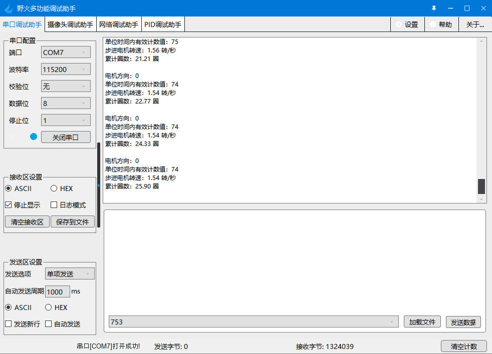