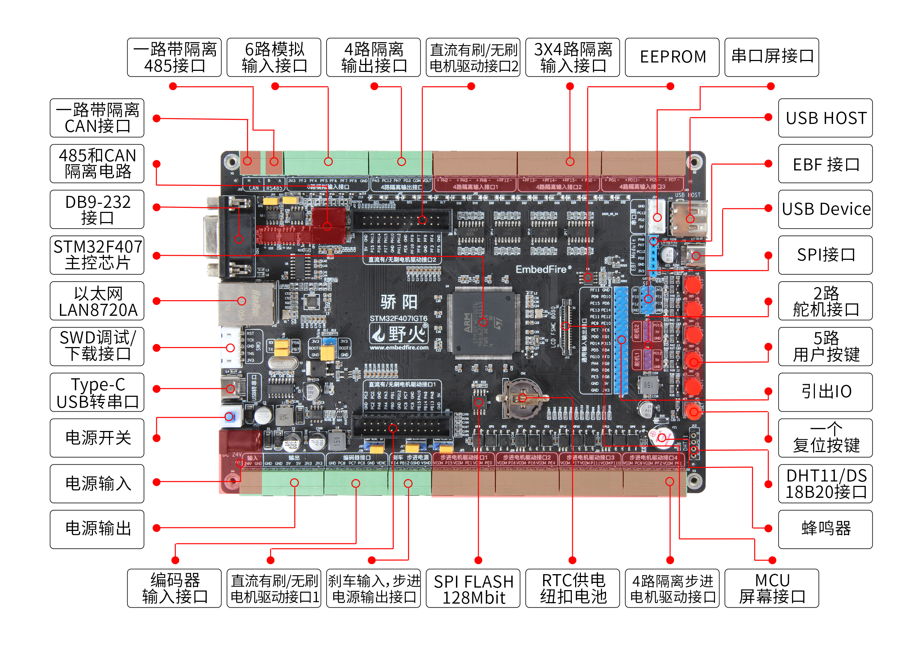
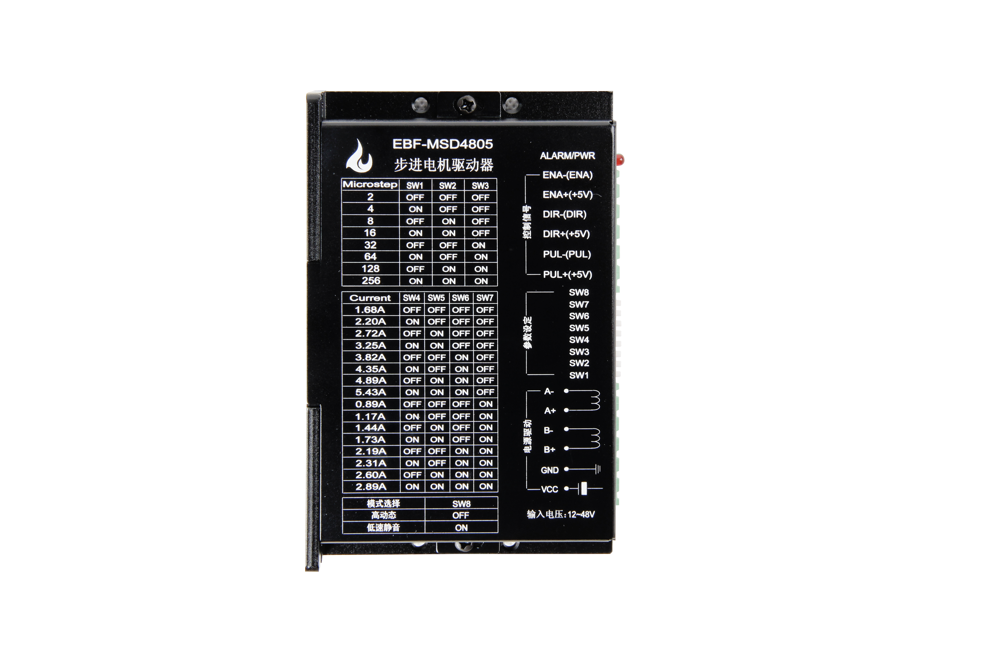
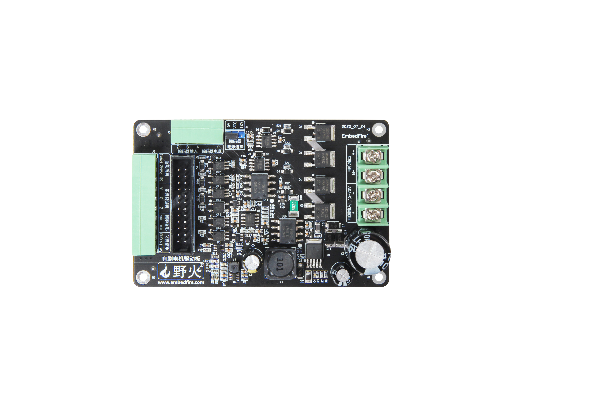

.. vim: syntax=rst

前言
==========================================

关于本书
------------------------------------------
电动机（Motor）是用来把电能转换为机械能的电气设备，俗称马达，其主要作用是产生驱动力矩，
作为用电器或小型机械的动力能源。随着技术的发展电机在速度、转矩和位置的得以精确的控制，
使得电动机在实际应用中非常广泛，生活中随处可见，在我们的打印机、雕刻机、智能家居和控制机械等等都有电机的身影，
电动机也是他们不可或缺的一部分。本书分为两个部分来从原理到驱动方法再到应用的为大家讲解电机的控制。

第一部分为基础部分，该部分对于各种电机的组成原理、驱动方法以及什么是编码器、
驱动器都进行了详细的讲解，以及如何实现简单的开环控制；电机会分为直流、步进以及舵机单独进行讲解，
每种电机会先讲解其工作原理和驱动方法，在了解其工作原理和驱动方法后，我们再通过编程来让电机转起来。

本书第二部分为提高部分 ，主要讲解高级的电机控制使用方法和源码的讲解，这部分从实践的角度出发，
不仅有理论的推导，还有从理论到实践的全过程，将理论知识用到电机应用开发，对于什么是闭环控制系统，
PID参数怎样整定，步进电机的高级应用，这部分都会讲解，从而真正意义上的玩转电机应用。

本书的参考资料
--------------------------------------------
野火《STM32 HAL库开发实战指南》

ST-MCU《xxx参考手册》（各芯片）

汤蕴璆《电机学》

谭建成《永磁无刷直流电机技术》

叶金虎《现代无刷直流永磁电动机的原理和设计》

胡寿松《自动控制原理》

本书的配套硬件
--------------------------------------------
本书配套开发板为野火F407骄阳电机开发板，本书的各项例程都是基于此款开发板，并搭配野火推出的电机驱动进行编写和适配（野火还推出了H743繁星电机开发板和F103拂晓电机开发板）。对于使用其它开发板进行学习的同学可以对本书的内容进行参考和借鉴。如果使用的是野火推出的开发板，我们已经完成了大部分电机程序的适配工作。

下图为大家展示野火F407骄阳电机开发板的硬件资源：

F407骄阳硬件资源

本书中使用到的其他配套硬件：

野火步进电机驱动器

野火直流有刷驱动板

   
野火直流无刷驱动板

.. image:: ../media/yh_dc_brush_motor_mos_h.png
   :align: center
   :alt: 野火无刷电机驱动板
   :name: 野火直流无刷驱动板

对于配套的电机，根据大家的实际情况各取所需，这里就不为大家一一展示了。野火例程使用的各种实验配套的电机，可以在野火官方店铺与电机开发板一起购买到。

常见使用问题见教程末尾。