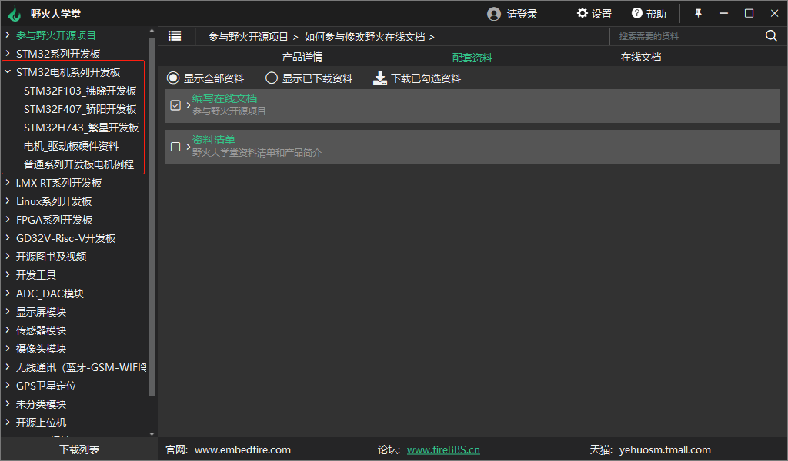
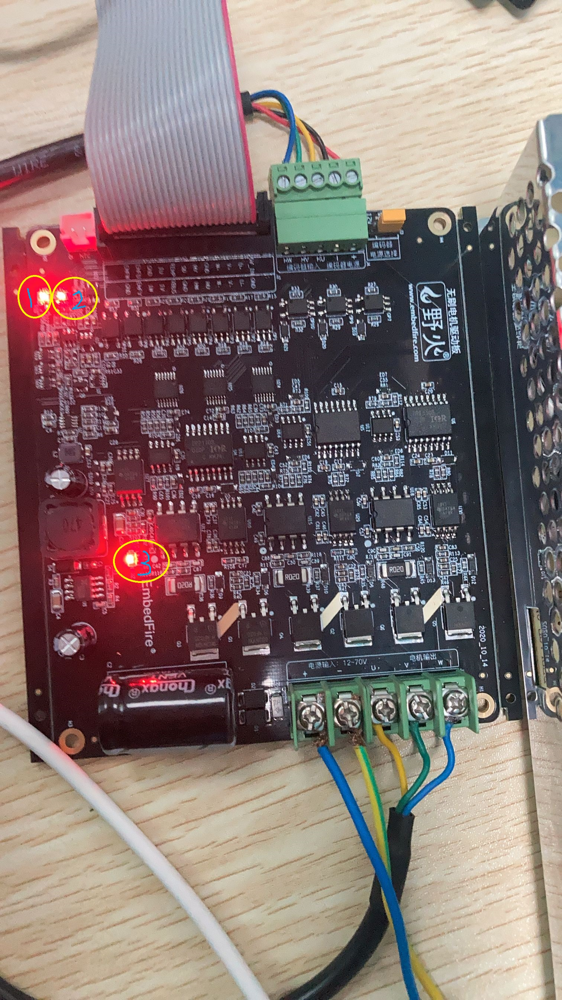
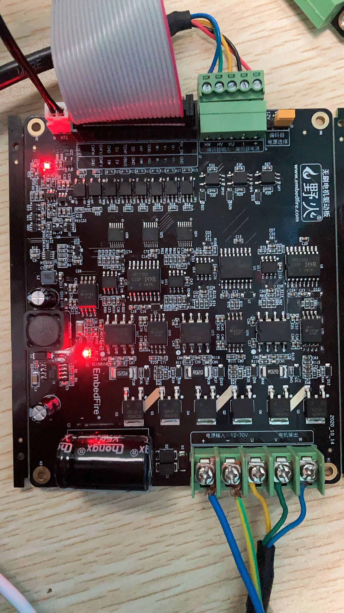
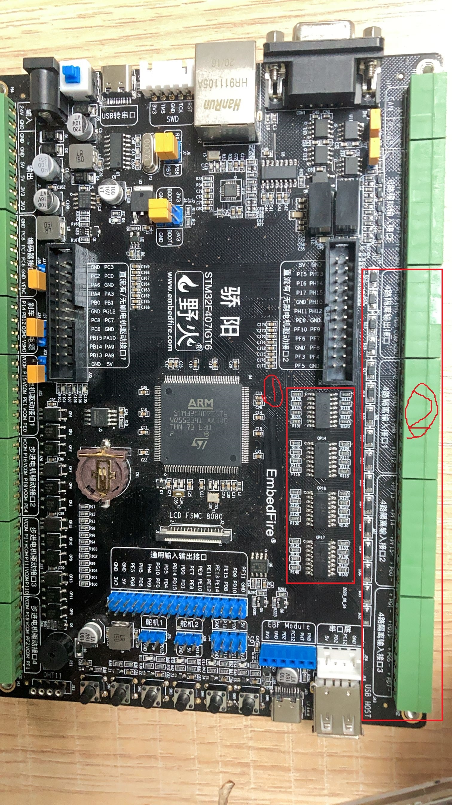

电机使用常见问题说明
====================================

Q:  我应该在那里下载到最新的资料？
~~~~~~~~~~~~~~~~~~~~~~~~~~~~~~~~~~~~~~~~~~~~~~~~~~~~~~~~~~~~~~~~~~~~~~~~~~~~~~~~~~~

大学堂下载链接：https://cloud.embedfire.com/software/FireClass/package/fireClass-Installer-x64-v1.0.2.7.exe

网盘链接链接：https://ebf-products.readthedocs.io/zh_CN/latest/stm32_motor/index.html

推荐您使用大学堂下载，下载速度更快。

大学堂具体目录见：

Q:  电机驱动板或主控板损坏后怎么办？
~~~~~~~~~~~~~~~~~~~~~~~~~~~~~~~~~~~~~~~~~~~~~~~~~~~~~~~~~~~~~~~~~~~~~~~~~~~~~~~~~~~

请通过淘宝客服联系我们。

我们免费提供维修服务，但将根据损坏程度决定是否需要收取一定材料费。

Q:  繁星开发板为何没有提供FOC例程？
~~~~~~~~~~~~~~~~~~~~~~~~~~~~~~~~~~~~~~~~~~~~~~~~~~~~~~~~~~~~~~~~~~~~~~~~~~~~~~~~~~~

我们FOC例程基于ST的MC SDK5.4.4版本，该版本暂不支持M7内核，当ST官方更新后，我们也会进行更新。

Q:  使用PMSM(永磁同步电机)运行BLDC的六步换向方法的基础部分例程，需要注意什么？
~~~~~~~~~~~~~~~~~~~~~~~~~~~~~~~~~~~~~~~~~~~~~~~~~~~~~~~~~~~~~~~~~~~~~~~~~~~~~~~~~~~

非PID例程可以正常运行，PID控制例程需要修改更新电机速度计算，BLDC旋转一圈是12个脉冲，PMSM是24个。

Q:  为什么我烧录有刷电机例程后电机无法转起来？
~~~~~~~~~~~~~~~~~~~~~~~~~~~~~~~~~~~~~~~~~~~~~~~~~~~~~~~~~~~~~~~~~~~~~~~~~~~~~~~~~~~

有刷电机无法旋转，常见原因如以下：
 - 电机与驱动板，主控机接线出错
 - 主控板烧录错程序
 - 启动方式不对，魔法棒设置Flash Download时没有勾选 Reset and Run
 - 出现过流，过压，欠压等触发电机保护的现象

如果以上情况排除后依然无法旋转，请联系我们。

Q:  为什么我烧录无刷电机FOC例程后电机无法转起来？
~~~~~~~~~~~~~~~~~~~~~~~~~~~~~~~~~~~~~~~~~~~~~~~~~~~~~~~~~~~~~~~~~~~~~~~~~~~~~~~~~~~

无刷电机无法旋转，常见原因如以下：
 - 电机与驱动板，主控机接线出错，比如六步换向使用的配套开发板无刷接口2，但是FOC均采用无刷接口1
 - 出现过流，过压，欠压等触发电机保护的现象
 - 配套驱动板没有接温度传感器
 - PMSM传感器选择错误，配套的PMSM有霍尔传感器与编码器两种

如果以上情况排除后依然无法旋转，请联系我们。

Q:  为什么使用主控板的ADC功能测试无刷驱动板的电源电压误差很大？
~~~~~~~~~~~~~~~~~~~~~~~~~~~~~~~~~~~~~~~~~~~~~~~~~~~~~~~~~~~~~~~~~~~~~~~~~~~~~~~~~~~

先弄清楚是主控板的ADC测量不准，还是驱动板的分压不对
 - 检测主控板上的基准电压（VREF+与VREF-）是不是3.3V，如果不是，可能主控板外接的外设较多，USB供电不足，需要接上DC电源。
 - 测量主控板无刷接口1或者2上面的对应的引脚(原理图标号Motor_VBUS)电平，驱动板的分压应该是电源电压的37分之一再加上1.24V，如果不对，说明驱动板工作不正常。

如果以上情况排除后依然不准确，请联系我们。

Q:  如何快速了解电机驱动板的使用方法？
~~~~~~~~~~~~~~~~~~~~~~~~~~~~~~~~~~~~~~~~~~~~~~~~~~~~~~~~~~~~~~~~~~~~~~~~~~~~~~~~~~~

我们在开发板配套资料提供了接线演示视频和原理图等资料。

Q: 配套的BLDC的反电势是正弦波还是梯形波？
~~~~~~~~~~~~~~~~~~~~~~~~~~~~~~~~~~~~~~~~~~~~~~~~~~~~~~~~~~~~~~~~~~~~~~~~~~~~~~~~~~~

我们配套的BLDC电机反电势是正弦波。

Q: 反电势是梯形波的BLDC可以使用FOC驱动吗？
~~~~~~~~~~~~~~~~~~~~~~~~~~~~~~~~~~~~~~~~~~~~~~~~~~~~~~~~~~~~~~~~~~~~~~~~~~~~~~~~~~~

当然可以，只是效率上会比反电势为正弦波的BLDC电机低一些。

Q: 无刷驱动板上的LED分别代表什么意思？
~~~~~~~~~~~~~~~~~~~~~~~~~~~~~~~~~~~~~~~~~~~~~~~~~~~~~~~~~~~~~~~~~~~~~~~~~~~~~~~~~~~

无刷驱动板上共有三个LED灯

三个灯状态如下：
 - 1.代表触发过流保护
 - 2.代表与主控板接通
 - 3.代表与无刷驱动板的电源接通

所以正常运行时，是只有两个灯亮的，如下图

当三个灯都亮了，说明触发了过流保护状态

Q： 板载的许多隔离芯片对通信有什么影响？
~~~~~~~~~~~~~~~~~~~~~~~~~~~~~~~~~~~~~~~~~~~~~~~~~~~~~~~~~~~~~~~~~~~~~~~~~~~~~~~~~~~

只有标注的隔离输出与隔离输入接口使用了低速光耦隔离，其他隔离都是高速隔离，通信速度达10M。
低速光耦以骄阳开发板举例子见图如下:

第一处为低速隔离芯片

第二处为低速隔离芯片对应的接口

Q: 野火步进电机在售的有那些？
~~~~~~~~~~~~~~~~~~~~~~~~~~~~~~~~~~~~~~~~~~~~~~~~~~~~~~~~~~~~~~~~~~~~~~~~~~~~~~~~~~~

分两类

开环：42 57 86
闭环：57

Q: 电机的力量有多大？
~~~~~~~~~~~~~~~~~~~~~~~~~~~~~~~~~~~~~~~~~~~~~~~~~~~~~~~~~~~~~~~~~~~~~~~~~~~~~~~~~~~

转速越高转矩越小，可供参考的是保持转矩

比如步进电机，具体的参数是

42：0.46NM 57：1.3NM 86：3.04NM

其他电机您可以在配套资料中找到电机的规格书查看

Q: 为什么拂晓开发板没有预留SPI接口？
~~~~~~~~~~~~~~~~~~~~~~~~~~~~~~~~~~~~~~~~~~~~~~~~~~~~~~~~~~~~~~~~~~~~~~~~~~~~~~~~~~~

因为拂晓主控为F103VET6，IO口资源较少，没有预留硬件SPI接口，但是可以使用软件模拟。

软件模拟SPI可以参考我们的模块配套例程，部分例程使用软件SPI模拟，包括ADC模块

Q: 配套的电机使用现象与例程描述不符合怎么办？
~~~~~~~~~~~~~~~~~~~~~~~~~~~~~~~~~~~~~~~~~~~~~~~~~~~~~~~~~~~~~~~~~~~~~~~~~~~~~~~~~~~

您可以在论坛发贴，寻求帮助来查找原因。

工作时间内，也可以联系我们淘宝客服，我们有技术支持会协助您查找原因。

Q：配套的电机主控板如何使用液晶屏？
~~~~~~~~~~~~~~~~~~~~~~~~~~~~~~~~~~~~~~~~~~~~~~~~~~~~~~~~~~~~~~~~~~~~~~~~~~~~~~~~~~~

很遗憾，因为LTDC或LCD接口与无刷电机接口有所冲突，所以建议您使用串口屏。

虽然我们不售串口屏，但已经预留了串口屏接口，您可以在其他商店买到它。

Q：我已经有非电机系列的野火STM32开发板，学习本教程一定要购买电机系列的开发板吗？
~~~~~~~~~~~~~~~~~~~~~~~~~~~~~~~~~~~~~~~~~~~~~~~~~~~~~~~~~~~~~~~~~~~~~~~~~~~~~~~~~~~

不一定，主控芯片一样的情况下，可以直接使用我们的例程，只是接线会不方便一下。

Q：学习本教程需要那些前置知识？
~~~~~~~~~~~~~~~~~~~~~~~~~~~~~~~~~~~~~~~~~~~~~~~~~~~~~~~~~~~~~~~~~~~~~~~~~~~~~~~~~~~

推荐先看HAL库教程，至少掌握STM32的IO的打开与关闭，还有定时器的使用。

Q：如果我发现代码与文档有不恰当或者错误，该如何联系你们？
~~~~~~~~~~~~~~~~~~~~~~~~~~~~~~~~~~~~~~~~~~~~~~~~~~~~~~~~~~~~~~~~~~~~~~~~~~~~~~~~~~~

您可以直接给淘宝客服留言，工作时间内我们看到会进行更正。

Q: 为什么打开FOC相关.ioc文件失败？
~~~~~~~~~~~~~~~~~~~~~~~~~~~~~~~~~~~~~~~~~~~~~~~~~~~~~~~~~~~~~~~~~~~~~~~~~~~~~~~~~~~

打不开这.ioc是因为cubemx的资源路径下没有相关的资源

打开一个*.stmcx文件，点击生成代码的按钮，然后点击UPDATA按钮，更新代码。

.. image:: media/常见问题/打开.ioc文件失败.jpg
   :align: center
   :alt: 打开.ioc文件失败

等待生成完成后就可以打开.ioc了。

生成或更新代码MotorControl Workbench 5.4.4会吧资源复制过去，这样就能打开了。

（祝各位学习一切顺利）
~~~~~~~~~~~~~~~~~~~~~~~~~~~~~~~~~~~~~~~~~~~~
